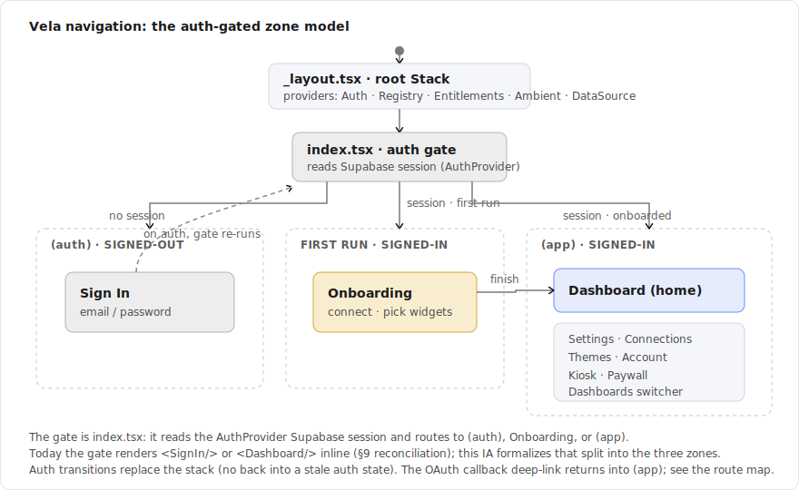
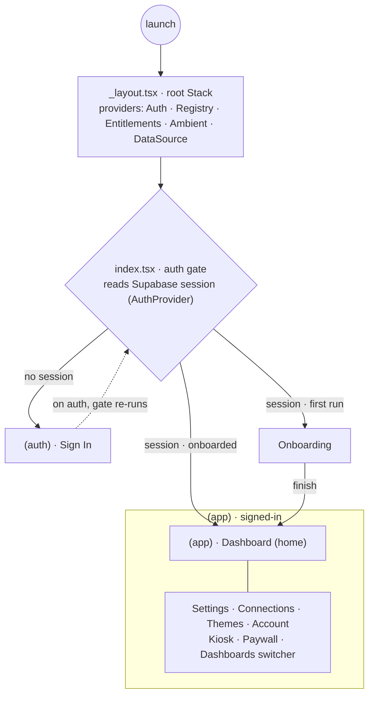
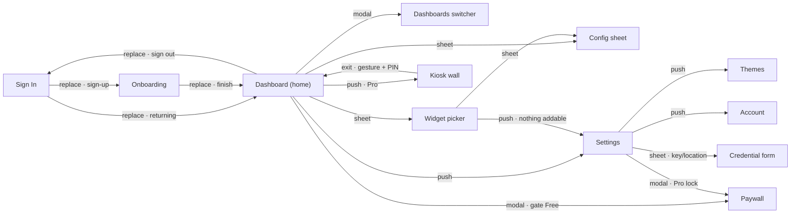
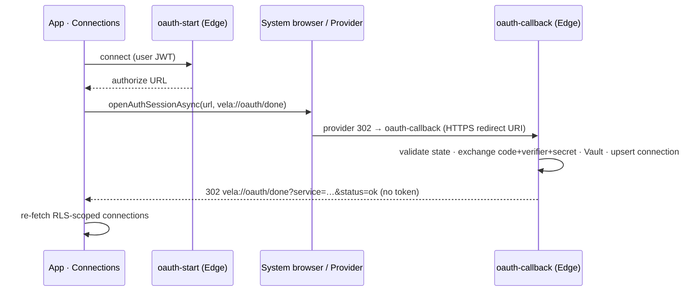

# Spec: App Navigation / Information Architecture

> Status: draft for review, 2026-06-30. Tracked by [AOD-17](https://linear.app/thexap/issue/AOD-17) (`type:spec`, `area:app` + `area:design-system`; milestone DS-M1 "Brand & Tokens", project Design System). Defines the app's navigation model and the complete screen inventory once, so the core-screen and per-feature designs are **applications** of it, not redesigns. It closes the last open DS-M1 issue and unblocks [AOD-21](https://linear.app/thexap/issue/AOD-21) (core navigation / IA screens), informing [AOD-27](https://linear.app/thexap/issue/AOD-27) / [AOD-28](https://linear.app/thexap/issue/AOD-28) / [AOD-29](https://linear.app/thexap/issue/AOD-29).
>
> **Medium.** Per the repo `type:spec` convention this is an in-repo markdown doc plus rendered SVG diagrams in [`docs/specs/assets/`](assets/) (with collapsible Mermaid/source), not a Figma file. The AOD-17 issue already names the output as `docs/specs/app-ia.md`.
>
> **What this fixes, and what it must not touch.** It fixes the **navigation model** (the expo-router tree, the auth-gated split, the modal/sheet/screen presentation rule, the route names and params), the **complete screen inventory** (every surface, its home, and its entry points), the **routes connecting them** (who navigates where, back-stack behavior), and the **OAuth callback deep-link**. It does **not** design the screen visuals (those are [AOD-21](https://linear.app/thexap/issue/AOD-21) / [AOD-27](https://linear.app/thexap/issue/AOD-27) / [AOD-28](https://linear.app/thexap/issue/AOD-28) / [AOD-29](https://linear.app/thexap/issue/AOD-29)), and it does **not** scaffold the routes in code (a future `type:tech-task`). It designs **for** the scaffolded expo-router routes that exist today and flags every extension **additively** (§9).

## 1. Purpose and scope

The app already runs on three expo-router routes ([`apps/app/app/`](../../apps/app/app)): a root layout, an auth-gated index, and a settings screen. The product, though, has many more surfaces: a dashboard and its free-form editor, a widget picker, a per-instance config sheet, connections with three connect affordances, onboarding, kiosk, a paywall, themes, an account screen, a dashboards switcher, and the OAuth callback. This spec is the keystone that names **all** of them once, places each in the expo-router tree, and fixes the routes between them, so the screen designs that follow lay out a fixed IA rather than inventing their own.

It is the navigation counterpart to [`design-component-library.md`](design-component-library.md): that doc fixed the components every screen composes from; this doc fixes the surfaces those components fill and how a user moves between them.

**In scope (the AOD-17 "Must cover" plus the product surfaces):**

- **The expo-router structure**: the stack/group tree, the auth-gated root split, modal vs screen vs sheet presentation, and the route names and params (§4).
- **The full screen inventory**: every surface, its home in the tree, and its entry points (§5), with the six Must-cover entry points (connect-service, add-widget, create-dashboard, enter-kiosk, themes, account) mapped explicitly (§7).
- **The routes connecting them**: who navigates where, back-stack behavior, and what is a modal/sheet versus a pushed screen (§6).
- **Deep-link handling for the OAuth callback** (the one nav-critical integration piece), plus the other deep links named as seams (§8).
- **A reconciliation note**: the current `apps/app/app/` routes versus the specced inventory, with every gap named for the build tech-task (§9).

**Out of scope (named so the frame is clear):**

- **The screen visual designs** that lay out this IA: [AOD-21](https://linear.app/thexap/issue/AOD-21) (core navigation / IA screens), [AOD-27](https://linear.app/thexap/issue/AOD-27) (dashboard + free-form editor), [AOD-28](https://linear.app/thexap/issue/AOD-28) (settings + connections), [AOD-29](https://linear.app/thexap/issue/AOD-29) (onboarding), and the paywall visual. This spec fixes where each lives and how it is reached, not how it looks.
- **The component library** ([AOD-20](https://linear.app/thexap/issue/AOD-20), Done) the screens compose, and the **widget visual system** ([AOD-37](https://linear.app/thexap/issue/AOD-37), Done) the dashboard frames.
- **Kiosk behavior mechanics** ([AOD-11](https://linear.app/thexap/issue/AOD-11), Done) beyond placing the kiosk entry and route: keep-awake, the dim curve, pinning, the exit-lock internals stay AOD-11's.
- **Entitlement math** ([AOD-12](https://linear.app/thexap/issue/AOD-12), Done) beyond placing the paywall entry and the `Gate`: tier values, the webhook, enforcement points stay AOD-12's.
- **OAuth broker internals** ([AOD-9](https://linear.app/thexap/issue/AOD-9), Done) beyond the callback deep-link: token exchange, refresh, Vault, the proxy stay AOD-9's.
- **Scaffolding the routes in code**: a future `type:tech-task` builds the tree this spec defines.

## 2. Locked context this builds on

| Source | What it locks | How this spec uses it |
|---|---|---|
| [AOD-16](https://linear.app/thexap/issue/AOD-16) / product vision | **expo-router** is the locked nav library; Expo + TypeScript. | The whole tree is expressed in expo-router file conventions (groups, layouts, presentation options). Not re-decided. |
| [`apps/app/app/`](../../apps/app/app) (scaffolded) | The three real routes: `_layout.tsx` (root Stack + provider stack), `index.tsx` (auth gate: signed-out → SignIn, signed-in → Dashboard), `settings.tsx`. | §4 designs for these; §9 reconciles the target tree against them additively. |
| [`AuthProvider.tsx`](../../apps/app/src/auth/AuthProvider.tsx) | The gate's input: the Supabase session and a `loading` flag, kept live via `onAuthStateChange`. | The gate (§4.2) reads this; auth transitions key off it. Unchanged. |
| [AOD-8](https://linear.app/thexap/issue/AOD-8) / [`architecture-registry.md`](architecture-registry.md) | The services → widgets → layout three-layer model; the add-widget picker offers `addableWidgets(connected)`; the per-instance config entry; "new integration = registration only, zero layout edits." | The dashboard, the widget picker, the config sheet, and the connections list are all generic over the registry; the IA preserves that seam (they name no service). |
| [AOD-9](https://linear.app/thexap/issue/AOD-9) / [`oauth-token-model.md`](oauth-token-model.md) §6, §7 | `oauth-start` / `oauth-callback` Edge Functions; the callback returns a deep-link to the app scheme carrying a success signal only, never a token; non-OAuth connect (`credentials-store`). | §8 specifies the `vela://oauth/done` callback route and the two-redirect-URI model. |
| [AOD-11](https://linear.app/thexap/issue/AOD-11) / [`kiosk-mode.md`](kiosk-mode.md) §4 | Kiosk is entered from a layout (Settings or a Start-Kiosk action), is a Pro feature, and is exited by a gesture + PIN; the OS back is not a casual exit. | §5/§7 place the kiosk **entry** and the kiosk **route**; the exit lock shapes the back-stack rule (§6). Mechanics stay AOD-11's. |
| [AOD-12](https://linear.app/thexap/issue/AOD-12) / [`entitlement-model.md`](entitlement-model.md) §7, §9 | The `Gate` (UX-only) and the enforcement points; every Pro-gated control leads with the 7-day-trial paywall. | §5/§7 place the **paywall route** and the `Gate` entries; the tier math stays AOD-12's. |
| [`data-model.md`](data-model.md) §5.4 | `dashboards` (a user's named layouts, ordered by `position`); `user_settings.theme`. | The create/switch-dashboard surface (§5) and the themes surface read these. |
| [`design-component-library.md`](design-component-library.md) ([AOD-20](https://linear.app/thexap/issue/AOD-20)) | The app-chrome components (buttons, inputs, sheets/modals, the Pro-lock overlay) and the `scrim + elevation.overlay` modal treatment. | The presentation rule (§4.4) maps onto these component types; the screen designs compose them. |
| [`engineering-process.md`](engineering-process.md) | The `type:spec` lifecycle, the `docs/specs/` convention, the spec-diagram convention (rendered SVG + collapsible source). | This deliverable follows it; §8/§10 hand the build to a `type:tech-task`. |

Nothing here re-opens a locked decision. Where a value or a flow is owned by a Done spec, this doc references it and places its **entry point and route**, not its internals.

## 3. The navigation model: auth-gated zones

The product is a single-account app with one hard split: **signed-out** sees exactly one surface (sign in), **signed-in** sees everything else. That split is the spine of the IA. Everything signed-in lives in one zone; a thin first-run gate routes a brand-new user through onboarding before the dashboard.



<details>
<summary>Mermaid source</summary>



</details>

The three zones:

1. **`(auth)` — signed-out.** One surface: **Sign In**. Reached whenever there is no Supabase session. The only way out is authenticating, which makes the gate re-run.
2. **Onboarding — first run, signed-in.** A signed-in user who has not completed first-run setup (no connected services / never onboarded). Reached from the gate on first sign-up and left by finishing into the dashboard. Modeled as a gated surface inside the signed-in zone, not a third group, because an onboarding user already has a session.
3. **`(app)` — signed-in, onboarded.** Every other surface: the Dashboard (home) and from it Settings, Connections, Themes, Account, Kiosk, the Paywall, and the dashboards switcher.

The gate is `app/index.tsx`. Today it renders `<SignIn/>` or `<Dashboard/>` inline off `useAuth()` (with a splash while `loading`). This IA keeps that exact logic and only makes the zones explicit in the route tree (§4, §9), adding the first-run check. **Auth transitions replace the stack** so a user never lands back in a stale auth state with the OS back gesture (§6).

## 4. The expo-router structure

### 4.1 The tree

expo-router is file-based: a file under `app/` is a route, a folder is a segment, a `(name)` folder is a **group** that organizes routes and shares a layout without adding a path segment, and `_layout.tsx` declares the navigator (a Stack here) for its level. The target tree, marked against what exists today:


<details>
<summary>Route tree source (apps/app/app/)</summary>

```
app/
  _layout.tsx                 [EXISTS]  Root Stack + provider stack
  index.tsx                   [EVOLVE]  auth gate: Redirect by (session, onboarded)
  oauth/
    done.tsx                  [ADD]     OAuth callback target · vela://oauth/done
  (auth)/                               signed-out group
    _layout.tsx               [ADD]     auth Stack
    sign-in.tsx               [ADD]     SignIn component exists; gains a route
  (app)/                                signed-in group, session-guarded
    _layout.tsx               [ADD]     signed-in Stack + session guard (Redirect if no session)
    index.tsx                 [MOVE]    Dashboard (home)
    onboarding.tsx            [ADD]     first-run flow (AOD-29)
    dashboards.tsx            [ADD]     create / switch dashboard · presentation: modal
    paywall.tsx               [ADD]     upgrade / paywall (AOD-12) · presentation: modal
    kiosk.tsx                 [ADD]     kiosk wall (AOD-11) · fullscreen, chrome hidden
    settings/
      index.tsx               [EXISTS]  Settings home + Connections (today app/settings.tsx)
      themes.tsx              [ADD]     theme picker
      account.tsx             [ADD]     account

In-screen sheets — NOT routes (RN <Modal> owned by a parent screen; carry a live object):
  WidgetPicker                add-widget · over Dashboard
  ConfigureInstance/ConfigForm  per-instance config · over Dashboard
  CredentialForm              API key / location entry · over Settings → Connections
```

</details>

### 4.2 The root layout and the gate

[`app/_layout.tsx`](../../apps/app/app/_layout.tsx) stays as scaffolded: a single root `Stack` (`headerShown: false`) wrapping the provider stack (`AuthProvider`, `RegistryProvider`, `CustomerInfoProvider`, `WidgetDataSourceProvider`, `AmbientProvider`, plus the query and gesture roots). The app draws its own chrome with the [AOD-20](https://linear.app/thexap/issue/AOD-20) components, so `headerShown: false` is correct app-wide; per-screen options (modal, fullscreen, gesture lock) are set on individual `Stack.Screen` entries.

`app/index.tsx` is the **gate**. It reads `useAuth()` and routes:

- `loading` → the splash (the existing `ActivityIndicator`), so nothing flashes before the session resolves.
- no `session` → `(auth)/sign-in`.
- `session` and not yet onboarded → `(app)/onboarding`.
- `session` and onboarded → `(app)` (the Dashboard at `(app)/index.tsx`).

The "onboarded" signal is a small persisted flag (a `user_settings.preferences` key, [`data-model.md`](data-model.md) §5.7, or local state seeded by the first successful connect); choosing its exact home is a build detail, not an IA decision. The gate uses `<Redirect>` (declarative, replace semantics) rather than imperative navigation, so the URL and the back-stack stay correct on a cold deep-link into any signed-in route.

### 4.3 The signed-in guard

`(app)/_layout.tsx` is a `Stack` that also guards the zone: if there is no session it issues `<Redirect href="/sign-in" />`. This is the same gate predicate as §4.2, enforced at the group boundary so that a deep-link straight to `(app)/settings` or `(app)/kiosk` cannot bypass auth. The `(auth)/_layout.tsx` is the symmetric, minimal Stack for the one signed-out screen. This group split is the idiomatic expo-router expression of the inline `session ? <Dashboard/> : <SignIn/>` the gate does today; §9 records it as an additive refactor, not a behavior change.

### 4.4 Presentation: pushed screen vs modal route vs in-screen sheet

Three presentation kinds, chosen by one question: **does the surface carry a live object from a parent screen?**

| Kind | expo-router expression | When | Surfaces |
|---|---|---|---|
| **Pushed screen** | a `Stack` route; default push | A full surface with its own back entry, deep-linkable, parameterized only by route params. | Sign In, Onboarding, Dashboard, Settings, Themes, Account, Kiosk (fullscreen variant). |
| **Modal route** | a `Stack.Screen` with `presentation: 'modal'` | An app-global surface that wants the OS modal treatment and is deep-linkable, but is not tied to a live parent object. | Paywall, Dashboards switcher. |
| **In-screen sheet** | a React Native `<Modal>` / bottom sheet, owned by the parent screen's state — **not** a router route | An ephemeral surface **parameterized by a live object** from the parent (a `WidgetInstance`, a `ServiceDefinition`). | Widget picker, per-instance config, credential form. |

The sheets stay off the router on purpose. The widget picker needs the active dashboard; the config sheet needs the specific `WidgetInstance` object; the credential form needs the service definition and its `authClass`. These are live objects, not serializable route params, and the surfaces have no meaningful deep-link or back-stack identity of their own. They are already built this way ([`WidgetPicker.tsx`](../../apps/app/src/layout/WidgetPicker.tsx), [`ConfigureInstanceModal.tsx`](../../apps/app/src/layout/ConfigureInstanceModal.tsx), [`ConfigFormModal.tsx`](../../apps/app/src/widgets/ConfigFormModal.tsx)), driven by their parent screen's local state, and they read the registry so they name no service (the AOD-8 seam). The IA endorses that: they are **sheets over their owning screen**, designed as overlays in that screen's design and composed from the AOD-20 sheet/modal component, not promoted to global routes.

### 4.5 Route names and params

| Route | Params | Notes |
|---|---|---|
| `(auth)/sign-in` | none | |
| `(app)/` (index) | none | The Dashboard renders the user's active dashboard (app/persisted state, not a route param in v1). |
| `(app)/onboarding` | none | |
| `(app)/dashboards` | none | Switcher reads the `dashboards` table; create is an action. Modal. |
| `(app)/kiosk` | `dashboardId` | Which layout to mount as the wall ([AOD-11](https://linear.app/thexap/issue/AOD-11) `KioskConfig.layoutId`). Fullscreen, gesture-back disabled. |
| `(app)/paywall` | `trigger` | The upsell context (`kiosk` / `themes` / `services` / `dashboards` / `refresh`), so the paywall leads with the right angle ([AOD-12](https://linear.app/thexap/issue/AOD-12) §9). Modal. |
| `(app)/settings` | none | Home; hosts Connections inline today (§5). |
| `(app)/settings/themes` | none | |
| `(app)/settings/account` | none | |
| `oauth/done` | `service`, `status` | The OAuth callback deep-link target; carries a success signal only, never a token (§8). |

The in-screen sheets take their inputs as **component props in parent state** (the instance, the service def, the schema), not as route params. That is the mechanical reason they are sheets and not routes (§4.4).

## 5. The screen inventory

Every surface the product has, its home in the tree, how it is presented, and how it is reached. "Status" is relative to the scaffolded app (§9). "Design" is the issue that lays it out visually.

| # | Surface | Zone | Router home / presentation | Primary entry points | Status | Design |
|---|---|---|---|---|---|---|
| 1 | **Sign In** | (auth) | `(auth)/sign-in` · pushed (sole screen) | Gate (no session); sign out from Account | component EXISTS, route ADD | [AOD-29](https://linear.app/thexap/issue/AOD-29) |
| 2 | **Onboarding / first run** | (app) gated | `(app)/onboarding` · pushed | Gate (session, not onboarded); after sign-up | ADD | [AOD-29](https://linear.app/thexap/issue/AOD-29) |
| 3 | **Dashboard (home)** | (app) | `(app)/index` · pushed (home) | Gate (onboarded); onboarding finish; kiosk exit; returning sign-in | EXISTS (move) | [AOD-27](https://linear.app/thexap/issue/AOD-27) |
| 4 | **Widget picker (add-widget)** | (app) | sheet over Dashboard | Dashboard "Add"; empty-state "Add widget" | EXISTS | [AOD-27](https://linear.app/thexap/issue/AOD-27) |
| 5 | **Per-instance widget config** | (app) | sheet over Dashboard | Arrange-mode "Configure"; host `needs_config` prompt; configure-on-add from the picker | EXISTS | [AOD-27](https://linear.app/thexap/issue/AOD-27) |
| 6 | **Create / switch dashboard** | (app) | `(app)/dashboards` · modal | Dashboard switcher control; "New dashboard" (gated by `maxDashboards`) | ADD | [AOD-27](https://linear.app/thexap/issue/AOD-27) |
| 7 | **Settings home** | (app) | `(app)/settings/index` · pushed | Dashboard "Settings"; widget picker "Open Settings" | EXISTS | [AOD-28](https://linear.app/thexap/issue/AOD-28) |
| 8 | **Connections** | (app) | section of Settings home | Settings; widget picker empty-state | EXISTS | [AOD-28](https://linear.app/thexap/issue/AOD-28) |
| 9 | **Connect / credential entry** | (app) | sheet over Settings→Connections (key/location); system browser (OAuth) | ConnectionRow "Connect" per `authClass` | EXISTS | [AOD-28](https://linear.app/thexap/issue/AOD-28) |
| 10 | **Themes** | (app) | `(app)/settings/themes` · pushed | Settings "Themes" (`Gate`) | ADD | [AOD-28](https://linear.app/thexap/issue/AOD-28) |
| 11 | **Account** | (app) | `(app)/settings/account` · pushed | Settings "Account"; hosts sign out + account deletion | ADD | [AOD-28](https://linear.app/thexap/issue/AOD-28) |
| 12 | **Kiosk entry + Kiosk mode** | (app) | `(app)/kiosk` · fullscreen, chrome hidden | Dashboard "Start Kiosk"; Settings "Kiosk Mode" (`Gate` → Paywall if Free) | ADD | [AOD-21](https://linear.app/thexap/issue/AOD-21) / [AOD-39](https://linear.app/thexap/issue/AOD-39) |
| 13 | **Paywall / upgrade** | (app) | `(app)/paywall` · modal | Any Pro-gated control (kiosk, themes, 3rd service, 2nd dashboard, faster refresh) | ADD | [AOD-21](https://linear.app/thexap/issue/AOD-21) |
| 14 | **OAuth callback** | cross-zone deep-link | `oauth/done` + scheme `vela` | Provider → backend → `vela://oauth/done`; captured in the connect action | ADD | n/a (no visual; transient) |

Notes on the surfaces that are not 1:1 with a route file:

- **Connections (8)** is a **section of the Settings home** today ([`ConnectionsList`](../../apps/app/src/connections/ConnectionsList.tsx) rendered inside [`Settings.tsx`](../../apps/app/src/screens/Settings.tsx)), not a sub-route. The IA keeps it as a section of `settings/index`; a future split into `settings/connections` is optional and additive, and the screen design ([AOD-28](https://linear.app/thexap/issue/AOD-28)) decides whether the list and its detail are one screen or two. Either way the IA is: Connections lives under Settings.
- **Connect / credential entry (9)** is three affordances on one row, branching on `authClass` ([`ConnectionRow`](../../apps/app/src/connections/ConnectionRow.tsx)): `oauth2` opens the system browser (§8); `api_key` / `admin_key` / `platform_key` open the **credential form sheet** for key or location entry ([`CredentialForm`](../../apps/app/src/connections/CredentialForm.tsx)). Disconnect and reconnect are actions on the same row. This is the connect-service Must-cover entry point (§7).
- **Account (11)** is the home for sign out and in-app account deletion ([AOD-5](https://linear.app/thexap/issue/AOD-5) E2) and the RevenueCat "manage subscription" link. Sign out lives on the Dashboard header today; the IA **relocates** it to Account (§9), keeping the Dashboard chrome to glanceable concerns.
- **Kiosk (12)** has two entry points and one route. Both entries pass through the `canUseKiosk` `Gate` ([AOD-11](https://linear.app/thexap/issue/AOD-11) §4.4): Pro enters the kiosk route, Free routes to the Paywall (`trigger=kiosk`). The route mounts the wall display; its mechanics are AOD-11's.

## 6. The routes connecting them


<details>
<summary>Mermaid source</summary>



</details>

### 6.1 Transition kinds and back-stack behavior

- **Replace** (`router.replace` / `<Redirect>`): the auth transitions. Gate → home, Sign In → home (via the gate re-running), Onboarding → home, sign out → Sign In. None leave a back entry, so the OS back gesture never returns into a stale auth state.
- **Push** (default `Stack`): Dashboard → Settings → Themes / Account. Back returns to the parent, the ordinary stack behavior.
- **Modal route** (`presentation: 'modal'`): Paywall and the Dashboards switcher. Swipe-down or an explicit Close dismisses to the caller; the caller is unchanged underneath.
- **In-screen sheet** (RN `<Modal>`): the widget picker, the config sheet, the credential form. Opened and closed by the parent screen's state; Close / Cancel returns to the owning screen with no router transition.
- **Kiosk** is a pushed fullscreen route with `gestureEnabled: false` and the OS back intercepted: it is **not** dismissible by a casual back ([AOD-11](https://linear.app/thexap/issue/AOD-11) §4.3). The only exit is the AOD-11 gesture + PIN, which then returns to the Dashboard.

### 6.2 The hub

The **Dashboard is the hub**. From it a user adds widgets (sheet), arranges them (in-screen arrange mode, not a route), configures an instance (sheet), opens Settings (push), switches or creates a dashboard (modal), enters kiosk (push, Pro), or hits a paywall (modal, when a Free gate fires). Settings is the secondary hub for Connections, Themes, and Account. This keeps the glanceable surface (the Dashboard) one tap from everything without burying it in chrome, consistent with the "looked at, not interacted with" ethos.

## 7. The Must-cover entry points

The six entry points the issue names, each mapped to its trigger, its surface, and the spec that owns the action:

| Action | Trigger (where the user is) | Surface it opens | Presentation | Gated? |
|---|---|---|---|---|
| **connect-service** | Settings → Connections, a ConnectionRow "Connect" | OAuth: system browser → `vela://oauth/done` (§8); key/location: credential form | sheet (key/location) / external browser (OAuth) | `maxConnectedServices` ([AOD-12](https://linear.app/thexap/issue/AOD-12) §7.1) → Paywall on the 3rd |
| **add-widget** | Dashboard "Add" or empty-state | Widget picker (`addableWidgets`, [AOD-8](https://linear.app/thexap/issue/AOD-8) §9) | sheet over Dashboard | premium packs gated; v1 packs none ([AOD-4](https://linear.app/thexap/issue/AOD-4)) |
| **create-dashboard** | Dashboards switcher "New dashboard" | Dashboards switcher (create action) | modal route | `maxDashboards` → Paywall on the 2nd (Free) |
| **enter-kiosk** | Dashboard "Start Kiosk" or Settings "Kiosk Mode" | Kiosk route (`(app)/kiosk?dashboardId`) | fullscreen pushed | `canUseKiosk` → Paywall (Free) |
| **themes** | Settings "Themes" | Themes picker (`(app)/settings/themes`) | pushed | `canUseThemes`; locked themes → Paywall (`trigger=themes`) |
| **account** | Settings "Account" | Account screen (`(app)/settings/account`) | pushed | none (sign out, deletion, manage subscription) |

Plus the two zone entries the inventory adds beyond the six: **sign-in** (the `(auth)` zone, reached from the gate and from sign out) and **onboarding** (the first-run gate target). And the **paywall** is the shared destination of every gated action above; it is one modal route reached with a `trigger` param so it can lead with the matching upsell angle ([AOD-12](https://linear.app/thexap/issue/AOD-12) §9).

## 8. Deep-link handling

### 8.1 The OAuth callback (the nav-critical piece)

[AOD-9](https://linear.app/thexap/issue/AOD-9) §7.1 ends the OAuth connect flow by having the `oauth-callback` Edge Function return an HTTP redirect to the app's deep-link scheme, carrying a success signal only and never a token. This IA fixes that target and how the app consumes it.


<details>
<summary>Mermaid source</summary>



</details>

The model has **two redirect URIs**, which are easy to conflate:

1. **Provider → backend**, an HTTPS URL: the `oauth-callback` Edge Function, the URI registered with each provider. The authorization code is delivered to the server over TLS, never to the device.
2. **Backend → app**, the **`vela://oauth/done`** custom scheme: the callback's final 302 back into the app, carrying `?service=<id>&status=ok|error` and nothing secret.

The app return is **`vela://oauth/done`**, built from the `vela` scheme already registered in [`app.json`](../../apps/app/app.json). It is consumed two ways:

- **Primary (in-session capture).** The connect action opens the authorize URL with `WebBrowser.openAuthSessionAsync(authorizeUrl, 'vela://oauth/done')`. When the browser redirects to `vela://oauth/done`, the auth session resolves in the calling code; the app reads `{ service, status }`, closes the browser, and re-fetches its RLS-scoped connections ([`useConnections`](../../apps/app/src/connections/useConnections.ts)). No router navigation is needed because the in-app browser session captures the redirect.
- **Fallback (cold deep-link).** If the OS delivers `vela://oauth/done` to the app as a launch/foreground deep-link rather than to an active auth session (app killed, or the session was dismissed), the **`app/oauth/done.tsx`** route handles it: it reads `{ service, status }`, surfaces success or failure, refreshes connections, and routes to Settings → Connections. This route is the registered deep-link target that makes the flow robust; it owns no token and renders no durable surface.

The scheme rename is a reconciliation worth stating: [AOD-9](https://linear.app/thexap/issue/AOD-9) §7.1 illustrates the callback with `alwaysondashboard://oauth/done`, written before the brand decision ([AOD-1](https://linear.app/thexap/issue/AOD-1)) set the name to **Vela** and [`app.json`](../../apps/app/app.json) set the scheme to **`vela`**. The canonical callback is therefore **`vela://oauth/done`**; AOD-9's example is superseded by the shipped scheme, with no change to the flow.

Non-OAuth connects skip this entirely: Anthropic usage (`admin_key`) and Weather (`platform_key` location) POST once to `credentials-store` from the credential form sheet, with no browser and no deep-link ([AOD-9](https://linear.app/thexap/issue/AOD-9) §7.2).

### 8.2 Other deep links (named as seams)

| Deep link | Purpose | Status |
|---|---|---|
| `vela://oauth/done?service&status` | OAuth callback completion (§8.1) | v1, nav-critical |
| `vela://kiosk?dashboardId=…` | A home-screen shortcut / NFC tag that launches a wall straight into kiosk on a mounted tablet | future seam; the `kiosk` route makes it trivial, but the launcher shortcut is not v1 |
| `vela://dashboard/<shareId>` | Opening a shared dashboard (a later social/sharing feature) | future seam; no sharing model in v1 |
| `vela://paywall?trigger=…` | A marketing or email campaign linking into the paywall | optional; the `paywall` modal route already accepts the `trigger` param |

Only the OAuth callback is required for v1. The others are listed so the build registers the `vela` scheme and the route tree in a way that does not foreclose them; expo-router derives the linking map from the file tree, so each future link is a route file, not a navigation rewrite.

## 9. Reconciliation with the existing routes

The scaffolded app has three routes. This is exactly what changes, named additively for the build `type:tech-task`. Nothing below redraws an existing surface silently.

| Existing | Today | Target | Kind |
|---|---|---|---|
| `app/_layout.tsx` | Root Stack + provider stack, `headerShown:false` | Unchanged, plus per-screen options (modal, fullscreen, gesture lock) on the new routes | **keep** |
| `app/index.tsx` | Gate renders `<SignIn/>` or `<Dashboard/>` inline off `useAuth()` | Gate becomes a `<Redirect>` keyed on `(session, onboarded)`; the inline SignIn/Dashboard render moves into the `(auth)` / `(app)` groups | **evolve** (same predicate, explicit zones) |
| `app/settings.tsx` | Re-exports `Settings` (home + Connections inline) | Becomes `(app)/settings/index.tsx`; gains sibling `themes.tsx` and `account.tsx` | **move + extend** |

New routes to add (none exist today): `(auth)/_layout.tsx`, `(auth)/sign-in.tsx`, `(app)/_layout.tsx` (with the session guard), `(app)/onboarding.tsx`, `(app)/dashboards.tsx` (modal), `(app)/paywall.tsx` (modal), `(app)/kiosk.tsx` (fullscreen), `(app)/settings/themes.tsx`, `(app)/settings/account.tsx`, and `oauth/done.tsx`.

Reclassified, not changed: the **widget picker**, the **per-instance config sheet**, and the **credential form** stay in-screen RN `<Modal>` sheets owned by their parent screens (§4.4). They exist and work; the IA records them as sheets, not routes, so the build does not promote them.

Relocated: **sign out** moves from the Dashboard header to the **Account** screen (§5). The Dashboard header keeps Add and Settings.

Superseded: the OAuth callback scheme is **`vela://oauth/done`**, not AOD-9's illustrative `alwaysondashboard://` (§8.1).

Build-side wiring the IA implies but does not author (the future tech-task): registering the `vela` linking config and the `oauth/done` route; wiring the connect action's `openAuthSessionAsync(authorizeUrl, 'vela://oauth/done')` and the `{ service, status }` parse; persisting and reading the "onboarded" flag; the Dashboards switcher control and multi-dashboard active-selection state (today [`useDashboard`](../../apps/app/src/layout/useDashboard.ts) bootstraps a single dashboard); and the `gestureEnabled:false` + back-intercept on the kiosk route.

## 10. Seams left open (named, not decided)

| Seam | Owner | What this spec leaves clean |
|---|---|---|
| Screen visual layout of every surface | [AOD-21](https://linear.app/thexap/issue/AOD-21) / [AOD-27](https://linear.app/thexap/issue/AOD-27) / [AOD-28](https://linear.app/thexap/issue/AOD-28) / [AOD-29](https://linear.app/thexap/issue/AOD-29) | The inventory and routes are fixed here; how each screen looks and composes the AOD-20 components is theirs. |
| Whether Connections is a section or a sub-route | [AOD-28](https://linear.app/thexap/issue/AOD-28) | The IA places Connections under Settings; one-screen vs `settings/connections` is a design/build call, additive either way. |
| The "onboarded" flag's home | build (`type:tech-task`) | The gate predicate is fixed; the flag may live in `user_settings.preferences` or local state. |
| Multi-dashboard active-selection + switcher control | [AOD-27](https://linear.app/thexap/issue/AOD-27) + build | The `dashboards` route and the create/switch entry are placed; the switcher affordance and active-dashboard state are the design's and the build's. |
| Kiosk launcher shortcut, shared-dashboard, campaign deep links | future | Named in §8.2; the route tree does not foreclose them. |
| Tablet landscape / wall layout presentation | [AOD-11](https://linear.app/thexap/issue/AOD-11) / [AOD-39](https://linear.app/thexap/issue/AOD-39) | The kiosk route is placed; the wall presentation profile is AOD-11/AOD-39's. |
| Scaffolding the tree in code | future `type:tech-task` | This doc fixes the model; the build authors the route files and the wiring listed in §9. |

## 11. Proposed acceptance

Proposed acceptance for this spec (called out for confirmation):

> 1. **The expo-router structure is fixed**: the root Stack + provider layout (kept), the auth gate (`index.tsx` → `<Redirect>` by session and onboarded), the `(auth)` / `(app)` route groups with the signed-in guard, and the presentation rule (pushed screen vs `presentation:'modal'` route vs in-screen RN sheet) with route names and params, all expressed in expo-router conventions and rendered as a route-tree diagram.
> 2. **The complete screen inventory is fixed** (§5): all fourteen surfaces, each with its home in the tree, its presentation, and its entry points, including the six Must-cover entry points (connect-service, add-widget, create-dashboard, enter-kiosk, themes, account) mapped explicitly (§7), plus sign-in, onboarding, and the paywall.
> 3. **The routes connecting them are fixed** (§6): a route map showing who navigates where, with replace / push / modal / sheet semantics and the back-stack behavior, including the kiosk no-casual-exit rule.
> 4. **The OAuth callback deep-link is specified** (§8): the `vela://oauth/done` target, the two-redirect-URI model, the primary in-session capture and the `oauth/done` cold-start fallback route, and the scheme reconciliation against AOD-9's example; other deep links are named as seams.
> 5. **The reconciliation note names every gap** (§9): the three existing routes (kept / evolved / moved), the ten routes to add, the reclassified sheets, the relocated sign out, and the superseded scheme, handed to the build `type:tech-task`.

| Acceptance clause | Where |
|---|---|
| expo-router structure: tree, gate, groups, presentation rule, names/params | §3, §4; `app-ia-nav-model.svg`, `app-ia-route-tree.svg` |
| Full screen inventory + the six Must-cover entry points | §5, §7 |
| Routes connecting surfaces; back-stack behavior; modal/sheet/push | §6; `app-ia-route-map.svg` |
| OAuth callback deep-link; other deep links as seams | §8; `app-ia-oauth-deeplink.svg` |
| Reconciliation vs the existing three routes, gaps named for the build | §9 |
| Designs for what exists; extensions flagged additively; no greenfield redraw | §4.1, §9 |

## 12. References

- [AOD-17](https://linear.app/thexap/issue/AOD-17): this spec's tracking issue.
- [AOD-16](https://linear.app/thexap/issue/AOD-16): UI foundation decision (expo-router locked). [`product-vision.md`](../product-vision.md).
- [AOD-8](https://linear.app/thexap/issue/AOD-8): registry contract. The services → widgets → layout seam the dashboard, picker, config sheet, and connections preserve. [`architecture-registry.md`](architecture-registry.md).
- [AOD-9](https://linear.app/thexap/issue/AOD-9): OAuth broker + token model. Owns the callback this spec places as a deep-link. [`oauth-token-model.md`](oauth-token-model.md).
- [AOD-11](https://linear.app/thexap/issue/AOD-11): kiosk mode. Owns the kiosk entry, exit lock, and runtime this spec places a route for. [`kiosk-mode.md`](kiosk-mode.md).
- [AOD-12](https://linear.app/thexap/issue/AOD-12): entitlement model. Owns the `Gate` and the paywall this spec places. [`entitlement-model.md`](entitlement-model.md).
- [AOD-22](https://linear.app/thexap/issue/AOD-22): data model. The `dashboards` and `user_settings` tables the create/switch and themes surfaces read. [`data-model.md`](data-model.md).
- [AOD-20](https://linear.app/thexap/issue/AOD-20): component library. The app-chrome components the screens compose. [`design-component-library.md`](design-component-library.md).
- [AOD-21](https://linear.app/thexap/issue/AOD-21) / [AOD-27](https://linear.app/thexap/issue/AOD-27) / [AOD-28](https://linear.app/thexap/issue/AOD-28) / [AOD-29](https://linear.app/thexap/issue/AOD-29): the core-navigation and per-feature screen designs that lay out this IA.
- [`apps/app/app/_layout.tsx`](../../apps/app/app/_layout.tsx), [`index.tsx`](../../apps/app/app/index.tsx), [`settings.tsx`](../../apps/app/app/settings.tsx): the scaffolded routes this spec reconciles with.
- [`apps/app/src/auth/AuthProvider.tsx`](../../apps/app/src/auth/AuthProvider.tsx), [`screens/SignIn.tsx`](../../apps/app/src/screens/SignIn.tsx), [`screens/Settings.tsx`](../../apps/app/src/screens/Settings.tsx), [`dashboard/Dashboard.tsx`](../../apps/app/src/dashboard/Dashboard.tsx): the existing auth gate and screens.
- [`engineering-process.md`](engineering-process.md): the `type:spec` lifecycle, the `docs/specs/` convention, and the spec-diagram convention this deliverable follows.
