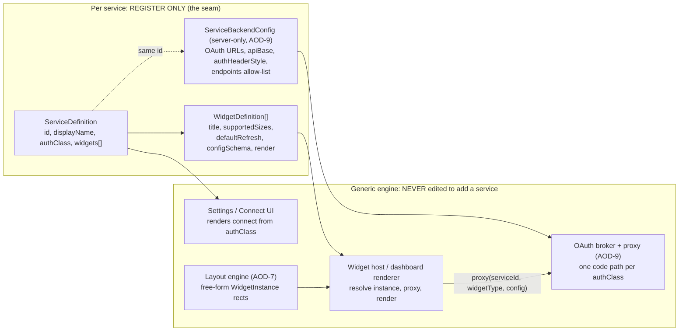
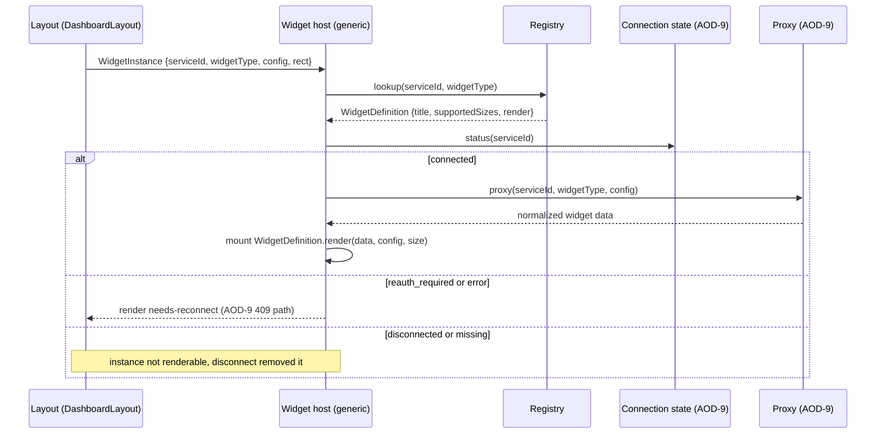

# Spec: Service to Widget to Layout Registry Contract

> Status: draft for review, 2026-06-18. Tracked by [AOD-8](https://linear.app/thexap/issue/AOD-8) (`type:spec`). Defines the core extensibility seam of the product. Stays consistent with the OAuth/token model in [AOD-9](https://linear.app/thexap/issue/AOD-9): the server-side half of the registry described here is the same registry AOD-9 section 6.1 introduces, and the auth-class taxonomy is shared. Builds on the locked decisions in [AOD-6](https://linear.app/thexap/issue/AOD-6) (v1 service set) and [AOD-7](https://linear.app/thexap/issue/AOD-7) (free-form layout).
>
> Amended 2026-06-22 ([AOD-13](https://linear.app/thexap/issue/AOD-13)): added the `platform_key` auth class to the `AuthClass` taxonomy (§5) for platform-owned-key services like Weather, per [AOD-4](https://linear.app/thexap/issue/AOD-4). The registry seam, the two-halves model, and the invariants are unchanged.

## 1. Purpose and scope

The entire product is a three-layer model: a **service** publishes **widgets**, and a user arranges widget **instances** into a **dashboard layout**. This spec defines the contract between those three layers, the registry that holds it, and the one rule that justifies the whole design:

> Adding a new integration must NOT require changes to dashboard or layout code. A new service is a registry entry plus its widgets. The registry is the seam. (Repo `CLAUDE.md`; product vision "Core architecture concept".)

This spec fixes the interfaces (`ServiceDefinition`, `WidgetDefinition`, `WidgetInstance`, `DashboardLayout`), the invariants that bind them, how the registry splits into a client-facing half and a server-side half as one coherent model, and how a brand-new service is added by registration alone.

**In scope:**

- The service interface: identity, auth class, and which widgets it publishes.
- The widget interface: title, refresh interval, supported sizes, per-instance config schema.
- The layout: a free-form arrangement of widget instances; the connected-only rule; the disconnect-removes rule.
- The registry as the seam: what code is generic (written once) versus what is per-service (registered), and how the two registry halves reconcile.

**Out of scope (the frame, not the interior).** This spec sets the frame for the widget model; the interior is [AOD-10](https://linear.app/thexap/issue/AOD-10), which is gated by this spec. Specifically, AOD-10 owns: the full per-instance config schema language (field kinds, validation, dynamic option sources), refresh-interval semantics (tier floors, kiosk overrides, coupling to the proxy cache), the size system (the canonical size catalogue and how a size class maps onto a free-form rect), and widget lifecycle states (loading, error, stale, reconnect). Where this spec names those fields it declares that they exist and what shape they take at the contract boundary, then points the depth to AOD-10. Backend mechanics (token exchange, refresh, encryption, proxying) are owned by AOD-9 and are referenced, not redefined, here.

## 2. Locked context this builds on

| Source | What it locks | How this spec uses it |
|---|---|---|
| Repo `CLAUDE.md` / vision | The three-layer model and the design rule (new service = registry entry, zero layout/dashboard edits). | The contract is built to make this rule mechanically true; section 11 proves it. |
| [AOD-7](https://linear.app/thexap/issue/AOD-7) | Layout is free-form drag-and-resize, not a fixed grid. Persist arbitrary position and size per instance. | `WidgetInstance.rect` carries a free-form rect; `WidgetDefinition.supportedSizes` declares size classes. |
| [AOD-6](https://linear.app/thexap/issue/AOD-6) | v1 service set: Linear, Google Calendar, Claude/Anthropic usage, Weather, Clock. | These populate the registry. Linear is the running example; GitHub (a non-v1 follow-up) is the worked add-a-service example. |
| [AOD-9](https://linear.app/thexap/issue/AOD-9) | Auth-class taxonomy (`oauth2` / `api_key` / `admin_key` / `platform_key` / `none`); a server-side service registry (section 6.1) with a per-widget endpoint allow-list; the connection `status` enum; the `proxy` data path. | The service definition carries the auth class; the server half of the registry is AOD-9's registry; instance resolution consumes AOD-9's connection status and proxy. |

Provider URLs and endpoint paths in the examples below are illustrative and confirmed when each integration is wired, per AOD-9 section 11. The contract is their shape, not their current values.

## 3. The three-layer model



The left box is the only thing that grows when an integration is added. The right box is generic engine code that reads the registry and is never edited to add a service. Both registry halves are keyed by the same `service id` (and, for widgets, the same `widget type`), which is what lets a service be described in two places without drift.

## 4. One model, two halves

A service is one logical thing, but its description splits across two locations because the two locations have different trust levels. This is the coherent model the contract is built around:

| Half | Lives in | Holds | Drives | Trust |
|---|---|---|---|---|
| **Client-facing** | The app bundle (`ServiceDefinition` + `WidgetDefinition[]`) | Identity, auth class, title, supported sizes, refresh interval, config schema, the render component. | What the user sees and arranges: Settings, the widget picker, the layout, the rendered card. | Safe to ship. Contains no secrets and no provider URLs. |
| **Server-side** | The Edge broker (`ServiceBackendConfig`, AOD-9 section 6.1) | Auth class, OAuth URLs, API base, auth header style, and the widget-to-endpoint allow-list. | How data is fetched: the broker's connect, refresh, proxy, and disconnect paths. | Never shipped to the device. The allow-list is what makes AOD-9 goal 5 (no open relay) hold. |

The `authClass` appears in both halves and must agree. The client needs it to render the right connect affordance (an OAuth button, an API-key form, a location form for a platform-owned-key service like Weather, or nothing for Clock); the server needs it to run the matching credential flow. Everything secret or relay-sensitive (client secrets, tokens, platform provider keys, concrete endpoints) stays in the server half. Everything visual (titles, sizes, the render component) stays in the client half. They join on `id`.

This is the same split AOD-9 relies on: AOD-9's broker has "one code path per credential class, not one per service," driven by the server half declared here.

## 5. Layer 1: the Service interface

Shared primitives used throughout:

```typescript
type ServiceId = string;     // stable slug, e.g. "linear", "google_calendar", "github"
type WidgetTypeId = string;  // stable slug, unique within a service, e.g. "my_issues"
type AuthClass = "oauth2" | "api_key" | "admin_key" | "platform_key" | "none";  // the AOD-9 taxonomy
type HttpMethod = "GET" | "POST" | "PUT" | "PATCH" | "DELETE";
type IconRef = string;       // asset key resolved by the app's icon set
```

### 5.1 Client half: `ServiceDefinition`

```typescript
interface ServiceDefinition {
  id: ServiceId;             // the registry key; joins to the server half
  displayName: string;       // "Linear"
  icon: IconRef;             // shown in Settings and as widget chrome
  authClass: AuthClass;      // drives the Settings connect affordance
  widgets: WidgetDefinition[]; // the widgets this service publishes
}
```

A service declares its identity, how it authenticates (as a class, not a flow), and the widgets it publishes. It declares nothing about how those widgets render the layout, and nothing about layout itself. That absence is the point.

### 5.2 Server half: `ServiceBackendConfig`

```typescript
// Server-side only. Lives in the Edge broker (AOD-9). Never shipped to the client.
interface ServiceBackendConfig {
  id: ServiceId;             // SAME key as ServiceDefinition.id
  authClass: AuthClass;      // same value; the broker enforces the matching flow

  oauth?: {                  // present only when authClass === "oauth2"
    authorizeUrl: string;
    tokenUrl: string;
    revokeUrl?: string;
    defaultScopes: string[];
    supportsPkce: boolean;
  };

  apiBase?: string;          // proxy target base; present for every class except "none"
  authHeaderStyle?: string;  // "bearer", "x-api-key", ...
  // For "platform_key" (e.g. Weather) the attached key is a platform secret read
  // from Edge env (AOD-9 §5.4), not a per-user credential; the user supplies only a
  // location, carried as the connection config (AOD-9 §5.1), not in this type.

  // The allow-list: each widget type maps to the single endpoint the proxy may
  // call for it. The proxy only ever calls apiBase + an allow-listed path, never
  // a client-supplied URL. This is the mechanism behind AOD-9 goal 5.
  endpoints: Record<WidgetTypeId, { method: HttpMethod; path: string }>;
}
```

This is AOD-9 section 6.1 expressed as a type. For a GraphQL service such as Linear, every widget endpoint is the same path (`POST /graphql`); the per-widget operation is held server-side keyed by widget type and verified at wiring time, so a GraphQL service is still allow-listed (the client never supplies the query).

## 6. Layer 2: the Widget interface

```typescript
import type { ComponentType } from "react";   // the app is Expo / React Native

interface WidgetDefinition {
  type: WidgetTypeId;            // unique within its publishing service
  serviceId: ServiceId;         // back-reference to the parent service
  title: string;                // default display title, e.g. "My Issues"
  supportedSizes: WidgetSize[]; // the size classes this widget can render at
  defaultRefresh: RefreshInterval;
  configSchema: WidgetConfigSchema; // the per-instance options this widget exposes
  render: WidgetRenderer;       // client half only; the server half has no renderer
}
```

The four fields the issue requires (title, refresh interval, supported sizes, per-instance config schema) are all here. Their interior is AOD-10:

```typescript
// Size classes a widget can render at. The canonical catalogue and how a size
// class maps onto a free-form rect (AOD-7) are owned by AOD-10. AOD-8 requires
// only that a widget declares which classes it supports and that an instance
// carries a free-form rect.
type WidgetSize = "small" | "medium" | "large" | "wide" | "tall";  // illustrative set

// How often a widget wants fresh data. Refresh-interval semantics (tier floors,
// kiosk overrides, coupling to the proxy cache in AOD-9 section 9) are AOD-10.
type RefreshInterval = { seconds: number } | "manual";

// A declarative description of a widget's per-instance options. AOD-8 fixes only
// that this is declarative data the generic config UI renders, and that an
// instance stores values against it. The full field-kind set, validation, and
// dynamic option sources are AOD-10.
interface WidgetConfigSchema {
  fields: WidgetConfigField[];
}

interface WidgetConfigField {
  key: string;             // stored on the instance, e.g. "projectId"
  label: string;           // shown in the config form, e.g. "Project"
  kind: WidgetConfigFieldKind;
  required: boolean;
  // kind-specific extras (enum options, remote-options source, ...) are AOD-10.
}

type WidgetConfigFieldKind =
  | "string" | "number" | "boolean" | "enum"
  | "remote-options";      // resolved against a provider call at config time (AOD-10)
```

The `remote-options` kind is how "which Linear project" works: the config form asks the proxy for the user's actual projects at config time and offers them as choices. The contract here is only that such a field kind exists and stores a value on the instance; the resolution mechanism is AOD-10.

### 6.1 The render contract

The widget's `render` component is only ever invoked with live, normalized data. The generic host (section 9) handles all connection, loading, and error chrome; a widget author never writes auth-state handling.

```typescript
type WidgetRenderer = ComponentType<WidgetRenderProps>;

interface WidgetRenderProps {
  data: unknown;                   // normalized payload from the proxy (AOD-9 sec 9); per-widget shape is AOD-10
  config: Record<string, unknown>; // this instance's config values
  size: WidgetSize;                // the size class to render at
}
```

`render` lives in the client half only. The server half has no renderer; it returns data, and the client draws it.

## 7. Widget instances

A `WidgetDefinition` is a template. A `WidgetInstance` is one placed, configured copy of it on a layout.

```typescript
interface WidgetInstance {
  instanceId: string;               // uuid, unique per placement
  serviceId: ServiceId;             // resolves to the parent service
  widgetType: WidgetTypeId;         // resolves to a WidgetDefinition
  config: Record<string, unknown>;  // values conforming to the widget's configSchema
  rect: LayoutRect;                 // free-form position and size (AOD-7)
  size: WidgetSize;                 // the size class chosen for this placement
}

interface LayoutRect {
  x: number; y: number;             // free-form position
  w: number; h: number;             // free-form size
  z: number;                        // stacking order for overlapping instances
}
```

The instance carries only references (`serviceId`, `widgetType`) plus its own config, geometry, and chosen size class. It never embeds the widget definition, so the layout store stays decoupled from any service. The coordinate space of `LayoutRect` (absolute pixels versus a normalized space) is an AOD-7/AOD-10 detail; AOD-8 fixes only that the rect is free-form and per-instance.

## 8. Layer 3: the Dashboard layout

```typescript
interface DashboardLayout {
  id: string;
  userId: string;                   // owner; the RLS anchor on the backend (AOD-9)
  name: string;                     // "Wall", "Desk", "Kiosk"
  instances: WidgetInstance[];      // the placed widgets
}
```

The layout is a flat list of free-form instances. The layout engine knows how to add, remove, move, resize, and reorder `WidgetInstance` records and nothing else. It does not import any service or widget module. Themes, kiosk flags, and multi-dashboard rules are product surface layered on top, not part of the registry contract.

## 9. Contract invariants

These are the guarantees the generic engine enforces by reading the registry. They are where "the seam holds" becomes concrete.

1. **Definition resolution.** Every `WidgetInstance` resolves through the registry: `getWidgetDef(serviceId, widgetType)` must return a definition, or the instance is invalid and is dropped. The layout never stores widget behavior, only references to it.

2. **Connected-only.** An instance for a widget may be added only when its parent service is connected (or the service is `authClass: "none"`, like Clock). This rule lives in exactly one generic function:

   ```typescript
   const SERVICE_REGISTRY: ServiceDefinition[] = [
     linearService, googleCalendarService, anthropicUsageService,
     weatherService, clockService,
   ];

   // The "add widget" picker offers only widgets whose parent service is connected.
   function addableWidgets(connected: Set<ServiceId>): WidgetDefinition[] {
     return SERVICE_REGISTRY
       .filter(s => s.authClass === "none" || connected.has(s.id))
       .flatMap(s => s.widgets);
   }
   ```

   Only `authClass: "none"` (Clock) is exempt from the connected-only rule. A `platform_key` service like Weather is **not** exempt: it has a real connection (the user's location, AOD-9 §5.1) and its widgets become addable only once that connection exists, exactly like the credentialed classes. The predicate above already captures this, since `platform_key !== "none"`.

3. **Disconnect removes widgets.** When a user disconnects a service, every instance with that `serviceId` is removed from every layout. This is the product rule ("disconnect a service and its widgets disappear"). It is distinct from a transient credential problem: a `reauth_required` or `error` connection (AOD-9 status enum) is not a disconnect; the instance is retained and the host renders a generic reconnect prompt. Whether the orphaned instance row is deleted eagerly at disconnect or filtered lazily on load is a persistence detail aligned with the AOD-5 hard-delete versus soft-retire posture; either way the user-visible invariant holds: a widget is shown only while its parent service is connected.

4. **Render resolution.** At render time the host resolves each instance against the live connection status from AOD-9 and routes accordingly. The widget's own renderer is reached only on the `connected` path.



## 10. The registry as the seam

The seam works because two sets of code never overlap.

**Generic engine (written once, never edited to add a service):**

- **Layout engine** (AOD-7): stores and edits `DashboardLayout` (rects, z-order, add/remove/move/resize). Knows `WidgetInstance` and `LayoutRect` only.
- **Widget host / dashboard renderer**: runs the section 9 resolution and mounts `WidgetDefinition.render` with proxied data. Branches on connection status, never on which service.
- **Settings / connect UI**: renders the connect affordance from `ServiceDefinition.authClass`. Branches on the class, never on which service.
- **Config form UI**: renders a form from `WidgetConfigSchema`. Generic over field kinds.
- **OAuth broker + proxy** (AOD-9 Edge Functions): one code path per `authClass`, driven by `ServiceBackendConfig`.

**Per-service (the only thing added):**

- A `ServiceDefinition` plus its `WidgetDefinition[]` (client half).
- A `ServiceBackendConfig` (server half).
- One leaf render component per widget type.
- One registration line in each registry index (client and server).

The registry index is the declared extension point. Editing it to register a new service is the intended growth, not an edit to "layout/dashboard internals." Lookups stay generic:

```typescript
function getService(id: ServiceId): ServiceDefinition | undefined;
function getWidgetDef(serviceId: ServiceId, type: WidgetTypeId): WidgetDefinition | undefined;
function connectableServices(): ServiceDefinition[];   // for Settings
```

An honest boundary: adding a widget does require writing its leaf render component, because no generic code can draw "Open PRs" for you. That component is purely additive (a new leaf the host mounts polymorphically). The claim the acceptance tests is not "zero new code"; it is "zero edits to layout, dashboard, host, settings, or broker internals." The next section demonstrates exactly that.

## 11. Worked example: adding GitHub by registration alone

GitHub is a strong follow-up in the vision doc and is deliberately not in the v1 set, so it is a genuine brand-new service. It publishes two widgets (open PRs, contribution streak). Adding it is registration plus leaf renderers, with no edits to any engine code.

**Step 1: the client half** (`services/github/index.ts`, new file):

```typescript
const githubService: ServiceDefinition = {
  id: "github",
  displayName: "GitHub",
  icon: "github",
  authClass: "oauth2",
  widgets: [
    {
      type: "open_prs",
      serviceId: "github",
      title: "Open PRs",
      supportedSizes: ["medium", "large", "tall"],
      defaultRefresh: { seconds: 300 },
      configSchema: {
        fields: [
          { key: "scope", label: "Scope", kind: "enum", required: true },
          // enum options (authored / review-requested / all) are AOD-10 detail
        ],
      },
      render: OpenPrsCard,            // new leaf component, mounted by the generic host
    },
    {
      type: "contribution_streak",
      serviceId: "github",
      title: "Contribution Streak",
      supportedSizes: ["small", "medium"],
      defaultRefresh: { seconds: 3600 },
      configSchema: { fields: [] },   // no per-instance config
      render: ContributionStreakCard,
    },
  ],
};
```

**Step 2: the server half** (`services/github/backend.ts`, new file, broker-only). URLs and paths illustrative, confirmed at wiring time per AOD-9 section 11:

```typescript
const githubBackend: ServiceBackendConfig = {
  id: "github",
  authClass: "oauth2",
  oauth: {
    authorizeUrl: "https://github.com/login/oauth/authorize",
    tokenUrl: "https://github.com/login/oauth/access_token",
    defaultScopes: ["read:user", "repo"],
    supportsPkce: false,
  },
  apiBase: "https://api.github.com",
  authHeaderStyle: "bearer",
  endpoints: {
    open_prs: { method: "GET", path: "/search/issues" },
    contribution_streak: { method: "POST", path: "/graphql" },
  },
};
```

**Step 3: the leaf renderers** (`services/github/OpenPrsCard.tsx`, `ContributionStreakCard.tsx`, new files). Each is a component that takes `WidgetRenderProps` and draws the card. Purely additive.

**Step 4: register** (one line in each index):

```typescript
// services/registry.ts (client)
const SERVICE_REGISTRY = [ ...existing, githubService ];

// broker registry (server)
const BACKEND_REGISTRY = [ ...existing, githubBackend ];
```

That is the whole change. The proof is in what was not touched:

| File / module | Added, edited, or untouched | Why |
|---|---|---|
| `services/github/*` (definition, backend, 2 renderers) | Added | The new service, self-contained. |
| `services/registry.ts` (client index) | Edited: one line | The declared extension point. |
| broker registry index (server) | Edited: one line | The declared extension point. |
| Layout engine (AOD-7) | Untouched | Operates on `WidgetInstance` rects; GitHub instances are just more rects. |
| Widget host / dashboard renderer | Untouched | Resolves via the registry and mounts `render`; it never names GitHub. |
| Settings / connect UI | Untouched | GitHub is `oauth2`; the existing OAuth affordance covers it. |
| Config form UI | Untouched | Renders the `open_prs` form from `configSchema` generically. |
| OAuth broker + proxy (AOD-9) | Untouched | GitHub is `oauth2`, an existing code path; only the registry data is new. |

GitHub reuses the existing `oauth2` class, so even the broker gains no code. If a future service introduced a genuinely new auth class, that one class path would be added once to the broker, and still nothing in layout or dashboard would change. The seam holds.

## 12. Consistency with AOD-9

This spec and AOD-9 describe one registry from two sides. The reconciliation:

| Concept | This spec (AOD-8) | AOD-9 |
|---|---|---|
| Auth taxonomy | `AuthClass = oauth2 \| api_key \| admin_key \| platform_key \| none` on `ServiceDefinition` and `ServiceBackendConfig` | Section 4 credential classes; the broker has one path per class |
| Server registry | `ServiceBackendConfig` (section 5.2) | Section 6.1 service registry |
| Endpoint allow-list | `ServiceBackendConfig.endpoints` (widget type to method + path) | Section 6.1 `widgets` allow-list; the basis of goal 5 (no open relay) |
| Data path | `proxy(serviceId, widgetType, config)` in section 9 resolution | Section 9 proxied call; returns normalized widget data |
| Connection status | `connected` renders live; `reauth_required` / `error` render reconnect; `disconnected` removes instances (section 9) | Section 5.1 status enum; section 9 returns 409 needs_reconnect; section 10 disconnect makes widgets disappear |
| Per-user ownership | `DashboardLayout.userId` | RLS keyed to `auth.uid()` |

No conflicts. The widget data shapes the proxy normalizes to, and the cache TTLs that back the refresh interval, are the seam to AOD-10.

## 13. Scope boundary: what AOD-10 owns

This spec is the frame. AOD-10 (Widget model: config, refresh interval, sizes, lifecycle) fills the interior of the types named here:

- **Config schema language**: the full `WidgetConfigFieldKind` set, validation rules, and how `remote-options` resolves choices through the proxy.
- **Refresh-interval semantics**: tier floors, kiosk overrides, and how `defaultRefresh` couples to the AOD-9 proxy cache.
- **Size system**: the canonical `WidgetSize` catalogue and how a size class reconciles with a free-form `LayoutRect`.
- **Lifecycle states**: loading, ready, stale, error, and reconnect, and which the host renders generically versus what reaches the widget renderer.
- **Per-widget data contracts**: the normalized shape each widget's `render` receives.

AOD-8 is done when the contract and the seam are fixed. AOD-10 is unblocked the moment this is approved.

## 14. Acceptance

The issue's acceptance criteria, mapped to where they are met:

| Required | Where |
|---|---|
| Service interface: identity, auth kind, published widgets | Section 5 (`ServiceDefinition`, `ServiceBackendConfig`) |
| Widget interface: title, refresh interval, supported sizes, per-instance config schema | Section 6 (`WidgetDefinition` and supporting types) |
| Layout: free-form instances; connected-only; disconnect removes widgets | Sections 7, 8, 9 (invariants 2 and 3) |
| The registry as the seam | Sections 4 and 10 |
| Concrete TypeScript interfaces (`ServiceDefinition`, `WidgetDefinition`, `WidgetInstance`, `DashboardLayout`) | Sections 5, 6, 7, 8 |
| Diagram of the three-layer model / registry seam | Section 3 (validated Mermaid flowchart); section 9 (resolution sequence) |
| Worked example: a brand-new service by registration alone, no layout/dashboard edits | Section 11 (GitHub), with the not-touched table |

## 15. References

- [AOD-8](https://linear.app/thexap/issue/AOD-8): this spec's tracking issue.
- [AOD-13](https://linear.app/thexap/issue/AOD-13): added the `platform_key` auth class (§5) for platform-owned-key services like Weather, per AOD-4.
- [AOD-9](https://linear.app/thexap/issue/AOD-9): OAuth broker and per-user token model. Owns the server half's mechanics; shares the auth taxonomy and the section 6.1 registry.
- [AOD-10](https://linear.app/thexap/issue/AOD-10): widget model interior. Gated by this spec.
- [AOD-7](https://linear.app/thexap/issue/AOD-7): free-form layout decision.
- [AOD-6](https://linear.app/thexap/issue/AOD-6): v1 service set.
- [`docs/specs/oauth-token-model.md`](oauth-token-model.md): the AOD-9 spec this stays consistent with.
- [`docs/product-vision.md`](../product-vision.md): the three-layer architecture concept, service and widget catalogs.
- [`docs/engineering-process.md`](../engineering-process.md): the `type:spec` lifecycle and the `docs/specs/` convention.
