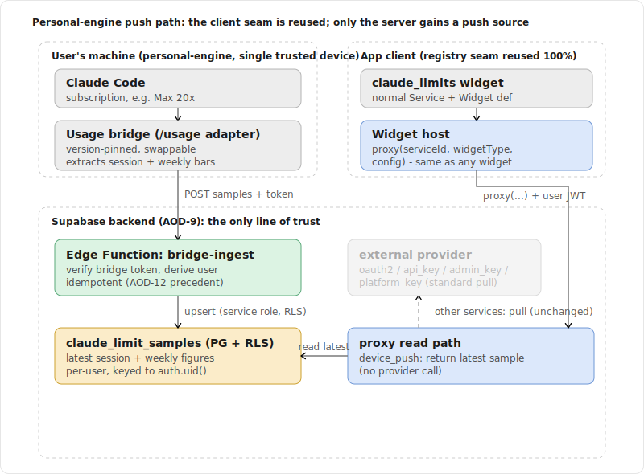
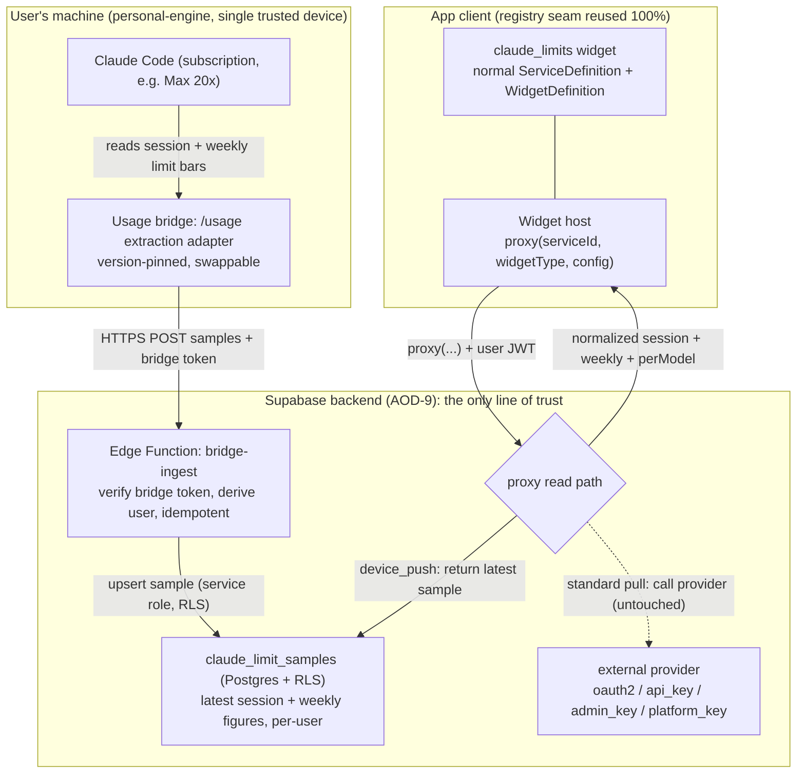
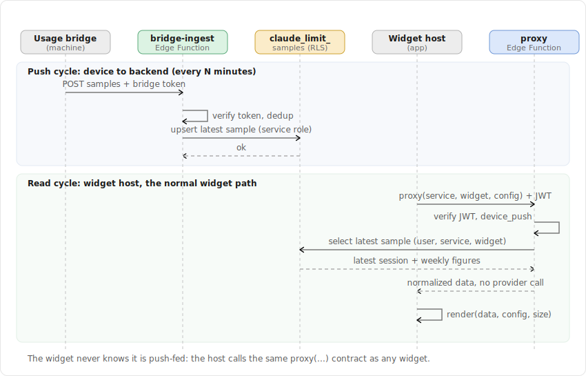
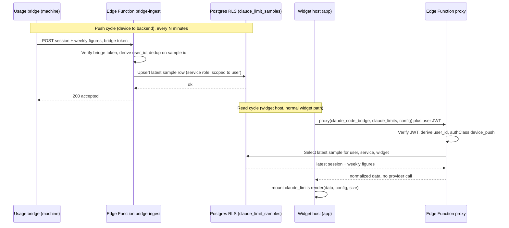

# Spec: Personal-Engine "Claude Limits" Widget (Claude Code Usage Bridge)

> Status: draft for review, 2026-06-22. Tracked by [AOD-14](https://linear.app/thexap/issue/AOD-14) (`type:spec`). Specifies the personal-engine widget recorded by [AOD-4](https://linear.app/thexap/issue/AOD-4) sub-decision C1: the claude.ai Settings > Usage view (Current session + Weekly limits, all models and per-model) that Xavier (user zero, Max 20x) watches daily, fed by a Claude Code usage bridge on his own machine. It is deliberately **out** of the standard multi-tenant v1 set because that subscription usage has no public third-party API (verified 2026-06-19, re-verified for this spec 2026-06-22). The standard v1 Claude widget remains Admin-API Spend MTD ([AOD-4](https://linear.app/thexap/issue/AOD-4), `admin_key`, [AOD-9](https://linear.app/thexap/issue/AOD-9) §4).
>
> The key tension this spec resolves: standard widgets are **server-pulled** (the [AOD-9](https://linear.app/thexap/issue/AOD-9) §9 proxy calls a provider); this widget is **device-pushed** (a bridge on the user's machine posts figures in). It is reconciled by reusing the [AOD-8](https://linear.app/thexap/issue/AOD-8) client registry seam unchanged and adding one additive, isolated push source on the server side, so the standard pull flow is untouched.

## 1. Purpose and scope

This spec fixes two things and nothing more:

1. **The data path.** How a Claude Code usage bridge on the user's machine obtains the session and weekly limit figures and pushes them to the backend, how the backend authenticates, stores, and serves them, and which mechanism the bridge uses to read the figures out of Claude Code (the grounded `/usage` vs OpenTelemetry choice).
2. **The architectural fit.** How this device-push, personal-engine path attaches to the [AOD-8](https://linear.app/thexap/issue/AOD-8) registry and the [AOD-9](https://linear.app/thexap/issue/AOD-9) backend as a clean extension, without leaking push semantics into the standard pull-based service flow.

**In scope:**

- The bridge on the user's machine: what it reads, the extraction mechanism decision, what it pushes, and the isolation boundary that keeps the brittle part replaceable.
- The backend ingest, storage, and read path: authentication of the push (the [AOD-12](https://linear.app/thexap/issue/AOD-12) §6 webhook precedent), per-user encrypted storage on the [AOD-9](https://linear.app/thexap/issue/AOD-9) / [AOD-5](https://linear.app/thexap/issue/AOD-5) posture, and the read served by the normal widget host through the existing proxy contract.
- The widget identity: Current session, Weekly all-models, and per-model bars, with a size class and cadence as **inputs** to [AOD-10](https://linear.app/thexap/issue/AOD-10).
- Why this is personal-engine and not standard, and the graduate-to-standard trigger.

**Out of scope (the frame, not the interior; referenced, not redefined):**

- **The widget model.** Refresh-interval semantics, the size catalogue, lifecycle states, and per-widget data validation are [AOD-10](https://linear.app/thexap/issue/AOD-10)'s. This spec supplies the size class, cadence, and the normalized data shape as inputs, exactly as [AOD-4](https://linear.app/thexap/issue/AOD-4) did for the standard widgets.
- **The registry contract.** The three-layer model and the seam are [AOD-8](https://linear.app/thexap/issue/AOD-8)'s. This spec adds one auth class and one server-side source kind; it does not restate or redesign the contract.
- **The broker mechanics.** Token storage, RLS, Edge Function shape, and the proxy are [AOD-9](https://linear.app/thexap/issue/AOD-9)'s. This spec adds an ingest function and one proxy read branch and references the rest.
- **The privacy policy.** [AOD-5](https://linear.app/thexap/issue/AOD-5) owns retention and the public commitments. This spec follows them and notes where a retention value is tuned at build time.
- **Tier treatment.** Whether this personal-engine capability is gated (and how) is [AOD-3](https://linear.app/thexap/issue/AOD-3) / [AOD-12](https://linear.app/thexap/issue/AOD-12)'s. It is named as a seam (section 11), not decided here.
- **The standard Claude Spend MTD widget.** That is the `admin_key` widget locked by [AOD-4](https://linear.app/thexap/issue/AOD-4); this spec does not touch it.

## 2. Locked context this builds on

| Source | What it locks | How this spec uses it |
|---|---|---|
| [AOD-4](https://linear.app/thexap/issue/AOD-4) C1 | The session/weekly view is a personal-engine widget fed by a Claude Code bridge (`/usage` or OTel), out of the standard set because the data has no third-party API; option C2 (broker consumer/Claude Code auth in the published app) is rejected as a ToS and App-Store-review risk; graduate-to-standard if an API appears. | This spec is that follow-up. Section 3 carries the rationale; section 4 picks the mechanism; section 10 fixes the trigger. |
| [AOD-8](https://linear.app/thexap/issue/AOD-8) §4, §5, §9, §10 | The one-model-two-halves split; `AuthClass = oauth2 \| api_key \| admin_key \| platform_key \| none`; the connected-only and disconnect-removes invariants; the registry as the seam. | The client half is reused verbatim; section 6.2 adds one `AuthClass` value; the invariants are honored (section 6.6). |
| [AOD-9](https://linear.app/thexap/issue/AOD-9) §3, §5.1, §5.4, §6, §9 | Security goals (server is the only line of trust, secrets never reach the device); the `connections` table and where secrets live; the broker surface; the proxy data path (note §9 step 4: `platform_key` reads no per-user Vault secret, the key comes from Edge env). | Section 6 reuses the `connections` row, adds a `bridge-ingest` function, and adds a proxy read branch modeled exactly on the `platform_key` precedent (return stored data instead of calling a provider). |
| [AOD-10](https://linear.app/thexap/issue/AOD-10) §5, §6, §7 | The size catalogue; the two-layer refresh model; the lifecycle states (loading, fresh, stale, error, disconnected, needs_config). | Section 7 supplies size + cadence as inputs and maps the bridge-offline case onto the `stale` state. |
| [AOD-12](https://linear.app/thexap/issue/AOD-12) §6 | A secured (Authorization header in Edge env), idempotent (dedup on event id), RLS-protected, service-role-written push into the backend; respond fast. | Section 6.4's `bridge-ingest` is this precedent applied to an authenticated device push instead of a RevenueCat webhook. |
| [AOD-5](https://linear.app/thexap/issue/AOD-5) | Per-user encryption, minimized cache (≤ 900s for provider data), purge on disconnect and account deletion, never sell or train on user data, no third-party trackers. | Section 8 follows it: the pushed figures are per-user and minimized, the only secret is the bridge token, and disconnect/delete purges everything. |

External Claude Code facts in section 4 are load-bearing and were verified against current documentation on 2026-06-22 (section 4.1). If a build-time detail differs, fix the build against the docs, then update that section.

## 3. Why personal-engine, not standard

The view the widget mirrors (claude.ai Settings > Usage on a subscription plan: Current session, Weekly limit all models, and the per-model weekly bar) is **subscription rate-limit consumption**. Three facts, verified for [AOD-4](https://linear.app/thexap/issue/AOD-4) and again here, force it out of the standard multi-tenant set:

1. **There is no public third-party API for those bars.** The only programmatic Claude surfaces are Admin-key and org/spend oriented (`usage_report/messages`, `cost_report`, `usage_report/claude_code`). They return API token spend, not a subscription user's session/weekly limit percentages and reset windows. The standard Claude widget ([AOD-4](https://linear.app/thexap/issue/AOD-4)) is built on exactly those Admin endpoints and answers a different question (API spend), which for a pure subscription user reads near zero.
2. **The only place the bars exist programmatically-adjacent is the user's own machine**, inside their authenticated Claude Code, surfaced through `/usage` and `/status` (section 4). That is single-user, single-machine, and not a service the product can call on anyone's behalf.
3. **Reproducing it as a standard widget would require brokering consumer / Claude Code auth to an undocumented endpoint** inside the published app. That is [AOD-4](https://linear.app/thexap/issue/AOD-4) option C2, rejected: no supported API, a Terms-of-Service and App-Store-review risk, and a feature that breaks on any upstream change. This spec does not pursue it.

The personal-engine framing is the honest fit: the data originates on one trusted machine the user controls, only derived figures (percentages and reset timestamps) ever cross into the product, and the consumer credentials never leave the user's own Claude Code. That property is what keeps the product clear of the C2 risk while still giving the dogfooding user the card they want.

## 4. The data path on the machine: bridge mechanism

### 4.1 What Claude Code actually exposes (grounded 2026-06-22)

The issue framed the choice as "OpenTelemetry export vs reading `/usage` data" as if either could carry the bars. Grounding against current docs sharpened it: only one of them carries the limit bars at all.

**OpenTelemetry export emits consumption counters, not limit bars.** Claude Code supports OTel ([monitoring-usage](https://code.claude.com/docs/en/monitoring-usage); enable with `CLAUDE_CODE_ENABLE_TELEMETRY=1`, exporters `otlp` / `prometheus` / `console`, default metric export interval 60s). The complete metric set is `claude_code.session.count`, `claude_code.lines_of_code.count`, `claude_code.commit.count`, `claude_code.pull_request.count`, `claude_code.cost.usage`, `claude_code.token.usage`, `claude_code.code_edit_tool.decision`, and `claude_code.active_time.total`, plus event logs (`api_request`, `api_error`, `api_retries_exhausted`, and so on). A search of the monitoring doc for limit / quota / reset / percent / remaining / window returns nothing relevant: **no metric or event expresses the session percent-of-limit, the weekly percent-of-limit, the per-model weekly bar, or any reset timestamp.** OTel tells you what you spent, never how close you are to the limit or when it resets.

**`/usage` is the only surface with the actual bars, and it has no machine-readable output.** From [costs](https://code.claude.com/docs/en/costs): subscribers "see plan usage bars, activity stats, and a usage breakdown on the same screen," with a `d` / `w` toggle between the last 24 hours and the last 7 days; "the figures are approximate and computed from local session history on this machine, so usage from other devices or claude.ai is not included," and the session dollar figure "is an estimate computed locally." It is an interactive TUI (the VS Code extension shows the same breakdown in an Account & usage dialog, v2.1.174+). There is no documented `--json` flag, no `claude usage` subcommand, no print-mode export, and no documented file under `~/.claude/` holding the limit state.

### 4.2 The decision: read the `/usage` figures, via an isolated extraction adapter

**Chosen: the bridge sources the bars from the `/usage` surface, implemented as a version-pinned, swappable extraction adapter on the user's machine.** OpenTelemetry is recorded as a secondary consumption signal and as the path the widget would adopt only if its identity were relaxed (section 11).

Rationale:

- **Fidelity is the reason the widget exists.** [AOD-4](https://linear.app/thexap/issue/AOD-4) C1 defines the card as the session and weekly **limit** bars. Only `/usage` carries them. OTel structurally cannot produce the denominators or the reset windows, so choosing OTel would silently redefine the widget into a spend gauge, a different question from "how close am I to being throttled." That redefinition is not what was decided.
- **The brittleness is bounded by the personal-engine scope.** `/usage` extraction is unsupported (TUI-only) and its figures are approximate and single-machine. That is tolerable precisely because this runs on one machine the user controls, the user owns the upgrade risk, and the blast radius is a single dogfooding card, never the multi-tenant product. The same "approximate, machine-local" property is itself another reason it stays out of the standard set.
- **The risk is isolated behind an adapter.** The spec does not fix the parsing technique (driving `claude` in a pseudo-terminal and parsing the rendered `/usage` view, or reading Claude Code's local session state if a stable form exists). It fixes that the extraction is a single, replaceable module pinned to a known Claude Code version, emitting the normalized shape in section 6.3. If Claude Code later ships a `--json`/file for `/usage`, or OTel gains a limit metric, the adapter swaps with no change to the backend, the widget, or the rest of the bridge.

**The tradeoff, stated plainly:** we accept an unsupported, machine-local, approximate source in exchange for the only faithful rendering of the bars, and we contain that cost inside a swappable adapter on a single trusted machine. The durable fix is not a better scrape; it is the graduate-to-standard trigger (section 10).

### 4.3 What the bridge is, concretely

A small program the user runs on the machine where they use Claude Code (for Xavier, alongside the kiosk's source of truth). It:

1. Reads the current Current-session, Weekly-all-models, and per-model bars via the section 4.2 adapter, on an interval (candidate every ~5 minutes; the session window is 5 hours and the weekly window is 7 days, so minute-scale sampling is far fresher than the data changes).
2. Normalizes them to the `ClaudeLimitsSample` shape (section 6.3).
3. POSTs the sample to the backend `bridge-ingest` endpoint over HTTPS, authenticated with its per-user **bridge token** (section 6.4).

The bridge holds two things locally, both on the user's own machine: their Claude Code session (which it never transmits) and the bridge token we issued (which authorizes only the ingest endpoint, for only that user, and is revocable). No Claude credential ever crosses into the product.

## 5. The backend: how the push attaches without leaking

### 5.1 The hinge: extend the model, do not fork it

The standard flow is **pull**: the [AOD-9](https://linear.app/thexap/issue/AOD-9) §9 proxy calls an external provider described by a `ServiceBackendConfig` (OAuth URLs or an `apiBase`, an endpoint allow-list, and a per-user credential). This widget is **push**: there is no provider for the backend to call, because the data originates on the user's machine and is posted in. The clean reconciliation, confirmed as the chosen approach, is to **extend the existing registry model with one additive, isolated concept, rather than build a parallel personal-engine subsystem.**

The reasoning: a separate subsystem that bypassed the registry would have to re-implement the widget host, the layout, the config form, and the lifecycle for one widget, and would create a second way to define a widget, which is precisely the leak the architecture forbids ([AOD-8](https://linear.app/thexap/issue/AOD-8) design rule). Keeping it a registry service means the widget is ordinary everywhere except one isolated server-side ingress and one read branch, and the standard pull services are literally not touched. This mirrors how [AOD-13](https://linear.app/thexap/issue/AOD-13) added `platform_key` when a genuinely new connect-and-fetch shape appeared: a new auth class, the seam intact.



<details>
<summary>Mermaid source</summary>



</details>

### 5.2 The new auth class: `device_push`

`AuthClass` already dispatches both the client connect affordance and the server flow. Pairing a bridge is a genuinely new connect affordance (it issues a token to a device, rather than collecting a provider credential or a location), and ingesting authenticated pushes is a genuinely new server flow. So the extension is one new class value:

```typescript
// AOD-8 §5 taxonomy, extended with one inbound-push class. Existing values are pull or on-device.
type AuthClass =
  | "oauth2" | "api_key" | "admin_key" | "platform_key" | "none"
  | "device_push"; // NEW (this spec): data is pushed in by a paired device, not pulled from a provider
```

The client half is otherwise unchanged. The widget is an ordinary `ServiceDefinition` plus `WidgetDefinition`, indistinguishable to the host, layout, settings, and config form:

```typescript
const claudeCodeBridgeService: ServiceDefinition = {
  id: "claude_code_bridge",
  displayName: "Claude Code (limits)",
  icon: "claude",
  authClass: "device_push",          // drives the "pair a bridge" connect affordance
  widgets: [claudeLimitsWidget],
};

const claudeLimitsWidget: WidgetDefinition = {
  type: "claude_limits",
  serviceId: "claude_code_bridge",
  title: "Claude Limits",
  supportedSizes: ["medium", "large", "wide"], // size catalogue is AOD-10 §5
  defaultRefresh: { seconds: 300 },             // device read cadence; input to AOD-10
  configSchema: { fields: [] },                 // no per-instance config in v1
  render: ClaudeLimitsCard,                      // ordinary leaf component; receives { data, config, size }
};
```

The server half is **not** a `ServiceBackendConfig` (that type describes a pull target). It is a sibling describing a push source:

```typescript
// Server-side only. Sibling to ServiceBackendConfig (AOD-8 §5.2), for inbound-push sources.
// No oauth, no apiBase, no endpoint allow-list: there is no provider to call.
interface PushSourceConfig {
  id: ServiceId;                 // "claude_code_bridge"; same key as the client half
  authClass: "device_push";
  widgets: WidgetTypeId[];       // which widget types this source feeds, e.g. ["claude_limits"]
  maxSampleAgeSeconds?: number;  // freshness bound: older than this => stale (AOD-10 §7). Input to AOD-10.
}
```

The two halves join on `id`, exactly as [AOD-8](https://linear.app/thexap/issue/AOD-8) §4 prescribes. The client renders a connect affordance from `authClass`; the server runs the matching flow.

### 5.3 Data model

This reuses the [AOD-9](https://linear.app/thexap/issue/AOD-9) §5.1 `connections` table for the pairing and adds one minimal table for the pushed figures.

**The connection (reuses `connections`).** A paired bridge is one `connections` row:

| Column | Value for `device_push` |
|---|---|
| `auth_class` | `device_push` |
| `access_secret_id` | reference to the **bridge token** secret (section 6.4); the only secret involved |
| `refresh_secret_id` | null (nothing to refresh) |
| `config` | optional non-secret label, e.g. `{ "device": "MacBook Pro" }` |
| `status` | `connected` / `disconnected` |
| `expires_at` | null (the token does not expire on a timer; it is revoked explicitly) |

**The samples table (new).** One current snapshot per user per widget, upserted in place, so storage is minimized per [AOD-5](https://linear.app/thexap/issue/AOD-5) (a short rolling history for a future sparkline is a named seam, section 11):

| Column | Type | Notes |
|---|---|---|
| `user_id` | `uuid` | references `auth.users(id)`; the RLS anchor |
| `service` | `text` | `claude_code_bridge` |
| `widget` | `text` | `claude_limits` |
| `captured_at` | `timestamptz` | set on the machine; the ordering / idempotency key |
| `payload` | `jsonb` | the normalized sample (below); non-credential figures only |
| `updated_at` | `timestamptz` | server write time |

Primary key `(user_id, service, widget)`. RLS enabled, policy `user_id = auth.uid()` for select; all writes happen inside the Edge Function with the service role, scoped to the paired user, exactly as [AOD-9](https://linear.app/thexap/issue/AOD-9) §5.3 does for token writes.

**The normalized sample (the widget's data contract).** This is the shape the proxy returns and the renderer consumes; per [AOD-8](https://linear.app/thexap/issue/AOD-8) §6.1 the precise per-widget schema is finalized with the widget, but the identity is fixed here:

```typescript
interface LimitBar {
  pctUsed: number;   // 0..100
  resetsAt: string;  // ISO 8601 timestamp of the next reset
}
interface ClaudeLimitsSample {
  capturedAt: string;            // ISO 8601, set on the machine; ordering + idempotency key
  session: LimitBar;             // current ~5-hour session window
  weeklyAll: LimitBar;           // weekly limit, all models
  perModel?: { model: string; bar: LimitBar }[]; // e.g. opus, sonnet, where the plan exposes them
  source: { tool: "claude_code"; version: string }; // pinned CC version, for drift detection
}
```

The figures are non-credential: percentages, reset timestamps, and model labels. There is no token, no content, and no provider secret in the payload.

### 5.4 The broker surface (extends AOD-9 §6)

| Function | Class | Purpose |
|---|---|---|
| connect (`credentials-store` device_push branch) | device_push | Mint a revocable bridge token, store it hashed at rest (section 6 note), write the `connections` row with `status=connected`, return the token to the user **once** for the bridge to store. No provider call. |
| `bridge-ingest` (NEW) | device_push | Accept an authenticated push from the bridge, validate and dedup, upsert the latest sample. The [AOD-12](https://linear.app/thexap/issue/AOD-12) §6 precedent applied to a device. |
| `proxy` (device_push read branch) | device_push | Serve the widget: return the latest stored sample instead of calling a provider. One new branch, modeled on the `platform_key` branch (AOD-9 §9 step 4). |
| `disconnect` (device_push branch) | device_push | Revoke the bridge token and purge the samples; the widget disappears (AOD-8 invariant 3). |

`bridge-ingest`, modeled on [AOD-12](https://linear.app/thexap/issue/AOD-12) §6:

1. **Authenticate the push.** The bridge sends its token as a bearer `Authorization` header. The function resolves it (constant-time) to a `connections` row and its `user_id`. Unlike a provider credential, this token is one we issued and store **hashed** at rest (a salted hash, like a password), so it is verified without decryption and a database leak exposes no usable token. A mismatch is `401`; nothing is written.
2. **Validate and bound.** Parse the body to `ClaudeLimitsSample`; reject malformed payloads; clamp percentages to 0..100. The payload is treated as untrusted input (the same stance [AOD-9](https://linear.app/thexap/issue/AOD-9) §9 and [AOD-10](https://linear.app/thexap/issue/AOD-10) §4.2 take toward client-supplied data).
3. **Order-guard / idempotent.** If the incoming `capturedAt` is less than or equal to the stored row's `captured_at`, ack and ignore (a delayed or duplicate push). Otherwise upsert. Keeping only the latest makes idempotency trivial: latest-capture wins.
4. **Write under the service role**, scoped to the resolved `user_id`, and respond fast.

The `proxy` device_push read branch, modeled on the `platform_key` precedent ([AOD-9](https://linear.app/thexap/issue/AOD-9) §9 step 4, where there is no per-user Vault secret to read and the data comes from elsewhere):

1. Verify the user's session JWT and derive `user_id` (identical to every other proxy call).
2. The service's auth class is `device_push`, so **instead of** loading a credential and calling a provider, select the latest `claude_limit_samples` row for `(user_id, service, widget)`.
3. If a row exists, return its `payload` as the normalized widget data. If `now - captured_at` exceeds `maxSampleAgeSeconds`, flag it stale (the host maps this to the [AOD-10](https://linear.app/thexap/issue/AOD-10) `stale` state; section 7). If no row exists yet (bridge never pushed), return empty so the host shows `loading` / first-run.
4. If the connection is `disconnected`, return `409 needs_reconnect`, the same as any other service, so the host shows the reconnect prompt.

Steps 1 and 4 are the existing proxy behavior; only step 2 and 3's source differs. The standard pull path is unchanged.



<details>
<summary>Mermaid source</summary>



</details>

### 5.5 Connect (pair) and disconnect, honoring the AOD-8 invariants

- **Connect = pair the bridge.** In Settings, the `device_push` connect affordance mints a bridge token, writes the `connections` row, and shows the token once for the user to paste into the bridge. The widget becomes addable only once this connection exists, exactly like a `platform_key` connection (the user supplied something; the service is connected). This satisfies [AOD-8](https://linear.app/thexap/issue/AOD-8) invariant 2; `device_push` is not exempt from connected-only (only `none`, such as Clock, is).
- **Disconnect = unpair.** Revoking the token and purging the samples retires the connection; per [AOD-8](https://linear.app/thexap/issue/AOD-8) invariant 3 the widget disappears from every layout. A revoked token makes subsequent pushes fail `401` at `bridge-ingest`, so a stale bridge cannot keep writing.

## 6. Widget identity (inputs to AOD-10)

The card mirrors the Settings > Usage view. Its identity, supplied as inputs to the [AOD-10](https://linear.app/thexap/issue/AOD-10) model exactly as [AOD-4](https://linear.app/thexap/issue/AOD-4) supplied the standard widgets':

| Aspect | Value | Notes |
|---|---|---|
| Bars shown | Current session (% used, reset); Weekly all-models (% used, reset); per-model weekly (e.g. Opus, Sonnet) where the plan exposes it | `perModel` is optional in the data shape; the renderer omits absent bars. |
| Default size | `large` (of `medium` / `large` / `wide`) | A multi-bar card needs more than the single-value `medium`; `wide` suits a kiosk strip. Catalogue and rect reconciliation are [AOD-10](https://linear.app/thexap/issue/AOD-10) §5. |
| Device read cadence | ~5 min (`defaultRefresh: { seconds: 300 }`) | The host re-reads the stored sample; this is a cheap DB read, not a provider call. |
| Freshness bound | `maxSampleAgeSeconds` ~2 to 3x the bridge push interval | Past it, the host shows `stale`. Final value tuned at build (section 11). |
| Per-instance config | none in v1 | `configSchema.fields = []`. |

**Cadence note (reconciling with the AOD-10 two-layer model).** [AOD-10](https://linear.app/thexap/issue/AOD-10) §6 separates device cadence from provider cadence (a cache TTL guarding the provider). For a `device_push` widget there is no provider the proxy can call, so the provider-facing layer collapses: the read is a stored-row lookup, and **the true freshness floor is the bridge push interval, which the proxy cannot accelerate** (only the bridge pushes). The device read cadence simply needs to be at least as frequent as the push interval to surface new samples promptly. This is an input to [AOD-10](https://linear.app/thexap/issue/AOD-10); this spec does not redefine the refresh model.

**Lifecycle mapping ([AOD-10](https://linear.app/thexap/issue/AOD-10) §7).** The states fall out naturally: `loading` before the first push; `fresh` while the latest sample is within `maxSampleAgeSeconds`; `stale` (the characteristic state here) when the bridge is offline and pushes stop, showing the last-known bars with an "updated Nm ago" badge; `disconnected` only on explicit unpair (a `409`). There is no provider `error`/backoff path, because there is no provider call; a malformed or rejected push fails at ingest and simply leaves the last good sample in place, which surfaces as `stale` once it ages.

## 7. Privacy and security posture

Following [AOD-5](https://linear.app/thexap/issue/AOD-5) and the [AOD-9](https://linear.app/thexap/issue/AOD-9) §3 goals:

- **The consumer credential never leaves the machine.** The bridge reads `/usage` inside the user's own authenticated Claude Code and transmits only derived figures. No Claude session token or content is sent. This is the structural reason the C2 risk (section 3) does not apply: there is no consumer-auth brokering in the product.
- **The only secret is the bridge token**, issued by us, scoped to the ingest endpoint for one user, stored hashed at rest, never returned after issuance, and revocable from Settings. A database leak yields no usable token (it is a salted hash, not ciphertext that a key could decrypt).
- **The pushed figures are per-user and minimized.** Percentages, reset timestamps, and model labels only; one current snapshot per user (no history in v1); RLS-isolated; purged on disconnect and on account deletion, exactly as connection data is ([AOD-5](https://linear.app/thexap/issue/AOD-5), [AOD-9](https://linear.app/thexap/issue/AOD-9) §10).
- **The server is the only line of trust.** Ingest authenticates and bounds every push; the proxy authenticates every read and is RLS-scoped. The device is never trusted to assert another user's data.

## 8. The seam holds (footprint)

What this feature adds, and what it leaves untouched, in the [AOD-8](https://linear.app/thexap/issue/AOD-8) §11 style:

| File / module | Added, edited, or untouched | Why |
|---|---|---|
| `services/claude_code_bridge/*` (definition, push-source config, `ClaudeLimitsCard`) | Added | The new service, self-contained, like any service. |
| `AuthClass` taxonomy | Edited: +1 value (`device_push`) | A genuinely new connect + server flow, the [AOD-13](https://linear.app/thexap/issue/AOD-13) `platform_key` precedent. |
| Server broker: `bridge-ingest` | Added: one Edge Function | The push ingress; the [AOD-12](https://linear.app/thexap/issue/AOD-12) §6 precedent. |
| Server broker: `proxy` | Edited: one read branch | Return the stored sample for `device_push`, like the `platform_key` branch. |
| Server broker: connect / disconnect | Edited: one branch each | Mint/revoke the bridge token instead of a provider credential. |
| `claude_limit_samples` table + RLS | Added | Per-user storage for the pushed figures. |
| `connections` table | Untouched (schema) | Reused as-is; `device_push` is just another `auth_class` value. |
| Layout engine (AOD-7) | Untouched | `device_push` instances are ordinary rects. |
| Widget host / dashboard renderer | Untouched | Resolves via the registry and calls `proxy(...)`; it never names this service or knows it is push-fed. |
| Settings / connect UI | Untouched (generic) | Renders the connect affordance from `authClass`; it branches on the class, not the service. |
| Config form UI | Untouched | The widget has no config; the generic form handles the empty schema. |
| Standard pull services (oauth2 / api_key / admin_key / platform_key) | Untouched | No new branch in any of them; the pull flow is unchanged. |

The widget host, layout, settings, config form, and every standard pull service are untouched. The personal-engine push path is a thin server-side extension keyed by one new auth class. The seam holds.

## 9. Graduate-to-standard trigger

This widget is personal-engine **only because the data has no multi-tenant API.** If Anthropic ships a subscription-usage API that returns a user's session and weekly limit bars (the bars themselves, not Admin-key org spend), the widget re-homes to a standard, server-pulled widget:

- The client half barely changes: same `WidgetDefinition`, the `authClass` flips from `device_push` to whatever the API uses (likely `oauth2` or `api_key`).
- The server half becomes a normal `ServiceBackendConfig` with the API's endpoints; the proxy uses its standard pull path; `bridge-ingest`, the bridge, the samples table, and the `device_push` class are retired.
- The normalized `ClaudeLimitsSample` shape (section 6.3) is intended to survive the transition, so the renderer is unchanged.

Until then, the bridge is the only faithful source, and the `device_push` extension is the clean way to carry it.

## 10. Seams left open (named, not decided)

| Seam | Owner | What this spec leaves clean |
|---|---|---|
| The exact `/usage` extraction technique | build-time | Section 4.2 fixes the adapter boundary and the normalized output, not whether it drives a pseudo-terminal or reads local state. Pinned to a Claude Code version. |
| `maxSampleAgeSeconds` and the push interval | [AOD-10](https://linear.app/thexap/issue/AOD-10) / build-time | Section 6 gives candidates (~5 min push, 2 to 3x for stale); the model values are AOD-10's. |
| Tier treatment of the personal-engine capability | [AOD-3](https://linear.app/thexap/issue/AOD-3) / [AOD-12](https://linear.app/thexap/issue/AOD-12) | Whether `device_push` counts toward `maxConnectedServices` or is a power-user / Pro gate is an entitlement decision. As a non-standard, opt-in card it is outside the v1 Free/Pro widget set; the precise gate is deferred. |
| A short sample history (for a usage sparkline) | future | v1 stores one snapshot per user (minimized per AOD-5). A bounded rolling history would extend the samples table without touching the ingest or read contract. |
| Bridge packaging and distribution | build-time | How the bridge ships (a small CLI / daemon / npm package) and how pairing is presented (paste token vs scan). Out of scope for the data-path spec. |
| OTel as a complementary consumption signal | future | OTel can reliably feed session token/cost consumption (section 4.1). If a consumption sub-card is ever wanted, it is a separate widget fed by an OTel collector, not a change to this one. |

## 11. Acceptance

The issue's Must-cover list, mapped to where it is met:

| Required | Where |
|---|---|
| Data path: the Claude Code usage bridge that pushes session + weekly figures to the backend; pick the mechanism (OTel vs `/usage`) and state the tradeoff | Sections 4.1 (grounding), 4.2 (decision: `/usage` adapter, tradeoff), 4.3 (the bridge) |
| Backend ingest + storage + read: authenticated push (AOD-12 §6 precedent), stored per AOD-9 / AOD-5, read by the normal widget host | Sections 5.3, 5.4 (ingest, proxy read branch), 7; sequence diagram in 5.4 |
| Widget identity: Current session, Weekly all-models, per-model; size class + cadence as inputs to AOD-10 | Sections 5.3 (data shape), 6 |
| Why personal-engine, not standard (no multi-tenant API; C2 ToS / review risk rejected) | Section 3 |
| Graduate-to-standard trigger | Section 9 |
| How the device-push path fits or cleanly extends the AOD-8 registry without leaking into the standard service flow | Sections 5.1, 5.2, 8 (footprint); data-path diagram in 5.1 |
| Diagrams per the AOD-10/11/12 convention (rendered SVG + collapsible Mermaid, validated) | Sections 5.1 and 5.4 (both Mermaid sources validated before save) |

## 12. References

- [AOD-14](https://linear.app/thexap/issue/AOD-14): this spec's tracking issue.
- [AOD-4](https://linear.app/thexap/issue/AOD-4): v1 widget set decision. Sub-decision C1 records this personal-engine widget and the bridge; C2 (broker consumer auth) rejected.
- [AOD-8](https://linear.app/thexap/issue/AOD-8): registry contract. The seam reused here; the `AuthClass` taxonomy extended by one value. ([architecture-registry.md](architecture-registry.md))
- [AOD-9](https://linear.app/thexap/issue/AOD-9): OAuth broker and token model. The `connections` table, broker surface, and proxy this extends; the `platform_key` read branch is the precedent for the `device_push` read. ([oauth-token-model.md](oauth-token-model.md))
- [AOD-10](https://linear.app/thexap/issue/AOD-10): widget model. Owns the size catalogue, refresh model, and lifecycle this supplies inputs to. ([widget-model.md](widget-model.md))
- [AOD-12](https://linear.app/thexap/issue/AOD-12): freemium entitlement model. §6 webhook is the authenticated-push precedent for `bridge-ingest`; owns any tier gate. ([entitlement-model.md](entitlement-model.md))
- [AOD-5](https://linear.app/thexap/issue/AOD-5): privacy posture. Per-user encryption, minimized data, purge on disconnect/delete.
- [`docs/product-vision.md`](../product-vision.md): the personal-engine widget concept and the v1 widget set line.
- [`docs/engineering-process.md`](../engineering-process.md): the `type:spec` lifecycle and the `docs/specs/` convention.
- Claude Code surfaces verified 2026-06-22: [`/usage` and cost tracking](https://code.claude.com/docs/en/costs) (plan usage bars, approximate and local, no machine-readable export); [OpenTelemetry monitoring](https://code.claude.com/docs/en/monitoring-usage) (consumption metrics only, no limit/reset metric). Subscription usage has no public third-party API ([platform.claude.com](https://platform.claude.com/docs/en/manage-claude/usage-cost-api)).
