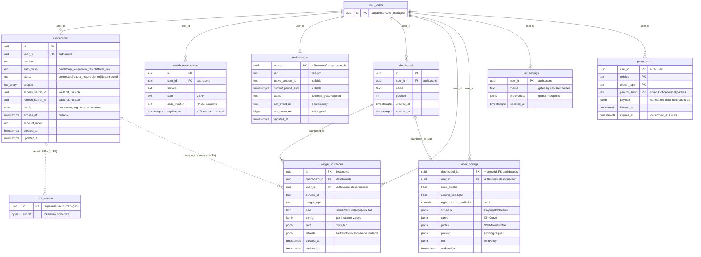

# Spec: Data Model and Postgres Schema

> Status: draft for review, 2026-06-23. Tracked by [AOD-22](https://linear.app/thexap/issue/AOD-22) (`type:spec`). Builds on the locked backend stack [AOD-2](https://linear.app/thexap/issue/AOD-2) (Supabase) and the locked dependency stack [AOD-25](https://linear.app/thexap/issue/AOD-25) (Supabase CLI migrations + `supabase gen types` + no ORM + Zod). It is the keystone schema the PS-M1 Backend platform builds on.
>
> This spec consolidates the table sketches that earlier specs drew in passing into one authoritative schema. It reconciles [AOD-9](https://linear.app/thexap/issue/AOD-9) §5 (connections, oauth_transactions) and [AOD-12](https://linear.app/thexap/issue/AOD-12) §6.1 (entitlements), persists the [AOD-8](https://linear.app/thexap/issue/AOD-8) layout shapes and the [AOD-10](https://linear.app/thexap/issue/AOD-10) per-instance model, defines the new settings/preferences surface from [AOD-11](https://linear.app/thexap/issue/AOD-11), and applies the [AOD-5](https://linear.app/thexap/issue/AOD-5) privacy posture. Where this spec tightens or extends an earlier sketch, it says so explicitly in §12.

## 1. Purpose and scope

This is the single source of truth for the alwaysOnDashboard relational schema: every table, its columns and types, its keys and relationships, its Row-Level Security (RLS) policies, the migration strategy, and the derived-types approach. The Phase 1 / PS-M1 backend (the schema under RLS plus the broker Edge Functions) is built against this document.

In scope:

- The eight application tables: `connections`, `oauth_transactions`, `entitlements`, `dashboards`, `widget_instances`, `kiosk_configs`, `user_settings`, `proxy_cache`.
- RLS policies keyed to `auth.uid()`, and the principle that decides which tables the client may write versus which are written only server-side.
- The settings/preferences schema: refresh overrides, themes, and the kiosk schedule.
- The migration strategy (Supabase CLI) and the derived-TypeScript-types approach (`supabase gen types` plus shared Zod).
- Lifecycle and retention: what cascades or is purged on disconnect and account deletion (AOD-5).

Out of scope, owned elsewhere and only referenced here:

- The token mechanics: server-side OAuth exchange, refresh, the proxy, revocation. Owned by [AOD-9](https://linear.app/thexap/issue/AOD-9). This spec persists the rows those flows read and write; it does not redefine the flows.
- The entitlement logic: tier resolution, the webhook, enforcement points. Owned by [AOD-12](https://linear.app/thexap/issue/AOD-12). This spec persists the entitlement row; the rules that read it stay in AOD-12.
- The registry, render contract, and widget behavior. Owned by [AOD-8](https://linear.app/thexap/issue/AOD-8) and [AOD-10](https://linear.app/thexap/issue/AOD-10). The service registry is code, not a table; it is never stored in Postgres.
- The kiosk runtime (keep-awake, dimming curve math, backlight). Owned by [AOD-11](https://linear.app/thexap/issue/AOD-11). This spec persists the kiosk config the runtime reads.

This is a specification, not an implementation. The SQL in this document is illustrative of the intended schema, in the same way the sibling specs embed TypeScript interfaces. No migration files are authored and no database is provisioned by this spec; that is the Foundation tech task that follows.

## 2. Locked context this builds on

| Source | What it fixes for this schema |
|---|---|
| [AOD-2](https://linear.app/thexap/issue/AOD-2) | Supabase: Postgres + RLS, Vault, Edge Functions (Deno), pg_cron + pg_net. The substrate. |
| [AOD-25](https://linear.app/thexap/issue/AOD-25) | Supabase CLI migrations are the schema source of truth; `supabase gen types typescript` produces derived TS types; no ORM (raw `supabase-js`); Zod is the one shared client + server validation layer. The schema must align with this. |
| [AOD-9](https://linear.app/thexap/issue/AOD-9) §5 | The `connections` and `oauth_transactions` sketches; secrets live in Vault, rows hold UUID references only. |
| [AOD-12](https://linear.app/thexap/issue/AOD-12) §6.1 | The `entitlements` row (tier, current_period_end, status, idempotency fields) and its read-only-to-client RLS. |
| [AOD-8](https://linear.app/thexap/issue/AOD-8) §6 to §8 | `DashboardLayout`, `WidgetInstance`, `LayoutRect`, the size/auth-class types. |
| [AOD-10](https://linear.app/thexap/issue/AOD-10) §3 to §6 | Per-instance `config`, the `rect`, the `size` class, the per-instance `refresh` override. |
| [AOD-11](https://linear.app/thexap/issue/AOD-11) §6 to §8 | The `KioskConfig`: schedule, dim curve, wall-mount profile, backlight, night cadence multiplier. |
| [AOD-5](https://linear.app/thexap/issue/AOD-5) | Privacy posture: hard delete on disconnect, eager widget removal, an encrypted per-user cache with a 900s ceiling, in-app plus web account deletion. |

These are not re-litigated. If a build-time detail of Supabase differs from what a sibling spec verified, fix the build against the current doc and update the relevant spec.

## 3. Conventions applied to every table

These hold schema-wide so each table section can stay short.

- **Primary keys.** Surrogate `uuid` keys default `gen_random_uuid()`, except the four tables that are naturally one-row-per-user or one-row-per-parent and use the owning id as the PK: `entitlements` (`user_id`), `user_settings` (`user_id`), `kiosk_configs` (`dashboard_id`), and `proxy_cache` (a composite natural key).
- **The user anchor.** Every application table carries `user_id uuid` referencing `auth.users(id)` with `ON DELETE CASCADE`, and it is the RLS anchor. Child tables that also have a parent (for example `widget_instances` under `dashboards`) carry `user_id` denormalized so the RLS predicate is a direct `user_id = auth.uid()` rather than a join on every row.
- **Timestamps.** `created_at` and `updated_at` are `timestamptz default now()`. A shared `set_updated_at()` trigger maintains `updated_at` on update (§9). Tables that are pure caches or transient state use a single domain timestamp instead (`fetched_at`, `expires_at`).
- **Enumerations as `text` + `CHECK`, not native Postgres enums.** The status and class sets here are small but expected to grow (more sizes, more connection states, more tiers later). A `CHECK (col in (...))` is a one-line forward migration to extend; a native `enum` needs `ALTER TYPE` and orders awkwardly. The canonical TypeScript unions live in the shared Zod module (AOD-25), so the app side already has a typed source; the DB constraint is the backstop, not the type origin.
- **Structured interiors as `jsonb`, validated by Zod.** Fields whose shape is owned by another spec (`config`, `rect`, `refresh`, `schedule`, `curve`, `profile`, `preferences`, `payload`) are stored as `jsonb` and validated by a shared Zod schema on write. `supabase gen types` types a `jsonb` column only as `Json`; Zod supplies the real interior type (§10). This keeps the relational schema stable when an owned shape evolves: a new optional config field is a Zod change, not a migration.
- **RLS on by default.** Every table has RLS enabled. The policies and the writer-split principle are §8.

## 4. Entity-relationship diagram


Eight application tables (blue = written only by Edge Functions on the service role; grey = written directly by the app under owner RLS) plus the two Supabase-managed externals (`auth.users`, `vault.secrets`). Solid lines are real foreign keys with `ON DELETE CASCADE`. Dashed lines are logical references with no database foreign key: `connections` holds Vault secret UUIDs, and `widget_instances.service_id` matches `connections.service` through the registry seam. Faint lines are the `user_id` foreign key every application table has to `auth.users`.

<details>
<summary>Mermaid source</summary>



</details>

## 5. The tables

Each table below gives the canonical column list, then its keys, constraints, and indexes. RLS is summarized per table and specified in full in §8.

### 5.1 `connections`

One row per user per connected service. Holds metadata and Vault secret references only, never secret material. This is [AOD-9](https://linear.app/thexap/issue/AOD-9) §5.1, adopted verbatim and tightened with a uniqueness constraint.

| Column | Type | Notes |
|---|---|---|
| `id` | `uuid` PK | `default gen_random_uuid()` |
| `user_id` | `uuid` | `references auth.users(id) on delete cascade`; the RLS anchor |
| `service` | `text` | `linear`, `google_calendar`, `anthropic_usage`, `weather`, ... |
| `auth_class` | `text` | `oauth2` / `api_key` / `admin_key` / `platform_key`. `none` (Clock) has no row. |
| `status` | `text` | `connected` / `reauth_required` / `error` / `disconnected` (the last is transient, §11) |
| `scopes` | `text[]` | granted scopes (oauth2); empty for other classes |
| `access_secret_id` | `uuid` | reference into `vault.secrets` for the access token or API/Admin key; null for `platform_key` |
| `refresh_secret_id` | `uuid` | reference into `vault.secrets` for the refresh token (oauth2 only); nullable |
| `config` | `jsonb` | non-secret per-connection config; for `platform_key` Weather, the location (`{ city }` or `{ lat, lon }`); null when the class needs none. Never credential material. |
| `expires_at` | `timestamptz` | access-token expiry; null when the token does not expire |
| `account_label` | `text` | display only, e.g. the Google email or Linear workspace name |
| `created_at` / `updated_at` | `timestamptz` | `default now()`; `updated_at` via trigger |

Keys, constraints, indexes:

- PK `id`.
- `unique (user_id, service)`: one connection per user per service. AOD-9 states "one row per user per connected service" as prose; this makes it a constraint, so a duplicate connect upserts rather than duplicates.
- `check (auth_class in ('oauth2','api_key','admin_key','platform_key'))`. `none` is excluded because Clock has no connection row.
- `check (status in ('connected','reauth_required','error','disconnected'))`.
- Index on `(user_id)` for the RLS-scoped connection list; the unique index on `(user_id, service)` also serves point lookups by service.

The secret-reference columns hold only Vault secret UUIDs, which are useless to a client: the `vault.decrypted_secrets` view is in the `vault` schema, not exposed to `anon` or `authenticated`, and the decryption key is external to the database. A `platform_key` row (Weather) is the limiting case: null secret references, only its `config` location, so nothing secret is in the row at all.

RLS: client may `select` its own rows; all writes are server-side via the service role (§8, a tightening of AOD-9 §5.3 explained in §12).

### 5.2 `oauth_transactions`

Short-lived state for an in-flight authorization so the callback can validate CSRF state and complete PKCE. [AOD-9](https://linear.app/thexap/issue/AOD-9) §5.2.

| Column | Type | Notes |
|---|---|---|
| `id` | `uuid` PK | `default gen_random_uuid()` |
| `user_id` | `uuid` | `references auth.users(id) on delete cascade`; who started the connect |
| `service` | `text` | which service is being connected |
| `state` | `text` | random CSRF value echoed by the provider |
| `code_verifier` | `text` | PKCE verifier where the provider supports PKCE; sensitive short-lived material |
| `expires_at` | `timestamptz` | about 10 minutes; a pg_cron job prunes expired rows (§9) |

Keys, constraints, indexes:

- PK `id`.
- Index on `(state)` for the callback lookup, on `(expires_at)` for the prune job, and on `(user_id)`.

RLS: no client access at all. This table is read and written only by the `oauth-start` and `oauth-callback` Edge Functions on the service role. Because `code_verifier` is a live PKCE secret, the client is given neither read nor write (a refinement of AOD-9 §5.3, §12).

### 5.3 `entitlements`

One row per user, the authoritative tier. Holds no secret material, so unlike the token rows it needs no Vault reference; RLS isolates it. [AOD-12](https://linear.app/thexap/issue/AOD-12) §6.1, adopted verbatim.

| Column | Type | Notes |
|---|---|---|
| `user_id` | `uuid` PK | `references auth.users(id) on delete cascade`; equals the RevenueCat `app_user_id`; the RLS anchor |
| `tier` | `text` | `free` / `pro`. The resolved tier. |
| `active_product_id` | `text` | the store product backing the current Pro period; null on Free |
| `current_period_end` | `timestamptz` | from the event's `expiration_at_ms`; the access deadline; null on Free |
| `status` | `text` | `active` / `in_grace` / `expired`; drives grace handling (AOD-12 §6.3) |
| `last_event_id` | `text` | the last processed RevenueCat event `id`; the idempotency guard |
| `last_event_ms` | `bigint` | the last processed `event_timestamp_ms`; guards out-of-order replays |
| `updated_at` | `timestamptz` | last write |

Keys, constraints, indexes:

- PK `user_id`.
- `check (tier in ('free','pro'))`.
- `check (status in ('active','in_grace','expired'))`.

RLS: client may `select` its own row (a server-confirmed badge); it never writes it. All writes happen in the `revenuecat-webhook` Edge Function on the service role, scoped to the `app_user_id` from the event. A missing row is read as Free (the safe default), so a user with no purchase needs no row.

### 5.4 `dashboards`

A user's named layout. The parent of widget instances. This is [AOD-8](https://linear.app/thexap/issue/AOD-8) §8 `DashboardLayout`, where `instances` becomes the child `widget_instances` rows rather than an embedded array.

| Column | Type | Notes |
|---|---|---|
| `id` | `uuid` PK | `default gen_random_uuid()` |
| `user_id` | `uuid` | `references auth.users(id) on delete cascade`; owner and RLS anchor |
| `name` | `text` | "Wall", "Desk", "Kiosk" |
| `position` | `int` | ordering in the dashboard switcher; `default 0` |
| `created_at` / `updated_at` | `timestamptz` | `default now()` |

Keys, constraints, indexes:

- PK `id`.
- Index on `(user_id)`; the app reads a user's dashboards ordered by `position`.

The Free-tier limit of one dashboard versus unlimited on Pro (`maxDashboards`, AOD-12 §4) is **not** a database constraint. The tier is dynamic and server-resolved (`serverTier`, AOD-12 §6.3); the limit is enforced at AOD-12's create-dashboard enforcement point (§7.3), not in the schema, so the schema stays tier-agnostic.

RLS: full owner CRUD. Layouts are user-authored presentation state with no credential material, so the client is the natural writer under owner RLS (§8).

### 5.5 `widget_instances`

One placed, configured, sized widget on a dashboard. This is [AOD-8](https://linear.app/thexap/issue/AOD-8) §7 `WidgetInstance` plus the [AOD-10](https://linear.app/thexap/issue/AOD-10) §3 `ConfiguredInstance` refresh override. The `instances` array of a `DashboardLayout` is normalized into these rows.

| Column | Type | Notes |
|---|---|---|
| `id` | `uuid` PK | the `instanceId`; `default gen_random_uuid()` |
| `dashboard_id` | `uuid` | `references dashboards(id) on delete cascade` |
| `user_id` | `uuid` | `references auth.users(id) on delete cascade`; denormalized from the parent for direct RLS |
| `service_id` | `text` | resolves to a service in the registry; logical match to `connections.service` |
| `widget_type` | `text` | resolves to a `WidgetDefinition` in the registry |
| `size` | `text` | the chosen size class: `small` / `medium` / `large` / `wide` / `tall` (AOD-10 §5.1) |
| `config` | `jsonb` | per-instance values conforming to the widget's `configSchema` (AOD-10 §4); validated by Zod |
| `rect` | `jsonb` | free-form geometry `{ x, y, w, h, z }` (AOD-8 `LayoutRect`); validated by Zod |
| `refresh` | `jsonb` | optional per-placement `RefreshInterval` override (`{ seconds }` or `"manual"`); null = use the widget default (AOD-10 §3, §6.2) |
| `created_at` / `updated_at` | `timestamptz` | `default now()` |

Keys, constraints, indexes:

- PK `id`.
- `check (size in ('small','medium','large','wide','tall'))`.
- Index on `(dashboard_id)` for loading a layout; index on `(user_id, service_id)` for the disconnect sweep that removes a service's instances (§11).
- No foreign key from `service_id` to `connections`. The registry seam (AOD-8) means an instance references a service by slug; the connected-only and disconnect-removal invariants are engine-enforced (AOD-8 §9), not a database FK. Modeling `service_id` as a FK to `connections` would couple the layout store to the credential store and break that seam.

`rect`, `config`, and `refresh` are `jsonb` rather than columns because they are read and written as whole blobs (a layout loads all instances at once; geometry is never filtered in SQL), and their shapes are owned by AOD-7/AOD-8/AOD-10. Keeping them as validated `jsonb` means an evolution of, say, the config field set is a Zod change, not a migration.

RLS: full owner CRUD, with a `with check` that also confirms the `dashboard_id` belongs to the user, so an instance cannot be attached to someone else's dashboard (§8).

### 5.6 `kiosk_configs`

The kiosk presentation and schedule for a dashboard. This persists the [AOD-11](https://linear.app/thexap/issue/AOD-11) §4.1 `KioskConfig`. It is keyed per dashboard (one kiosk config per layout), so `KioskConfig.layoutId` is represented by the row's own `dashboard_id` rather than a separate pointer.

| Column | Type | Notes |
|---|---|---|
| `dashboard_id` | `uuid` PK | `references dashboards(id) on delete cascade`; one config per dashboard (1:1) |
| `user_id` | `uuid` | `references auth.users(id) on delete cascade`; denormalized for direct RLS |
| `keep_awake` | `boolean` | `default true` (AOD-11 §5) |
| `control_backlight` | `boolean` | `default true`; drive `expo-brightness` from `dimLevel` (AOD-11 §8.3) |
| `night_interval_multiplier` | `numeric` | `default 1`; the optional kiosk night cadence stretch (AOD-11 §6.2) |
| `schedule` | `jsonb` | the `DayNightSchedule` (fixed or solar); validated by Zod (AOD-11 §8.2) |
| `curve` | `jsonb` | the `DimCurve` (`dayDim`, `nightDim`); validated by Zod (AOD-11 §8.2) |
| `profile` | `jsonb` | the `WallMountProfile` (theme, type scale, contrast, chrome); validated by Zod (AOD-11 §7.1) |
| `pinning` | `jsonb` | the requested OS pinning (AOD-11 §9) |
| `exit` | `jsonb` | the app-level exit policy / dismissal guard (AOD-11 §4.3) |
| `updated_at` | `timestamptz` | `default now()` |

Keys, constraints, indexes:

- PK `dashboard_id` (makes the 1:1 with `dashboards` structural).
- `check (night_interval_multiplier >= 1)`: AOD-11 §6.2 guarantees kiosk never speeds a cadence up, only stretches it at night.
- Index on `(user_id)`.

The booleans and the multiplier are first-class columns (queryable, defaultable, `CHECK`-able); the nested shapes (`schedule` is a discriminated union, `curve`/`profile`/`pinning`/`exit` are small structured objects) stay `jsonb` validated by Zod. This is the normalization Xavier chose over a single jsonb blob: the scalar knobs are columns, the structured sub-objects are validated jsonb.

A row's existence does not grant kiosk. Kiosk is Pro-only (`canUseKiosk`, AOD-11 §4.4, AOD-12); that gate is enforced at the enter-kiosk enforcement point, not by this table. The table only persists the configuration.

RLS: full owner CRUD, with a `with check` confirming the `dashboard_id` belongs to the user (§8).

### 5.7 `user_settings`

User-global preferences with no other home: the active theme and a small preferences bag. One row per user, like `entitlements`.

| Column | Type | Notes |
|---|---|---|
| `user_id` | `uuid` PK | `references auth.users(id) on delete cascade`; the RLS anchor |
| `theme` | `text` | the selected theme id; `default 'default'`. Non-default themes are Pro (`canUseThemes`, AOD-12 §4); the gate is at the theme picker, not the schema. |
| `preferences` | `jsonb` | a small bag of global app preferences (for example 24-hour clock, temperature unit for the Weather display, week start, default dashboard id); validated by Zod; `default '{}'` |
| `updated_at` | `timestamptz` | `default now()` |

Keys, constraints, indexes: PK `user_id`. A missing row reads as all defaults, so a new user needs no row until they change a setting (the app upserts on first change).

RLS: full owner CRUD (§8).

### 5.8 `proxy_cache`

The proxy response cache: an encrypted, per-user, short-lived store of normalized widget data. [AOD-9](https://linear.app/thexap/issue/AOD-9) §9 gave the proxy "a short cache keyed by user, service, widget, and params"; [AOD-5](https://linear.app/thexap/issue/AOD-5) C2 fixed its data-minimization posture (normalized data only, never credentials, encrypted at rest, per-user, TTL bounded to 900s, purged on disconnect and account deletion, never exported). This table makes that concrete.

| Column | Type | Notes |
|---|---|---|
| `user_id` | `uuid` | part of the PK; `references auth.users(id) on delete cascade` |
| `service` | `text` | part of the PK |
| `widget_type` | `text` | part of the PK |
| `params_hash` | `text` | part of the PK; a stable hex SHA-256 of the canonical JSON of the request params, so variable params collapse to a fixed-width key. For a no-params widget it is the hash of `{}`. |
| `payload` | `jsonb` | the normalized widget data the proxy returns; contains no credentials |
| `fetched_at` | `timestamptz` | when the provider was last hit for this key; `default now()` |
| `expires_at` | `timestamptz` | the cache deadline |

Keys, constraints, indexes:

- PK `(user_id, service, widget_type, params_hash)`, the natural cache key, so the proxy upserts with `on conflict`.
- `check (expires_at > fetched_at and expires_at <= fetched_at + interval '900 seconds')`: the AOD-5 900s ceiling is a schema-level invariant, so "nothing we fetch on your behalf rests more than 15 minutes" is structurally true, not merely policy. The per-widget `cacheTtlSeconds` (AOD-10 §6.1) sets the actual TTL at or below this ceiling.
- Index on `(expires_at)` for the prune job; index on `(user_id, service)` for the disconnect purge.

**The cache key is per-user**, including `user_id`. This is what AOD-9 §9 and the AOD-10 §6.3 coalescing diagram specify, and it is the only safe key for credentialed data (a key of `service+widget+params` without `user_id` would serve user A's Linear issues to user B). The cross-device coalescing AOD-10 §6.3 describes (one user's phone and kiosk hitting one provider call) is preserved by the per-user key. AOD-12 §6.4's phrase "cross-user coalescing" is reconciled here to **cross-device**; the tier refresh floor it discusses stays a per-user fetch-trigger gate (`mayUserTriggerFetch`), which is orthogonal to the cache key and unaffected by including `user_id` (§12).

"Encrypted at rest" is satisfied by Supabase's platform-level managed-Postgres encryption at rest, which protects this table along with every other; the cache is a separate store from Vault (AOD-5 B1) because it holds no credentials. Vault's libsodium AEAD with an external root key is reserved for credential material; non-credential cached data does not need it. If a stronger per-row guarantee is ever wanted for the cache, column-level pgcrypto is an additive option, flagged in §13.

RLS: no client access. The device never reads this table directly; it receives normalized data through the proxy response and caches client-side via TanStack Query over MMKV (AOD-25). The proxy Edge Function is the only reader and writer, on the service role (§8).

## 6. Where secrets and non-credential data live

The schema holds three kinds of sensitive-adjacent data, each in its correct place. No table ever holds secret material.

| Data | Lives in | Written / read by | In a table? |
|---|---|---|---|
| Access / refresh tokens, API keys, Admin keys | Vault (`vault.secrets`), libsodium AEAD, external root key | Edge Functions only, via `vault.decrypted_secrets` | No. Tables hold the Vault UUID only (`connections.access_secret_id`, `refresh_secret_id`). |
| OAuth client secrets, platform provider keys, service-role key, webhook auth secret | Edge Function env (`Deno.env`) | The relevant Edge Functions | No. Never in Postgres. |
| PKCE verifier, CSRF state | `oauth_transactions` (short-lived, service-role only, no client access) | `oauth-start`, `oauth-callback` | Yes, but a transient row, pruned in ~10 minutes, never client-readable. |
| Normalized provider responses | `proxy_cache` (per-user, =900s, platform-encrypted, no client access) | The `proxy` Edge Function | Yes. Non-credential data only, by AOD-5 C2. |

The boundary is: credentials and client secrets never touch a table; the only sensitive things a table holds are short-lived protocol state (`oauth_transactions`) and short-lived non-credential cache (`proxy_cache`), both walled from the client by RLS.

## 7. Settings and preferences schema

This is one of the three things AOD-22 must cover: the schema for refresh overrides, themes, and the kiosk schedule. They do not all live in one table; each maps to its correct home, and this section is the map.

### 7.1 Refresh overrides

Refresh has no single "overrides" table; it has two real homes already fixed by other specs:

- **Per-instance override**: `widget_instances.refresh` (`jsonb`, nullable). A `{ seconds }` or `"manual"` value that overrides the widget's `defaultRefresh` for that one placement, clamped by the AOD-10 §6.2 floors at runtime. This is the AOD-10 `ConfiguredInstance.refresh`.
- **Kiosk night cadence**: `kiosk_configs.night_interval_multiplier` (`numeric >= 1`). The one cadence lever kiosk pulls (AOD-11 §6.2), stretching the already-clamped interval at night.

No user-global "default refresh" setting is invented; the widget default plus the per-instance override plus the kiosk multiplier cover every case the locked specs define. The provider-facing cache TTL (`cacheTtlSeconds`, AOD-10 §6.1) is a registry/code value, not stored per user.

### 7.2 Themes

`user_settings.theme` holds the active theme id; the default is `'default'`. Non-default themes are a Pro lever (`canUseThemes`, AOD-12 §4), enforced at the theme picker, not the schema (the column accepts any theme id; the entitlement check decides whether the picker offers it). The kiosk wall-mount theme is separate and lives in `kiosk_configs.profile.theme` (AOD-11 §7.1, default `dark`), because the wall display themes independently of the in-app theme.

### 7.3 Kiosk schedule

The kiosk schedule and its dimming live in `kiosk_configs` (§5.6), one row per dashboard. The structured shapes are stored as `jsonb` and validated by Zod schemas mirroring the AOD-11 types:

```typescript
// Shared Zod module (AOD-25). These validate the jsonb interiors of kiosk_configs
// and mirror the AOD-11 §8.2 / §7.1 TypeScript types one to one.
const DayNightScheduleSchema = z.discriminatedUnion("mode", [
  z.object({
    mode: z.literal("fixed"),
    dayStartMin: z.number().int().min(0).max(1439),
    nightStartMin: z.number().int().min(0).max(1439),
    transitionMinutes: z.number().int().min(0),
  }),
  z.object({
    mode: z.literal("solar"),
    location: z.union([
      z.object({ lat: z.number(), lng: z.number() }),
      z.literal("weatherWidget"),
      z.literal("device"),
    ]),
    transitionMinutes: z.number().int().min(0),
  }),
]);

const DimCurveSchema = z.object({
  dayDim: z.number().min(0).max(1),   // default 0
  nightDim: z.number().min(0).max(1), // default ~0.7
});

const WallMountProfileSchema = z.object({
  theme: z.literal("dark"),
  typeScale: z.number().positive(),
  minContrast: z.enum(["AA", "AAA"]),
  hideChrome: z.boolean(),
});
```

`pinning` and `exit` are validated by the corresponding AOD-11 §9 / §4.3 Zod schemas (`PinningRequest`, `ExitPolicy`); their interiors are owned by AOD-11 and are not redefined here. The columns `keep_awake`, `control_backlight`, and `night_interval_multiplier` are first-class, so the common knobs are queryable and constrained without parsing jsonb.

## 8. RLS policy catalogue

### 8.1 The governing principle

RLS enforces **ownership**, never entitlement. Two questions decide every policy:

1. **Whose row is it?** Always `user_id = auth.uid()`. This is the universal isolation rule.
2. **Who may write it?** This splits the tables in two:
   - **Client-authored (owner CRUD):** `dashboards`, `widget_instances`, `kiosk_configs`, `user_settings`. These are presentation and preference state with no credential, billing, or provider-derived material. The app writes them directly via `supabase-js` under owner RLS.
   - **Server-written (owner read or no access):** `connections`, `entitlements`, `proxy_cache` (owner may read; only the service role writes), and `oauth_transactions` (no client access at all). These involve credentials, money, or provider data, so writes go through Edge Functions on the service role and the client is read-only or excluded.

Entitlement limits (dashboard count, premium packs, refresh floor, kiosk gate) are **not** RLS or `CHECK` constraints. The tier is dynamic and server-resolved (AOD-12 §6.3), so those limits live at AOD-12's enforcement points (§7). The schema stays tier-agnostic. Whether layout mutations run client-direct under RLS or are routed through an Edge Function for uniform gating is an AOD-12 / Foundation choice that needs no schema change: the same tables serve both, only the writer role differs.

### 8.2 The policies

```sql
-- Universal: enable RLS on every application table.
alter table connections        enable row level security;
alter table oauth_transactions enable row level security;
alter table entitlements       enable row level security;
alter table dashboards         enable row level security;
alter table widget_instances   enable row level security;
alter table kiosk_configs      enable row level security;
alter table user_settings      enable row level security;
alter table proxy_cache        enable row level security;

-- Server-written, owner-readable: connections, entitlements.
-- The client reads its own rows; the service role (which bypasses RLS) does all writes.
create policy connections_select_own on connections
  for select using (user_id = auth.uid());
create policy entitlements_select_own on entitlements
  for select using (user_id = auth.uid());

-- proxy_cache and oauth_transactions: no client policy at all.
-- With RLS enabled and no policy, authenticated/anon get nothing; only the
-- service role (bypasses RLS) reads and writes. oauth_transactions holds the
-- PKCE verifier; proxy_cache is reached only through the proxy response.

-- Client-authored, owner CRUD: dashboards, user_settings.
create policy dashboards_rw_own on dashboards
  for all using (user_id = auth.uid()) with check (user_id = auth.uid());
create policy user_settings_rw_own on user_settings
  for all using (user_id = auth.uid()) with check (user_id = auth.uid());

-- Client-authored with a parent-ownership cross-check: widget_instances, kiosk_configs.
-- The with check confirms the row is the caller's AND its dashboard is the caller's,
-- so a row cannot be attached to another user's dashboard.
create policy widget_instances_rw_own on widget_instances
  for all
  using (user_id = auth.uid())
  with check (
    user_id = auth.uid()
    and dashboard_id in (select id from dashboards where user_id = auth.uid())
  );
create policy kiosk_configs_rw_own on kiosk_configs
  for all
  using (user_id = auth.uid())
  with check (
    user_id = auth.uid()
    and dashboard_id in (select id from dashboards where user_id = auth.uid())
  );
```

| Table | Client select | Client insert/update/delete | Writer |
|---|---|---|---|
| `connections` | own | none | Edge / service role |
| `oauth_transactions` | none | none | Edge / service role |
| `entitlements` | own | none | webhook Edge / service role |
| `proxy_cache` | none | none | proxy Edge / service role |
| `dashboards` | own | own | client (direct) |
| `widget_instances` | own | own (+ dashboard-ownership check) | client (direct) |
| `kiosk_configs` | own | own (+ dashboard-ownership check) | client (direct) |
| `user_settings` | own | own | client (direct) |

### 8.3 The privilege layer beneath the policies (build-time addition, AOD-43)

The §8.2 SQL is illustrative and assumed the legacy Supabase behavior where the Data API roles (`anon`, `authenticated`, `service_role`) hold table privileges by default and RLS alone gates access. Current Supabase **revokes** Data API privileges for newly created `public` tables by default (the `auto_expose_new_tables` change; the flag is deprecated and the always-revoked behavior becomes permanent on 2026-10-30). Verified at build in AOD-43: with the flag unset, a freshly created table is unreachable by `authenticated` even with a permissive policy, so the §8 model does not hold on policies alone.

The fix (per §2: fix the build against current Supabase, record it here) is an explicit `GRANT` layer in the RLS migration that encodes the same writer-split at the privilege level, beneath the policies (defense in depth):

- `service_role`: `all` on all eight tables (the server writer/seeder; it bypasses RLS but still needs table privileges to act through PostgREST).
- `authenticated`: `select` on `connections` and `entitlements`; `select, insert, update, delete` on `dashboards`, `widget_instances`, `kiosk_configs`, `user_settings`; **nothing** on `oauth_transactions` or `proxy_cache`.
- `anon`: nothing on any table (the app requires auth).

A consequence worth noting for tests and clients: for the no-client-access tables a client now gets a privilege error rather than an RLS-empty result, which is a strictly stronger denial; the §5.1 tests accept either (error or zero rows). The other build-time claims this spec flagged (local Vault, pg_cron, `gen types`, RLS `auth.uid()`) were all confirmed available in AOD-43 and needed no change.

## 9. Migration strategy

Per [AOD-25](https://linear.app/thexap/issue/AOD-25): Supabase CLI migrations are the schema source of truth, with no ORM. The workflow:

- **Migrations are timestamped SQL files** under `supabase/migrations/` (for example `20260623120000_core_tables.sql`), authored with `supabase migration new <name>` and applied with `supabase db push` (remote) or replayed locally with `supabase db reset`.
- **Forward-only and append-only.** An applied migration is never edited; every schema change is a new migration. This keeps the linear history that `db reset` and CI replay depend on.
- **Local dev** runs the full stack with `supabase start` (local Postgres + Auth + Edge), so RLS and policies are tested against real `auth.uid()` locally before push.
- **No data seeding.** There is no reference data to seed: the service registry is code (AOD-8), not a table, and all rows are per-user runtime data. `supabase/seed.sql` stays empty except for any local-only test fixtures.

A reasonable file grouping (the exact split is a Foundation detail; the rules above are what matter):

```
supabase/
  config.toml
  migrations/
    <ts>_extensions.sql     -- enable pg_cron, pg_net; gen_random_uuid is core/pgcrypto
    <ts>_core_tables.sql    -- the 8 tables, columns, PKs, FKs, CHECKs, indexes
    <ts>_rls.sql            -- enable RLS + the §8 policies
    <ts>_triggers.sql       -- set_updated_at() + triggers
    <ts>_cron.sql           -- prune jobs + token-refresh schedule
  seed.sql                  -- empty (no reference data)
```

The shared `updated_at` trigger:

```sql
create or replace function set_updated_at() returns trigger
  language plpgsql as $$
begin
  new.updated_at = now();
  return new;
end $$;

-- applied to every table with an updated_at column:
create trigger trg_set_updated_at before update on connections
  for each row execute function set_updated_at();
-- ... and likewise on entitlements, dashboards, widget_instances,
-- kiosk_configs, user_settings.
```

The scheduled jobs (pg_cron + pg_net), which operate the schema but whose logic is owned by AOD-9:

```sql
-- Prune expired in-flight OAuth state (AOD-9 §5.2) and expired cache (AOD-5 ceiling).
select cron.schedule('prune-oauth-transactions', '*/5 * * * *',
  $$ delete from oauth_transactions where expires_at < now() $$);
select cron.schedule('prune-proxy-cache', '*/5 * * * *',
  $$ delete from proxy_cache where expires_at < now() $$);

-- Invoke the token-refresh Edge Function on a short interval (AOD-9 §8.2).
-- The call's auth token is itself stored in Vault, per the verified Supabase pattern.
select cron.schedule('token-refresh', '*/10 * * * *',
  $$ select net.http_post(url := '<token-refresh function url>',
       headers := jsonb_build_object('Authorization', '<service token from Vault>')) $$);
```

The exact cron intervals and the refresh grace window are tuned at build time (AOD-9 §11); the schema only declares that these jobs exist.

## 10. Derived TypeScript types

Two type sources, by design, with a clean division of labor (AOD-25):

- **`supabase gen types typescript`** generates row, insert, and update types for every table straight from the live schema, written to a checked-in file (for example `packages/shared/src/database.types.ts`). This is regenerated after each migration; it is derived, never hand-edited. It gives the raw column types, including `jsonb` columns typed as the generic `Json`.
- **Zod schemas** (hand-authored in the shared module) supply the real types for the `jsonb` interiors and validate every untrusted payload (config, rect, refresh, kiosk schedule/curve/profile/preferences, the RevenueCat webhook body). The shared module imports cleanly from both Metro (the Expo app) and Deno (Edge Functions), confirmed at wiring (AOD-25).

They compose: take the gen-types row, narrow its `jsonb` fields to the Zod-inferred interior types.

```typescript
import type { Database } from "./database.types";          // supabase gen types (derived)
import { z } from "zod";
import { WidgetConfigSchema, LayoutRectSchema, RefreshIntervalSchema } from "./schemas"; // Zod (authored)

type WidgetInstanceRow = Database["public"]["Tables"]["widget_instances"]["Row"];

// The persisted row, with jsonb interiors typed by Zod instead of `Json`.
type WidgetInstance = Omit<WidgetInstanceRow, "config" | "rect" | "refresh"> & {
  config: z.infer<typeof WidgetConfigSchema>;
  rect: z.infer<typeof LayoutRectSchema>;
  refresh: z.infer<typeof RefreshIntervalSchema> | null;
};
```

The rule: gen-types owns column shape and is the reason the schema is the source of truth; Zod owns jsonb interiors and runtime validation and is the reason an owned shape can evolve without a migration. Neither duplicates the other.

## 11. Lifecycle and retention

[AOD-5](https://linear.app/thexap/issue/AOD-5) is Done and locked **hard delete**. This section is how the schema realizes it.

**On disconnect (AOD-5 D1, hard delete).** The `disconnect` Edge Function (AOD-9 §10), in order: best-effort provider revoke, delete the access and refresh Vault secrets, delete the `connections` row, delete the user's `proxy_cache` rows for that service (`where user_id = ... and service = ...`), and eagerly delete the `widget_instances` for that `service_id` (AOD-8 §9 invariant 3, resolved to eager by AOD-5). Because `widget_instances.service_id` has no FK to `connections`, this last step is an explicit delete, not a cascade. After it, `connections.status = 'disconnected'` is never a resting value: the row is gone. The status enum keeps `disconnected` only as a transient value a flow may set immediately before deletion.

**On account deletion (AOD-5 E2).** Deleting the `auth.users` row cascades every application table (`connections`, `oauth_transactions`, `entitlements`, `dashboards`, and through `dashboards` the `widget_instances` and `kiosk_configs`, plus `user_settings` and `proxy_cache`). But `vault.secrets` is **not** FK-linked, so the deletion Edge Function must, before deleting the user: enumerate the user's connections, revoke at providers, and purge their Vault secrets; then delete the RevenueCat customer (`app_user_id = auth.uid()`); then delete the `auth.users` row to cascade the rest. Account deletion is therefore an orchestrated Edge flow, not a bare `delete from auth.users`. The ordering (Vault and RevenueCat first, cascade last) is what guarantees nothing is orphaned.

**A billing lapse is not a disconnect (AOD-12 §8).** Hard delete fires only on explicit user disconnect or account deletion. An entitlement downgrade flips `entitlements.tier` and leaves every `connections` row, Vault secret, and `widget_instances` row untouched (AOD-12's non-destructive freeze). The two policies are complementary: only an explicit user action purges credentials or layouts.

**Cache ceiling.** `proxy_cache.expires_at <= fetched_at + 900s` is a `CHECK`, so the AOD-5 "nothing rests beyond 15 minutes" claim is enforced structurally, and the prune job (§9) removes expired rows continuously.

## 12. Reconciliation notes

Where this spec is the single source of truth, here is exactly how it relates to the earlier sketches. "Adopt" means verbatim; "tighten" means stricter than the source; "extend" means added; "reconcile" means resolving an ambiguity or apparent conflict between specs.

| Area | Source | This spec | Kind |
|---|---|---|---|
| `connections`, `oauth_transactions` columns | AOD-9 §5.1, §5.2 | Adopted column-for-column | adopt |
| `entitlements` columns + read-only-to-client RLS | AOD-12 §6.1 | Adopted | adopt |
| `connections` writes | AOD-9 §5.3 (owner select/insert/update/delete) | Client `select` only; all writes via service role | tighten |
| `oauth_transactions` access | AOD-9 §5.3 (policy on "both" tables) | No client access at all; service role only (holds the PKCE `code_verifier`) | tighten |
| One connection per user per service | AOD-9 §5.1 (stated as prose) | `unique (user_id, service)` constraint | extend |
| `connections.status = 'disconnected'` | AOD-9 §5.1 enum value | Transient only; hard delete removes the row (AOD-5 D1) | reconcile |
| `widget_instances` RLS anchor | AOD-8 §8, AOD-9 RLS pattern | Denormalized `user_id` + a `with check` that the dashboard is the caller's | extend |
| Proxy cache | AOD-9 §9 ("may cache briefly"), AOD-5 C2 | Concrete `proxy_cache` table with a 900s `CHECK`, RLS, and a prune job | extend |
| Cache key scope | AOD-12 §6.4 ("cross-user", `service+widget+params`) vs AOD-9 §9 / AOD-10 §6.3 (`user+service+widget+params`) | Per-user key (includes `user_id`); "cross-user" reconciled to cross-device; tier floor stays a per-user fetch gate, orthogonal to the key | reconcile |
| Kiosk config home | AOD-11 §4.1 (one `KioskConfig` object) | Per-dashboard `kiosk_configs` table (PK `dashboard_id`); `layoutId` becomes the row's `dashboard_id` | extend |
| Layout array | AOD-8 §8 (`DashboardLayout.instances: WidgetInstance[]`) | Normalized into `widget_instances` rows with a `dashboard_id` FK | extend |
| Enumerations | AOD-9 / AOD-12 `text` columns | `text` + `CHECK`, not native PG enums; Zod owns the canonical unions | clarify |
| Disconnect widget removal | AOD-8 §9 invariant 3 ("eager or lazy") | Eager delete (AOD-5 resolved it to eager) | reconcile |

None of these change a behavior owned by another spec; they pin down representation. The only judgement calls were the two RLS tightenings, taken for token safety: a direct client write to `connections` could orphan a Vault secret or bypass the Edge revoke, and a client read of `oauth_transactions` would expose a live PKCE verifier. Both are deliberately stricter than AOD-9 §5.3's literal wording and are recorded here so the choice is traceable.

## 13. Open items to settle at build time

These do not block the schema; they are decided when PS-M1 implements it.

- **Exact pg_cron intervals and the refresh grace window.** Restated from AOD-9 §11; tuned to Google's ~1-hour tokens versus the kiosk rhythm.
- **`proxy_cache` encryption backing.** This spec relies on Supabase platform-level encryption at rest (to be confirmed against current Supabase docs at build, as the sibling specs confirm Vault and cron). If a stronger per-row guarantee is wanted for cached data, column-level pgcrypto on `payload` is the additive option; it adds key management we would own and is not required for non-credential data by AOD-5.
- **`params_hash` canonicalization.** The exact stable-JSON serialization (key ordering, number formatting) the proxy hashes; confirmed when the proxy is wired so the app and Edge agree on the key.
- **Layout mutation path.** Whether add/move/remove widget, create dashboard, and set refresh run client-direct under RLS or are routed through Edge Functions for uniform AOD-12 gating. The schema supports both unchanged; the choice is a Foundation decision.
- **Account-deletion orchestration.** The deletion Edge Function's ordering (Vault purge and RevenueCat delete before the `auth.users` cascade) and the off-store web deletion route (AOD-5 E2).

## 14. Acceptance

AOD-22's "Must cover" list, mapped to where it is satisfied:

| Required | Where |
|---|---|
| Tables + columns + RLS policies (consolidating the AOD-9 and AOD-12 sketches) | §5 (all eight tables), §8 (RLS catalogue), §12 (reconciliation with AOD-9 §5 and AOD-12 §6.1) |
| Migration strategy | §9 (Supabase CLI, forward-only, file layout, triggers, cron, no seed) |
| Settings/preferences schema (refresh overrides, themes, kiosk schedule) | §7 (refresh override homes, theme, kiosk schedule/curve/profile), §5.6, §5.7 |

Additional acceptance the keystone role implies:

- Every table has columns, types, keys, relationships, and RLS keyed to `auth.uid()` (§5, §8).
- No secret material is stored in any table; rows hold Vault UUID references only (§5.1, §6).
- The derived-types approach aligns with AOD-25 (`supabase gen types` plus shared Zod, no ORM) (§10).
- An ERD is present as a rendered SVG with collapsible Mermaid source (§4), per the project diagram convention.
- The AOD-5 retention outcome (hard delete, eager widget removal, 900s cache ceiling) is reflected in the lifecycle (§11).

## 15. References

- [AOD-22](https://linear.app/thexap/issue/AOD-22): this spec's tracking issue.
- [AOD-9](https://linear.app/thexap/issue/AOD-9): OAuth broker and token model. Owns §5.1/§5.2 (connections, oauth_transactions), the proxy and its cache, the disconnect flow.
- [AOD-12](https://linear.app/thexap/issue/AOD-12): freemium entitlement model. Owns §6.1 (entitlements row) and the enforcement points the schema stays agnostic to.
- [AOD-8](https://linear.app/thexap/issue/AOD-8): service to widget to layout registry contract. Owns `DashboardLayout`, `WidgetInstance`, `LayoutRect`, the size and auth-class types.
- [AOD-10](https://linear.app/thexap/issue/AOD-10): widget model. Owns the per-instance config, the refresh override, and the cache TTL value.
- [AOD-11](https://linear.app/thexap/issue/AOD-11): kiosk mode. Owns the `KioskConfig`, the schedule, the dim curve, the wall-mount profile.
- [AOD-5](https://linear.app/thexap/issue/AOD-5): privacy and token-security posture (Done). Owns hard delete, the cache minimization and 900s ceiling, account deletion.
- [AOD-2](https://linear.app/thexap/issue/AOD-2): locked backend stack (Supabase). The substrate.
- [AOD-25](https://linear.app/thexap/issue/AOD-25): locked dependency stack. Fixes the migration tooling, the derived-types approach, and Zod as the shared validation layer.
- [AOD-3](https://linear.app/thexap/issue/AOD-3): billing and tier boundaries. Source of the limit values the entitlement enforcement applies (the schema stays tier-agnostic).
- [`docs/specs/oauth-token-model.md`](oauth-token-model.md), [`docs/specs/entitlement-model.md`](entitlement-model.md), [`docs/specs/architecture-registry.md`](architecture-registry.md), [`docs/specs/widget-model.md`](widget-model.md), [`docs/specs/kiosk-mode.md`](kiosk-mode.md): the sibling specs whose shapes this schema persists.
- [`docs/engineering-process.md`](../engineering-process.md): the `type:spec` lifecycle and the `docs/specs/` convention.
- Supabase docs to verify at build: CLI migrations and `db reset`, `gen types typescript`, Vault, pg_cron and pg_net, RLS with `auth.uid()`, and platform encryption at rest.
