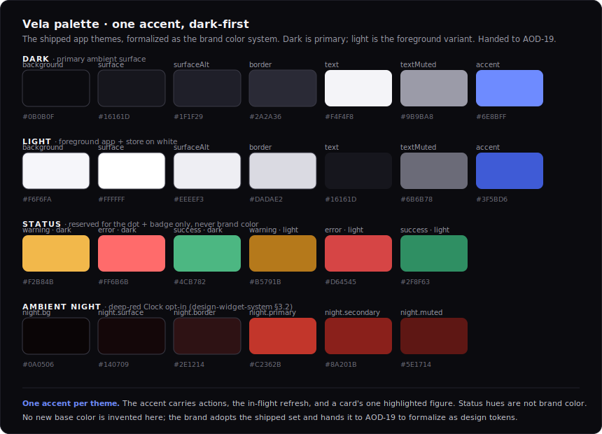
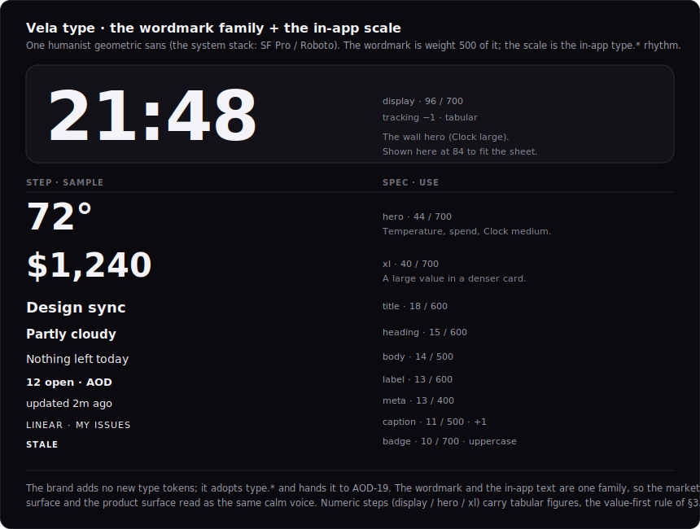

# Design: Vela brand visual identity (wordmark, palette, voice)

> Status: draft for review, 2026-06-29. Tracked by [AOD-18](https://linear.app/thexap/issue/AOD-18) (`type:design`, `area:brand`, `area:design-system`; milestone DS-M1 "Brand & Tokens", project Design System). The **front of the Design System track**: the first deliverable after the v1 widget visual set was completed in code (Clock [AOD-62](https://linear.app/thexap/issue/AOD-62), Calendar + Weather [AOD-63](https://linear.app/thexap/issue/AOD-63), Claude usage [AOD-64](https://linear.app/thexap/issue/AOD-64), Linear [AOD-65](https://linear.app/thexap/issue/AOD-65)). It follows the `type:design` deliverable convention recorded in [`engineering-process.md`](../engineering-process.md): a `design-` doc under `docs/specs/` plus rendered SVG mockups in `docs/specs/assets/`, tokens specified (not written into [`unistyles.ts`](../../apps/app/unistyles.ts)), merged via PR. It turns the brand **name** chosen in [AOD-1](https://linear.app/thexap/issue/AOD-1) (Vela) into a **visual identity**.
>
> **It supersedes the issue's original "Produce (Figma)" wording.** AOD-18 was written before [AOD-37](https://linear.app/thexap/issue/AOD-37) set the repo's `type:design` convention (a `design-` doc + rendered SVGs in-repo, not a Figma file). This deliverable follows that established convention, the same one all four widget designs used; Figma is not part of this repo's design flow. No scope changes, only the medium.
>
> **Design-first, surfaced for approval.** Brand is subjective and Xavier's call, so three identity directions (Star, Sail, Vigil) were surfaced before anything was finalized. **Direction B, Sail, is the approved mark** — the warm gold "Ambient Sail". The two alternates (Star, Vigil) are recorded in section 3 for the audit trail.
>
> **Revision (2026-07-17): the mark is now the gold Ambient Sail, superseding the Star.** [AOD-128](https://linear.app/thexap/issue/AOD-128) replaced the four-point star with the warm gold **Ambient Sail** (a gold sail and two small cream star accents on a deep navy tile), drawn in [`vela-sail-mark.svg`](assets/vela-sail-mark.svg) and propagated to the app icons in [`apps/app/assets/`](../../apps/app/assets/) (`icon.png`, the adaptive `android-icon-*`, `splash-icon.png`, `favicon.png`). The four-point star was originally approved 2026-06-29; it is now retired to historical lineage (section 3). Its construction sheet `design-brand-mark.svg` and the leading glyph in `design-brand-wordmark.svg` predate this change and still depict the Star; they are kept for the audit trail, and re-rendering them is not part of this change. The palette, type, and voice (sections 5 to 7) are unchanged; the mark's own warm gold/navy is described in section 4, and any broader warming of the app palette is tracked separately, not settled here.
>
> **Consistency is the hard constraint.** The app already ships a calm dark ambient look that users see (the [AOD-37](https://linear.app/thexap/issue/AOD-37) / [AOD-62](https://linear.app/thexap/issue/AOD-62) widget visual system: background `#0B0B0F`, surface `#16161D`, text `#F4F4F8`, the single accent `#6E8BFF`, the `type.*` scale, in [`unistyles.ts`](../../apps/app/unistyles.ts) and [`design-widget-system.md`](design-widget-system.md) §3). The brand identity is **consistent with and justifies** that shipped palette and its one-accent discipline; it does not invent a clashing one. Where a direction would have evolved the palette it is **named explicitly and handed to [AOD-19](https://linear.app/thexap/issue/AOD-19)** (section 8); the approved Sail direction keeps the shipped **app** palette and its one-accent discipline unchanged. The mark itself is drawn in its own warm gold on navy (section 4); any broader warming of the app palette is tracked separately, not settled here.
>
> **What this fixes, and what it must not touch.** It fixes the **brand visual identity**: the wordmark and logomark (the compact app-icon mark), the brand color system, the typographic voice, and the voice and tone. It expresses every value as a **design token** already present in (or adopted verbatim from) the shipped theme; it does **not** edit [`unistyles.ts`](../../apps/app/unistyles.ts) (that is [AOD-19](https://linear.app/thexap/issue/AOD-19)'s job and a later `type:tech-task`, the way a spec does not write its code). It does **not** build the design-token artifact ([AOD-19](https://linear.app/thexap/issue/AOD-19)), the component library ([AOD-20](https://linear.app/thexap/issue/AOD-20)), app screens ([AOD-21](https://linear.app/thexap/issue/AOD-21) / [AOD-27](https://linear.app/thexap/issue/AOD-27) / [AOD-28](https://linear.app/thexap/issue/AOD-28) / [AOD-29](https://linear.app/thexap/issue/AOD-29)), or store listing assets ([AOD-42](https://linear.app/thexap/issue/AOD-42)).

## 1. Purpose and scope

[AOD-1](https://linear.app/thexap/issue/AOD-1) chose the name **Vela** for the "calm ambient surface" pitch: the word carries a sail (Latin/nautical *vela*), a star (the southern constellation **Vela**, "the sails"), and a candle (Spanish *vela*), and the Spanish verb *velar* means "to keep vigil, to stay awake", on-concept for an always-on display. The domain is `velaglance.com`. That decision closed the last Phase 0 brand question and explicitly named **AOD-18** as the issue that turns the name into a visual identity. This doc is that work.

It fixes exactly four things:

1. **The logomark and wordmark** (section 4): the **Ambient Sail** (a warm gold sail with two small cream star accents on a deep navy tile) as the compact mark (the app-icon glyph) and a lowercase **vela** wordmark, with light and dark lockups, clear-space and minimum-size rules, and the app icon.
2. **The palette** (section 5): the brand color system, anchored verbatim on the shipped dark ambient palette and the **single accent** `#6E8BFF`, with each role justified, the dark (primary) and light themes, the reserved status hues, and the ambient-night extension, handed to [AOD-19](https://linear.app/thexap/issue/AOD-19).
3. **Typography** (section 6): the brand type voice (a humanist geometric sans) and how the wordmark relates to the in-app `type.*` scale.
4. **Voice and tone** (section 7): the brand voice (calm, ambient, glanceable, not busy or corporate) with do and don't copy examples, matching the "looked at, not interacted with" ethos.

**In scope:** the wordmark, the compact mark, the app icon, the lockups and their rules, the brand color system (dark primary + light + status + ambient night), the typographic voice, and the voice-and-tone guide, all consistent with the shipped ambient look and handed forward to [AOD-19](https://linear.app/thexap/issue/AOD-19) / [AOD-20](https://linear.app/thexap/issue/AOD-20) / [AOD-42](https://linear.app/thexap/issue/AOD-42).

**Out of scope (named so the frame is clear):** see section 9.

## 2. Locked context this builds on

| Source | What it locks | How this design uses it |
|---|---|---|
| [AOD-1](https://linear.app/thexap/issue/AOD-1) | The brand **name** Vela, its rationale (sail / star / candle; *velar* = keep vigil), the `velaglance.com` domain, and that AOD-18 turns the name into a visual identity. | Section 3 picks the **sail** motif (Vela is Latin/nautical for "the sails"), with two small star accents that keep the constellation hint; the whole doc realizes the name. |
| [`unistyles.ts`](../../apps/app/unistyles.ts) §3.1 / §3.2 / §3.3 | The shipped dark + light color themes, the deep-red `night.*` palette, and the `type.*` scale. | Section 5 adopts the colors **verbatim** as the brand palette; section 6 adopts `type.*` as the brand type scale. No new token is invented. |
| [`design-widget-system.md`](design-widget-system.md) §3 | The three visual rules (**the value dominates, the chrome recedes, night is first-class**) and the **one-accent rule** (one accent carries actions, the in-flight refresh, a card's one highlighted figure; status hues are reserved). | Sections 4 to 7 obey these rules: the mark is one accent on dark, the palette keeps one accent per theme, the voice keeps the chrome quiet. |
| [`design-widget-system.md`](design-widget-system.md) §3.1 | The status-hue reservation (`warning` / `error` / `success` carry the dot and badge, not brand). | Section 5 keeps the status hues out of the brand palette (the swatch sheet labels them "reserved"). |
| [`product-vision.md`](product-vision.md) | The "calm ambient surface" pitch, the positioning (MagicMirror / Smart Display, but a polished app), the "glanced at, not interacted with" ethos, and the privacy posture as a marketing point. | Section 7 derives the voice from the ethos; section 3 derives the mark from "a calm surface you glance at". |
| [`engineering-process.md`](../engineering-process.md) | The `type:design` deliverable convention (a `design-` doc + SVG mockups, tokens specified not coded, merged via PR) and the traceability chain (decision -> spec -> design -> tech-task). | This deliverable follows it; section 8 and 10 hand the formalization to [AOD-19](https://linear.app/thexap/issue/AOD-19). |

What is already true, and what this adds: the product already **looks** like Vela should (a dark field of glowing cards). This design does not restyle the app. It names the identity that the shipped look already implies, draws the mark and wordmark that did not exist yet, and writes the palette, type, and voice down once so [AOD-19](https://linear.app/thexap/issue/AOD-19) can formalize them and [AOD-42](https://linear.app/thexap/issue/AOD-42) can apply them to the store.

## 3. The chosen direction: Sail

Three directions were surfaced for approval, each on the shipped dark surface, differing in motif, voice, and palette stance:

| Direction | Motif | Concept | Voice | Palette stance |
|---|---|---|---|---|
| A · Star *(retired)* | A four-point point of light + a constellation hint | The dashboard is a night sky; a lit widget is a point of light. The constellation **Vela** literally means "the sails". Originally approved 2026-06-29, since superseded by the Sail. | Quiet, celestial, still | Zero change |
| **B · Sail** ✅ | A single warm gold billowed sail + two small cream star accents | A calm surface that carries you; nautical glide. **Vela** is Latin/nautical for "the sails", so the sail is the literal reading of the name; the star accents keep the constellation hint. | Steady, directional, easy | Warm gold sail on a deep navy tile (the mark's own palette; broader app-palette warming tracked separately) |
| C · Vigil *(retired)* | A candle with a soft halo | The one light left on; *vela* = candle, *velar* = keep vigil. The most literal "always on". | Warm, watchful, intimate | Optional future warm-glow accent (would be handed to [AOD-19](https://linear.app/thexap/issue/AOD-19), not invented here) |

**The Sail was approved** (superseding the Star, which was approved 2026-06-29; see the revision note at the top). The mark is the **Ambient Sail**: a single warm gold sail on a deep navy tile, with two small cream star accents that keep the constellation hint (**Vela** = "the sails", so the sail is the literal reading of the name, and the star accents fold the constellation back in). It reads cleanly as an app-icon glyph at small sizes, and its calm nautical motif matches an ambient surface that just carries on. The two alternates (Star, Vigil) are recorded here for the audit trail and are not built; the Star's original construction mockup (`design-brand-mark.svg`) is retained as historical lineage (section 4).

## 4. The logomark and wordmark

The mark is the **Ambient Sail**: a single warm gold sail on a deep navy tile, with two small cream star accents that hint the **Vela constellation** ("the sails") and read as a tiny dashboard of two lit points. The star accents drop away at small sizes, leaving the sail to carry the mark. The wordmark sets **vela** in lowercase, calm and unhurried, with the sail mark leading it.

### 4.1 The compact mark (the app-icon glyph)


<details>
<summary>Mark tokens &amp; construction</summary>

```
glyph     : a single abstract sail — one filled path, no stroke — billowed toward the leech,
            drawn in warm gold. It sits slightly right and low of optical center on the tile.
accents   : two small cream four-point star accents (one off the sail's peak, one lower-left).
            A constellation hint; they drop below 24px so the sail alone carries small sizes.
color     : sail #E2A94E (warm gold) · stars #EFE7D4 (cream) · tile #101E3B (deep navy).
            Monochrome knockout = sail + stars in solid #FFFFFF, tile dropped (1-color / themed icon).
app icon  : the deep navy tile with the sail. The source SVG rounds the tile (rx 62 on a 280 square);
            the shipped app icon is full-bleed square (no rx) because iOS and Android mask their own corners.
clear sp. : ½ the mark height (x) on every side.
min size  : >= 16px digital (the sail alone); the full mark + star accents >= 24px.
source    : assets/vela-sail-mark.svg (280×280) -> apps/app/assets/ (icon, adaptive, splash, favicon).
```
</details>

The mark's warm gold sail and cream stars on the deep navy tile are the sail's own palette, as drawn in `vela-sail-mark.svg`. For one-color print, an embossed stamp, or the Android 13+ themed icon, the sail and stars knock out solid white and the navy tile is dropped (the star accents may also drop at the smallest sizes). The app icon is the deep navy tile with the gold sail, propagated from the source SVG to `apps/app/assets/icon.png` and the adaptive, splash, and favicon variants.

### 4.2 The wordmark and lockups


*(The lockup mockup above predates the mark change and still shows the retired four-point star as the leading glyph; the current lockup leads with the Ambient Sail. A wordmark re-render is tracked separately.)*

<details>
<summary>Wordmark tokens &amp; rules</summary>

```
wordmark  : "vela", lowercase, a humanist geometric sans (the in-app system stack), weight 500, tracking +0.5.
lockup    : [ sail mark ] + [ ½x gap ] + [ vela ]. The horizontal lockup is the default.
            The mark may stand alone (the app icon); the wordmark may stand alone where the mark is present.
color     : text #F4F4F8 (dark) / ink #16161D (light); sail mark = warm gold #E2A94E on its navy tile.
clear sp. : one lowercase x-height around the lockup.
min size  : full lockup >= 88px wide.
never     : no italic, no all-caps wordmark, no outline, no drop shadow (shadows read as glare).
```
</details>

Lowercase is deliberate: the wordmark sits quietly and never shouts, matching an ambient display you glance at. The one place Vela uses uppercase is the in-app `type.caption` card header (`LINEAR · MY ISSUES`), which is chrome, not the wordmark.

### 4.3 Misuse

The mark and wordmark do not: recolor the sail or stars away from the mark's gold/cream/navy (or the solid-white knockout), gain a gradient or glow fill (the surface is flat; shadows and glows read as glare on an ambient display), get outlined, get set in italic or all-caps, or get crowded inside the clear-space. The two cream star accents are decorative and are dropped whenever they would not read (below 24px, or in a one-color knockout).

## 5. The palette

The brand color system is the shipped app theme, formalized. It adds **no new base color**. The dark theme is the primary ambient surface; the light theme is the foreground-app variant (used in the foreground app, light lockups, and the store on white). The status hues are **reserved** for the lifecycle dot and badge and are never used as brand color. The deep-red ambient-night palette recolors the Clock at night ([`design-widget-system.md`](design-widget-system.md) §3.2) and is shown for completeness as part of the Vela ambient look.



<details>
<summary>Palette roles (adopted verbatim from unistyles.ts)</summary>

```
DARK (primary ambient surface)
  background  #0B0B0F   the dashboard backdrop behind the cards
  surface     #16161D   the card fill
  surfaceAlt  #1F1F29   a raised surface
  border      #2A2A36   the 1px card border
  text        #F4F4F8   the hero value and primary text
  textMuted   #9B9BA8   titles, labels, meta, the receding chrome
  accent      #6E8BFF   THE one accent: actions, in-flight refresh, a card's one highlighted figure

LIGHT (foreground app + store on white)
  background  #F6F6FA   surface #FFFFFF   surfaceAlt #EEEEF3   border #DADAE2
  text        #16161D   textMuted #6B6B78   accent #3F5BD6

STATUS (reserved: the dot + badge only, never brand color)
  warning #F2B84B/#B5791B   error #FF6B6B/#D64545   success #4CB782/#2F8F63   (dark / light)

AMBIENT NIGHT (deep-red Clock opt-in, design-widget-system §3.2)
  night.bg #0A0506   night.surface #140709   night.border #2E1214
  night.primary #C2362B   night.secondary #8A201B   night.muted #5E1714
```
</details>

### 5.1 The one-accent rule is the brand

The single most identity-defining choice is restraint: **one accent per theme**, on a near-black surface. The accent carries actions, the in-flight refresh, and a card's one highlighted figure ([`design-widget-system.md`](design-widget-system.md) §3.1). The brand inherits this rule rather than overriding it. There is no brand secondary, no gradient, no rainbow. A glanceable ambient surface earns its calm by spending color almost nowhere; the brand says the same thing the widgets already say.

### 5.2 Dark is primary

Vela is dark-first. The dark theme is the canonical ambient surface (the wall display in a room, the kiosk on a shelf), and the brand presents dark first in every context that allows it (the app icon, the splash, marketing on dark). The light theme exists and is correct for the foreground app in daylight and for the store on white, but it is the variant, not the lead.

### 5.3 What this hands to [AOD-19](https://linear.app/thexap/issue/AOD-19)

This design **evolves the palette in zero ways**: it adopts the shipped colors verbatim and hands them to [AOD-19](https://linear.app/thexap/issue/AOD-19) to formalize as design tokens (the coded artifact). The one place an alternate direction would have changed the palette, the Vigil direction's optional warm "glow" accent (section 3), was **not** taken; if a future revisit ever wants it, it is specified there (in a design), handed to [AOD-19](https://linear.app/thexap/issue/AOD-19), and weighed against the one-accent rule, not slipped in here.

## 6. Typography



<details>
<summary>Type scale (adopted verbatim from unistyles.ts §3.3)</summary>

```
display  96 / 700  tracking -1    tabular   the wall hero (Clock large)
hero     44 / 700  tracking -0.5  tabular   temperature, spend, Clock medium
xl       40 / 700                 tabular   a large value in a denser card
title    18 / 600                           a card's primary text line (event title)
heading  15 / 600                           a labeled condition / section head
body     14 / 500                           default body text, the empty-body line
label    13 / 600                           an accent-or-muted label above a value
meta     13 / 400                           muted secondary detail
caption  11 / 500  tracking +1              the quiet SERVICE · WIDGET header
badge    10 / 700  tracking +1  uppercase   the stale / error badge text
```
</details>

### 6.1 One family, brand and product

The brand type voice is a **humanist geometric sans**: the in-app system stack (SF Pro on iOS, Roboto on Android), which is what the renderers already draw. The wordmark is weight 500 of this same family. Using one family for the wordmark and the in-app text means the marketing surface and the product surface read as the **same calm voice**; there is no separate "brand font" that the app cannot render.

### 6.2 The scale is the in-app rhythm

The brand adopts the `type.*` scale verbatim as its typographic system, so a headline in a store screenshot and a value on a card share one rhythm. Numeric steps (`display`, `hero`, `xl`) carry **tabular figures**, the value-first rule of [`design-widget-system.md`](design-widget-system.md) §3, so a ticking clock or a refreshing spend does not jitter. The brand adds **no new type token**; like the palette, it hands `type.*` to [AOD-19](https://linear.app/thexap/issue/AOD-19) to formalize.

## 7. Voice and tone

The product is "looked at, not interacted with". The voice matches: **calm, glanceable, quietly confident**, never busy or corporate. It is the voice of a surface that is just *on*, in the background, helping without demanding.

### 7.1 Principles

- **Quiet, not loud.** State the value, then stop. No exclamation marks, no hype, no "supercharge".
- **Glanceable, not wordy.** Short lines. If the eye has to work, the copy failed the same way a busy card would.
- **Present, not urgent.** Vela is ambient. It does not manufacture urgency ("Act now!"); it sits there, on, ready.
- **Plain, not corporate.** No jargon, no "leverage your productivity". Say the real thing in real words.
- **Honest, because privacy is the brand.** The posture from [AOD-5](https://linear.app/thexap/issue/AOD-5) (never sell data, never train on it, tokens encrypted server-side, disconnect wipes immediately) is stated plainly, never as a fine-print disclaimer.

### 7.2 Do and don't

| Context | Do (calm, glanceable) | Don't (busy, corporate) |
|---|---|---|
| Tagline | "Always on. Never loud." | "The ultimate all-in-one productivity dashboard!" |
| Sub-tagline | "Your whole world, quietly lit." | "Supercharge your day and take control of everything." |
| Empty state | "Nothing left today." | "You have no events. Add one to get started now!" |
| Kiosk pitch | "The one screen you leave on." | "Never miss a thing with real-time alerts!" |
| Privacy line | "Your tokens stay encrypted. We never sell or train on your data." | "Industry-leading enterprise-grade security solutions." |
| Connect prompt | "Connect Linear." | "Unlock powerful integrations and boost your workflow!" |

### 7.3 Writing the name

The brand is **Vela** (capital V in prose, lowercase in the wordmark logo). "alwaysOnDashboard" is the internal codename only and never appears in user-facing copy. Avoid "the Vela app" where "Vela" alone reads; avoid possessive-heavy phrasing. The flagship feature is **Kiosk Mode** (capitalized as a feature name). A formal trademark clearance in the software class is still a launch prerequisite ([AOD-1](https://linear.app/thexap/issue/AOD-1)).

## 8. Consistency with the shipped ambient look

This is the constraint the brief set, so it is called out explicitly. The brand identity is **consistent with and justifies** the shipped ambient look:

- **Palette:** adopted verbatim (section 5). The brand changes **no** shipped color and invents **no** new one. The mark and wordmark introduce no color beyond the two theme accents.
- **One accent:** honored (section 5.1). The brand has no secondary brand color; the single accent is the identity.
- **Type:** adopted verbatim (section 6). One family for the wordmark and the in-app text.
- **The mark sits on the surface:** the Ambient Sail is drawn on the same deep, dark field the product already is; the sail's warm gold is the mark's own accent (the broader warming of the app palette is tracked separately, not settled here), and the two cream star accents keep the constellation tie to the shipped ambient look.

**Where it evolves the palette:** nowhere. The only candidate evolution (the Vigil direction's warm glow) was not the approved direction and is not taken. If brand work ever wants to evolve a color, this doc's rule is that it is specified in a design, handed to [AOD-19](https://linear.app/thexap/issue/AOD-19), and weighed against the one-accent rule, never slipped into code.

## 9. Out of scope (named so the frame is clear)

- **The design-token artifact** ([AOD-19](https://linear.app/thexap/issue/AOD-19)): formalizing color / type / spacing / dark theme as coded tokens, and any edit to [`unistyles.ts`](../../apps/app/unistyles.ts). This doc **specifies** the palette and type; it does not code them.
- **The component library** ([AOD-20](https://linear.app/thexap/issue/AOD-20)): buttons, inputs, the settings/onboarding/paywall surface.
- **App screens and navigation IA** ([AOD-21](https://linear.app/thexap/issue/AOD-21) / [AOD-27](https://linear.app/thexap/issue/AOD-27) / [AOD-28](https://linear.app/thexap/issue/AOD-28) / [AOD-29](https://linear.app/thexap/issue/AOD-29)).
- **Store listing assets** ([AOD-42](https://linear.app/thexap/issue/AOD-42)): the App Store / Play screenshots, feature graphic, and listing copy. This doc gives them the mark, palette, type, and voice to use.
- **The widget visual system** ([AOD-37](https://linear.app/thexap/issue/AOD-37) and the four applications): already designed and built. The brand reuses its rules; it does not restyle the widgets.
- **Motion / brand animation, an illustration system, and social templates:** future, named in section 10.
- **Any code change.** This is a design deliverable.

## 10. Seams left open (named, not decided)

| Seam | Owner | What this design leaves clean |
|---|---|---|
| **Design tokens** (color / type / spacing / dark theme as a coded artifact, then the `unistyles.ts` edit) | [AOD-19](https://linear.app/thexap/issue/AOD-19) + a `type:tech-task` | The palette and type are fixed here as the shipped set, verbatim; AOD-19 formalizes them. |
| **The component library** | [AOD-20](https://linear.app/thexap/issue/AOD-20) | The brand (mark, palette, type, voice) is fixed; the components apply it. |
| **Store listing assets** (screenshots, feature graphic, icon export, listing copy) | [AOD-42](https://linear.app/thexap/issue/AOD-42) | The mark, app icon, palette, type, and voice are fixed; AOD-42 produces the store renders. The app-icon construction (section 4.1) is the source for the icon export. |
| **Production logo files** (SVG/PNG exports at icon sizes, the `.icon`/adaptive-icon assets) | [AOD-42](https://linear.app/thexap/issue/AOD-42) build | The mark geometry is fixed here as repo SVGs; production export is a build step. |
| **A warm "glow" accent evolution** (the Vigil direction's option) | future design -> [AOD-19](https://linear.app/thexap/issue/AOD-19) | Not taken; if ever revisited it is specified in a design and weighed against the one-accent rule, not slipped into code (section 8). |
| **Motion / brand animation** (a star-accent twinkle, the splash) | future | Named, not designed; the surface is otherwise still and flat. |
| **An illustration / empty-marketing style and social templates** | future | The mark and palette set the constraints; the system is later. |
| **Trademark clearance** in the software class | Xavier (pre-launch) | Named in [AOD-1](https://linear.app/thexap/issue/AOD-1); a launch prerequisite, not a design task. |

## 11. Proposed acceptance

Proposed acceptance for this design (call out for confirmation):

> 1. The **direction is chosen and recorded**: three identity directions (Star, Sail, Vigil) were surfaced for approval; the **Sail** ("Ambient Sail") is the approved and built mark (superseding the Star, which was approved 2026-06-29); the alternates are recorded for the audit trail (section 3).
> 2. The **logomark and wordmark** are fixed: the **Ambient Sail** compact mark (a warm gold sail with two cream star accents on a deep navy tile, the accents dropping at small sizes), the lowercase **vela** wordmark, the light and dark lockups, the **clear-space** (½x mark / 1 x-height wordmark) and **minimum-size** (16px mark / 88px lockup) rules, the **app icon**, and the misuse list (section 4; `assets/vela-sail-mark.svg`, propagated to `apps/app/assets/`).
> 3. The **palette** is fixed as the **shipped set adopted verbatim**: the dark (primary) and light themes, the reserved status hues, and the ambient-night extension, with the **one-accent rule** kept as the identity and **no new base color** (section 5; `design-brand-palette.svg`), handed to [AOD-19](https://linear.app/thexap/issue/AOD-19).
> 4. The **typography** is fixed: a humanist geometric sans (the in-app system stack), the wordmark at weight 500 of it, and the in-app `type.*` scale adopted **verbatim** as the brand type system with tabular numeric steps, **no new type token** (section 6; `design-brand-type.svg`), handed to [AOD-19](https://linear.app/thexap/issue/AOD-19).
> 5. The **voice and tone** are fixed: calm, glanceable, present, plain, honest, with a do/don't copy table and the name-writing rule (section 7).
> 6. **Consistency** is explicit: the brand adopts the shipped palette and type verbatim, honors the one-accent rule, and evolves the palette in **zero** ways; any future evolution is specified in a design and handed to [AOD-19](https://linear.app/thexap/issue/AOD-19), never slipped into code (section 8).
> 7. The deliverable follows the `type:design` convention (a `design-` doc + rendered SVG mockups, tokens specified not coded, merged via PR), and the **four mockups render** in both dark and light (section 4 to 6).
> 8. The work is **handed forward**: tokens to [AOD-19](https://linear.app/thexap/issue/AOD-19), components to [AOD-20](https://linear.app/thexap/issue/AOD-20), store assets to [AOD-42](https://linear.app/thexap/issue/AOD-42); no code is changed (sections 9, 10).

| Acceptance clause | Where |
|---|---|
| Direction chosen (Sail, superseding Star) + alternates recorded | Section 3 |
| Logomark + wordmark: mark, wordmark, lockups, clear-space, min-size, app icon, misuse | Section 4; `assets/vela-sail-mark.svg` (mark), `design-brand-wordmark.svg` (star-era lockup) |
| Palette: dark primary + light + reserved status + ambient night, one accent, no new color | Section 5; `design-brand-palette.svg` |
| Typography: one family, the wordmark, the in-app scale verbatim | Section 6; `design-brand-type.svg` |
| Voice and tone: principles + do/don't + name-writing | Section 7 |
| Consistency with the shipped ambient look; zero palette evolution | Section 8 |
| Out of scope; seams handed to AOD-19 / AOD-20 / AOD-42 | Sections 9, 10 |

## 12. References

- [AOD-18](https://linear.app/thexap/issue/AOD-18): this design's tracking issue (`type:design`, `area:brand`, `area:design-system`; milestone DS-M1 "Brand & Tokens", project Design System).
- [AOD-1](https://linear.app/thexap/issue/AOD-1): the brand-name decision (Vela), its rationale and the `velaglance.com` domain. The decision this design realizes.
- [AOD-19](https://linear.app/thexap/issue/AOD-19): design tokens (color / type / spacing / dark theme). The downstream that formalizes sections 5 and 6 as coded tokens.
- [AOD-20](https://linear.app/thexap/issue/AOD-20): the component library. Applies the brand.
- [AOD-42](https://linear.app/thexap/issue/AOD-42): store listing assets. Consumes the mark, app icon, palette, type, and voice.
- [`design-widget-system.md`](design-widget-system.md) ([AOD-37](https://linear.app/thexap/issue/AOD-37)): §3 the token foundation, the three visual rules, and the one-accent rule this brand inherits; §3.2 the ambient-night palette.
- [`unistyles.ts`](../../apps/app/unistyles.ts): the shipped dark/light themes and the `type.*` scale this brand adopts verbatim. Specified here, not edited.
- [`product-vision.md`](product-vision.md): the "calm ambient surface" pitch, the positioning, and the "glanced at, not interacted with" ethos the voice derives from.
- [AOD-5](https://linear.app/thexap/issue/AOD-5): the privacy posture the voice states plainly (section 7.1).
- [`engineering-process.md`](../engineering-process.md): the `type:design` lifecycle and deliverable convention this follows.
- Assets: [`vela-sail-mark.svg`](assets/vela-sail-mark.svg) — the approved Ambient Sail mark, propagated to the app icons in [`apps/app/assets/`](../../apps/app/assets/). The earlier star-era mockups [`design-brand-mark.svg`](assets/design-brand-mark.svg) and [`design-brand-wordmark.svg`](assets/design-brand-wordmark.svg) are retained as historical lineage (section 4); [`design-brand-palette.svg`](assets/design-brand-palette.svg) and [`design-brand-type.svg`](assets/design-brand-type.svg) remain current for the palette and type.
