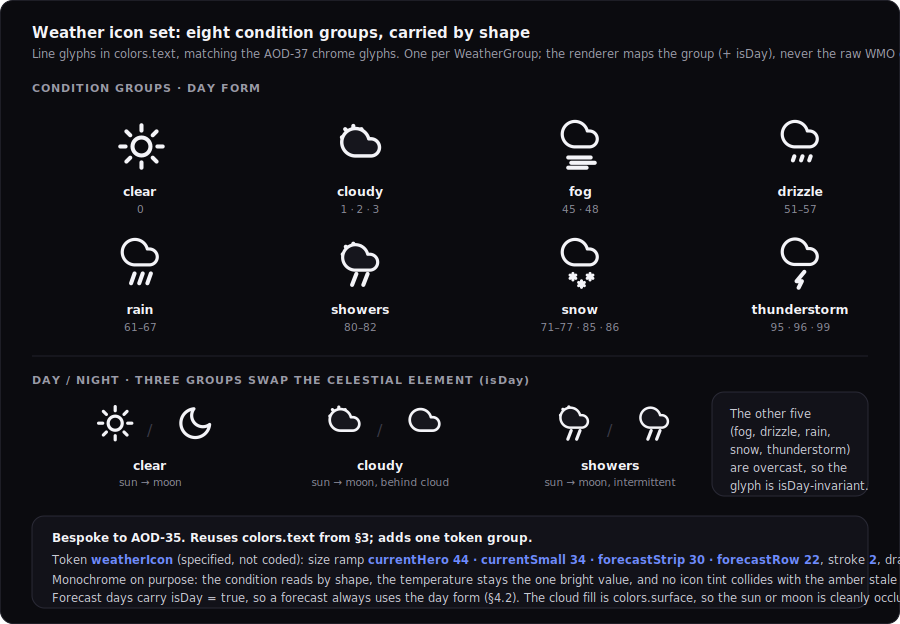

# Design: Calendar + Weather widget visuals

> Status: draft for review, 2026-06-29. Tracked by [AOD-35](https://linear.app/thexap/issue/AOD-35) (`type:design`, `area:integrations:calendar`, `area:design-system`; milestone I-M1 "Calendar & Weather", project Integrations). The **first sibling application** of the shared widget visual system designed in [AOD-37](https://linear.app/thexap/issue/AOD-37) ([`design-widget-system.md`](design-widget-system.md), PR #19). It follows the established `type:design` deliverable convention recorded in [`engineering-process.md`](../engineering-process.md): a `design-` doc under `docs/specs/` plus rendered SVG mockups in `docs/specs/assets/`, tokens specified (not written into [`unistyles.ts`](../../apps/app/unistyles.ts)), merged via PR.
>
> **This is an application, not a redesign.** [AOD-37](https://linear.app/thexap/issue/AOD-37) drew the shared language once (the card chrome, the design-token foundation, the six lifecycle-state visuals, the day/night dim and ambient behavior, the on-demand refresh affordance) precisely so the per-widget designs are **applications** of it. [`design-widget-system.md`](design-widget-system.md) §9 already maps what each sibling reuses versus designs bespoke. This doc honors that map: it **reuses** §3 (tokens), §4 (chrome), §5 (states), §6 (refresh), §7 (dim/ambient) **unchanged**, and designs **only** each widget's bespoke body plus the one design problem §9 hands to AOD-35, the **weather icon set**. Where applying the system surfaced a genuine gap, it is **flagged** (section 10), not silently forked.
>
> **What this fixes, and what it must not touch.** It fixes the **visuals** of the four functional-but-unpolished renderers that shipped ahead of their design (each says so in its header comment, "the pixel polish is AOD-35"): [`CurrentWeatherCard`](../../apps/app/src/registry/services/weather/CurrentWeatherCard.tsx), [`ForecastCard`](../../apps/app/src/registry/services/weather/ForecastCard.tsx), [`NextEventCard`](../../apps/app/src/registry/services/google_calendar/NextEventCard.tsx), [`AgendaCard`](../../apps/app/src/registry/services/google_calendar/AgendaCard.tsx). It expresses every value as a **design token** and adds only the **one** genuinely new token group AOD-35 needs (`weatherIcon`); it does **not** edit `unistyles.ts` (the polish build does, the way a spec does not write its code). It does **not** change the [AOD-8](https://linear.app/thexap/issue/AOD-8) §6.1 render contract `{ data, config, size }`: the renderers stay pure and never learn auth/loading/error, the generic host keeps drawing the chrome. The implementing polish is a **separate I-M1 `type:tech-task`**, the way each integration spec was separate from its build.

## 1. Purpose and scope

I-M1 "Calendar & Weather" shipped two services and four leaf renderers at on-brand-enough fidelity, each deferring its pixel polish to this design ([`integration-weather.md`](integration-weather.md) §10, [`integration-calendar.md`](integration-calendar.md) §10 both name AOD-35 as the visual owner). [AOD-37](https://linear.app/thexap/issue/AOD-37) then drew the shared system. This doc applies that system to the four widgets, so the build is "map onto the scale, draw the bespoke body."

It fixes exactly five things:

1. **The weather icon set** (section 4): eight monochrome line glyphs, one per `WeatherGroup` the payload carries, with a day/night rule driven by the payload `isDay` flag. This is the meatiest design problem here and the one [`design-widget-system.md`](design-widget-system.md) §9 explicitly hands to AOD-35.
2. **The Weather Current face** (section 5): the value-first body across `small` and `medium`, the day/night condition treatment, and the distinction between the icon's day/night (payload) and the card's night dim (ambient).
3. **The Weather Forecast face** (section 6): the multi-day strip at `wide` and the row list at `large`, the high/low and Today emphasis, the per-day icon, precip, and the echoed units.
4. **The Calendar Next Event face** (section 7): the "when" emphasis (relative time + clock), the title and location, the all-day vs timed treatment, and the "Nothing next" empty state.
5. **The Calendar Agenda face** (section 8): list density across `tall`, `wide` (and the reconciled `large`), the all-day vs timed rows, the next-event emphasis, and the "+N more" overflow and "Nothing left today" empty state.

**In scope:** the bespoke per-widget bodies, the weather icon set and its day/night rule, the per-size layouts across the supported sizes, the one new token group (`weatherIcon`), and the explicit reuse map that proves the AOD-37 system carries these widgets (section 3, the `area:design-system` charge).

**Out of scope (named so the frame is clear):**

- **Implementing the polish in code.** A separate I-M1 `type:tech-task` lifts `weatherIcon` into [`unistyles.ts`](../../apps/app/unistyles.ts) and applies these visuals to the four renderers. This doc is the design it implements.
- **[AOD-36](https://linear.app/thexap/issue/AOD-36) (Claude usage visuals),** the other sibling application; its spend chart is its own.
- **Any redesign of the AOD-37 system** (chrome, the six states, the token scale, dim/ambient, the refresh affordance) beyond the one flagged additive gap (section 10). If applying the system tempts a chrome or state change, that belongs in AOD-37, not here.
- **The registry / host / layout architecture and the `{ data, config, size }` render contract.** Unchanged. The renderers stay pure leaf functions.
- **The Weather / Calendar backend and credential handling** ([AOD-13](https://linear.app/thexap/issue/AOD-13), [AOD-9](https://linear.app/thexap/issue/AOD-9)): the normalized payloads ([`integration-weather.md`](integration-weather.md) §4, [`integration-calendar.md`](integration-calendar.md) §4) are fixed inputs this design renders, not data it reshapes.
- **Imperial units.** v1 is metric; units are **echoed from the payload** (section 6), so an imperial future ([`integration-weather.md`](integration-weather.md) §10) changes the echoed strings, not this design.
- **Motion** beyond what AOD-37 already named (the loading shimmer, the refresh spin); these bodies are static layouts.

## 2. Locked context this builds on

| Source | What it locks | How this design uses it |
|---|---|---|
| [`design-widget-system.md`](design-widget-system.md) §3 | The token foundation: the color set, the `type.*` scale, the night palette, the `overlay` and `dot` tokens. | Sections 4 to 8 reference `type.hero` / `type.title` / `type.heading` / `type.meta` / `type.caption` and `colors.*`; this design adds only `weatherIcon` (section 10). |
| [`design-widget-system.md`](design-widget-system.md) §4 | The shared card chrome: the frame, the quiet `SERVICE · WIDGET` header, the status-and-refresh cluster, the value-first body. | Every face mounts in this chrome unchanged; the mockups show it (the header, the idle refresh) and the bodies fill only the body zone. |
| [`design-widget-system.md`](design-widget-system.md) §5 | The six lifecycle-state visuals (loading, fresh, stale, error, `needs_config`, `disconnected`), drawn by the host. | This design draws **only** the `fresh` body; loading/stale/error/`needs_config`/`disconnected` are the host's and are not redrawn here. |
| [`design-widget-system.md`](design-widget-system.md) §6 | The on-demand refresh affordance as host chrome (idle / in-flight / within-floor / hidden). | Shown idle in the mockups; not redesigned. Every widget here fetches, so none hides it (unlike the Clock). |
| [`design-widget-system.md`](design-widget-system.md) §7 | The day/night dim: the global overlay default (`dimsWithAmbient: true`), the `useAmbient()` opt-in, the deep-red night palette. | All four widgets are **overlay-default**; none opts into deep red (that is the Clock). Section 5 separates the overlay dim from the weather icon's payload day/night. |
| [`design-widget-system.md`](design-widget-system.md) §9 | The reuse map: Weather reuses chrome/states/`type.hero`/`type.meta`/overlay and designs the icon set + day/night + forecast strip; Calendar reuses chrome/states/`type.title`/accent-when and designs agenda density + relative-time + all-day. | Section 3 is the realized version of this table; sections 4 to 8 are its bodies. |
| [`integration-weather.md`](integration-weather.md) §4 | The normalized `CurrentWeatherData` / `ForecastData` over a shared `WeatherCondition` (`code`, `label`, `group`, `isDay`), the `WeatherGroup` set, the echoed `WeatherUnits`. | Section 4 maps the eight groups to glyphs; sections 5 to 6 render the payload fields. |
| [`integration-calendar.md`](integration-calendar.md) §4 | The normalized `CalendarEvent` (`summary`, `location`, `start`/`end`, `allDay`), `NextEventData` (`hasEvent`), `AgendaData`, with relative time computed against the device clock. | Sections 7 to 8 render these; the "today" scoping and relative time stay in the renderer per the spec. |
| [AOD-10](https://linear.app/thexap/issue/AOD-10) §5 / [`registry/types.ts`](../../apps/app/src/registry/types.ts) | The canonical size catalogue (`small`/`medium`/`large`/`wide`/`tall` as role + aspect hints) and the nearest-supported-class reconciliation rule. | Section 9 fixes each widget's `supportedSizes` and the per-size body; the reconciliation rule covers off-aspect rects. |
| The four leaf renderers | The current functional visuals and their ad-hoc font sizes; the `VISIBLE_BY_SIZE` density tables; the renderer-drawn empty states. | This design maps the ad-hoc sizes onto the `type.*` scale and fixes the bespoke parts; the build edits the renderers, not the contract. |

What the renderers already do, and what this changes: each card already draws the value-first body the system formalizes (the temperature, the event title, the agenda rows), at an ad-hoc font size. This design (a) maps those sizes onto the AOD-37 `type.*` scale, (b) adds the **weather icon** the renderers left as a text label, and (c) fixes the bespoke emphasis (the when, the next-event rail, the day/night treatment). It changes the renderers' **appearance**, never their wiring.

## 3. Applying the system: the reuse map

The test of a system is that the sibling designs are applications, not redesigns. They are. Each part of each face is either **reused** from AOD-37 unchanged or a **bespoke** body element designed here. The table makes the seam explicit (this is the `area:design-system` deliverable: prove the reuse).

| Widget · part | Reuses from AOD-37 (unchanged) | Bespoke to AOD-35 (designed here) |
|---|---|---|
| **Weather Current** · value | `type.hero` temperature, `tabular-nums`, `colors.text` (§3) | The condition **icon** at the bright glance tier (section 4, 5) |
| Weather Current · condition | `type.heading` + `accent` (§3, the AOD-37 fresh example uses accent for the condition) | The day/night **icon swap** by payload `isDay` (section 4) |
| Weather Current · meta | `type.meta` + `colors.textMuted` (§3) | The feels/humidity/wind line composition (section 5) |
| **Weather Forecast** · body | The frame, quiet header, six states (§4, §5) | The **strip** (wide) and **row list** (large), Today emphasis, hi/lo (section 6) |
| **Calendar Next Event** · title | `type.title` + `colors.text` (§3) | (title is reused as-is) |
| Calendar Next Event · when | `accent` (§9 names accent for the "when") | The **when emphasis**: accent relative time + muted clock; the all-day kicker (section 7) |
| **Calendar Agenda** · rows | `type.meta` clock, `colors.text` title (§3) | The **density** per size, the all-day grouping, the **next-event rail** (section 8) |
| **All four** · chrome | Frame, header, status-and-refresh cluster, value-first hierarchy (§4) | nothing |
| All four · states | loading / fresh / stale / error / `needs_config` / `disconnected` (§5) | nothing (only the `fresh` body is drawn here) |
| All four · refresh | idle / in-flight / within-floor (§6); all four fetch, so none hides it | nothing |
| All four · night | the global **overlay** (`dimsWithAmbient: true`, §7) | nothing (no deep-red opt-in; that is the Clock) |

None of these needs a new card frame, a new state visual, a new dim behavior, or a new color. They consume sections 3 to 7 of [`design-widget-system.md`](design-widget-system.md) and design only the body. The **one** addition is the `weatherIcon` token group (section 10), the icon set's sizing, which AOD-37 could not have predicted without designing the icons; and **one** flagged gap, a shared "empty body" pattern (section 10), surfaced by the two calendar empty states.

## 4. The weather icon set (the bespoke centerpiece)

[`integration-weather.md`](integration-weather.md) §4.0 normalizes Open-Meteo's ~28 WMO `weather_code` values into a closed set of **eight `WeatherGroup` buckets** plus an `isDay` flag, exactly so the renderer maps a small set to icons rather than the raw codes. This section designs those eight glyphs and the day/night rule. It is the design [`design-widget-system.md`](design-widget-system.md) §9 hands to AOD-35 ("the weather icon set and the day/night condition treatment").



<details>
<summary>Design tokens &amp; the icon rule</summary>

```
style       : line glyphs, stroke 2 (non-scaling), round caps/joins, drawn in colors.text.
              Matches the AOD-37 chrome glyphs (refresh, sliders, link): the icon recedes to a
              quiet co-equal of the value, never a colored blob.
groups (8)  : clear (WMO 0) · cloudy (1,2,3) · fog (45,48) · drizzle (51-57) · rain (61-67) ·
              showers (80-82) · snow (71-77,85,86) · thunderstorm (95,96,99).
day/night   : clear / cloudy / showers swap the celestial element (sun -> crescent moon) on
              condition.isDay. fog / drizzle / rain / snow / thunderstorm are isDay-invariant
              (overcast: no sun or moon shows). Forecast days carry isDay = true (day form, §4.2).
token       : weatherIcon = { currentHero 44, currentSmall 34, forecastStrip 30, forecastRow 22,
              stroke 2, color: colors.text } (section 10; specified, not coded).
occlusion   : the partly/showers cloud is filled colors.surface so the sun/moon sits cleanly behind it.
```
</details>

### 4.1 Monochrome, carried by shape

The glyphs are **line icons in `colors.text`**, the same visual family as the AOD-37 chrome glyphs (the refresh circular-arrow, the `needs_config` sliders, the `disconnect` link). The condition is carried by **shape, not color**. This is a deliberate discipline, not an omission:

- The product's first rule is "the value dominates" ([`design-widget-system.md`](design-widget-system.md) §3). In Current the value is the **temperature**; a colored weather blob would compete with it. A monochrome icon joins the temperature as a quiet glance pair.
- The system has exactly **one accent** (`#6E8BFF`, blue). A blue sun is wrong, and a per-condition palette (yellow sun, grey cloud, blue rain) would reintroduce the rainbow the ambient language avoids. Worse, any amber/yellow icon tint would collide with the **amber stale dot** (`warning`), reading as a status signal.
- So the icon renders at the **bright text tier** (it is part of the glance), and the condition reads from its silhouette.

### 4.2 The eight glyphs and the day/night rule

One glyph per `WeatherGroup`. Three groups change with `isDay`; five do not:

- **Swaps sun ↔ moon** (`clear`, `cloudy`, `showers`): these are the conditions where the sky's day/night is visible. `clear` is a sun by day, a crescent moon by night. `cloudy` (which covers WMO 1 mainly-clear, 2 partly-cloudy, 3 overcast) is a sun-behind-cloud by day, a moon-behind-cloud by night. `showers` (intermittent) is a sun-and-cloud with streaks by day, a moon variant by night.
- **`isDay`-invariant** (`fog`, `drizzle`, `rain`, `snow`, `thunderstorm`): these are overcast or precipitating, so no sun or moon shows; one glyph serves day and night. `rain` is a cloud with three streaks, `drizzle` lighter dashes, `snow` three flakes, `thunderstorm` a cloud with a bolt, `fog` a cloud over drifting lines.

The renderer reads `condition.group` and `condition.isDay` and picks the glyph; **forecast days always carry `isDay: true`** ([`integration-weather.md`](integration-weather.md) §4.2), so a forecast always uses the day form. This rule keeps the set to eight base glyphs plus three night variants (eleven total), not sixteen.

A note on the `cloudy` group's coarseness: because WMO 1/2/3 all map to `cloudy`, one glyph (a partly-cloudy sun-or-moon behind a cloud) represents mainly-clear through overcast. That is a property of the fixed group set in [`integration-weather.md`](integration-weather.md) §4.0, not a choice this design can refine; widening the group set is a data-contract change, out of scope here.

## 5. Weather Current face

Current is the most glanceable weather card: the temperature is the value, the icon its companion. `supportedSizes: ['small', 'medium']`, default `small` ([`integration-weather.md`](integration-weather.md) §4.1). There is no empty state: a connected location always has current conditions.


<details>
<summary>Design tokens &amp; per-size layout</summary>

```
hero        : temperature, type.hero (44/700), tabular-nums, colors.text. The ° unit is echoed from units.temperature.
icon        : weatherIcon (currentHero 44 at medium, currentSmall 34 at small), colors.text, beside the temperature.
condition   : condition.label, type.heading (15/600), colors.accent (the one highlighted line; matches the AOD-37 §5 fresh example).
meta        : "Feels {apparent}° · {humidity}% · {wind} {windUnit} {compass}", type.meta (13/400), colors.textMuted, tabular.
small (1×1) : icon over temperature; header suppressed (self-evident glance); no meta.
medium (2×1): quiet header + status/refresh cluster; temperature + condition on the left, icon on the right; meta line below.
night       : condition.isDay = false -> moon glyph (payload). Independently, dimsWithAmbient: true -> the AOD-37 overlay
              darkens the whole card (NOT the deep-red opt-in). Two independent signals.
```
</details>

### 5.1 The value-first body

The temperature is `type.hero` in `colors.text` with `tabular-nums` (so a refresh does not shift its width), the largest brightest element. The **condition icon** (section 4) sits beside it at the same `colors.text` tier: temperature-and-icon is the classic weather glance, so they share the bright tier. The **condition label** is `type.heading` in `accent`, the card's one highlighted line (this matches the AOD-37 §5 fresh-state example, which already drew the weather condition in accent). The **meta** line (feels-like, humidity, wind with an 8-point compass) is `type.meta` in `textMuted`. At `small` the body is just icon over temperature with the header suppressed; at `medium` the full header, condition, and meta appear.

### 5.2 Two independent night signals

Current is where night is easy to confuse, so this design separates two signals that look related but are not:

- **The icon's day/night** comes from the **payload** `condition.isDay` (the observation's own local day or night). It picks sun vs moon. It is true even at noon-dim or midnight-bright; it is about the **weather**, not the room.
- **The card's night dim** comes from the **ambient** `phase` / `dimLevel` ([`design-widget-system.md`](design-widget-system.md) §7). Because Weather is `dimsWithAmbient: true`, the host paints the global overlay over the whole card at night. It is about the **room**, not the weather.

Weather is **overlay-default**; it does **not** opt into the deep-red `useAmbient()` palette (that is the Clock's iconic night look, [`design-widget-system.md`](design-widget-system.md) §7.3). The night row in the mockup shows both signals at once: a moon icon (payload) on a uniformly dimmed card (ambient).

## 6. Weather Forecast face

Forecast is the multi-day card. `supportedSizes: ['wide', 'large']`, default `wide` ([`integration-weather.md`](integration-weather.md) §4.2). The same `ForecastData.days` renders as two different layouts.


<details>
<summary>Design tokens &amp; per-size layout</summary>

```
wide (3×1)  : banner strip of day columns. Per column: weekday (top) / icon (mid) / hi · lo (bottom) / precip.
              Shows VISIBLE_BY_SIZE.wide = 5 days.
large (2×2) : row list under the quiet header. Per row: weekday · icon · condition label + precip · hi/lo (right).
              Shows VISIBLE_BY_SIZE.large = 7 days.
hi / lo     : tempMax in type.body/colors.text; tempMin in colors.textMuted. tabular-nums. ° echoed from units.
Today       : the first day's weekday in colors.text (bright); later weekdays in colors.textMuted (relative-time emphasis).
icon        : weatherIcon (forecastStrip 30 at wide, forecastRow 22 at large), day form (isDay = true).
precip      : precipProbabilityMax; accent at wide, muted at large; omitted when null.
```
</details>

### 6.1 Two layouts, one payload

At `wide` (a 3×1 banner) the days lay out **left to right as columns**, each stacking weekday, icon, and high/low, a glanceable strip for a shelf or a wall slot. At `large` (a 2×2 card) the days stack **top to bottom as rows**, each a weekday, icon, condition label with precip, and a right-aligned high/low, a denser read. The visible-day count follows the renderer's existing `VISIBLE_BY_SIZE` table (5 at wide, 7 at large), so this design fixes the layout, not the data slice.

### 6.2 High/low, Today, precip, units

The **high** is the bright figure (`colors.text`), the **low** recedes (`colors.textMuted`), both `tabular-nums` so the column aligns. The first day's weekday reads **"Today"** in `colors.text` while the later weekdays are `textMuted`; this is the relative-time emphasis the calendar uses (section 7), applied to the forecast so the eye lands on today first. **Precip** (`precipProbabilityMax`) shows in accent at wide and muted at large, and is omitted when the payload field is null. **Units** are echoed: the `°` comes from `units.temperature`, so a future imperial payload changes the label, not this layout.

## 7. Calendar Next Event face

Next Event answers "what is next, and when." `supportedSizes: ['small', 'medium']`, default `small` ([`integration-calendar.md`](integration-calendar.md) §4.1). [`design-widget-system.md`](design-widget-system.md) §9 hands AOD-35 "the 'when' emphasis (relative time + clock)" and "the all-day vs timed treatment"; the spec also names the "Nothing next" empty state.


<details>
<summary>Design tokens &amp; the when emphasis</summary>

```
when        : relative time ("In 25 min") in type.label (13/700) colors.accent, uppercased kicker, over the title.
              The clock ("· 2:30 PM") rides alongside in colors.textMuted. Both computed against the DEVICE clock (§4).
title       : event.summary, type.title (18/600), colors.text, up to 2 lines. "(No title)" when summary is empty.
location    : event.location, type.meta (13) colors.textMuted, with a pin glyph. Omitted when null.
all-day     : event.allDay true -> "ALL DAY" accent kicker, NO clock (an all-day event has no time anchor).
small (1×1) : when kicker over a 2-line title; header suppressed; no location.
medium (2×1): quiet header + cluster; full when line; title; location with pin.
empty       : hasEvent: false -> renderer draws a calm centred calendar glyph + "Nothing next" (type.body, textMuted)
              + a quiet subline. A data-bearing empty, NOT the host error/needs_config chrome (see §10 gap).
```
</details>

### 7.1 The when leads, the title is the value

The card's most useful glance is **when** the next thing is, so the **relative time** is the emphasized figure: an accent, uppercased kicker ("IN 25 MIN") above the title, with the **clock time** ("· 2:30 PM") riding alongside it in `textMuted`. The accent draws the eye; the clock gives the precise time without competing. The **title** is `type.title` in `colors.text`, the largest text and the thing you read. The **location** is a muted `type.meta` line with a pin glyph. Both relative time and clock are computed against the **device clock** in the renderer ([`integration-calendar.md`](integration-calendar.md) §4), so a cache hit still shows a correct countdown.

### 7.2 All-day vs timed, and the empty state

An **all-day** event has no time anchor, so its kicker reads **"ALL DAY"** in accent with **no clock**, and the body is just the title (the existing renderer already branches `allDay` to "All day"; this fixes its visual). The **empty** state (`hasEvent: false`, a normal empty-window result, not an error) is drawn by the renderer as a calm centered calendar glyph with "Nothing next" and a quiet subline. Because this fresh-but-empty body is renderer-drawn and AOD-37 §5 only specifies the host's six states, it is the seam that surfaces the section 10 gap.

## 8. Calendar Agenda face

Agenda is the day's list. `supportedSizes: ['tall', 'wide']`, default `tall` ([`integration-calendar.md`](integration-calendar.md) §4.2). [`design-widget-system.md`](design-widget-system.md) §9 hands AOD-35 "the agenda list density and the relative-time emphasis; the all-day vs timed treatment." The "today" scoping and overflow live in the renderer ([`integration-calendar.md`](integration-calendar.md) §4.2, §6.4).


<details>
<summary>Design tokens &amp; the density rules</summary>

```
all-day     : grouped on top; "All day" replaces the clock in the time column. Followed by a hairline divider.
timed row   : time = clock, type.meta (13) colors.textMuted, tabular-nums; title = type.body, colors.text, ellipsized.
next emphasis: the soonest upcoming event carries an accent LEFT RAIL (3px, colors.accent) and an accent time.
              This is the relative-time emphasis applied to a list: the agenda points at what is next.
overflow    : rows beyond the visible count fold into "+N more" (type.meta, colors.textMuted).
empty       : events empty -> renderer draws "Nothing left today" (see §10 gap), not a host state.
tall (1×2)  : two-line rows (time over title); fits a narrow deep column; VISIBLE_BY_SIZE.tall = 10.
wide (3×1)  : event cells laid left to right (time over title), hairline dividers; VISIBLE_BY_SIZE.wide = 5.
large (2×2) : single-line rows (time | title), location on a 2nd line; VISIBLE_BY_SIZE.large = 8. (reconciled class, §9)
```
</details>

### 8.1 Density per size

The same `AgendaData.events` takes three shapes, each native to its size's aspect:

- **`tall` (1×2)** is a deep narrow column, so rows are **two-line** (time over title): the column has height to spare and little width, so stacking beats a cramped side-by-side. Up to 10 rows, then "+N more".
- **`wide` (3×1)** is a short banner, so the events lay out as **cells left to right** (time over title), separated by hairlines, the timeline read as a strip. Up to 5 cells, then a trailing "+N more" cell.
- **`large` (2×2)** is a roomy square, so rows are **single-line** (time, then title) with a **location** on a second line where present. Up to 8 rows.

The visible counts are the renderer's existing `VISIBLE_BY_SIZE` values, so the design fixes the layout per size, not the slice.

### 8.2 All-day grouping and the next-event rail

**All-day** events have no time anchor, so they group **at the top** under the timed list, separated by a hairline, with "All day" in the time column. The **next upcoming event** (the soonest by device clock) is the agenda's one emphasis: an accent **left rail** plus an accent time, so the list **points at what is next** rather than reading as a flat block. This is the relative-time emphasis [`design-widget-system.md`](design-widget-system.md) §9 names for the calendar, realized as a list marker. It uses the single accent once per card, consistent with the value-first discipline.

## 9. Sizes and reconciliation

Each widget draws only the size classes it declares; the [AOD-10](https://linear.app/thexap/issue/AOD-10) §5 reconciliation rule maps a free-form rect to the nearest supported class, and the renderer fills that class's layout.

| Widget | `supportedSizes` | Default | Bodies designed here |
|---|---|---|---|
| Weather Current | `small`, `medium` | `small` | section 5 (both) |
| Weather Forecast | `wide`, `large` | `wide` | section 6 (both) |
| Calendar Next Event | `small`, `medium` | `small` | section 7 (both) |
| Calendar Agenda | `tall`, `wide` | `tall` | section 8 (`tall`, `wide`); `large` shown as a reconciled density |

The renderers' `VISIBLE_BY_SIZE` tables already enumerate every class defensively (so a reconciled off-aspect rect never reads an undefined count), which is why each face's density is defined for adjacent classes too. The **Agenda `large`** case is the one worth a note: `AgendaCard` counts `large: 8` defensively, and [`design-widget-system.md`](design-widget-system.md) §9 plus this task asked the density to cover the large list, so section 8 designs it. But `large` is **not** in Agenda's declared `supportedSizes` ([`integration-calendar.md`](integration-calendar.md) §4.2 fixes `tall` / `wide`). Whether to **promote** `large` into Agenda's `supportedSizes` is a spec / [AOD-4](https://linear.app/thexap/issue/AOD-4) decision, flagged as a seam (section 10); it is not an AOD-37 gap and is not decided here. The design covers `large` so the build is ready either way.

## 10. New tokens and the flagged gap

### 10.1 The one new token group: `weatherIcon`

The icon set needs sizing and a stroke; everything else reuses [`design-widget-system.md`](design-widget-system.md) §3. This is the only token AOD-35 adds, specified as an addition to [`unistyles.ts`](../../apps/app/unistyles.ts) for the polish build (not written here, per the convention):

```typescript
// Weather icon sizing (section 4). The glyphs draw in colors.text; sizes are per render context.
weatherIcon: {
  currentHero: 44,    // Current at medium, beside the type.hero temperature
  currentSmall: 34,   // Current at small
  forecastStrip: 30,  // Forecast wide, the column icon
  forecastRow: 22,    // Forecast large, the row icon
  stroke: 2,          // line weight, matching the AOD-37 chrome glyphs
}
```

It composes with the existing scale exactly as `clockSize` did in AOD-37 (a per-context size ramp for one widget family). No color token is added: the icon uses `colors.text` (section 4.1).

### 10.2 Flagged gap: a shared "empty body" pattern (a tiny AOD-37 follow-up)

Applying the system surfaced one genuine gap, and per the task it is flagged rather than forked. **AOD-37 §5 specifies the six host-drawn states but has no visual for a fresh-but-empty body**, a `fresh` render whose data legitimately says "nothing." Three v1 widgets hit this: Next Event's "Nothing next" (`hasEvent: false`), Agenda's "Nothing left today" (empty `events`), and (outside this design) Linear's "no active cycle." Today each renderer invents its own empty look, so they will drift.

This design draws both calendar empties to one **proposed** convention, so the build has a target: a **centered, calm body**, a quiet glyph (a muted or accent line-icon), a `type.body` `textMuted` line, and an optional quieter subline. It is deliberately distinct from the host's `error` / `needs_config` prompts (which carry an **action**); an empty body carries **no action**, because nothing is wrong.

This warrants a **tiny additive AOD-37 follow-up**: name a shared "empty body" treatment in [`design-widget-system.md`](design-widget-system.md) (a seventh, renderer-drawn body convention alongside the six host states) so Next Event, Agenda, and Linear share it. It is additive (no existing token or state changes), small (one short subsection), and belongs in the system because more than one widget needs it. Until it lands, the convention above is the local target; this design does not change AOD-37 itself.

## 11. Seams left open (named, not decided)

| Seam | Owner | What this design leaves clean |
|---|---|---|
| The **polish build** (lift `weatherIcon` into [`unistyles.ts`](../../apps/app/unistyles.ts); apply these visuals to the four renderers) | I-M1 `type:tech-task` | This doc fixes the visuals and the token; the build implements them. |
| The **shared "empty body" pattern** | tiny [AOD-37](https://linear.app/thexap/issue/AOD-37) follow-up | Flagged (section 10.2); the convention is drawn here; the system addition is additive and small. |
| Promoting **Agenda `large`** into `supportedSizes` | spec / [AOD-4](https://linear.app/thexap/issue/AOD-4) | The `large` density is designed (section 8); the declaration decision is named (section 9), not made here. |
| **Imperial units** (°F / mph) | future ([`integration-weather.md`](integration-weather.md) §10) | Units are echoed from the payload; an imperial payload changes the labels, not these layouts. |
| The **`cloudy` group coarseness** (WMO 1/2/3 share one glyph) | data contract ([`integration-weather.md`](integration-weather.md) §4.0) | The glyph represents the group honestly; finer partly-vs-overcast needs a wider group set, out of scope. |
| **Motion** (the loading shimmer, the refresh spin) | I-M1 build | Named by AOD-37 §10; these bodies are static layouts and add no new motion. |
| A **combined "Current + Forecast" card** | future ([`integration-weather.md`](integration-weather.md) §10) | v1 is two widgets; the two bodies here compose if a single card is preferred later. |
| **Per-condition color** or a filled/duotone icon style | future | v1 is monochrome by deliberate discipline (section 4.1); a richer style is additive and would need a token. |

## 12. Proposed acceptance

Proposed acceptance for this design (call out for confirmation):

> 1. The design is an **application** of [`design-widget-system.md`](design-widget-system.md): section 3's reuse map shows every part of every face either reuses §3 to §7 unchanged or is a named bespoke body, and no chrome, state, token scale, dim behavior, or refresh affordance is redrawn (the `area:design-system` proof).
> 2. The **weather icon set** is fixed: eight monochrome `colors.text` line glyphs, one per `WeatherGroup`, with the day/night rule (clear/cloudy/showers swap sun↔moon on `isDay`; the five overcast groups are invariant; forecast days use the day form), and the `weatherIcon` token specified, not coded.
> 3. The **Weather Current** face is fixed across `small` / `medium`: `type.hero` temperature with the icon at the bright tier, `type.heading`/accent condition, `type.meta` muted detail, units echoed, and the icon's payload day/night separated from the card's ambient overlay dim (overlay-default, not deep red).
> 4. The **Weather Forecast** face is fixed across `wide` (banner strip) and `large` (row list): bright high / muted low, Today emphasis, the day-form per-day icon, precip, and echoed units, at the renderer's `VISIBLE_BY_SIZE` counts.
> 5. The **Calendar Next Event** face is fixed across `small` / `medium`: the accent relative-time + muted-clock when emphasis, `type.title` event title, pin location, the all-day kicker, and the renderer-drawn "Nothing next" empty body.
> 6. The **Calendar Agenda** face is fixed across `tall` / `wide` (and the reconciled `large`): the per-size density, all-day grouping, the next-event accent rail, "+N more" overflow, and the "Nothing left today" empty body.
> 7. The system is **reusable**: applying it surfaced exactly one new token group (`weatherIcon`) and one flagged additive gap (a shared empty-body pattern), with no fork of AOD-37, and the **five mockups render**.

| Acceptance clause | Where |
|---|---|
| Application not redesign: the reuse map | Section 3 |
| Weather icon set + day/night rule + `weatherIcon` token | Section 4; `design-weather-icons.svg`; section 10.1 |
| Weather Current face (small, medium; day/night; two signals) | Section 5; `design-weather-current.svg` |
| Weather Forecast face (wide strip, large list; Today; hi/lo; precip) | Section 6; `design-weather-forecast.svg` |
| Calendar Next Event face (when emphasis; all-day; empty) | Section 7; `design-calendar-next-event.svg` |
| Calendar Agenda face (density; all-day; next rail; overflow; empty) | Section 8; `design-calendar-agenda.svg` |
| Sizes + reconciliation; the `large` Agenda note | Section 9 |
| New token; the flagged empty-body gap; seams; acceptance | Sections 10, 11, 12 |

## 13. References

- [AOD-35](https://linear.app/thexap/issue/AOD-35): this design's tracking issue (`type:design`).
- [`design-widget-system.md`](design-widget-system.md) ([AOD-37](https://linear.app/thexap/issue/AOD-37)): the shared widget visual system this applies. §3 (tokens), §4 (chrome), §5 (states), §6 (refresh), §7 (dim/ambient), §9 (the reuse map this realizes).
- [`integration-weather.md`](integration-weather.md) ([AOD-57](https://linear.app/thexap/issue/AOD-57)): the Weather data contract. §4 (the normalized payloads, the `WeatherGroup` set, echoed units), §12 (the verified WMO map), §10 (the visual seam handed here).
- [`integration-calendar.md`](integration-calendar.md) ([AOD-32](https://linear.app/thexap/issue/AOD-32)): the Calendar data contract. §4 (the normalized payloads, all-day vs timed, device-clock relative time), §10 (the visual seam handed here).
- [AOD-8](https://linear.app/thexap/issue/AOD-8): the render contract `{ data, config, size }` (§6.1) this preserves. [`architecture-registry.md`](architecture-registry.md).
- [AOD-10](https://linear.app/thexap/issue/AOD-10): the widget model. §5 (the size catalogue and reconciliation rule). [`widget-model.md`](widget-model.md).
- [AOD-4](https://linear.app/thexap/issue/AOD-4): the v1 widget set (the four widgets, their sizes and cadence).
- [AOD-36](https://linear.app/thexap/issue/AOD-36): the sibling Claude usage visuals (the other application of the system).
- The four leaf renderers polished here: [`CurrentWeatherCard.tsx`](../../apps/app/src/registry/services/weather/CurrentWeatherCard.tsx), [`ForecastCard.tsx`](../../apps/app/src/registry/services/weather/ForecastCard.tsx), [`NextEventCard.tsx`](../../apps/app/src/registry/services/google_calendar/NextEventCard.tsx), [`AgendaCard.tsx`](../../apps/app/src/registry/services/google_calendar/AgendaCard.tsx); the host [`WidgetHostView.tsx`](../../apps/app/src/host/WidgetHostView.tsx); the theme [`unistyles.ts`](../../apps/app/unistyles.ts).
- [`engineering-process.md`](../engineering-process.md): the `type:design` lifecycle and deliverable convention this follows.
