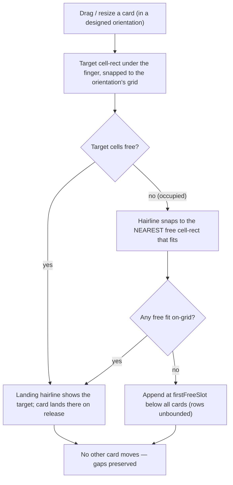

# Design: Vela layout foundation (free "chess board" placement, both orientations)

> Status: **ACCEPTED / locked, 2026-07-22** (Xavier sign-off; the §13 defaults confirmed). Tracked by
> [AOD-197](https://linear.app/thexap/issue/AOD-197) (`from:dogfood`, `area:layout`; project Redesign Build,
> milestone RB-M3). This is a **design + research decision doc**: it converges on one recommendation and hands
> a buildable model to a later chat. It writes
> **no application code**. It follows the `type:design` deliverable convention in
> [`engineering-process.md`](../engineering-process.md): a `design-` doc under `docs/specs/` plus rendered
> SVG specimens in [`docs/specs/assets/`](assets/), additions **specified** (not coded), merged via PR, and
> this issue updated with the recommendation for Xavier's sign-off **before it is locked**.
>
> **The requirement (Xavier, 2026-07-21).** A user must be able to **place widgets anywhere across the whole
> screen, a free "chess board", gaps allowed, in BOTH portrait and landscape.** Non-negotiable.
>
> **The reference model (Xavier, 2026-07-22, iPad Air 11" screenshots + follow-up).** The target is the
> **iPadOS Home Screen with per-orientation memory**: a responsive grid whose column count depends on
> orientation (he counted **6 landscape / 4 portrait**, wide margins, gaps), where **each orientation you
> design in is remembered independently**, and an orientation you have **not** designed **auto-reflows** from
> one you have ("one next to the other"). His decisive addition: **because Vela scrolls, both orientations are
> first-class on every device, including a phone** — the reason iPhone locks its Home Screen to portrait (no
> scrolling, so rotated widgets would overflow and be cut off) does not apply to Vela.
>
> **Where this sits in the lineage.** Placement has moved three times, now with device evidence:
> 1. `vela-DESIGN.md §5` — "free-form, not a rigid wall of tiles" (continuous absolute drop). Caused
>    [AOD-98](https://linear.app/thexap/issue/AOD-98) (resize does not snap) and
>    [AOD-103](https://linear.app/thexap/issue/AOD-103) (1-D append).
> 2. Many Skies redesign — a **2-column, 96px-row S/M/W/L slot grid** (audit §2.1). Fixed AOD-98/103, but its
>    column count is a **phone-portrait assumption** ("FOUR SIZES ON THE PHONE GRID").
> 3. **This doc** — the **iPadOS model**: a responsive slot grid that keeps the discipline which fixed
>    AOD-98/103, scales to the device, allows gaps, and remembers each orientation with reflow for the rest. Not
>    continuous free-form; a chess board is a grid with gaps, not a pixel plane.
>
> **What it must not break.** The registry seam (`supportedSizes` + `render`, AOD-8 §10); device-independent
> stored geometry; and the **kiosk wall render path** ([`KioskWall.tsx`](../../apps/app/src/kiosk/KioskWall.tsx),
> [AOD-81](https://linear.app/thexap/issue/AOD-81) auto-fit), which stays byte-identical. **Client-only** (no
> DB migration) is preserved.

## 1. Purpose and scope

Resolves the five questions on [AOD-197](https://linear.app/thexap/issue/AOD-197): the placement model (§5),
portrait to landscape and persistence (§6), the wall (§7), gaps versus reflow and collision (§8), coherence
with the siblings (§9). Plus trade-offs (§10), the specified-not-coded change list (§11), migration (§12),
sign-off (§13), acceptance (§14).

**Out of scope:** building any of it (a later chat plans the build across AOD-194/195/196/197 + 191/192); the
wall's multi-sky auto-cycle (§7 seam); wider-than-2 footprints and per-orientation *size* (§5/§6 seams);
alignment guides / magnetic snapping (§8 seam).

## 2. The problem: the editor grid is a 192dp strip, not the screen

![The problem: on a landscape screen the editable grid is pinned to a narrow two-column strip on the left and roughly eighty percent of the width is unreachable, because snapDrag clamps the column to zero or one; a portrait phone is the only case the two-column grid roughly fills the width. The root cause is a fixed ninety-six density-independent-pixel unit and a two-column count, so the grid is always one hundred ninety-two density-independent pixels wide anchored left, and the wall hides this by scaling to fill while the editor never scales.](assets/design-layout-problem.svg)

Confirmed on the Fire HD 8 ([AOD-190](https://linear.app/thexap/issue/AOD-190) Phase C). Two facts cause it:

- **The unit never scales to the viewport.** [`geometry.ts`](../../apps/app/src/layout/geometry.ts) renders
  at `left = x·UNIT_PX`, `UNIT_PX = 96` DP, fixed. The **wall** works only because
  [`KioskWall.tsx`](../../apps/app/src/kiosk/KioskWall.tsx) wraps the canvas in a `scale = wallFitScale(...)`
  layer; the editor has none.
- **The grid is two columns.** `GRID_COLUMNS = 2`; `snapDrag` clamps `x` to `[0, GRID_COLUMNS − w]`. Everything
  lives inside `192dp`, anchored left.

The stored rects are device-independent (worth keeping); the failures are that the editor never scales and the
2-column count is a phone-portrait construct.

## 3. Prior art (surveyed, then decided)

| Product | Model | What it teaches Vela |
|---|---|---|
| **iPadOS / iOS Home Screen** | Column count per device + orientation (iPad Air 11": ~6 landscape / ~4 portrait); fixed footprints; **iOS 18+ gaps**; **rotation reflows**; **each orientation remembered independently**. | **The chosen model** (Xavier's screenshots). Responsive columns + gaps + per-orientation memory with reflow is the proven consumer solution. |
| **iOS StandBy** (17+) | Landscape-only, widgets **large for across-the-room glance**, zero-interaction. | This *is* Vela's wall. The wall renders the landscape layout directly. |
| **Android home widgets** | Fixed cell grid, cells scale, **arbitrary gaps**, drag-resize; same grid across rotation. | Confirms gaps + uniform cells is proven; its no-reflow rotation is the less-liked path Apple's reflow improves on. |
| **Grafana / Datadog** | 12–24 column fixed grids, gaps, scroll. | Fine grids suit dense desktop ops; too cold for calm glance. Argues for a **coarse** count (6/4). |
| **Home Assistant (Sections)** | Responsive column count that **reflows** across widths. | Proves reflow is workable; its pain is unpredictability. Vela mitigates by making each orientation a *remembered* arrangement, reflow only seeding the ones you have not touched. |

**Xavier's scroll insight (why Vela beats the iPhone constraint):** iPhone locks its Home Screen to portrait
because it does **not** scroll, so a portrait layout rotated to landscape could overflow and cut widgets off.
**Vela scrolls**, so every orientation can show all widgets. That is why per-orientation layouts are
first-class on **every** device here, phones included.

## 4. The decision

**Adopt the iPadOS model with per-orientation memory: a responsive slot grid, free with gaps; each orientation
you arrange in is remembered independently; an orientation you have not arranged auto-reflows from one you
have. The wall renders the landscape layout.**

![The recommended model: a landscape frame with a six-column grid holding four widgets placed with gaps and wide margins, a rotate arrow labelled auto-reflow, and a portrait frame with a four-column grid where the same widgets are repacked at the top one next to the other. The orientation you design is remembered exactly; the other reflows until you design it too; responsive columns are six landscape and four portrait; footprints stay small, medium, wide, large; per-orientation positions ride the existing rect jsonb, so no schema migration.](assets/design-layout-grid-model.svg)

- **Responsive, per-orientation grid.** Landscape **6 columns**, portrait **4 columns** (Xavier's iPad),
  device-independent nominal units, tunable. Rows unbounded downward, the surface scrolls. Generous outer
  margins and inter-cell gutters (the Many Skies §1c "24px gutters" intent), scaled per orientation.
- **Cells scale to the viewport.** `cellPx = (viewportW − 2·margin − (C−1)·gutter) / C`, from `rt.screen` in DP
  (the AOD-81 lesson). Replaces the fixed `UNIT_PX = 96`. The core fix.
- **Per-orientation memory.** Each orientation you arrange in is **remembered**; an orientation you have not
  arranged is **derived** by reflow (§6). Both orientations are first-class on all devices (the scroll
  insight).
- **The wall renders the landscape layout** (§7): if you have designed landscape it is exact; if not, it is
  the reflow of your portrait design (and designing landscape gives exact wall control).
- **Footprints unchanged and shared across orientations.** A widget declares `supportedSizes` from S/M/W/L; it
  is "a medium widget" in both orientations (Apple-faithful), only its **position** reflows. The registry seam
  and every RB-M2 card face are preserved. Wider footprints and per-orientation *size* are named seams.

Not continuous free-form (reopens AOD-98). Not a single fixed count that only rescales (Xavier's portrait
genuinely repacks and is independently editable, it does not just shrink).

## 5. Placement model (Q1)

- **Continuous free / absolute pixels — rejected** (reopens AOD-98 snap loss + overlap; faces want boxes).
- **Responsive slot grid, gaps allowed — CHOSEN.** A chess board: uniform cells that scale to fill, any free
  cell placeable, gaps kept, no overlap, live-snap retained (AOD-98/103 fixes survive).
- **Columns 6 landscape / 4 portrait**, tunable like `wall.typeScale`. Apple derives per device; Vela uses
  fixed nominal counts + fit-to-width, keeping stored layouts device-independent while reproducing the 6/4
  feel (bigger device = bigger cells).

"Chess board" = grid-with-gaps, confirmed by Xavier.

## 6. Portrait and landscape, and persistence (Q2)

**Decision (Xavier, 2026-07-22): per-orientation layouts. Each orientation you arrange in is remembered; an
orientation you have not arranged auto-reflows from one you have.**

### 6.1 Designed vs derived

- An orientation is **designed** for a sky once you arrange in it (its positions are stored). Otherwise it is
  **derived**: `reflowToColumns(a designed orientation, targetCols)`.
- **At least one orientation is always designed** — the one the sky was created in.
- **Rendering orientation O:** designed → stored positions (WYSIWYG, remembered); derived → the reflow.
- **First edit in a derived orientation materializes it:** the current reflow is committed as O's positions,
  then the edit applies. O is now designed and independently remembered (rotate the iPad after arranging
  portrait, nudge one card in landscape, and landscape becomes its own remembered arrangement).
- **Add** places the widget in the active orientation and, for every **other designed** orientation, at its
  `firstFreeSlot` (so every designed orientation stays complete — the wall's landscape always has a position
  for every card). Derived orientations simply re-reflow to include it. **Remove** removes it from all
  orientations.

### 6.2 What is per-orientation, and what is shared

Per-orientation: **position (x, y)**. Shared: **footprint (w, h), z, and therefore `size`** — a widget is the
same size in both orientations (Apple-faithful), only where it sits changes. A resize (footprint change)
applies to both orientations and re-validates the other's position (nearest-free if the larger footprint would
now overlap). Per-orientation *size* is a named future seam.

### 6.3 The reflow (how a derived orientation is computed)

`reflowToColumns(designedRects, targetCols)`: sort the cards in reading order (`y`, then `x`, then a stable
index), then place each at its `firstFreeSlot` in a `targetCols`-wide grid, appending below when a row fills.
Pure, deterministic, order-preserving, shape-aware — it packs the spread-out layout "one next to the other",
exactly as Xavier's screenshots show, and never mutates the designed orientation.

### 6.4 Persistence — client-only, no DB migration

- `widget_instances.rect` is already a **single `jsonb` column**. It grows from `{x,y,w,h,z}` to carry the
  shared footprint plus a position per designed orientation, e.g. `{ w, h, z, pos: { landscape?: {x,y},
  portrait?: {x,y} } }` (at least one `pos` present). This is a `schema.ts` (zod) + `mapper.ts` change,
  **client-only**; the DB column stays jsonb, **no migration**. The frozen `size` text column is untouched
  (shared footprint = one size).
- **Back-compat:** a legacy bare `{x,y,w,h,z}` reads as **landscape-designed** (`{ w,h,z, pos:{ landscape:{x,y}
  } }`) — existing dogfood boards were arranged on the landscape Fire HD 8 / iPad, so the single stored layout
  is landscape; portrait derives until designed. No write-back, no data loss.
- **Honest scope note.** This is the escalation the first draft flagged, now the chosen model. It stays
  **client-only** (no server, no DB migration), so it does not breach RB-M3's client-only rule, but it is a
  **larger client change** than a single-layout model (the data layer, arrange, and reflow all learn about
  orientation). Called out here so the build chat scopes it, not a surprise.

### 6.5 The data-layer seam (render surfaces stay unchanged)

The data layer ([`dashboardRepo.ts`](../../apps/app/src/layout/dashboardRepo.ts) /
[`mapper.ts`](../../apps/app/src/layout/mapper.ts) / [`useDashboard.ts`](../../apps/app/src/layout/useDashboard.ts))
resolves, for a requested orientation, a concrete rect list (stored positions or reflow-derived). Every render
surface — the wall, Glance, Arrange — consumes a plain resolved rect list, **exactly as today**. Orientation
lives in the data layer where it belongs, so `LayoutCanvas` and the wall render path stay structurally
unchanged.

## 7. The wall (Q3)

![One canonical layout feeding three surfaces: Glance on the handheld fits to width and scrolls, Arrange on the handheld uses the identical fit-to-width and scroll so editing matches glancing, and the kiosk wall fits to bounds via wallFitScale, scaling the whole board to fill the landscape screen with no scroll. Every scale is computed from the screen in density-independent pixels. The wall differs only by fit policy, and the arrange Preview pill already renders the fit-to-bounds wall view of the draft.](assets/design-layout-fit-policies.svg)

- **The wall requests the landscape layout.** If landscape is designed, the wall shows it (WYSIWYG with your
  landscape arrange). If only portrait is designed, the wall shows `reflowToColumns(portrait → 6)`, and
  **designing landscape gives you exact wall control**. This is the right behavior: casual users get a
  reasonable auto-reflow; anyone who cares about the wall arranges landscape (its own orientation).
- **The render path is unchanged.** The data layer (§6.5) hands the wall a resolved landscape rect list;
  `wallFitScale(layoutBounds(rects), screen)` fit-to-bounds is **byte-identical** (a hard constraint). Gaps
  scale along; a 6-column board reduces side letterboxing versus today's tall 2-column boards.
- **The spread-board cost** (a far-flung card shrinks the whole wall) is defined behavior, mitigated by the
  existing **Preview** pill, an optional wall-aspect guide (seam), and the deferred auto-cycling-pages seam.
- **Frozen wall language:** the wall contract already reversed the fixed 1.4× to `wallFitScale` and removed the
  boundary box, so the fit policy is aligned. Forward-note only (build): the authored board is now the
  responsive 6-col landscape layout, free-with-gaps, `UNIT_PX = 96`. The wall stays landscape-locked,
  fit-to-bounds, zero-interaction.

## 8. Gaps and collision (Q4)

**Gaps allowed. Confirmed.** Keep two behaviors apart:

1. **In-orientation neighbour auto-pack (`grid.reflow`) — RETIRED from arrange.** Moving a card moves **only
   that card**; gaps are preserved. (Today it shoves neighbours into a dense pack, the opposite of a chess
   board.)
2. **Cross-orientation reflow (`reflowToColumns`, §6.3) — ADDED.** Seeds a derived orientation. Runs on
   rotation / first render of an un-designed orientation, never on an in-orientation move.

Collision within a designed orientation, one widget per square, **no overlap**:

- The landing indicator is the existing AOD-140 **hairline slot**, repurposed to show the nearest **free**
  fitting slot; neighbours do not move. Small, WYSIWYG change to the shipped arrange machinery.
- **Add** keeps `firstFreeSlot` (AOD-139), per orientation. **Resize** snaps to the nearest supported footprint
  (`supportedSlotFor`); a size that would overlap is skipped. `z` stays but arrange never stacks.

## 9. Coherence with the siblings (Q5)

- **[AOD-194](https://linear.app/thexap/issue/AOD-194) — one source of truth.** No conflict. *Within* an
  orientation there is exactly one stored arrangement, read from one cache (AOD-194's fix). *Across*
  orientations there are two **legitimately different** arrangements, not redundant copies, and derived
  orientations are **pure functions** of a designed one, so nothing drifts. Land the layout foundation and
  AOD-194 together (same cache + deterministic orientation resolution).
- **[AOD-196](https://linear.app/thexap/issue/AOD-196) — scrolling.** **Required** by this model (unbounded
  rows, fit-to-width) — and the enabler of per-orientation-on-every-device (Xavier's insight). Resolves the
  AOD-138 deferred "scroll vs cap" question: **scrollable.** Handheld canvas becomes a vertical scroll
  container (both orientations); Add gallery scroll-contained; bottom safe-area insets applied; the wall stays
  non-scrolling. Horizontal swipe pages skies (AOD-144), vertical pan scrolls.
- **[AOD-195](https://linear.app/thexap/issue/AOD-195) — iPhone long-press edit.** Compatible. Long-press →
  quick actions; **"Edit Screen"** enters Arrange in the **current** orientation (you design the orientation
  you are holding). Editing a not-yet-designed orientation materializes it (§6.1).
- **[AOD-191](https://linear.app/thexap/issue/AOD-191) / [AOD-192](https://linear.app/thexap/issue/AOD-192).**
  AOD-191 orthogonal. AOD-192 (prune dead helpers) **interacts**: this retires in-arrange `grid.reflow`, adds
  `reflowToColumns` + `nearestFreeSlot`; re-scope the prune to run **after** this lands.

## 10. Trade-offs, recorded

| Axis | Chosen | Alternative | Why the alternative loses |
|---|---|---|---|
| Placement | Responsive slot grid, gaps | Continuous free-form | Reintroduces AOD-98 + overlap |
| Orientation | Per-orientation memory (iPadOS) | One canonical + derived-only | Xavier wants each designed orientation remembered, not one authoritative |
| Orientation storage | Per-orientation position in `rect` jsonb (client-only) | New column / table (server) | jsonb reshape needs no DB migration; server change would be a real escalation |
| Both orientations everywhere | Yes (Vela scrolls) | Portrait-lock like iPhone | Scrolling removes the overflow risk that forces iPhone's lock |
| Footprint | Shared across orientations | Per-orientation size | Apple-faithful, keeps the single `size` column; per-orientation size is a seam |
| Columns | 6 / 4 fixed nominal | Per-device (Apple) | Fixed keeps device-independence; fit-to-width reproduces the feel |
| In-orientation packing | Gaps, no auto-pack | Reading-order auto-pack | Opposite of a chess board |
| Wall | Renders landscape (designed or reflow), path unchanged | Wall reflows arbitrary canonical | Landscape is the wall's orientation; keeps the render path pristine |

## 11. What changes in code (specified, not coded)

1. **`sizes.ts`:** `GRID_COLUMNS` 2 → **6** (landscape); add `PORTRAIT_COLUMNS = 4`; `MAX_SLOT_H` stays 2;
   `coerceToSlotGrid` clamps with the active orientation's column count. S/M/W/L + `SIZE_TO_DB` unchanged.
2. **`geometry.ts`:** replace fixed `UNIT_PX` with a viewport-derived `cellPx` per orientation (margins +
   gutters); gesture math divides finger px by `cellPx`. Core fix.
3. **`grid.ts`:** add `reflowToColumns(rects, targetCols)` (§6.3); keep `firstFreeSlot`; add `nearestFreeSlot`;
   retire the in-arrange neighbour `reflow`.
4. **`schema.ts` / `mapper.ts`:** the per-orientation `rect` shape (§6.4) + back-compat read of a bare rect as
   landscape-designed. Client-only, no DB migration.
5. **`dashboardRepo.ts` / `useDashboard.ts`:** resolve a concrete rect list for the requested orientation
   (stored or reflow-derived); materialize-on-first-edit; add-in-all-designed-orientations; remove-from-all.
6. **`LayoutCanvas.tsx` / `PlacedInstance.tsx`:** fit-to-width inside a vertical ScrollView (AOD-196); hairline
   shows nearest-free; no in-arrange neighbour reflow.
7. **`useArrangeReflow.ts`:** "place, do not pack".
8. **`KioskWall.tsx` / `viewport.ts`:** unchanged; consume the resolved landscape rect list.
9. **`design-wall-viewport-contract.md`:** forward-note only.
10. **Safe-area insets** on the handheld dashboard + sheets.

No server file, no DB migration, no new native dependency.

## 12. Migration and back-compat

- Legacy `rect` (`{x,y,w,h,z}`) reads as landscape-designed (§6.4); portrait derives until designed. No
  write-back, no data loss.
- Legacy 2-col positions coerce into the 6-col landscape grid left-aligned (`coerceToSlotGrid`), no overlap.
- The frozen `size` CHECK is untouched; `z` stays and is inert on new arrange layouts.

## 13. Sign-off status

**Locked with Xavier (2026-07-22).** Confirmed: grid-with-gaps; per-orientation memory (each designed
orientation remembered, the rest reflowed); both orientations on every device (scroll); columns 6/4; landscape
is the wall's layout. The four defaults below were accepted:

1. **Shared footprint across orientations** (one size everywhere, only position reflows); per-orientation
   *size* is a future seam. **Confirmed.**
2. **Wall when only portrait is designed** shows the auto-reflow of portrait; designing landscape gives exact
   wall control. **Confirmed.**
3. **Columns 6 / 4, margins, gutters** are tunable; wider-than-2 footprints deferred. **Confirmed.**
4. **Wall-aspect guide** deferred; v1 leans on the existing Preview pill. **Confirmed.**

## 14. Proposed acceptance

> 1. **Placement (§5):** responsive slot grid (6 landscape / 4 portrait, tunable), gaps allowed, footprints
>    S/M/W/L. Not continuous free-form.
> 2. **Orientation + persistence (§6):** per-orientation memory — each arranged orientation stored, un-arranged
>    orientations reflow-derived; per-orientation **position** in the existing `rect` jsonb with shared
>    footprint; **client-only, no DB migration**; both orientations first-class on every device (scroll).
> 3. **The wall (§7):** renders the landscape layout (designed, else reflow-from-portrait) through the
>    **unchanged** `wallFitScale` render path.
> 4. **Gaps and collision (§8):** in-orientation `grid.reflow` retired (gaps, no overlap, nearest-free
>    hairline); cross-orientation `reflowToColumns` seeds derived orientations.
> 5. **Coherence (§9):** one stored arrangement per orientation read from one cache (AOD-194); scroll resolves
>    the AOD-138 scroll-vs-cap question (AOD-196); Edit Screen designs the current orientation (AOD-195);
>    AOD-192 re-scoped after.
> 6. **Handoff (§10–§13):** trade-offs recorded, changes specified not coded, migration graceful, the client-only
>    scope increase named, sign-off surfaced. The three specimens render in the house dark style.

## 15. References

- [AOD-197](https://linear.app/thexap/issue/AOD-197): tracking issue (`from:dogfood`).
- [AOD-190](https://linear.app/thexap/issue/AOD-190): the device pass that surfaced the strip bug.
- [AOD-194](https://linear.app/thexap/issue/AOD-194) / [AOD-195](https://linear.app/thexap/issue/AOD-195) /
  [AOD-196](https://linear.app/thexap/issue/AOD-196): the sibling fixes designed together with this.
- [AOD-138](https://linear.app/thexap/issue/AOD-138) / [AOD-140](https://linear.app/thexap/issue/AOD-140): the
  2-col slot grid this widens, frees, and makes responsive.
- [AOD-81](https://linear.app/thexap/issue/AOD-81) / [`design-wall-viewport-contract.md`](design-wall-viewport-contract.md):
  the wall auto-fit this preserves.
- [`redesign-build-audit.md`](redesign-build-audit.md) §1.3, §2.1: the slot-grid-supersedes-free-form record.
- Design boards: `claude-design/Vela - Many Skies.pdf` (§1c, §1d), `Vela - The sky fills in.pdf`. Reference
  behavior: the iPadOS Home Screen (Xavier's iPad Air 11" screenshots, 2026-07-22).
- Code: [`geometry.ts`](../../apps/app/src/layout/geometry.ts), [`grid.ts`](../../apps/app/src/layout/grid.ts),
  [`sizes.ts`](../../apps/app/src/widgets/sizes.ts), [`schema.ts`](../../apps/app/src/layout/schema.ts),
  [`mapper.ts`](../../apps/app/src/layout/mapper.ts),
  [`dashboardRepo.ts`](../../apps/app/src/layout/dashboardRepo.ts),
  [`LayoutCanvas.tsx`](../../apps/app/src/layout/LayoutCanvas.tsx),
  [`PlacedInstance.tsx`](../../apps/app/src/layout/PlacedInstance.tsx),
  [`useDashboard.ts`](../../apps/app/src/layout/useDashboard.ts),
  [`KioskWall.tsx`](../../apps/app/src/kiosk/KioskWall.tsx), [`viewport.ts`](../../apps/app/src/kiosk/viewport.ts).
- Assets: [`design-layout-problem.svg`](assets/design-layout-problem.svg),
  [`design-layout-grid-model.svg`](assets/design-layout-grid-model.svg),
  [`design-layout-fit-policies.svg`](assets/design-layout-fit-policies.svg).
