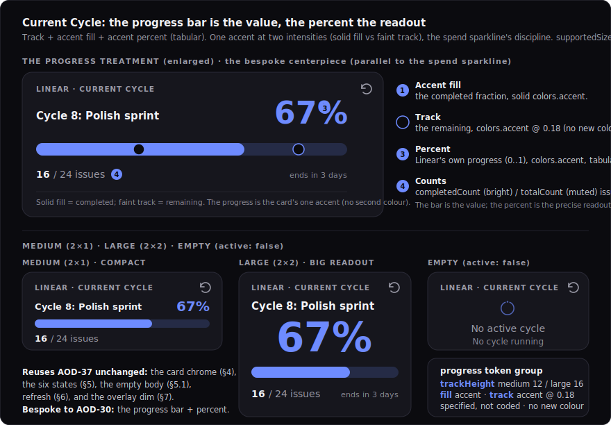

# Design: Linear widget visuals (My Issues, Current Cycle)

> Status: draft for review, 2026-06-29. Tracked by [AOD-30](https://linear.app/thexap/issue/AOD-30) (`type:design`, `area:integrations:linear`, `area:design-system`; milestone PS-M3 "First vertical slice (Linear My Issues)", project Platform & App Shell). The **third and final sibling application** of the shared widget visual system designed in [AOD-37](https://linear.app/thexap/issue/AOD-37) ([`design-widget-system.md`](design-widget-system.md), PR #19), after [AOD-35](https://linear.app/thexap/issue/AOD-35) (Calendar + Weather, [`design-calendar-weather.md`](design-calendar-weather.md), PR #20) and [AOD-36](https://linear.app/thexap/issue/AOD-36) (Claude usage, [`design-claude-usage.md`](design-claude-usage.md), PR #21). It follows the established `type:design` deliverable convention recorded in [`engineering-process.md`](../engineering-process.md): a `design-` doc under `docs/specs/` plus rendered SVG mockups in `docs/specs/assets/`, tokens specified (not written into [`unistyles.ts`](../../apps/app/unistyles.ts)), merged via PR. It **completes the v1 widget visual design set**: four widget families, four designs (Clock via [AOD-37](https://linear.app/thexap/issue/AOD-37), Calendar + Weather via [AOD-35](https://linear.app/thexap/issue/AOD-35), Claude usage via [AOD-36](https://linear.app/thexap/issue/AOD-36), and Linear here).
>
> **AOD-30's scope reduced after AOD-37.** AOD-30's title ("[Design] Linear widgets + shared lifecycle chrome (first slice)") **predates** [AOD-37](https://linear.app/thexap/issue/AOD-37). The "shared lifecycle chrome" it names was since designed **once** by AOD-37 (the card chrome and the six lifecycle-state visuals), precisely so the per-widget designs are applications, not redesigns. So AOD-30 now reduces to the **two Linear bespoke bodies** (My Issues, Current Cycle); the chrome and states are **reused** from AOD-37 here, not designed. A retitle to "[Design] Linear widget visuals (My Issues, Current Cycle)" is **proposed for approval** (surfaced per the Linear playbook before any edit); until then the scope is fixed by this doc. Linear stays in Platform & App Shell / PS-M3 (it was the first vertical slice, before the Integrations project existed); the issue is not moved.
>
> **This is an application, not a redesign.** [AOD-37](https://linear.app/thexap/issue/AOD-37) drew the shared language once (the card chrome, the design-token foundation, the six lifecycle-state visuals, the empty body, the day/night dim and ambient behavior, the on-demand refresh affordance) so the per-widget designs are **applications** of it. [`design-widget-system.md`](design-widget-system.md) §9 maps what each sibling reuses versus designs bespoke; this doc honors that map. It **reuses** §3 (tokens), §4 (chrome), §5 (the six states), §5.1 (the empty body), §6 (refresh), §7 (dim/ambient) **unchanged**, and designs **only** the two Linear bespoke bodies: the **priority indication** and the **issue-row density** for My Issues, and the **progress treatment** for Current Cycle. Where applying the system surfaced anything genuinely shared, it is **flagged** additively (section 9.3), not silently forked.
>
> **What this fixes, and what it must not touch.** It fixes the **visuals** of the two functional-but-unpolished renderers that shipped ahead of their design (each says so in its header comment, "the pixel polish is AOD-30"): [`MyIssuesCard`](../../apps/app/src/registry/services/linear/MyIssuesCard.tsx), [`CurrentCycleCard`](../../apps/app/src/registry/services/linear/CurrentCycleCard.tsx). It expresses every value as a **design token** and adds only the **two** genuinely new token groups AOD-30 needs (`priorityIcon`, `progress`), each reusing the existing palette with **no new color**; it does **not** edit `unistyles.ts` (the polish build does, the way a spec does not write its code). It does **not** change the [AOD-8](https://linear.app/thexap/issue/AOD-8) §6.1 render contract `{ data, config, size }`: the renderers stay pure leaf functions and never learn auth/loading/error, the generic host keeps drawing the chrome. The implementing polish is a **separate PS-M3 `type:tech-task`**, the way each integration spec was separate from its build, and the Linear data contract / OAuth / proxy stay [AOD-31](https://linear.app/thexap/issue/AOD-31)'s ([`integration-linear.md`](integration-linear.md)).

## 1. Purpose and scope

Linear is the flagship dogfood pair: Xavier's kiosk was born running Linear "My Issues" + Claude usage, so its polish is high value. [AOD-31](https://linear.app/thexap/issue/AOD-31) shipped the two services' data contracts and two leaf renderers at on-brand-enough fidelity, each deferring its pixel polish to this design ([`integration-linear.md`](integration-linear.md) §10 names AOD-30 as the visual owner: "the normalized `MyIssuesData` / `CurrentCycleData` are fixed; the layout is AOD-30's"). [AOD-37](https://linear.app/thexap/issue/AOD-37) drew the shared system; [AOD-35](https://linear.app/thexap/issue/AOD-35) and [AOD-36](https://linear.app/thexap/issue/AOD-36) proved it carries two prior widget pairs. This doc applies that same system to the last pair, so the build is "map onto the scale, draw the bespoke body."

It fixes exactly four things:

1. **The priority indication** (section 4): a set of five **monochrome glyphs in Linear's own language**, carried by shape and ink-weight rather than color, so they neither break the [`design-widget-system.md`](design-widget-system.md) §3 one-accent rule nor collide with the §5 amber-stale / red-error status dots. This is the meatiest design problem here, the My Issues centerpiece (the parallel to AOD-35's weather icon set).
2. **The My Issues face** (section 5): the value-first body across `medium`, `large`, and `tall`: the **row density** per size, the **assigned-count emphasis** (a count led by the active filter), the **"+N more" overflow**, and the **"No assigned issues" empty body** (§5.1).
3. **The Current Cycle face** (section 6): the **progress treatment** (the track + accent fill + the percent in accent / `tabular-nums`) as the bespoke centerpiece (the parallel to AOD-36's sparkline), the "Cycle N: name" label, the "completed / total issues" counts, and the **"No active cycle" empty body** (§5.1).
4. **The two new token groups** (section 9): `priorityIcon` (the glyph sizing + intensity) and `progress` (the bar sizing + intensity), each reusing the existing color palette with no new color, plus the explicit reuse map that proves the AOD-37 system carries these widgets a third time (the `area:design-system` charge).

**In scope:** the two bespoke bodies (the priority glyph set + the issue-row density; the progress bar), the count and overflow and empty bodies, the per-size layouts across the supported sizes, the two new token groups, and the reuse map (section 3).

**Out of scope (named so the frame is clear):**

- **Implementing the polish in code.** A separate PS-M3 `type:tech-task` lifts `priorityIcon` and `progress` into [`unistyles.ts`](../../apps/app/unistyles.ts) and applies these visuals + per-size layouts to the two renderers. This doc is the design it implements.
- **[AOD-35](https://linear.app/thexap/issue/AOD-35) and [AOD-36](https://linear.app/thexap/issue/AOD-36),** the first two sibling applications, already merged (PR #20, PR #21). Their weather icon set, agenda density, spend sparkline, and money typography are their own.
- **Any redesign of the AOD-37 system** (chrome, the six states, the §5.1 empty body, the token scale, dim/ambient, the refresh affordance) beyond the one additive seam flagged in section 9.3. If applying the system tempts a chrome or state change, that belongs in AOD-37, not here.
- **The registry / host / layout architecture and the `{ data, config, size }` render contract.** Unchanged. The renderers stay pure leaf functions.
- **The Linear data contract, OAuth, the operation seam, the option sources, and the TTLs** ([`integration-linear.md`](integration-linear.md), [AOD-31](https://linear.app/thexap/issue/AOD-31)): the normalized `MyIssuesData` / `CurrentCycleData` payloads are **fixed inputs** this design renders, not data it reshapes. The renderer never sees the GraphQL query or the raw provider shape.
- **Motion** beyond what AOD-37 already named (the loading shimmer, the refresh spin); these bodies are static layouts. A progress-fill grow on refresh is a build flourish, not specified.

## 2. Locked context this builds on

| Source | What it locks | How this design uses it |
|---|---|---|
| [`design-widget-system.md`](design-widget-system.md) §3 | The token foundation: the color set (incl. the **one accent** rule and the `warning`/`error` status hues), the `type.*` scale, the `dot`/`overlay` tokens. | Sections 4 to 6 reference `type.title` / `type.heading` / `type.body` / `type.meta` / `type.caption` and `colors.*`; this design adds only `priorityIcon` and `progress` (section 9), each reusing those colors. Section 4 leans on the one-accent rule and the status-hue reservation as the reason priority is carried by shape. |
| [`design-widget-system.md`](design-widget-system.md) §4 | The shared card chrome: the frame, the quiet `SERVICE · WIDGET` header, the status-and-refresh cluster, the value-first body. | Both faces mount in this chrome unchanged; the mockups show it (the `LINEAR · MY ISSUES` / `LINEAR · CURRENT CYCLE` caption, the idle refresh) and the bodies fill only the body zone. |
| [`design-widget-system.md`](design-widget-system.md) §5 | The six lifecycle-state visuals (loading, fresh, stale, error, `needs_config`, `disconnected`), drawn by the host. | This design draws **only** the `fresh` body. Both Linear widgets have a `needs_config` edge (a deleted project/team, [`integration-linear.md`](integration-linear.md) §5.5) **and** a `disconnected` edge (the 24h-token refresh failure, §3.4); both are the host's §5 visuals, not redrawn here (section 7). |
| [`design-widget-system.md`](design-widget-system.md) §5.1 | The **empty body**: a renderer-drawn body for a fresh render whose content is legitimately empty; a centered calm body, a quiet per-widget glyph, a `type.body`/`textMuted` line, an optional subline, and **no action**. | Both Linear empties **reuse** this convention (section 5.3, 6.3). The §5.1 v1-consumers table already lists both (My Issues `totalCount === 0`, Current Cycle `active: false`); this design is their realized form. Linear is the **third widget kind** to consume §5.1, validating the AOD-61 promotion (section 9.3). |
| [`design-widget-system.md`](design-widget-system.md) §6 | The on-demand refresh affordance as host chrome (idle / in-flight / within-floor / hidden). | Shown idle in the mockups; not redesigned. Both widgets fetch (`oauth2`), so neither hides it (unlike the Clock). |
| [`design-widget-system.md`](design-widget-system.md) §7 | The day/night dim: the global overlay default (`dimsWithAmbient: true`), the `useAmbient()` opt-in, the deep-red night palette. | Both widgets are **overlay-default** (`dimsWithAmbient: true`, [`index.ts`](../../apps/app/src/registry/services/linear/index.ts)); neither opts into deep red (that is the Clock). The overlay darkens the card uniformly at night with no widget code. |
| [`design-widget-system.md`](design-widget-system.md) §9 | The reuse map. (AOD-37 §9 tabulates Weather/Calendar/Claude; Linear's row is implied by the system, and section 3 here is its realized form.) | Section 3 is the Linear reuse map; sections 4 to 6 are its bodies. |
| [`integration-linear.md`](integration-linear.md) §4.1 | The normalized `MyIssuesData` (`issues: MyIssue[]`, `totalCount`) over `MyIssue` (`identifier`, `title`, `stateName`/`stateType`, `priority` 0..4, `priorityLabel`, `dueDate`). Ordered `updatedAt` (recency, **not** priority). | Section 4 maps `priority` (0 none, 1 urgent, 2 high, 3 medium, 4 low) to glyphs; section 5 renders the rows, the `totalCount` count, the `filter`-qualified label, and `dueDate`. |
| [`integration-linear.md`](integration-linear.md) §4.2 | The normalized `CurrentCycleData` (`{ active: false }` or `{ active: true, number, name, startsAt, endsAt, progress 0..1, completedCount, totalCount }`). `active: false` is a normal data-bearing state, not an error. | Section 6 renders `progress` as the bar/percent, `completedCount`/`totalCount` as the counts, `number`/`name` as the label, `endsAt` as the optional "ends in N days" meta; `active: false` is the empty body. |
| [`integration-linear.md`](integration-linear.md) §5.1 / §5.5 | `filter` is an enum (`open` / `in_progress` / `all`, default `open`); a deleted project/team drives `needs_config` via the host re-check. | Section 5.1 echoes the active `filter` as the count's qualifier; section 7 notes the `needs_config` edge as host-drawn. |
| [AOD-10](https://linear.app/thexap/issue/AOD-10) §5 / [`registry/types.ts`](../../apps/app/src/registry/types.ts) | The canonical size catalogue and the nearest-supported-class reconciliation rule. | Section 8 fixes each widget's `supportedSizes` and the per-size body; the reconciliation rule covers off-aspect rects. |
| The two leaf renderers | `MyIssuesCard` (`VISIBLE_BY_SIZE`, priority **dots**, identifier + title rows, "+N more", "No assigned issues"); `CurrentCycleCard` (`Cycle N: name` label, a `skeleton`-track + `accent`-fill progress bar, the accent percent, the counts, "No active cycle"). | This design maps the ad-hoc sizes onto the `type.*` scale, replaces the placeholder priority **dots** with the **shape-carried glyphs** (section 4), fixes the progress track token (section 6.1), and adds per-size layouts; the build edits the renderers, not the contract. |

What the renderers already do, and what this changes: `MyIssuesCard` already draws the value-first list the system formalizes (priority mark + identifier + title rows, a "+N more" footer, a renderer-drawn empty), and `CurrentCycleCard` already draws a proportional progress bar + percent + counts and a renderer-drawn empty. This design (a) maps the ad-hoc sizes onto the AOD-37 `type.*` scale, (b) **replaces the placeholder colored priority dots with Linear's own monochrome priority glyphs** (the move AOD-35 made when it added the weather icons the renderer "left as a text label"), (c) adds the **assigned-count** lead My Issues lacked, (d) fixes the Current Cycle progress **track token** (off `colors.skeleton`, the loading color, onto an accent tint), and (e) draws both empties to the shared §5.1 convention. It changes the renderers' **appearance**, never their wiring.

## 3. Applying the system: the reuse map

The test of a system is that the sibling designs are applications, not redesigns. They are. Each part of each face is either **reused** from AOD-37 unchanged or a **bespoke** body element designed here. The table makes the seam explicit (this is the `area:design-system` deliverable, the third proof after AOD-35 and AOD-36: prove the reuse).

| Widget · part | Reuses from AOD-37 (unchanged) | Bespoke to AOD-30 (designed here) |
|---|---|---|
| **My Issues** · priority | The §3 **one-accent rule** + the §5 `warning`/`error` **status-hue reservation** (honored, not changed) | The **priority glyph set**: five monochrome glyphs, carried by shape (section 4) |
| My Issues · rows | The frame, quiet header, six states (§4, §5) | The **row density** per size + the row anatomy (glyph · identifier · title · due) (section 5) |
| My Issues · count | The `type.*` scale + `colors.text` / `colors.textMuted` (§3) | The **assigned-count emphasis** (the count led by the active `filter`) (section 5.1) |
| My Issues · overflow | `type.meta` + `colors.textMuted` (§3) | The **"+N more"** treatment (section 5.2) |
| My Issues · empty | The **empty body** convention (§5.1) | Applying it: the "No assigned issues" calm body + its checkbox glyph (section 5.3) |
| **Current Cycle** · progress | The §3 single-accent rule; the sparkline's **one-accent-two-intensities** idiom ([`design-claude-usage.md`](design-claude-usage.md) §4.2) | The **progress bar**: track + accent fill + the accent percent (section 6.1) |
| Current Cycle · label | `type.heading` + `colors.text` (§3) | The "Cycle N: name" label treatment (section 6.2) |
| Current Cycle · counts | `type.meta` + `colors.text` / `colors.textMuted` (§3) | The completed/total **counts emphasis** (completed bright) (section 6.2) |
| Current Cycle · empty | The **empty body** convention (§5.1) | Applying it: the "No active cycle" calm body (reuses the §5.1 cycle-ring glyph) (section 6.3) |
| **Both** · chrome | Frame, header, status-and-refresh cluster, value-first hierarchy (§4) | nothing |
| Both · states | loading / fresh / stale / error / `needs_config` / `disconnected` (§5) | nothing (only the `fresh` body is drawn here) |
| Both · refresh | idle / in-flight / within-floor (§6); both fetch, so neither hides it | nothing |
| Both · night | the global **overlay** (`dimsWithAmbient: true`, §7) | nothing (no deep-red opt-in; that is the Clock) |

None of these needs a new card frame, a new state visual, a new dim behavior, or a new color. They consume sections 3 to 7 (and §5.1) of [`design-widget-system.md`](design-widget-system.md) and design only the body. The **two** additions are the `priorityIcon` and `progress` token groups (section 9.1, 9.2), the glyph's and the bar's sizing, which AOD-37 could not have predicted without designing them; and **no new shared gap** surfaced (section 9.3), the third reuse proof this design exists to give.

## 4. The priority indication (the bespoke centerpiece)

Every assigned issue carries a `priority` (0 none, 1 urgent, 2 high, 3 medium, 4 low) and a `priorityLabel` ([`integration-linear.md`](integration-linear.md) §4.1). The list is ordered by **recency** (`updatedAt`), not by priority, so the priority cannot be read from a row's position; it must be shown **per row**. The shipped renderer marks it with a colored **dot** (urgent → `error`, high → `warning`, medium → `accent`, low → `textMuted`, none → `border`). This section replaces that placeholder with the designed indication. It is the meatiest problem here, the parallel to AOD-35's weather icon set, and the one place My Issues earns a real bespoke visual.

![The My Issues mockup: the five priority glyphs enlarged (no priority as three dim dashes, low through high as one, two, then three filled ascending bars, urgent as a filled block with an exclamation) with a panel on why priority is carried by shape; then the card at medium with four rows, large with seven rows and a due date on the right, and tall as a deep narrow column of ten rows, each row a priority glyph then the identifier then the title with an assigned count leading and a plus-more footer; plus the renderer-drawn No assigned issues empty body with a checkbox glyph.](assets/design-linear-my-issues.svg)

<details>
<summary>Design tokens &amp; the glyph rule</summary>

```
style       : monochrome filled glyphs in Linear's own priority language, carried by SHAPE and
              ink-weight, not color. The same discipline as AOD-35's weather icons ("carried by shape").
glyphs (5)  : none    -> three dim horizontal dashes (no level set)
              low      -> three ascending bars, 1 filled
              medium   -> three ascending bars, 2 filled
              high     -> three ascending bars, 3 filled
              urgent   -> a filled rounded block with an exclamation (Linear's urgent mark)
intensity   : filled bars / the urgent block draw in colors.text (the bright tier); unfilled bars in
              colors.textMuted @ 0.30. One neutral ink at two intensities; NO accent, NO status hue.
weight      : ink-weight ascends none < low < medium < high < urgent, so urgent reads as the heaviest
              mark without a colliding red.
why shape   : (1) §3 allows ONE accent and forbids a rainbow; a red/amber/blue dot set breaks both.
              (2) §5 reserves warning (amber) for STALE and error (red) for ERROR status dots; a colored
              priority dot in those hues would read as a status signal (the shipped dots collide here).
              (3) Linear's glyph language is instantly read by any Linear user (the flagship dogfood).
token       : priorityIcon = { size 14, on colors.text, off colors.textMuted @ offOpacity 0.30 }
              (section 9.1; specified, not coded; reuses §3 colors, no new color).
```
</details>

### 4.1 Carried by shape, not color

The glyphs are **monochrome and carried by shape**, exactly the discipline AOD-35 set for the weather icons ([`design-calendar-weather.md`](design-calendar-weather.md) §4.1). The shipped colored dots are a placeholder that conflicts with the system in two concrete ways, and the design resolves the conflict by reading priority from shape:

- **The one-accent rule (§3).** The system permits exactly **one accent** (`#6E8BFF`) and deliberately avoids a per-condition rainbow. A five-color priority dot set (red / amber / blue / grey / faint) reintroduces the rainbow the ambient language rejects, and spends the single accent on "medium," a mid-tier value that is not the card's highlight.
- **The status-hue reservation (§5).** The host's **stale** dot is `warning` (amber) and its **error** dot is `error` (red). A priority dot in those same hues reads as a status signal: an amber "high" dot competes with the amber stale dot, a red "urgent" dot competes with the red error dot, and the two reds can co-occur on one card (an urgent issue on a card that is also erroring), muddying "red means the data is stale/failed." So **status owns the warning/error hues; priority is carried by shape.** A single dot can only signal level by color, so the only system-faithful indication is a **glyph**.

Because the glyph is monochrome, it joins the title at the bright text tier and the row reads as a calm pair (a quiet glyph, a muted identifier, a bright title), never a column of colored beads glowing on a wall.

### 4.2 The five glyphs

One glyph per `priority` value, in Linear's own iconography so it is instantly legible to the dogfood audience:

- **none (0)**: three dim horizontal dashes, `colors.textMuted` at low opacity, the quietest mark (no level set).
- **low (4) / medium (3) / high (2)**: three **ascending vertical bars**; the **filled-bar count is the level** (1 / 2 / 3 filled), filled in `colors.text`, the rest in `colors.textMuted @ 0.30`. Level is read by counting filled bars, a shape, not a hue.
- **urgent (1)**: a **filled rounded block with an exclamation** (Linear's urgent mark), in `colors.text`. It has the most ink, so it is the heaviest glyph and pops as "act on me" by weight, not by a colliding red.

This is five base glyphs, no day/night or other variants, so the set is smaller than the weather set. An optional **single warning/accent tint for urgent only** (if dogfooding shows urgent needs more pop than ink-weight gives it) is named as a seam (section 10), additive and not v1; v1 keeps the calm monochrome the ambient surface wants.

## 5. My Issues face

My Issues is the flagship list: the user's assigned issues in a chosen project, filtered by status. `supportedSizes: ['medium', 'large', 'tall']`, default `medium` ([`integration-linear.md`](integration-linear.md) §4.1). The same `MyIssuesData.issues` renders as three densities, and this card is the parallel to AOD-35's Agenda (a list whose density is native to each size).

(The My Issues mockup in section 4 shows all three densities and the empty body; the per-size layout is below.)

<details>
<summary>Design tokens &amp; per-size layout</summary>

```
row         : priorityGlyph (section 4) · identifier (type.caption/label, colors.textMuted, tabular) ·
              title (type.body, colors.text, ellipsized). Single line at every size.
count       : the assigned-count emphasis. totalCount in colors.text + a muted qualifier echoing the
              active filter: "12 open" / "12 in progress" / "12 assigned". Leads the body.
              NO accent (My Issues is a calm neutral work-list; the count is bright text). See 5.1.
due (large) : dueDate, type.meta, colors.textMuted, right-aligned; "Today" / overdue step up to
              colors.text. Omitted when null and at medium/tall (no room). A large affordance.
overflow    : rows beyond VISIBLE_BY_SIZE fold into "+N more" (type.meta, colors.textMuted).
medium (2×1): count + 4 rows + "+N more". The everyday card.
large (2×2) : count (+ optional "· <project>" context) + 7 rows + due on the right + "+N more".
tall (1×2)  : count + up to 10 rows (titles ellipsize early in the narrow column) + "+N more".
empty       : totalCount === 0 -> the §5.1 empty body (section 5.3). NOT a host state.
density     : VISIBLE_BY_SIZE medium 4 · large 7 · tall 10 (the renderer's existing counts; design
              fixes layout, not the slice). small 3 / wide 4 are defensive, not declared sizes.
```
</details>

### 5.1 The assigned-count emphasis

The most useful glance on a work list is **how many do I have**, so the body **leads with a count**: the `totalCount` in `colors.text`, followed by a muted qualifier that **echoes the active `filter`**, so the count reads "12 open", "12 in progress", or "12 assigned" ([`integration-linear.md`](integration-linear.md) §5.1). The number is the bright figure; the qualifier recedes. This is the count the shipped renderer lacks (it drew rows and a "+N more" but never surfaced the total).

My Issues **deliberately spends no blue accent.** Unlike its siblings (Weather's accent condition, the Agenda's next-event rail, Daily Spend's sparkline, Current Cycle's progress), a dense issue list reads calmest as neutral monochrome: bright count and titles, muted identifiers, neutral priority glyphs. Spending the accent on one arbitrary row element would be noise, and accenting the count would make the card's only chromatic element a number. The system flexes both ways, some cards have an accent figure and some are calm neutral; My Issues is the calm one. (If a single accent is ever wanted, the count is where it would land, a trivial change.)

At `large` the count may carry an optional muted project-name context ("12 open · Platform & App Shell"), since every issue in an instance shares the configured project; it is omitted at `medium`/`tall` for room.

### 5.2 The rows, density, and overflow

Each row is a single line: the **priority glyph** (section 4), the **identifier** ("AOD-53") in a muted tabular caption, and the **title** in `colors.text`, ellipsized. Single-line rows suit every size because the row is naturally compact (a small glyph, a short identifier, a title), unlike the Agenda's time-over-title rows. The density follows the renderer's existing `VISIBLE_BY_SIZE` counts, so the design fixes the **layout** per size, not the data slice:

- **medium (2×1)** is the everyday card: the count, **4 rows**, then "+N more".
- **large (2×2)** is roomier: the count (with optional project context), **7 rows**, a `dueDate` on the right where present, then "+N more".
- **tall (1×2)** is a deep narrow column: the count, up to **10 rows** (titles ellipsize early in the narrow width), then "+N more".

Rows beyond the visible count fold into **"+N more"** in `type.meta`, `colors.textMuted`, so the count, the visible rows, and the overflow stay coherent (count 12 = 4 visible + "+8 more" at medium). The `dueDate` is a quiet muted meta at `large` (and could extend to `tall`); **"Today" / overdue** step up to `colors.text` for a glance, with finer due emphasis named as a seam (section 10) rather than spending a status hue.

### 5.3 The "No assigned issues" empty body

When `totalCount === 0` (a connected, correctly configured widget whose assigned set is genuinely empty), the renderer draws the **§5.1 empty body**, not a host state: a centered calm body with a quiet **checkbox glyph** (a rounded square with a check, an accent line-icon in the §5.1 glyph family, speaking the issue/task language), a `type.body` `colors.textMuted` line reading **"No assigned issues"**, and a quiet subline ("You're all caught up"). It carries **no action**, because nothing is wrong: the user simply has nothing assigned. This is one of the two v1 Linear consumers already listed in the [`design-widget-system.md`](design-widget-system.md) §5.1 table; this design is its realized form (section 9.3).

## 6. Current Cycle face

Current Cycle is a glanceable progress view of a chosen team's **active** cycle. `supportedSizes: ['medium', 'large']`, default `large` ([`integration-linear.md`](integration-linear.md) §4.2). On this widget **the progress bar is the value and the percent is its precise readout**, and the bar is the bespoke centerpiece, the parallel to AOD-36's sparkline.



<details>
<summary>Design tokens &amp; per-size layout</summary>

```
bar         : a horizontal track + a left-anchored fill. fill width = progress (0..1) of the track.
              fill = colors.accent (the completed fraction); track = colors.accent @ 0.18 (the
              remaining fraction). One accent at TWO intensities, the sparkline's discipline (§4.2):
              the whole bar is "accent space", the fill is solid, the remainder is the dim track.
              NOT colors.skeleton (the shipped track; skeleton is the loading color, section 6.1).
percent     : Math.round(progress*100) + "%", colors.accent, tabular-nums. The precise readout; the
              card's one accent figure. Big at large (a wall glance), small at medium.
label       : "Cycle N: name" (or "Cycle N" when name is null), type.heading, colors.text.
counts      : "completedCount / totalCount issues", type.meta, tabular; completedCount in colors.text
              (the bright sub-stat), the rest in colors.textMuted.
ends (large): "ends in N days" derived from endsAt vs the device clock, type.meta, colors.textMuted.
              A large affordance (the payload affords it); omitted at medium for room.
medium (2×1): compact. label + percent on one line; the bar; the counts.
large (2×2) : a big percent hero; the bar; the label; the counts; the "ends in N days" meta.
empty       : active: false -> the §5.1 empty body (section 6.3). NOT a host state.
```
</details>

### 6.1 The progress bar: one accent at two intensities

The bar is a horizontal **track** with a left-anchored **fill** whose width is `progress` (Linear's own 0..1 completion fraction). The **fill is `colors.accent`** (the completed fraction) and the **track is `colors.accent` at `0.18` opacity** (the remaining fraction). This is the system's single accent at **two intensities**, the exact discipline the spend sparkline uses for today versus the earlier days ([`design-claude-usage.md`](design-claude-usage.md) §4.2): the whole bar is "accent space," the fill is solid, the remainder is the dim track, so the card spends no second color. The **percent** (`Math.round(progress * 100)%`) is the precise readout in `colors.accent` with `tabular-nums` so it does not jitter as it refreshes; it is big at `large` (a strong wall glance) and small at `medium`.

This fixes a token smell in the shipped renderer, which fills the track with `colors.skeleton`. `skeleton` is the **loading-shimmer** color (§5's loading state); reusing it for a fresh-data progress track is a placeholder. The accent-tint track is both correct (it is fresh data, not a skeleton) and better (it binds the remaining portion to the fill as one bar). No new color is added (section 9.2).

### 6.2 The label and the counts

The **"Cycle N: name"** label (or "Cycle N" when `name` is null) is the card's primary text identifier, in `type.heading`, `colors.text`, quiet but readable. The **counts** read "completedCount / totalCount issues" in `type.meta` with `tabular-nums`, the **completedCount bright** (`colors.text`, the figure that marks progress) and the rest muted, the same value-against-muted move the calendar's "when" and Daily Spend's run-rate make. The counts are the issue tally; `progress` (which drives the bar and percent) is Linear's own computed fraction and need not equal `completedCount / totalCount` exactly, so the bar shows completion and the counts show the issue split, two honest readouts. At `large`, an **"ends in N days"** meta (derived from `endsAt` against the device clock, like the calendar's relative time) gives the time remaining; it is omitted at `medium` for room.

### 6.3 The "No active cycle" empty body

When `active: false` (a connected, correctly configured widget whose team simply has no live cycle, a normal data-bearing state, [`integration-linear.md`](integration-linear.md) §4.2), the renderer draws the **§5.1 empty body**, not a host state: a centered calm body with a quiet **cycle-ring glyph** (the very glyph already drawn for this case in [`design-empty-body.svg`](assets/design-empty-body.svg), an accent ring speaking the cycle's own language), a `type.body` `colors.textMuted` line reading **"No active cycle"**, and a quiet subline ("No cycle running"). It carries **no action**, because nothing is wrong. This is the other v1 Linear consumer in the §5.1 table; this design reuses that shape unchanged (section 9.3).

## 7. Night, refresh, and states (reused, not redrawn)

Both widgets reuse the AOD-37 chrome and behaviors unchanged, so this section only confirms the reuse (the mockups draw it; nothing here is bespoke):

- **Night / dim.** Both are `dimsWithAmbient: true` ([`index.ts`](../../apps/app/src/registry/services/linear/index.ts)), so they take the **global overlay** ([`design-widget-system.md`](design-widget-system.md) §7.1): at night the host paints the dim overlay over the whole card uniformly, no widget code. Neither opts into the deep-red `useAmbient()` palette (that is the Clock's iconic night look, §7.3). The accent progress bar and the neutral issue list simply darken with the card.
- **Refresh.** The idle refresh control sits in the header cluster ([`design-widget-system.md`](design-widget-system.md) §6); both widgets fetch (`oauth2`), so neither hides it (unlike the Clock). The mockups show it idle.
- **States.** The host draws all six lifecycle states (§5). Both Linear widgets have a **`needs_config`** edge (a deleted project/team fails the host's render-time re-check, [`integration-linear.md`](integration-linear.md) §5.5) **and** a **`disconnected`** edge (the 24h OAuth token's refresh failing maps to `409 needs_reconnect`, §3.4, §9.2). Both are the host's §5 visuals (the sliders "Reconfigure" prompt and the link "Connect Linear" prompt); this design does not redraw them, exactly as AOD-35 and AOD-36 did not.

## 8. Sizes and reconciliation

Each widget draws only the size classes it declares; the [AOD-10](https://linear.app/thexap/issue/AOD-10) §5 reconciliation rule maps a free-form rect to the nearest supported class, and the renderer fills that class's layout.

| Widget | `supportedSizes` | Default | Bodies designed here |
|---|---|---|---|
| My Issues | `medium`, `large`, `tall` | `medium` | section 5 (all three) |
| Current Cycle | `medium`, `large` | `large` | section 6 (both) |

`MyIssuesCard` also counts `small: 3` and `wide: 4` in its `VISIBLE_BY_SIZE` table **defensively** (so a reconciled off-aspect rect never reads an undefined count), but neither is in its declared `supportedSizes`. Whether to **promote** `small` or `wide` into My Issues' sizes is a spec / [AOD-4](https://linear.app/thexap/issue/AOD-4) decision, named as a seam (section 10); it is not an AOD-37 gap and not decided here. This mirrors AOD-35's treatment of the Agenda `large` case ([`design-calendar-weather.md`](design-calendar-weather.md) §9). The reconciliation rule covers any off-aspect rect by mapping it to the nearer declared class, and each face's body is defined for its declared classes, so a reconciled rect always has a layout to draw.

## 9. New tokens and the flagged gap

### 9.1 The `priorityIcon` token group

The priority glyph set needs sizing and an intensity rule; everything else reuses [`design-widget-system.md`](design-widget-system.md) §3. Specified as an addition to [`unistyles.ts`](../../apps/app/unistyles.ts) for the polish build (not written here, per the convention):

```typescript
// My Issues priority glyph (section 4). Monochrome, carried by shape; colors reuse §3, no new color.
priorityIcon: {
  size: 14,            // the glyph box edge, per row (the legend draws it larger)
  on: 'text',          // filled bars / the urgent block -> colors.text (the bright tier)
  off: 'textMuted',    // unfilled bars -> colors.textMuted...
  offOpacity: 0.30,    // ...at this intensity, so level is read by filled-bar count
}
```

It composes with the existing scale exactly as `weatherIcon` did in AOD-35 (a per-context sizing group for one widget family). The glyphs are **filled** shapes (bars and the urgent block), so there is no stroke; **no color token is added** (the ink is `colors.text` and `colors.textMuted`, section 4.1).

### 9.2 The `progress` token group

The progress bar needs its sizing and the track intensity; the colors reuse §3. Specified, not coded:

```typescript
// Current Cycle progress bar (section 6). One accent at two intensities; colors reuse §3, no new color.
progress: {
  trackHeight: { medium: 12, large: 16 }, // the bar thickness per size
  trackRadius: 'half',                    // fully rounded (height / 2)
  fill: 'accent',                         // colors.accent, the completed fraction (solid)
  track: 'accent',                        // colors.accent, the remaining fraction...
  trackOpacity: 0.18,                     // ...at this intensity (NOT colors.skeleton, section 6.1)
}
```

Like `priorityIcon`, it adds **no color**: the fill is `colors.accent`, the track is the same accent at `0.18`. It is the progress analogue of `sparkline`, a small sizing/intensity group AOD-37 could not have predicted without designing the bar, and it composes with the existing scale unchanged.

### 9.3 No new shared gap; the empty body is reused (Linear is the third consumer)

The empty-body gap that AOD-35 first flagged ([`design-calendar-weather.md`](design-calendar-weather.md) §10.2) and AOD-36 confirmed on a second consumer ([`design-claude-usage.md`](design-claude-usage.md) §9.3) has since been **resolved**: [AOD-61](https://linear.app/thexap/issue/AOD-61) (PR #22) promoted it into the system as [`design-widget-system.md`](design-widget-system.md) **§5.1, the empty body**. So this design does **not** re-flag it; it **reuses** §5.1 for both Linear empties (My Issues' "No assigned issues" on `totalCount === 0`, Current Cycle's "No active cycle" on `active: false`), each already listed in the §5.1 v1-consumers table. Linear is the **third widget kind** to consume the convention (after Calendar and Claude), and the **first to use it on two cards of one service**, validating the promotion: the convention carried Linear with no per-renderer reinvention.

No other gap surfaced. The chrome, the six states, §5.1, the type scale, the dim/ambient behavior, and the refresh affordance all carried Linear unchanged, the third reuse proof this design exists to give. If a **second** widget ever needs a priority-style indicator or a progress bar, the `priorityIcon` / `progress` groups would be candidates to promote into the shared system (the way the empty body was promoted once it had two consumers); that is named as an additive seam (section 10), not a gap, and not done here.

## 10. Seams left open (named, not decided)

| Seam | Owner | What this design leaves clean |
|---|---|---|
| The **polish build** (lift `priorityIcon` + `progress` into [`unistyles.ts`](../../apps/app/unistyles.ts); apply these visuals + per-size layouts to the two renderers) | PS-M3 `type:tech-task` | This doc fixes the visuals and the tokens; the build implements them. |
| The **AOD-30 retitle** to "[Design] Linear widget visuals (My Issues, Current Cycle)" | this change set (on approval) | Surfaced for approval per the Linear playbook; the scope is fixed by this doc regardless of the title. |
| An **urgent accent/warning tint** (if ink-weight is not enough pop) | future | v1 is monochrome by deliberate discipline (section 4.2); a single urgent tint is additive and would extend `priorityIcon`. |
| Finer **due-date emphasis** (overdue/soon styling beyond "Today" bright) | future | The `dueDate` is a quiet large affordance (section 5.2); richer emphasis must avoid spending a status hue, so it is named, not drawn. |
| Promoting **`small` / `wide`** into My Issues' `supportedSizes` | spec / [AOD-4](https://linear.app/thexap/issue/AOD-4) | The renderer counts them defensively (section 8); the declaration decision is named, not made here. |
| Promoting **`priorityIcon` / `progress`** into the shared system | tiny [AOD-37](https://linear.app/thexap/issue/AOD-37) follow-up, **if** a second consumer appears | Today each is a single-widget bespoke group (like `weatherIcon` / `sparkline` were); promotion waits for a second consumer (section 9.3). |
| **Motion** (the loading shimmer, the refresh spin, a progress-fill grow on refresh) | PS-M3 build | Named by AOD-37 §10; these bodies are static layouts and add no new motion. |
| A **My Issues hero count** card variant (count-as-hero instead of a list) | future | v1 is a list led by a count (section 5.1); a count-hero variant is additive and would reuse the `type.*` scale. |

## 11. Proposed acceptance

Proposed acceptance for this design (call out for confirmation):

> 1. The design is an **application** of [`design-widget-system.md`](design-widget-system.md): section 3's reuse map shows every part of both faces either reuses §3 to §7 and §5.1 unchanged or is a named bespoke body, and no chrome, state, empty-body convention, token scale, dim behavior, or refresh affordance is redrawn (the third `area:design-system` proof, after AOD-35 and AOD-36). AOD-30's pre-AOD-37 "shared lifecycle chrome" scope is reduced to the two bespoke bodies, acknowledged in the intro, with a retitle proposed for approval.
> 2. The **priority indication** is fixed: five **monochrome glyphs in Linear's own language**, carried by shape and ink-weight (none dashes; 1/2/3 filled ascending bars for low/medium/high; a filled exclamation block for urgent), drawn in `colors.text` / `colors.textMuted` with **no accent and no status hue**, justified by the §3 one-accent rule and the §5 status-hue reservation, with the `priorityIcon` token specified, not coded.
> 3. The **My Issues** face is fixed across `medium` / `large` / `tall`: the row anatomy (glyph · identifier · title), the **density** per size (4 / 7 / 10, the renderer's counts), the **assigned-count emphasis** (the count led by the active `filter`, deliberately neutral / no accent), the `dueDate` large affordance, the **"+N more" overflow**, and the renderer-drawn **"No assigned issues" empty body** (§5.1).
> 4. The **Current Cycle** face is fixed across `medium` / `large`: the **progress bar** (track + accent fill + the accent `tabular-nums` percent, one accent at two intensities, off `colors.skeleton`), the "Cycle N: name" label, the completed/total **counts** (completed bright), the "ends in N days" large affordance, and the renderer-drawn **"No active cycle" empty body** (§5.1), with the `progress` token specified.
> 5. The system is **reusable a third time**: applying it surfaced exactly two new token groups (`priorityIcon`, `progress`), each reusing the existing palette with no new color, and **no new shared gap** (the empty body is reused from the now-landed §5.1, with Linear as its third consumer), with no fork of AOD-37, and the **two mockups render**.

| Acceptance clause | Where |
|---|---|
| Application not redesign: the reuse map; AOD-30 scope reduction | Section 3; intro |
| Priority indication: five shape-carried glyphs + `priorityIcon` token | Section 4; `design-linear-my-issues.svg`; section 9.1 |
| My Issues face (density; count; due; overflow; empty body) | Section 5; `design-linear-my-issues.svg` |
| Current Cycle face (progress bar; label; counts; empty body) + `progress` token | Section 6; `design-linear-current-cycle.svg`; section 9.2 |
| Night / refresh / states reused, not redrawn | Section 7 |
| Sizes + reconciliation; the `small`/`wide` defensive note | Section 8 |
| New tokens; the empty body reused (third consumer); seams; acceptance | Sections 9, 10, 11 |

## 12. References

- [AOD-30](https://linear.app/thexap/issue/AOD-30): this design's tracking issue (`type:design`). Title predates AOD-37; scope reduced to the two bespoke bodies (intro), retitle proposed (section 10).
- [`design-widget-system.md`](design-widget-system.md) ([AOD-37](https://linear.app/thexap/issue/AOD-37)): the shared widget visual system this applies. §3 (tokens, the one-accent rule), §4 (chrome), §5 (states, the status hues), §5.1 (the empty body, [AOD-61](https://linear.app/thexap/issue/AOD-61)), §6 (refresh), §7 (dim/ambient).
- [`design-calendar-weather.md`](design-calendar-weather.md) ([AOD-35](https://linear.app/thexap/issue/AOD-35)): the first sibling application and a structural template; §4.1 (the monochrome "carried by shape" discipline this echoes for priority), §9 (the Agenda `large` size-promotion precedent), §10.2 (the empty-body gap, since resolved).
- [`design-claude-usage.md`](design-claude-usage.md) ([AOD-36](https://linear.app/thexap/issue/AOD-36)): the second sibling application and a structural template; §4.2 (the one-accent-two-intensities sparkline discipline the progress bar reuses), §9.3 (the empty-body second consumer).
- [`integration-linear.md`](integration-linear.md) ([AOD-31](https://linear.app/thexap/issue/AOD-31)): the Linear data contract. §4.1 (`MyIssuesData`, priority, ordering), §4.2 (`CurrentCycleData`, `active: false`, progress, counts), §5.1/§5.5 (the `filter` enum, the `needs_config` re-check), §10 (the visual seam handed here).
- [AOD-8](https://linear.app/thexap/issue/AOD-8): the render contract `{ data, config, size }` (§6.1) this preserves. [`architecture-registry.md`](architecture-registry.md).
- [AOD-10](https://linear.app/thexap/issue/AOD-10): the widget model. §5 (the size catalogue and reconciliation rule). [`widget-model.md`](widget-model.md).
- [AOD-4](https://linear.app/thexap/issue/AOD-4): the v1 widget set (My Issues + Current Cycle, their sizes and cadence).
- The two leaf renderers polished here: [`MyIssuesCard.tsx`](../../apps/app/src/registry/services/linear/MyIssuesCard.tsx), [`CurrentCycleCard.tsx`](../../apps/app/src/registry/services/linear/CurrentCycleCard.tsx); the definitions [`index.ts`](../../apps/app/src/registry/services/linear/index.ts); the host [`WidgetHostView.tsx`](../../apps/app/src/host/WidgetHostView.tsx); the theme [`unistyles.ts`](../../apps/app/unistyles.ts).
- [`engineering-process.md`](../engineering-process.md): the `type:design` lifecycle and deliverable convention this follows.
