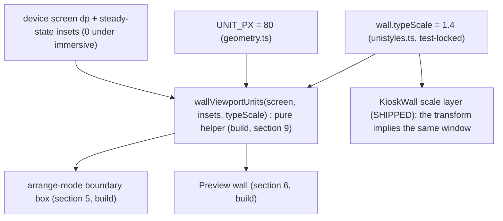

# Design: Vela wall viewport contract (viewport math, fit policy, editor boundary box, wall preview, insets)

> **REVISED 2026-07-03 (dogfood, during the AOD-81 build). This doc's §3 reference numbers were density-naive and §4's fixed-scale decision is REVERSED.** `rt.screen` is in **density-independent pixels (DP)**, not physical pixels: the Fire HD 8 is 1280×800 *physical* at density 1.33, so the app sees **962×601 DP**, and the fixed 1.4× showed only **~8.6u wide** — not the 11.43u this doc computed by dividing 1280 *physical px* by (1.4×80). On the real device that clipped the 11.25u My Issues card (the card was authored to a window that was ~25% wider than reality). **Decision (Xavier, 2026-07-03): the wall now AUTO-FITS the arranged layout to the screen** — `viewport.wallFitScale` = the largest uniform scale at which the content fits the DP screen on both axes (fit-to-bounds), so the dashboard fills the screen and nothing is clipped on **any device/resolution**, density-correct by construction. Consequences: §4's fixed 1.4× is **superseded** (auto-fit is essentially option C "fit-to-bounds", declined then only because the 11.4u premise made the fixed scale look sufficient); §5's **boundary box is removed** (moot once nothing clips); §6's **wall preview stays** and derives the same `wallFitScale`. The sections below are retained for the decision history and the insets/tooling findings (§7 still holds). The **code of record** is [`src/kiosk/viewport.ts`](../../apps/app/src/kiosk/viewport.ts) (`wallFitScale` / `layoutBounds`) + [`KioskWall.tsx`](../../apps/app/src/kiosk/KioskWall.tsx). Tracked by [AOD-81](https://linear.app/thexap/issue/AOD-81).
>
> Status: draft for review, 2026-07-03. Tracked by [AOD-80](https://linear.app/thexap/issue/AOD-80) (`type:design`, `area:kiosk` + `area:layout`, `from:dogfood`; project Kiosk Mode). It fixes the **contract between the arranging surface and the kiosk wall**: how much of the canvas the wall can show, what the wall does with content beyond that window, how the editor makes the window visible while arranging, and what the wall's usable region means under the [AOD-76](https://linear.app/thexap/issue/AOD-76) immersive chrome. It follows the `type:design` deliverable convention in [`engineering-process.md`](../engineering-process.md): a `design-` doc under `docs/specs/` plus rendered SVG specimens in `docs/specs/assets/`, additions **specified** (not written into [`unistyles.ts`](../../apps/app/unistyles.ts) or the app code), merged via PR.
>
> **It was filed from dogfood, and it deliberately re-opens one KEY DECISION.** Observed 2026-07-02 on the Fire HD 8 ([AOD-78](https://linear.app/thexap/issue/AOD-78), Xavier's first real-content wall): the wall renders the arranged canvas at a fixed 1.4x transform with overflow hidden, so it shows only ~11.4 x 7.1 layout units, while the editor renders the canvas unscaled with **no indication where the wall's visible region ends**. The [AOD-78](https://linear.app/thexap/issue/AOD-78) My Issues card had to be hand-sized to 11.25 x 6.8u by trial and error; portrait-arranged layouts stack cards below a fold the wall can never show. Section 4 re-opens the [AOD-39](https://linear.app/thexap/issue/AOD-39) fixed-scale choice against that evidence, engages its rationale honestly, and records the decision (surfaced to Xavier with options and a recommendation before this doc was frozen, the [AOD-71](https://linear.app/thexap/issue/AOD-71) / [AOD-73](https://linear.app/thexap/issue/AOD-73) pattern): **the fixed scale is reaffirmed**, and the fix lands on the authoring side.
>
> **It composes its neighbors; it redraws none of them.** The arrange surface is [AOD-27](https://linear.app/thexap/issue/AOD-27)'s ([`design-dashboard-editor.md`](design-dashboard-editor.md) section 4): this design **extends it additively** with the boundary box and one header action, and does not touch the selection treatment, the handles, or the gesture math. The wall presentation is [AOD-39](https://linear.app/thexap/issue/AOD-39)'s (built by [AOD-72](https://linear.app/thexap/issue/AOD-72)): the preview **mounts** it and the contract **describes** its shipped transform; no wall render change is designed here. The layout geometry is [AOD-7](https://linear.app/thexap/issue/AOD-7)'s: the boundary box is a drawn overlay, never a rect, and the [`kiosk-mode.md`](kiosk-mode.md) section 7.2 profile-over-layout seam holds untouched. The immersive chrome and the live insets are [AOD-76](https://linear.app/thexap/issue/AOD-76)'s runtime work: section 7 absorbs its findings as contract inputs.
>
> **What this fixes, and what it must not touch.** It fixes the **viewport math as a stated contract** (section 3), the **fit-policy decision** with the re-open recorded (section 4), the **arrange-mode boundary box** (section 5), the **wall preview affordance** (section 6), and the **insets meaning** (section 7). It does **not** edit [`unistyles.ts`](../../apps/app/unistyles.ts), does **not** write app code, does **not** change the wall render path (explicitly out of scope for the follow-up build too), and does **not** re-decide the kiosk runtime ([AOD-11](https://linear.app/thexap/issue/AOD-11)), the wall visuals ([AOD-39](https://linear.app/thexap/issue/AOD-39)), the cards ([AOD-37](https://linear.app/thexap/issue/AOD-37)), or the arrange gestures ([AOD-27](https://linear.app/thexap/issue/AOD-27)).

## 1. Purpose and scope

[`kiosk-mode.md`](kiosk-mode.md) section 7 fixed the wall as a presentation profile over an ordinary layout; [`design-kiosk-wall.md`](design-kiosk-wall.md) section 3 fixed the profile's values (`typeScale: 1.4`); [AOD-72](https://linear.app/thexap/issue/AOD-72) built it as a top-left-anchored uniform transform with overflow hidden; [AOD-76](https://linear.app/thexap/issue/AOD-76) made the wall's steady-state viewport the full physical screen. What no document states is the **consequence**: the wall shows a fixed, computable window of the canvas, and the editor gives the person arranging no sight of that window. This design states the window as a contract and designs the authoring affordances around it.

It fixes exactly five things:

1. **The viewport math** (section 3): the formula for the wall-visible region, its anchor, its clip behavior, and the single source of truth the wall, the boundary box, and the preview must all derive from.
2. **The fit policy** (section 4): the recorded re-open of the [AOD-39](https://linear.app/thexap/issue/AOD-39) fixed scale, with the options surfaced, the decision, and the rationale. Decided: **fixed 1.4x reaffirmed**.
3. **The arrange-mode boundary box** (section 5): the always-on wall frame drawn on the canvas while arranging, composing the [AOD-27](https://linear.app/thexap/issue/AOD-27) arrange surface.
4. **The wall preview** (section 6): the arrange-mode affordance that shows the true wall render (the [AOD-39](https://linear.app/thexap/issue/AOD-39) presentation without the [AOD-11](https://linear.app/thexap/issue/AOD-11) runtime guard) and returns on tap.
5. **The insets meaning** (section 7): what the wall's usable region IS under immersive chrome, absorbing the [AOD-76](https://linear.app/thexap/issue/AOD-76) findings (steady-state insets zero; transient overlays are not insets; the measurement tooling caveat).

Plus the handoffs: ownership splits (section 8), flagged additions (section 9), reconciliation with shipped code (section 10), seams left open (section 11), and the scoped follow-up build (section 12).

**Out of scope (named so the frame is clear):**

- **Building either affordance**: the boundary box, the preview, the helper, and the `arrange.wallGuide` tokens are built by the follow-up `type:tech-task` (section 12). This doc freezes the target.
- **Any change to the wall render path**: the fit policy is decided here, and the decision is "keep it"; the build must not touch [`KioskWall.tsx`](../../apps/app/src/kiosk/KioskWall.tsx)'s scale layer, anchor, or clip.
- **[AOD-79](https://linear.app/thexap/issue/AOD-79)'s exit-corner fix** (shipped): the corner anchoring and the wall-content touch exclusion are done; section 7 only names the transient-overlay consequence they live with.
- **Multi-dashboard wall selection** (the [`app-ia.md`](app-ia.md) section 10 seam) and the per-dashboard "Use on wall" intent (section 11; Xavier chose the always-on box for v1).
- **Auto-cycling wall pages** (section 4, option E): deferred as the named follow-up seam if one frame proves too small in dogfood, not designed here.
- **Dashboard-home scrollability**: whether the interactive (non-kiosk) dashboard canvas should scroll is [AOD-27](https://linear.app/thexap/issue/AOD-27)-territory follow-up work; the wall stays non-scrolling by contract (section 4).

## 2. Locked context this builds on

| Source | What it locks | How this design uses it |
|---|---|---|
| [`kiosk-mode.md`](kiosk-mode.md) ([AOD-11](https://linear.app/thexap/issue/AOD-11)) section 5, 7 | The wall is **glanceable, zero interaction** (looked at, not touched; auto-refresh replaces every tap), **landscape**, and the wall look is a **presentation profile over an ordinary `DashboardLayout`** (section 7.2: geometry untouched, render props untouched, no registry edit). | Section 4 declines scrolling **because** of section 5; sections 3 to 6 keep the 7.2 seam intact: no profile field added, no rect rewritten, the box and preview are editor surfaces reading the same constants. |
| [`design-kiosk-wall.md`](design-kiosk-wall.md) ([AOD-39](https://linear.app/thexap/issue/AOD-39)) sections 3, 4, 12 | The wall-mount profile values (`typeScale: 1.4` as the `wall.typeScale` token, "across-the-room legibility", "the cards, only larger"), the wall layout as the dashboard presented, and the seams table. | Section 4 **re-opens the typeScale fit policy** with dogfood evidence, engages this rationale honestly, and reaffirms it. The preview (section 6) mounts this presentation unchanged. |
| [`design-dashboard-editor.md`](design-dashboard-editor.md) ([AOD-27](https://linear.app/thexap/issue/AOD-27)) sections 4, 10 | The **arrange surface**: long-press entry, the header collapsing to Done, the selected-card treatment, drag/resize math, the coded `arrange.*` token group. | Sections 5 and 6 **extend it additively**: a boundary-box underlay on the canvas and a Preview action beside Done. Flagged as an extension (section 9), commented back to AOD-27; nothing existing is redrawn. |
| The [AOD-76](https://linear.app/thexap/issue/AOD-76) findings ([AOD-80](https://linear.app/thexap/issue/AOD-80) comment, 2026-07-03) | Steady-state wall viewport = the **full physical screen** (immersive; unistyles dispatches zeroed insets on hide); `KioskWall` already pads by **live `rt.insets`** (the accessor is done); **transient overlays are NOT insets** (measured ~4s float-over on Fire OS 8, no inset dispatch); uiautomator clips node bounds at the stale `mAppBounds` 1280x736. | Section 7 absorbs all four as the contract: the math uses the full screen; the contract defines what the accessor's values mean; the transient consequence and the tooling caveat are stated. |
| [AOD-79](https://linear.app/thexap/issue/AOD-79) (shipped) | Wall content takes **no touch** (`pointerEvents="none"`), load-bearing on Fire OS: touchable content inside the scaled layer ate every touch including the exit corner's. The corner is the wall's only affordance. | Section 4 declines on-wall scrolling partly **because** it would re-enter this bug; section 6's preview may take a dismiss tap only because it is an **editor** surface, not the kiosk. |
| [`geometry.ts`](../../apps/app/src/layout/geometry.ts) ([AOD-7](https://linear.app/thexap/issue/AOD-7)) | `UNIT_PX = 80`: rects live in nominal units, rendered at 80 px/unit; device-independent layouts. | The viewport formula divides by it (section 3). The box is drawn in canvas space at the same conversion. Never edited. |
| [`KioskWall.tsx`](../../apps/app/src/kiosk/KioskWall.tsx) + [`profile.ts`](../../apps/app/src/kiosk/profile.ts) + [`unistyles.ts`](../../apps/app/unistyles.ts) ([AOD-72](https://linear.app/thexap/issue/AOD-72)/[AOD-73](https://linear.app/thexap/issue/AOD-73)/[AOD-76](https://linear.app/thexap/issue/AOD-76)) | The shipped wall: content padded by live `rt.insets`, then the scale layer `transform: [{ scale: wall.typeScale }]` with `transformOrigin: 'left top'`, field `overflow: 'hidden'`; `wall.typeScale` 1.4 test-locked. | Section 3's math is a **description of this code**, stated once so the box and preview can derive the identical window. Section 10 reconciles; no change. |
| [AOD-78](https://linear.app/thexap/issue/AOD-78) (dogfood) | The evidence: the My Issues card hand-sized to **11.25 x 6.8u** to fit; a reclaimed strip now sits below it post-[AOD-76](https://linear.app/thexap/issue/AOD-76). | The motivating worked example (sections 3, 7): the card fits the 11.43 x 7.14u window with 0.18u to spare on the right and 0.34u below (the observed strip). |
| [`engineering-process.md`](../engineering-process.md) | The `type:design` deliverable convention and the chain spec -> design -> tech-task. | This deliverable follows it; sections 8 to 12 hand the build to a `type:tech-task`. |

## 3. The wall viewport contract (the math)

The wall mounts the canvas inside a content box padded by the live insets, then scales it uniformly by `wall.typeScale` from the top-left, and clips at the field edge. That shipped render path implies a fixed, computable window of the canvas. This section states it as the contract every surface derives from. First, the evidence the contract exists to prevent, drawn once:


<details>
<summary>The AOD-78 dogfood numbers</summary>

```
editor   : renders the canvas at 1x with NO wall boundary drawn; the window below was invisible while arranging (authored blind).
wall     : shows [0..11.43] x [0..7.14] u of the same canvas (steady state; only 6.57u tall at filing time, when the nav bar still barred it).
evidence : the My Issues card was hand-sized to 11.25 x 6.8u by trial and error; cards placed below y = 7.14u can never render on the wall.
scrolling: NOT the fix (kiosk-mode section 5: glanceable, zero interaction). The fix is this contract between the two surfaces.
```
</details>


<details>
<summary>The formula, the worked numbers &amp; the predicate</summary>

```
viewport (dp)   : the physical screen minus the wall's STEADY-STATE insets (section 7). Android/Fire immersive: insets 0, full screen.
formula         : visibleUnits.w = (screenW - insets.left - insets.right) / (wall.typeScale x UNIT_PX)
                  visibleUnits.h = (screenH - insets.top - insets.bottom) / (wall.typeScale x UNIT_PX)
Fire HD 8       : 1280 / (1.4 x 80) = 11.43u wide · 800 / (1.4 x 80) = 7.14u tall (steady state, insets 0).
anchor          : the canvas origin (0,0). transformOrigin 'left top'; no pan, no centering; the window is [0..11.43] x [0..7.14] u.
clip            : overflow hidden at the field edge. Content crossing the boundary is cut AT the boundary; DEFINED behavior, not a bug.
fits predicate  : an instance is fully wall-visible iff rect.x + rect.w <= visibleUnits.w AND rect.y + rect.h <= visibleUnits.h.
smaller layouts : render anchored top-left; the remainder stays the near-black field (the AOD-78 reclaimed strip is this).
orientation     : the wall is landscape-locked (kiosk-mode section 7): screenW is the LONG edge, always.
```
</details>

- **One formula, in the wall's own terms.** `visibleUnits = (screen dp - steady-state insets) / (wall.typeScale x UNIT_PX)` per axis. On the Fire HD 8 under the [AOD-76](https://linear.app/thexap/issue/AOD-76) immersive steady state that is **1280 / 112 = 11.43u by 800 / 112 = 7.14u** (equivalently: the screen shows 914.3 x 571.4 canvas px of an unscaled canvas). Every number in this doc follows from this line.
- **Anchored at the canvas origin, no pan.** The shipped scale layer grows from `'left top'`, so the window is the axis-aligned rect from (0,0). A "pan to the content's bounding box" variant was considered and **rejected**: it would create two truths about where the window sits (the box teaches origin-anchored arranging; a floating window would contradict it) for no gain once the box exists.
- **Clip is the defined edge behavior.** A card crossing the boundary renders cut at the boundary (`overflow: 'hidden'`); a card fully beyond it never renders. The contract makes this **stated** behavior the editor shows you (section 5), not an accident you discover on the tablet.
- **The predicate is the build's test surface.** `fits(rect) = rect.x + rect.w <= w && rect.y + rect.h <= h`. The [AOD-78](https://linear.app/thexap/issue/AOD-78) worked example: the hand-fit 11.25 x 6.8u card satisfies it against 11.43 x 7.14 with 0.18u and 0.34u to spare; the pre-[AOD-76](https://linear.app/thexap/issue/AOD-76) barred frame (800 - 64 nav = 736 -> 6.57u) did **not** fit its height, which is why the card was squeezed to 6.8u at filing time and now shows the reclaimed strip below.
- **Reference windows** (steady state): Fire HD 8 **11.43 x 7.14u**; the same tablet pre-[AOD-76](https://linear.app/thexap/issue/AOD-76) with the nav bar 11.43 x 6.57u (superseded); a 412dp-class phone in landscape (915 x 412dp) **8.17 x 3.68u**. The window is device-derived, never a hardcoded aspect.

One relationship, three surfaces. The wall's scale layer already implies this window; the boundary box (section 5) and the preview (section 6) must show the **identical** window, so all three derive from the same constants through one pure helper the build adds (section 9):


<details>
<summary>Mermaid source</summary>



</details>

Because everything derives from `wall.typeScale`, the token stays the one tuning lever: if dogfood later wants a roomier wall (say 1.25 -> 12.8 x 8.0u at smaller type), the change is one token line and the box, the preview, and the wall move together. The contract freezes the **relationship**, not the number 1.4 forever (section 11).

## 4. The fit policy: the AOD-39 re-open, recorded

[AOD-39](https://linear.app/thexap/issue/AOD-39) section 3 chose a **fixed** `typeScale: 1.4` with the rationale "across-the-room legibility... the value-first hierarchy is preserved, just larger" ("the cards, only larger"). The [AOD-78](https://linear.app/thexap/issue/AOD-78) dogfood evidence is a real cost of that choice: authored blind, layouts clip. This section re-opens the decision honestly rather than patching around it, per the issue's decide-list. The options were surfaced to Xavier with a recommendation before this doc was frozen; the decision below is his recorded call (2026-07-03).

**The AOD-39 rationale, engaged.** The fixed scale buys three things the wall's whole purpose rests on: (1) **guaranteed legibility**: the tablet is read at ~40cm in hand, the wall at 2 to 3 metres; 1.4x is the compromise that makes the heroes (the clock, the $42) read at that distance while the frame still holds a useful layout; (2) **determinism**: the same layout always renders identically; an ambient display that changes scale is not glanceable; (3) **seam cleanliness**: one uniform transform, geometry untouched, no per-widget code ([`kiosk-mode.md`](kiosk-mode.md) section 7.2). The dogfood failure does not refute any of these: it shows the *authoring surface* never exposed the window the fixed scale creates. That reframing is what the decision turns on.

![The fit policy decision record: four options drawn side by side. Option A, fixed 1.4x plus the editor boundary box plus the wall preview, is marked decided. Option B, a wall-side overflow mark, declined as standing chrome on an ambient surface. Option C, fit-to-bounds scaling, declined because the type-size guarantee dies as layouts grow. Option D, width-fit plus vertical scroll, declined because it re-opens the kiosk zero-interaction rule and the AOD-79 touch exclusion. A strip notes auto-cycling pages as the deferred follow-up seam.](assets/design-wall-viewport-fit-policy.svg)

<details>
<summary>The options as surfaced, and the decision</summary>

```
A DECIDED : keep fixed 1.4x; fix authoring: the arrange-mode boundary box (section 5) + the Preview wall affordance (section 6).
            Wall render path untouched. Type guarantee + determinism + the 7.2 seam all hold. Overflow = defined, visible clip.
B declined: hybrid, fixed 1.4x + a wall-side overflow mark (edge fade when content sits beyond the fold). Standing chrome on an
            ambient surface that kiosk-mode section 5 makes zero-interaction: the mark can never be acted on where it appears.
C declined: fit-to-bounds, scale = clamp(fit(bbox), floor..1.4). Layouts adapt, but type shrinks as the dashboard grows (the
            guarantee dies exactly when the wall gets busy) and editing changes the wall's scale (determinism dies). Still clips past the clamp.
D declined: width-fit + manual vertical scroll (surfaced by Xavier, engaged, declined). Re-opens kiosk-mode section 5 (zero
            interaction; a scrolled-away wall holds its position, so a glance stops being trustworthy) AND re-enters the AOD-79
            Fire OS bug (a ScrollView must take touches; wall content is pointerEvents none precisely so the exit corner works);
            scroll gestures near the trailing-bottom corner would fight the hold-to-exit. Type varies with layout width.
E deferred : auto-cycling pages (the zero-interaction way to show everything: viewport-sized pages on a slow dwell, the signage
            pattern). NOT designed here; the NAMED follow-up seam if dogfood shows one frame is too small (section 11). It
            composes with this contract: pages are exact multiples of the section 3 window.
```
</details>

**Decision (Xavier, 2026-07-03): keep the fixed 1.4x scale; reaffirm [AOD-39](https://linear.app/thexap/issue/AOD-39). The fix is authoring-side: the boundary box + the wall preview.** The questions that shaped it, kept for the record: "why 1.4x at all" (distance; the token; answered above) and "why not arrange at the 1.4x view" (the editor is the **workbench**, the wall is the **poster**: at 1x the entire wall frame, 914 x 571 editor px, fits inside the landscape editor with workspace around it; zoomed to 1.4x you would see *less than the frame itself* while dragging, and exact editor = wall equality is impossible anyway because the editor keeps chrome while the wall is immersive; the honest answer to "check it at wall scale" is the preview, section 6).

**Consequences.** The wall render path does not change, in this design or its build (a build that touches the wall's scale, anchor, or clip is out of scope and wrong). The wall stays pure: it renders, it never warns. Content beyond the window is **defined** to clip, and the editor now shows the window while arranging. `wall.typeScale` remains the single tuning lever, and because every surface derives from it (section 3), tuning it later is a one-token dogfood follow-up, not a re-design. If curating to one frame proves insufficient, option E is the seam to open next, not scrolling.

## 5. The arrange-mode boundary box (composes AOD-27)

The [AOD-27](https://linear.app/thexap/issue/AOD-27) arrange surface is the one moment the dashboard is interactive; it is also the only moment the wall window matters to a person. The box makes the window visible exactly there, and nowhere else. **Decided (Xavier, 2026-07-03): the box shows always in arrange mode**, for every dashboard on every device; the per-dashboard "Use on wall" intent stays a named seam (section 11).


<details>
<summary>The box anatomy, behavior &amp; tokens</summary>

```
what     : a dashed rect drawn ON the canvas, UNDER the cards (above the field, below every instance), anchored at the canvas
           origin, sized visibleUnits x UNIT_PX editor px (Fire HD 8: 914.3 x 571.4 px; the whole frame fits the landscape editor).
tag      : a small chip at the boundary's inside bottom-right: "WALL · 11.4 x 7.1" (device-computed, one decimal). surface fill,
           1px border, type.caption / textMuted. Informational, not a control.
stroke   : border role, 2px, dash 6/4 (arrange.wallGuide, section 9). Quiet by design; heavier than the 1px card border so it
           reads as a frame, never accent (one accent belongs to the selection and Done).
touch    : none. pointerEvents none; the box takes no part in gestures, geometry, or hit-testing. Purely drawn.
when     : arrange mode ONLY, always (every dashboard, every device). The resting dashboard never shows it (looked at, not
           interacted with); the wall itself never shows it.
derived  : from the section 3 helper with the WALL's steady state: the device screen in LANDSCAPE (long edge = width, because the
           wall is landscape-locked) and the wall's steady-state insets (0 on Android/Fire immersive), NOT the editor's live insets.
outside  : cards beyond the boundary get NO error treatment. Outside is valid dashboard space (the interactive home surface may
           legitimately hold it); the box informs, it never polices. A per-card "off wall" badge was considered and rejected (noise;
           the box + the preview already carry the information).
```
</details>

- **It extends the arrange surface; it does not redraw it.** Everything [AOD-27](https://linear.app/thexap/issue/AOD-27) section 4 fixed stands: long-press entry, the selected card's accent border and `surfaceAlt` fill, the Configure pill, the 24/44 handle, the drag/resize math, tap-empty exit. The box is a new **underlay** and the Preview action (section 6) is a new **header pill**; both are additive, flagged in section 9 and commented back to [AOD-27](https://linear.app/thexap/issue/AOD-27) so the arrange contract has one record.
- **Quiet, and only when arranging.** The dashed `border`-role stroke and a caption tag are deliberately the quietest mark that still reads as a frame; the one-accent rule holds (accent stays with the selection and Done). At rest the dashboard shows content only; the box exists exactly while the person is making placement decisions.
- **The tag carries the numbers.** "WALL · 11.4 x 7.1" states the window in the same units the arrange gestures move cards in. It is device-computed (a phone shows its own window), so the box never lies about the device it is on.
- **Landscape-derived, wherever the editor is.** The window always reflects the wall's landscape steady state. In a portrait editor the box may extend past the visible canvas width, the same behavior any oversized content has; arranging in landscape on the wall device shows the whole frame (the [AOD-78](https://linear.app/thexap/issue/AOD-78) reality). The cross-device case (arranging on a phone for a tablet wall) shows the *phone's* window; the remote wall-device profile is a named seam (section 11), not silently solved.
- **No error treatment outside.** A card beyond the boundary is a valid card on the interactive dashboard; on the wall it clips or does not render, which the box now shows at authoring time and the preview proves. The design refuses to mark valid placements as mistakes.

## 6. The wall preview (mounts the AOD-39 presentation, not the AOD-11 runtime)

The workbench answer to "let me check it at wall scale" (section 4). While arranging, a **Preview** action shows the true wall render of the current layout, and a tap returns to arranging. It came out of the decision round verbatim: the editor cannot *be* the wall, so it should be able to *show* the wall.


<details>
<summary>The preview contract &amp; boundaries</summary>

```
entry     : a "Preview" pill in the arrange header, beside Done (trailing pair: Preview = ghost, Done = accent primary; Done keeps
            the one accent). Arrange mode only, v1 (Settings > Kiosk Mode already IS the real thing outside it).
renders   : the AOD-39 wall presentation of the CURRENT layout on THIS device: dark profile, wall.typeScale scale layer, immersive
            full-bleed, landscape frame, the section 3 window exactly. What the tablet will show is what the preview shows.
ambient   : the CURRENT ambient phase (a night preview shows the night wall; truth is the point). A phase toggle inside the
            preview is a named build refinement, not designed.
exit      : tap ANYWHERE returns to arrange (the whole surface is the dismiss target); OS back returns too. A transient
            "Tap to return" hint may show briefly (build refinement); no PIN is ever involved.
is NOT    : the kiosk. No keep-awake commitment, no pinning attempt, no CadenceProfile change, no backlight seize, no exit
            gesture + PIN, no PinSetup. It borrows the presentation, never the runtime guard. (Whether it borrows the runtime's
            orientation-lock helper to hold the landscape frame while up is a build detail behind the same seam.)
touch note: the preview taking a dismiss tap does NOT contradict AOD-79 (wall content takes no touch): AOD-79 is the kiosk's
            passer-by guard; the preview is an EDITOR surface whose audience is the owner mid-edit.
```
</details>

- **It is a peek, not a mode.** Enter from arranging, glance, tap, back to arranging. No state survives it; the draft layout is what renders (including uncommitted gesture-end positions, since commits are optimistic).
- **It must be pixel-honest.** The preview mounts the same profile ([`profile.ts`](../../apps/app/src/kiosk/profile.ts)), the same scale layer, the same window (section 3 helper), the same immersive frame the wall uses. If the preview and the wall can disagree, the build is wrong; deriving both from the one helper is the guard.
- **It deliberately skips the runtime.** No keep-awake, no pinning, no PIN: those exist to guard an unattended wall against a passer-by ([`kiosk-mode.md`](kiosk-mode.md) section 4.3); a preview is attended by definition. This is the same presentation/runtime split [AOD-72](https://linear.app/thexap/issue/AOD-72) built the wall on, reused as a boundary.

## 7. Insets composition: what the usable region IS (absorbs AOD-76)

[AOD-76](https://linear.app/thexap/issue/AOD-76) made the wall immersive and left the accessor live (`KioskWall` pads content by the subscribed `rt.insets`). This section fixes what those values **mean** for the contract, absorbing the findings comment on [AOD-80](https://linear.app/thexap/issue/AOD-80) verbatim.

![The insets contract: on the left the steady state, a full-bleed 1280 by 800 wall with insets zero under immersive mode, the viewport equal to the full physical screen. On the right the transient overlay timeline: a swipe reveals the system bars floating over content for about four seconds with no inset dispatch, content never reserves space, the exit corner sits under the overlay and self-heals when the bars auto-hide. A footer carries the measurement tooling caveat about stale uiautomator bounds.](assets/design-wall-viewport-insets.svg)

<details>
<summary>The four absorbed findings, as contract lines</summary>

```
1 steady state : the wall's usable region = the physical screen minus STEADY-STATE insets. Under Android/Fire immersive the
                 steady state is insets 0 (unistyles dispatches zeroed insets on hide), so the region is the FULL screen
                 (1280x800 on the Fire HD 8) and the section 3 math uses it. Platforms whose wall steady state keeps nonzero
                 insets (e.g. an iOS home indicator, the web preview) subtract them in the same formula; the helper takes insets.
2 the accessor : KioskWall's live rt.insets padding (AOD-76) is the correct ACCESSOR and is not re-fixed here; this contract
                 defines the MEANING: the usable region is the content box after steady-state inset padding.
3 transients   : transient overlays are NOT insets. Measured (Fire OS 8, API 30): a swipe-revealed bar floats OVER content ~4s
                 with NO inset dispatch and no app signal. Content must never reserve space for it. Stated consequence: the
                 kiosk-mode section 7 exit corner sits UNDER the overlay for those seconds (the overlay eats its touches), then
                 self-heals when the bars auto-hide. Dodging transient overlays is an explicit NON-GOAL: it would need a
                 non-inset mechanism (WindowInsetsAnimation / visibility listeners), revisited only on real dogfood pain.
4 tooling      : uiautomator/accessibility clips reported node bounds at the stale mAppBounds (1280x736) even when the window is
                 edge to edge. Any viewport measurement trusts `dumpsys window` Frames content/visible + screencaps + injected
                 touches instead. Applies to this doc's numbers and to the build's device verify.
```
</details>

- **The editor box and the preview use the wall's steady state, not their own.** While arranging, the app is *not* immersive (bars and app chrome are visible; `rt.insets` are nonzero), but the box must show the wall's window, so it computes with the wall steady-state insets (0 on Android/Fire). This is the one place the two surfaces' inset worlds cross, stated so the build does not read the editor's live insets by accident.
- **History, reconciled.** At filing time the wall was barred: 800 - 64 (nav) = 736 -> a 6.57u fold, which forced the [AOD-78](https://linear.app/thexap/issue/AOD-78) card to 6.8u... which did not fit either (6.8 > 6.57): the card's bottom edge was under the nav bar, and [AOD-76](https://linear.app/thexap/issue/AOD-76) reclaiming the bar is exactly why the card now fits with the observed 0.34u strip below it. The issue body's "~11.4 x 7.1 further shrunk by insets" simplifies, steady state, to the clean 11.43 x 7.14u of section 3.

## 8. Ownership splits (who owns what)

This design borders six owners. Each split is stated rather than silently re-claimed, the [`design-kiosk-wall.md`](design-kiosk-wall.md) section 9 pattern.

| Concern | Owner | This design |
|---|---|---|
| **The arrange surface** (entry, selection, gestures, header, the `arrange.*` group) | [AOD-27](https://linear.app/thexap/issue/AOD-27) ([`design-dashboard-editor.md`](design-dashboard-editor.md) section 4) | **Extends additively**: the boundary-box underlay (5) + the Preview header action (6) + the `arrange.wallGuide` sub-group (9). Nothing existing redrawn; the extension is commented back to AOD-27. |
| **The wall presentation** (the profile values, the scale layer, anchor, clip, the wall visuals) | [AOD-39](https://linear.app/thexap/issue/AOD-39) (design) / [AOD-72](https://linear.app/thexap/issue/AOD-72) (build) | **Re-opened the fit policy and reaffirmed it** (4, the recorded decision); **describes** the shipped transform as the contract (3); the preview **mounts** it (6). No wall render change, here or in the build. |
| **The layout geometry** (units, rects, `UNIT_PX`, drag/resize math) | [AOD-7](https://linear.app/thexap/issue/AOD-7) ([`geometry.ts`](../../apps/app/src/layout/geometry.ts)) | **Consumed.** The box is a drawn overlay, never a rect; no geometry function changes; the helper (9) is new pure math beside it, not an edit. |
| **The chrome / insets runtime** (immersive enter/exit, inset dispatch, the live accessor) | [AOD-76](https://linear.app/thexap/issue/AOD-76) | **Absorbed as inputs** (7): steady state = full screen, transients are not insets, the accessor is done. The contract defines meaning only. |
| **The exit affordance** (corner anchoring, wall-content touch exclusion) | [AOD-79](https://linear.app/thexap/issue/AOD-79) (shipped) | **Untouched.** The transient-overlay consequence it lives with is stated (7); the scroll option it forbids is declined partly on its evidence (4). |
| **The kiosk runtime** (keep-awake, pinning, PIN, cadence, backlight, orientation lock) | [AOD-11](https://linear.app/thexap/issue/AOD-11) / [AOD-73](https://linear.app/thexap/issue/AOD-73) | **Deliberately not engaged by the preview** (6): presentation without the runtime guard. The runtime itself is not re-decided anywhere here. |
| **Multi-dashboard / wall selection** | [`app-ia.md`](app-ia.md) section 10 | **Out of scope**; the per-dashboard "Use on wall" intent is a named seam for that era (11). |

## 9. Flagged additions (specified, not coded)

The way [AOD-39](https://linear.app/thexap/issue/AOD-39) flagged the `wall` group for [AOD-72](https://linear.app/thexap/issue/AOD-72) to code, this design flags three additions and adds **no new color and no per-dashboard field**.

| # | Addition | Kind | What it carries |
|---|---|---|---|
| 1 | `arrange.wallGuide` sub-group | **Additive (component), extends the coded `arrange` group.** | `stroke -> border` · `strokeWidth 2` · `dash [6, 4]` · `tagBg -> surface` · `tagBorder -> border` · `tagText -> textMuted` (drawn at `type.caption`). Numbers + role names only, Unistyles-safe, no `type.*` object, no new color. |
| 2 | `wallViewportUnits(screen, steadyInsets, typeScale)` | **Additive (pure helper), an engine-adjacent constant function, NOT a token.** | The section 3 formula in one place (suggested home `src/kiosk/viewport.ts`, pure and unit-tested against the section 3 table). The box and the preview import it; the shipped wall transform already implies it, so the wall is not required to adopt it. |
| 3 | The arrange-header Preview action | **Additive (composition), extends [AOD-27](https://linear.app/thexap/issue/AOD-27) section 4.** | The arranging header becomes the trailing pair `Preview` (the [AOD-20](https://linear.app/thexap/issue/AOD-20) ghost button) + `Done` (primary). No new token; the one accent stays Done's. |
| 4 | The preview surface | **Composes, no new token.** | Mounts the existing profile ([`profile.ts`](../../apps/app/src/kiosk/profile.ts)) + scale layer + immersive frame over the live draft layout; dismiss on tap. All existing tokens and seams. |
| 5 | Per-dashboard "Use on wall" field | **NOT added** (decided: the box is always-on in arrange). | Named seam (11) for the multi-dashboard era; if it lands later it gates the box and feeds wall selection, one field, no contract change. |

## 10. Reconciliation with the shipped code

Nothing below changes in this design; the table states how each shipped surface relates to the contract so the build has one map.

| # | Surface today | Relation to this contract | Kind |
|---|---|---|---|
| 1 | [`KioskWall.tsx`](../../apps/app/src/kiosk/KioskWall.tsx): content padded by live `rt.insets`, scale layer `transform: [{ scale: wall.typeScale }]`, `transformOrigin: 'left top'`, field `overflow: 'hidden'`. | Section 3 is a **description** of this render path; the fit-policy decision (4) keeps it byte-identical. | **compose (no change)** |
| 2 | [`unistyles.ts`](../../apps/app/unistyles.ts) `wall.typeScale: 1.4` (test-locked by `wall-tokens.test.ts`). | The one tuning lever every surface derives from (3). Unchanged; the `arrange.wallGuide` sub-group (9) is the build's only token edit. | **compose + additive token (build)** |
| 3 | [`geometry.ts`](../../apps/app/src/layout/geometry.ts) `UNIT_PX = 80`. | The unit conversion in the formula (3). Unchanged. | **compose (no change)** |
| 4 | [`LayoutCanvas.tsx`](../../apps/app/src/layout/LayoutCanvas.tsx): the generic canvas, no service imports, arrange exit catcher. | The box mounts here as an arrange-only underlay (5), keeping the no-service seam (it reads the helper + the theme, nothing else). | **add (build)** |
| 5 | [`Dashboard.tsx`](../../apps/app/src/dashboard/Dashboard.tsx): owns the arranging flag; the arranging header shows Done. | Gains the Preview action beside Done (6) and owns mounting the preview surface, the same way it owns the picker and config sheets. | **add (build)** |
| 6 | [`profile.ts`](../../apps/app/src/kiosk/profile.ts) `wallProfile(typeScale)`. | The preview calls it unchanged (6). | **compose (no change)** |
| 7 | The kiosk runtime ([`runtime.native.ts`](../../apps/app/src/kiosk/runtime.native.ts), [AOD-73](https://linear.app/thexap/issue/AOD-73)/[AOD-76](https://linear.app/thexap/issue/AOD-76)): keep-awake, PIN, immersive enter/exit. | The preview does **not** engage it (6); whether the preview borrows the immersive/orientation helpers for its brief frame is a build detail behind the same platform-split seam. | **boundary stated** |

## 11. Seams left open (named, not decided)

| Seam | Owner | What this design leaves clean |
|---|---|---|
| **Auto-cycling wall pages** (option E: viewport-sized pages on a slow dwell; the zero-interaction "show everything") | a future `type:design` + build, opened only on dogfood evidence that one frame is too small | The section 3 window makes pages well-defined (exact viewport multiples); nothing here blocks or presumes it. |
| **Per-dashboard "Use on wall" intent + wall selection** | [`app-ia.md`](app-ia.md) section 10 (multi-dashboard era) | The box is always-on (decided), so v1 needs no field; the intent field is named as the future gate + selection input. |
| **Remote wall-device profiles** (arranging on a phone for a tablet wall) | future | The box and tag are honest about being device-derived (5); a target-device picker would feed the same helper different dimensions. |
| **Transient-overlay dodging** (the exit corner under the ~4s overlay) | explicit **NON-GOAL** (7) | Named with its mechanism (WindowInsetsAnimation / visibility listeners) so a future re-open starts informed; content never reserves space for transients. |
| **`wall.typeScale` tuning** (a roomier or tighter wall) | dogfood + a one-token follow-up | Every surface derives from the token (3), so tuning is safe by construction; the box and preview follow automatically. |
| **Dashboard-home scrollability** (the interactive canvas outgrowing the screen) | [AOD-27](https://linear.app/thexap/issue/AOD-27)-territory follow-up | Scrolling belongs to the interactive surface, not the wall (4); nothing here designs or forbids the home behavior. |
| **Preview refinements** (transient "Tap to return" hint timing, an ambient phase toggle, auto-return) | the build | Named (6); refinements, not contract. |

## 12. The follow-up build (scoped)

One `type:tech-task` applies this frozen design ([AOD-81](https://linear.app/thexap/issue/AOD-81)): **"the arrange-mode boundary box + wall preview"**.

**In scope:** the pure `wallViewportUnits` helper + unit tests pinned to the section 3 table; the boundary box underlay in the arrange canvas (always-on in arrange, `pointerEvents: 'none'`, the tag chip) + the `arrange.wallGuide` tokens coded into [`unistyles.ts`](../../apps/app/unistyles.ts); the arrange-header Preview action + the preview surface (profile render, immersive frame, current ambient, tap/back to return, no runtime guard); jest additions; the Fire HD 8 device verify (the box matches the wall pixel-for-pixel via the preview; measurements per the section 7 tooling caveat).

**Out of scope for that build (restated from this doc):** any change to the wall render path (scale, anchor, clip); the per-dashboard field; auto-cycling; multi-dashboard selection; dashboard-home scrolling.

## 13. Proposed acceptance

Proposed acceptance for this design (call out for confirmation):

> 1. **The viewport math is the contract** (section 3): `visibleUnits = (screen dp - steady-state insets) / (wall.typeScale x UNIT_PX)`, anchored at the canvas origin, clipping defined at the boundary, with the fits predicate, the Fire HD 8 worked numbers (11.43 x 7.14u steady state), and the single-source-of-truth helper all three surfaces derive from.
> 2. **The fit policy is decided and recorded** (section 4): the [AOD-39](https://linear.app/thexap/issue/AOD-39) fixed scale re-opened against the [AOD-78](https://linear.app/thexap/issue/AOD-78) evidence, its rationale engaged, five options surfaced with a recommendation, and Xavier's call recorded (2026-07-03): **fixed 1.4x reaffirmed; the fix is the authoring affordances**; scroll and fit-to-bounds declined with reasons; auto-cycle deferred as a named seam.
> 3. **The arrange-mode boundary box is fixed** (section 5): always-on in arrange (decided), a quiet dashed `border`-role frame + device-computed tag anchored at the origin, drawn under the cards, taking no touch, computed from the wall's landscape steady state, with no error treatment for outside cards, composing (not redrawing) the [AOD-27](https://linear.app/thexap/issue/AOD-27) arrange surface.
> 4. **The wall preview is fixed** (section 6): a Preview action beside Done that mounts the true [AOD-39](https://linear.app/thexap/issue/AOD-39) presentation of the draft layout (immersive, 1.4x, the same window) and returns on tap, deliberately without the [AOD-11](https://linear.app/thexap/issue/AOD-11) runtime guard (no PIN, no keep-awake, no pinning).
> 5. **The insets meaning is fixed** (section 7): steady-state insets define the usable region (0 under Android/Fire immersive: the full physical screen); transient overlays are not insets and content never reserves space for them; the exit-corner consequence is stated with dodging named a non-goal; the measurement tooling caveat is recorded.
> 6. **The work is handed forward** (sections 8 to 12): ownership splits stated, the `arrange.wallGuide` tokens + helper + header extension flagged (specified, not coded), the shipped code reconciled with no change, the seams named, and the build scoped as one `type:tech-task` that must not touch the wall render path. The **seven specimens render** in the house dark style.

## 14. References

- [AOD-80](https://linear.app/thexap/issue/AOD-80): this design's tracking issue (`type:design`, `from:dogfood`; Kiosk Mode). The 2026-07-03 issue comment carries the [AOD-76](https://linear.app/thexap/issue/AOD-76) findings section 7 absorbs.
- [AOD-78](https://linear.app/thexap/issue/AOD-78): the dogfood session that produced the evidence (the hand-fit 11.25 x 6.8u card).
- [AOD-39](https://linear.app/thexap/issue/AOD-39) ([`design-kiosk-wall.md`](design-kiosk-wall.md)): the wall presentation whose fixed scale section 4 re-opens and reaffirms; sections 3, 4, 9, 12 are the direct upstream.
- [AOD-27](https://linear.app/thexap/issue/AOD-27) ([`design-dashboard-editor.md`](design-dashboard-editor.md)): the arrange surface sections 5 and 6 extend additively.
- [AOD-11](https://linear.app/thexap/issue/AOD-11) ([`kiosk-mode.md`](kiosk-mode.md)): the kiosk spec; section 5 (zero interaction) grounds the section 4 decision; section 7.2 is the seam held intact.
- [AOD-72](https://linear.app/thexap/issue/AOD-72) / [AOD-73](https://linear.app/thexap/issue/AOD-73) / [AOD-76](https://linear.app/thexap/issue/AOD-76) / [AOD-79](https://linear.app/thexap/issue/AOD-79): the shipped wall build, native runtime, immersive chrome, and exit-corner/touch-exclusion work the contract describes and absorbs.
- [AOD-7](https://linear.app/thexap/issue/AOD-7) ([`geometry.ts`](../../apps/app/src/layout/geometry.ts)): the free-form unit geometry (`UNIT_PX = 80`) the formula divides by.
- [AOD-20](https://linear.app/thexap/issue/AOD-20) ([`design-component-library.md`](design-component-library.md)): the ghost/primary buttons the Preview/Done pair composes.
- The shipped surfaces: [`KioskWall.tsx`](../../apps/app/src/kiosk/KioskWall.tsx), [`profile.ts`](../../apps/app/src/kiosk/profile.ts), [`LayoutCanvas.tsx`](../../apps/app/src/layout/LayoutCanvas.tsx), [`Dashboard.tsx`](../../apps/app/src/dashboard/Dashboard.tsx), [`unistyles.ts`](../../apps/app/unistyles.ts).
- [`engineering-process.md`](../engineering-process.md): the `type:design` lifecycle and deliverable convention this follows.
- Assets: [`design-wall-viewport-problem.svg`](assets/design-wall-viewport-problem.svg), [`design-wall-viewport-math.svg`](assets/design-wall-viewport-math.svg), [`design-wall-viewport-truth-flow.svg`](assets/design-wall-viewport-truth-flow.svg), [`design-wall-viewport-fit-policy.svg`](assets/design-wall-viewport-fit-policy.svg), [`design-wall-viewport-editor-guide.svg`](assets/design-wall-viewport-editor-guide.svg), [`design-wall-viewport-preview.svg`](assets/design-wall-viewport-preview.svg), [`design-wall-viewport-insets.svg`](assets/design-wall-viewport-insets.svg).
