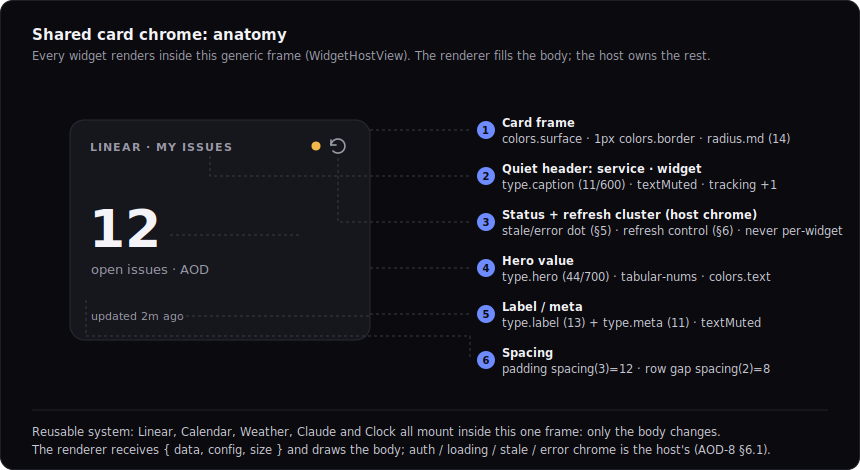
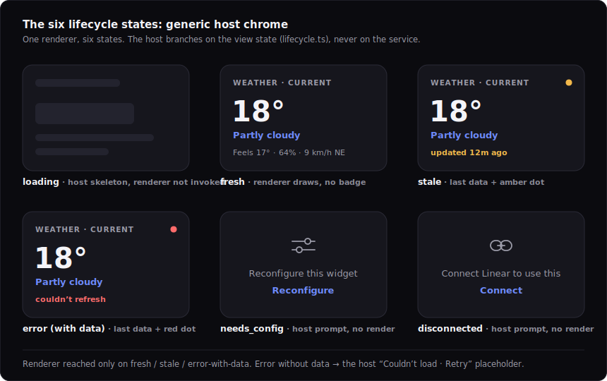
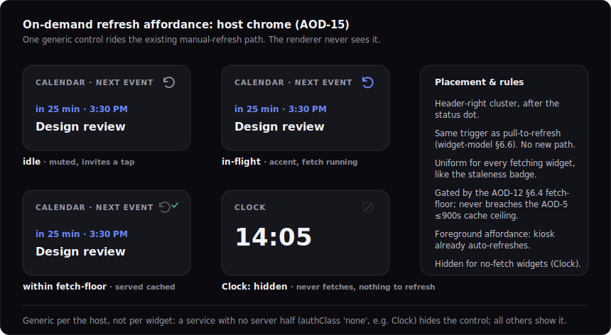
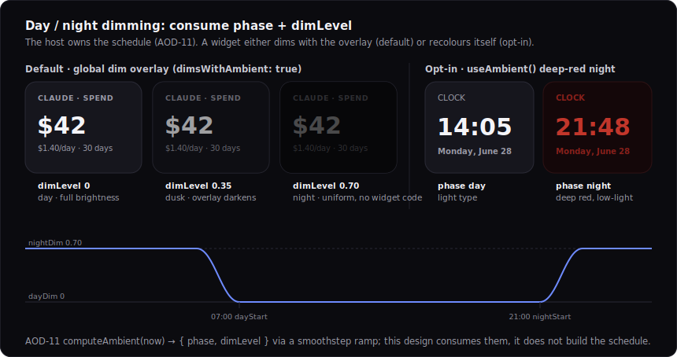
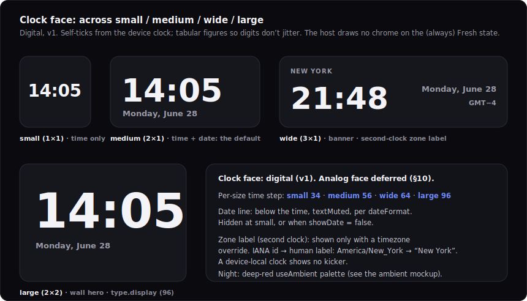

# Design: Vela Widget Visual System + Clock Face

> Status: draft for review, 2026-06-28. Tracked by [AOD-37](https://linear.app/thexap/issue/AOD-37) (`type:design`, milestone I-M3 "Clock & widget polish", project Integrations). The **first `type:design` deliverable in the repo**; it establishes the design convention recorded in [`engineering-process.md`](../engineering-process.md) (a `design-` doc under `docs/specs/` + rendered SVG mockups in `docs/specs/assets/`, merged via PR). It is the design-first counterpart to the integration builds: every v1 service shipped a deliberately functional-but-unpolished renderer ahead of its design task (each renderer says so in its header comment, e.g. "Functional and on-brand-enough; ... is AOD-37"), and this doc is that design.
>
> This deliverable has two halves, in dependency order. **First the system:** the shared widget visual language drawn once, so the sibling per-widget designs ([AOD-35](https://linear.app/thexap/issue/AOD-35) Calendar + Weather, [AOD-36](https://linear.app/thexap/issue/AOD-36) Claude usage) are **applications** of it, not redesigns. The system is the card chrome, the design-token foundation (a typography scale and an ambient palette), the six lifecycle-state visuals, the day/night dim behavior, and the cross-cutting on-demand refresh affordance. **Then the application:** the Clock face across all four sizes, the design seam [`integration-clock.md`](integration-clock.md) §10 explicitly handed to AOD-37 (digital face, typography, the date line, the second-clock zone label, and the deep-red night palette).
>
> **The AOD-15 fold-in.** AOD-37 `depends` [AOD-15](https://linear.app/thexap/issue/AOD-15) (the on-demand refresh affordance). [AOD-15](https://linear.app/thexap/issue/AOD-15) is **Done**: it is a `type:spec` whose output already landed in [`widget-model.md`](widget-model.md) §6.6 (the refresh button rides the existing manual-refresh path, is generic host chrome, is gated by the [AOD-12](https://linear.app/thexap/issue/AOD-12) §6.4 fetch-floor, and never breaches the [AOD-5](https://linear.app/thexap/issue/AOD-5) cache ceiling). The dependency is therefore **satisfied**, and this design does not re-spec it; it fixes the affordance's **visual** design (the control, its placement, its states, and the per-widget hidden/no-op behavior) as the host chrome AOD-15 left for the design step. No scope is expanded.
>
> **What this fixes, and what it must not touch.** It fixes **visuals only**: design tokens, the chrome, the per-state and per-size appearance. It expresses every value as a **design token** to be added to [`apps/app/unistyles.ts`](../../apps/app/unistyles.ts), so the implementing polish build extends the token set rather than hardcoding; it does **not** edit `unistyles.ts` (that is the build's job, the way a spec does not write its code). It does **not** change the registry/host/layout architecture or the [AOD-8](https://linear.app/thexap/issue/AOD-8) §6.1 render contract `{ data, config, size }`: the five leaf renderers stay pure and never learn auth/loading/error, the generic host keeps drawing the chrome. The implementing polish is a **separate I-M3 `type:tech-task`**, created after this lands, the same way each integration spec was separate from its build.
>
> **Additive update (2026-06-29, [AOD-61](https://linear.app/thexap/issue/AOD-61)).** §5.1 promotes the **empty body**, the renderer-drawn fresh-but-empty body, into the system as a seventh body alongside the six host states (its mockup is [`design-empty-body.svg`](assets/design-empty-body.svg)). This resolves the gap that both sibling applications flagged: [AOD-35](https://linear.app/thexap/issue/AOD-35) ([`design-calendar-weather.md`](design-calendar-weather.md) §10.2) named it first and [AOD-36](https://linear.app/thexap/issue/AOD-36) ([`design-claude-usage.md`](design-claude-usage.md) §9.3) confirmed it on a second consumer and recommended the promotion. It is **purely additive**: no change to the six host states, the tokens, the chrome, the dim/ambient behavior, the refresh affordance, or the `{ data, config, size }` contract.

## 1. Purpose and scope

The v1 integration arc is complete: all five services are specced and built (Linear [AOD-55](https://linear.app/thexap/issue/AOD-55), Google Calendar [AOD-56](https://linear.app/thexap/issue/AOD-56), Weather [AOD-58](https://linear.app/thexap/issue/AOD-58), Claude usage [AOD-59](https://linear.app/thexap/issue/AOD-59), Clock [AOD-60](https://linear.app/thexap/issue/AOD-60)). Each shipped a leaf renderer that draws the right data at on-brand-enough fidelity but explicitly deferred its pixel polish to a design task. I-M3 "Clock & widget polish" is the milestone that closes that gap, and AOD-37 is its design issue: define the shared visual language once, then apply it to the Clock.

It fixes exactly six things:

1. **The design-token foundation** (section 3): an ambient color set (the shipped dark/light themes recapped, plus a deep-red night palette and an overlay token), a typography scale (named steps replacing the per-card ad-hoc font sizes), and the spacing/radius/dot tokens the chrome composes from. Specified as additions to [`unistyles.ts`](../../apps/app/unistyles.ts), not written into it.
2. **The shared card chrome** (section 4): the frame, the quiet header (service and widget title), the status-and-refresh cluster, and the value-first body hierarchy that the generic host ([`WidgetHostView.tsx`](../../apps/app/src/host/WidgetHostView.tsx)) draws for every widget.
3. **The six lifecycle-state visuals** (section 5): a generic appearance for each of `loading`, `fresh`, `stale`, `error`, `needs_config`, `disconnected` ([`lifecycle.ts`](../../apps/app/src/widgets/lifecycle.ts)), drawn by the host branching on the view state, never on the service.
4. **The on-demand refresh affordance** (section 6): the [AOD-15](https://linear.app/thexap/issue/AOD-15) refresh control as host chrome, its placement and states, and its hidden/no-op behavior for an always-live widget (the Clock).
5. **The day/night dim and ambient behavior** (section 7): the global dim overlay default, the `useAmbient()` opt-in, and the deep-red night palette, all consuming the `phase`/`dimLevel` signal the kiosk runtime ([AOD-11](https://linear.app/thexap/issue/AOD-11) §8) produces.
6. **The Clock face** (section 8): digital, across `small` / `medium` / `wide` / `large`, with the date-line treatment, the second-clock zone label, and the night clock that ties to the ambient palette.

**In scope:** the shared visual system (tokens, chrome, state visuals, dim/ambient, refresh affordance) and its first application (the Clock face), designed so [AOD-35](https://linear.app/thexap/issue/AOD-35) / [AOD-36](https://linear.app/thexap/issue/AOD-36) are applications of it (section 9).

**Out of scope (named so the frame is clear):**

- **Implementing the polish in code.** A separate I-M3 `type:tech-task` lifts these tokens into [`unistyles.ts`](../../apps/app/unistyles.ts) and applies them to the chrome and the leaf renderers. This doc is the design it implements.
- **The kiosk schedule and dim curve mechanics** ([AOD-11](https://linear.app/thexap/issue/AOD-11) §8): this design **consumes** `AmbientContext { phase, dimLevel }`; it does not build the schedule, the solar/fixed modes, the smoothstep ramp, or the backlight lever.
- **The per-widget visual application** for Calendar, Weather ([AOD-35](https://linear.app/thexap/issue/AOD-35)) and Claude usage ([AOD-36](https://linear.app/thexap/issue/AOD-36)): this doc builds the system they apply and shows the mapping (section 9), but their bespoke choices (the weather icon set, the day/night weather treatment, the spend chart) are theirs.
- **An analog clock face**, **world-clock multi-instance polish**, and **alarms / timers / stopwatch**: not v1. [`integration-clock.md`](integration-clock.md) §2 treats the analog face as out of scope and §10 names it a future variant, so v1 is **digital** (section 8.1).
- **Any change to the registry/host/layout architecture or the render contract.** The renderers stay pure; `{ data, config, size }` is unchanged; `useAmbient()` is the additive context the widget model ([AOD-10](https://linear.app/thexap/issue/AOD-10) §8) already defined, not a new render prop.
- **Motion and animation specifics** beyond naming them (the loading shimmer, the refresh spin, the dim ramp): timings are a build refinement, named here (section 10), not fixed.

## 2. Locked context this builds on

| Source | What it locks | How this design uses it |
|---|---|---|
| [AOD-8](https://linear.app/thexap/issue/AOD-8) §6.1 / [`WidgetHostView.tsx`](../../apps/app/src/host/WidgetHostView.tsx) | The render contract `{ data, config, size }`; the host draws all chrome, the renderer only draws data. | Sections 4 to 6 design the **host** chrome; section 8 designs the Clock **leaf**. Neither changes the contract. |
| [AOD-10](https://linear.app/thexap/issue/AOD-10) §7 / [`lifecycle.ts`](../../apps/app/src/widgets/lifecycle.ts) | The six view states and which reach the renderer (`invokesRenderer`). | Section 5 fixes the visual for each state generically. |
| [AOD-10](https://linear.app/thexap/issue/AOD-10) §6.6 / [AOD-15](https://linear.app/thexap/issue/AOD-15) | The manual-refresh path and the on-demand refresh button as generic host chrome, fetch-floor gated. | Section 6 fixes its visual design; the mechanism is unchanged. |
| [AOD-10](https://linear.app/thexap/issue/AOD-10) §8 | `AmbientContext { phase, dimLevel }`, the global overlay default (`dimsWithAmbient: true`), the `useAmbient()` opt-in. | Section 7 designs the overlay appearance and the opt-in night palette; consumes the signal. |
| [AOD-11](https://linear.app/thexap/issue/AOD-11) §8 | The schedule and dim curve that set `phase`/`dimLevel`; the deep-red clock named as the canonical opt-in. | Section 7 consumes the curve's output; section 8.5 designs the deep-red clock it predicts. |
| [`unistyles.ts`](../../apps/app/unistyles.ts) | The token themes (`theme.colors`, `theme.spacing`, `theme.radius`); dark default + light. | Section 3 recaps them and specifies **additions** (type scale, night palette, overlay). |
| [`integration-clock.md`](integration-clock.md) §4 / §5 / §10 | What Clock renders (`ClockView`), its config (12/24h, seconds, date + format, zone), and the visual seam handed to AOD-37. | Section 8 designs the face the spec deferred. |
| The five leaf renderers (`registry/services/*/*Card.tsx`) | The current functional visuals to polish: hero value + label + meta, per-card font sizes. | Section 3.3 generalizes their ad-hoc sizes into a scale; sections 4, 8, 9 polish them. |

The shipped chrome and the Clock leaf, verbatim in shape, are what this polishes. The host card today is a `surface` rectangle with a `border`, `radius.md`, padding `spacing(3)`, a header with a `title` and `stale`/`error` text badges, and the lifecycle prompts. The Clock leaf today draws `time` at 48/700 and `date` at 15/600. The design keeps the structure and fixes the tokens.

## 3. Design tokens (the foundation)

The product is an **ambient, glanceable, dark-by-default** wall display. The visual language follows three rules: the **value dominates** (the one thing you glance at is the largest, brightest element), the **chrome recedes** (titles, labels, badges are quiet so they never compete with the value), and **night is first-class** (the display must be readable and calm in a dark room). These tokens encode those rules. They are specified as additions to [`unistyles.ts`](../../apps/app/unistyles.ts); the polish build adds them, the renderers and chrome then reference `theme.*` rather than literals.

### 3.1 Color (shipped, recapped)

The dark theme is the canonical ambient surface; the light theme is the foreground-app variant. Both already ship; this design adds no base colors, only the night palette (3.2) and the overlay (3.4). Status colors (`warning`, `error`, `success`) already exist and carry the badges and status dots.

| Token | Dark | Light | Role |
|---|---|---|---|
| `background` | `#0B0B0F` | `#F6F6FA` | The dashboard backdrop behind the cards. |
| `surface` | `#16161D` | `#FFFFFF` | The card fill. |
| `border` | `#2A2A36` | `#DADAE2` | The 1px card border. |
| `text` | `#F4F4F8` | `#16161D` | The hero value and primary text. |
| `textMuted` | `#9B9BA8` | `#6B6B78` | Titles, labels, meta, the receding chrome. |
| `accent` | `#6E8BFF` | `#3F5BD6` | One accent: actions, the in-flight refresh, a card's one highlighted figure. |
| `warning` / `error` / `success` | `#F2B84B` / `#FF6B6B` / `#4CB782` | `#B5791B` / `#D64545` / `#2F8F63` | Stale dot / error dot / within-floor confirm. |

### 3.2 The night / ambient palette (deep red)

[AOD-10](https://linear.app/thexap/issue/AOD-10) §8 and [AOD-11](https://linear.app/thexap/issue/AOD-11) §8 name "a clock that shifts to a deep red at night" as the canonical `useAmbient()` opt-in. This is its palette: a low-luminance, low-blue-light red on a red-black surface, calm enough to sit on a nightstand or wall in a dark room. It is a new token group, read only by widgets that opt out of the global overlay (section 7.2).

| Token | Value | Role |
|---|---|---|
| `night.bg` | `#0A0506` | The backdrop behind a night-mode card (red-black). |
| `night.surface` | `#140709` | The card fill at night. |
| `night.border` | `#2E1214` | The card border at night. |
| `night.primary` | `#C2362B` | The hero value at night (the time). |
| `night.secondary` | `#8A201B` | The date and secondary text at night. |
| `night.muted` | `#5E1714` | The zone kicker and tertiary text at night. |

The red also **dims further with `dimLevel`**: an opt-in widget scales its night text luminance down toward the deepest dim as `dimLevel` rises (early evening is a brighter red, deep night the dimmest), so the opt-in composes with the curve rather than ignoring it. The mapping (a luminance multiply, floor ~0.45) is a build refinement; the tokens above are the full-night anchor.

### 3.3 Typography scale

The renderers today each pick a font size ad hoc (48, 44, 40 for hero values; 18, 15, 14, 13 for text; 10 for badges). This generalizes them into one named scale so every card shares a vertical rhythm and the build references `theme.type.*`. Weights and tracking are part of the token. Numeric values (`display`, `hero`, `xl`) carry `fontVariant: ['tabular-nums']` so digits do not jitter as they tick or refresh.

| Step | Size / weight | Role | Replaces (today) |
|---|---|---|---|
| `display` | 96 / 700, tracking −1 | The wall-dominating hero (Clock `large`). | (new) |
| `hero` | 44 / 700, tracking −0.5 | The primary value: temperature, spend, the Clock `medium` time. | weather 44, clock 48 |
| `xl` | 40 / 700 | A large value in a denser card. | claude 40 |
| `title` | 18 / 600 | A card's primary text line (event title). | calendar 18 |
| `heading` | 15 / 600 | A labeled condition or section head. | weather 15, clock date 15 |
| `body` | 14 / 500 | Default body text. | host title 14 |
| `label` | 13 / 600 | An accent-or-muted label above a value. | claude/calendar 13 |
| `meta` | 13 / 400 | Muted secondary detail (feels-like, humidity). | weather/claude/calendar meta 13 |
| `caption` | 11 / 500 | The quiet header title, the zone kicker, "updated 2m ago". | (new, formalizes 10-11) |
| `badge` | 10 / 700, tracking +1, uppercase | The stale/error badge text (paired with a dot). | host badge 10 |

The Clock time is the one value that scales with the size class rather than sitting at a fixed step. Its ramp is a token group:

```typescript
// Clock time size per supported size class (section 8.2). large maps to type.display.
clockSize: { small: 34, medium: 56, wide: 64, large: 96 }
```

### 3.4 Spacing, radius, overlay, status dot

- **Spacing and radius** are shipped and unchanged: `spacing(n) = n * 4` (so the card padding is `spacing(3) = 12`, the row gap `spacing(2) = 8`), and `radius = { sm: 8, md: 14, lg: 22 }` (the card uses `radius.md`).
- **Overlay** (new) is the global dim token: `overlay = { color: '#000000', maxDim: 0.72 }`. The host paints `overlay.color` at opacity `dimLevel * overlay.maxDim` across a `dimsWithAmbient: true` card. `0.72` matches the kiosk curve's `nightDim ~0.7` anchor ([AOD-11](https://linear.app/thexap/issue/AOD-11) §8.2) so a full-night overlay reads as deep dim, not black.
- **Status dot** (new) is the chrome indicator size: `dot = { r: 4.5 }`, filled with `warning` (stale) or `error` (error). It replaces the word-badges as the primary glanceable status mark; the `badge` text becomes an optional secondary.

## 4. The shared card chrome

Every widget, in every state, renders inside one generic frame. The renderer fills only the body; the host owns the frame, the header, the status cluster, and the prompts. This is the [AOD-8](https://linear.app/thexap/issue/AOD-8) §6.1 contract made visual, and it is what makes the system reusable: Linear, Calendar, Weather, Claude and Clock all mount in this chrome and only their body differs.



<details>
<summary>Design tokens &amp; measurements</summary>

```
frame    : colors.surface fill · 1px colors.border · radius.md (14) · padding spacing(3)=12 · row gap spacing(2)=8
header   : title = service · widget, type.caption, colors.textMuted, tracking +1, single line
cluster  : right-aligned · status dot (r 4.5, warning|error) + refresh control (section 6) · host chrome, never per-widget
hero     : type.hero (44/700), tabular-nums, colors.text · the one glanceable value
label    : type.label (13/600) under the hero · meta = type.meta (13/400), colors.textMuted
```
</details>

### 4.1 The frame

Unchanged in structure: `surface` fill, 1px `border`, `radius.md`, `padding spacing(3)`, body gap `spacing(2)`, `minWidth 160`. The card is flat (border-defined, no shadow): shadows read as glare on an ambient display. The frame is the one element that never changes between widgets or states.

### 4.2 The quiet header

The header is a single row: a left **title** and a right **status-and-refresh cluster**. The title reads `SERVICE · WIDGET` (for example `LINEAR · MY ISSUES`, `WEATHER · CURRENT`) in `type.caption`, `textMuted`, tracking +1. Quiet by design: it identifies the card without competing with the value. Today's header draws the widget title at `body` weight; this drops it to the receding `caption` step.

The header is **suppressible** for a self-evident card. The Clock at `small` shows no header (a giant `14:05` needs no `CLOCK` label, section 8.2); the host suppresses the header when the widget declares it (a build hint, default off), with no change to the render contract. This is a generic host capability, not a Clock special case.

### 4.3 The body and the value-first hierarchy

The body is a vertical stack with one rule: **the value is the largest, brightest element; everything else recedes.** The canonical body is hero value (`type.hero`/`display`, `text`) → optional label (`type.label`) → optional meta (`type.meta`, `textMuted`). The existing renderers already follow this; the polish is to map their ad-hoc sizes onto the scale (section 3.3) and to apply `tabular-nums` to every numeric hero so a ticking or refreshing value does not shift width.

## 5. The six lifecycle-state visuals

The host draws one visual per view state, branching on the state and never on the service, so all five v1 widgets (and every future one) get these for free. This polishes the prompts and badges the shipped host already renders. These six are **host-drawn** and report the data *pipeline's* status; a widget can also draw a **seventh body** the host cannot, a fresh render whose content is legitimately empty, formalized in §5.1 as the **empty body**, distinct from the six states here.



<details>
<summary>Per-state visual spec</summary>

```
loading      : host skeleton: 2-3 shimmer bars (colors.skeleton) mirroring header + value + meta. Renderer NOT invoked.
fresh        : renderer draws; quiet header; no dot; refresh idle. The baseline.
stale        : renderer draws last-known data; warning dot (r 4.5) in the cluster; "updated Nm ago" in type.caption, warning.
error+data   : renderer draws last-known data; error dot; "couldn't refresh" in type.caption, error.
error,no data: host placeholder: "Couldn't load" (type.body, textMuted) + "Retry" action (type.label, accent). Renderer NOT invoked.
needs_config : host prompt: sliders glyph + "Reconfigure this widget" (textMuted) + "Reconfigure" action (accent). Renderer NOT invoked.
disconnected : host prompt: link glyph + "Connect <Service>" (textMuted) + "Connect" action (accent). Renderer NOT invoked.
```
</details>

The states, each generic:

- **loading**: a host skeleton of 2 to 3 shimmer bars in `skeleton` color, shaped to hint the card's header, value, and meta rows (not a single bar). A slow shimmer sweep, no spinner. The renderer is not invoked.
- **fresh**: the baseline. The renderer draws, the header is quiet, no dot, the refresh control is idle. The state the display sits in almost always.
- **stale**: the renderer keeps drawing the **last-known data** (a glanceable display never blanks), and the host overlays a `warning` status dot in the cluster plus an "updated Nm ago" caption. The amber dot is the primary mark; the caption is the detail.
- **error (with data)**: same as stale but an `error` dot and a "couldn't refresh" caption. The last-known value stays on screen; the red dot signals the refresh failed.
- **error (no data)**: the only error form with nothing to draw. A host placeholder, "Couldn't load" plus a "Retry" action. This is the one `error` substate that does not reach the renderer.
- **needs_config**: a host prompt, a sliders glyph, "Reconfigure this widget", and a "Reconfigure" action. Reached when a `remote-options` value no longer resolves (a deleted Linear project / calendar), distinct from an error and from a disconnect.
- **disconnected**: a host prompt, a link glyph, "Connect <Service>", and a "Connect" action. The transient reauth/credential-died state.

Actions (`Retry`, `Reconfigure`, `Connect`) share one treatment: `type.label`, `accent`. Prompts share one layout: centered glyph, a muted line, an accent action. The consistency is the point: a user learns one vocabulary of "something needs you" across every widget.

### 5.1 The empty body (a renderer-drawn body, not a seventh state)

The six states above are **host-drawn** and report the data *pipeline's* status. There is a seventh body the host cannot draw: a **fresh render whose content is legitimately empty**, a successful fetch whose data says "nothing." Whether fresh content is empty is **domain-specific** (no events vs no spend vs no active cycle), so only the **leaf** knows it, and the leaf draws it, within the data-bearing states (`fresh` / `stale` / `error`-with-data). It is a seventh **body**, not a seventh lifecycle state. This subsection promotes one shared definition for it (the four v1 leaves already draw a bare `type.body`/`textMuted` line here; the polish builds apply this convention so they share one pattern rather than drifting).


<details>
<summary>The empty-body convention</summary>

```
trigger : a data-bearing render (fresh / stale / error-with-data) whose CONTENT is empty
          (hasEvent:false · empty events[] · days:[] · active:false · totalCount 0). The leaf draws it.
layout  : centered, vertically calm: a glyph over a line over an optional subline.
glyph   : a per-widget line-icon, colors.accent or colors.textMuted, ~1.7 non-scaling stroke,
          round caps/joins (the section 4/5 chrome-glyph family). Speaks the widget's own
          language (the calendar glyph, the flat-chart glyph, the cycle ring).
line    : type.body (14/500), colors.textMuted. States what the data says ("Nothing next").
subline : optional, a quieter step (type.caption/meta), colors.textMuted. Reassurance, not an instruction.
action  : NONE. The trait that separates it from the error / needs_config / disconnected prompts.
tokens  : reuses type.body + colors.textMuted + colors.accent. NO new shared token; the glyph is per-widget.
not     : not a seventh lifecycle state (those are host-drawn pipeline status); not a zero value
          (Spend MTD's $0.00 is a hero value, design-claude-usage.md §5.3).
```
</details>

**The convention.** A centered, calm body: a quiet per-widget **glyph** (a line-icon in `colors.accent` or `colors.textMuted`, the same family as the section 4 / 5 chrome glyphs), a `type.body` `colors.textMuted` **line** stating what the data says, and an optional quieter **subline** (a smaller step) offering reassurance. It draws in the body zone like any fresh render; the chrome (frame, quiet header, status-and-refresh cluster) is the host's, unchanged.

**The defining trait: no action.** The host's `error` / `needs_config` / `disconnected` prompts (§5) each carry an action (`Retry` / `Reconfigure` / `Connect`) because something needs the user. An empty body carries **none**: nothing is wrong, the data simply says "nothing," so there is nothing to act on. That is the line separating the empty body from the action-bearing prompts it can resemble.

**Not a zero value.** A valid figure that happens to be zero is **not** an empty body: Claude Spend MTD renders `$0.00` as its hero value (a known total that is zero), not as a calm empty body ([`design-claude-usage.md`](design-claude-usage.md) §5.3). The empty body is an **absence of items to draw**, not a value of zero. Daily Spend's empty `days[]` is the empty body; Spend MTD's `$0.00` is a value.

**No new token.** The convention reuses `type.body`, `colors.textMuted`, and `colors.accent` (§3); the **glyph is per-widget** (the calendar glyph, the flat-chart glyph, the cycle ring), exactly as the weather and sparkline glyphs are per-widget, so no shared token is added. If a future empty body needs a genuinely shared value, it is specified the §3 way (in this doc, not written into [`unistyles.ts`](../../apps/app/unistyles.ts)).

**v1 consumers.** Four renderers draw this body in v1, and a fifth instance shares it:

| Widget (design) | Empty payload | Body line |
|---|---|---|
| Calendar Next Event ([AOD-35](https://linear.app/thexap/issue/AOD-35)) | `hasEvent: false` | "Nothing next" |
| Calendar Agenda ([AOD-35](https://linear.app/thexap/issue/AOD-35)) | empty `events[]` | "Nothing left today" |
| Claude Daily Spend ([AOD-36](https://linear.app/thexap/issue/AOD-36)) | `days: []` | "No spend yet this month" |
| Linear Current Cycle ([AOD-30](https://linear.app/thexap/issue/AOD-30)) | `active: false` | "No active cycle" |
| Linear My Issues ([AOD-30](https://linear.app/thexap/issue/AOD-30)) | `totalCount === 0` | "No assigned issues" |

This resolves a gap the sibling applications flagged: [`design-calendar-weather.md`](design-calendar-weather.md) §10.2 named it first (AOD-37 §5 had no empty-body visual, and three widgets hit it), and [`design-claude-usage.md`](design-claude-usage.md) §9.3 confirmed it on a second consumer and recommended the promotion once two independent consumers existed. The empties were already drawn to this shape in those docs' mockups; this subsection promotes that one definition into the system, so the per-widget polish builds implement one pattern, not several that drift. It is additive: it changes no host state, token, chrome, dim/ambient behavior, refresh affordance, or the `{ data, config, size }` render contract.

## 6. The on-demand refresh affordance (AOD-15)

The refresh control is generic host chrome that fires the explicit-user arm of the manual-refresh path ([AOD-15](https://linear.app/thexap/issue/AOD-15), [`widget-model.md`](widget-model.md) §6.6); it adds no mechanism. This design fixes how it looks, where it sits, and when it hides.



<details>
<summary>Control states &amp; placement</summary>

```
placement  : header-right cluster, after the status dot. A circular-arrow glyph, ~14px, tap target ≥ 44px.
idle       : colors.textMuted glyph. Invites a tap.
in-flight  : colors.accent glyph, rotating, while a manual fetch runs.
within-floor: dimmed glyph + a success check: a tap inside the AOD-12 §6.4 fetch-floor is served the cached/coalesced value, no provider call.
hidden     : omitted entirely for a widget that never fetches (authClass 'none' / no server half, e.g. Clock).
gating     : never breaches the AOD-5 ≤900s cache ceiling; foreground affordance (kiosk auto-refreshes).
```
</details>

- **Placement.** The header-right cluster, after the status dot: status and refresh are one group of host chrome. A circular-arrow glyph at ~14px with a tap target of at least 44px.
- **idle**: a `textMuted` glyph, quiet, inviting a tap.
- **in-flight**: an `accent` glyph, rotating, while a manual fetch runs. The one place a card animates on demand.
- **within the fetch-floor**: the glyph dims and shows a brief `success` check. A tap inside the [AOD-12](https://linear.app/thexap/issue/AOD-12) §6.4 per-user fetch-floor returns the cached/coalesced value and makes no provider call, so the control confirms "up to date" rather than spinning. It can never breach the [AOD-5](https://linear.app/thexap/issue/AOD-5) ≤900s cache ceiling.
- **hidden / no-op**: a widget that **never fetches** has nothing to refresh, so the control is omitted. The rule is generic per the host. A service with **no server half** (`authClass: 'none'`, e.g. Clock) hides it; every fetching widget shows it. This is the design answer to the seam [`integration-clock.md`](integration-clock.md) §10 names ("the AOD-15 refresh button is host chrome and a no-op for an always-live clock"), not a disabled control, an absent one.

It is a **foreground** affordance: in kiosk the foreground timer already refreshes continuously, so the button serves the phone or a foreground glance.

## 7. Day / night dim and ambient

A wall display must not blast light at night. [AOD-10](https://linear.app/thexap/issue/AOD-10) §8 owns the widget-level mechanism (the signal and the two ways a widget reacts); [AOD-11](https://linear.app/thexap/issue/AOD-11) §8 owns the schedule and curve that produce the signal. This design **consumes** `AmbientContext { phase, dimLevel }` and fixes how the two reactions look. It does not build the schedule.



<details>
<summary>Dim tokens &amp; the two reactions</summary>

```
default (dimsWithAmbient: true) : host paints overlay.color (#000) at opacity = dimLevel * overlay.maxDim (0.72) over the card.
                                   Uniform, no widget code. dimLevel 0 = day, ~0.7 = full night.
opt-in (dimsWithAmbient: false) : widget reads useAmbient() and recolours itself; the host skips the overlay for it.
deep-red night (section 3.2)    : night.{bg,surface,border,primary,secondary,muted}; luminance dims further with dimLevel.
curve (AOD-11, consumed)        : computeAmbient(now) eases dimLevel 0 → ~0.7 with a smoothstep ramp at dayStart / nightStart.
```
</details>

### 7.1 The global overlay (default)

A `dimsWithAmbient: true` widget needs no code: the host paints `overlay.color` at opacity `dimLevel * overlay.maxDim` across the whole card, darkening it uniformly. This is the right default for almost every widget (a list, a chart, a value): at night the card recedes without anyone authoring a night look. The mockup's left three cards show the same card at `dimLevel` 0, 0.35, 0.70.

### 7.2 The `useAmbient()` opt-in

A widget that wants a real **night appearance**, not just a darker one, sets `dimsWithAmbient: false`, reads `useAmbient()`, and recolours itself; the host then skips the overlay for it. The opt-in exists because the overlay can only **darken**, not **recolour**: it cannot turn white digits deep red. `useAmbient()` is the additive context the widget model already defines; opting in does not change the `{ data, config, size }` render props.

### 7.3 The deep-red night palette

The canonical opt-in is the Clock (section 8.5): by day it draws in `text`/`textMuted`; by night (`phase === 'night'`) it swaps to the night palette (section 3.2), a deep red on red-black, and dims further as `dimLevel` rises. This is the example [AOD-10](https://linear.app/thexap/issue/AOD-10) §8 and [AOD-11](https://linear.app/thexap/issue/AOD-11) §8 both predicted, now given a palette.

### 7.4 The backlight (kiosk owns, named)

[AOD-11](https://linear.app/thexap/issue/AOD-11) §8.3 also drives the physical backlight down at night (a real light reduction the overlay cannot achieve), kiosk-only. That is a kiosk capability, not a widget visual; this design composes with it (darker pixels and a deeper red **and** less backlight at night) but does not own it.

## 8. The Clock face

The Clock is the system's first application and the product's flagship ambient widget (Vela was born as a Fire HD 8 wall clock). The system above gives it the chrome, the type scale, the dim behavior, and the night palette; this section fixes the Clock-specific choices [`integration-clock.md`](integration-clock.md) §10 handed to AOD-37.



<details>
<summary>Clock face spec</summary>

```
face       : digital (v1). Analog face deferred (integration-clock §2/§10).
time step  : clockSize.{small 34, medium 56, wide 64, large→type.display 96}; tabular-nums.
date line  : below the time, type.heading/meta, textMuted, per dateFormat. Hidden at small, or when showDate=false.
zone label : shown ONLY with a timezone override (a second clock). IANA id → human label (America/New_York → "New York").
             A device-local clock shows no kicker.
night      : useAmbient() deep-red palette (section 3.2, 7.3); dims further with dimLevel.
contract   : data is undefined (host none path); the leaf self-ticks from the device clock; { config, size } only.
```
</details>

### 8.1 Digital, v1; analog deferred

v1 is a **digital** face. [`integration-clock.md`](integration-clock.md) §2 lists the analog face out of scope and §10 names it a future variant; this design confirms that and does not draw an analog face. The digital face is the right ambient default (legible across the room at a glance) and matches every other v1 card's value-first body.

### 8.2 The four sizes

The Clock declares `supportedSizes: ['small', 'medium', 'wide', 'large']`. The time uses the `clockSize` ramp (section 3.3); the host hands the leaf the reconciled size class and the leaf draws that layout (the [AOD-10](https://linear.app/thexap/issue/AOD-10) §5 contract).

- **small (1×1)**: time only, `clockSize.small` (34), **no header, no date**. A 1×1 glance is just the time. Seconds off by default.
- **medium (2×1)**: the default, time at `clockSize.medium` (56) over a date line. The everyday card.
- **wide (3×1)**: a banner, the time on the left at `clockSize.wide` (64), the date (and, for a second clock, the zone offset) on the right. The shelf/strip layout, and the natural home for a second clock (8.4).
- **large (2×2)**: the wall hero, the time at `type.display` (96) over the date, optionally with seconds. The wall-dominating clock the product was born as.

### 8.3 The date line

When `showDate` is true, the date sits directly below the time in `textMuted`, formatted per the `dateFormat` config (`full` / `long` / `medium` / `short`, e.g. "Monday, June 28"). It is hidden at `small` (no room) and when `showDate` is false. At `large` it steps up to `type.heading`; elsewhere `type.meta`.

### 8.4 The second-clock zone label

[`integration-clock.md`](integration-clock.md) §5.2 deferred per-zone labels to this design. The rule: a zone label (kicker) is shown **only when a `timezone` override is set**, marking the card as a second clock for a fixed zone. A device-local clock (the default, `timezone === ''`) shows **no** kicker, because it is simply "your time" and a label would be noise. The label is derived from the IANA id, not stored: take the last path segment and humanize it (`America/New_York` → "New York", `Europe/Madrid` → "Madrid"). It renders as a `type.caption`, `textMuted` kicker above the time. This is what lets two Clock instances sit side by side on a wall, one local and one remote, and stay distinguishable, with no new mechanism beyond the override the spec already added.

### 8.5 The night clock

The Clock is the deep-red opt-in (section 7.2, 7.3): it sets `dimsWithAmbient: false`, reads `useAmbient()`, and at `phase === 'night'` draws the time in `night.primary`, the date in `night.secondary`, and the zone kicker in `night.muted`, on `night.surface`, dimming further as `dimLevel` rises. By day it draws in the standard palette. This is the one widget in v1 that opts out of the overlay, because it is the one with an iconic night appearance worth authoring.

### 8.6 Honoring the render contract

The Clock leaf receives `{ data, config, size }` where `data` is `undefined` (the host `authClass: 'none'` no-fetch path, [`integration-clock.md`](integration-clock.md) §6.3): it ignores `data`, reads `config` and `size`, self-ticks from the device clock, and now also reads `useAmbient()` for night. None of this changes the contract: `useAmbient()` is additive context, the renderer stays a pure function of its inputs plus the device clock, and the host still draws the (always) Fresh chrome. The design polishes the leaf's **appearance**, not its wiring.

## 9. Applying the system: AOD-35 / AOD-36

The test of a system is that the sibling designs are **applications**, not redesigns. They are: each existing renderer already has the value-first body the system formalizes, so [AOD-35](https://linear.app/thexap/issue/AOD-35) and [AOD-36](https://linear.app/thexap/issue/AOD-36) reduce to "map onto the scale, add the bespoke part."

| Widget (design issue) | Reuses from the system, unchanged | Its bespoke application (designed there, not here) |
|---|---|---|
| Weather Current / Forecast ([AOD-35](https://linear.app/thexap/issue/AOD-35)) | Chrome, the six states, `type.hero` for the temperature, `type.meta` for feels-like/humidity/wind, the overlay default. | The **weather icon set** and the day/night condition treatment; the forecast strip layout at `wide`. |
| Calendar Next event / Agenda ([AOD-35](https://linear.app/thexap/issue/AOD-35)) | Chrome, the six states (incl. `needs_config` for a deleted calendar), `type.title` for the event, `accent` for the "when". | The agenda **list density** and the relative-time emphasis; the all-day vs timed treatment. |
| Claude Spend MTD / Daily ([AOD-36](https://linear.app/thexap/issue/AOD-36)) | Chrome, the six states, `type.xl` for the amount with `tabular-nums`, `type.label` for the MTD label, `type.meta` for the run-rate. | The **spend sparkline / chart** and the run-rate emphasis; the cents-precision treatment. |

None of these needs a new card frame, a new state visual, a new dim behavior, or a new token group: they consume section 3 to 7 and design only their body's bespoke part. That is the reuse this doc exists to guarantee.

## 10. Seams left open (named, not decided)

| Seam | Owner | What this design leaves clean |
|---|---|---|
| The **polish build** (lift tokens into [`unistyles.ts`](../../apps/app/unistyles.ts), apply to chrome + the Clock leaf) | I-M3 `type:tech-task` | This doc fixes the visuals and the token values; the build implements them. |
| The **per-widget application** for Weather, Calendar, Claude | [AOD-35](https://linear.app/thexap/issue/AOD-35) / [AOD-36](https://linear.app/thexap/issue/AOD-36) | The system is fixed here; their bespoke bodies (icons, charts) are theirs (section 9). |
| **Motion timings** (loading shimmer rate, refresh spin duration, dim ramp easing) | I-M3 build | Named (a slow shimmer, a rotating in-flight glyph, the [AOD-11](https://linear.app/thexap/issue/AOD-11) smoothstep ramp); exact durations are a build refinement. |
| The **analog clock face** | future | v1 is digital (section 8.1); analog is a future variant per [`integration-clock.md`](integration-clock.md) §10. |
| **World-clock multi-instance polish** (one widget, many zones; a curated picker) | future | v1 makes a second clock by adding a second instance with a zone override (section 8.4). |
| The **deep-red luminance-vs-dimLevel curve** (the exact multiply + floor) | I-M3 build | The full-night anchor palette is fixed (section 3.2); the dimming multiply is a build refinement. |
| A **light-theme ambient** treatment (a foreground-app day look beyond the dark default) | future | The dark theme is the canonical ambient surface; the light theme ships but its ambient polish is not v1. |
| The **header-suppression hint** (the flag that lets the Clock `small` drop the header) | I-M3 build | Named as a generic host capability (section 4.2); the exact declaration is a build detail, not a contract change. |

## 11. Proposed acceptance

Proposed acceptance for this design (call out for confirmation):

> 1. The **token foundation** is fixed as additions to [`unistyles.ts`](../../apps/app/unistyles.ts): the shipped color themes recapped, a **deep-red night palette** (`night.*`) and an **overlay** token added, a **typography scale** (`type.*`) that generalizes the renderers' ad-hoc sizes, a **`clockSize`** ramp, and **`dot`** sizing, all specified (not written into the file).
> 2. The **shared card chrome** is fixed: the flat `surface` frame, the **quiet `SERVICE · WIDGET` header** in `type.caption`/`textMuted` (suppressible for a self-evident card), the **status-and-refresh cluster**, and the **value-first body** hierarchy, drawn generically by the host.
> 3. The **six lifecycle-state visuals** are fixed generically (loading skeleton, fresh, stale + amber dot, error + red dot, error-no-data placeholder, `needs_config` and `disconnected` prompts), with one shared action and prompt treatment, the host branching on the state and never the service.
> 4. The **on-demand refresh affordance** ([AOD-15](https://linear.app/thexap/issue/AOD-15)) is fixed as host chrome: placement in the header cluster, the **idle / in-flight / within-floor / hidden** states, fetch-floor and cache-ceiling gated, and **hidden (not disabled) for a never-fetching widget** (Clock).
> 5. The **day/night dim** is fixed consuming `phase`/`dimLevel`: the **global overlay** default (opacity `dimLevel * 0.72`), the **`useAmbient()` opt-in**, and the **deep-red night palette**; the schedule/curve/backlight stay [AOD-11](https://linear.app/thexap/issue/AOD-11)'s.
> 6. The **Clock face** is fixed: **digital** (analog deferred), across **small / medium / wide / large** with the `clockSize` ramp, the **date-line treatment**, the **second-clock zone label** (shown only on an override, derived from the IANA id), and the **deep-red night clock**, all honoring the `{ data, config, size }` render contract with `data` ignored.
> 7. The system is **reusable**: [AOD-35](https://linear.app/thexap/issue/AOD-35) and [AOD-36](https://linear.app/thexap/issue/AOD-36) are applications of sections 3 to 7 (section 9), not redesigns, and the **six mockups** render (including §5.1's empty body).
> 8. The **empty body** is fixed as a **renderer-drawn** seventh body (§5.1): a centered calm body, a quiet per-widget glyph, a `type.body`/`textMuted` line, an optional quieter subline, and **no action**, distinct from the six host states and from the action-bearing prompts; it reuses existing tokens (no new one) and its v1 consumers are Next Event, Agenda, Daily Spend, and Linear's no-active-cycle. Resolves the gap flagged in [AOD-35](https://linear.app/thexap/issue/AOD-35) §10.2 / [AOD-36](https://linear.app/thexap/issue/AOD-36) §9.3.

| Acceptance clause | Where |
|---|---|
| Token foundation: colors, night palette, type scale, clockSize, overlay, dot | Section 3, all mockups |
| Shared card chrome: frame, quiet header, cluster, value-first body | Section 4; `design-card-anatomy.svg` |
| Six lifecycle-state visuals, generic | Section 5; `design-lifecycle-states.svg` |
| Empty body: renderer-drawn seventh body, no action, v1 consumers | Section 5.1; `design-empty-body.svg` |
| Refresh affordance: placement, four states, hidden for Clock | Section 6; `design-refresh-affordance.svg` |
| Dim/ambient: overlay default, useAmbient opt-in, deep-red night | Section 7; `design-ambient-dim.svg` |
| Clock face: digital, four sizes, date line, zone label, night | Section 8; `design-clock-sizes.svg` |
| Reuse proof (AOD-35 / AOD-36 are applications); seams; acceptance | Sections 9, 10, 11 |

## 12. References

- [AOD-37](https://linear.app/thexap/issue/AOD-37): this design's tracking issue (`type:design`). Depends [AOD-15](https://linear.app/thexap/issue/AOD-15).
- [AOD-15](https://linear.app/thexap/issue/AOD-15): on-demand refresh affordance (`type:spec`, **Done**). The mechanism this fixes the visual of; its output is [`widget-model.md`](widget-model.md) §6.6.
- [AOD-8](https://linear.app/thexap/issue/AOD-8): registry contract. The render contract `{ data, config, size }` (§6.1) this preserves. [`architecture-registry.md`](architecture-registry.md).
- [AOD-10](https://linear.app/thexap/issue/AOD-10): widget model. The lifecycle (§7), the manual-refresh path (§6.6), and the dimming hook (§8) this designs the visuals for. [`widget-model.md`](widget-model.md).
- [AOD-11](https://linear.app/thexap/issue/AOD-11): kiosk mode. Owns the schedule, the dim curve, and the backlight (§8) that produce the `phase`/`dimLevel` this consumes. [`kiosk-mode.md`](kiosk-mode.md).
- [AOD-12](https://linear.app/thexap/issue/AOD-12): entitlement model. The §6.4 fetch-floor (`mayUserTriggerFetch`) gating the refresh control (section 6). [`entitlement-model.md`](entitlement-model.md).
- [AOD-5](https://linear.app/thexap/issue/AOD-5): privacy posture. The ≤900s cache ceiling the refresh control respects.
- [`integration-clock.md`](integration-clock.md) ([AOD-34](https://linear.app/thexap/issue/AOD-34)): the Clock spec. §4/§5 (what Clock renders and its config), §6.3 (the `none` no-fetch path), §10 (the visual seams handed here).
- [AOD-35](https://linear.app/thexap/issue/AOD-35) (Calendar + Weather visuals), [AOD-36](https://linear.app/thexap/issue/AOD-36) (Claude usage visuals): the sibling per-widget applications of this system (section 9).
- [AOD-55](https://linear.app/thexap/issue/AOD-55) / [AOD-56](https://linear.app/thexap/issue/AOD-56) / [AOD-58](https://linear.app/thexap/issue/AOD-58) / [AOD-59](https://linear.app/thexap/issue/AOD-59) / [AOD-60](https://linear.app/thexap/issue/AOD-60): the five integration builds whose functional renderers this polishes.
- [`engineering-process.md`](../engineering-process.md): the `type:design` lifecycle and deliverable convention this deliverable establishes and follows.
- [`apps/app/unistyles.ts`](../../apps/app/unistyles.ts): the token theme the section 3 additions target. The five leaf renderers (`apps/app/src/registry/services/*/*Card.tsx`) and the host ([`WidgetHostView.tsx`](../../apps/app/src/host/WidgetHostView.tsx)) are what the build polishes.
