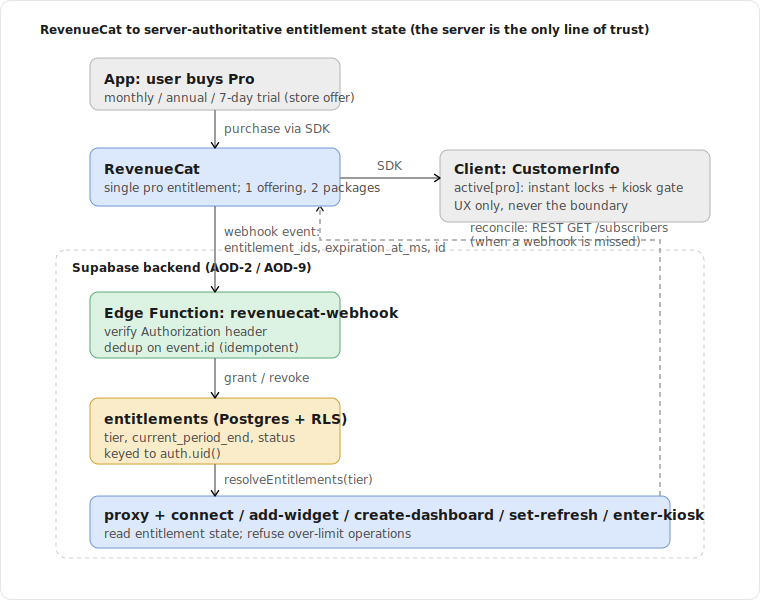
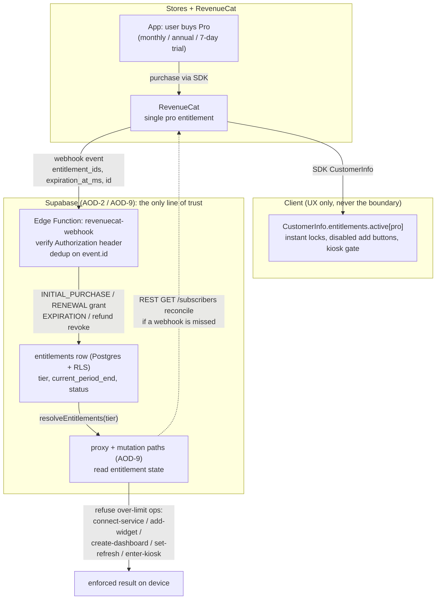
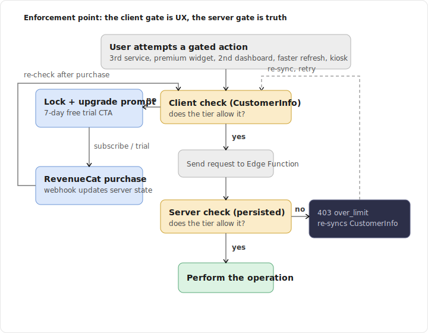
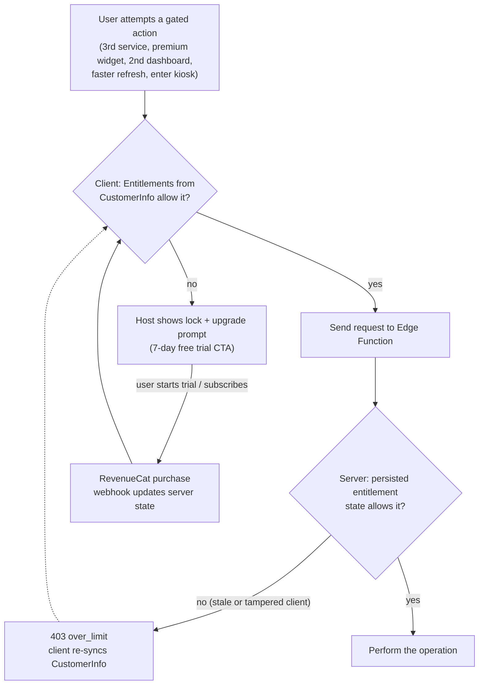

# Spec: Freemium Entitlement Model

> Status: draft for review, 2026-06-18. Tracked by [AOD-12](https://linear.app/thexap/issue/AOD-12) (`type:spec`). Represents and enforces the tier line **locked** by [AOD-3](https://linear.app/thexap/issue/AOD-3) (RevenueCat; Free/Pro boundaries; price); it does not re-decide any of it. Supplies values to and enforces at the seams left open by [AOD-10](https://linear.app/thexap/issue/AOD-10) (widget model, Done; `entitlementFloorSeconds`, pack gating) and [AOD-11](https://linear.app/thexap/issue/AOD-11) (kiosk mode, Done; `canUseKiosk`), plugs its checks into the registry of [AOD-8](https://linear.app/thexap/issue/AOD-8) (Done) without editing layout/dashboard internals, and enforces server-side on the same trust boundary as [AOD-9](https://linear.app/thexap/issue/AOD-9) (OAuth/token model, Done). Backend is Supabase per [AOD-2](https://linear.app/thexap/issue/AOD-2).

## 1. Purpose and scope

AOD-3 decided **where the Free/Pro line sits** and **what Pro costs**. The Done specs each left a clean, typed seam where a tier-driven value plugs in: AOD-10 takes an `entitlementFloorSeconds` it never computes, AOD-11 reads a `canUseKiosk` boolean it never decides, AOD-8 gates which services and widgets are addable at the registry. This spec is the one place that **represents** the locked tier values as a single shape both halves of the product read, and **enforces** them with the server as the only line of trust.

> **One sentence:** AOD-3 set the tiers; AOD-12 turns those tiers into one `Entitlements` object, maps it onto a single RevenueCat `pro` entitlement, and enforces it server-side at every gated seam the other specs already exposed.

**In scope (the AOD-12 work list from the issue body):**

- **The `Entitlements` interface**: the superset of AOD-11's `{ canUseKiosk }` that both client and server read, with concrete Free and Pro values from AOD-3 (`maxConnectedServices`, `maxDashboards`, `entitlementFloorSeconds`, `canUseKiosk`, `canUseThemes`, `canUsePremiumPacks`).
- **RevenueCat entitlement to feature mapping**: the single `pro` entitlement, the offering and packages that sell it, how `CustomerInfo` resolves it, and a mapping table from the entitlement to each gated lever.
- **The enforcement model**: server-authoritative state driven by a secured, idempotent RevenueCat webhook persisted in Postgres under RLS, read by the AOD-9 proxy and every mutation path; the client SDK check as UX only; and reconciliation when a webhook is missed.
- **Each enforcement point mapped to its existing seam**: connect-service (count), add-widget (pack gating), create-dashboard (count), effective-interval floor (AOD-10 6.2), enter-kiosk (AOD-11 4.4), themes.
- **The downgrade / over-limit policy** when a Pro user lapses to Free while exceeding the Free limits.
- **Free-tier limits and the upgrade prompts**, per trigger, with the trial CTA.

**Out of scope (the frame, not the interior; neighbors named):**

- **The tier line and the price are [AOD-3](https://linear.app/thexap/issue/AOD-3)'s** and are locked. This spec treats AOD-3's matrix as input. It never re-argues 2-vs-3 free services, kiosk-Pro-only, the 900s floor, or $5.99/$39.99. Where a number appears here it is cited to AOD-3.
- **The refresh engine is [AOD-10](https://linear.app/thexap/issue/AOD-10)'s.** AOD-12 supplies `entitlementFloorSeconds` to AOD-10 6.2 and adds the server-side fetch-floor that makes it authoritative; it does not redefine `effectiveInterval`, the cache, or coalescing.
- **The kiosk runtime is [AOD-11](https://linear.app/thexap/issue/AOD-11)'s.** AOD-12 owns the `Entitlements` shape and supplies `canUseKiosk`; AOD-11 owns `enter()`, keep-awake, dimming, and pinning.
- **The registry interfaces are [AOD-8](https://linear.app/thexap/issue/AOD-8)'s** and the proxy/token mechanics are [AOD-9](https://linear.app/thexap/issue/AOD-9)'s. AOD-12 adds entitlement checks at points those specs already expose; it edits no layout, dashboard, registry, or broker internals.
- **The specific v1 widget subset is [AOD-4](https://linear.app/thexap/issue/AOD-4)** (open). This spec does not depend on it; premium-pack members (flights, finance) and widgets are illustrative, exactly as in AOD-3.
- **Paywall visual design and upsell copy** are a product/design surface. This spec fixes where each prompt fires and what it must offer, not its pixels or final wording.

## 2. Locked context this builds on

| Source | What it locks | How this spec uses it |
|---|---|---|
| [AOD-3](https://linear.app/thexap/issue/AOD-3) | Provider = RevenueCat. Free = 2 services (Clock never counts) / 1 dashboard / 900s floor / no kiosk / default theme / no premium packs. Pro = unlimited services / all widgets / kiosk / multiple dashboards / all themes / 0 floor / premium packs. Price $5.99/mo, $39.99/yr, 7-day trial. The three seam values. | Section 4 encodes the matrix as `FREE`/`PRO` constants; section 5 maps it onto RevenueCat. Nothing here re-decides it. |
| [AOD-2](https://linear.app/thexap/issue/AOD-2) | Backend is Supabase: Edge Functions, Postgres + RLS, Vault. | Section 6 lands the webhook on an Edge Function and persists entitlement state in a Postgres table under RLS, exactly as AOD-9 lands its broker. |
| [AOD-9](https://linear.app/thexap/issue/AOD-9) §3, §6, §9 | The server is the only line of trust; the `proxy` is the sole data path; mutations run in Edge Functions that derive `user_id` from the Supabase JWT and write under RLS; secrets live in Edge env / Vault. | Section 6 reuses this trust boundary verbatim: the webhook secret is Edge env, the entitlement check rides the existing authenticated mutation/proxy paths, and enforcement is server-side. |
| [AOD-10](https://linear.app/thexap/issue/AOD-10) §6.2, §6.1, §10 | `effectiveInterval(def, instance, entitlementFloorSeconds)` clamps device cadence by the floor AOD-12 supplies; `cacheTtlSeconds` may be entitlement-scoped server-side; premium-pack gating is an entitlement check at the registry. | Section 4 supplies the floor value; section 6.4 adds the server fetch-floor that enforces it and **declines** the per-tier `cacheTtlSeconds` override (section 7, 11); section 7 gates packs at the registry. |
| [AOD-11](https://linear.app/thexap/issue/AOD-11) §4.4 | `interface Entitlements { canUseKiosk: boolean; /* AOD-12 fills the rest */ }`; the check lives at `enter()` step 1. | Section 4 owns the full interface shape; `canUseKiosk` is one field. Section 7 maps the kiosk enforcement point to AOD-11 `enter()`. |
| [AOD-8](https://linear.app/thexap/issue/AOD-8) §9, §10 | `addableWidgets(connected)` and the connect/add/create extension points; "new behavior without editing layout/dashboard/registry internals." | Section 7 plugs the entitlement check into those exact points; the connected-only invariant gains an entitlement predicate, nothing in layout changes. |

RevenueCat's entitlement, offering, package, webhook, and trial mechanics are load-bearing and were verified against current RevenueCat documentation on 2026-06-18 (section 13). The AOD-3 price, store-commission, and RevenueCat-fee facts are already verified in AOD-3 and are not re-verified here.

## 3. How this spec relates to the others (supplies and enforces, does not redefine)

AOD-12 introduces its own types (`Entitlements`, the persisted row) and **consumes** the seams the Done specs exposed. It adds no members to the AOD-8, AOD-9, AOD-10, or AOD-11 interfaces beyond completing the `Entitlements` shape AOD-11 explicitly delegated.

The relationship in one line per seam:

- `Entitlements` (AOD-11 §4.4): AOD-11 declared the interface with `canUseKiosk` and handed the rest here. **Shape owned by AOD-12, `canUseKiosk` consumed by AOD-11.**
- `entitlementFloorSeconds` (AOD-10 §6.2): AOD-10's `effectiveInterval` takes it as an argument and never reads a tier. **Value supplied by AOD-12; clamp owned by AOD-10.**
- `cacheTtlSeconds` per tier (AOD-10 §6.1): AOD-10 left the override available. **AOD-12 deliberately declines it for v1 (section 7) and enforces the floor a different way (section 6.4).**
- Premium-pack gating (AOD-10 §10, AOD-8 §10): gating which `WidgetDefinition`s are addable is an entitlement check at the registry. **AOD-12 supplies the predicate; AOD-8's `addableWidgets` is where it plugs in.**
- The proxy + mutation paths (AOD-9): the server-authoritative enforcement runs on AOD-9's existing authenticated Edge Functions. **AOD-12 reads entitlement state inside them; AOD-9's mechanics are unchanged.**

Nothing here touches the layout engine, the widget host, the registry internals, or the broker's credential code. The seams from AOD-8/AOD-9/AOD-10/AOD-11 all hold.

## 4. The `Entitlements` interface

One object is the spine of the whole model. It is resolved from the same `Tier` on both sides of the trust boundary: on the client from RevenueCat `CustomerInfo` (for UX), on the server from the persisted entitlement row (authoritative, section 6). It is the superset AOD-11 §4.4 delegated.

```typescript
import type { AuthClass } from "./architecture-registry"; // AOD-8: Clock is authClass "none"

type Tier = "free" | "pro";

// The single shape both the client (UX) and the server (authoritative) read.
// AOD-11 §4.4 consumes only canUseKiosk; AOD-12 owns the rest.
interface Entitlements {
  tier: Tier;
  maxConnectedServices: number;    // backend-cost services; Infinity = unlimited (Pro)
  maxDashboards: number;           // Infinity = unlimited (Pro)
  entitlementFloorSeconds: number; // AOD-10 §6.2 effectiveInterval floor; 0 = no tier floor
  canUseKiosk: boolean;            // AOD-11 §4.4
  canUseThemes: boolean;           // non-default themes
  canUsePremiumPacks: boolean;     // flights, finance (AOD-8/AOD-10 §10 registry gate)
}
```

The concrete values are AOD-3's matrix, encoded once:

```typescript
const FREE: Entitlements = {
  tier: "free",
  maxConnectedServices: 2,         // AOD-3: 2 backend-cost services
  maxDashboards: 1,                // AOD-3: 1 dashboard
  entitlementFloorSeconds: 900,    // AOD-3: 15 min, equals the OS background cap (AOD-10 §6.5)
  canUseKiosk: false,              // AOD-3: kiosk is Pro-only
  canUseThemes: false,             // AOD-3: default theme only
  canUsePremiumPacks: false,       // AOD-3: no flights/finance
};

const PRO: Entitlements = {
  tier: "pro",
  maxConnectedServices: Number.POSITIVE_INFINITY, // AOD-3: unlimited
  maxDashboards: Number.POSITIVE_INFINITY,        // AOD-3: multiple
  entitlementFloorSeconds: 0,      // AOD-3: per-widget floors apply (e.g. Linear 60s, AOD-10 §6.2)
  canUseKiosk: true,
  canUseThemes: true,
  canUsePremiumPacks: true,
};

function entitlementsFor(tier: Tier): Entitlements {
  return tier === "pro" ? PRO : FREE;
}
```

Two representation choices worth stating:

- **`Infinity` for "unlimited"** so every count check is the same expression on both tiers: `current >= ent.maxConnectedServices` is simply never true for Pro. No sentinel, no branch.
- **The Clock exemption is a rule of the count, not a field.** AOD-3 says Clock (`authClass: "none"`, no backend cost) never counts toward `maxConnectedServices`. That is enforced where the count is taken (section 7.1), by excluding `authClass: "none"` services, consistent with AOD-8's treatment of Clock as the zero-credential case. It is not represented as a per-tier number.

`canUsePremiumPacks` is binary because AOD-3's lever is binary (Free gets no packs, Pro gets all). Finer-grained, per-pack entitlements are a clean future extension and are flagged as a seam (section 11), not built now.

## 5. RevenueCat entitlement to feature mapping

### 5.1 One entitlement, one offering, two packages

RevenueCat models access as an **entitlement** unlocked by purchasing a **product**; products are grouped into **packages** inside an **offering** so the storefront can change without an app update (verified, section 13). This product needs exactly one entitlement and one offering:

| RevenueCat object | Value | Notes |
|---|---|---|
| Entitlement | `pro` | The single entitlement. Its presence in the active set means tier Pro; its absence means Free. |
| Offering | `default` | One offering presented on the paywall. |
| Package (monthly) | `$rc_monthly` -> store product at **$5.99/mo** | AOD-3 price. |
| Package (annual) | `$rc_annual` -> store product at **$39.99/yr** | AOD-3 price; ~44% off monthly-equivalent. |
| Introductory offer | **7-day free trial** on both packages | A store-configured introductory offer (App Store / Google Play). The SDK auto-applies it for eligible users; during the trial the `pro` entitlement is **active**, so `entitlementsFor` returns `PRO` until it lapses or converts (verified, section 13). |

Both store products attach to the one `pro` entitlement, so the rest of the app never branches on which package was bought; it reads one boolean's worth of truth (`pro` active or not) and resolves the full `Entitlements` from it.

### 5.2 Resolving the tier from the entitlement

```typescript
const PRO_ENTITLEMENT_ID = "pro";

// Works for both readers: pass CustomerInfo.entitlements.active keys (client)
// or the active-entitlement set computed from the persisted row (server).
function tierFromActiveEntitlements(activeIds: Set<string>): Tier {
  return activeIds.has(PRO_ENTITLEMENT_ID) ? "pro" : "free";
}
```

On the client this is `Object.keys(customerInfo.entitlements.active)` (verified, section 13). On the server it is derived from the persisted row (section 6.3). Both then call `entitlementsFor(tier)` and get the identical `Entitlements`. The mapping from the entitlement to each gated lever is the `FREE`/`PRO` table in section 4; restated as a matrix for the reader:

| Gated lever | Field | Free | Pro | Enforced at (section 7) |
|---|---|---|---|---|
| Connected services | `maxConnectedServices` | 2 (excl. Clock) | unlimited | connect-service |
| Premium widget packs | `canUsePremiumPacks` | no | yes | add-widget (registry) |
| Dashboards | `maxDashboards` | 1 | unlimited | create-dashboard |
| Refresh floor | `entitlementFloorSeconds` | 900s | 0 | set-refresh / proxy fetch-floor |
| Kiosk Mode | `canUseKiosk` | no | yes | enter-kiosk (AOD-11 §4.4) |
| Themes | `canUseThemes` | no | yes | theme picker |

### 5.3 Identifying the user to RevenueCat

So a webhook can be resolved to a Supabase user, the app calls `Purchases.logIn(<supabase user id>)` after Supabase auth, making the RevenueCat **app user id equal to the Supabase `auth.uid()`**. Every webhook then carries an `app_user_id` that is directly the `user_id` of the row to update (section 6). No mapping table, no ambiguity.

## 6. Enforcement model: the server is the only line of trust

This is the same principle AOD-9 §3 states for tokens and AOD-10 §4.2 states for config: client checks are convenience, the server is truth. An entitlement is worth money, so a client value can be stale (offline, race with a lapse) or tampered (a patched build). The boundary is server-side.



<details>
<summary>Mermaid source</summary>



</details>

### 6.1 The persisted entitlement state

One row per user, the authoritative tier. It holds no secret material, so unlike AOD-9's token rows it needs no Vault reference; RLS isolates it.

| Column | Type | Notes |
|---|---|---|
| `user_id` | `uuid` PK | references `auth.users(id)`; equals the RevenueCat `app_user_id` (section 5.3); the RLS anchor. |
| `tier` | `text` | `free` / `pro`. The resolved tier. |
| `active_product_id` | `text` | the store product backing the current Pro period, null on Free. Display + analytics. |
| `current_period_end` | `timestamptz` | from the event's `expiration_at_ms`; the access deadline. Null on Free. |
| `status` | `text` | `active` / `in_grace` / `expired`. Drives the grace handling in 6.3. |
| `last_event_id` | `text` | the last processed RevenueCat event `id`; the idempotency guard. |
| `last_event_ms` | `bigint` | the last processed `event_timestamp_ms`; guards against out-of-order replays. |
| `updated_at` | `timestamptz` | last write. |

RLS: enabled; policy `user_id = auth.uid()` for select. The client may **read** its own row (handy for a server-confirmed badge) but never writes it; all writes happen inside the webhook Edge Function using the service role, scoped to the `app_user_id` from the event. A missing row is read as Free (the safe default), so a user with no purchase needs no row.

### 6.2 The webhook Edge Function (server-authoritative ingest)

`revenuecat-webhook` is a Supabase Edge Function, the same shape as AOD-9's broker functions. RevenueCat calls it on every subscription lifecycle event.

1. **Authenticate the call.** RevenueCat sends a developer-configured **Authorization header** on every webhook; the function compares it (constant-time) against a secret held in Edge env (`REVENUECAT_WEBHOOK_AUTH`), exactly as AOD-9 holds client secrets in env. A mismatch is rejected `401` and nothing is written (verified, section 13).
2. **Deduplicate.** Each event carries a unique `id`. If `id == last_event_id` for the user (or it is otherwise already applied), the function acks `200` and does nothing. RevenueCat may deliver the same event more than once and retries on failure (up to 5 times, at 5/10/20/40/80 minutes), so processing must be idempotent (verified, section 13).
3. **Order-guard.** If `event_timestamp_ms <= last_event_ms`, the event is stale (a delayed retry arriving after a newer event); ack and ignore.
4. **Apply the event** to the row (section 6.3), in one transaction with the idempotency fields.
5. **Respond fast.** RevenueCat disconnects if the response takes over 60 seconds (verified, section 13); the handler does only a single upsert, well within that.

Because the function derives the user from the event's `app_user_id` and writes with the service role, it is the trusted writer; the device is never in this path.

### 6.3 Event handling, expiry, grace, and refunds

The row is updated per event type. The verified event semantics (section 13) map cleanly onto `tier` + `current_period_end` + `status`:

| Event type | Effect on the row |
|---|---|
| `INITIAL_PURCHASE`, `RENEWAL`, `UNCANCELLATION`, `PRODUCT_CHANGE` | `tier = pro`, `active_product_id` = the product, `current_period_end` = `expiration_at_ms`, `status = active`. |
| `NON_RENEWING_PURCHASE` | `tier = pro` for the granted window (`current_period_end` = `expiration_at_ms`). Not used by the v1 subscription products, supported for completeness. |
| `BILLING_ISSUE` | keep `tier = pro`, set `status = in_grace`. Access is retained through the billing-retry / grace window; do not revoke on this event. |
| `SUBSCRIPTION_PAUSED` | keep access until `current_period_end`; do not revoke (verified: access should not be revoked on pause). |
| `CANCELLATION` (auto-renew off) | keep `tier = pro` until `current_period_end`; the user keeps Pro for the period already paid. Only the future renewal is gone. |
| `CANCELLATION` (refund) / `EXPIRATION` | `tier = free`, `status = expired`, `active_product_id = null`. Access removed. |

The authoritative answer to "is this user Pro right now" is not the raw `tier` column alone; it is the column **bounded by the period end**, which makes the system self-healing if a webhook is ever dropped:

```typescript
interface EntitlementRow {
  tier: Tier;
  current_period_end: number | null; // epoch ms
  status: "active" | "in_grace" | "expired";
}

// Authoritative tier at read time. Even if an EXPIRATION webhook never arrives,
// an elapsed current_period_end downgrades the user; grace keeps Pro briefly.
function serverTier(row: EntitlementRow | null, nowMs: number): Tier {
  if (!row || row.tier !== "pro") return "free";
  if (row.status === "in_grace") return "pro";
  const within = row.current_period_end != null && nowMs < row.current_period_end;
  return within ? "pro" : "free";
}

function serverEntitlements(row: EntitlementRow | null, nowMs: number): Entitlements {
  return entitlementsFor(serverTier(row, nowMs));
}
```

`serverEntitlements` is what every enforcement point in section 7 calls. The period-end backstop means a missed `EXPIRATION` cannot leave a lapsed user on Pro forever, and a missed `RENEWAL` is covered by reconciliation (6.5).

### 6.4 Making the refresh floor authoritative (without forking the cache)

The refresh floor is the subtle enforcement point because the device cadence is client-side. AOD-10 §6.2's `effectiveInterval` runs on the device and takes `entitlementFloorSeconds`; a tampered Free client could pass `0`. To make the floor real, the **proxy** (AOD-9 §9) gates how often it will initiate a fresh provider fetch **on a given user's behalf**:

```typescript
// Server-side, inside the AOD-9 proxy. The shared cache key (service+widget+params)
// is unchanged, so cross-user coalescing (AOD-10 §6.3) is preserved. The tier floor
// is enforced as a per-user fetch-trigger rate limit, not as a per-tier cache TTL.
function mayUserTriggerFetch(cacheAgeSeconds: number, widgetTtlSeconds: number, ent: Entitlements): boolean {
  const floor = Math.max(widgetTtlSeconds, ent.entitlementFloorSeconds); // AOD-10 cacheTtl vs tier floor
  return cacheAgeSeconds >= floor;
}
```

A Free user polling every 60s cannot force the provider to be hit faster than every 900s; their requests inside the window are served the cached value (or wait for it). This is why the floor is genuine even though the device timer is client code: the server, not the device, decides when fresh data is fetched. It is also why this spec **declines AOD-10 §6.1's per-tier `cacheTtlSeconds` override** (section 7.4, 11): the shared cache key stays tier-agnostic so Free and Pro still coalesce on one provider call, and the tier difference is expressed as this per-user fetch gate instead. A benign consequence: if a Pro user keeps a key warm, a Free user on the same exact key may read fresher cached data at zero extra provider cost. That is acceptable; it costs nothing and is an edge, not the norm.

### 6.5 The client SDK path (UX only) and reconciliation

**Client (UX, never the boundary).** The app reads `CustomerInfo` through the RevenueCat SDK, resolves an `Entitlements` via `tierFromActiveEntitlements` + `entitlementsFor`, and uses it for **instant** gating: locks on Pro rows, disabled add buttons, the kiosk gate, the slider clamp. It subscribes to the SDK's `CustomerInfo` updates (so a purchase reflects immediately) and refreshes on app foreground. This value is never trusted for the actual mutation; it only decides what the UI offers. RevenueCat's optional **Trusted Entitlements** can verify the `CustomerInfo` signature to detect on-device tampering (verified, section 13); even with it on, the server check in section 7 still stands, by design.

**Reconciliation (pull, covers a missed push).** If the webhook is ever missed (function down past all retries, a provider hiccup), two mechanisms recover the truth: the `serverTier` period-end backstop (6.3), and a lazy pull. On an authenticated request where the row looks stale (for example `status = active` but `current_period_end` is in the past, or the client claims Pro but the row says Free), the server calls the RevenueCat REST API `GET /subscribers/{app_user_id}` and reconciles from the returned `entitlements` (`expires_date`, `grace_period_expires_date`), authenticated with a secret REST key in Edge env (verified, section 13). The webhook is the fast path; the pull is the backstop.

## 7. Enforcement points mapped to existing seams

Every gated operation is a point one of the Done specs already exposed. The entitlement check plugs in there and **edits no layout, dashboard, registry, or broker internals** (AOD-8's acceptance, held for a whole feature). Each point pairs a server refusal (authoritative) with a client affordance (UX, section 9).



<details>
<summary>Mermaid source</summary>



</details>

The map:

| Operation | Lever | Existing seam (where the check plugs in) | Server refusal | Client UX |
|---|---|---|---|---|
| **connect-service** | `maxConnectedServices` (excl. `authClass: "none"`) | AOD-9 `oauth-start` / `credentials-store`; AOD-8 connectable-services list | count active non-Clock connections; if `>= max`, `403 over_limit`, no connection row, no OAuth start | Connect disabled on the 3rd service; upsell |
| **add-widget (premium pack)** | `canUsePremiumPacks` | AOD-8 §9 `addableWidgets`; AOD-10 §10 registry pack tag | if the widget's pack is premium and `!canUsePremiumPacks`, `403`, no instance persisted | pack widgets shown locked in the picker; upsell |
| **create-dashboard** | `maxDashboards` | the dashboard-create mutation over AOD-8 `DashboardLayout` | count dashboards; if `>= max`, `403`, no layout row | "New dashboard" disabled at the 2nd; upsell |
| **set-refresh** | `entitlementFloorSeconds` | AOD-10 §6.2 `effectiveInterval` (device) + §6.4 proxy fetch-floor (server) | proxy will not fetch fresher than the floor (6.4), whatever the device asks | interval slider clamped at 15 min on Free; faster values locked |
| **enter-kiosk** | `canUseKiosk` | AOD-11 §4.4 `enter()` step 1 | the wall display still fetches through the Free-floored proxy; kiosk is a device runtime gated client-side at `enter()` | kiosk entry gated; upsell with trial |
| **theme** | `canUseThemes` | the client theme picker | cosmetic, on-device; no server data path to abuse, so client-gated (optionally noted server-side) | non-default themes locked in the picker |

### 7.1 connect-service (the count, with the Clock exemption)

The count is taken over the user's active connections excluding `authClass: "none"`:

```typescript
function activeBackendServiceCount(connections: { authClass: AuthClass; status: string }[]): number {
  return connections.filter(c => c.authClass !== "none" && c.status !== "disconnected").length;
}
// Inside oauth-start / credentials-store, before creating the connection:
function mayConnectAnother(connections: ..., ent: Entitlements): boolean {
  return activeBackendServiceCount(connections) < ent.maxConnectedServices; // Infinity for Pro
}
```

Clock (`authClass: "none"`) is never counted, per AOD-3 and consistent with AOD-8/AOD-9 treating it as the zero-credential, zero-cost case. The check sits in the AOD-9 connect functions, which already authenticate the user and write under RLS; it adds one predicate and changes no token mechanics.

### 7.2 add-widget (pack gating at the registry)

AOD-10 §10 framed pack gating as "an entitlement check at the registry," and AOD-8 §9 already filters the picker with `addableWidgets(connected)`. The entitlement predicate composes with that filter; the layout and host are untouched:

```typescript
// A widget (or its service) may carry a premium pack tag. AOD-4 fixes the v1 members;
// flights and finance are AOD-3's illustrative premium packs.
type PackId = "flights" | "finance"; // illustrative; AOD-4 owns the real set
function isAddable(def: WidgetDefinition & { pack?: PackId }, connected: Set<string>, ent: Entitlements): boolean {
  const serviceOk = /* AOD-8 connected-only invariant */ connectedOrNoAuth(def.serviceId, connected);
  const packOk = def.pack == null || ent.canUsePremiumPacks;
  return serviceOk && packOk;
}
```

The server mirror runs on the add-widget mutation: a premium widget instance is not persisted for a user without `canUsePremiumPacks`. The picker shows premium widgets as locked (not hidden) so the user discovers the value, which is the upsell surface (section 9).

### 7.3 create-dashboard and 7.4 set-refresh

`create-dashboard` counts existing dashboards against `maxDashboards` in the create mutation. `set-refresh` is enforced as section 6.4 describes: the device clamp (AOD-10 §6.2) is the UX, the proxy fetch-floor (6.4) is the boundary, and the per-tier `cacheTtlSeconds` override AOD-10 §6.1 offered is deliberately not used (section 11).

## 8. Downgrade and over-limit policy

A Pro user can lapse (trial ends without conversion, card fails past grace, cancellation reaches `current_period_end`) while holding more than Free allows: 3+ services, a 2nd dashboard, premium widgets, a 60s refresh. The policy must decide what happens to the excess. The options and the choice:

| Option | What it does | Verdict |
|---|---|---|
| **Disable-and-delete extras** | On lapse, remove the over-limit connections, dashboards, and premium instances. | **Rejected.** Destructive and hostile; it would also purge tokens, violating AOD-9/AOD-5 where only an explicit user disconnect deletes a connection. A user who re-subscribes a day later has lost their setup. |
| **Full grandfather** | Let lapsed users keep everything working. | **Rejected.** Gives Pro away for free and breaks the unit economics AOD-3 set (a lapsed user still driving continuous refresh is the exact cost AOD-3 gates). |
| **Non-destructive freeze (read-only retention)** | Keep all data; deactivate the excess (no refresh, shown locked); refuse new over-limit operations; reactivate instantly on re-upgrade. | **Chosen.** |

**The chosen policy: non-destructive freeze.**

- **Nothing is deleted.** Extra connections keep their encrypted tokens (AOD-9), extra dashboards and premium instances keep their rows. A lapse is not a disconnect; only an explicit user disconnect purges a token (AOD-9 §10, AOD-5).
- **The excess goes inactive (read-only).** Beyond the Free limits, the extra connections are not refreshed and their widgets render a locked "Pro" state; extra dashboards become read-only and unselectable as the active wall; premium widgets render locked. The proxy reverts to the Free fetch-floor (6.4) immediately on `serverTier -> free`.
- **Which items stay active is deterministic and user-first.** On downgrade the app prompts the user to choose which 2 services and which 1 dashboard remain active. Absent a choice (for example a silent lapse on a kiosk wall), the default keeps the **most recently active** within each limit and freezes the rest, so the glanceable display degrades predictably rather than randomly. This default is a UX detail flagged for build-time confirmation (section 11).
- **New over-limit operations are still refused** by the section 7 checks (you cannot add a 3rd active service while 2 are active).
- **Re-upgrade is lossless.** Because nothing was deleted, a new purchase flips `serverTier -> pro` and every frozen item reactivates on the next entitlement read. Churn is fully reversible, which also makes win-back painless.

This is the only policy consistent with both AOD-3 (protect the economics) and AOD-9/AOD-5 (only explicit disconnect deletes). It treats a lapse as a reversible state change, not a teardown.

## 9. Free-tier limits and upgrade prompts

Each prompt fires at the same seam where section 7 enforces, so the UX and the boundary are paired: the client shows the lock from its `CustomerInfo` `Entitlements` (instant), and the server refuses if the client is bypassed. Every prompt routes to the RevenueCat paywall (the `default` offering) and leads with the **7-day free trial** CTA (AOD-3), since the trial is what lets users feel Pro, especially kiosk, before paying.

| Trigger point | Free limit | Prompt angle | CTA |
|---|---|---|---|
| Connect a 3rd service | `maxConnectedServices = 2` | "You are using both free services. Pro connects unlimited services." | Start 7-day free trial |
| Add a premium-pack widget (flights, finance) | `canUsePremiumPacks = false` | "Flights and Finance are Pro packs." | Start 7-day free trial |
| Enter Kiosk Mode | `canUseKiosk = false` | "Kiosk Mode turns this device into an always-on wall display." | Start 7-day free trial |
| Set refresh faster than 15 min | `entitlementFloorSeconds = 900` | "Free refreshes every 15 minutes. Pro goes live, down to per-widget rates." | Start 7-day free trial |
| Create a 2nd dashboard | `maxDashboards = 1` | "Free includes one dashboard. Pro adds as many as you like." | Start 7-day free trial |
| Pick a non-default theme | `canUseThemes = false` | "Themes are a Pro touch." | Start 7-day free trial |

Premium and locked items are shown, not hidden (locked widgets in the picker, a visible "Kiosk (Pro)" entry), so discovery drives the upsell. After a purchase the SDK's `CustomerInfo` update flips the client `Entitlements` instantly while the webhook updates the server (section 6); the locks fall away without an app restart. Exact copy and paywall layout are a design surface (section 11).

## 10. Worked example: Free to trial to Pro to lapse

This threads the model end to end with a realistic path, the basis of the proposed acceptance (section 12). It mirrors AOD-11's Fire HD 8 example.

**Free, at the limit.** A new user signs in (`Purchases.logIn(uid)`, section 5.3). No entitlement row exists, so `serverTier` reads Free and the app resolves `FREE`. They connect Linear and Google Calendar (2 backend services; Clock is on the wall and does not count, section 7.1). They tap Connect on Claude usage, the 3rd service: the client's `Entitlements` already disables it and shows the upsell; had they bypassed the UI, `credentials-store` would refuse `403 over_limit` (section 7.1).

**Trial.** They tap "Start 7-day free trial" on the paywall (the `default` offering, monthly package). The store grants the introductory offer; RevenueCat fires `INITIAL_PURCHASE` with the `pro` entitlement and an `expiration_at_ms` 7 days out. The webhook (section 6.2) verifies the Authorization header, dedups on the event `id`, and writes `tier = pro, status = active, current_period_end = +7d`. On the device the SDK's `CustomerInfo` update flips the client `Entitlements` to `PRO` instantly; locks fall away.

**Pro, using it.** With `PRO` resolved on both sides: they connect Claude usage and Weather (now unlimited, section 7.1); they build a second "Kiosk" dashboard (`maxDashboards` is Infinity, section 7.3); they set Linear "My issues" to 60s, which the proxy now honors because `entitlementFloorSeconds = 0` lets the per-widget floor apply (AOD-10 §6.2, section 6.4); they enter Kiosk Mode on the Fire HD 8, where AOD-11 `enter()` step 1 sees `canUseKiosk = true` and proceeds (section 7, AOD-11 §4.4).

**Conversion.** On day 7 the trial converts; RevenueCat fires `RENEWAL`; the webhook pushes `current_period_end` forward a month. Nothing in the app changes; it was already Pro.

**Lapse.** Months later the card fails. RevenueCat fires `BILLING_ISSUE`: the webhook sets `status = in_grace` and keeps `tier = pro`, so `serverTier` still returns Pro through the retry window (section 6.3) and the wall keeps running. The retries are exhausted; RevenueCat fires `EXPIRATION`: the webhook sets `tier = free, status = expired`. (Even had that webhook been dropped, the elapsed `current_period_end` would downgrade them via the `serverTier` backstop, section 6.3.)

**Downgrade, non-destructively (section 8).** The next entitlement read resolves `FREE` on both sides. The user is over every limit, so the freeze applies: tokens for Claude usage and Weather are retained (no disconnect, AOD-9/AOD-5) but those connections go inactive; the app prompts the user to keep 2 of their 4 services and 1 of their 2 dashboards active, defaulting to the most-recently-active if they do not choose. The kiosk session, on its next entitlement refresh, sees `canUseKiosk = false`, exits to a "Reconnect Pro to keep Kiosk running" state, and drops `CadenceProfile` back to the foreground Free-floor; the proxy immediately reverts to the 900s fetch-floor (section 6.4). Linear's 60s setting is clamped back to 15 min.

**Win-back.** They re-subscribe a week later. `INITIAL_PURCHASE` (or `RENEWAL`) flips `serverTier -> pro`; because nothing was deleted, all four services, both dashboards, the premium widgets, and the kiosk wall reactivate on the next entitlement read. The lapse cost them nothing but the lapse window.

## 11. Seams left open (named, not decided)

| Seam | Owner | What AOD-12 leaves clean |
|---|---|---|
| Paywall design and exact upsell copy | product / design (brand, [AOD-1](https://linear.app/thexap/issue/AOD-1)) | Section 9 fixes where each prompt fires and that it leads with the trial; the pixels and final wording are not set here. |
| Per-pack entitlements (different packs at different prices) | future | `canUsePremiumPacks` is binary per AOD-3. A `premiumPacks: PackId[]` could replace the boolean without touching the enforcement points; not built for v1. |
| Per-tier `cacheTtlSeconds` override | [AOD-10](https://linear.app/thexap/issue/AOD-10) §6.1 | Deliberately declined for v1 (section 6.4): the cache key stays tier-agnostic to preserve coalescing; the floor is enforced as a per-user fetch gate. Available to revisit if a tier ever needs genuinely fresher provider data. |
| Default "which extras stay active" rule on downgrade | build-time UX | Section 8 specifies user-choice with a most-recently-active default; the exact default is confirmed when the downgrade UX is built. |
| Grace-window length and dunning | build-time | RevenueCat / store-driven; `status = in_grace` models it. Tune the window and any in-app dunning at build. |
| Promo codes, win-back offers, referrals | future | The model supports it (RevenueCat offers/entitlements); no v1 decision. |
| Proration / `PRODUCT_CHANGE` UX (monthly <-> annual) | build-time | The webhook keeps the entitlement continuous on `PRODUCT_CHANGE` (section 6.3); the in-app switch UX is deferred. |
| Multi-device, single account | RevenueCat | `app_user_id = auth.uid()` (section 5.3) means a user's devices share one entitlement automatically. Cross-account family sharing is out of scope. |
| Regional / localized pricing | stores | AOD-3 set USD points; store-managed localized pricing is a launch detail. |
| The v1 widget subset and the real premium-pack members | [AOD-4](https://linear.app/thexap/issue/AOD-4) | Packs and widgets here are illustrative; AOD-12 depends on none of them. |

## 12. Proposed acceptance

The AOD-12 issue body has a Must-cover list but no explicit acceptance line. Proposed acceptance for this spec (called out for confirmation):

> 1. **One interface, two readers.** A single `Entitlements` interface (a superset of AOD-11's `{ canUseKiosk }`) carries every gated lever (`maxConnectedServices`, `maxDashboards`, `entitlementFloorSeconds`, `canUseKiosk`, `canUseThemes`, `canUsePremiumPacks`) with concrete Free and Pro values from AOD-3, and is resolved identically from the same `Tier` on the client (RevenueCat `CustomerInfo`, for UX) and the server (persisted state, authoritative).
> 2. **RevenueCat maps to features through one `pro` entitlement.** The single `pro` entitlement, one offering with a monthly and an annual package plus a 7-day introductory free trial, resolves the tier via `CustomerInfo.entitlements.active`, and a mapping table ties the entitlement to each gated lever.
> 3. **The server is the only line of trust.** Every gated operation (connect-service, add-widget, create-dashboard, set-refresh, enter-kiosk) is enforced server-side against persisted entitlement state that a secured (Authorization header), idempotent (event `id`) RevenueCat webhook keeps current in Postgres under RLS, with expiry/grace/refund handled and a self-healing period-end backstop; the client SDK check is UX only. Each enforcement point is mapped to its existing AOD-8/AOD-9/AOD-10/AOD-11 seam with no edits to layout, dashboard, registry, or broker internals, and a validated diagram shows the webhook to Edge Function to entitlement-state to proxy enforcement flow.
> 4. **Lapse is non-destructive, and prompts are placed.** The downgrade policy for a Pro user who lapses while over the Free limits is specified (extras retained read-only, never deleted, no new over-limit operations, lossless re-upgrade) and justified against the alternatives, and the free-tier upgrade prompts are enumerated at each trigger point with the trial CTA.

Where each is met:

| Acceptance clause | Where |
|---|---|
| One `Entitlements` interface, superset of `{ canUseKiosk }`, Free/Pro values, resolved both sides | Sections 4, 5.2, 6.5 |
| Single `pro` entitlement, offering + packages + 7-day trial, `CustomerInfo` resolution, mapping table | Sections 5.1, 5.2 |
| Server-authoritative webhook (auth, idempotency, expiry/grace/refund, backstop) + client UX only + reconciliation; validated flow diagram | Sections 6.1, 6.2, 6.3, 6.4, 6.5; diagram in section 6 |
| Each enforcement point mapped to its existing seam; no layout/dashboard/registry/broker edits | Section 7; decision diagram in section 7 |
| Non-destructive downgrade policy, justified | Section 8 |
| Free-tier upgrade prompts per trigger with trial CTA | Section 9 |
| Worked example threading Free -> trial -> Pro -> lapse | Section 10 |
| Concrete TypeScript that completes (AOD-11) and consumes (AOD-8/9/10) the seams, not restating them | Sections 4, 5, 6, 7 throughout |
| Clean seams; no dependence on AOD-4 | Section 11 |

## 13. Verified claims

The RevenueCat mechanics this spec relies on are load-bearing, so they were verified against current RevenueCat documentation on 2026-06-18. (AOD-3 already verified the price, store-commission, and RevenueCat-fee facts; those are not re-verified here.)

- **Entitlements / offerings / packages.** An entitlement is "a level of access, features, or content" unlocked by purchasing a product, scoped to the project; single-entitlement apps check one entitlement's `isActive`. An offering groups products so the storefront can change without an app update; each offering holds one or more packages, a package being equivalent products across stores.
- **On-device `CustomerInfo`.** Subscription status is read from `CustomerInfo`; active entitlements are `customerInfo.entitlements.active`, checked by entitlement id (for example `entitlements.active["pro"]`), fetched via `getCustomerInfo()`.
- **Free trial / introductory offer.** A 7-day free trial is configured as a store-level introductory offer (App Store / Google Play "Add offer"); the SDK auto-applies an eligible trial when purchasing the package; the entitlement is active during the trial and expires at trial end if not converted.
- **Webhook security and delivery.** RevenueCat sends a developer-configured **Authorization header** on every webhook, which the server should verify on every notification (no separate signature scheme is documented; the Authorization header is the mechanism). The server must respond within **60 seconds** or RevenueCat disconnects; failed deliveries are retried up to **5 times** at **5, 10, 20, 40, and 80 minutes**. Each event carries a unique **`id`**; processing must be made idempotent by deduplicating on it.
- **Webhook event types.** Granting/continuing: `INITIAL_PURCHASE`, `RENEWAL`, `UNCANCELLATION`, `PRODUCT_CHANGE`, `NON_RENEWING_PURCHASE`, `SUBSCRIPTION_EXTENDED`. Access-removing: `EXPIRATION` ("access should be removed"), refund `CANCELLATION`. No-revoke status events: `BILLING_ISSUE` (remains active through grace), `SUBSCRIPTION_PAUSED` ("you should not revoke access"). Payloads carry `entitlement_ids`, `expiration_at_ms`, the event `id`, and `event_timestamp_ms`.
- **Server-side validation (REST).** The v1 REST API `GET /subscribers/{app_user_id}` returns an `entitlements` object with `expires_date` and `grace_period_expires_date`; comparing `expires_date` to now determines whether an entitlement is active. Authenticated with a secret API key in the Authorization header.
- **Trusted Entitlements.** RevenueCat offers Trusted Entitlements to verify the signature of the `CustomerInfo` response and detect tampering; this hardens the client read but does not replace server-side enforcement.
- **Build-time confirmation (2026-06-24, [AOD-45](https://linear.app/thexap/issue/AOD-45)).** Re-verified against current RevenueCat docs while implementing the webhook. The body envelope is `{ api_version, event: { … } }`; the modeled fields (`id`, `type`, `app_user_id`, `event_timestamp_ms`, `product_id`, `entitlement_ids`, `expiration_at_ms`, `cancel_reason`) all live inside `event`. A **refund is a `CANCELLATION` event** distinguished by `cancel_reason`: the refund-via-support value is **`CUSTOMER_SUPPORT`** (auto-renew state alone cannot identify a refund, since "in the case of refunds a subscription's auto-renewal setting may still be active"). §6.3's "refund `CANCELLATION`" is therefore implemented as `CANCELLATION` with `cancel_reason === "CUSTOMER_SUPPORT"` → revoke; every other `cancel_reason` keeps Pro until `current_period_end` (the `serverTier` backstop downgrades at period end). Unmodeled event types (`TEST`, `TRANSFER`, `PAYWALL_*`, `REFUND_REVERSED`, …) are acked `200` and ignored.

If a build-time detail differs from the above, fix the build against the current docs, then update this section.

## 14. References

- [AOD-12](https://linear.app/thexap/issue/AOD-12): this spec's tracking issue.
- [AOD-3](https://linear.app/thexap/issue/AOD-3): billing + Free/Pro tiers decision. The locked tier line, price, and seam values this spec represents and enforces; not re-decided.
- [AOD-2](https://linear.app/thexap/issue/AOD-2): Supabase backend. The webhook Edge Function and entitlement table live here.
- [AOD-8](https://linear.app/thexap/issue/AOD-8): registry contract. The connect/add/create points the entitlement check plugs into without editing internals. ([architecture-registry.md](architecture-registry.md))
- [AOD-9](https://linear.app/thexap/issue/AOD-9): OAuth broker and token model. The server trust boundary and the proxy/mutation paths enforcement rides on. ([oauth-token-model.md](oauth-token-model.md))
- [AOD-10](https://linear.app/thexap/issue/AOD-10): widget model. Owns `effectiveInterval` (consumes `entitlementFloorSeconds`), the cache, and the pack-gating seam. ([widget-model.md](widget-model.md))
- [AOD-11](https://linear.app/thexap/issue/AOD-11): kiosk mode. Declared the `Entitlements` interface with `canUseKiosk` that this spec completes. ([kiosk-mode.md](kiosk-mode.md))
- [AOD-4](https://linear.app/thexap/issue/AOD-4): v1 widget subset (open). Not depended on; premium packs and widgets are illustrative.
- [`docs/product-vision.md`](../product-vision.md): Monetization (locked to AOD-3), Kiosk Mode (Pro), services to widgets to layout.
- [`docs/engineering-process.md`](../engineering-process.md): the `type:spec` lifecycle and the `docs/specs/` convention.
- RevenueCat documentation verified 2026-06-18: [Entitlements](https://www.revenuecat.com/docs/getting-started/entitlements), [Offerings](https://www.revenuecat.com/docs/offerings/overview), [CustomerInfo](https://www.revenuecat.com/docs/customers/customer-info), [Webhooks](https://www.revenuecat.com/docs/integrations/webhooks), [Webhook event types and fields](https://www.revenuecat.com/docs/integrations/webhooks/event-types-and-fields), [Free trials & offers](https://www.revenuecat.com/docs/subscription-guidance/subscription-offers), [REST API v1](https://www.revenuecat.com/docs/api-v1), [Trusted Entitlements](https://www.revenuecat.com/docs/customers/trusted-entitlements).
