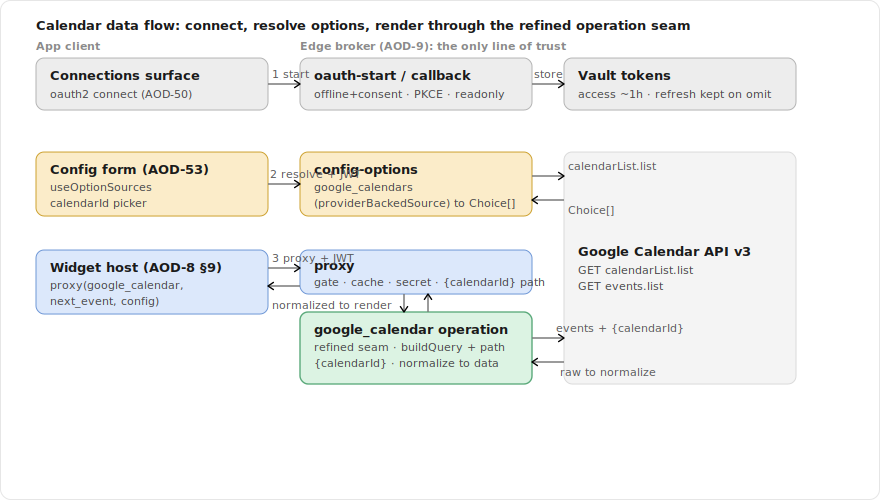
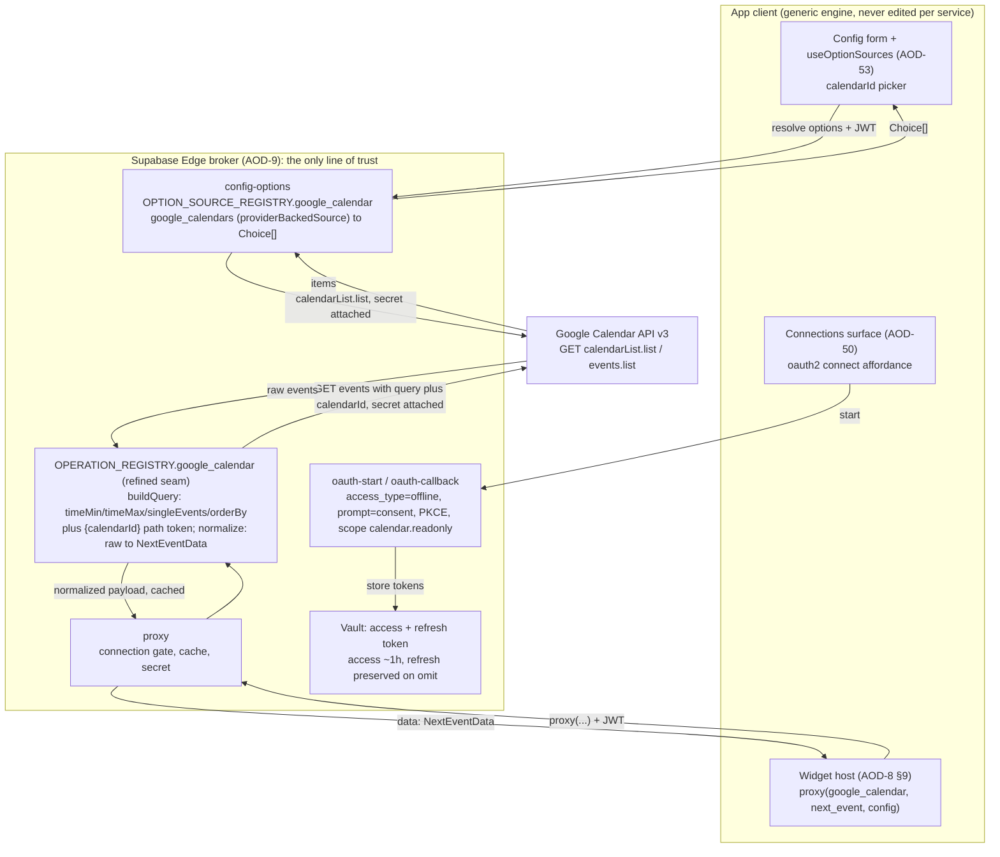
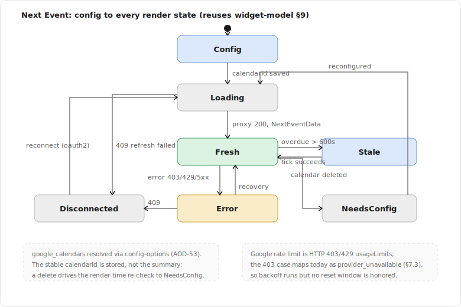

# Spec: Google Calendar Integration (Next Event, Today's Agenda)

> Status: draft for review, 2026-06-26. Tracked by [AOD-32](https://linear.app/thexap/issue/AOD-32) (`type:spec`). The **second per-integration spec**: it fills the same interior that [AOD-8](https://linear.app/thexap/issue/AOD-8) (registry seam), [AOD-9](https://linear.app/thexap/issue/AOD-9) (OAuth broker + proxy), and [AOD-10](https://linear.app/thexap/issue/AOD-10) (widget model) framed, now for a concrete **REST** service, and it consumes the generic remote-options engine ([AOD-53](https://linear.app/thexap/issue/AOD-53)) and the generic per-widget operation seam shipped in [AOD-55](https://linear.app/thexap/issue/AOD-55) (PR #10). It mirrors the structure [`integration-linear.md`](integration-linear.md) ([AOD-31](https://linear.app/thexap/issue/AOD-31)) established, section for section. It gates the I-M1 Calendar build, the **second proof** that the [AOD-55](https://linear.app/thexap/issue/AOD-55) operation seam generalizes beyond GraphQL.
>
> Two findings here touch a seam and confirm a shipped registry entry. (1) Calendar is a REST `GET` whose real query (`timeMin` / `timeMax`) is time-derived and whose calendar id sits in the URL **path**, so the [AOD-55](https://linear.app/thexap/issue/AOD-55) operation seam needs **one small generic refinement** (an optional `buildQuery` alongside the existing `buildBody`, and registry path-token substitution); it is additive and leaves Linear, the stub, and the other REST services backward compatible. (2) The shipped `google_calendar` registry entry's single scope `calendar.readonly` was verified to authorize **both** `events.list` and `calendarList.list`, so the calendar picker works on the entry as shipped, with no scope change. This **closes [AOD-9](https://linear.app/thexap/issue/AOD-9) §11's deferred Google item** (`access_type=offline` / `prompt=consent` and refresh-token behavior) with verified facts.

## 1. Purpose and scope

The platform is shipped: the registry seam ([AOD-8](https://linear.app/thexap/issue/AOD-8)), the OAuth broker and proxy ([AOD-9](https://linear.app/thexap/issue/AOD-9)), the widget model ([AOD-10](https://linear.app/thexap/issue/AOD-10)), the generic remote-options engine ([AOD-53](https://linear.app/thexap/issue/AOD-53)), and the generic per-widget operation seam ([AOD-55](https://linear.app/thexap/issue/AOD-55)) all exist, and Linear rode them end to end ([`integration-linear.md`](integration-linear.md)). Google Calendar is the **second real service** and the **first REST one**. This spec fixes how Calendar plugs into the seam so the later build is registration plus leaf renderers plus the one-time REST refinement, with zero edits to layout, host, settings, or broker internals.

It fixes exactly five things:

1. **Google OAuth specifics**: the scope (load-bearing for the picker), PKCE, `access_type=offline` / `prompt=consent`, token lifetime and refresh behavior, and the connect / reconnect hooks (verified against Google's docs, section 12).
2. **The two widgets and their data contracts**: "Next Event" and "Today's Agenda" ([AOD-4](https://linear.app/thexap/issue/AOD-4)). For each: the server-side `events.list` request, the raw Google response shape, and the **normalized payload** the renderer receives via the [AOD-8](https://linear.app/thexap/issue/AOD-8) §6.1 render contract `{ data, config, size }`.
3. **Per-instance config and option sources**: the `calendarId` field and the `google_calendars` option source that backs it, the **first** real consumer of the shipped `providerBackedSource` helper.
4. **The server-side operation seam, refined for REST**: where the per-widget query-builder and normalization slot into the proxy, introduced once as a small generic refinement of the [AOD-55](https://linear.app/thexap/issue/AOD-55) seam (an optional `buildQuery`; making `buildBody` optional; registry path-token substitution).
5. **Refresh and cache TTLs**, justified against Google Calendar's real quotas, and the one provider-error-mapping gap Google exposes.

**In scope:** the data contracts, config, the option source, OAuth specifics, TTLs, and the exact registry slotting (both halves) plus the one-time REST refinement that make Calendar a registration-only add.

**Out of scope (neighbors named so the frame is clear):**

- **The build** of the Calendar widgets, leaf renderers, option source, and operation modules is a separate I-M1 `type:tech-task` created after this spec lands, implementing it the [AOD-55](https://linear.app/thexap/issue/AOD-55) way. This spec is the design it implements.
- **The Claude / Clock / Weather integration specs** ([AOD-33](https://linear.app/thexap/issue/AOD-33) / [AOD-34](https://linear.app/thexap/issue/AOD-34) and Weather). Calendar reuses Linear's template and proves the REST path; it does not author them. Weather, the other REST service, rides the same `buildQuery` / path-token refinement by registration once it lands here.
- **The Calendar widget visual design** ([AOD-35](https://linear.app/thexap/issue/AOD-35)). This spec fixes the normalized data the renderer receives, including that the agenda renderer scopes "today" against the device clock; it does not fix how the cards look.
- **The onboarding / connect flow** ([AOD-26](https://linear.app/thexap/issue/AOD-26)) and the **connections surface** ([AOD-50](https://linear.app/thexap/issue/AOD-50)). Referenced as the hooks Calendar connect rides, not redefined.
- **Broker mechanics** (token exchange, refresh, encryption, the proxy itself, the typed error result) are [AOD-9](https://linear.app/thexap/issue/AOD-9)'s and the widget model (lifecycle, the refresh clamp, validation) is [AOD-10](https://linear.app/thexap/issue/AOD-10)'s. Referenced, not redefined.
- **Kiosk and entitlement** concerns ([AOD-11](https://linear.app/thexap/issue/AOD-11) / [AOD-12](https://linear.app/thexap/issue/AOD-12)). The TTLs here are inputs to those levers, not decisions about them.

Every API shape below is verified against Google Calendar API v3 and Google's OAuth documentation on **2026-06-26**, and cited in section 12. No live Google connection was used; the build verifies live and updates section 12 if anything differs. Nothing is invented.

## 2. Locked context this builds on

| Source | What it locks | How this spec uses it |
|---|---|---|
| [AOD-8](https://linear.app/thexap/issue/AOD-8) §5.2 | The server half (`ServiceBackendConfig`) and the endpoint allow-list. | Section 8 shows the `endpoints` entries (`next_event` / `agenda`, both the `events.list` path template). |
| [AOD-8](https://linear.app/thexap/issue/AOD-8) §6 / §6.1 | `WidgetDefinition` shape; the render contract `render(data, config, size)` invoked only with live, normalized data. | Section 4 fixes each widget's definition and the normalized `data` its renderer receives. |
| [AOD-8](https://linear.app/thexap/issue/AOD-8) §10 / §11 | The seam (generic engine never edited per service) and the "add a service by registration alone" proof. | Section 8 is the Calendar instance of §11, with the not-touched footprint table. |
| [AOD-9](https://linear.app/thexap/issue/AOD-9) §4 | Calendar is `oauth2`, one code path per credential class; the registry carries the per-provider params; Google needs `access_type=offline` / `prompt=consent` for a refresh token. | Section 3 fills and confirms the Google OAuth params against Google's docs. |
| [AOD-9](https://linear.app/thexap/issue/AOD-9) §7.1 / §9 | The OAuth connect flow and the proxy data path (connection gate, inline refresh, secret attach, normalize, cache, typed errors). | Sections 3.5 and 6 ride these; section 6 specifies the REST request-building and normalize steps. |
| [AOD-9](https://linear.app/thexap/issue/AOD-9) §8.2 / §11 | Conditional refresh + rotation handling; "Google's `access_type=offline` / `prompt=consent` requirements and refresh-token rotation behavior; each provider's revoke endpoint" deferred to wiring. | Section 3.4 closes the Google item with verified facts; the broker preserves the refresh token when Google omits it. |
| [AOD-10](https://linear.app/thexap/issue/AOD-10) §4.1 / §4.3 / §4.4 | The `remote-options` field kind; config-time resolution through the proxy; the needs-config integrity rule. | Section 5 instantiates `calendarId` (remote-options) and reuses the §4.4 re-check. |
| [AOD-10](https://linear.app/thexap/issue/AOD-10) §6 / §7 | The two-layer refresh model (`cacheTtlSeconds`, `minRefreshSeconds`, effective interval) and the lifecycle states. | Section 7 sets per-widget values; section 9 walks Next Event through every state. |
| [AOD-53](https://linear.app/thexap/issue/AOD-53) | The shipped remote-options engine: server `OPTION_SOURCE_REGISTRY` + `providerBackedSource`, the `config-options` Edge Function, the client `useOptionSources` resolver wired into `ConfigForm`, and the host render-time membership re-check. | Section 5 registers `google_calendars` as the **first** `providerBackedSource` resolver; the picker, validation, and re-check are reused with no new client code. |
| [AOD-55](https://linear.app/thexap/issue/AOD-55) | The shipped per-widget operation seam: server `OPERATION_REGISTRY` keyed by service + widget, `getOperation`, the proxy's `buildBody` + `normalize` lookup, and the generic provider-error mapping (including Linear's 400/`RATELIMITED`). | Section 6 refines this seam once for REST (optional `buildQuery`, optional `buildBody`, path tokens) and registers the two Calendar operations; section 7 reuses the error mapping and names the Google gap. |
| [AOD-4](https://linear.app/thexap/issue/AOD-4) | The v1 widget set (Done): **Next Event** (small/medium, ~10 min) and **Today's Agenda** (tall/wide, ~15 min) are both locked, "different roles and sizes, both day-one core". | Section 4 uses these exactly. |
| [AOD-6](https://linear.app/thexap/issue/AOD-6) | Google Calendar is in the v1 service set. | Calendar is the second service wired, after Linear. |
| [AOD-5](https://linear.app/thexap/issue/AOD-5) | Privacy posture: the proxy cache holds normalized data only, per-user, encrypted, TTL ≤ 900s, purged on disconnect/delete. | Section 6 normalizes before caching (no raw Google shape stored); section 7 keeps every TTL under 900s. |

The shipped server registry already carries the Calendar backend. The current entry, verbatim from `supabase/functions/_shared/registry.ts`:

```typescript
google_calendar: {
  id: "google_calendar",
  authClass: "oauth2",
  oauth: {
    authorizeUrl: "https://accounts.google.com/o/oauth2/v2/auth",
    tokenUrl: "https://oauth2.googleapis.com/token",
    revokeUrl: "https://oauth2.googleapis.com/revoke",
    defaultScopes: ["https://www.googleapis.com/auth/calendar.readonly"],
    supportsPkce: true,
    // Required for Google to reliably return a refresh token (AOD-9 §4).
    extraAuthorizeParams: { access_type: "offline", prompt: "consent" },
  },
  apiBase: "https://www.googleapis.com",
  authHeaderStyle: "bearer",
  endpoints: {
    upcoming_events: { method: "GET", path: "/calendar/v3/calendars/primary/events" },
  },
},
```

Every OAuth field here was verified correct against Google's documentation on 2026-06-26 (section 3, section 12). The `upcoming_events` / `primary` entry is a **pre-registration placeholder**: this spec replaces it with the two real widget keys (`next_event`, `agenda`) on a **path-templated** `events.list` path so the chosen calendar is honored (section 6, section 8). It also adds the `google_calendars` option source and the operation modules; it changes none of the OAuth block.

## 3. Google OAuth specifics

### 3.1 The flow

Google Calendar is a standard `oauth2` authorization-code service. It rides the [AOD-9](https://linear.app/thexap/issue/AOD-9) §7.1 connect path with no new broker code: `oauth-start` builds the authorize URL from the registry entry above (the generic builder appends `access_type=offline` and `prompt=consent` from `extraAuthorizeParams`, `providers.ts` `buildAuthorizeUrl`), the user approves in a system browser, `oauth-callback` exchanges the code server-side with the Google client secret, stores the tokens in Vault, and writes the `connections` row (`status=connected`, `expires_at` from `expires_in`, the Google account email as `account_label` for display).

The per-provider client secret is resolved by `oauthClientCreds("google_calendar")`, which derives the env-var name from the service id, so the secret is **`GOOGLE_CALENDAR_CLIENT_SECRET`** (and `GOOGLE_CALENDAR_CLIENT_ID`), not the shorter `GOOGLE_CLIENT_SECRET` that [AOD-9](https://linear.app/thexap/issue/AOD-9) §6's table uses illustratively. Section 10 names that one-line documentation reconciliation; the code is already correct.

### 3.2 Scope (load-bearing for the picker)

The widgets are read-only and the picker enumerates the user's calendars, so the scope must grant **both** event reads and calendar-list reads. Verified against each method's Authorization list on 2026-06-26:

| Scope | Authorizes `events.list`? | Authorizes `calendarList.list`? | Use here |
|---|---|---|---|
| `https://www.googleapis.com/auth/calendar.readonly` | **Yes** | **Yes** | **The shipped scope. Sufficient for both widgets and the picker.** |
| `https://www.googleapis.com/auth/calendar.events.readonly` | Yes | **No** | Would read events but break the `google_calendars` picker. Not requested. |
| `https://www.googleapis.com/auth/calendar.calendarlist.readonly` | No | Yes | Lists calendars only; would not read events. Not requested. |

A single `calendar.readonly` is the only scope that authorizes the whole integration on its own, which is why the registry requests exactly it. The narrower `calendar.events.readonly` is tempting for least-privilege but does **not** authorize `calendarList.list`, so the calendar picker (section 5) would fail under it. The shipped `defaultScopes: ["calendar.readonly"]` is correct and sufficient; no change. This is Calendar's load-bearing OAuth fact, the analogue of Linear's `actor=user` ([`integration-linear.md`](integration-linear.md) §3.2): get the scope wrong and a widget breaks.

### 3.3 PKCE and the offline / consent params

- **PKCE.** Google supports PKCE (`code_challenge` with `code_challenge_method` `S256`, verified). The registry's `supportsPkce: true` is correct; `oauth-start` adds the challenge while `oauth-callback` sends the verifier, per the generic [AOD-9](https://linear.app/thexap/issue/AOD-9) flow.
- **`access_type=offline` + `prompt=consent`.** Google returns a refresh token only when the authorize request carries `access_type=offline`, and it reliably re-issues one on every authorization (rather than only the first) when `prompt=consent` is also present. Both are in the registry's `extraAuthorizeParams` and emitted by the generic authorize builder. Verified against Google's OAuth docs (section 12). This is exactly the [AOD-9](https://linear.app/thexap/issue/AOD-9) §4 requirement, now confirmed.

### 3.4 Token lifetime and refresh (closes AOD-9 §11's Google item; confirms §4)

[AOD-9](https://linear.app/thexap/issue/AOD-9) §11 deferred "Google's `access_type=offline` / `prompt=consent` requirements and refresh-token rotation behavior; each provider's revoke endpoint" to wiring. Verified against Google's OAuth docs on 2026-06-26:

- **The access token is short-lived, about one hour** (the token response carries `expires_in`, typically 3599). The broker sets `connections.expires_at` from `expires_in`, so the [AOD-9](https://linear.app/thexap/issue/AOD-9) §8.2 scheduled refresh and §8.3 inline refresh both apply with no code change.
- **Google issues a long-lived refresh token** for the offline authorization-code flow, and on a refresh it returns a **new access token but usually no new refresh token**. The broker handles exactly this: it rotates the refresh secret only when the response carries one and otherwise **preserves the existing refresh token** (`refresh.ts`: `if (token.refresh_token) { update_secret(...) }`, [AOD-9](https://linear.app/thexap/issue/AOD-9) §8.2). So Google's "access token only on refresh" case is already correct; no rotation bug.
- **A revoked or expired refresh token surfaces as `invalid_grant`** at refresh, which the broker maps to `reauth_required`, which the proxy serves as `409 needs_reconnect`, which the host renders as the reconnect prompt (section 9, state Disconnected).
- **Operational caveat (named, not a code change).** Google expires the refresh token after **7 days** while the OAuth consent screen's publishing status is **"Testing"**. During development expect a weekly reconnect; before launch the consent screen must be moved to **Production** (and verified for the `calendar.readonly` sensitive scope) so refresh tokens are durable. Section 10 records this as an operational seam.

The revoke endpoint `https://oauth2.googleapis.com/revoke` in the registry is Google's documented revocation endpoint (section 12); the best-effort revoke on disconnect ([AOD-9](https://linear.app/thexap/issue/AOD-9) §10) uses it unchanged. This confirms [AOD-9](https://linear.app/thexap/issue/AOD-9) §4: Google is a refreshing `oauth2` service with a roughly one-hour access token, exactly as the model already assumed.

### 3.5 Connect and reconnect hooks

Calendar connect is the ordinary `oauth2` affordance on the connections surface ([AOD-50](https://linear.app/thexap/issue/AOD-50)) reached from onboarding ([AOD-26](https://linear.app/thexap/issue/AOD-26)); this spec adds no connect UI. Reconnect is the generic [AOD-10](https://linear.app/thexap/issue/AOD-10) §7.2 path: a dead credential yields `409 needs_reconnect` from the proxy, the host shows "Reconnect Google Calendar", and the user re-runs the same connect flow. Disconnect removes the Calendar widgets from every layout ([AOD-8](https://linear.app/thexap/issue/AOD-8) invariant 3). None of this is Calendar-specific.

## 4. The widgets and their data contracts

Both widgets are locked by [AOD-4](https://linear.app/thexap/issue/AOD-4). The render contract is [AOD-8](https://linear.app/thexap/issue/AOD-8) §6.1: the leaf renderer is invoked only with live, normalized `data` (plus `config` and `size`); the host draws every other state. The proxy returns that normalized `data`; **section 6 specifies where the raw-to-normalized mapping runs** (server-side, in the operation module).

Both widgets read the same `events.list` endpoint, exactly as Linear's two widgets both read `POST /graphql`. They differ only in their operation (the query the operation builds and the payload it normalizes). The shared normalized event the renderers receive:

```typescript
interface CalendarEvent {
  id: string;            // Google event id
  summary: string;       // event title; "" when Google omits it (an untitled event)
  location: string | null; // free-form text or null
  start: string;         // ISO: the dateTime (timed) or the date "YYYY-MM-DD" (all-day)
  end: string;           // ISO: the dateTime or the date
  allDay: boolean;       // true when Google used start.date (no dateTime)
  htmlLink: string;      // deep link into the Google Calendar web UI
}
```

`allDay` is derived from the shape Google returns: a timed event populates `start.dateTime` (RFC3339); an all-day event populates `start.date` (`YYYY-MM-DD`) only (verified, section 12). The normalized `start` / `end` carry whichever was present, as an absolute string, so the renderer can format relative times against the **device clock** without another fetch.

### 4.1 Next Event (the most glanceable card)

The single current-or-next event on a chosen calendar. Default size `small` (of `small` / `medium`), device cadence around 10 minutes ([AOD-4](https://linear.app/thexap/issue/AOD-4)).

**Server-side request** (built by the operation, section 6; the client never supplies query params):

```
GET /calendar/v3/calendars/{calendarId}/events
    ?timeMin={now, RFC3339}
    &singleEvents=true
    &orderBy=startTime
    &maxResults=1
```

`timeMin` is Google's **lower bound (exclusive) on an event's end time** (verified, section 12), so an event already in progress (its end is still in the future) is included and, ordered by start time, sorts first. `maxResults=1` therefore returns the **current-or-next** event. `singleEvents=true` expands recurring series into concrete instances and is required for `orderBy=startTime`.

**Raw response** is the `events.list` body `{ kind, summary, timeZone, items: [...], nextPageToken }`; `items[0]` is the event (or the array is empty). **Normalized payload:**

```typescript
type NextEventData =
  | { hasEvent: false }                       // nothing upcoming; renderer shows "Nothing next"
  | { hasEvent: true; event: CalendarEvent };
```

`hasEvent: false` is a normal data-bearing state (an empty calendar window), not an error or needs-config, the same modeling move as Linear's `CurrentCycleData` `active: false`.

**Client-half definition** (the [AOD-10](https://linear.app/thexap/issue/AOD-10) model values filled in):

```typescript
const nextEvent: WidgetDefinition = {
  type: "next_event",
  serviceId: "google_calendar",
  title: "Next Event",
  supportedSizes: ["small", "medium"],
  defaultRefresh: { seconds: 600 },   // device asks every 10 min (AOD-4, AOD-10 §6.2)
  cacheTtlSeconds: 300,               // provider hit at most once per 5 min across devices (AOD-10 §6.1)
  minRefreshSeconds: 120,             // never poll Google faster than once every 2 min
  dimsWithAmbient: true,
  configSchema: { fields: [ /* calendarId, section 5.1 */ ] },
  render: NextEventCard,              // leaf component; receives { data: NextEventData, config, size }
};
```

### 4.2 Today's Agenda

The chosen calendar's events for the rest of today. Default size `tall` (of `tall` / `wide`), device cadence around 15 minutes ([AOD-4](https://linear.app/thexap/issue/AOD-4)).

**Server-side request:**

```
GET /calendar/v3/calendars/{calendarId}/events
    ?timeMin={now, RFC3339}
    &timeMax={now + ~36h, RFC3339}
    &singleEvents=true
    &orderBy=startTime
    &maxResults=10
```

The `timeMax` is a **coarse server-side bound** (a fixed look-ahead, no timezone math) that keeps a sparse calendar from returning events days away. The precise "today" boundary is a **render concern**: the agenda renderer keeps the events whose start falls on the current device-local day, using the device clock and timezone ([AOD-35](https://linear.app/thexap/issue/AOD-35)). This deliberately keeps timezone handling on the client where the clock lives, so the server stays timezone-free, the cache key stays stable (section 6.1), and the widget host is not edited to thread a timezone through the proxy. A configurable horizon and a precise server-side end-of-day (using an explicit IANA timezone param) are named seams (section 10), not a v1 need.

**Raw response** is the same `events.list` body; `items` is the event list (possibly empty). **Normalized payload:**

```typescript
interface AgendaData {
  events: CalendarEvent[];   // upcoming events in the window, start-ascending, capped at maxResults
}
```

An empty `events` array is the normal "nothing left today" state; the renderer shows an empty agenda, never an error.

**Client-half definition:**

```typescript
const agenda: WidgetDefinition = {
  type: "agenda",
  serviceId: "google_calendar",
  title: "Today's Agenda",
  supportedSizes: ["tall", "wide"],
  defaultRefresh: { seconds: 900 },   // device asks every 15 min (AOD-4)
  cacheTtlSeconds: 600,               // provider hit at most once per 10 min across devices
  minRefreshSeconds: 300,
  dimsWithAmbient: true,
  configSchema: { fields: [ /* calendarId, section 5.2 */ ] },
  render: AgendaCard,                 // receives { data: AgendaData, config, size }
};
```

## 5. Per-instance config and option sources

The config field uses the [AOD-10](https://linear.app/thexap/issue/AOD-10) §4.1 `remote-options` kind exactly. It resolves through the shipped [AOD-53](https://linear.app/thexap/issue/AOD-53) engine: the client `useOptionSources` hook calls the `config-options` Edge Function, which invokes the allow-listed server-side resolver. This spec adds the one Calendar resolver; the picker, validation, and host re-check are reused with no new client code.

### 5.1 Next Event config schema

```typescript
configSchema: {
  fields: [
    // remote-options: the user's real Google calendars, resolved at config time (AOD-10 §4.3)
    { key: "calendarId", label: "Calendar", kind: "remote-options", required: true,
      source: { optionSource: "google_calendars" } },
  ],
}
```

The stored `calendarId` value is the **stable Google calendar id** (the calendar's address, e.g. the user's email for the primary calendar), not the display summary, so renaming a calendar does not invalidate the instance ([AOD-10](https://linear.app/thexap/issue/AOD-10) §4.3 step 4). `calendarId` is `required`, mirroring Linear's `projectId`; defaulting to the primary calendar for a zero-config add is a named seam (section 10).

### 5.2 Today's Agenda config schema

```typescript
configSchema: {
  fields: [
    { key: "calendarId", label: "Calendar", kind: "remote-options", required: true,
      source: { optionSource: "google_calendars" } },
  ],
}
```

Identical to Next Event: the only per-instance choice is which calendar. The agenda window is fixed server-side (section 4.2); exposing a horizon or `maxResults` as config is a named seam.

### 5.3 The `google_calendars` option source (first user of `providerBackedSource`)

Unlike Linear (whose GraphQL option sources needed the direct-resolver form because the request needs a body, not URL query params), Calendar's calendar list is a plain REST `GET` with no params and no body. So it is the **first real consumer of the shipped `providerBackedSource(endpoint, toChoices)` helper**, validating the helper that Linear could not use ([`integration-linear.md`](integration-linear.md) §5.3 note):

```typescript
// option-sources.ts: registered under OPTION_SOURCE_REGISTRY.google_calendar. The client names only the
// optionSource id "google_calendars"; the endpoint and the mapping live here, server-side.
const google_calendars: OptionSourceResolver = providerBackedSource(
  { method: "GET", path: "/calendar/v3/users/me/calendarList" },
  calendarListToChoices,
);

/** Map a calendarList.list response to Choice[] with the stable calendar id as the value, primary first. */
function calendarListToChoices(raw: unknown): Choice[] {
  const items = (raw as { items?: unknown })?.items;
  if (!Array.isArray(items)) return [];
  return items
    .filter((c): c is { id: string; summary?: string; summaryOverride?: string; primary?: boolean } =>
      typeof (c as { id?: unknown })?.id === "string")
    // primary calendar first, then alphabetical by display name
    .sort((a, b) => (b.primary === true ? 1 : 0) - (a.primary === true ? 1 : 0) ||
      (a.summaryOverride ?? a.summary ?? a.id).localeCompare(b.summaryOverride ?? b.summary ?? b.id))
    .map((c) => ({ value: c.id, label: c.summaryOverride ?? c.summary ?? c.id })); // user's custom name, else the calendar name
}
```

Notes:

- `providerBackedSource` calls `ctx.callProvider(endpoint, { query: ctx.params, body: undefined })`; for `calendarList.list` `ctx.params` is empty, so it is a clean `GET`. The helper attaches the user's secret, maps typed errors, and returns the raw JSON, exactly as designed.
- The label prefers `summaryOverride` (the user's custom calendar name) over `summary` (the default name), falling back to the id; the value is always the stable `id` ([AOD-53](https://linear.app/thexap/issue/AOD-53) stores the value).
- The `calendarList.list` endpoint is supplied directly by the resolver and is **not** in the registry's `endpoints` map, consistent with how Linear's option sources supply their own endpoint (the `endpoints` map is the widget-data allow-list; option sources carry their own allow-listed endpoint).

### 5.4 Membership integrity over time

`calendarId` inherits the [AOD-10](https://linear.app/thexap/issue/AOD-10) §4.4 rule with no Calendar-specific code. If a chosen calendar is later deleted or unshared, the stored value no longer resolves against the re-fetched option set, and the host's render-time re-check (the shipped `WidgetHost` feeding `useOptionSources` results into `validateConfig`, [AOD-53](https://linear.app/thexap/issue/AOD-53)) drives the instance to `needs_config` ("Reconfigure this widget"), not a silent empty card. An unresolved option set during a provider outage is treated as `unverified` and a still-valid selection survives, exactly as [AOD-10](https://linear.app/thexap/issue/AOD-10) §4.2 specifies.

## 6. The server-side operation seam, refined for REST

This is the one new generic mechanism Calendar requires. It is small, additive, backward compatible, and a direct refinement of the [AOD-55](https://linear.app/thexap/issue/AOD-55) seam. Where Linear introduced `{ buildBody, normalize }` for a GraphQL `POST`, Calendar needs the REST equivalents.

### 6.1 Why a refinement is needed

The shipped operation seam ([AOD-55](https://linear.app/thexap/issue/AOD-55), `operations.ts`) gives an operation two hooks: `buildBody(params)` (the provider request **body**) and `normalize(raw)`. The proxy already builds the body from the operation and passes the merged config/params through as the **URL query**:

```typescript
// proxy/handler.ts today (AOD-55):
const op = getOperation(body.service, body.widget);
const query = { ...(conn.config ?? {}), ...(body.params ?? {}) }; // pass-through URL query
const callBody = op ? op.buildBody(body.params ?? {}) : body.params;
const result = await callProviderApi(backend, endpoint, { secret, query, body: callBody });
const payload = op ? op.normalize(result.json) : result.json;
```

Two facts about Calendar make this incomplete:

1. **The query is time-derived and must be built server-side, not passed through.** Calendar's real query is `timeMin = now`, `timeMax = now + horizon`, `singleEvents`, `orderBy`, `maxResults`. If `timeMin` were a client-supplied param it would **change on every poll and bust the cache key** (the proxy hashes `body.params`), hammering the provider and defeating the TTL; if it were static config it could never be "now". It has to be computed at call time **inside the operation**, the same place the GraphQL body is built. There is no hook for that today: `buildBody` builds a body, and the query is a blind pass-through.
2. **The calendar id sits in the URL path.** Google's `events.list` path is `/calendar/v3/calendars/{calendarId}/events`; the calendar id is a path segment, not a query param (passing `?calendarId=...` is ignored). The shipped placeholder hard-codes `primary`. Honoring the chosen calendar means substituting the id into the allow-listed path.

Both are the REST mirror of what Linear needed: the operation must own the **request shape** (query, and the path slot), not just a POST body. So they fold into one small refinement.

### 6.2 The operation module (REST form)

The Calendar operations register under the existing `OPERATION_REGISTRY`, keyed by service id and widget type, with a `buildQuery` (and no `buildBody`, since a `GET` carries no body) plus a `normalize`:

```typescript
// operations.ts: OPERATION_REGISTRY.google_calendar (NEW entries; server-side only).
const EVENTS_BASE = { singleEvents: true, orderBy: "startTime" } as const; // orderBy=startTime needs singleEvents
const AGENDA_HORIZON_MS = 36 * 60 * 60 * 1000; // coarse server bound; the renderer scopes "today" (4.2)

function buildNextEventQuery(_params: Record<string, unknown>): Record<string, unknown> {
  return { ...EVENTS_BASE, timeMin: new Date().toISOString(), maxResults: 1 };
}
function buildAgendaQuery(_params: Record<string, unknown>): Record<string, unknown> {
  const now = new Date();
  return { ...EVENTS_BASE, timeMin: now.toISOString(),
    timeMax: new Date(now.getTime() + AGENDA_HORIZON_MS).toISOString(), maxResults: 10 };
}

// normalize maps the events.list body to the section 4 payloads; defensive against a missing items array.
function normalizeNextEvent(raw: unknown): NextEventData { /* items[0] -> CalendarEvent, else hasEvent:false */ }
function normalizeAgenda(raw: unknown): AgendaData       { /* items -> CalendarEvent[] */ }

OPERATION_REGISTRY.google_calendar = {
  next_event: { buildQuery: buildNextEventQuery, normalize: normalizeNextEvent },
  agenda:     { buildQuery: buildAgendaQuery,    normalize: normalizeAgenda },
};
```

`buildQuery` reads `now` at call time and returns only the query params; the **`calendarId` is not in the query** (it is a path token, section 6.3). These functions are the only Calendar-specific data code; they are registration, not engine edits. They normalize before the proxy caches, so the cache stores small clean payloads ([AOD-5](https://linear.app/thexap/issue/AOD-5)), exactly as Linear's do.

The cache-key property that makes `buildQuery` correct: the proxy hashes `body.params` (here `{ calendarId }`, stable), while `timeMin` / `timeMax` are derived inside `buildQuery` and never enter the key. Within a TTL every device is served the same cached normalized payload; on a miss `buildQuery` recomputes a fresh `now`. The renderer counts down from the absolute ISO times against the device clock, so a cache hit still shows correct relative times.

### 6.3 The one-time generic refinement

Three coordinated, additive edits, all backward compatible. Services with no operation (the stub) and operations without the new hooks (Linear) behave exactly as before.

**(a) The `WidgetOperation` interface gains the REST half** (`operations.ts`):

```typescript
export interface WidgetOperation {
  buildBody?(params: Record<string, unknown>): unknown;            // was required; now OPTIONAL (GraphQL POST body)
  buildQuery?(params: Record<string, unknown>): Record<string, unknown>; // NEW, OPTIONAL (REST URL query)
  normalize(raw: unknown): unknown;                                // unchanged, still required
}
```

Linear's operations keep their `buildBody`; Calendar's provide `buildQuery`. Making `buildBody` optional is the only change to existing types and breaks nothing (every Linear op still satisfies it).

**(b) The proxy gains one conditional** next to the existing `buildBody` line (`proxy/handler.ts`):

```typescript
const op = getOperation(body.service, body.widget);
const params = body.params ?? {};
const callBody  = op?.buildBody  ? op.buildBody(params)  : params;                       // Linear: GraphQL body
const callQuery = op?.buildQuery ? op.buildQuery(params) : { ...(conn.config ?? {}), ...params }; // Calendar: built query; else pass-through
const result = await callProviderApi(backend, endpoint, { secret, query: callQuery, body: callBody, pathParams: params });
```

Linear (no `buildQuery`) and the platform-key services (no operation) fall to the existing pass-through query, so their behavior is unchanged.

**(c) `callProviderApi` substitutes path tokens** from the instance params, URL-encoded (`providers.ts`):

```typescript
function applyPathParams(path: string, pathParams: Record<string, unknown>): string {
  return path.replace(/\{(\w+)\}/g, (_, key) => {
    const v = pathParams[key];
    if (v == null) throw new HttpError(400, "missing_path_param", `path token {${key}} has no value`);
    return encodeURIComponent(String(v)); // encodeURIComponent keeps the id inside its path segment
  });
}
// ...inside callProviderApi:
const url = new URL(backend.apiBase + applyPathParams(endpoint.path, opts.pathParams ?? {}));
```

A path with no `{token}` is returned unchanged, so Linear, Weather, the stub, and the Anthropic endpoints are untouched. The registry path template stays the **authoritative allow-list**: only declared `{token}` slots are filled, and `encodeURIComponent` keeps a hostile `calendarId` inside its path segment (no traversal, no query injection), preserving the [AOD-9](https://linear.app/thexap/issue/AOD-9) goal-5 allow-list.

This is the [AOD-55](https://linear.app/thexap/issue/AOD-55) pattern repeated for REST: AOD-55 introduced one generic data-time operation lookup plus the `buildBody`/`normalize` hooks; this adds the REST hooks (`buildQuery`, path tokens) to the same lookup. After it lands once, Calendar and Weather add operation modules by registration alone.

### 6.4 Why server-side, not in the leaf renderer

Normalization and request-building run in the proxy, not the client card, for the same four reasons Linear gives ([`integration-linear.md`](integration-linear.md) §6.4): [AOD-8](https://linear.app/thexap/issue/AOD-8) §6.1 defines `data` as the normalized payload from the proxy; the proxy cache then stores small normalized payloads, not raw Google bodies, so the [AOD-5](https://linear.app/thexap/issue/AOD-5) "normalized data only" rule holds literally; the query, the path, and the response shape stay entirely in the server half ([AOD-8](https://linear.app/thexap/issue/AOD-8) §4 trust boundary); and it mirrors the option-source resolver, which already maps a raw provider response to `Choice[]` server-side. The one thing intentionally left to the client is the **"today" boundary** of the agenda (section 4.2): it depends on the device clock and timezone, which live on the device, so the renderer applies it.

## 7. Refresh and cache versus Google's real limits

### 7.1 Verified quotas (2026-06-26)

Google Calendar API v3 quotas, from Google's documentation:

| Limit | Value |
|---|---|
| Per minute per project | **10,000 requests** |
| Per minute per user per project | **600 requests** |
| Daily (billing threshold per project) | **1,000,000 requests/day** (free under this) |

Rate-limit responses are **HTTP 403 or 429** with a `usageLimits` reason (`rateLimitExceeded` / `userRateLimitExceeded`); Google recommends exponential backoff.

### 7.2 The per-widget TTLs

| Widget | `defaultRefresh` | `cacheTtlSeconds` | `minRefreshSeconds` | Rationale |
|---|---|---|---|---|
| Next Event | 600s | 300s | 120s | [AOD-4](https://linear.app/thexap/issue/AOD-4)'s ~10 min. The most glanceable single card; the device counts down from absolute times between fetches. |
| Today's Agenda | 900s | 600s | 300s | [AOD-4](https://linear.app/thexap/issue/AOD-4)'s ~15 min. Today's list moves slowly, so a slower provider cadence is correct. |

The [AOD-10](https://linear.app/thexap/issue/AOD-10) §6.1 cache TTL is the provider-protection floor: within one TTL every device and instance for the same `(user, service, widget, params)` is served from cache, so the provider is hit at most once per TTL. Headroom against Google's limits:

- One Next Event instance at `cacheTtl=300s` is at most 12 provider calls/hour; one Today's Agenda instance at `cacheTtl=600s` is at most 6/hour. The `config-options` resolver (the calendar picker) caches on a 300s TTL and only runs while a config form is open.
- Even a heavy user with several instances across several devices lands in the low tens of calls/minute at the absolute worst (a cold burst), far under the **600 requests/minute/user** ceiling, and the per-user cache coalesces devices so steady-state is a handful per hour. Across all users the per-project **10,000/min** and **1,000,000/day** ceilings scale with active users, each contributing only a few cached fetches, so cost is never the binding constraint.

Every TTL is under the [AOD-5](https://linear.app/thexap/issue/AOD-5) 900s cache ceiling and above the [AOD-10](https://linear.app/thexap/issue/AOD-10) §6.1 15s provider floor. As with Linear, the cadence is set by glanceable freshness, not by the API budget.

### 7.3 The 403 `usageLimits` mapping gap (a named seam)

The shipped error mapping (`providerErrorResponse` / `isRateLimited` in `providers.ts`, [AOD-55](https://linear.app/thexap/issue/AOD-55)) already maps **HTTP 429 → `rate_limited`** and detects Linear's **HTTP 400 + `RATELIMITED`**, with any other non-2xx → `upstream_unavailable`. So Google's **429** rate-limit path already works. The gap is Google's **403** path: a `403` carrying a `usageLimits` reason is a rate limit, but today it maps to `upstream_unavailable` (`provider_unavailable`): the host still backs off ([AOD-10](https://linear.app/thexap/issue/AOD-10) §6.4), but it treats a quota bounce as a generic outage.

Given the headroom in 7.2 this is unlikely to fire, but the mapping should be correct. The fix is the same shape as the shipped Linear detector: extend `isRateLimited` to also return true when `result.status === 403` and the Google error body carries a `usageLimits` domain or a `rateLimitExceeded` / `userRateLimitExceeded` reason (`error.errors[].reason`). The check stays on the **signal** (status + body code), not on the service id, so it remains generic. This is named as a seam (section 10), a one-line refinement to the generic mapper, not Calendar-specific branching in the proxy flow.

A second, smaller gap is shared with Linear and named, not built: a `401` on the **data** call (a token revoked at Google before its local expiry) maps to `upstream_unavailable` today rather than `reauth_required`; the inline refresh ([AOD-9](https://linear.app/thexap/issue/AOD-9) §8.3) covers the expired-token case, so this only affects mid-life revocation.

## 8. Registry slotting: the seam holds

Adding Calendar is registration in both halves plus the two leaf renderers and the two operation modules. The only engine edits are the one-time REST refinement in section 6.3 (counted once, generic, shared with Weather and any future REST service), not per-service edits.

**Client half** (`apps/app/src/registry/services/google_calendar/`, new):

```typescript
export const googleCalendarService: ServiceDefinition = {
  id: "google_calendar",
  displayName: "Google Calendar",
  icon: "google-calendar",
  authClass: "oauth2",
  widgets: [nextEvent, agenda],   // sections 4.1, 4.2
};
```

plus `NextEventCard` and `AgendaCard` leaf components, and one registration line in the client registry index.

**Server half** (registration in existing files):

```typescript
// registry.ts: BACKEND_REGISTRY.google_calendar.endpoints replaces the `upcoming_events`/`primary` placeholder
endpoints: {
  next_event: { method: "GET", path: "/calendar/v3/calendars/{calendarId}/events" },
  agenda:     { method: "GET", path: "/calendar/v3/calendars/{calendarId}/events" },
},

// option-sources.ts: OPTION_SOURCE_REGISTRY gains the google_calendar entry
google_calendar: { google_calendars },   // section 5.3

// operations.ts (registration): OPERATION_REGISTRY.google_calendar (section 6.2)
google_calendar: { next_event: {...}, agenda: {...} },
```

The footprint, in the [AOD-8](https://linear.app/thexap/issue/AOD-8) §11 style:

| File / module | Added, edited, or untouched | Why |
|---|---|---|
| `registry/services/google_calendar/*` (definition, 2 renderers) | Added | The new service, self-contained. |
| `_shared/operations.ts` (`OPERATION_REGISTRY.google_calendar`) | Added | The two REST operations: `buildQuery` + `normalize` (sections 4, 6.2). |
| `_shared/operations.ts` (`WidgetOperation` interface) | Edited: **once, generic** | `buildBody` optional + `buildQuery` added; serves every REST/normalized service (section 6.3a). |
| `proxy/handler.ts` (`buildQuery` + `pathParams`) | Edited: **once, generic** | One conditional plus the path-token pass; serves every REST service (section 6.3b). |
| `_shared/providers.ts` (`applyPathParams`; 403 `usageLimits` detector) | Edited: **once, generic** | Path-token substitution and the rate-limit-detector refinement (sections 6.3c, 7.3). |
| `_shared/registry.ts` (`endpoints`) | Edited: replace placeholder, +path template | The declared allow-list extension point. |
| `_shared/option-sources.ts` (`OPTION_SOURCE_REGISTRY.google_calendar`) | Edited: +1 entry | The declared option-source extension point ([AOD-53](https://linear.app/thexap/issue/AOD-53)). |
| client registry index | Edited: +1 line | The declared client extension point. |
| Layout engine (AOD-7) | Untouched | Calendar instances are ordinary rects. |
| Widget host / dashboard renderer | Untouched | Resolves via the registry and mounts `render`; never names Calendar. The agenda's "today" scoping is inside the leaf renderer, not the host. |
| Settings / connect UI | Untouched | Calendar is `oauth2`; the existing affordance covers it. |
| Config form + `useOptionSources` | Untouched | Renders `calendarId` generically; the resolver is server-side registration ([AOD-53](https://linear.app/thexap/issue/AOD-53)). |
| OAuth broker (`oauth-start` / `oauth-callback` / `token-refresh`) | Untouched | Calendar is `oauth2`, an existing code path; `offline`/`consent` are already registry data. |

Calendar reuses the existing `oauth2` class, so the broker gains no code. The generic edits are the one-time REST refinement, which serves Weather and every future REST service. The seam holds.



<details>
<summary>Mermaid source</summary>



</details>

## 9. Worked path: Next Event config to lifecycle

### 9.1 Config

Google Calendar is connected ([AOD-8](https://linear.app/thexap/issue/AOD-8) invariant 2), so Next Event is addable. The config form renders `calendarId` (remote-options). `useOptionSources` calls `config-options` with `{ service: "google_calendar", optionSource: "google_calendars" }`; the resolver attaches the user's token server-side, runs `calendarList.list`, and returns `Choice[]` (primary first). The user picks a calendar; the stable `calendarId` is stored. `validateConfig` passes (`calendarId` present and a member of the resolved set). The instance persists `config = { calendarId }`.

### 9.2 Every lifecycle state

This reuses the [AOD-10](https://linear.app/thexap/issue/AOD-10) §9 worked example, now with the concrete data contract from section 4.1. The states (loading, fresh, stale, error, disconnected, plus the needs-config edge) and their host-versus-renderer responsibilities are as the model walks them; the only Calendar specifics are that the `fresh` payload is `NextEventData`, an `error` from a Google quota bounce arrives as `provider_unavailable` when it is the 403 path (section 7.3) and as `rate_limited` when it is the 429 path, and `disconnected` is the refresh-token failure path (section 3.4, including the 7-day Testing-mode expiry).

```mermaid
stateDiagram-v2
    [*] --> Config: add widget (Calendar connected)
    Config --> Loading: calendarId saved
    Loading --> Fresh: proxy 200, NextEventData
    Loading --> Disconnected: 409 needs_reconnect (refresh failed)
    Fresh --> Fresh: 600s tick, cache or provider
    Fresh --> Stale: refresh overdue (fetchedAt > 600s)
    Fresh --> Error: provider error (Google 403/429/5xx -> provider_unavailable; backoff)
    Stale --> Fresh: later tick succeeds
    Error --> Fresh: recovery tick
    Error --> Disconnected: 409 needs_reconnect
    Disconnected --> Loading: user reconnects (oauth2)
    Fresh --> NeedsConfig: chosen calendar deleted (render-time re-check)
    NeedsConfig --> Loading: reconfigured

    note right of Config
        google_calendars resolved via config-options (AOD-53).
        Stable calendarId stored, not the summary.
    end note
    note right of Error
        Google rate limit is HTTP 403/429 usageLimits,
        403 mapped today as provider_unavailable (section 7.3 seam).
    end note
```



<details>
<summary>Mermaid source</summary>



</details>

## 10. Seams left open (named, not decided)

| Seam | Owner | What this spec leaves clean |
|---|---|---|
| The **build** of the Calendar widgets, renderers, operation modules, and option source | I-M1 `type:tech-task` | This spec fixes the contracts; the tech-task implements them the [AOD-55](https://linear.app/thexap/issue/AOD-55) way. |
| The **REST seam refinement** (optional `buildQuery`, optional `buildBody`, path tokens, section 6.3) | I-M1 build | Specified as a one-time generic refinement; a small precursor to the Calendar data path, shared with Weather. |
| The **403 `usageLimits` rate-limit detector** (section 7.3) | I-M1 build / generic-mapper refinement | A one-line refinement to `isRateLimited`; named, not built. The 429 path already works. |
| The **401-on-data-call → `reauth_required`** detector (section 7.3) | future / generic-mapper refinement | Shared with Linear; mid-life revocation only. Named, not built. |
| The **7-day Testing-mode refresh-token expiry** (section 3.4) | launch ops | Move the OAuth consent screen to Production (and verify the `calendar.readonly` sensitive scope) before launch; expect weekly reconnects during dev. Operational, no code. |
| The **`GOOGLE_CALENDAR_CLIENT_SECRET` naming** (section 3.1) | this change set | A one-line reconciliation of [AOD-9](https://linear.app/thexap/issue/AOD-9) §6's illustrative `GOOGLE_CLIENT_SECRET`; the code derives the name from the service id and is correct. |
| **Calendar visual design** of both cards, including the agenda's "today" scoping | [AOD-35](https://linear.app/thexap/issue/AOD-35) | The normalized `NextEventData` / `AgendaData` are fixed; the layout and the device-local day filter are AOD-35's. |
| **Default-to-primary** zero-config add for `calendarId` | future | v1 makes `calendarId` required (mirrors Linear's `projectId`). Defaulting to the primary calendar for a one-tap add is additive. |
| A **configurable agenda horizon / precise end-of-day** (an explicit IANA timezone param) | future | v1 fixes a coarse server window and scopes "today" on the device. A user-set horizon or a server-side end-of-day are additive. |
| **Multiple-calendar overlay** in one widget | future | v1 is one calendar per instance (place several widgets for several calendars). A merged multi-calendar agenda is additive. |
| **Push-driven freshness** (Google Calendar push notifications / watch channels) | future | v1 is poll-plus-cache. Google's push channels could refresh on change without altering the normalized contract. |

## 11. Proposed acceptance

Proposed acceptance for this spec (call out for confirmation):

> 1. Google's OAuth specifics are fixed against the verified docs: scope `calendar.readonly` (which authorizes both `events.list` and `calendarList.list`, so the picker works), PKCE `S256`, `access_type=offline` + `prompt=consent`, and the ~1h access token with a preserved refresh token (closing [AOD-9](https://linear.app/thexap/issue/AOD-9) §11's Google item and confirming §4), with the 7-day Testing-mode caveat named and connect/reconnect riding the existing flow.
> 2. "Next Event" and "Today's Agenda" each have a server-side `events.list` request, a raw response shape, and a normalized payload (`NextEventData`, `AgendaData`) over a shared `CalendarEvent`, consistent with the [AOD-8](https://linear.app/thexap/issue/AOD-8) §6.1 render contract and the [AOD-4](https://linear.app/thexap/issue/AOD-4) sizes/cadence, with the agenda's "today" boundary applied in the renderer.
> 3. The `calendarId` config and the `google_calendars` option source are specified against the shipped [AOD-53](https://linear.app/thexap/issue/AOD-53) engine using `providerBackedSource` (the first real consumer of it), with the stable id as the stored value and the §4.4 needs-config re-check reused.
> 4. The REST refinement is specified as one generic change to the [AOD-55](https://linear.app/thexap/issue/AOD-55) seam (optional `buildQuery`, optional `buildBody`, path-token substitution), demonstrating zero per-service engine edits, with the cache-key argument for `buildQuery` made explicit, and the TTLs justified against Google's verified quotas with the 403 `usageLimits` mapping gap named.
> 5. The registry slotting (both halves) and a not-touched footprint table show Calendar is a registration-only add once the one-time refinement lands, and the diagrams validate.

| Acceptance clause | Where |
|---|---|
| OAuth specifics verified (scope, PKCE, offline/consent, ~1h + refresh, 7-day caveat) | Sections 3.1 to 3.5; section 12 |
| Two widgets: request, raw shape, normalized payload | Sections 4.1, 4.2 |
| Config field + option source on the AOD-53 engine (providerBackedSource) | Sections 5.1 to 5.4 |
| REST seam refinement; cache-key argument; TTLs vs quotas; mapping gap | Sections 6, 7 |
| Registry slotting + footprint; validated diagrams | Section 8; sections 8 and 9.2 diagrams |
| Seams left open; proposed acceptance | Sections 10, 11 |

## 12. Verified API facts

The API shapes here are load-bearing, so they were verified on **2026-06-26** against Google Calendar API v3 and Google's OAuth documentation. No live Google connection was used; the build verifies live and updates this section if anything differs.

- **OAuth** (Google Identity docs): authorize `https://accounts.google.com/o/oauth2/v2/auth`, token `https://oauth2.googleapis.com/token`, revoke `https://oauth2.googleapis.com/revoke`; PKCE supported (`code_challenge_method` `S256`); `access_type=offline` is required to receive a refresh token and `prompt=consent` makes Google re-issue one on every authorization; the access token is short-lived (about one hour, `expires_in` ~3599); a refresh response returns a new access token and usually no new refresh token (the client keeps reusing the original); a refresh token issued while the OAuth consent screen's publishing status is "Testing" expires after **7 days**.
- **Scopes** (per-method Authorization lists): `calendarList.list` accepts `calendar.readonly`, `calendar`, `calendar.calendarlist`, and `calendar.calendarlist.readonly`; `events.list` accepts `calendar.readonly`, `calendar`, `calendar.events.readonly`, `calendar.events`, and others. `calendar.readonly` is in **both** lists, so the single shipped scope authorizes the whole integration; `calendar.events.readonly` is **not** in the `calendarList.list` list.
- **`events.list`** (`GET /calendar/v3/calendars/{calendarId}/events`): `timeMin` is the lower bound (exclusive) on an event's **end** time and `timeMax` the upper bound (exclusive) on an event's **start** time, both RFC3339 with a timezone offset; `orderBy=startTime` requires `singleEvents=true`; `maxResults` defaults to 250 (max 2500); the response is `{ kind, summary, timeZone, items[], nextPageToken }`.
- **Event resource**: `id`, `status` (`confirmed` | `tentative` | `cancelled`), `htmlLink`, `summary`, `location`, and `start` / `end` objects carrying either `date` (`YYYY-MM-DD`, all-day) or `dateTime` (RFC3339, timed) plus an optional `timeZone`. An all-day event is distinguished by `start.date` being present (no `dateTime`).
- **`calendarList.list`** (`GET /calendar/v3/users/me/calendarList`): the response is `{ kind, etag, nextPageToken, nextSyncToken, items[] }`; each `CalendarListEntry` carries `id`, `summary`, `summaryOverride`, `description`, `primary`, `selected`, `accessRole`, `backgroundColor`, `timeZone`. `primary: true` marks the primary calendar; the stored `value` is the stable `id`.
- **Quotas** (Google Calendar API docs): 10,000 requests/min/project; 600 requests/min/user/project; a 1,000,000 requests/day/project billing threshold (free under it); rate-limit responses are HTTP **403 or 429** with a `usageLimits` reason; exponential backoff is recommended.

If a build-time detail differs from the above, fix the build against the live API, then update this section.

## 13. References

- [AOD-32](https://linear.app/thexap/issue/AOD-32): this spec's tracking issue.
- [AOD-8](https://linear.app/thexap/issue/AOD-8): registry contract. The seam this slots into; §5.2 (endpoint allow-list), §6.1 (render contract), §11 (registration-only). [`architecture-registry.md`](architecture-registry.md).
- [AOD-9](https://linear.app/thexap/issue/AOD-9): OAuth broker + proxy. The flow Calendar rides; §4 confirmed and §11's Google item closed here (section 3.4). [`oauth-token-model.md`](oauth-token-model.md).
- [AOD-10](https://linear.app/thexap/issue/AOD-10): widget model. Owns config kinds, the refresh model, lifecycle, and the §9 worked example this reuses. [`widget-model.md`](widget-model.md).
- [AOD-53](https://linear.app/thexap/issue/AOD-53): the generic remote-options engine this registers `google_calendars` against, via `providerBackedSource`.
- [AOD-55](https://linear.app/thexap/issue/AOD-55): the generic per-widget operation seam this refines for REST (`buildQuery`, optional `buildBody`, path tokens). [`integration-linear.md`](integration-linear.md) §6.
- [AOD-31](https://linear.app/thexap/issue/AOD-31): the Linear integration spec this mirrors section for section. [`integration-linear.md`](integration-linear.md).
- [AOD-4](https://linear.app/thexap/issue/AOD-4): v1 widget set. Locks Next Event + Today's Agenda, sizes, cadence.
- [AOD-6](https://linear.app/thexap/issue/AOD-6): v1 service set (Google Calendar).
- [AOD-5](https://linear.app/thexap/issue/AOD-5): privacy posture (cache ≤ 900s, normalized only).
- [AOD-26](https://linear.app/thexap/issue/AOD-26) onboarding, [AOD-50](https://linear.app/thexap/issue/AOD-50) connections surface, [AOD-35](https://linear.app/thexap/issue/AOD-35) Calendar widget visual design: referenced neighbors.
- [`docs/engineering-process.md`](../engineering-process.md): the `type:spec` lifecycle and the `docs/specs/` convention.
- Google Calendar API verified 2026-06-26: Google Calendar API v3 reference (events.list, events resource, calendarList.list), OAuth 2.0 scopes and web-server flow, and the Calendar API quota guide.
