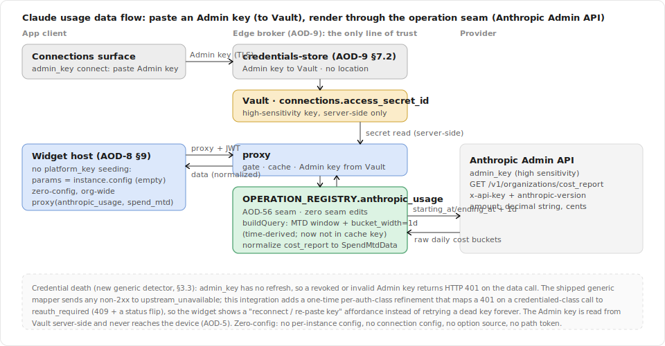
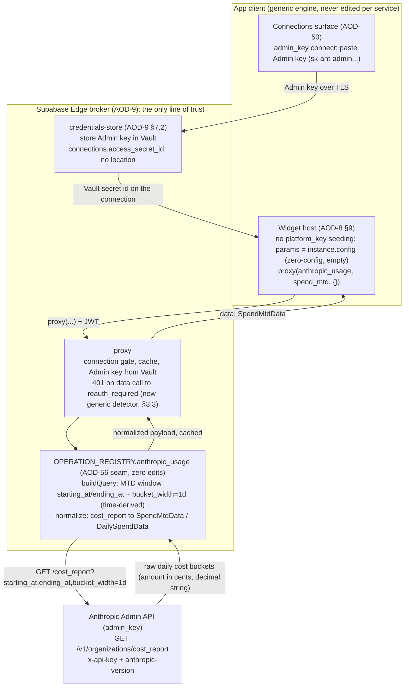
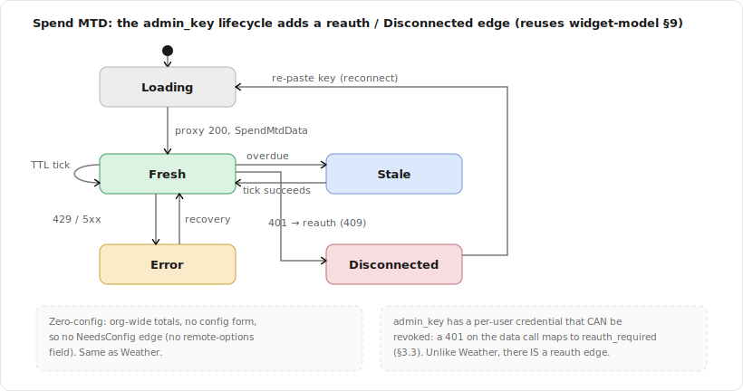
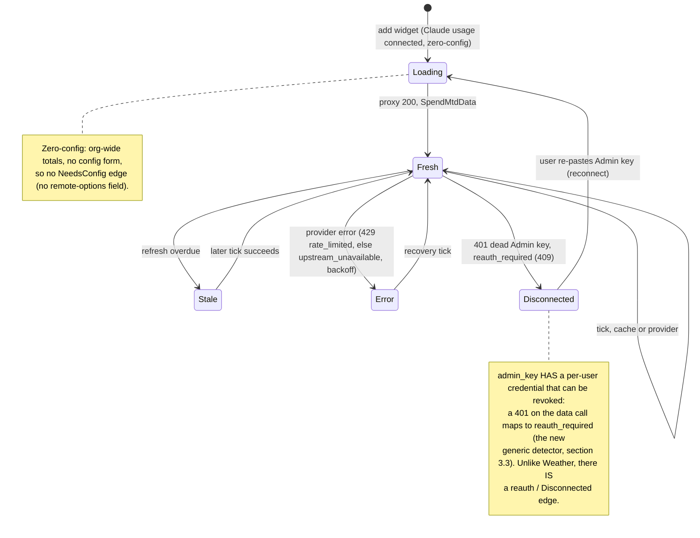

# Spec: Claude Usage Integration (Spend MTD, Daily Spend Sparkline)

> Status: draft for review, 2026-06-28. Tracked by [AOD-33](https://linear.app/thexap/issue/AOD-33) (`type:spec`). The **fourth per-integration spec** and the **first `admin_key` one**: it fills the same interior that [AOD-8](https://linear.app/thexap/issue/AOD-8) (registry seam), [AOD-9](https://linear.app/thexap/issue/AOD-9) (broker + proxy), and [AOD-10](https://linear.app/thexap/issue/AOD-10) (widget model) framed, now for a concrete **credentialed, high-sensitivity REST** service. It mirrors [`integration-weather.md`](integration-weather.md) ([AOD-57](https://linear.app/thexap/issue/AOD-57)) and [`integration-calendar.md`](integration-calendar.md) ([AOD-32](https://linear.app/thexap/issue/AOD-32)) section for section, and it is the **fourth proof** that the per-widget operation seam ([AOD-55](https://linear.app/thexap/issue/AOD-55), generalized to REST in [AOD-56](https://linear.app/thexap/issue/AOD-56)) generalizes again: Claude usage rides the **already-REST-ready** seam by registration, with **zero edits to the operation seam itself**. It gates the I-M2 "Claude usage" milestone.
>
> Four findings are load-bearing. (1) The `admin_key` connect path is **already complete and shipped**: a user pastes their Admin key (`sk-ant-admin...`), `credentials-store` stores it in Vault, and the proxy attaches it server-side via the `anthropic-admin` header style. Unlike Weather (which needed a `credentials-store` location-shape edit), Claude usage's connect side is **untouched**, so the connect flow is registration-only. (2) `admin_key` is **credentialed and can die**, and the shipped generic error mapper sends a `401` from a revoked Admin key to `upstream_unavailable`, **not** `reauth_required`. Because `admin_key` has **no refresh and no expiry**, a `401`-on-the-data-call is the *entire* credential-death story, not the rare mid-life-revocation edge that lets Calendar and Linear defer it. So this spec **decides to build** the `401 -> reauth_required` detector those specs named: a one-time, per-auth-class generic refinement, the `admin_key` analogue of the one-time host refinement Weather needed (section 3.3). (3) Both v1 widgets are derived from the **Cost Report** (`/v1/organizations/cost_report`), whose `amount` is a **decimal string in the lowest currency unit (cents)**: `"123.45"` in `USD` is `$1.23`, so the normalizer divides by 100. This is the single most dangerous field in the contract (misreading it inflates spend 100x), verified against the docs and flagged for live re-verification at build (section 12). (4) The two widgets are **zero-config, org-wide totals** (like Weather), because the Cost Report's `group_by` supports only `workspace_id` / `description` (no native per-model spend), so the org-wide default is both the product choice ([AOD-4](https://linear.app/thexap/issue/AOD-4)) and the best-supported API shape (sections 5, 12).
>
> Unlike Weather (verified against the live keyless API), the Anthropic Admin API requires an Admin key that is not present in this environment, so every shape below is verified against the **official documentation on 2026-06-28** (the same doc-only posture Calendar used) and is **flagged for live re-verification** by the build, the `amount`-in-cents conversion especially (section 12).

## 1. Purpose and scope

The platform is shipped: the registry seam ([AOD-8](https://linear.app/thexap/issue/AOD-8)), the broker and proxy ([AOD-9](https://linear.app/thexap/issue/AOD-9)), the widget model ([AOD-10](https://linear.app/thexap/issue/AOD-10)), the remote-options engine ([AOD-53](https://linear.app/thexap/issue/AOD-53)), and the per-widget operation seam ([AOD-55](https://linear.app/thexap/issue/AOD-55)) **already refined for REST** ([AOD-56](https://linear.app/thexap/issue/AOD-56), `buildQuery` + path tokens), and Linear ([`integration-linear.md`](integration-linear.md)), Google Calendar ([`integration-calendar.md`](integration-calendar.md)), and Weather ([`integration-weather.md`](integration-weather.md)) rode them end to end. Claude usage is the **fourth real service**, the **first `admin_key`** one, and the first whose credential is **high-sensitivity and org-wide**. This spec fixes how Claude usage plugs into the seam so the later build is registration plus leaf renderers plus operation modules, with zero edits to the operation seam, the layout, the host data path, the broker connect path, or the settings internals.

It fixes exactly five things:

1. **`admin_key` specifics**: the class, the already-shipped key-paste / Vault connect path (no edit needed), the high-sensitivity posture ([AOD-5](https://linear.app/thexap/issue/AOD-5) normalized-data-only, server-side-only key), and the **credential-death decision**: a revoked or invalid Admin key returns `401`, which the shipped generic mapper sends to `upstream_unavailable`; this spec specifies the `401 -> reauth_required` detector (section 3.3).
2. **The two widgets and their data contracts**: "Spend MTD" and "Daily Spend Sparkline" ([AOD-4](https://linear.app/thexap/issue/AOD-4)'s v1 Claude widgets, section 4), both derived from the Cost Report. For each: the server-side `/v1/organizations/cost_report` request (built by `buildQuery`: the month-to-date window + daily buckets), the raw Admin-API response shape, and the **normalized payload** the renderer receives via the [AOD-8](https://linear.app/thexap/issue/AOD-8) §6.1 render contract `{ data, config, size }`, over a shared `DailyCost`.
3. **Per-instance config and the config model**: the widgets are **zero-config, org-wide totals**; there is **no per-instance field**, **no connection-level config** (the connection holds only the Admin key), and **no** [AOD-53](https://linear.app/thexap/issue/AOD-53) option source (a workspace / model selector is a named future seam, section 5.3).
4. **The operation seam, reused for REST**: where the per-widget `buildQuery` and `normalize` slot in, with **zero edits to the operation seam** (it is already REST-ready from [AOD-56](https://linear.app/thexap/issue/AOD-56)), plus the **one** new generic mechanism Claude usage needs, which is **not** in the operation seam: the `401 -> reauth_required` credential-death detector (section 3.3, 6.3).
5. **Refresh and cache TTLs**, justified against the Cost Report's verified daily granularity and settlement lag (cost data is daily-granular and trails real time), at or under the [AOD-5](https://linear.app/thexap/issue/AOD-5) 900s ceiling, with the error mapping named (429 already handled; 401 is the new detector).

**In scope:** the data contracts, the org-wide config decision, the operation modules, the TTLs, the exact registry slotting (both halves) including the report-keyed-to-widget-keyed endpoint reconciliation, and the one-time generic `401 -> reauth_required` refinement that, together with registration, makes Claude usage an add.

**Out of scope (neighbors named so the frame is clear):**

- **The build** of the Claude usage widgets, leaf renderers, and operation modules is a separate I-M2 `type:tech-task` created after this spec lands, implementing it the [AOD-58](https://linear.app/thexap/issue/AOD-58) way (registration on the seam, plus the one generic refinement). This spec is the design it implements.
- **The personal-engine "Claude Limits" (session / weekly) widget** ([AOD-14](https://linear.app/thexap/issue/AOD-14)). That is **subscription rate-limit consumption**, which has **no public multi-tenant API**; it is device-pushed from a Claude Code bridge on the user's own machine, deliberately out of the standard set ([`claude-limits-personal-widget.md`](claude-limits-personal-widget.md) §3). This spec covers the **standard, server-pulled, Admin-API spend** widgets only. The boundary is stated explicitly in section 4.0.
- **The Clock integration spec** ([AOD-34](https://linear.app/thexap/issue/AOD-34), I-M3). Claude usage reuses the Weather / Calendar template and proves the `admin_key` path; it does not author it.
- **The Claude usage widget visual design**. This spec fixes the normalized data the renderer receives (the MTD total, the daily series); it does not fix how the cards look, the sparkline rendering, or currency formatting.
- **The onboarding / connect flow** ([AOD-26](https://linear.app/thexap/issue/AOD-26)) and the **connections surface** ([AOD-50](https://linear.app/thexap/issue/AOD-50)). Referenced as the hooks Claude usage connect rides; the generic `CredentialForm` key-paste affordance is already shipped and untouched (section 3.1).
- **Broker mechanics** (the connection gate, the proxy, the typed error result, the Vault read) are [AOD-9](https://linear.app/thexap/issue/AOD-9)'s and the widget model (lifecycle, the refresh clamp, validation) is [AOD-10](https://linear.app/thexap/issue/AOD-10)'s. Referenced, not redefined, except the one named refinement to the error mapping (section 3.3).
- **Kiosk and entitlement** concerns ([AOD-11](https://linear.app/thexap/issue/AOD-11) / [AOD-12](https://linear.app/thexap/issue/AOD-12)). Claude usage counts toward the Free service limit ([AOD-12](https://linear.app/thexap/issue/AOD-12)); the TTLs here are inputs to those levers, not decisions about them.

Every API shape below is verified against the **Anthropic Admin API documentation on 2026-06-28** and cited in section 12. Unlike Weather (keyless, verified live), the Admin API needs an Admin key absent from this environment, so the shapes are **doc-verified, not live-verified**, exactly as Calendar was. Nothing is invented; the build re-verifies against the live API with a real `sk-ant-admin` key and updates section 12 if anything differs, the `amount`-in-cents conversion in particular.

## 2. Locked context this builds on

| Source | What it locks | How this spec uses it |
|---|---|---|
| [AOD-8](https://linear.app/thexap/issue/AOD-8) §5.2 | The server half (`ServiceBackendConfig`) and the endpoint allow-list, keyed by widget type. | Section 8 reconciles the shipped report-keyed `endpoints` (`usage` / `cost`) into widget-keyed entries (`spend_mtd` / `daily_spend`), both on the `cost_report` path. |
| [AOD-8](https://linear.app/thexap/issue/AOD-8) §6 / §6.1 | `WidgetDefinition` shape; the render contract `render(data, config, size)` invoked only with live, normalized data. | Section 4 fixes each widget's definition and the normalized `data` its renderer receives. |
| [AOD-8](https://linear.app/thexap/issue/AOD-8) §10 / §11 | The seam (generic engine never edited per service) and the "add a service by registration alone" proof. | Section 8 is the Claude usage instance of §11, with the not-touched footprint table. |
| [AOD-9](https://linear.app/thexap/issue/AOD-9) §4 | `admin_key` is its own auth class: the user's high-sensitivity Admin key is stored in Vault and attached server-side; the only two endpoints it is ever attached to are `usage_report/messages` and `cost_report`. | Section 3 fills the Anthropic specifics; section 8 keeps both endpoints allow-listed and binds the widgets to `cost_report`. |
| [AOD-9](https://linear.app/thexap/issue/AOD-9) §7.2 | The non-OAuth `credentials-store` connect path; for `api_key` / `admin_key` it stores the user-supplied key in Vault and writes the `connections` row. | Section 3.1 confirms this path is shipped and **untouched** for Claude usage. |
| [AOD-9](https://linear.app/thexap/issue/AOD-9) §9 | The proxy data path (connection gate, secret read from Vault for credentialed classes, allow-listed call, normalize, cache, typed errors). | Section 6 rides this; section 3.3 / 6.3 add the one generic post-call refinement (401 -> reauth). |
| [AOD-10](https://linear.app/thexap/issue/AOD-10) §4 / §6 / §9 | The config schema, the two-layer refresh model (`cacheTtlSeconds`, `minRefreshSeconds`), and the lifecycle states. | Section 5 sets a zero-field config; section 7 sets per-widget TTLs; section 9 walks Spend MTD through the lifecycle (Weather's states **plus** a reauth edge). |
| [AOD-9](https://linear.app/thexap/issue/AOD-9) §8 + `providers.ts` | The OAuth reauth path: an `invalid_grant` at refresh sets `reauth_required`, served as `409 needs_reconnect`. The generic provider-error mapping (`isRateLimited`, `providerErrorResponse`) maps 429 -> `rate_limited`, any other non-2xx -> `upstream_unavailable`. | Section 3.3 extends the **same reauth outcome** to credentialed classes at the data-call boundary, since `admin_key` never refreshes. |
| [AOD-55](https://linear.app/thexap/issue/AOD-55) + [AOD-56](https://linear.app/thexap/issue/AOD-56) | The shipped operation seam: server `OPERATION_REGISTRY` keyed by service + widget, `getOperation`, the proxy's `buildQuery` (REST) + `normalize` lookup, optional path tokens, and the generic provider-error mapping. | Section 6 registers the two Claude operations (`buildQuery` + `normalize`) on this seam with **zero edits**; section 7 reuses the 429 mapping unchanged. |
| [AOD-4](https://linear.app/thexap/issue/AOD-4) | The v1 widget set (Done): **Claude usage = Spend MTD + Daily Spend Sparkline**, on an `admin_key`; the personal session/weekly limits are sub-decision C1 (out, [AOD-14](https://linear.app/thexap/issue/AOD-14)). | Section 4 realizes the two standard widgets; section 4.0 states the [AOD-14](https://linear.app/thexap/issue/AOD-14) boundary. |
| [AOD-6](https://linear.app/thexap/issue/AOD-6) | Claude usage is in the v1 service set. | The fourth service wired, after Linear, Calendar, Weather. |
| [AOD-5](https://linear.app/thexap/issue/AOD-5) | Privacy posture: the proxy cache holds normalized data only, per-user, encrypted, TTL <= 900s, purged on disconnect / delete; the Admin key is a per-user encrypted Vault secret, never on the device. | Section 6 normalizes before caching (no raw Cost-Report rows stored); section 7 keeps every TTL at or under 900s; the high-sensitivity key never leaves the server (section 3.2). |
| [AOD-14](https://linear.app/thexap/issue/AOD-14) | The personal-engine limits widget: subscription session / weekly bars, device-pushed, no third-party API; the standard Claude widget remains Admin-API Spend MTD. | The explicit **out-of-scope boundary** for this spec (section 4.0). |

The shipped server registry already carries the Claude usage backend. The current entry, verbatim from `supabase/functions/_shared/registry.ts`:

```typescript
anthropic_usage: {
  id: "anthropic_usage",
  authClass: "admin_key",
  apiBase: "https://api.anthropic.com",
  authHeaderStyle: "anthropic-admin",
  endpoints: {
    // The only two endpoints the high-sensitivity Admin key is ever attached to (AOD-9 §4).
    usage: { method: "GET", path: "/v1/organizations/usage_report/messages" },
    cost: { method: "GET", path: "/v1/organizations/cost_report" },
  },
},
```

`id`, `authClass`, `apiBase`, and `authHeaderStyle` are correct and final. The `endpoints` keys (`usage` / `cost`) are keyed by **report**, but the registry allow-list is looked up by **widget type** (`getEndpoint(backend, widgetType)`). So they are a **pre-registration placeholder** the same way Weather's lone `current: /v1/forecast` was: this spec re-keys them by widget type (`spend_mtd` / `daily_spend`, both on the `cost_report` path) and keeps the `usage_report/messages` path as a reserved, not-yet-bound endpoint for a future token-volume widget (sections 6, 8). It changes no other field of the block. The service **id stays `anthropic_usage`**; the client-facing display name is **"Claude usage"** (section 8), the way Weather reconciled `weather` / "Weather" and Calendar reconciled `google_calendar` / "Google Calendar".

## 3. `admin_key` specifics

### 3.1 The class and the connect flow (already shipped, untouched)

Claude usage is an `admin_key` service ([AOD-9](https://linear.app/thexap/issue/AOD-9) §4). The user pastes their organization **Admin key** (`sk-ant-admin...`), which is a **credentialed, per-user** secret, distinct from a normal API key: it grants org-wide read of usage and cost. There is **no OAuth, no consent screen, no code exchange, no refresh token, and no platform key**. The connect affordance is the generic `CredentialForm` key-paste mechanism, already shipped and **untouched** by this integration.

Connect rides the [AOD-9](https://linear.app/thexap/issue/AOD-9) §7.2 `credentials-store` path with **no new broker code**: the app POSTs the pasted key once over TLS; `credentials-store` writes it to Vault and records the secret id on the `connections` row. The shipped handler already covers `admin_key` in the same branch as `api_key` (`supabase/functions/credentials-store/handler.ts`):

```typescript
if (backend.authClass === "api_key" || backend.authClass === "admin_key") {
  if (!body.apiKey) throw new HttpError(400, "missing_api_key", `${body.service} requires an api key`);
  const accessId = await createSecret(body.apiKey, `${body.service} key for ${user.id}`);
  // upsert connections: status=connected, auth_class=admin_key, access_secret_id=accessId, no config
}
```

At data time, `resolveCallSecret` reads the Admin key from Vault (it is not `platform_key`, so it does not read env, and not `oauth2`, so it does not refresh), and the proxy attaches it via the `anthropic-admin` header style, which is already shipped (`supabase/functions/_shared/connection.ts`, `providers.ts`):

```typescript
// connection.ts: admin_key falls through to the Vault read (no env, no refresh).
const loaded = await readSecret(conn.access_secret_id);

// providers.ts: the anthropic-admin header style attaches the key + the required API version.
case "anthropic-admin":
  return { "x-api-key": secret, "anthropic-version": "2023-06-01" };
```

So the entire connect / store / attach path for `admin_key` is **already complete**. Unlike Weather, which needed a `credentials-store` edit to change the location shape, Claude usage's connect side is **registration-only**: there is nothing to add there. This spec adds no connect UI.

### 3.2 High-sensitivity posture (load-bearing)

The Admin key is the highest-sensitivity credential in the v1 set: it reads the organization's **usage and spend**, org-wide. [AOD-5](https://linear.app/thexap/issue/AOD-5)'s posture is therefore load-bearing, and this integration honors it literally:

- **The key never reaches the device.** It is stored in Vault (per-user, encrypted) and attached **server-side** by the proxy. The client host calls `proxy(anthropic_usage, spend_mtd)` and never sees the key, the `apiBase`, or the report URL ([AOD-8](https://linear.app/thexap/issue/AOD-8) §4 trust boundary). This is the whole reason `admin_key` is a server-attached class and not a client header.
- **Only normalized data is cached.** The proxy normalizes the raw Cost Report (verbose per-line-item rows) into the small `SpendMtdData` / `DailySpendData` payloads (section 4) **before** caching, so the cache holds derived spend figures, never raw provider rows and never any credential ([AOD-5](https://linear.app/thexap/issue/AOD-5) C2, section 6.4).
- **Disconnect purges the key.** Disconnect deletes the Vault secret and retires the connection ([AOD-9](https://linear.app/thexap/issue/AOD-9) §10), and removes the Claude usage widgets from every layout ([AOD-8](https://linear.app/thexap/issue/AOD-8) invariant 3). Account deletion purges the same ([AOD-5](https://linear.app/thexap/issue/AOD-5)).

### 3.3 Credential death: the `401 -> reauth_required` decision (the one generic refinement)

This is the one real decision in the spec, and it is **decided here**, not deferred.

**The gap.** An Admin key can be **revoked or rotated** at any time in the Anthropic Console. When it is, the Admin API returns **HTTP 401** on the next data call. The shipped generic mapper has no 401 branch: `providerErrorResponse` maps 429 -> `rate_limited` and **any other non-2xx -> `upstream_unavailable`** (`supabase/functions/_shared/providers.ts`). So today a dead Admin key surfaces as a generic "provider unavailable" error, and the widget **retries a dead key forever**, never prompting the user to re-paste it.

**Why this is not the deferrable edge the OAuth specs named.** Calendar and Linear named this exact gap and **deferred** it, because for `oauth2` the inline refresh ([AOD-9](https://linear.app/thexap/issue/AOD-9) §8.3) covers the common expired-token case, leaving only rare **mid-life revocation** ([`integration-calendar.md`](integration-calendar.md) §7.3, §10). `admin_key` is different in kind: it has **no refresh and no expiry**, so there is no inline-refresh path to mask anything. A `401`-on-the-data-call is the **only** and **primary** way an Admin-key connection dies. Deferring it would mean the one class whose credential most plausibly gets rotated has the *worst* death UX (silent forever-retry). So `admin_key` is precisely the integration that should finally build the detector.

**The decision.** Map a `401` on a **credentialed-class** (`admin_key` / `api_key`) data call to **`reauth_required`**, reusing the existing reauth outcome the OAuth path already produces:

1. Flip `connections.status = 'reauth_required'` for that connection (the same status `refreshConnection` sets on `invalid_grant`), so subsequent proxy calls hit the connection gate and short-circuit.
2. Return `409 needs_reconnect` for the current call, the exact body the gate and the OAuth reauth path already return.

The host already renders `409 needs_reconnect` as the **Disconnected / reconnect** state ([AOD-10](https://linear.app/thexap/issue/AOD-10) §9), so the user sees a "reconnect / re-paste key" affordance and re-runs the shipped `credentials-store` key-paste (section 3.1) to recover. No new client state, no new error code.

**Where it lives and why it is generic.** The detector is a small, post-call check in the proxy, which is the one place holding both the connection row (`conn`) and the DB handle (`svc`) needed to flip status, and which already owns the call result (section 6.3). It is gated on **auth class**, not service id:

```typescript
// proxy/handler.ts, after callProviderApi, before providerErrorResponse (illustrative):
// A credentialed-class key that returns 401 is dead (revoked/invalid). Map it to the SAME reauth
// outcome the oauth2 invalid_grant path produces, since admin_key/api_key never refresh. Generic per
// auth class, never per service: serves anthropic_usage now and every future api_key service.
if (result.status === 401 && (conn.auth_class === "admin_key" || conn.auth_class === "api_key")) {
  await svc.from("connections").update({ status: "reauth_required" }).eq("id", conn.id);
  return needsReconnect();
}
```

This is **one** small, additive, generic change, the `admin_key` analogue of Weather's one-time `platform_key` host params-seeding: it is per **auth class**, not per service, so it serves Claude usage and **every future `admin_key` / `api_key` service** at once, and it leaves `oauth2` / `platform_key` widgets byte-for-byte unchanged (a `401` on an `oauth2` data call is still the mid-life-revocation edge those specs named, untouched here). After it lands, Claude usage and future credentialed services are **registration-only**. It is the only edit beyond registration this integration needs, and it is **not** in the operation seam, the providers boundary, or the connect path; it is in the proxy's post-call error handling.

A narrow scope note, flagged for the build: the detector keys on **HTTP 401** (Anthropic's `authentication_error` for an invalid / revoked key). A **403** `permission_error` (a *valid* key that is not an Admin key, or lacks the org-read permission) is a closely related "fix your key" case; v1 keys the detector on 401 only and names 403-permission as a possible extension (section 10), to avoid disturbing the shipped 403-is-sometimes-a-rate-limit path (`isRateLimited` already special-cases Google's 403 + `usageLimits`).

### 3.4 Connect, reconnect, disconnect hooks

| Event | Path | Notes |
|---|---|---|
| **Connect** | `credentials-store` key-paste -> Vault (section 3.1) | Already shipped; no edit. A single optional provider validation call is wired per-integration and may be enabled to validate the key at connect (the shipped handler leaves a hook for it). |
| **Reconnect** | `401` on a data call -> `reauth_required` -> `409` -> host reconnect prompt -> re-paste key (section 3.3) | The new generic detector. This is the credential-death path Weather did **not** have. |
| **Disconnect** | [AOD-9](https://linear.app/thexap/issue/AOD-9) §10: delete the Vault secret, retire the connection, remove the widgets | High-sensitivity key purged; no provider-side token to revoke (an Admin key is revoked in the Console, not via an API). |

## 4. The widgets and their data contracts

### 4.0 Scope boundary: standard Admin-API spend, not the personal limits widget

[AOD-4](https://linear.app/thexap/issue/AOD-4)'s v1 Claude set is two **standard, multi-tenant** widgets, **Spend MTD** and **Daily Spend Sparkline**, both **server-pulled** from the Anthropic **Admin API** ([AOD-9](https://linear.app/thexap/issue/AOD-9) §9 proxy). This spec covers those two and only those two.

The **personal-engine "Claude Limits" widget** (claude.ai Settings > Usage: current session + weekly limit bars) is explicitly **out of scope**: that data is **subscription rate-limit consumption**, which has **no public third-party API**, so it is **device-pushed** from a Claude Code bridge on the user's own machine, not pulled by the proxy ([AOD-14](https://linear.app/thexap/issue/AOD-14), [`claude-limits-personal-widget.md`](claude-limits-personal-widget.md) §3). The two are different questions: this spec answers "what did the org spend on the API" (dollars, from the Cost Report); AOD-14 answers "how close is this subscription user to being throttled" (percent of limit, from the user's own machine). They share the `anthropic_usage`-adjacent name and nothing else; AOD-14 adds its own ingest path and is specified separately.

### 4.0a The shared `DailyCost`

The Cost Report returns spend in **daily buckets** (`bucket_width: "1d"`, the only granularity it supports). Both widgets read those buckets; they differ only in how they reduce them (a single sum vs the series). So both normalize over one shared element, the way Weather shares `WeatherCondition`:

```typescript
interface DailyCost {
  date: string;   // the bucket's calendar day, "YYYY-MM-DD" (UTC; the API snaps buckets to UTC day starts, §12)
  amount: number; // that day's total spend in MAJOR currency units (e.g. USD dollars), summed across the
                  // bucket's result line items and divided by 100 (the API returns minor units / cents, §12)
}
```

Two conventions are fixed for v1 and echoed in every payload:

- **Currency is whatever the Cost Report returns** (`results[].currency`, currently always `"USD"`, section 12). Each payload carries the `currency` string so the renderer formats without hard-coding `$`. Multi-currency is a non-issue today and a trivial future passthrough (the field already exists).
- **Amounts are major units (dollars).** The API's `amount` is a **decimal string in the lowest currency unit (cents)**; the normalizer parses it, **sums in minor units, then divides by 100** to yield major units. This single conversion is load-bearing (section 12); the normalized contract exposes only the clean major-unit number so the renderer never touches the cents string.

### 4.1 Spend MTD (the single glance)

The organization's **month-to-date total spend**: one number, the headline glance. Default size `small` (of `small` / `medium`), device cadence around 30 minutes (cost is daily-granular and lags, section 7).

**Server-side request** (built by the operation, section 6; the client never supplies query params):

```
GET /v1/organizations/cost_report
    ?starting_at={firstOfMonthUTC}     (00:00:00Z on the 1st of the current UTC month, §6.1)
    &ending_at={nowUTC}                 (read at call time, so it never enters the cache key)
    &bucket_width=1d                    (the only granularity the Cost Report supports)
    &limit=31                           (a month has <=31 daily buckets; one page covers MTD, §7)
```

No `group_by`: with no grouping, each daily bucket collapses to a **single result** carrying that day's org-wide total (the breakdown dimensions are null, section 12). That is exactly the org-wide figure the widget wants.

**Raw response** is `{ data: [ { starting_at, ending_at, results: [ { amount, currency, ...nulls } ] } ], has_more, next_page }`, where each `data[]` entry is a daily bucket and `results[].amount` is a decimal-string cent figure (verified, section 12). **Normalized payload:**

```typescript
interface SpendMtdData {
  amount: number;      // month-to-date total spend, major units (sum of all buckets' results, / 100)
  currency: string;    // "USD" (from results[].currency)
  windowStart: string; // the MTD window start, "YYYY-MM-DD" (1st of the current UTC month)
  asOf: string;        // the last covered day, "YYYY-MM-DD" (today, UTC)
  daysElapsed: number; // count of daily buckets covered, so the renderer can derive a run-rate/projection
}
```

There is no empty / "nothing" state: a connected org with no spend yet returns `amount: 0` (zero buckets, or buckets summing to zero), which is a valid figure, not an error or empty state (unlike Calendar's `hasEvent: false`). A `vs-prior-month` trend is **not** in v1 (it would need a second window or call); the renderer may derive an intra-month run-rate or month-end projection from `amount` + `daysElapsed` with no extra request, and a literal prior-month delta is a named future seam (section 10).

**Client-half definition** (the [AOD-10](https://linear.app/thexap/issue/AOD-10) model values filled in):

```typescript
const spendMtd: WidgetDefinition = {
  type: "spend_mtd",
  serviceId: "anthropic_usage",
  title: "Claude Spend (MTD)",
  supportedSizes: ["small", "medium"],
  defaultRefresh: { seconds: 1800 },  // device asks every ~30 min; the figure is daily-granular and lags (§7)
  cacheTtlSeconds: 900,               // provider hit at most once / 15 min; at the AOD-5 ceiling (§7)
  minRefreshSeconds: 900,
  dimsWithAmbient: true,
  configSchema: { fields: [] },       // zero-config: org-wide totals, no per-instance choice (§5)
  render: SpendMtdCard,               // leaf component; receives { data: SpendMtdData, config, size }
};
```

### 4.2 Daily Spend Sparkline

A **daily cost series** for the current month, drawn as a sparkline. Default size `wide` (of `wide` / `large`), device cadence around 60 minutes (a daily series barely moves intraday, section 7).

**Server-side request** is the **same** Cost Report request as Spend MTD (the shared MTD window + `bucket_width=1d`, section 6.1); the two widgets differ only in `normalize`. (They are separate widget instances with separate cache rows keyed by `widget_type`, so the shared request shape does not collide, exactly as Calendar's two widgets both read `events.list`.)

**Raw response** is the same daily-bucketed Cost Report body. The normalize step's main job is to **map each daily bucket to a `DailyCost` row** (sum the bucket's `results[].amount`, divide by 100), oldest day first. **Normalized payload:**

```typescript
interface DailySpendData {
  days: DailyCost[];  // one entry per daily bucket, oldest-first (month-to-date)
  currency: string;   // "USD" (from results[].currency)
  total: number;      // convenience: sum of days[].amount; equals SpendMtdData.amount over the same window
}
```

An empty `days` array is the normal "no spend yet this month" state (a new org early in the month), rendered as a flat / empty sparkline, never a crash. Normalize is defensive: a missing or ragged `data` / `results` yields `days: []` (the host shows an empty card), exactly as Calendar's, Linear's, and Weather's normalizers guard their inputs.

**Client-half definition:**

```typescript
const dailySpend: WidgetDefinition = {
  type: "daily_spend",
  serviceId: "anthropic_usage",
  title: "Claude Daily Spend",
  supportedSizes: ["wide", "large"],
  defaultRefresh: { seconds: 3600 },  // device asks every ~60 min; a daily series barely moves intraday (§7)
  cacheTtlSeconds: 900,               // provider floor at the AOD-5 ceiling (§7)
  minRefreshSeconds: 900,
  dimsWithAmbient: true,
  configSchema: { fields: [] },       // zero-config; org-wide (§5)
  render: DailySpendCard,             // receives { data: DailySpendData, config, size }
};
```

## 5. Per-instance config and the config model

### 5.1 Zero-config, org-wide totals

The single decision for v1 is **zero-config**: both widgets show **org-wide** spend, declare an **empty** config schema (`fields: []`, section 4), and read **no** per-instance and **no** connection-level config. A Claude usage widget is a **zero-config add** once the Admin key is connected, in deliberate contrast to Calendar's required `calendarId` per instance.

This is even more zero-config than Weather: Weather's one choice (the location) lives on the connection; Claude usage has **no** user choice at all in v1, not on the widget and not on the connection. The connection holds only the Admin key (a credential, not config); `connections.config` is unused for `anthropic_usage`. The proxy's `buildQuery` therefore receives empty `params` and derives everything (the MTD window) itself (section 6.1).

### 5.2 Why org-wide is the natural and best-supported shape

The org-wide default is not just the simplest choice; it is the one the Cost Report best supports. The verified `group_by` for `/cost_report` is **only `workspace_id` or `description`** (section 12). There is **no native per-model spend grouping** (model appears only as a sub-field of a `description` group, bundled with token-type and cost-type into a description string). So:

- **Org-wide total** (no `group_by`) is a clean, single-result-per-bucket shape, exactly what [AOD-4](https://linear.app/thexap/issue/AOD-4)'s "Spend MTD" and "Daily Spend Sparkline" describe.
- A **per-workspace** breakdown is the only natural `group_by`, and it needs a workspace picker (an option source, section 5.3) plus a membership re-check (section 5.4); it is more than the v1 glance needs.
- A **per-model spend** breakdown is **awkward on the Cost Report** (only via `description` parsing), which is an independent reason not to offer a model selector in v1.

So v1 is org-wide, and the selector is a named future seam (section 10), the same way Weather fixed metric units and named imperial as a seam.

### 5.3 No widget option source

Could the config use the [AOD-53](https://linear.app/thexap/issue/AOD-53) remote-options engine (a `providerBackedSource`, e.g. a workspace picker backed by the Admin API's `GET /v1/organizations/workspaces`)? **Not for v1.** v1 is zero-config (section 5.1), so there is **no config field** to resolve, and there is **no** `anthropic_usage` entry in `OPTION_SOURCE_REGISTRY`.

If a later version adds a per-workspace breakdown, it would: add a `workspaceId` config field; register a `providerBackedSource` that lists the org's workspaces (a config-time `config-options` call on the same Admin key); and pass `group_by=workspace_id` plus the chosen id as a filter in `buildQuery`. That is purely additive (an option source + a `buildQuery` param), the AOD-53 path Weather also declined for v1. It is named in section 10, not built here.

### 5.4 No membership re-check

Because Claude usage declares no `remote-options` field, the [AOD-10](https://linear.app/thexap/issue/AOD-10) §4.4 render-time membership re-check (which drove Calendar's "chosen calendar deleted" to `needs_config`) **does not apply**. There is no option set a stored value can fall out of. So Claude usage has **no `needs_config` lifecycle edge** (section 9), exactly like Weather.

This is the precise shape of Claude usage's lifecycle: it has Weather's **no-`needs_config`** simplicity (zero-config) **but**, unlike Weather, it **does** have a reauth / Disconnected edge, because its credential can die (section 3.3). It sits between Weather (no reauth, no needs_config) and Calendar (reauth via refresh, plus needs_config): reauth **without** needs_config, and the reauth fires from the new 401-on-data-call detector rather than from a token refresh.

## 6. The operation seam, reused for REST (zero seam edits)

This is where Claude usage proves the seam holds again. The operation seam is **already REST-ready** from [AOD-56](https://linear.app/thexap/issue/AOD-56): `WidgetOperation` already has an **optional** `buildQuery` and a **required** `normalize`, and the proxy already does one generic lookup. Claude usage needs **no edit to the operation seam at all**: it registers `buildQuery` + `normalize` per widget. The one new generic mechanism Claude usage introduces is **not** here; it is the `401 -> reauth_required` detector in the proxy's post-call handling (section 3.3, 6.3).

### 6.1 The operation module (REST form)

The Claude operations register under the existing `OPERATION_REGISTRY`, keyed by service id and widget type, each with a `buildQuery` (no `buildBody`: a `GET` carries no body) and a `normalize`. Both widgets share one **time-derived** query builder (the MTD window), exactly as Calendar's two widgets share `EVENTS_BASE` and as Weather's share `locationQuery`:

```typescript
// operations.ts: OPERATION_REGISTRY.anthropic_usage (NEW entries; server-side only).
// The Cost Report supports only bucket_width "1d", so both spend widgets read the same daily-bucketed
// month-to-date window; they differ only in normalize (a single sum vs the daily series).

/**
 * The month-to-date Cost Report query. The window is TIME-DERIVED (it depends on `now`), so like
 * Calendar's timeMin it is computed at call time and never enters the cache key: the proxy hashes
 * body.params, which is empty for these zero-config widgets (§5.1), so the key is the stable empty
 * params and the window is recomputed each fetch. starting_at is the 1st of the current UTC month at
 * 00:00:00Z; ending_at is now; bucket_width=1d; limit=31 covers a whole month in one page (§7).
 */
function buildCostMtdQuery(_params: Record<string, unknown>): Record<string, unknown> {
  const now = new Date();
  const monthStart = new Date(Date.UTC(now.getUTCFullYear(), now.getUTCMonth(), 1));
  return {
    starting_at: monthStart.toISOString(),
    ending_at: now.toISOString(),
    bucket_width: "1d",
    limit: 31,
  };
}

// normalize maps the cost_report body to the §4 payloads. Both: sum each bucket's results[].amount as a
// MINOR-unit (cents) decimal, then divide by 100 for major units (§4.0a, §12). Defensive against missing
// data[]/results[] (yields amount 0 / days []). Spend MTD sums all buckets; Daily Spend keeps the series.
function normalizeSpendMtd(raw: unknown): SpendMtdData   { /* sum all data[].results[].amount / 100 -> SpendMtdData */ }
function normalizeDailySpend(raw: unknown): DailySpendData { /* data[] -> DailyCost[] (per-bucket sum / 100) -> DailySpendData */ }

OPERATION_REGISTRY.anthropic_usage = {
  spend_mtd:   { buildQuery: buildCostMtdQuery, normalize: normalizeSpendMtd },
  daily_spend: { buildQuery: buildCostMtdQuery, normalize: normalizeDailySpend },
};
```

These functions are the only Claude-specific data code; they are registration, not engine edits. They normalize before the proxy caches, so the cache stores small clean payloads (`SpendMtdData` / `DailySpendData`), not the Cost Report's verbose per-line-item rows ([AOD-5](https://linear.app/thexap/issue/AOD-5) "normalized data only"), exactly as Linear, Calendar, and Weather do.

**The cache-key property this preserves.** Like Calendar's `buildQuery`, Claude's is **time-derived**: the MTD window depends on `now`. Per the seam's rule, the window is built **inside** `buildQuery`, so it never enters `params` and never enters the cache key. The proxy hashes `body.params`, which is **empty** for these zero-config widgets, so the key is the stable empty params; within a TTL every device polling the same widget is served the same cached normalized payload, and each fresh fetch recomputes the window. At a UTC month boundary, a cached entry from the prior month is served until its <=900s TTL expires, then refetched against the new window; the worst case is ~15 minutes of "last month's total" just after midnight UTC on the 1st, which the <=900s ceiling bounds and which is benign for an ambient glance (section 7).

### 6.2 No path token

The Cost Report path `/v1/organizations/cost_report` has **no `{token}`**: the window is delivered as **query parameters**, not a path slot, exactly like Weather (`?latitude=...`) and unlike Calendar (`/calendars/{calendarId}/events`). The shipped `applyPathParams` returns a token-free path unchanged (`supabase/functions/_shared/providers.ts`), so Claude usage rides that machinery with nothing to fill. Claude usage therefore exercises the same query-only-no-path-token corner of the [AOD-56](https://linear.app/thexap/issue/AOD-56) seam Weather does.

### 6.3 The one new generic mechanism is the credential-death detector, not a seam edit

There is exactly one thing Claude usage needs that does not exist yet, and it is **not** in the operation seam and **not** on the client host. It is the `401 -> reauth_required` detector in the proxy's post-call error handling (specified in full in section 3.3).

Two contrasts make its placement clear:

- **No host params-seeding (the Weather refinement) is needed.** Weather's one refinement delivered an input *into* the query: a `platform_key` widget's location lives on the connection, so the host seeds `params` from `connection.config`. Claude usage's widgets are zero-config and `admin_key` takes the host's unchanged `else` branch (`params = instance.config`, which is empty), and the MTD window is derived inside `buildQuery`. So **no host change** is required. (`apps/app/src/host/WidgetHost.tsx` is untouched.)
- **Claude usage's one refinement maps a failure *out*.** Where Weather threaded an input in, Claude usage threads a credential-death *out*: a `401` becomes `reauth_required`. Both are one-time, per-auth-class, additive, and shared by every future service of that class. Weather's lives on the host; Claude usage's lives in the proxy's post-call check.

So the build is: register the two operations (section 6.1), reconcile the registry endpoints (section 8), add the two client cards (section 8), and add the one generic 401 detector (section 3.3). Zero edits to the operation seam, `providers.ts`, the connect path, the broker, or the option sources.

### 6.4 Why server-side, not in the leaf renderer

Normalization and request-building run in the proxy operation, not the client card, for the same reasons Linear, Calendar, and Weather give, plus one that is uniquely load-bearing here:

- [AOD-8](https://linear.app/thexap/issue/AOD-8) §6.1 defines `data` as the normalized payload from the proxy; the cache then stores small normalized payloads, not the Cost Report's verbose rows, so [AOD-5](https://linear.app/thexap/issue/AOD-5) "normalized data only" holds literally.
- The **cents-to-dollars conversion** and the **MTD window math** stay in the server half ([AOD-8](https://linear.app/thexap/issue/AOD-8) §4 trust boundary), off the client.
- **The Admin key must stay server-side.** This is the whole point of `admin_key`: the high-sensitivity key is attached by the proxy and never reaches the device. Putting the request on the client is not an option, so the operation seam (not a client call) is the only correct home for the request and the normalize.

## 7. Refresh and cache versus the Admin API's real cadence

### 7.1 Verified cadence and granularity (2026-06-28)

From the Cost Report documentation (section 12):

- **The Cost Report is daily-granular only**: `bucket_width` accepts **only `"1d"`**. There is no hourly or minute cost granularity. So a sub-daily refresh cannot surface finer cost data; the most a fresh fetch changes intraday is *today's* growing bucket.
- **Cost data lags real time.** Spend is settled / computed with a delay, so the current day's figure trails actual usage and firms up over time. Fresher-than-daily polling is therefore of low value for a spend glance; an ambient card does not need second-level freshness for a number that resolves daily.
- **The Admin API is rate-limited**, but the specific numeric limit for these org report endpoints is **not stated** in the endpoint docs (section 12, flagged). Whatever it is, a 429 is already handled generically (section 7.3); the TTLs below keep the per-user call rate trivially low regardless.

A consequence specific to `admin_key`: each user brings **their own** Admin key, metered against **their own** organization, so there is **no shared-budget problem** like Weather's single-proxy-IP free tier. Capacity is per-user and per-org; there is no commercial-tier capacity seam here.

### 7.2 The per-widget TTLs

| Widget | `defaultRefresh` | `cacheTtlSeconds` | `minRefreshSeconds` | Rationale |
|---|---|---|---|---|
| Spend MTD | 1800s | 900s | 900s | The figure is daily-granular and lags, so ~30 min device cadence loses no real freshness; the cache holds at the [AOD-5](https://linear.app/thexap/issue/AOD-5) 900s ceiling. |
| Daily Spend Sparkline | 3600s | 900s | 900s | A daily series barely moves intraday (only today's bar grows), so the device asks every ~60 min and is served from the <=900s cache. |

The [AOD-10](https://linear.app/thexap/issue/AOD-10) §6.1 cache TTL is the provider-protection floor: within one TTL every device and instance for the same `(user, service, widget, params)` is served from cache, so the provider is hit at most once per TTL. At `cacheTtl=900s` each mounted widget instance is at most ~96 provider calls/day per user, trivially under any plausible Admin-API limit. Every TTL is at or under the [AOD-5](https://linear.app/thexap/issue/AOD-5) 900s ceiling and above the [AOD-10](https://linear.app/thexap/issue/AOD-10) §6.1 provider floor. As with Weather and Calendar, the cadence is set by glanceable freshness (here, by the data's daily granularity), not by a per-user API budget.

### 7.3 Error mapping

| Provider signal | Mapping | Code source |
|---|---|---|
| **429** (rate limit) | `rate_limited`, host backs off ([AOD-10](https://linear.app/thexap/issue/AOD-10) §6.4) | Shipped `isRateLimited` / `providerErrorResponse`, no Claude-specific branch. |
| **401** (revoked / invalid Admin key) | `reauth_required` -> `409 needs_reconnect` -> Disconnected / reconnect | **New generic detector** (section 3.3); the one bit of error-mapping work, generic per auth class, not Anthropic-specific. |
| Other non-2xx (5xx, other 4xx) | `upstream_unavailable` | Shipped generic mapping, unchanged. |
| **403** `permission_error` (valid non-Admin key) | `upstream_unavailable` in v1; named as a possible reauth extension (section 10) | Shipped path; not disturbed, to keep the 403-can-be-rate-limit logic intact. |

The Anthropic error envelope is `{ "type": "error", "error": { "type": "authentication_error" | "permission_error" | "rate_limit_error" | "...", "message": "..." } }` (section 12). The detector keys on the **HTTP status** (401), not on parsing that body, so it stays generic and by-status, consistent with how the shipped mapper treats 429.

## 8. Registry slotting: the seam holds

Adding Claude usage is registration in both halves plus the two leaf renderers and the two operation modules, plus the one-time generic `401` detector (section 3.3, counted once and shared with every future credentialed service, not a per-service edit). There are **zero edits to the operation seam** (already REST-ready from [AOD-56](https://linear.app/thexap/issue/AOD-56)), and **zero edits to the connect path** (the `admin_key` Vault path is already shipped, section 3.1).

**Client half** (`apps/app/src/registry/services/anthropic_usage/`, new):

```typescript
export const anthropicUsageService: ServiceDefinition = {
  id: "anthropic_usage",
  displayName: "Claude usage",
  icon: "claude",
  authClass: "admin_key",
  widgets: [spendMtd, dailySpend],   // sections 4.1, 4.2
};
```

plus `SpendMtdCard` and `DailySpendCard` leaf components, and one registration line in the client registry index. `addableWidgets` already gates on `authClass === "none" || connected.has(id)`; `admin_key` is not `none`, so the Claude widgets become addable only once the Admin key is connected, with no engine edit.

**Server half** (registration + the endpoint reconciliation in existing files):

```typescript
// registry.ts: BACKEND_REGISTRY.anthropic_usage.endpoints re-keyed from the report-keyed placeholder to
// widget-keyed entries (both spend widgets read cost_report; the usage_report path is reserved, not bound).
endpoints: {
  spend_mtd:   { method: "GET", path: "/v1/organizations/cost_report" },
  daily_spend: { method: "GET", path: "/v1/organizations/cost_report" },
  // reserved for a future token-volume widget (not bound to a v1 widget):
  // usage: { method: "GET", path: "/v1/organizations/usage_report/messages" },
},

// operations.ts (registration): OPERATION_REGISTRY.anthropic_usage (section 6.1)
anthropic_usage: {
  spend_mtd:   { buildQuery: buildCostMtdQuery, normalize: normalizeSpendMtd },
  daily_spend: { buildQuery: buildCostMtdQuery, normalize: normalizeDailySpend },
},
```

The footprint, in the [AOD-8](https://linear.app/thexap/issue/AOD-8) §11 style:

| File / module | Added, edited, or untouched | Why |
|---|---|---|
| `registry/services/anthropic_usage/*` (definition, 2 renderers) | Added | The new service, self-contained. |
| `_shared/operations.ts` (`OPERATION_REGISTRY.anthropic_usage`) | Added | The two REST operations: `buildQuery` + `normalize` (sections 4, 6.1). |
| `_shared/operations.ts` (`WidgetOperation` interface) | **Untouched** | Already optional `buildQuery` + required `normalize` from [AOD-56](https://linear.app/thexap/issue/AOD-56). Claude usage adds nothing. |
| `_shared/registry.ts` (`endpoints`) | Edited: re-key placeholder `usage`/`cost` -> `spend_mtd`/`daily_spend` on the `cost_report` path | The declared allow-list extension point; the report-keyed placeholder becomes widget-keyed (section 2). |
| `proxy/handler.ts` (operation lookup, query, pathParams) | **Untouched** | The generic `buildQuery` branch and token-free path both already serve Claude usage. |
| `proxy/handler.ts` (401 -> reauth post-call check) | Edited: **once, generic** | Map a 401 on a credentialed-class call to `reauth_required`; serves every `admin_key`/`api_key` service (section 3.3). |
| `_shared/providers.ts` (`authHeaders`, `isRateLimited`, `providerErrorResponse`) | **Untouched** | `anthropic-admin` header style already attaches `x-api-key` + `anthropic-version`; 429 already maps to `rate_limited`. |
| `credentials-store` + `CredentialForm` (key paste) | **Untouched** | The `admin_key` Vault path is already shipped (section 3.1). Unlike Weather, no connect-side edit. |
| `_shared/connection.ts` (`resolveCallSecret`) | **Untouched** | `admin_key` already reads the Vault secret (no env, no refresh). |
| `_shared/option-sources.ts` | **Untouched** | Claude usage has no option source; zero-config (section 5.3). |
| OAuth broker (`oauth-start` / `oauth-callback` / `token-refresh`) | **Untouched** | Claude usage is `admin_key`: no OAuth, no consent, no refresh (section 3). |
| `host/WidgetHost.tsx` | **Untouched** | `admin_key` takes the unchanged `else` branch (`params = instance.config`); no seeding needed (section 6.3). |
| Layout engine (AOD-7) | Untouched | Claude usage instances are ordinary rects. |
| Widget host / dashboard renderer (mount path) | Untouched | Resolves via the registry and mounts `render`; never names Claude usage. |

Claude usage reuses the existing `admin_key` class, so the broker and the connect path gain no code, and it reuses the [AOD-56](https://linear.app/thexap/issue/AOD-56) operation seam with zero edits. The one generic edit (the 401 detector) serves every future credentialed service. The seam holds.



<details>
<summary>Mermaid source</summary>



</details>

## 9. Worked path: Spend MTD connect to lifecycle

### 9.1 Connect and add (zero-config)

The user connects Claude usage by pasting their Admin key on the connections surface ([AOD-50](https://linear.app/thexap/issue/AOD-50)): the shipped `credentials-store` key-paste path writes the key to Vault and the `connections` row with `status=connected`, `access_secret_id` set, and **no config** (section 3.1). Claude usage is now connected ([AOD-8](https://linear.app/thexap/issue/AOD-8) invariant 2), so its widgets are addable. Adding **Spend MTD** needs **no config form** (`fields: []`): the instance persists with empty config and is immediately ready. No option resolution, no `validateConfig` beyond "schema has no required fields."

### 9.2 Every lifecycle state

This reuses the [AOD-10](https://linear.app/thexap/issue/AOD-10) §9 model. Claude usage's lifecycle is **Weather's plus a reauth edge**:

- **A `Disconnected`-via-reauth edge (unlike Weather).** `admin_key` carries a per-user credential that can be revoked, so a `401` on the data call maps to `reauth_required` -> `409 needs_reconnect` -> the Disconnected / reconnect state (section 3.3). The user re-pastes the Admin key to recover (back to Loading). This edge fires from the **new 401-on-data-call detector**, not from a token refresh (there is none).
- **No `NeedsConfig` edge (like Weather).** Claude usage declares no `remote-options` field, so the [AOD-10](https://linear.app/thexap/issue/AOD-10) §4.4 membership re-check never fires (section 5.4).

So the states are `Loading`, `Fresh`, `Stale`, `Error`, and `Disconnected`; the Claude specifics are that the `fresh` payload is `SpendMtdData`, a `429` quota bounce arrives as `rate_limited` (host backs off), any other non-2xx is `upstream_unavailable`, and a `401` (dead Admin key) moves the widget to `Disconnected`.



<details>
<summary>Mermaid source</summary>



</details>

## 10. Seams left open (named, not decided)

| Seam | Owner | What this spec leaves clean |
|---|---|---|
| The **build** of the Claude usage widgets, renderers, and operation modules | I-M2 `type:tech-task` | This spec fixes the contracts; the tech-task implements them the [AOD-58](https://linear.app/thexap/issue/AOD-58) way. |
| The **`401 -> reauth_required` generic detector** (section 3.3) | I-M2 build | Specified as a one-time generic per-auth-class refinement in the proxy; the `admin_key` analogue of Weather's host params-seeding, shared by all future `admin_key` / `api_key` services. |
| A **`403 permission_error -> reauth` extension** (section 3.3, 7.3) | future / generic-mapper refinement | A valid non-Admin key (or one lacking org-read permission) returns 403; v1 keys the detector on 401 only, to avoid disturbing the 403-can-be-rate-limit path. Named, not built. |
| A **workspace (or model) `group_by` selector** via an [AOD-53](https://linear.app/thexap/issue/AOD-53) option source (section 5.3) | future | v1 is org-wide. A per-workspace breakdown adds a `workspaceId` field + a workspaces option source + a `group_by` param; per-model spend is awkward on the Cost Report (only via `description`). Additive. |
| A **`vs-prior-month` trend** on Spend MTD (section 4.1) | future | v1 shows the MTD total (the renderer may derive an intra-month run-rate from `daysElapsed`); a literal prior-month delta needs a second window or call. Additive. |
| A **token-volume widget** on the reserved `usage_report/messages` endpoint (section 8) | future | The `usage` endpoint stays allow-listed but unbound; a future widget could surface token counts (input/output/cache) rather than dollars. The endpoint key is reserved for it. |
| A **local-timezone month** boundary (section 6.1) | future | v1 uses **UTC** month boundaries (the API's native bucketing); a user-timezone month is a per-connection preference, additive in `buildQuery`. |
| The **Claude usage visual design** of both cards (the sparkline rendering, the currency formatting, the spend typography) | design follow-up | The normalized `SpendMtdData` / `DailySpendData` and the `currency` echo are fixed; the look is a separate concern. |
| The **personal-engine "Claude Limits" widget** (session / weekly bars) | [AOD-14](https://linear.app/thexap/issue/AOD-14) | A different question (subscription throttle headroom) with a different data path (device-push); explicitly out (section 4.0). |
| An optional **provider key-validation call at connect** (section 3.4) | I-M2 build | `credentials-store` leaves a hook to validate the pasted key against a cheap Admin endpoint at connect; enabling it is a build choice, not an engine edit. |

## 11. Proposed acceptance

Proposed acceptance for this spec (call out for confirmation):

> 1. The `admin_key` specifics are fixed: the high-sensitivity Admin key rides the **already-shipped** `credentials-store` key-paste / Vault / `anthropic-admin` path with **no connect-side edit**, the [AOD-5](https://linear.app/thexap/issue/AOD-5) server-side-only / normalized-only posture holds, and a revoked key's `401` is mapped to **`reauth_required`** by a one-time generic per-auth-class detector (the `admin_key` analogue of Weather's host refinement), because `admin_key` has no refresh and so a 401-on-data-call is its only credential-death signal.
> 2. "Spend MTD" and "Daily Spend Sparkline" each have a server-side `/v1/organizations/cost_report` request (the time-derived MTD window + `bucket_width=1d`), a raw response shape, and a normalized payload (`SpendMtdData`, `DailySpendData`) over a shared `DailyCost`, consistent with the [AOD-8](https://linear.app/thexap/issue/AOD-8) §6.1 render contract and [AOD-4](https://linear.app/thexap/issue/AOD-4)'s set, with `amount` parsed from the API's **minor-unit (cents) decimal string and divided by 100**, and currency echoed from the response.
> 3. The config model is **zero-config, org-wide totals** (no per-instance field, no connection config, **no** [AOD-53](https://linear.app/thexap/issue/AOD-53) option source), justified by the Cost Report's `workspace_id`/`description`-only `group_by`, with the membership-re-check-N/A point reconciled and a workspace/model selector named as a future seam.
> 4. The operation-seam usage is **zero edits to the operation seam** (already REST-ready from [AOD-56](https://linear.app/thexap/issue/AOD-56)): Claude usage registers `buildQuery` + `normalize` per widget, has no path token, needs **no host params-seeding** (zero-config), and needs exactly **one** new generic mechanism, the proxy `401 -> reauth_required` detector, with the cache-key argument made explicit (the time-derived window stays out of the empty-params key) and the TTLs justified against the verified daily granularity / lag.
> 5. The registry slotting (both halves, including the report-keyed-to-widget-keyed endpoint reconciliation) and a not-touched footprint table show Claude usage is an add by registration plus the one generic detector, with the operation seam, providers, the connect path, the broker, the host, and the option sources untouched, and the diagrams validate.

| Acceptance clause | Where |
|---|---|
| `admin_key` specifics (shipped connect path, high-sensitivity posture, 401 -> reauth decision) | Sections 3.1 to 3.4; section 12 |
| Two widgets: request, raw shape, normalized payload, shared `DailyCost`, cents conversion | Sections 4.0a, 4.1, 4.2 |
| Config model (zero-config, org-wide, no option source, no membership re-check) | Sections 5.1 to 5.4 |
| Operation seam: zero edits + the one proxy detector; cache-key; TTLs vs granularity; error mapping | Sections 6, 7 |
| Registry slotting + endpoint reconciliation + footprint; validated diagrams | Section 8; sections 8 and 9.2 diagrams |
| Seams left open; proposed acceptance | Sections 10, 11 |

## 12. Verified API facts

The API shapes here are load-bearing, so they were verified on **2026-06-28** against the **Anthropic Admin API documentation** (`platform.claude.com/docs/en/api/admin-api/usage-cost/*`). Unlike Weather (keyless, verified live), the Admin API needs an Admin key absent from this environment, so these are **doc-verified, not live-verified** (the same posture Calendar used). The build re-verifies against the live API with a real `sk-ant-admin` key and updates this section if anything differs.

- **Auth.** The Admin API authenticates the Admin key via the **`x-api-key`** header and requires **`anthropic-version`** (the shipped `anthropic-admin` header style sends `x-api-key` + `anthropic-version: 2023-06-01`). The docs' curl example happens to show an `Authorization: Bearer` OAuth token, but Admin keys use `x-api-key`. **Flag:** confirm the `x-api-key` + Admin-key auth live during the build.
- **Cost Report endpoint** (`GET /v1/organizations/cost_report`). Query params: `starting_at` (RFC 3339; the time anchor, buckets snapped to UTC day start), `bucket_width` (**only `"1d"`**), `ending_at` (RFC 3339, optional), `group_by` (optional array of **`"workspace_id"` or `"description"`** only), `limit` (optional, max time buckets), `page` (optional, the `next_page` token).
- **Cost Report response.** `{ data: [ { starting_at, ending_at, results: [...] } ], has_more, next_page }`. Each `data[]` entry is a daily bucket with `starting_at` (inclusive) / `ending_at` (exclusive) in RFC 3339. Each `results[]` item has `amount` (**string**), `currency` (string), and breakdown dimensions (`workspace_id`, `description`, `cost_type`, `model`, `token_type`, `service_tier`, `context_window`, `inference_geo`) that are **`null` unless grouped**. **With no `group_by`, each bucket has a single total result** (one line per day). The build sums `results[].amount` per bucket (and across buckets for MTD).
- **`amount` is minor units (cents), as a decimal string (LOAD-BEARING).** The docs state: "Cost amount in lowest currency units (e.g. cents) as a decimal string. For example, `123.45` in `USD` represents `$1.23`." So the normalizer parses the string, sums in minor units, and **divides by 100** for major units. **Flag (highest priority):** confirm the divide-by-100 live, because misreading it inflates spend 100x. (Sample value from the docs: `"amount": "123.78912"`.)
- **`currency`** is currently always `"USD"`; the normalized payload echoes it rather than hard-coding `$`.
- **Pagination.** `has_more` / `next_page` page the response. A calendar month has at most 31 daily buckets, so `limit=31` fetches the whole MTD window in one page; the cost endpoint docs do **not** state a max `limit`, so the build sets `limit=31` and treats `has_more` defensively (paging if it is ever true). **Flag:** confirm no implicit smaller cap live.
- **Sample Cost Report response** (docs, abbreviated):

```json
{
  "data": [
    {
      "starting_at": "2025-08-01T00:00:00Z",
      "ending_at": "2025-08-02T00:00:00Z",
      "results": [
        { "amount": "123.78912", "currency": "USD", "workspace_id": null, "description": null, "cost_type": null, "model": null, "token_type": null, "service_tier": null, "context_window": null }
      ]
    }
  ],
  "has_more": false,
  "next_page": null
}
```

- **Messages Usage Report** (`GET /v1/organizations/usage_report/messages`), reserved, **not used by the two v1 spend widgets**: it returns **token counts**, not dollars (`uncached_input_tokens`, `cache_creation { ephemeral_1h_input_tokens, ephemeral_5m_input_tokens }`, `cache_read_input_tokens`, `output_tokens`, `server_tool_use { web_search_requests }`), with `bucket_width` of `1d` / `1h` / `1m`, a richer `group_by` (`model`, `workspace_id`, `api_key_id`, `service_tier`, `context_window`, and more), and for `1d` a default of 7 / max of 31 buckets. The spend widgets ride the **Cost Report** (dollar-denominated); this endpoint stays allow-listed for a future token-volume widget (section 10).
- **Rate limits.** The Admin API is rate-limited, but the endpoint docs do **not** state the numeric limit. **Flag:** the build verifies the limit live; regardless, a 429 maps generically to `rate_limited` (section 7.3), and the TTLs keep the per-user rate trivially low.
- **Error envelope.** Anthropic returns `{ "type": "error", "error": { "type": "...", "message": "..." } }` with HTTP **401** `authentication_error` for an invalid / revoked key, **403** `permission_error` for insufficient permission, and **429** `rate_limit_error`. The `401 -> reauth_required` detector keys on the **HTTP status**, not the body. **Flag:** confirm a revoked Admin key returns 401 live.

If a build-time detail differs from the above, fix the build against the live API, then update this section.

## 13. References

- [AOD-33](https://linear.app/thexap/issue/AOD-33): this spec's tracking issue.
- [AOD-8](https://linear.app/thexap/issue/AOD-8): registry contract. The seam this slots into; §5.2 (endpoint allow-list), §6.1 (render contract), §11 (registration-only). [`architecture-registry.md`](architecture-registry.md).
- [AOD-9](https://linear.app/thexap/issue/AOD-9): broker + proxy. The `admin_key` class (§4), the `credentials-store` key-paste path (§7.2), the proxy data path and Vault read (§9), and the OAuth reauth outcome (§8) the 401 detector reuses. [`oauth-token-model.md`](oauth-token-model.md).
- [AOD-13](https://linear.app/thexap/issue/AOD-13): the `platform_key` credential model (Weather), referenced for **contrast**: Claude usage is `admin_key` (credentialed, can die), the opposite of `platform_key` (no per-user credential).
- [AOD-10](https://linear.app/thexap/issue/AOD-10): widget model. Owns config kinds, the refresh model, and the lifecycle this reuses (with a reauth edge). [`widget-model.md`](widget-model.md).
- [AOD-53](https://linear.app/thexap/issue/AOD-53): the remote-options engine. Named to say Claude usage does **not** use it (section 5.3).
- [AOD-55](https://linear.app/thexap/issue/AOD-55) + [AOD-56](https://linear.app/thexap/issue/AOD-56): the per-widget operation seam, REST-refined. Claude usage registers `buildQuery` + `normalize` on it with zero seam edits (section 6). [`integration-calendar.md`](integration-calendar.md) §6.
- [AOD-57](https://linear.app/thexap/issue/AOD-57) / [AOD-32](https://linear.app/thexap/issue/AOD-32): the Weather and Calendar integration specs this mirrors section for section. [`integration-weather.md`](integration-weather.md), [`integration-calendar.md`](integration-calendar.md).
- [AOD-58](https://linear.app/thexap/issue/AOD-58): the Weather build (registration on the seam + one generic refinement); the pattern the Claude usage build follows.
- [AOD-4](https://linear.app/thexap/issue/AOD-4): v1 widget set. Locks Claude usage = Spend MTD + Daily Spend Sparkline on an `admin_key`, with the personal limits as sub-decision C1 (out).
- [AOD-6](https://linear.app/thexap/issue/AOD-6): v1 service set (Claude usage).
- [AOD-5](https://linear.app/thexap/issue/AOD-5): privacy posture (cache <= 900s, normalized only, per-user encrypted high-sensitivity key, purge on disconnect / delete).
- [AOD-14](https://linear.app/thexap/issue/AOD-14): the personal-engine "Claude Limits" widget; the explicit out-of-scope boundary (section 4.0). [`claude-limits-personal-widget.md`](claude-limits-personal-widget.md).
- [AOD-26](https://linear.app/thexap/issue/AOD-26) onboarding / connect flow, [AOD-50](https://linear.app/thexap/issue/AOD-50) connections surface: referenced as the key-paste hooks Claude usage connect rides.
- [`docs/engineering-process.md`](../engineering-process.md): the `type:spec` lifecycle and the `docs/specs/` convention.
- Anthropic Admin API verified 2026-06-28 (docs only; no live key in this environment): Cost Report (`/v1/organizations/cost_report`, params, response, `amount`-in-cents) and Messages Usage Report (`/v1/organizations/usage_report/messages`, token shape). Re-verify live at build.
