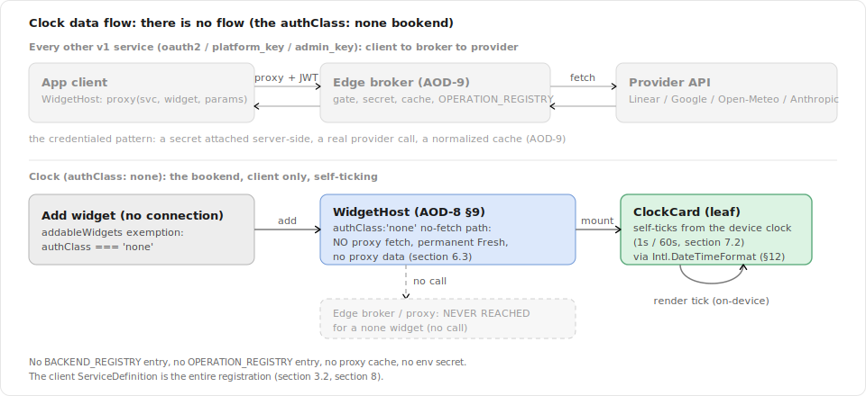
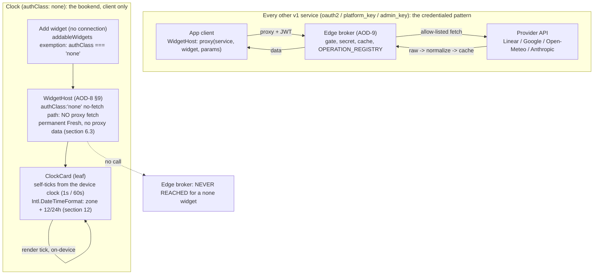
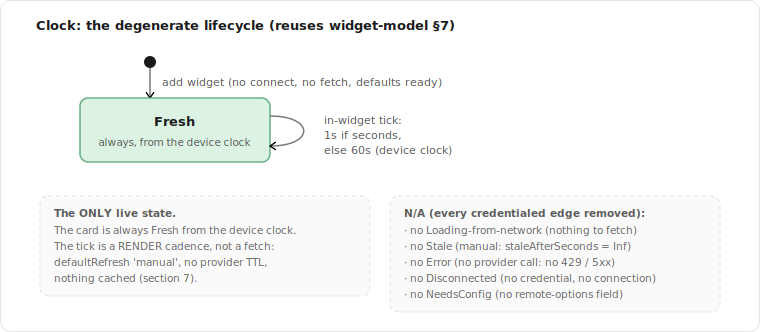
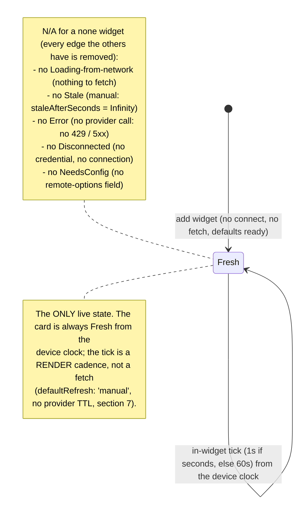

# Spec: Clock / Date Integration (Local Time, Date)

> Status: draft for review, 2026-06-28. Tracked by [AOD-34](https://linear.app/thexap/issue/AOD-34) (`type:spec`). The **fifth per-integration spec** and the **first and only `authClass: none` one**. It fills the same interior that [AOD-8](https://linear.app/thexap/issue/AOD-8) (registry seam), [AOD-9](https://linear.app/thexap/issue/AOD-9) (broker + proxy), and [AOD-10](https://linear.app/thexap/issue/AOD-10) (widget model) framed, now for a service that **fetches nothing**. It mirrors [`integration-weather.md`](integration-weather.md) ([AOD-57](https://linear.app/thexap/issue/AOD-57)), [`integration-claude.md`](integration-claude.md) ([AOD-33](https://linear.app/thexap/issue/AOD-33)), and [`integration-calendar.md`](integration-calendar.md) ([AOD-32](https://linear.app/thexap/issue/AOD-32)) section for section, but it **inverts** them: where they prove the per-widget seam carries a credentialed network fetch, Clock proves the seam carries a widget with **no auth, no backend, no proxy, no operation, no cache, and no network**. It opens I-M3 "Clock & widget polish" and is the **last remaining v1 integration spec**.
>
> Clock is the architectural **bookend**. Every prior service has **both** registry halves: a client `ServiceDefinition` **and** a server `BACKEND_REGISTRY` entry (Linear, Google Calendar, Weather, Claude usage), almost always with an `OPERATION_REGISTRY` entry too. Clock has **only the client half**. It is the symmetric opposite of the credentialed services: where Claude usage is the highest-sensitivity credential in the set, Clock has no credential at all; where Weather's location lives on a connection, Clock has no connection; where every prior widget reads a normalized payload from the proxy, Clock self-renders from the **device clock**. It is also Xavier's own dogfood: the project was born as a Fire HD 8 wall dashboard, and a wall clock is the quintessential ambient widget ([AOD-10](https://linear.app/thexap/issue/AOD-10) §8 already names "a clock that shifts to a deep red" as its canonical `useAmbient()` example).
>
> Two findings are load-bearing. (1) `authClass: 'none'` is **already in the taxonomy** (`AuthClass` in `apps/app/src/registry/types.ts`, mirrored server-side) and Clock is **already the sole `addableWidgets` exemption coded** (`registry.ts`: `s.authClass === 'none' || connected.has(s.id)`), so a `none` service's widgets are addable with **no connection**. There is **no `clock` entry in the server `BACKEND_REGISTRY` or `OPERATION_REGISTRY` today, and there should be none**: Clock is client-only by design. (2) The host **always fetches** today (`WidgetHost.tsx` runs a TanStack `useQuery` with `enabled: !!def` calling `dataSource.fetch`). A `none` widget has nothing to fetch, and worse, a fetch would proxy to a service the server does not know (`getBackend("clock")` throws `unknown_service`). So this spec **decides** the one generic refinement, **not deferring it**: the host's `authClass: 'none'` path renders the card **with no proxy fetch**, permanently Fresh, and the widget **self-ticks from the device clock**. This is the `none` analogue of Weather's `platform_key` host params-seeding ([AOD-58](https://linear.app/thexap/issue/AOD-58)) and Claude's `401 -> reauth_required` detector ([AOD-59](https://linear.app/thexap/issue/AOD-59)): exactly **one** generic per-auth-class refinement, generic so every future no-auth widget rides it.
>
> Unlike the credentialed integrations (verified against a network API, live or doc), Clock has **no network API to verify**. Its load-bearing facts are **device-API facts**: that Hermes' built-in `Intl.DateTimeFormat` supports IANA time zones and 12/24-hour formatting on the validated New-Arch / Fire HD 8 stack ([AOD-48](https://linear.app/thexap/issue/AOD-48)). These are stated in section 12 and **flagged for on-device re-verification** by the build, the same posture the other specs used for live re-verification.

## 1. Purpose and scope

The platform is shipped: the registry seam ([AOD-8](https://linear.app/thexap/issue/AOD-8)), the broker and proxy ([AOD-9](https://linear.app/thexap/issue/AOD-9)), the widget model ([AOD-10](https://linear.app/thexap/issue/AOD-10)), the remote-options engine ([AOD-53](https://linear.app/thexap/issue/AOD-53)), and the per-widget operation seam ([AOD-55](https://linear.app/thexap/issue/AOD-55)) refined for REST ([AOD-56](https://linear.app/thexap/issue/AOD-56)), and Linear, Google Calendar, Weather, and Claude usage all rode them end to end. Clock is the **fifth real service**, the **first and only `none`** one, and the first that participates in the registry through **one half**. This spec fixes how Clock plugs into the seam so the later build is registration (client half only) plus one leaf renderer plus one generic host refinement, with zero edits to the operation seam, the layout, the broker, the proxy, the connect path, or the settings internals, and **zero** new server-side code.

It fixes exactly five things:

1. **`authClass: 'none'` specifics**: the class (no auth, no connection, no credential, no connect flow), the **no server half** (the bookend, load-bearing), the strongest privacy posture (nothing leaves the device), and the degenerate connect/disconnect story (there is no connection row to retire).
2. **The one widget and its on-device "data" contract**: "Clock" (local time, with an optional date), realizing [AOD-4](https://linear.app/thexap/issue/AOD-4)'s Clock entry as a single card. Its "data" is **not** a proxy payload: the leaf derives it from the **device clock** each tick, formatted via `Intl.DateTimeFormat`, and the [AOD-8](https://linear.app/thexap/issue/AOD-8) §6.1 render contract `{ data, config, size }` is honored with **no live `data` from the proxy** (section 4).
3. **Per-instance config**: Clock is the **first `none` service with per-instance config** (12h/24h, show seconds, show date + date format, and time zone). Every field is **static and validated client-side**; the time zone is **device-local by default with an optional IANA-zone override** for a second clock. There is **no** [AOD-53](https://linear.app/thexap/issue/AOD-53) option source and **no** membership re-check (section 5).
4. **The operation seam, here a NON-operation, plus the one host refinement**: there is **no `OPERATION_REGISTRY.clock`** (nothing to build, nothing to normalize) and **no proxy call at all**; the single new generic mechanism is the host's `authClass: 'none'` **no-fetch + self-tick** path, decided here and named for the build (section 6).
5. **The on-device tick (not a provider TTL)**: a `none` widget has no provider to protect, so [AOD-10](https://linear.app/thexap/issue/AOD-10)'s `cacheTtlSeconds` / `minRefreshSeconds` and the proxy cache do **not** apply; liveness comes from an **in-widget render ticker** reading the device clock (every second when seconds are shown, else every minute), with `defaultRefresh: 'manual'`. The lifecycle is degenerate: effectively always **Fresh** (section 7, section 9).

**In scope:** the `none` registry participation (client half only), the on-device data contract, the per-instance config model (including the time-zone decision), the on-device tick model, the one generic host refinement (the no-fetch self-ticking `none` path), and the not-touched footprint that makes Clock a client-only, registration-plus-one-refinement add.

**Out of scope (neighbors named so the frame is clear):**

- **The build** of the Clock widget, the leaf renderer, and the host `none` refinement is a separate I-M3 `type:tech-task` created after this spec lands, implementing it the [AOD-58](https://linear.app/thexap/issue/AOD-58) / [AOD-59](https://linear.app/thexap/issue/AOD-59) way (registration on the seam plus the one generic per-auth-class refinement). This spec is the design it implements.
- **The Clock visual design** ([AOD-37](https://linear.app/thexap/issue/AOD-37), `type:design`) and the **on-demand refresh affordance** ([AOD-15](https://linear.app/thexap/issue/AOD-15)) it bundles. This spec fixes the on-device data the leaf receives and the config that shapes it; it does not fix how the card looks, digital-versus-analog face, typography, or the deep-red night palette (the [AOD-10](https://linear.app/thexap/issue/AOD-10) §8 `useAmbient()` opt-in is named as a design seam, section 10).
- **An analog clock face**, **world-clock multi-instance polish** (a single widget showing many zones, a curated zone picker, per-zone labels), and **alarms / timers / stopwatch**: none are v1 widgets. v1 enables a basic second clock by adding a second Clock instance with a zone override (section 5.2).
- **The design polish of the already-built widgets** ([AOD-35](https://linear.app/thexap/issue/AOD-35) Calendar + Weather visuals, [AOD-36](https://linear.app/thexap/issue/AOD-36) Claude visuals) and the **deferred Claude live cents re-verification** ([`integration-claude.md`](integration-claude.md) §12). Referenced as siblings, not authored here.
- **The personal-engine "Claude Limits" widget** ([AOD-14](https://linear.app/thexap/issue/AOD-14)): a different, device-pushed `device_push` widget, unrelated to Clock beyond both being non-standard-fetch.
- **Broker mechanics, the proxy, the layout engine, and Settings internals** are [AOD-9](https://linear.app/thexap/issue/AOD-9) / [AOD-7](https://linear.app/thexap/issue/AOD-7) / [AOD-8](https://linear.app/thexap/issue/AOD-8)'s. Clock touches none of them (section 8).

Every device-API claim below is verified against the Hermes / React Native Intl documentation on **2026-06-28** and cited in section 12. Unlike Weather (live) and Claude usage (doc), Clock has **no network API**: the claims are **device capabilities** of the shipped Vela stack (Expo SDK ~56, React Native 0.85, New Architecture, Hermes, no Intl polyfill in the tree), **flagged for on-device re-verification** on the Fire HD 8 at build. Nothing is invented; the build re-verifies on-device and updates section 12 if anything differs.

## 2. Locked context this builds on

| Source | What it locks | How this spec uses it |
|---|---|---|
| [AOD-8](https://linear.app/thexap/issue/AOD-8) §5.1 | The client half (`ServiceDefinition`): id, displayName, icon, `authClass`, widgets. The client half never carries a secret or a provider URL. | Section 8 is Clock's **entire** registration: the client `ServiceDefinition` is the whole footprint (no server half). |
| [AOD-8](https://linear.app/thexap/issue/AOD-8) §6 / §6.1 | `WidgetDefinition` shape; the render contract `render(data, config, size)`, invoked only with live data. | Section 4 fixes the Clock definition and reconciles the render contract for a widget whose "data" is the **device clock**, not a proxy payload. |
| [AOD-8](https://linear.app/thexap/issue/AOD-8) §9 invariant 2 / `addableWidgets` | The "add widget" picker offers only widgets whose parent service is connected, with `authClass: 'none'` the **sole exemption** (already coded). | Section 3.1 and section 9.1: Clock's widget is addable with **no connection**, by the exemption that already exists for it. |
| [AOD-8](https://linear.app/thexap/issue/AOD-8) §10 / §11 | The seam (generic engine never edited per service) and the "add a service by registration alone" proof, with a not-touched footprint. | Section 8 is the Clock instance of §11, the **client-only** case: a registration in one half plus one generic refinement. |
| [AOD-9](https://linear.app/thexap/issue/AOD-9) §4 | The auth-class taxonomy. `none` is the no-auth class: no OAuth, no key, no platform secret, no connection, the broker is never invoked. | Section 3 fills the `none` specifics as the symmetric opposite of the credentialed classes; the broker gains nothing. |
| [AOD-10](https://linear.app/thexap/issue/AOD-10) §4 / §4.4 | The config schema and field kinds; the render-time membership re-check for `remote-options` fields. | Section 5 sets a four-field **static** config; the membership re-check is **N/A** (no `remote-options` field). |
| [AOD-10](https://linear.app/thexap/issue/AOD-10) §6 / §6.6 | The two-layer refresh model (device cadence, provider cache TTL) and the `manual` refresh semantics. | Section 7 reconciles Clock's **render tick** against this **fetch** model: Clock is `manual` and has no provider cache (section 6, 7). |
| [AOD-10](https://linear.app/thexap/issue/AOD-10) §7 | The lifecycle states (loading, fresh, stale, error, disconnected, plus the needs_config edge) and which reach the renderer. | Section 9 walks Clock through this model and shows it is **degenerate** (effectively always Fresh). |
| [AOD-10](https://linear.app/thexap/issue/AOD-10) §8 + [AOD-11](https://linear.app/thexap/issue/AOD-11) §8 | The dimming hook: `dimsWithAmbient` (default true, global overlay) and the `useAmbient()` opt-in (the deep-red clock is the example); the kiosk schedule and curve that set `phase` / `dimLevel`. | Section 4 sets `dimsWithAmbient: true` for v1; section 10 names the `useAmbient()` deep-red night palette as a design seam. Clock is the central ambient widget. |
| [AOD-4](https://linear.app/thexap/issue/AOD-4) | The v1 widget set: **Clock** is a `none` widget. | Section 4 realizes Clock as one card (time, optional date), the single-widget reconciliation noted there. |
| [AOD-6](https://linear.app/thexap/issue/AOD-6) | The v1 service set: Linear, Google Calendar, Claude usage, Weather, **Clock**. | Clock is the fifth and last service wired, and the only `none` one. |
| [AOD-5](https://linear.app/thexap/issue/AOD-5) | Privacy posture: the proxy cache holds normalized data only, per-user, encrypted, purged on disconnect / delete; credentials are server-side. | Section 3.3: Clock satisfies this **trivially and maximally**, because there is no provider call, no cache, no credential, and nothing to purge. |

The shipped client registry already anticipates Clock. The exemption and the comment, verbatim from `apps/app/src/registry/registry.ts`:

```typescript
export const SERVICE_REGISTRY: ServiceDefinition[] = [
  stubService,
  linearService,
  googleCalendarService,
  weatherService,
  anthropicUsageService,
  // The remaining v1 service (Clock) registers here the same way, as an entry + its widgets + leaf
  // renderers, with zero edits to the engine below.
];

/**
 * AOD-8 §9 invariant 2: the "add widget" picker offers only widgets whose parent service is
 * connected, with authClass "none" (Clock) the sole exemption. ...
 */
export function addableWidgets(connected: Set<ServiceId>): WidgetDefinition[] {
  return SERVICE_REGISTRY
    .filter((s) => s.authClass === 'none' || connected.has(s.id))
    .flatMap((s) => s.widgets);
}
```

And the taxonomy already carries the class, verbatim from `apps/app/src/registry/types.ts`:

```typescript
export type AuthClass = 'oauth2' | 'api_key' | 'admin_key' | 'platform_key' | 'none';
```

**Unlike every prior integration spec, there is no server registry block to quote here, because there is none.** The shipped server `BACKEND_REGISTRY` (`supabase/functions/_shared/registry.ts`) contains `linear`, `google_calendar`, `anthropic_usage`, `weather`, and `stub`, and **no `clock`**; the server `OPERATION_REGISTRY` (`supabase/functions/_shared/operations.ts`) contains the same four real services and **no `clock`**. That absence is the load-bearing fact of section 3.2, not an omission to fix.

## 3. `authClass: 'none'` specifics

### 3.1 The class and the (non-)flow

Clock is a `none` service ([AOD-9](https://linear.app/thexap/issue/AOD-9) §4). There is **no OAuth, no API key, no Admin key, no platform key, no consent screen, no code exchange, no refresh token, and no per-user secret**. There is, in fact, **no connection at all**: a `none` service has nothing to connect, so there is **no connect affordance** on the connections surface ([AOD-50](https://linear.app/thexap/issue/AOD-50)), no `credentials-store` POST, no `connections` row, and no `connections.config`. Clock is **always available**.

This is exactly why `none` is the **sole `addableWidgets` exemption**, already coded for Clock ([AOD-8](https://linear.app/thexap/issue/AOD-8) §9 invariant 2, section 2). Every other class gates its widgets behind a connection: a `platform_key` service like Weather is **not** exempt (`platform_key !== 'none'`), because it has a real connection (the user's location) that must exist before its widgets are addable. Clock alone is addable with no connection, because there is no connection to require. The Settings / connections surface therefore shows Clock without a connect / disconnect control; the build presents it as always-on (or omits it from the connectable list), reading `authClass` generically, with no engine edit.

### 3.2 No server half (the bookend, load-bearing)

This is the spec's load-bearing fact and the reason Clock is the architectural bookend. Every prior service is registered in **two** halves. Clock is registered in **one**. Concretely, Clock has **none** of the following, and should have none:

| Server-side artifact every credentialed / platform service has | Clock |
|---|---|
| `BACKEND_REGISTRY.<id>` entry (`apiBase`, `authClass`, `authHeaderStyle`, ...) | **None** |
| `endpoints` allow-list (the per-widget path map) | **None** |
| `oauth` block / `platformKeyEnv` / Vault secret | **None** |
| `OPERATION_REGISTRY.<id>` (`buildQuery` / `buildBody` / `normalize`) | **None** |
| A proxy call (the connection gate, the env / Vault read, the allow-listed fetch) | **None** |
| A proxy cache row (normalized payload, TTL) | **None** |
| An `OPTION_SOURCE_REGISTRY` entry | **None** |
| An OAuth broker path (`oauth-start` / `oauth-callback` / `token-refresh`) | **None** |

The credentialed services exist **because** OAuth client secrets and refresh tokens cannot ship inside a distributed app and must live server-side (the whole reason the broker exists, [CLAUDE.md](../../CLAUDE.md) "Why a backend exists at all"). Clock has **no secret and no provider**, so it has **no reason to touch the server**. Its entire registration is the client `ServiceDefinition` plus one leaf renderer (section 8). The symmetric framing: Claude usage (`admin_key`) is the **highest-sensitivity** server-attached credential in the set; Clock (`none`) is its exact opposite, a widget with nothing to attach, nothing to store, and nothing to send. Proving the seam absorbs both ends, the maximally-credentialed and the credential-free, is what makes the three-layer model ([CLAUDE.md](../../CLAUDE.md) services -> widgets -> layout) complete.

### 3.3 The strongest privacy posture (nothing leaves the device)

Because there is no provider call, Clock has the strongest privacy posture in the v1 set, and it satisfies [AOD-5](https://linear.app/thexap/issue/AOD-5) **trivially and maximally**:

- **Nothing leaves the device.** The leaf reads the device clock and the on-device IANA database (via `Intl`, section 12) and renders. No request, no token, no telemetry, no location, no provider, no proxy.
- **Nothing is cached.** There is no proxy cache row because there is no proxy call; [AOD-5](https://linear.app/thexap/issue/AOD-5)'s "normalized data only, TTL <= 900s, purged on disconnect" is vacuously satisfied (there is nothing to cache, no TTL, and nothing to purge).
- **Nothing to purge on disconnect or account deletion.** There is no connection row, no Vault secret, and no stored credential. The only Clock state is the per-instance **config** (format / zone preferences), which lives in the user's layout like any widget config and is removed with the instance, the same as every other widget.

Clock sits at the opposite end of the sensitivity axis from Claude usage's org-wide Admin key (section 3.2). It is the natural archetype for the ambient wall display the product was born from: a glance that needs no account, no network, and no trust boundary to cross.

### 3.4 Connect, reconnect, disconnect hooks (all degenerate)

| Event | Path | Notes |
|---|---|---|
| **Connect** | None | A `none` service needs no connection; its widgets are addable immediately (section 3.1). There is no `credentials-store` call and no `connections` row. |
| **Reconnect** | None | There is no credential that can expire or be revoked, so there is **no `reauth_required`** and **no `409 needs_reconnect`**. This is even simpler than Weather, which has a connection (a location) but also no reauth; Clock has no connection at all. |
| **Disconnect** | None | There is no connection to retire. The [AOD-8](https://linear.app/thexap/issue/AOD-8) invariant 3 "disconnect removes the service's widgets" never fires for Clock, because Clock is never connected and never disconnected. A user removes a Clock card by removing the **instance** from the layout, like any widget. |

So Clock has no connection lifecycle of any kind. Contrast the three credential shapes the prior specs fixed: `oauth2` (Calendar / Linear) refreshes and can reauth; `admin_key` (Claude usage) cannot refresh and reauths on a 401; `platform_key` (Weather) has a connection (a location) but no reauth. Clock (`none`) removes the connection itself. This makes its lifecycle the most degenerate of the five (section 9).

## 4. The widget and its on-device data contract

### 4.0 One widget, not two (the reconciliation)

[AOD-4](https://linear.app/thexap/issue/AOD-4)'s v1 set lists a single **Clock / Date** entry. This spec realizes it as **one** widget, "Clock," that always shows the time and **optionally** shows the date (a `showDate` toggle, section 5). This is the **inverse** of Weather's reconciliation: Weather's one "Current + Forecast" row became **two** cards (distinct ambient roles, distinct sizes); Clock's "Clock / Date" stays **one** card, because the time and its date are a **single glance**, not two roles. (A date-only card, or a `showTime` toggle, is a trivial future variant, section 10; v1 is one widget with the time always shown.)

### 4.1 Clock (the central ambient card)

The local time at the device (or at an optional override zone), with an optional date line. Default size spans the glanceable classes (`small` for a bedside-style time, up to `large` for a wall-dominating clock); the device cadence is the **in-widget tick** (section 7), not a provider poll.

**The on-device "data" (not a proxy payload).** Every prior widget receives a normalized `data` payload that the proxy fetched and normalized server-side. Clock receives **no live `data` from the proxy**, because there is no proxy call (section 6). Instead, the leaf **derives** its view from the **device clock** on each tick, formatting via `Intl.DateTimeFormat` with the instance config. The shape the leaf produces locally:

```typescript
// NOT a proxy payload, NOT normalized server-side, NOT cached. Derived IN THE LEAF from the device clock
// on each tick (section 7.2), formatted via Intl.DateTimeFormat with the instance config (section 5).
interface ClockView {
  time: string;        // formatted per clockFormat + showSeconds, e.g. "14:05" or "2:05:33 PM"
  date: string | null; // formatted per dateFormat when showDate is true, else null
  zone: string;        // the IANA zone actually used: the config override, or the resolved device-local zone
}
```

**Honoring the [AOD-8](https://linear.app/thexap/issue/AOD-8) §6.1 render contract.** The host still mounts the leaf as `render(data, config, size)`. For a `none` widget the host passes **no live proxy `data`** (it is `undefined`, section 6.3); the leaf **ignores `data`**, reads `config` and `size`, and reads the **device clock** for its content. The contract is preserved in shape (the renderer is a pure function of its inputs plus the device clock) while the **source** of liveness moves from the proxy to the device. This is the precise contractual statement of "the seam carries a widget that fetches nothing."

**Client-half definition** (the [AOD-10](https://linear.app/thexap/issue/AOD-10) model values filled in):

```typescript
const clock: WidgetDefinition = {
  type: "clock",
  serviceId: "clock",
  title: "Clock",
  supportedSizes: ["small", "medium", "wide", "large"],
  defaultRefresh: "manual",   // no provider to poll; liveness is the in-widget render tick (section 7)
  // cacheTtlSeconds / minRefreshSeconds: OMITTED. There is no provider to protect and nothing is cached
  // (section 7). The AOD-10 cache model assumes a proxy cache Clock does not have.
  dimsWithAmbient: true,      // the central ambient widget: dims with the host global overlay (AOD-10 §8, AOD-11)
  configSchema: { fields: [/* clockFormat, showSeconds, showDate, dateFormat, timezone; section 5 */] },
  render: ClockCard,          // self-ticking leaf; reads the device clock, receives no live proxy `data`
};
```

There is no empty / "nothing" state and no error payload: the device clock always has a value, so `ClockView` is unconditional (there is no `hasEvent: false` analogue). A malformed stored zone is a config-time concern that degrades to device-local at render (section 7.3), never a missing-data state.

## 5. Per-instance config model

### 5.1 The first `none` service with config

Weather and Claude usage are **zero-config** (their one choice, if any, lives on the connection). Clock is the **first `none` service with per-instance config**, and the config is what gives one Clock card its character. Every field is **static** (known at build time or validated against an on-device capability), so the config form is rendered fully **offline**, with no proxy round-trip. The four settled fields plus the one decided field (time zone, section 5.2), as [AOD-10](https://linear.app/thexap/issue/AOD-10) §4.1 fields:

```typescript
configSchema: {
  fields: [
    // 12h / 24h. Maps to Intl.DateTimeFormat hour12 / hourCycle (section 12).
    { key: "clockFormat", label: "Time format", kind: "enum", required: false, default: "24h",
      options: [ { value: "24h", label: "24-hour" }, { value: "12h", label: "12-hour" } ] },

    // Show seconds. Also drives the TICK cadence: true -> 1s tick, false -> 60s tick (section 7.2).
    { key: "showSeconds", label: "Show seconds", kind: "boolean", required: false, default: false },

    // Show the date line at all.
    { key: "showDate", label: "Show date", kind: "boolean", required: false, default: true },

    // Date format. Maps to Intl.DateTimeFormat dateStyle (section 12). A small closed set, no free text.
    { key: "dateFormat", label: "Date format", kind: "enum", required: false, default: "full",
      options: [
        { value: "full",   label: "Monday, June 28" },
        { value: "long",   label: "June 28, 2026" },
        { value: "medium", label: "Jun 28, 2026" },
        { value: "short",  label: "6/28/26" },
      ] },

    // Time zone (the one decision, section 5.2). Device-local by default; an optional IANA override for a
    // second clock. A STATIC string validated CLIENT-SIDE via Intl (NOT a remote-options field), so there
    // is no option source (section 5.3) and no membership re-check (section 5.4). "" / unset = device-local.
    { key: "timezone", label: "Time zone", kind: "string", required: false, default: "",
      placeholder: "Device local (e.g. America/New_York)" },
  ],
}
```

The config maps cleanly onto `Intl.DateTimeFormat` options (section 12): `clockFormat` to `hour12` / `hourCycle`, `showSeconds` to the presence of a seconds field, `dateFormat` to `dateStyle`, and `timezone` to `timeZone`. The leaf builds one or two formatters from the config and formats `new Date()` each tick.

### 5.2 The time-zone decision: device-local default plus an optional IANA override

**Decided here, not deferred** (the analogue of Weather's `platform_key` host-seeding decision and Claude's `401 -> reauth` decision, scaled to Clock's config surface): the `timezone` field is **device-local by default, with an optional IANA-zone override**.

- **Default (`""` / unset): device-local.** The leaf resolves the device zone via `Intl.DateTimeFormat().resolvedOptions().timeZone` (section 12) and formats in it. A default Clock follows the device wherever it travels, which is the right behavior for the primary wall clock.
- **Override: a single IANA zone string** (for example `America/New_York`, `Europe/Madrid`, `America/Guayaquil`). Setting it makes that instance a **second clock** for a fixed zone, independent of the device. This is the natural ambient case for a wall dashboard that watches a remote team's time alongside local time.
- **Static, validated client-side.** The IANA zone set is a **device capability**, not a per-user provider resource: the build validates an entered zone by attempting `new Intl.DateTimeFormat(undefined, { timeZone })` and catching the `RangeError` an invalid zone throws (section 12). The config form may present the field as a searchable picker seeded from `Intl.supportedValuesOf('timeZone')` (an on-device list, section 12), but the **stored shape is a single IANA string**, and the validation is entirely client-side.

This unlocks the second-clock use case for one field. The **multi-instance world-clock polish** (a single widget showing many zones, a curated zone picker, per-zone labels) stays out of scope (section 10): v1 makes a second clock by adding a second Clock **instance** with a zone override, which the existing layout and instance model already support with no new mechanism.

### 5.3 No widget option source

Could the time zone use the [AOD-53](https://linear.app/thexap/issue/AOD-53) remote-options engine (a `providerBackedSource` resolving zones through the proxy at config time)? **No, and it must not.** The [AOD-53](https://linear.app/thexap/issue/AOD-53) path exists to resolve a **per-user, provider-backed** set (the user's real Linear projects, their Google calendars) by attaching a credential server-side. Clock has **no provider and no credential**, and the IANA zone set is **static and device-resident** (every device ships the same IANA database, exposed through `Intl`). Resolving zones through the proxy would invent a server round-trip for a list the device already holds. So there is **no `clock` entry in `OPTION_SOURCE_REGISTRY`**, and the `timezone` field is an ordinary static field validated on-device (section 5.2), the deliberate opposite of Linear's `remote-options` `projectId`.

### 5.4 No membership re-check

Because Clock declares **no `remote-options` field**, the [AOD-10](https://linear.app/thexap/issue/AOD-10) §4.4 render-time membership re-check (which drove Calendar's "chosen calendar deleted" to `needs_config`) **does not apply**, exactly as for Weather and Claude usage. There is no provider-backed set a stored value can fall out of: the IANA zone set is static and does not drift, so a once-valid stored zone stays valid. The only "invalid config" would be a malformed stored field, which the client-side validation (section 5.2) prevents at config time, and which the leaf degrades to device-local at render anyway (section 7.3). So Clock has **no `needs_config` lifecycle edge** (section 9).

## 6. The operation seam: a NON-operation, plus the one host refinement

This is where Clock proves the seam holds by **not using it**. The operation seam carries per-widget request-building and normalization for services that fetch from a provider. Clock fetches from no provider, so it registers **no operation**, and the single new generic mechanism it needs is **not** in the operation seam, the proxy, or the providers boundary: it is the host's `authClass: 'none'` no-fetch path (section 6.3).

### 6.1 The non-operation

There is **no `OPERATION_REGISTRY.clock`**. Walking the three `WidgetOperation` members ([AOD-56](https://linear.app/thexap/issue/AOD-56), `operations.ts`):

- **No `buildBody`.** There is no GraphQL POST to build (that was Linear's member).
- **No `buildQuery`.** There is no provider URL query to build (that was Weather's location selectors and Calendar's / Claude's time-derived windows). There is no provider URL at all.
- **No `normalize`.** There is no raw provider response to map to a normalized payload. The only "normalization" Clock performs is turning a `Date` into formatted strings via `Intl`, and that happens **in the leaf, on-device** (section 6.4), not in a server operation.

`getOperation("clock", "clock")` would return `undefined`, which the proxy treats as a pass-through (raw body, no normalize) for operation-less services. But Clock never reaches even that branch, because the host never calls the proxy for it (section 6.2, 6.3). The contrast with the prior four services is total: each registered `buildQuery` / `buildBody` plus `normalize`; Clock registers **nothing server-side**, because there is nothing to build and nothing to normalize.

### 6.2 No path token, no query, no call

Weather and Claude exercised the "query parameters, no path token" corner of the [AOD-56](https://linear.app/thexap/issue/AOD-56) seam; Calendar exercised the "path token" corner. Clock exercises **none** of them: there is no path (no `apiBase`, no `endpoints`), no query, and **no provider call**. The `applyPathParams` machinery, the `buildQuery` branch, the connection gate, the cache, and the typed-error mapping are all **never reached** for a Clock widget. The widget's liveness is entirely on-device.

### 6.3 The one new generic mechanism: the host `authClass: 'none'` no-fetch + self-tick path

There is exactly one thing Clock needs that does not exist yet. It is **not** in the operation seam and **not** in the proxy: it is on the **client host**, and it is the `none` analogue of Weather's host params-seeding ([AOD-58](https://linear.app/thexap/issue/AOD-58)) and Claude's proxy `401` detector ([AOD-59](https://linear.app/thexap/issue/AOD-59)).

**Why.** The shipped host always fetches. `WidgetHost.tsx` runs a TanStack `useQuery` with `enabled: !!def`, whose `queryFn` calls `dataSource.fetch(...)`, which calls the proxy. For a `none` widget this is both pointless (there is nothing to fetch) and **broken**: `dataSource.fetch` would proxy to a service the server does not know, and the server's `getBackend("clock")` throws `HttpError(400, "unknown_service")` (`registry.ts`). So a Clock widget routed through the normal path would error on **every tick**. The host must **not** fetch for `none`.

**The decision.** Branch the host on `authClass: 'none'`: **do not run the proxy query**, render the card as permanently **Fresh** with no proxy `data`, and let the leaf **self-tick** from the device clock. Illustratively, against the shipped `WidgetHost.tsx` (which already carries the [AOD-58](https://linear.app/thexap/issue/AOD-58) `platform_key` seeding branch in the same spot):

```typescript
// WidgetHost.tsx: the one-time generic authClass:'none' no-fetch + self-tick path. A none widget has no
// server half (no backend, no operation), so dataSource.fetch would proxy to a service the server does
// not know (getBackend('clock') throws unknown_service). So DON'T fetch for none: disable the query and
// hand the leaf a permanent Fresh state with no proxy data; the leaf self-ticks from the device clock
// (section 7.2). Generic per AUTH CLASS, never per service: serves Clock and every future none widget.
const isLocal = service?.authClass === 'none';

const query = useQuery<ProxyResult, ProxyError>({
  queryKey: [key],
  queryFn: () => dataSource.fetch({ serviceId, widgetType, params }),
  enabled: !!def && !isLocal,            // none: no proxy fetch at all
  refetchInterval: /* unchanged; already false for a 'manual' widget */,
  // ...retry / retryDelay unchanged
});

// none synthesizes a permanent Fresh snapshot with no proxy data; the leaf reads the device clock.
const snapshot: WidgetQuerySnapshot = isLocal
  ? { status: 'success', data: undefined, fetchedAt: now() }   // always Fresh; the leaf self-derives
  : /* the existing query -> snapshot mapping (pending / error / success) */;
```

`deriveViewState` then yields **fresh** (no `needsConfig`, a success snapshot, `staleAfterSeconds === Infinity` for a `manual` widget), and the host invokes `ClockCard({ data: undefined, config, size })`, which ignores `data` and ticks from the device clock (section 4.1). The exact internal shape is a build detail; the **contract** this fixes is: `none` -> no proxy fetch -> permanent Fresh -> the leaf self-ticks.

**Why it is generic.** The branch keys on **`authClass`**, not on service id, so it serves Clock and **every future `none` widget** at once, and it leaves `oauth2` / `api_key` / `admin_key` / `platform_key` widgets byte-for-byte unchanged (they take the `else` and fetch as before). It is **one** small, additive, per-auth-class refinement, the third in the pattern the integration builds established: Weather added one generic `platform_key` mechanism (host seeding), Claude usage added one generic credentialed-class mechanism (the proxy `401` detector), and Clock adds one generic `none` mechanism (the host no-fetch path). After it lands, Clock and any future `none` widget are **registration-only** (a client `ServiceDefinition` plus a leaf). Its placement mirrors Weather's exactly: on the **host**, not the proxy (Weather threaded an input **in**; Claude mapped a failure **out**; Clock removes the fetch **entirely**).

### 6.4 Why client-side, not a server operation (the inverse of the prior specs)

The prior specs put request-building and `normalize` **server-side** for four reasons: the [AOD-8](https://linear.app/thexap/issue/AOD-8) §6.1 contract defines `data` as the proxy's normalized payload; the [AOD-5](https://linear.app/thexap/issue/AOD-5) cache must hold normalized data only; the [AOD-8](https://linear.app/thexap/issue/AOD-8) §4 trust boundary keeps the mapping of an **untrusted provider body** off the client; and the credential and the provider's field vocabulary must stay server-side. For Clock, **every one of those reasons vanishes**:

- There is **no provider body** to normalize; the device clock is a **trusted, local** source.
- There is **no cache** to keep clean (nothing is cached).
- There is **no credential** and **no provider vocabulary** to hide (the `none` class has neither).

So the formatting (`Date` -> strings via `Intl`) correctly lives **in the leaf, on-device**. This is the precise inverse of the credentialed services and the reason Clock has no server half (section 3.2): the server exists to hold secrets and normalize untrusted data, and Clock has neither, so the server has no role.

## 7. The on-device tick (no provider TTL)

### 7.1 No provider, no limits, no capacity seam

There is no third-party API, so there is **no rate limit, no shared budget** (Weather's per-IP free tier), **no per-user quota** (Claude's Admin API), and **no settlement lag** (Claude's daily cost). Capacity, cost, and the commercial-tier question are all **N/A**. The only resource Clock consumes is a render timer on the device.

### 7.2 The tick is a render cadence, not a fetch cadence

[AOD-10](https://linear.app/thexap/issue/AOD-10) §6 defines **two** cadences, both about **fetching**: the device cadence (how often a device asks the proxy) and the provider cadence (how often the proxy calls the provider, the cache TTL). Clock has **neither**, because it never fetches. Its liveness is a **third, orthogonal** thing: a **render tick**, how often the leaf redraws from the **local** device clock. The reconciliation:

- **`defaultRefresh: 'manual'`** opts Clock out of the provider-poll model. Per [AOD-10](https://linear.app/thexap/issue/AOD-10) §6.6 a `manual` widget "schedules no timer" and "never enters the stale state from a missed tick," which is exactly right: there is no provider tick to miss. Combined with the section 6.3 `none` branch (which disables the query outright), Clock issues no proxy call at all.
- **`cacheTtlSeconds` / `minRefreshSeconds` are omitted (N/A).** They protect a provider; Clock has none. The [AOD-10](https://linear.app/thexap/issue/AOD-10) §6.1 "a `manual` widget still caches (base 300)" rule assumes a proxy cache that, for a `none` widget, does not exist and is never reached.
- **The render tick lives in the leaf.** `ClockCard` owns an in-widget interval: every **1 second** when `showSeconds` is true, else every **60 seconds**. Each tick re-reads `new Date()` and reformats via `Intl`. Illustratively:

```typescript
// ClockCard (leaf): self-tick from the device clock. The cadence depends on showSeconds (THIS widget's
// own config), so it lives in the leaf, which keeps the host generic (it never learns "clock", section 6.3).
// This is a RENDER tick (redraw from a local source), NOT the AOD-10 §6 provider poll (there is no provider).
function useClockTick(showSeconds: boolean): Date {
  const [now, setNow] = useState(() => new Date());
  useEffect(() => {
    const periodMs = showSeconds ? 1000 : 60000;
    // Align the first tick to the next second/minute boundary so the display flips cleanly, not on a drift.
    const delay = periodMs - (Date.now() % periodMs);
    let interval: ReturnType<typeof setInterval> | undefined;
    const timeout = setTimeout(() => {
      setNow(new Date());
      interval = setInterval(() => setNow(new Date()), periodMs);
    }, delay);
    return () => { clearTimeout(timeout); if (interval) clearInterval(interval); };
  }, [showSeconds]);
  return now;
}
```

The tick aligns to the wall boundary so a seconds display flips on the second, not on a drifting offset; that is a build refinement, named here, not a new mechanism. In kiosk the foreground timer runs continuously ([AOD-10](https://linear.app/thexap/issue/AOD-10) §6.5), so the clock ticks all day; when the app backgrounds, the interval pauses with the app and the leaf re-reads the clock on the next foreground (a `Date` read, not a fetch), so it is never wrong on return, only paused while hidden.

### 7.3 Error mapping: nothing to map

Clock makes **no provider call**, so there is **no 429, no 5xx, no 401, and no `409`**: no `rate_limited`, no `provider_unavailable`, no `reauth_required`. The card cannot enter the **error** or **disconnected** lifecycle states from a fetch, because there is no fetch (section 9). The one defensive case is internal: if `Intl` were to throw on a malformed stored zone (it should not, given the client-side validation of section 5.2), the leaf **falls back to the device-local zone** and renders, a render-time degradation, not a lifecycle error. Where Weather had **zero** error-mapping work but still rode the generic 429 path, Clock has **no error surface at all**.

## 8. Registry slotting: the seam holds (client half only)

Adding Clock is registration in **one** half plus one leaf renderer, plus the one-time generic host refinement (section 6.3, counted once and shared with every future `none` widget). There is **no server-side code**: no `BACKEND_REGISTRY` entry, no `OPERATION_REGISTRY` entry, no endpoints, no env secret, no proxy / broker / option-source touch.

**Client half** (`apps/app/src/registry/services/clock/`, new):

```typescript
export const clockService: ServiceDefinition = {
  id: "clock",
  displayName: "Clock",
  icon: "clock",
  authClass: "none",
  widgets: [clock],   // section 4.1
};
```

plus the `ClockCard` leaf component, and one registration line in the client registry index (the slot the shipped comment already reserves, section 2). `addableWidgets` already exempts `authClass === 'none'`, so the Clock widget is addable with **no connection** and **no engine edit**.

**Server half:** **none**, by design (section 3.2). This is the bookend: the first and only service that is registration in **one** half.

The footprint, in the [AOD-8](https://linear.app/thexap/issue/AOD-8) §11 style:

| File / module | Added, edited, or untouched | Why |
|---|---|---|
| `registry/services/clock/*` (definition, 1 renderer) | Added | The new service, self-contained, client-only. |
| client registry index | Edited: +1 line | The declared client extension point (the slot the shipped comment reserves). |
| `host/WidgetHost.tsx` (`authClass:'none'` no-fetch + self-tick) | Edited: **once, generic** | Skip the proxy fetch for `none`, render permanent Fresh, leaf self-ticks; serves every `none` widget (section 6.3). |
| `_shared/registry.ts` (`BACKEND_REGISTRY`) | **Untouched** | Clock has no server backend, no `apiBase`, no `endpoints` (section 3.2). |
| `_shared/operations.ts` (`OPERATION_REGISTRY`, `WidgetOperation`) | **Untouched** | Clock registers no operation: nothing to build, nothing to normalize (section 6.1). |
| `proxy/handler.ts` (gate, query, cache, error mapping) | **Untouched / never reached** | A `none` widget makes no proxy call at all (section 6.2). |
| `_shared/providers.ts`, `_shared/connection.ts` | **Untouched / never reached** | No provider call, no secret to attach or read. |
| `credentials-store` + `CredentialForm` | **Untouched** | A `none` service has no connect flow (section 3.1). |
| `_shared/option-sources.ts` (`OPTION_SOURCE_REGISTRY`) | **Untouched** | The zone field is a static on-device list, not a remote-options source (section 5.3). |
| OAuth broker (`oauth-start` / `oauth-callback` / `token-refresh`) | **Untouched** | Clock is `none`: no OAuth, no consent, no refresh (section 3). |
| Layout engine ([AOD-7](https://linear.app/thexap/issue/AOD-7)) | Untouched | Clock instances are ordinary rects. |
| Widget host / dashboard renderer (mount path) | Untouched (beyond the one generic `none` branch) | Resolves via the registry and mounts `render`; never names Clock. |

Clock introduces the `none` class to the running system, so the broker, the proxy, the operation seam, and the option sources gain **nothing**, several of them not merely untouched but **never reached** for a `none` widget. The one generic host edit serves every future `none` widget. The seam holds, in one half.



<details>
<summary>Mermaid source</summary>



</details>

## 9. Worked path: Clock add to lifecycle

### 9.1 Add (no connect, zero friction)

There is no connect step. Clock is `none`, so the `addableWidgets` exemption already makes its widget addable with no connection ([AOD-8](https://linear.app/thexap/issue/AOD-8) §9 invariant 2, section 3.1). Adding **Clock** needs **no config form to be completed**: every field has a default (device-local zone, 24-hour, seconds off, date on, `full` date format), so the instance persists immediately with the default config and is **ready at once**. There is no option resolution and no `validateConfig` gate beyond "the schema has no required fields," and no proxy call is ever made. The user may then open config to switch to 12-hour, turn on seconds, or set a zone override for a second clock (section 5).

### 9.2 The degenerate lifecycle (effectively always Fresh)

This reuses the [AOD-10](https://linear.app/thexap/issue/AOD-10) §7 model, and it is the most degenerate of the five integrations: Clock **removes** every edge the others have. Which states apply:

- **Loading (from network): N/A.** There is no fetch, so there is no first-load pending state. The card is ready on mount (the host hands the leaf a Fresh state immediately, section 6.3).
- **Fresh: YES, and it is the only live state.** The card is effectively **always Fresh** from the device clock, re-rendered by the in-widget tick (section 7.2).
- **Stale: N/A.** Staleness is `now - fetchedAt > staleAfterSeconds`; a `manual` widget has `staleAfterSeconds === Infinity` (`WidgetHost.tsx`), so it never staleness-expires. The device clock is never stale.
- **Error (`rate_limited` / `provider_unavailable`): N/A.** No provider, no fetch that can fail (section 7.3).
- **Disconnected (`reauth_required`): N/A.** No credential, no connection (section 3.4).
- **needs_config (from membership): N/A.** No `remote-options` field, so the [AOD-10](https://linear.app/thexap/issue/AOD-10) §4.4 re-check never fires (section 5.4). An invalid stored zone degrades to device-local at render (section 7.3), not to `needs_config`.

So the only live state is **Fresh**, with the in-widget tick as its self-loop. Where Claude usage **added** a reauth edge to Weather's shape, Clock **subtracts** every edge: it is the lower bound of the lifecycle model, the proof that the same state machine that carries a credentialed, fetching widget also collapses cleanly to a single self-ticking state.



<details>
<summary>Mermaid source</summary>



</details>

## 10. Seams left open (named, not decided)

| Seam | Owner | What this spec leaves clean |
|---|---|---|
| The **build** of the Clock widget, the leaf renderer, and the host `none` refinement | I-M3 `type:tech-task` | This spec fixes the contracts; the tech-task implements them the [AOD-58](https://linear.app/thexap/issue/AOD-58) / [AOD-59](https://linear.app/thexap/issue/AOD-59) way (registration + one generic refinement). |
| The **`authClass:'none'` host no-fetch + self-tick path** (section 6.3) | I-M3 build | Specified as a one-time generic per-auth-class refinement on the host; the `none` analogue of Weather's seeding and Claude's detector, shared by every future `none` widget. |
| The **Clock visual design** (digital vs analog face, typography, layout) and the **on-demand refresh affordance** | [AOD-37](https://linear.app/thexap/issue/AOD-37) (`type:design`), [AOD-15](https://linear.app/thexap/issue/AOD-15) | This spec fixes the on-device `ClockView` and the config that shapes it; the look is AOD-37's. The AOD-15 refresh button is host chrome and a no-op for an always-live clock. |
| The **`useAmbient()` deep-red night palette** | [AOD-37](https://linear.app/thexap/issue/AOD-37) / future | v1 sets `dimsWithAmbient: true` (the host global overlay). [AOD-10](https://linear.app/thexap/issue/AOD-10) §8's own example, a clock that shifts to deep red at night, is a design opt-in (`dimsWithAmbient: false` + `useAmbient()`), additive and named, not built. |
| A **world-clock multi-instance polish** (one widget, many zones; a curated zone picker; per-zone labels) | future | v1 enables a second clock by adding a second Clock **instance** with a zone override (section 5.2); a single multi-zone widget is additive. |
| A **date-only variant** or a **`showTime` toggle** | future | v1 is one widget with the time always shown and the date optional (section 4.0); a date-only card is a trivial future variant. |
| **Alarms / timers / stopwatch** | future | Not v1 widgets; they would be new widgets (and some, new services), not config on Clock. |
| An **Intl polyfill fallback** (`@formatjs/intl-datetimeformat` + tz data) | I-M3 build, only if needed | If on-device verification (section 12) finds a Hermes `Intl` gap on the Fire HD 8 (a missing zone, a `hourCycle` quirk), the build bundles a polyfill. Named as a contingency, not a v1 dependency; the shipped tree has no polyfill today. |
| A **device-locale-seeded default** for `clockFormat` / `dateFormat` | I-M3 build | The build may seed the initial config from `Intl.DateTimeFormat().resolvedOptions()` (the device's `hourCycle`, locale); the stored value always wins. A nicety, not a contract. |

## 11. Proposed acceptance

Proposed acceptance for this spec (call out for confirmation):

> 1. The `authClass: 'none'` specifics are fixed as the symmetric opposite of the credentialed services: **no auth, no connection, no credential, no connect / reconnect / disconnect**, and crucially **no server half** (no `BACKEND_REGISTRY` entry, no `OPERATION_REGISTRY` entry, no proxy call, no cache, no env secret), with the **strongest privacy posture** (nothing leaves the device) satisfying [AOD-5](https://linear.app/thexap/issue/AOD-5) trivially, and the `addableWidgets` `none` exemption (already coded) making the widget addable with no connection.
> 2. Clock is **one** widget (time always shown, date optional), realizing [AOD-4](https://linear.app/thexap/issue/AOD-4)'s "Clock / Date" as a single card, whose on-device `ClockView` is **derived in the leaf from the device clock** via `Intl.DateTimeFormat`, honoring the [AOD-8](https://linear.app/thexap/issue/AOD-8) §6.1 render contract with **no live proxy `data`**.
> 3. The per-instance config is **static and client-validated** (12h/24h, show seconds, show date + date format, and a **device-local-default time zone with an optional IANA override** for a second clock), with **no** [AOD-53](https://linear.app/thexap/issue/AOD-53) option source and **no** membership re-check, so there is **no `needs_config` edge**.
> 4. The operation-seam usage is a **NON-operation** (no `OPERATION_REGISTRY.clock`, no `buildQuery` / `buildBody` / `normalize`, no path token, **no proxy call at all**) plus exactly **one** new generic mechanism, the host **`authClass: 'none'` no-fetch + self-tick** path (decided here, the `none` analogue of [AOD-58](https://linear.app/thexap/issue/AOD-58) / [AOD-59](https://linear.app/thexap/issue/AOD-59)), with the **render tick** (1s / 60s, in the leaf) reconciled against [AOD-10](https://linear.app/thexap/issue/AOD-10)'s provider-poll model (`defaultRefresh: 'manual'`, no `cacheTtl`, no proxy cache).
> 5. The registry slotting is **client half only**, with a not-touched footprint showing the operation seam, the proxy, the broker, the option sources, and the connect path untouched (several never reached), the lifecycle **degenerate** (effectively always Fresh, every other edge N/A), and the diagrams validate.

| Acceptance clause | Where |
|---|---|
| `none` specifics: no auth, no server half, strongest privacy, degenerate connect | Sections 3.1 to 3.4 |
| One widget; on-device `ClockView`; render contract honored with no proxy data | Sections 4.0, 4.1 |
| Static config; time-zone decision; no option source; no membership re-check | Sections 5.1 to 5.4 |
| Non-operation; the one host no-fetch refinement; the render tick vs the AOD-10 model | Sections 6, 7 |
| Client-only registry slotting + footprint; validated diagrams | Section 8; sections 8 and 9.2 diagrams |
| Degenerate lifecycle; seams left open; proposed acceptance | Sections 9, 10, 11 |

## 12. Verified device-API facts

Clock has **no network API**. Its load-bearing facts are **device capabilities** of the shipped Vela stack, verified against the Hermes / React Native `Intl` documentation on **2026-06-28** and **flagged for on-device re-verification** on the Fire HD 8 ([AOD-48](https://linear.app/thexap/issue/AOD-48) validated New-Arch stack) by the build, the same posture the other specs used for live re-verification.

- **The stack.** Vela runs on **Expo SDK ~56, React Native 0.85, New Architecture enabled, Hermes** (the default and only fully-supported New-Arch JS engine; `app.json` sets `newArchEnabled: true` and declares no alternate `jsEngine`). The dependency tree carries **no `Intl` polyfill** (`@formatjs/*` absent), so Clock depends on Hermes' **built-in `Intl`**. **Flag:** if the on-device build finds a gap, add a polyfill (section 10).
- **`Intl.DateTimeFormat` availability.** Hermes ships `Intl` (React Native >= 0.70). On Android it delegates to the platform ICU (`android.icu`); on iOS to Foundation. `new Intl.DateTimeFormat(locale, options).format(new Date())` is the leaf's one formatting call. **Flag:** confirm on the Fire HD 8 (Android) build.
- **IANA `timeZone` support (the load-bearing one, the second-clock case).** `new Intl.DateTimeFormat(undefined, { timeZone: 'America/New_York' })` formats in an arbitrary IANA zone via the platform ICU; an invalid zone throws `RangeError`, which is the **client-side validation** of section 5.2. **Flag:** confirm arbitrary IANA zones resolve on the Fire HD 8.
- **12 / 24-hour formatting.** `{ hour12: true }` / `{ hour12: false }` (or `{ hourCycle: 'h23' | 'h12' }`) selects the `clockFormat` field's behavior. `{ second: '2-digit' }` (or a `timeStyle` that includes seconds) drives the `showSeconds` display.
- **Date formatting.** `{ dateStyle: 'full' | 'long' | 'medium' | 'short' }` maps directly to the `dateFormat` enum (section 5.1); `'full'` yields a weekday-led string ("Monday, June 28").
- **Resolving the device zone (the default).** `new Intl.DateTimeFormat().resolvedOptions().timeZone` returns the device-local IANA zone, which the leaf uses when the `timezone` field is unset (section 5.2).
- **Optional on-device zone list.** `Intl.supportedValuesOf('timeZone')` (ES2022) returns the device's IANA zone list, which the config form may use to render a searchable picker, entirely on-device, no proxy. **Flag:** confirm availability under Hermes; if absent, the picker ships a bundled static list (a build detail, not a contract).
- **No network verification is possible or needed.** Every fact above is a device capability re-verified **on-device** at build, never against a network API. If a build-time detail differs from the above, fix the build against the device, then update this section.

## 13. References

- [AOD-34](https://linear.app/thexap/issue/AOD-34): this spec's tracking issue.
- [AOD-8](https://linear.app/thexap/issue/AOD-8): registry contract. The seam this slots into; §5.1 (client half), §6.1 (render contract), §9 invariant 2 (`addableWidgets` `none` exemption), §11 (registration-only). [`architecture-registry.md`](architecture-registry.md).
- [AOD-9](https://linear.app/thexap/issue/AOD-9): broker + proxy. The auth-class taxonomy (§4) Clock's `none` class joins; referenced to show the broker gains nothing. [`oauth-token-model.md`](oauth-token-model.md).
- [AOD-10](https://linear.app/thexap/issue/AOD-10): widget model. Owns the config kinds (§4), the refresh model (§6, the `manual` semantics Clock reuses), the lifecycle (§7, here degenerate), and the dimming hook (§8, the deep-red clock example). [`widget-model.md`](widget-model.md).
- [AOD-11](https://linear.app/thexap/issue/AOD-11): kiosk mode. Clock is the central ambient widget; §8 owns the schedule and curve behind `dimsWithAmbient` / `useAmbient()`. [`kiosk-mode.md`](kiosk-mode.md).
- [AOD-53](https://linear.app/thexap/issue/AOD-53): the remote-options engine. Named to say Clock does **not** use it (section 5.3).
- [AOD-55](https://linear.app/thexap/issue/AOD-55) + [AOD-56](https://linear.app/thexap/issue/AOD-56): the per-widget operation seam, REST-refined. Clock registers **no** operation; it is the seam's NON-operation case (section 6). [`integration-calendar.md`](integration-calendar.md) §6.
- [AOD-57](https://linear.app/thexap/issue/AOD-57) / [AOD-33](https://linear.app/thexap/issue/AOD-33) / [AOD-32](https://linear.app/thexap/issue/AOD-32): the Weather, Claude usage, and Calendar integration specs this mirrors section for section. [`integration-weather.md`](integration-weather.md), [`integration-claude.md`](integration-claude.md), [`integration-calendar.md`](integration-calendar.md).
- [AOD-58](https://linear.app/thexap/issue/AOD-58) + [AOD-59](https://linear.app/thexap/issue/AOD-59): the Weather and Claude usage builds. The per-auth-class one-refinement pattern Clock continues: Weather added one generic `platform_key` host mechanism, Claude usage one generic credentialed-class proxy mechanism, Clock one generic `none` host mechanism (section 6.3).
- [AOD-4](https://linear.app/thexap/issue/AOD-4): v1 widget set. Locks **Clock** as a `none` widget (realized as one card, section 4).
- [AOD-6](https://linear.app/thexap/issue/AOD-6): v1 service set (Linear, Google Calendar, Claude usage, Weather, **Clock**).
- [AOD-5](https://linear.app/thexap/issue/AOD-5): privacy posture. Clock satisfies it trivially and maximally (nothing leaves the device, nothing cached, nothing to purge; section 3.3).
- [AOD-48](https://linear.app/thexap/issue/AOD-48): the validated New-Arch / Fire HD 8 stack. The device the section 12 `Intl` facts are flagged to re-verify on.
- [AOD-37](https://linear.app/thexap/issue/AOD-37) Clock visual design, [AOD-15](https://linear.app/thexap/issue/AOD-15) on-demand refresh, [AOD-14](https://linear.app/thexap/issue/AOD-14) personal Claude limits widget: referenced neighbors (section 10).
- [`docs/engineering-process.md`](../engineering-process.md): the `type:spec` lifecycle and the `docs/specs/` convention.
- Hermes / React Native `Intl` verified 2026-06-28 (docs only; device re-verification flagged for the build): `Intl.DateTimeFormat` with `timeZone` (IANA), `hour12` / `hourCycle`, `dateStyle`, `resolvedOptions().timeZone`, and `Intl.supportedValuesOf('timeZone')` on the New-Arch / Hermes stack.
