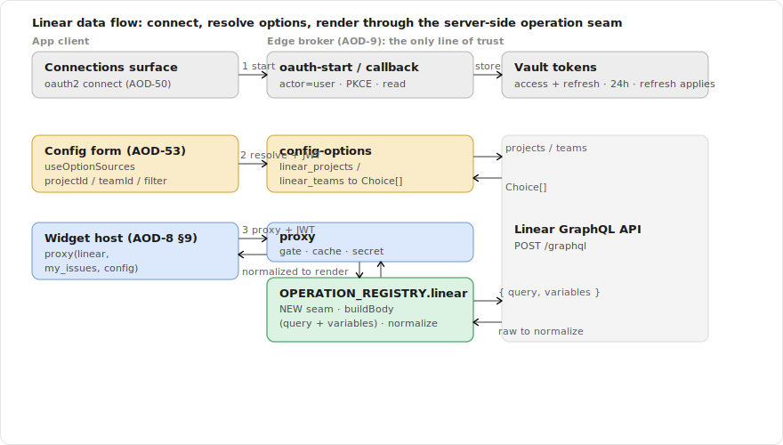
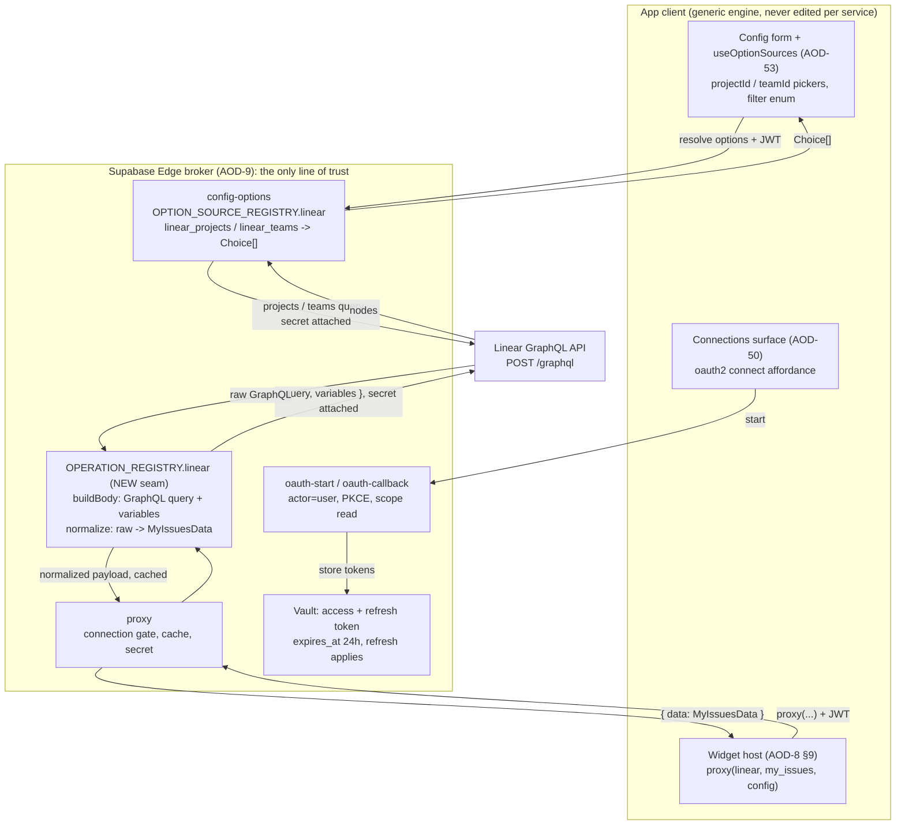
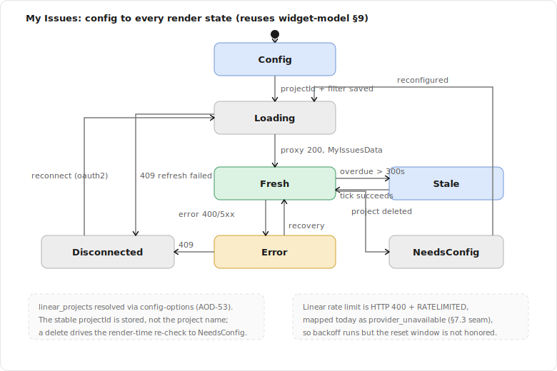

# Spec: Linear Integration (My Issues, Current Cycle)

> Status: draft for review, 2026-06-26. Tracked by [AOD-31](https://linear.app/thexap/issue/AOD-31) (`type:spec`). The **first per-integration spec**: it fills the interior that [AOD-8](https://linear.app/thexap/issue/AOD-8) (registry seam), [AOD-9](https://linear.app/thexap/issue/AOD-9) (OAuth broker + proxy), and [AOD-10](https://linear.app/thexap/issue/AOD-10) (widget model) framed for one concrete service, and it consumes the generic remote-options engine shipped in [AOD-53](https://linear.app/thexap/issue/AOD-53). It establishes the structure the Calendar / Claude / Clock specs ([AOD-32](https://linear.app/thexap/issue/AOD-32) / [AOD-33](https://linear.app/thexap/issue/AOD-33) / [AOD-34](https://linear.app/thexap/issue/AOD-34)) mirror. It gates the PS-M3 first vertical slice (Linear "My Issues").
>
> Two findings here touch a seam not yet built and one prior spec. (1) Linear data is GraphQL, so the widget data path needs the **per-widget operation held server-side** that [AOD-8](https://linear.app/thexap/issue/AOD-8) §5.2 anticipated (the query plus the raw-to-normalized mapping); this spec introduces one generic operation seam in the proxy, not per-service engine edits. (2) Linear's OAuth tokens were verified to expire in 24h and to carry a refresh token, which **resolves [AOD-9](https://linear.app/thexap/issue/AOD-9) §11's deferred Linear item and updates [AOD-9](https://linear.app/thexap/issue/AOD-9) §4's older assumption**; the generic broker already handles it.

## 1. Purpose and scope

The platform is shipped: the registry seam ([AOD-8](https://linear.app/thexap/issue/AOD-8)), the OAuth broker and proxy ([AOD-9](https://linear.app/thexap/issue/AOD-9)), the widget model ([AOD-10](https://linear.app/thexap/issue/AOD-10)), and the generic remote-options engine ([AOD-53](https://linear.app/thexap/issue/AOD-53)) all exist. Linear is the **first real service** to ride them. This spec fixes how Linear plugs into the seam so the later build is registration plus leaf renderers, with zero edits to layout, host, settings, or broker internals.

It fixes exactly five things:

1. **Linear OAuth specifics**: the actor model, PKCE, scopes, token lifetime and refresh behavior, and the connect / reconnect hooks (verified against the live Linear API and docs, section 12).
2. **The two widgets and their data contracts**: "My Issues" (the PS-M3 flagship) and "Current Cycle". For each: the server-side GraphQL operation, the raw response shape, and the **normalized payload** the renderer receives via the [AOD-8](https://linear.app/thexap/issue/AOD-8) §6.1 render contract `{ data, config, size }`.
3. **Per-instance config and option sources**: the `projectId` / `filter` (My Issues) and `teamId` (Current Cycle) fields, plus the `linear_projects` and `linear_teams` option sources that back them.
4. **The server-side operation seam**: where the per-widget GraphQL operation and normalization slot into the proxy, introduced once as a generic seam (parallel to the [AOD-53](https://linear.app/thexap/issue/AOD-53) option-source registry).
5. **Refresh and cache TTLs**, justified against Linear's real rate limits, and the one provider-error-mapping gap Linear exposes.

**In scope:** the data contracts, config, option sources, OAuth specifics, TTLs, and the exact registry slotting (both halves) that make Linear a registration-only add.

**Out of scope (neighbors named so the frame is clear):**

- **The build** of the Linear widgets, leaf renderers, option sources, and operation modules is a separate PS-M3 `type:tech-task` created after this spec lands. This spec is the design it implements.
- **The Calendar / Claude / Clock integration specs** ([AOD-32](https://linear.app/thexap/issue/AOD-32) / [AOD-33](https://linear.app/thexap/issue/AOD-33) / [AOD-34](https://linear.app/thexap/issue/AOD-34)). This spec sets the template; it does not author them.
- **The Linear widget visual design** ([AOD-30](https://linear.app/thexap/issue/AOD-30)). This spec fixes the normalized data the renderer receives, not how the card looks.
- **The onboarding / connect flow** ([AOD-26](https://linear.app/thexap/issue/AOD-26)) and the **connections surface** ([AOD-50](https://linear.app/thexap/issue/AOD-50)). Referenced as the hooks Linear connect rides, not redefined.
- **Broker mechanics** (token exchange, refresh, encryption, the proxy itself, the typed error result) are [AOD-9](https://linear.app/thexap/issue/AOD-9)'s and the widget model (lifecycle, the refresh clamp, validation) is [AOD-10](https://linear.app/thexap/issue/AOD-10)'s. Referenced, not redefined.
- **Kiosk and entitlement** concerns ([AOD-11](https://linear.app/thexap/issue/AOD-11) / [AOD-12](https://linear.app/thexap/issue/AOD-12)). The TTLs here are inputs to those levers, not decisions about them.

Every API shape below is verified against the live Linear API (via the Linear MCP) or Linear's developer documentation on **2026-06-26**, and cited in section 12. Nothing is invented.

## 2. Locked context this builds on

| Source | What it locks | How this spec uses it |
|---|---|---|
| [AOD-8](https://linear.app/thexap/issue/AOD-8) §5.2 | The server half (`ServiceBackendConfig`) and the endpoint allow-list; for a GraphQL service "every widget endpoint is the same path (`POST /graphql`); the per-widget operation is held server-side keyed by widget type, so the client never supplies the query". | Section 6 builds exactly that held-server-side operation; section 8 shows the `endpoints` entries (both `POST /graphql`). |
| [AOD-8](https://linear.app/thexap/issue/AOD-8) §6 / §6.1 | `WidgetDefinition` shape; the render contract `render(data, config, size)` invoked only with live, normalized data. | Section 4 fixes each widget's definition and the normalized `data` its renderer receives. |
| [AOD-8](https://linear.app/thexap/issue/AOD-8) §10 / §11 | The seam (generic engine never edited per service) and the "add a service by registration alone" proof. | Section 8 is the Linear instance of §11, with the not-touched footprint table. |
| [AOD-9](https://linear.app/thexap/issue/AOD-9) §4 | Linear is `oauth2`, one code path per credential class; the registry carries the per-provider params. | Section 3 fills the Linear OAuth params and **updates** §4's note that Linear "may not issue a refresh token". |
| [AOD-9](https://linear.app/thexap/issue/AOD-9) §7.1 / §9 | The OAuth connect flow and the proxy data path (connection gate, inline refresh, secret attach, normalize, cache, typed errors). | Sections 3.5 and 6 ride these unchanged; section 6 specifies the normalize step the proxy left per-integration. |
| [AOD-9](https://linear.app/thexap/issue/AOD-9) §11 | Deferred to wiring: "Linear's token lifetime and whether it issues refresh tokens". | Section 3.4 closes this with verified facts. |
| [AOD-10](https://linear.app/thexap/issue/AOD-10) §4.1 / §4.3 / §4.4 | The `remote-options` and `enum` field kinds; config-time resolution through the proxy; the needs-config integrity rule. | Section 5 instantiates `projectId` / `teamId` (remote-options) and `filter` (enum). |
| [AOD-10](https://linear.app/thexap/issue/AOD-10) §6 / §7 | The two-layer refresh model (`cacheTtlSeconds`, `minRefreshSeconds`, effective interval) and the lifecycle states. | Section 7 sets per-widget values; section 9.2 walks My Issues through every state. |
| [AOD-10](https://linear.app/thexap/issue/AOD-10) §9 | The **Linear "My Issues" worked example** already walks config plus every lifecycle state. | This spec references §9 and does not restate it; section 9.2 reuses it. |
| [AOD-53](https://linear.app/thexap/issue/AOD-53) | The shipped remote-options engine: server `OPTION_SOURCE_REGISTRY` + `providerBackedSource`, the `config-options` Edge Function, the client `useOptionSources` resolver wired into `ConfigForm`, and the host render-time membership re-check. | Section 5 registers `linear_projects` / `linear_teams` as provider-backed resolvers; the picker, validation, and re-check are reused with no new client code. |
| [AOD-4](https://linear.app/thexap/issue/AOD-4) | The v1 widget set (Done): **My Issues** and **Current Cycle** are both locked, with default sizes and rough cadence; My Issues is the first vertical slice. | Section 4 uses these exactly: My Issues `[medium, large, tall]`, Current Cycle `[medium, large]`, both around 5 minutes. |
| [AOD-6](https://linear.app/thexap/issue/AOD-6) | Linear is in the v1 service set. | Linear is the running example throughout the locked specs and the first to be wired. |
| [AOD-5](https://linear.app/thexap/issue/AOD-5) | Privacy posture: the proxy cache holds normalized data only, per-user, encrypted, TTL ≤ 900s, purged on disconnect/delete. | Section 6 normalizes before caching (no raw provider shape stored); section 7 keeps every TTL under 900s. |

The shipped server registry already carries the Linear backend. The current entry, verbatim from `supabase/functions/_shared/registry.ts`:

```typescript
linear: {
  id: "linear",
  authClass: "oauth2",
  oauth: {
    authorizeUrl: "https://linear.app/oauth/authorize",
    tokenUrl: "https://api.linear.app/oauth/token",
    revokeUrl: "https://api.linear.app/oauth/revoke",
    defaultScopes: ["read"],
    supportsPkce: true,
  },
  apiBase: "https://api.linear.app",
  authHeaderStyle: "bearer",
  endpoints: {
    my_issues: { method: "POST", path: "/graphql" },
  },
},
```

Every field here was verified correct against Linear's live OAuth documentation on 2026-06-26 (section 3, section 12). This spec adds the `current_cycle` endpoint, the two option sources, and the operation modules; it changes none of the above.

## 3. Linear OAuth specifics

### 3.1 The flow

Linear is a standard `oauth2` authorization-code service. It rides the [AOD-9](https://linear.app/thexap/issue/AOD-9) §7.1 connect path with no new broker code: `oauth-start` builds the authorize URL from the registry entry above, the user approves in a system browser, `oauth-callback` exchanges the code server-side with the client secret (`LINEAR_CLIENT_SECRET` in Edge env), stores the tokens in Vault, and writes the `connections` row. The endpoint URLs, PKCE support, and scopes in the registry are confirmed correct (section 12).

### 3.2 The actor model (load-bearing for "My Issues")

Linear's authorize endpoint accepts an `actor` parameter with two values, verified 2026-06-26:

| `actor` | Token acts as | Effect on `viewer` | Use for |
|---|---|---|---|
| `user` (**default**) | The human who authorized the app | `viewer` resolves to that person; `viewer.assignedIssues` is *their* assigned issues | **All Linear widgets here.** |
| `app` | The application itself (a workspace-level app/service account) | `viewer` resolves to the app identity, not a person; "assigned to me" is meaningless | Agents and service accounts that create resources as the app. Not this product. |

Linear's docs frame `actor` around who *creates* resources, but it equally fixes whose identity the token carries when reading. "My Issues" is defined entirely by `viewer` resolving to the authorizing human, so the **default `actor=user` is required** and `actor=app` would break the widget. The registry passes no `actor` parameter, so the flow defaults to `user`, which is correct. This spec locks that: Linear connect must not send `actor=app`.

### 3.3 Scopes and PKCE

- **Scopes.** The widgets are read-only, so the `read` scope ("read access for the user's account", verified) is sufficient. The registry's `defaultScopes: ["read"]` is correct. The `write`, `issues:create`, and `admin` scopes are not requested; no Linear widget here mutates data.
- **PKCE.** Linear supports PKCE (`code_challenge` with `code_challenge_method` of `S256`, verified). The registry's `supportsPkce: true` is correct, and `oauth-start` adds the challenge while `oauth-callback` sends the verifier, per the generic [AOD-9](https://linear.app/thexap/issue/AOD-9) flow.

### 3.4 Token lifetime and refresh (closes AOD-9 §11; updates AOD-9 §4)

[AOD-9](https://linear.app/thexap/issue/AOD-9) §11 deferred "Linear's token lifetime and whether it issues refresh tokens" to wiring, and §4 carried an older assumption that Linear's tokens are "long-lived and it may not issue a refresh token". Verified against Linear's OAuth docs on 2026-06-26:

- **The access token is valid for 24 hours** and must be refreshed when it expires.
- **Linear issues a refresh token** for the authorization-code (`actor=user`) flow. (The separate client-credentials flow returns a 30-day token with no refresh token; the product does not use it.)

Consequences, all of which the generic broker already handles:

- `oauth-callback` stores both the access and refresh tokens in Vault and sets `connections.expires_at` from the 24h expiry (the token response carries `expires_in`). Because `expires_at` is non-null, the [AOD-9](https://linear.app/thexap/issue/AOD-9) §8.2 scheduled refresh and §8.3 inline refresh both apply to Linear with no code change; the registry already has `tokenUrl`.
- The broker's refresh handling is **conditional on the token response** (it refreshes only when an expiry and a refresh token are present, [AOD-9](https://linear.app/thexap/issue/AOD-9) §8.1). So even if a given workspace returns a longer-lived token, the model stays correct; the verified 24h-plus-refresh case is simply the one that exercises the refresh path.
- A revoked or expired refresh token surfaces as `invalid_grant` at refresh, which the broker maps to `reauth_required`, which the proxy serves as `409 needs_reconnect`, which the host renders as the reconnect prompt (section 9.2, state 5).

This updates [AOD-9](https://linear.app/thexap/issue/AOD-9) §4: Linear is a refreshing `oauth2` service, not a long-lived-token one. A one-line dated amendment to [AOD-9](https://linear.app/thexap/issue/AOD-9) §4 records this (section 10 seam), and the one-line outcome is mirrored to `docs/product-vision.md`.

### 3.5 Connect and reconnect hooks

Linear connect is the ordinary `oauth2` affordance on the connections surface ([AOD-50](https://linear.app/thexap/issue/AOD-50)) reached from onboarding ([AOD-26](https://linear.app/thexap/issue/AOD-26)); this spec adds no connect UI. Reconnect is the generic [AOD-10](https://linear.app/thexap/issue/AOD-10) §7.2 path: a dead credential yields `409 needs_reconnect` from the proxy, the host shows "Reconnect Linear", and the user re-runs the same connect flow. Disconnect removes the Linear widgets from every layout ([AOD-8](https://linear.app/thexap/issue/AOD-8) invariant 3). None of this is Linear-specific.

## 4. The widgets and their data contracts

Both widgets are locked by [AOD-4](https://linear.app/thexap/issue/AOD-4). The render contract is [AOD-8](https://linear.app/thexap/issue/AOD-8) §6.1: the leaf renderer is invoked only with live, normalized `data` (plus `config` and `size`); the host draws every other state. The proxy returns that normalized `data`; **section 6 specifies where the raw-to-normalized mapping runs** (server-side, because the proxy today passes provider data through).

The verified `WorkflowState.type` enum (the state taxonomy both widgets read) is: `triage`, `backlog`, `unstarted`, `started`, `completed`, `canceled`. The live Linear API confirmed issue rows carrying `state { name, type }` and `priority { value, name }` (for example `{ "value": 2, "name": "High" }`) on 2026-06-26.

### 4.1 My Issues (the PS-M3 flagship)

The user's assigned issues in a chosen project, filtered by status. Default size `medium` (of `medium` / `large` / `tall`), device cadence around 5 minutes ([AOD-4](https://linear.app/thexap/issue/AOD-4), consistent with the [AOD-10](https://linear.app/thexap/issue/AOD-10) §9 example).

**Server-side GraphQL operation** (held in the operation module, section 6; the client never supplies it):

```graphql
query MyIssues($filter: IssueFilter) {
  viewer {
    assignedIssues(first: 50, filter: $filter, orderBy: updatedAt) {
      nodes {
        id
        identifier        # "AOD-53"
        title
        url               # deep link into Linear
        priority          # 0..4
        priorityLabel     # "Urgent" | "High" | "Medium" | "Low" | "No priority"
        dueDate           # ISO date or null
        state { name type }
        project { id name }
      }
    }
  }
}
```

`$filter` is built **server-side** from the instance config `{ projectId, filter }` (section 6.2), never accepted from the client as a raw filter:

| config `filter` | `IssueFilter.state` clause | Meaning |
|---|---|---|
| `open` (default) | `{ type: { nin: ["completed", "canceled"] } }` | All non-terminal assigned issues (absorbs Blocked / Due Today). |
| `in_progress` | `{ type: { eq: "started" } }` | Only issues in a started state. |
| `all` | (no state clause) | Every assigned issue, any state. |

and the project clause is always `{ project: { id: { eq: projectId } } }` (`projectId` is required, section 5.1).

**Raw response** is `data.viewer.assignedIssues.nodes` (an array of the node shape above). **Normalized payload** the renderer receives:

```typescript
interface MyIssue {
  id: string;
  identifier: string;     // "AOD-53"
  title: string;
  url: string;            // deep link
  stateName: string;      // "In Progress"
  stateType: string;      // one of the WorkflowState.type values, for grouping/color
  priority: number;       // 0 none, 1 urgent, 2 high, 3 medium, 4 low
  priorityLabel: string;  // "High"
  dueDate: string | null; // ISO date
}
interface MyIssuesData {
  issues: MyIssue[];      // mapped from nodes, capped at the query's first:50
  totalCount: number;     // issues.length
}
```

**Client-half definition** (the AOD-10 model values filled in):

```typescript
const myIssues: WidgetDefinition = {
  type: "my_issues",
  serviceId: "linear",
  title: "My Issues",
  supportedSizes: ["medium", "large", "tall"],
  defaultRefresh: { seconds: 300 },   // device asks every 5 min (AOD-10 §6.2)
  cacheTtlSeconds: 120,               // provider hit at most once per 2 min across devices (AOD-10 §6.1)
  minRefreshSeconds: 60,              // never poll Linear faster than once a minute, any tier
  dimsWithAmbient: true,
  configSchema: { fields: [ /* projectId + filter, section 5.1 */ ] },
  render: MyIssuesCard,               // leaf component; receives { data: MyIssuesData, config, size }
};
```

### 4.2 Current Cycle

A glanceable progress view of a chosen team's **active** cycle. Default size `large` (of `medium` / `large`), device cadence around 5 minutes ([AOD-4](https://linear.app/thexap/issue/AOD-4)). The widget always follows the team's live active cycle; the user picks the team, not a pinned cycle (section 5.2).

**Server-side GraphQL operation:**

```graphql
query CurrentCycle($teamId: String!) {
  team(id: $teamId) {
    id
    name
    activeCycle {
      id
      number                       # 1
      name                         # optional, often null
      startsAt                     # ISO
      endsAt                       # ISO
      progress                     # Float 0..1, Linear-computed completion
      issues(first: 250) {         # the cycle's LIVE issues; count them (AOD-135), see below
        nodes {
          id
          state { type }           # "completed" -> lit knot; "canceled" -> out of cycle scope
        }
      }
    }
  }
}
```

`$teamId` is the instance config `teamId` (section 5.2). **The counts come from the cycle's live `issues` nodes, not `issueCountHistory` / `completedIssueCountHistory`.** Those burndown-history arrays are Linear's *daily* snapshot: they are empty on a cycle's first day and lag a day intra-day, so `last(*History)` returned `0` on a young cycle while the ring should render (AOD-135, device-caught 2026-07-20: a day-1 cycle reported `progress 0.4722` but `totalCount 0`, suppressing the whole knot ring). `normalize` now buckets the live nodes by `state.type` — a `completed` issue is lit, a `canceled` issue leaves the scope. `first: 250` is Linear's max page size, well past the client's knot cap (above which the ring is an O(1) smooth arc from the lit fraction), so no real cycle paginates.

**Raw response** is `data.team.activeCycle` (which is **null when the team has no active cycle**, a real and expected state). **Normalized payload:**

```typescript
type CurrentCycleData =
  | { active: false }   // team has no active cycle right now; renderer shows "No active cycle"
  | {
      active: true;
      number: number;          // 1
      name: string | null;
      startsAt: string;        // ISO
      endsAt: string;          // ISO
      progress: number;        // 0..1, Linear's live completion fraction (drives the percent)
      completedCount: number;  // live count of the cycle's completed-state issues (drives lit knots)
      totalCount: number;      // live cycle scope: issue count excluding canceled (drives the knot count)
    };
```

`completedCount` / `totalCount` are live counts of the cycle's issues (bucketed by `state.type`); `progress` is Linear's own completion fraction. The Log Line renderer (AOD-135) draws one knot per issue in `totalCount`, lights `completedCount` of them, and shows `progress` as the percent. `active: false` is a normal data-bearing state, not an error or needs-config.

**Client-half definition:**

```typescript
const currentCycle: WidgetDefinition = {
  type: "current_cycle",
  serviceId: "linear",
  title: "Current Cycle",
  supportedSizes: ["medium", "large"],
  defaultRefresh: { seconds: 600 },   // cycle data moves slowly; ask every 10 min
  cacheTtlSeconds: 300,               // provider hit at most once per 5 min across devices
  minRefreshSeconds: 120,
  dimsWithAmbient: true,
  configSchema: { fields: [ /* teamId, section 5.2 */ ] },
  render: CurrentCycleCard,           // receives { data: CurrentCycleData, config, size }
};
```

## 5. Per-instance config and option sources

The config fields use the [AOD-10](https://linear.app/thexap/issue/AOD-10) §4.1 kinds exactly. The `remote-options` fields resolve through the shipped [AOD-53](https://linear.app/thexap/issue/AOD-53) engine: the client `useOptionSources` hook calls the `config-options` Edge Function, which invokes the allow-listed server-side resolver. This spec adds the two Linear resolvers; the picker, validation, and host re-check are reused with no new client code.

### 5.1 My Issues config schema

```typescript
configSchema: {
  fields: [
    // remote-options: the user's real Linear projects, resolved at config time (AOD-10 §4.3)
    { key: "projectId", label: "Project", kind: "remote-options", required: true,
      source: { optionSource: "linear_projects" } },
    // enum: a static status filter known at build time (AOD-10 §4.1), rendered offline
    { key: "filter", label: "Show", kind: "enum", required: false, default: "open",
      options: [
        { value: "open", label: "Open" },
        { value: "in_progress", label: "In progress" },
        { value: "all", label: "All assigned" },
      ] },
  ],
}
```

This is the schema the [AOD-10](https://linear.app/thexap/issue/AOD-10) §9 worked example uses. The stored `projectId` value is the **stable Linear project id** (not the display name), so a project rename does not invalidate the instance ([AOD-10](https://linear.app/thexap/issue/AOD-10) §4.3 step 4). The `filter` enum is the status filter §9 references; it absorbs the cut "Blocked" and "Due Today" widgets ([AOD-4](https://linear.app/thexap/issue/AOD-4)).

### 5.2 Current Cycle config schema

```typescript
configSchema: {
  fields: [
    { key: "teamId", label: "Team", kind: "remote-options", required: true,
      source: { optionSource: "linear_teams" } },
  ],
}
```

The widget renders the active cycle of the chosen team. Storing the `teamId` (not a cycle id) is what makes it track the live cycle as sprints roll over.

### 5.3 The `linear_projects` option source

A provider-backed resolver: a GraphQL projects query mapped to `Choice[]` with the stable project id as the value.

```graphql
query LinearProjects {
  projects(first: 250) {
    nodes { id name }
  }
}
```

```typescript
// Server-side, registered under OPTION_SOURCE_REGISTRY.linear (option-sources.ts). The client names
// only the optionSource id "linear_projects"; the query and mapping live here.
const linear_projects: OptionSourceResolver = async (ctx) => {
  const raw = await ctx.callProvider(
    { method: "POST", path: "/graphql" },
    { body: { query: LINEAR_PROJECTS_QUERY } },   // params -> GraphQL variables when a team filter is added
  );
  const nodes = (raw as ProjectsResponse).data.projects.nodes;
  return nodes.map((p) => ({ value: p.id, label: p.name })); // stable id is what AOD-53 stores
};
```

Notes:

- The live API confirmed the workspace projects as `{ id, name }` rows on 2026-06-26 (the AOD team's projects: "Integrations", "Platform & App Shell", and so on).
- `params` are unused in v1 (the picker lists all projects the user can access). A team-scoped variant (`params: { teamId }` feeding a `filter`) is a named seam (section 10), not a v1 need.
- The shipped `providerBackedSource(endpoint, toChoices, { body })` helper assumes a static body and maps the field's `params` to **URL** query params, which fits a REST option source but not GraphQL variables. Linear's GraphQL resolvers are therefore written as the direct form above (a thin `OptionSourceResolver` that builds the GraphQL body). Generalizing the helper with a body-builder is optional (section 10); the direct form needs no engine change.

### 5.4 The `linear_teams` option source

```graphql
query LinearTeams {
  teams(first: 100) {
    nodes { id name key }
  }
}
```

```typescript
const linear_teams: OptionSourceResolver = async (ctx) => {
  const raw = await ctx.callProvider(
    { method: "POST", path: "/graphql" },
    { body: { query: LINEAR_TEAMS_QUERY } },
  );
  const nodes = (raw as TeamsResponse).data.teams.nodes;
  return nodes.map((t) => ({ value: t.id, label: t.name })); // value = stable team id
};
```

The live API confirmed the AOD team as a `{ id, name, key }` row (`name: "alwaysOnDashboard"`, `key: "AOD"`) on 2026-06-26.

### 5.5 Membership integrity over time

Both fields inherit the [AOD-10](https://linear.app/thexap/issue/AOD-10) §4.4 rule with no Linear-specific code. If a chosen project or team is later deleted in Linear, the stored value no longer resolves against the re-fetched option set, and the host's render-time re-check (the shipped `WidgetHost` feeding `useOptionSources` results into `validateConfig`, [AOD-53](https://linear.app/thexap/issue/AOD-53)) drives the instance to `needs_config` ("Reconfigure this widget"), not a silent empty card. An unresolved option set during a provider outage is treated as `unverified` and a still-valid selection survives, exactly as [AOD-10](https://linear.app/thexap/issue/AOD-10) §4.2 specifies.

## 6. The server-side operation seam (GraphQL operation plus normalization)

This is the one new generic mechanism Linear requires. It is small, additive, backward compatible, and exactly what [AOD-8](https://linear.app/thexap/issue/AOD-8) §5.2 anticipated.

### 6.1 Why a seam is needed

Two facts about the shipped proxy (`supabase/functions/proxy/handler.ts`) make Linear's data path incomplete today:

1. **The operation is not held server-side yet.** The proxy passes the client's `params` straight through as the provider request (URL query for REST; and it sends `body: body.params` as the POST body). For Linear, a valid request body must be `{ query, variables }` with the **GraphQL query injected server-side** ([AOD-8](https://linear.app/thexap/issue/AOD-8) §5.2: the client never supplies the query). Passing the raw config as the body is not a valid GraphQL request.
2. **Normalization is pass-through.** The proxy caches and returns `result.json` unchanged ("per-widget normalization is wired per integration"). But [AOD-8](https://linear.app/thexap/issue/AOD-8) §6.1 and [AOD-9](https://linear.app/thexap/issue/AOD-9) §9 step 6 say the renderer receives a **normalized** payload from the proxy. Linear is the first integration to actually need it.

Both gaps are the same shape: a per-widget operation, held server-side, keyed by widget type. So they fold into one concept.

### 6.2 The operation module (parallel to the AOD-53 option-source registry)

A new server-side registry, sibling to `OPTION_SOURCE_REGISTRY` (option-sources.ts) and `BACKEND_REGISTRY` (registry.ts), keyed by service id and widget type:

```typescript
// supabase/functions/_shared/operations.ts (NEW, server-side only; never shipped to the client).
export interface WidgetOperation {
  // Build the provider request body from the instance config (untrusted params, bounded here).
  buildBody(params: Record<string, unknown>): unknown;   // Linear: { query, variables }
  // Map the raw provider response to the normalized payload the renderer receives (AOD-8 §6.1).
  normalize(raw: unknown): unknown;
}
export type WidgetOperationRegistry = Record<string, Record<string, WidgetOperation>>;

export const OPERATION_REGISTRY: WidgetOperationRegistry = {
  linear: {
    my_issues:     { buildBody: buildMyIssuesBody,     normalize: normalizeMyIssues },
    current_cycle: { buildBody: buildCurrentCycleBody, normalize: normalizeCurrentCycle },
  },
};

export function getOperation(serviceId: string, widgetType: string): WidgetOperation | undefined {
  return OPERATION_REGISTRY[serviceId]?.[widgetType];
}
```

`buildMyIssuesBody({ projectId, filter })` returns `{ query: MY_ISSUES_QUERY, variables: { filter: toIssueFilter(projectId, filter) } }` (section 4.1), and `normalizeMyIssues(raw)` maps `data.viewer.assignedIssues.nodes` to `MyIssuesData`. `current_cycle` is the analogous pair (section 4.2). These functions are the only Linear-specific data code; they are registration, not engine edits.

### 6.3 The one-time generic proxy edit

The proxy gains one operation lookup. Services with no operation entry (REST services, the stub) keep the current pass-through, so nothing existing breaks:

```typescript
// proxy/handler.ts, after getEndpoint(backend, body.widget). The single generic seam introduction.
const op = getOperation(body.service, body.widget);

// ... connection gate, cache check, secret resolution unchanged ...

// Build the provider request: an operation builds the body (Linear: GraphQL); otherwise pass through.
const callBody = op ? op.buildBody(body.params ?? {}) : body.params;
const result = await callProviderApi(backend, endpoint, { secret, query, body: callBody });

const errResponse = providerErrorResponse(result);
if (errResponse) return errResponse;

// Normalize before caching: the cache stores clean payloads, every device gets normalized data.
const payload = op ? op.normalize(result.json) : result.json;
```

This is the [AOD-53](https://linear.app/thexap/issue/AOD-53) pattern repeated: AOD-53 introduced one generic config-time resolution path plus a resolver registry; this introduces one generic data-time operation lookup plus an operation registry. After it lands once, Linear, Calendar, and Claude add operation modules by registration alone.

### 6.4 Why server-side, not in the leaf renderer

Normalization runs in the proxy, not the client card, for four reasons that all come from the locked specs:

- [AOD-8](https://linear.app/thexap/issue/AOD-8) §6.1 defines `data` as the "normalized payload from the proxy"; the client half "never a secret and no provider URLs" and, by the same split, no raw provider query or shape.
- The proxy cache then stores small **normalized** payloads (not raw GraphQL), so every device and the kiosk get clean data and the [AOD-5](https://linear.app/thexap/issue/AOD-5) "normalized data only" cache rule holds literally.
- The GraphQL query and the response shape stay entirely in the server half, matching the [AOD-8](https://linear.app/thexap/issue/AOD-8) §4 two-halves trust boundary.
- It mirrors the option-source resolver, which already maps a raw provider response to `Choice[]` server-side. Widget data normalization is the same move for `{ data }`.

## 7. Refresh and cache versus Linear's real limits

### 7.1 Verified rate limits (2026-06-26)

Linear's GraphQL API rate limits, from Linear's developer docs:

| Auth | Requests / hour | Complexity points / hour |
|---|---|---|
| OAuth access token (per user) | **5,000** | 2,000,000 |
| Personal API key (per user) | ~2,500 | 3,000,000 |
| Unauthenticated (per IP) | 600 | 100,000 |

A single query is capped at **10,000 complexity points**. Remaining budget is reported in `X-RateLimit-Requests-Remaining` / `-Reset` and `X-RateLimit-Complexity-Remaining` / `-Reset` (UTC epoch ms). The product uses per-user OAuth tokens, so the relevant ceiling is **5,000 requests per hour per user**.

### 7.2 The per-widget TTLs

| Widget | `defaultRefresh` | `cacheTtlSeconds` | `minRefreshSeconds` | Rationale |
|---|---|---|---|---|
| My Issues | 300s | 120s | 60s | Matches the [AOD-10](https://linear.app/thexap/issue/AOD-10) §9 worked example and [AOD-4](https://linear.app/thexap/issue/AOD-4)'s ~5 min. A work board that stays fresh on a glance. |
| Current Cycle | 600s | 300s | 120s | Cycle scope and completion move slowly (a sprint is days), so a slower provider cadence is correct. |

The [AOD-10](https://linear.app/thexap/issue/AOD-10) §6.1 cache TTL is the provider-protection floor: within one TTL every device and instance for the same `(user, service, widget, params)` is served from cache, so the provider is hit at most once per TTL. Headroom against Linear's 5,000/hour:

- One My Issues instance at `cacheTtl=120s` is at most 30 provider calls/hour. One Current Cycle instance at `cacheTtl=300s` is at most 12/hour. The `config-options` resolvers (project/team pickers) cache on a 300s TTL and only run while a config form is open.
- Even a heavy user with many instances and several devices lands in the low hundreds of calls/hour, an order of magnitude under 5,000. Each query is a single small connection (`first` 50 or 100, shallow nesting), far under the 10,000-point single-query cap.

Every TTL is under the [AOD-5](https://linear.app/thexap/issue/AOD-5) 900s cache ceiling and above the [AOD-10](https://linear.app/thexap/issue/AOD-10) §6.1 15s provider floor. Linear's generous limit means cost is never the binding constraint here; the cadence is set by glanceable freshness, not by the API budget.

### 7.3 The 400 / `RATELIMITED` mapping gap (a named seam)

Verified 2026-06-26: when rate limited, Linear returns **HTTP 400** with a `RATELIMITED` error code in the body, **not HTTP 429**. The shipped error mapping (`providerErrorResponse` in providers.ts) maps `429 -> rate_limited` (carrying `Retry-After`) and any other non-2xx `-> upstream_unavailable`. So today a Linear rate-limit would map to `upstream_unavailable` (`provider_unavailable`): the host still backs off ([AOD-10](https://linear.app/thexap/issue/AOD-10) §6.4), but it would not honor a rate-limit reset window.

Given the headroom in 7.2 this is unlikely to fire in practice, but the mapping should still be correct. The fix is a small, provider-aware rate-limit detector: when a `400` body carries the `RATELIMITED` code, map it to `rate_limited` and derive the wait from `X-RateLimit-Requests-Reset` instead of `Retry-After`. This is named as a seam (section 10), not built here; it is a one-line refinement to the generic mapper, not Linear-specific branching in the proxy flow.

## 8. Registry slotting: the seam holds

Adding Linear is registration in both halves plus the two leaf renderers and the two operation modules. No engine file is edited (the one-time proxy operation lookup in section 6.3 is the generic seam, counted once, not a per-service edit).

**Client half** (`apps/app/src/registry/services/linear/`, new):

```typescript
export const linearService: ServiceDefinition = {
  id: "linear",
  displayName: "Linear",
  icon: "linear",
  authClass: "oauth2",
  widgets: [myIssues, currentCycle],   // sections 4.1, 4.2
};
```

plus `MyIssuesCard` and `CurrentCycleCard` leaf components, and one registration line in the client registry index.

**Server half** (registration in existing files):

```typescript
// registry.ts: BACKEND_REGISTRY.linear.endpoints gains current_cycle (my_issues already present)
endpoints: {
  my_issues:     { method: "POST", path: "/graphql" },
  current_cycle: { method: "POST", path: "/graphql" },
},

// option-sources.ts: OPTION_SOURCE_REGISTRY gains the linear entry
linear: { linear_projects, linear_teams },   // sections 5.3, 5.4

// operations.ts (new): OPERATION_REGISTRY.linear (section 6.2)
linear: { my_issues: {...}, current_cycle: {...} },
```

The footprint, in the [AOD-8](https://linear.app/thexap/issue/AOD-8) §11 style:

| File / module | Added, edited, or untouched | Why |
|---|---|---|
| `registry/services/linear/*` (definition, 2 renderers) | Added | The new service, self-contained. |
| `_shared/operations.ts` (Linear operation modules) | Added | The held-server-side GraphQL query plus normalization (sections 4, 6.2). |
| `_shared/registry.ts` (`endpoints`) | Edited: +1 line (`current_cycle`) | The declared allow-list extension point. |
| `_shared/option-sources.ts` (`OPTION_SOURCE_REGISTRY.linear`) | Edited: +1 entry | The declared option-source extension point ([AOD-53](https://linear.app/thexap/issue/AOD-53)). |
| client registry index | Edited: +1 line | The declared client extension point. |
| `proxy/handler.ts` (operation lookup) | Edited: **once, generic** | Introduces the operation seam for all GraphQL/normalized services, not per Linear (section 6.3). |
| Layout engine (AOD-7) | Untouched | Linear instances are ordinary rects. |
| Widget host / dashboard renderer | Untouched | Resolves via the registry and mounts `render`; never names Linear. |
| Settings / connect UI | Untouched | Linear is `oauth2`; the existing affordance covers it. |
| Config form + `useOptionSources` | Untouched | Renders `projectId` / `teamId` / `filter` generically; the resolvers are server-side registration ([AOD-53](https://linear.app/thexap/issue/AOD-53)). |
| OAuth broker (`oauth-start` / `oauth-callback` / `token-refresh`) | Untouched | Linear is `oauth2`, an existing code path; only registry data is new. |

Linear reuses the existing `oauth2` class, so the broker gains no code. The only generic edit is the one-time proxy operation lookup, which serves every future normalized service. The seam holds.



<details>
<summary>Mermaid source</summary>



</details>

## 9. Worked path: My Issues config to lifecycle

### 9.1 Config

Linear is connected ([AOD-8](https://linear.app/thexap/issue/AOD-8) invariant 2), so My Issues is addable. The config form renders `projectId` (remote-options) and `filter` (enum). For `projectId`, `useOptionSources` calls `config-options` with `{ service: "linear", optionSource: "linear_projects" }`; the resolver attaches the user's token server-side, runs the projects query, and returns `Choice[]`. The user picks a project; the stable project id is stored. `filter` renders offline and defaults to `open`. `validateConfig` passes (`projectId` present and a member of the resolved set; `filter` one of its options). The instance persists `config = { projectId, filter: "open" }`.

### 9.2 Every lifecycle state

This is exactly the [AOD-10](https://linear.app/thexap/issue/AOD-10) §9 worked example, now with the concrete data contract from section 4.1. The states (loading, fresh, stale, error, disconnected, plus the needs-config edge) and their host-versus-renderer responsibilities are as §9 walks them; the only additions here are that the `fresh` payload is `MyIssuesData`, the `error` from a Linear rate limit currently arrives as `provider_unavailable` (section 7.3) rather than `rate_limited`, and `disconnected` is the 24h-token refresh failure path (section 3.4). The spec does not restate §9.

```mermaid
stateDiagram-v2
    [*] --> Config: add widget (Linear connected)
    Config --> Loading: projectId + filter saved
    Loading --> Fresh: proxy 200, MyIssuesData
    Loading --> Disconnected: 409 needs_reconnect (refresh failed)
    Fresh --> Fresh: 300s tick, cache or provider
    Fresh --> Stale: refresh overdue (fetchedAt > 300s)
    Fresh --> Error: provider error (Linear 400/5xx -> provider_unavailable; backoff)
    Stale --> Fresh: later tick succeeds
    Error --> Fresh: recovery tick
    Error --> Disconnected: 409 needs_reconnect
    Disconnected --> Loading: user reconnects (oauth2)
    Fresh --> NeedsConfig: chosen project deleted (render-time re-check)
    NeedsConfig --> Loading: reconfigured

    note right of Config
        linear_projects resolved via config-options (AOD-53).
        Stable projectId stored, not the name.
    end note
    note right of Error
        Linear rate limit is HTTP 400 + RATELIMITED,
        mapped today as provider_unavailable (section 7.3 seam).
    end note
```



<details>
<summary>Mermaid source</summary>



</details>

## 10. Seams left open (named, not decided)

| Seam | Owner | What this spec leaves clean |
|---|---|---|
| The **build** of the Linear widgets, renderers, operation modules, and option sources | PS-M3 `type:tech-task` | This spec fixes the contracts; the tech-task implements them. |
| The **operation-seam introduction** (the one-time generic proxy lookup, section 6.3) | PS-M3 build | Specified as a one-time generic edit plus an `operations.ts` registry; small precursor to the Linear data path. |
| The **400 / `RATELIMITED` rate-limit detector** (section 7.3) | PS-M3 build / a generic-mapper refinement | A one-line refinement to `providerErrorResponse`; named, not built. |
| The **AOD-9 §4 amendment** (Linear is a refreshing oauth2 service, section 3.4) | This change set | A dated one-line note on [AOD-9](https://linear.app/thexap/issue/AOD-9) §4 plus the product-vision mirror; no mechanism changes. |
| **Linear visual design** of both cards | [AOD-30](https://linear.app/thexap/issue/AOD-30) | The normalized `MyIssuesData` / `CurrentCycleData` are fixed; the layout is AOD-30's. |
| **"All projects"** relaxation of My Issues `projectId` | future | v1 follows the [AOD-10](https://linear.app/thexap/issue/AOD-10) §9 locked example (`projectId` required). An optional "All assigned across projects" mode would drop the project clause; not v1. |
| A **team-scoped** `linear_projects` (and `providerBackedSource` GraphQL body-builder) | future | v1 lists all accessible projects via the direct resolver (section 5.3); a `params: { teamId }` variant is additive. |
| **Webhook-driven freshness** | future | v1 is poll-plus-cache. Linear webhooks could push issue/cycle changes for near-live updates without changing the normalized contract. |

## 11. Proposed acceptance

Proposed acceptance for this spec (call out for confirmation):

> 1. Linear's OAuth specifics are fixed against the verified live API: `actor=user`, scope `read`, PKCE `S256`, and the 24h access token with refresh token (closing [AOD-9](https://linear.app/thexap/issue/AOD-9) §11 and updating §4), with connect/reconnect riding the existing flow.
> 2. "My Issues" and "Current Cycle" each have a server-side GraphQL operation, a raw response shape, and a normalized payload (`MyIssuesData`, `CurrentCycleData`), consistent with the [AOD-8](https://linear.app/thexap/issue/AOD-8) §6.1 render contract and the [AOD-4](https://linear.app/thexap/issue/AOD-4) sizes/cadence.
> 3. The config fields (`projectId`, `filter`, `teamId`) and the `linear_projects` / `linear_teams` option sources are specified against the shipped [AOD-53](https://linear.app/thexap/issue/AOD-53) engine, with the stable id as the stored value and the §4.4 needs-config re-check reused.
> 4. The per-widget operation-plus-normalization seam is specified as one generic proxy lookup plus an operation registry, demonstrating zero per-service engine edits, and the TTLs are justified against Linear's verified 5,000/hour limit with the 400/`RATELIMITED` mapping gap named.
> 5. The registry slotting (both halves) and a not-touched footprint table show Linear is a registration-only add, and the diagrams validate.

| Acceptance clause | Where |
|---|---|
| OAuth specifics verified (actor, scope, PKCE, 24h + refresh) | Sections 3.1 to 3.5; section 12 |
| Two widgets: operation, raw shape, normalized payload | Sections 4.1, 4.2 |
| Config fields + option sources on the AOD-53 engine | Sections 5.1 to 5.5 |
| Operation/normalization seam; TTLs vs rate limits; mapping gap | Sections 6, 7 |
| Registry slotting + footprint; validated diagrams | Section 8; sections 8 and 9.2 diagrams |
| Seams left open; proposed acceptance | Sections 10, 11 |

## 12. Verified API facts

The API shapes here are load-bearing, so they were verified on **2026-06-26** against the live Linear API (via the Linear MCP) and Linear's developer documentation:

- **OAuth** (Linear developer docs): authorize `https://linear.app/oauth/authorize`, token `https://api.linear.app/oauth/token`, revoke `https://api.linear.app/oauth/revoke`; PKCE supported (`code_challenge_method` `plain` or `S256`); `actor` is `user` (default) or `app`; scopes include `read` (default), `write`, `admin`; the access token "is valid for 24 hours and will need to be refreshed when it expires", and the authorization-code flow issues a refresh token (client-credentials tokens are 30 days with no refresh token).
- **Rate limits** (Linear developer docs): OAuth 5,000 requests/hour and 2,000,000 complexity points/hour per user; API key around 2,500 requests/hour; unauthenticated 600/hour per IP; single-query cap 10,000 complexity points; `X-RateLimit-*` headers; rate-limited responses are HTTP 400 with a `RATELIMITED` error code.
- **Data shapes** (live Linear API via MCP): assigned issues carry `identifier`, `title`, `state { name, type }`, `priority { value, name }` (e.g. `{ value: 2, name: "High" }`), `url`, and `project`; the `projects` set returns `{ id, name }`; `teams` return `{ id, name, key }` (the AOD team: `alwaysOnDashboard` / `AOD`); the team's active cycle returns `number`, `startsAt`, `endsAt`, and the issue-count histories (verified active cycle: number 1, `startsAt` 2026-06-22, `endsAt` 2026-06-29).

If a build-time detail differs from the above, fix the build against the live API, then update this section.

## 13. References

- [AOD-31](https://linear.app/thexap/issue/AOD-31): this spec's tracking issue.
- [AOD-8](https://linear.app/thexap/issue/AOD-8): registry contract. The seam this slots into; §5.2 (held-server-side GraphQL operation), §6.1 (render contract), §11 (registration-only). [`architecture-registry.md`](architecture-registry.md).
- [AOD-9](https://linear.app/thexap/issue/AOD-9): OAuth broker + proxy. The flow Linear rides; §4 updated and §11 closed here (section 3.4). [`oauth-token-model.md`](oauth-token-model.md).
- [AOD-10](https://linear.app/thexap/issue/AOD-10): widget model. Owns config kinds, the refresh model, lifecycle, and the §9 Linear worked example this reuses. [`widget-model.md`](widget-model.md).
- [AOD-53](https://linear.app/thexap/issue/AOD-53): the generic remote-options engine this registers `linear_projects` / `linear_teams` against.
- [AOD-4](https://linear.app/thexap/issue/AOD-4): v1 widget set. Locks My Issues + Current Cycle, sizes, cadence, first slice.
- [AOD-6](https://linear.app/thexap/issue/AOD-6): v1 service set (Linear).
- [AOD-5](https://linear.app/thexap/issue/AOD-5): privacy posture (cache ≤ 900s, normalized only).
- [AOD-26](https://linear.app/thexap/issue/AOD-26) onboarding, [AOD-50](https://linear.app/thexap/issue/AOD-50) connections surface, [AOD-30](https://linear.app/thexap/issue/AOD-30) Linear widget visual design: referenced neighbors.
- [`claude-limits-personal-widget.md`](claude-limits-personal-widget.md): the closest per-widget precedent for structure and voice.
- [`docs/engineering-process.md`](../engineering-process.md): the `type:spec` lifecycle and the `docs/specs/` convention.
- Linear API verified 2026-06-26: developer docs (OAuth authentication, rate limiting) and the live GraphQL API via the Linear MCP.
