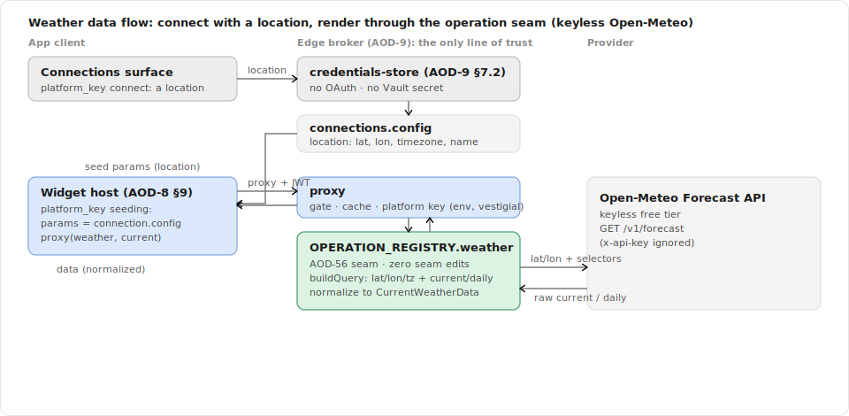
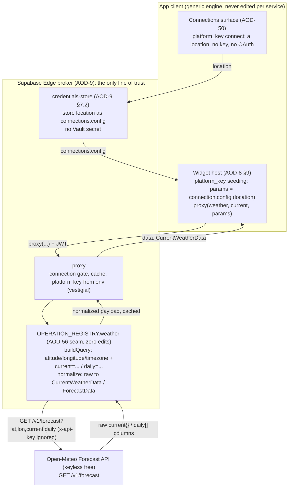
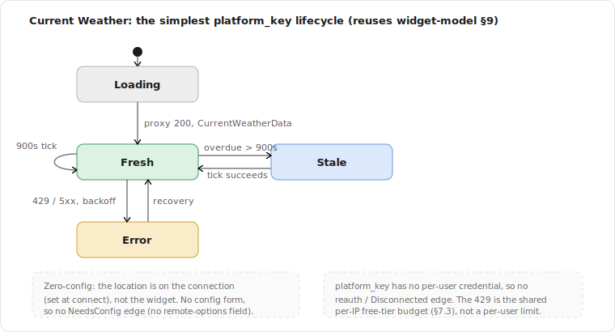
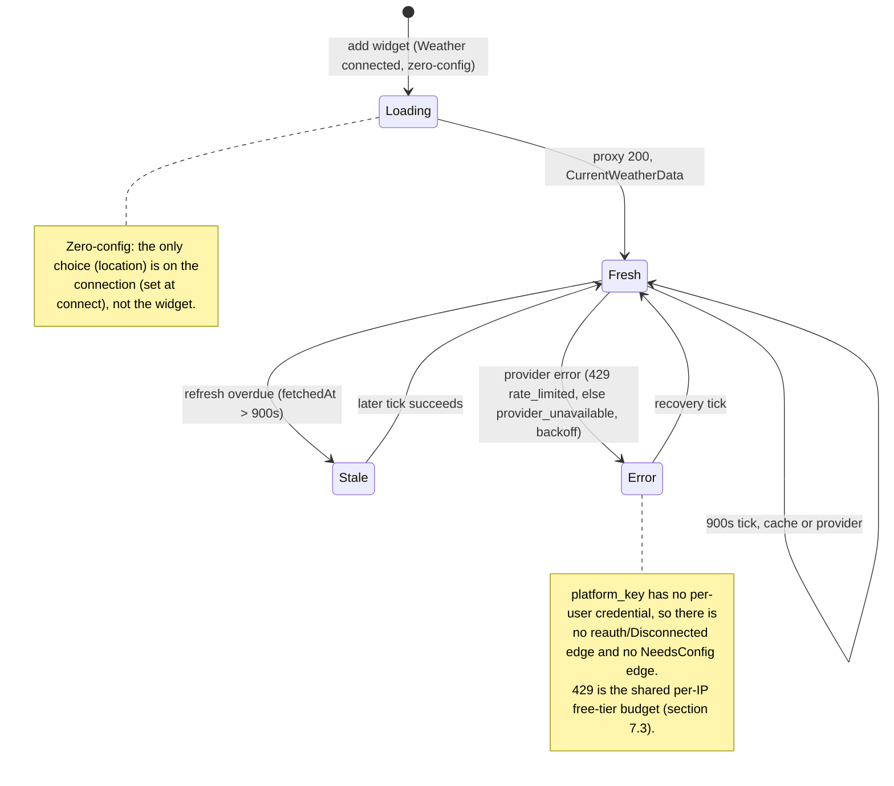

# Spec: Weather Integration (Current, Forecast)

> Status: draft for review, 2026-06-27. Tracked by [AOD-57](https://linear.app/thexap/issue/AOD-57) (`type:spec`). The **third per-integration spec** and the **first `platform_key` one**: it fills the same interior that [AOD-8](https://linear.app/thexap/issue/AOD-8) (registry seam), [AOD-9](https://linear.app/thexap/issue/AOD-9) (broker + proxy), and [AOD-10](https://linear.app/thexap/issue/AOD-10) (widget model) framed, now for a concrete **keyless REST** service. It mirrors [`integration-calendar.md`](integration-calendar.md) ([AOD-32](https://linear.app/thexap/issue/AOD-32)) section for section, and it is the **third proof** that the per-widget operation seam ([AOD-55](https://linear.app/thexap/issue/AOD-55), generalized to REST in [AOD-56](https://linear.app/thexap/issue/AOD-56)) generalizes again: Weather rides the **already-REST-ready** seam by registration, with **zero edits to the operation seam itself**. It extends [AOD-13](https://linear.app/thexap/issue/AOD-13) (which fixed the `platform_key` credential handling) with the full integration contract, and gates the I-M1 Weather build.
>
> Two findings are load-bearing and were verified against the **live** Open-Meteo API on 2026-06-27. (1) Open-Meteo's free `/v1/forecast` is **keyless**: the shipped `weather` registry entry models a `WEATHER_PROVIDER_KEY` + `x-api-key` header that the keyless tier does not use, so the key is **vestigial for v1** and **reserved for the commercial tier**, the analogue of how the Calendar spec reconciled the `GOOGLE_CALENDAR_CLIENT_SECRET` naming. The reservation is not cosmetic: the free tier is rate-limited **per IP**, and every user's call egresses through the one platform proxy IP, so the free **10,000/day is a single shared budget** (about 100 concurrently-mounted weather widgets across the whole user base), which is exactly why [AOD-4](https://linear.app/thexap/issue/AOD-4)/[AOD-13](https://linear.app/thexap/issue/AOD-13) named **Open-Meteo commercial** as the launch vendor (§7.3). (2) The user's **location lives on the connection** (`connections.config`, set at connect, [AOD-13](https://linear.app/thexap/issue/AOD-13)), and because Weather opts into the operation seam (`buildQuery` + `normalize`) the location is delivered into the per-widget query by **one one-time generic client refinement** (the host seeds the proxy `params` from the connection config for `platform_key` services), the `platform_key` analogue of the one-time REST refinement Calendar needed (§6.3).

## 1. Purpose and scope

The platform is shipped: the registry seam ([AOD-8](https://linear.app/thexap/issue/AOD-8)), the broker and proxy ([AOD-9](https://linear.app/thexap/issue/AOD-9)), the widget model ([AOD-10](https://linear.app/thexap/issue/AOD-10)), the remote-options engine ([AOD-53](https://linear.app/thexap/issue/AOD-53)), and the per-widget operation seam ([AOD-55](https://linear.app/thexap/issue/AOD-55)) **already refined for REST** ([AOD-56](https://linear.app/thexap/issue/AOD-56), `buildQuery` + path tokens), and both Linear ([`integration-linear.md`](integration-linear.md)) and Google Calendar ([`integration-calendar.md`](integration-calendar.md)) rode them end to end. Weather is the **third real service**, the **first `platform_key`** one, and the **other REST one**. This spec fixes how Weather plugs into the seam so the later build is registration plus leaf renderers plus operation modules, with zero edits to the operation seam, the layout, the host data path, the broker, or the settings internals.

It fixes exactly five things:

1. **Open-Meteo `platform_key` specifics**: the keyless free tier, the `WEATHER_PROVIDER_KEY` / `x-api-key` reconciliation (vestigial v1, reserved for commercial), the per-IP shared-budget consequence, and the connect / disconnect hooks. There is no OAuth, no consent screen, no refresh, and no per-user secret (verified against the live API, section 12).
2. **The two widgets and their data contracts**: "Current Weather" and "Forecast" ([AOD-4](https://linear.app/thexap/issue/AOD-4)'s "Current + Forecast", realized as two cards, section 4). For each: the server-side `/v1/forecast` request (built by `buildQuery`), the raw Open-Meteo response shape, and the **normalized payload** the renderer receives via the [AOD-8](https://linear.app/thexap/issue/AOD-8) §6.1 render contract `{ data, config, size }`, over a shared `WeatherCondition`.
3. **Per-instance config and the location model**: the location lives on the **connection** (`connections.config`, set at connect), not on the widget; the two widgets are **zero-config**; there is **no** [AOD-53](https://linear.app/thexap/issue/AOD-53) option source (a city picker is a connect-flow concern, not a widget-config one).
4. **The operation seam, reused for REST**: where the per-widget `buildQuery` and `normalize` slot in, with **zero edits to the operation seam** (it is already REST-ready from [AOD-56](https://linear.app/thexap/issue/AOD-56)), plus the **one** new generic mechanism Weather needs: the `platform_key` host params-seeding that delivers the connection location into the query.
5. **Refresh and cache TTLs**, justified against Open-Meteo's verified per-IP limits and its 15-minute update cadence, with the shared-budget finding and the (zero) error-mapping work named.

**In scope:** the data contracts, the location model, the operation modules, the TTLs, and the exact registry slotting (both halves) plus the one-time `platform_key` host refinement that make Weather a registration-only add.

**Out of scope (neighbors named so the frame is clear):**

- **The build** of the Weather widgets, leaf renderers, and operation modules is a separate I-M1 `type:tech-task` created after this spec lands, implementing it the [AOD-56](https://linear.app/thexap/issue/AOD-56) way. This spec is the design it implements.
- **The Claude / Clock integration specs** ([AOD-33](https://linear.app/thexap/issue/AOD-33) / [AOD-34](https://linear.app/thexap/issue/AOD-34)). Weather reuses the Calendar template and proves the `platform_key` path; it does not author them.
- **The Weather widget visual design** ([AOD-35](https://linear.app/thexap/issue/AOD-35)). This spec fixes the normalized data the renderer receives (including the WMO condition and the multi-day forecast rows); it does not fix how the cards look or which icons map to which condition group.
- **The onboarding / connect flow** ([AOD-26](https://linear.app/thexap/issue/AOD-26)) and the **connections surface** ([AOD-50](https://linear.app/thexap/issue/AOD-50)). Referenced as the hooks Weather connect rides; the **city-to-coordinates geocoding search** at connect is owned there, not here (section 5.3).
- **Broker mechanics** (the connection gate, the proxy, the typed error result, the env-secret read) are [AOD-9](https://linear.app/thexap/issue/AOD-9)'s and the widget model (lifecycle, the refresh clamp, validation) is [AOD-10](https://linear.app/thexap/issue/AOD-10)'s. Referenced, not redefined.
- **Kiosk and entitlement** concerns ([AOD-11](https://linear.app/thexap/issue/AOD-11) / [AOD-12](https://linear.app/thexap/issue/AOD-12)). Weather counts toward the Free service limit ([AOD-13](https://linear.app/thexap/issue/AOD-13)); the TTLs here are inputs to those levers, not decisions about them.

Every API shape below is verified against the live Open-Meteo Forecast API on **2026-06-27** and cited in section 12. Unlike Calendar (verified against docs only), Weather is keyless and free, so the shapes here were observed from real responses. Nothing is invented; the build re-verifies and updates section 12 if anything differs.

## 2. Locked context this builds on

| Source | What it locks | How this spec uses it |
|---|---|---|
| [AOD-8](https://linear.app/thexap/issue/AOD-8) §5.2 | The server half (`ServiceBackendConfig`) and the endpoint allow-list. | Section 8 shows the `endpoints` entries (`current` / `forecast`, both the `/v1/forecast` path). |
| [AOD-8](https://linear.app/thexap/issue/AOD-8) §6 / §6.1 | `WidgetDefinition` shape; the render contract `render(data, config, size)` invoked only with live, normalized data. | Section 4 fixes each widget's definition and the normalized `data` its renderer receives. |
| [AOD-8](https://linear.app/thexap/issue/AOD-8) §10 / §11 | The seam (generic engine never edited per service) and the "add a service by registration alone" proof. | Section 8 is the Weather instance of §11, with the not-touched footprint table. |
| [AOD-9](https://linear.app/thexap/issue/AOD-9) §4 / §5.4 | `platform_key` is its own auth class: the provider key is a platform secret in Edge env, attached server-side; no per-user credential. | Section 3 fills the Open-Meteo specifics and reconciles the (vestigial) key against the keyless live API. |
| [AOD-9](https://linear.app/thexap/issue/AOD-9) §7.2 | The non-OAuth `credentials-store` connect path; for `platform_key` it stores only the user's **location** as the connection config and writes no Vault secret. | Section 5 fixes the location as connection-level config and reconciles its shape (coordinates) against the live API. |
| [AOD-9](https://linear.app/thexap/issue/AOD-9) §9 | The proxy data path (connection gate, env-secret read for `platform_key`, allow-listed call, normalize, cache, typed errors). | Section 6 rides this; the location "passed as the provider's query parameters" (§9 step 5) is delivered via the host seeding + `buildQuery` (section 6.3). |
| [AOD-10](https://linear.app/thexap/issue/AOD-10) §4 / §6 / §7 | The config schema, the two-layer refresh model (`cacheTtlSeconds`, `minRefreshSeconds`), and the lifecycle states. | Section 5 sets a zero-field config; section 7 sets per-widget TTLs; section 9 walks Current through the (simpler `platform_key`) lifecycle. |
| [AOD-13](https://linear.app/thexap/issue/AOD-13) | The `platform_key` class: provider key in Edge env, the connection holds a location config and no credential, Weather still counts as a backend-cost service (not `none`). | This spec is the integration that consumes that credential model; section 3 and section 5 build directly on it. |
| [AOD-55](https://linear.app/thexap/issue/AOD-55) + [AOD-56](https://linear.app/thexap/issue/AOD-56) | The shipped operation seam: server `OPERATION_REGISTRY` keyed by service + widget, `getOperation`, the proxy's `buildQuery` (REST) / `buildBody` (GraphQL) + `normalize` lookup, optional path tokens, and the generic provider-error mapping. | Section 6 registers the two Weather operations (`buildQuery` + `normalize`) on this seam with **zero edits**; section 7 reuses the 429 mapping unchanged. |
| [AOD-4](https://linear.app/thexap/issue/AOD-4) | The v1 widget set (Done): **Weather "Current + Forecast"**, default size medium/large, cadence ~15 min, on a platform key with user location (sub-decision B2). | Section 4 realizes "Current + Forecast" as **two** widgets (a reconciliation noted there) with the cadence as input. |
| [AOD-6](https://linear.app/thexap/issue/AOD-6) | Weather is in the v1 service set. | Weather is the third service wired, after Linear and Calendar. |
| [AOD-5](https://linear.app/thexap/issue/AOD-5) | Privacy posture: the proxy cache holds normalized data only, per-user, encrypted, TTL ≤ 900s, purged on disconnect/delete; the location is per-user encrypted config, the platform key is a service secret. | Section 6 normalizes before caching (no raw Open-Meteo shape stored); section 7 keeps every TTL at or under 900s. |

The shipped server registry already carries the Weather backend. The current entry, verbatim from `supabase/functions/_shared/registry.ts`:

```typescript
weather: {
  id: "weather",
  authClass: "platform_key",
  apiBase: "https://api.open-meteo.com",
  authHeaderStyle: "x-api-key",
  platformKeyEnv: "WEATHER_PROVIDER_KEY",
  endpoints: {
    current: { method: "GET", path: "/v1/forecast" },
  },
},
```

`apiBase` and the `/v1/forecast` path are correct and verified live. The `authHeaderStyle: "x-api-key"` and `platformKeyEnv: "WEATHER_PROVIDER_KEY"` are **vestigial for the keyless free tier** and reserved for the commercial tier (section 3.2, section 3.3). The `current` / `/v1/forecast` entry is a **pre-registration placeholder**: this spec keeps it and adds the second widget key (`forecast`) on the same path (sections 6, 8). It also adds the operation modules; it changes no other field of the block.

## 3. Open-Meteo `platform_key` specifics

### 3.1 The class and the flow

Weather is a `platform_key` service ([AOD-9](https://linear.app/thexap/issue/AOD-9) §4, [AOD-13](https://linear.app/thexap/issue/AOD-13)). There is **no OAuth, no consent screen, no code exchange, no refresh token, and no per-user secret**. The provider key (if any) is a **platform** secret in Edge env, attached server-side by the proxy, exactly like an OAuth client secret. The user supplies only a **location**, which is non-credential config stored on the connection row.

Connect rides the [AOD-9](https://linear.app/thexap/issue/AOD-9) §7.2 `credentials-store` path with no new broker code: the app POSTs the chosen location once over TLS; `credentials-store` writes the `connections` row (`status=connected`, `auth_class=platform_key`, `access_secret_id=null`, `config={the location}`, no `expires_at`), and is done. The shipped handler is literal about this (`supabase/functions/credentials-store/handler.ts`):

```typescript
if (backend.authClass === "platform_key") {
  if (!body.location) throw new HttpError(400, "missing_location", "platform_key requires a location");
  // upsert connections: status=connected, access_secret_id=null, refresh_secret_id=null, config=body.location
}
```

At data time, `resolveCallSecret` takes the platform key from env rather than reading Vault (`supabase/functions/_shared/connection.ts`):

```typescript
if (backend.authClass === "platform_key") {
  return requireEnv(backend.platformKeyEnv ?? "");  // WEATHER_PROVIDER_KEY
}
```

That one line is why the (vestigial) key still matters operationally, section 3.3.

### 3.2 Keyless reality and the `WEATHER_PROVIDER_KEY` reconciliation (load-bearing)

Open-Meteo's free, non-commercial Forecast API is **keyless**. A bare `GET https://api.open-meteo.com/v1/forecast?latitude=-0.18&longitude=-78.47&current=temperature_2m` returns data with **no** key, no header, no registration (verified live, section 12). So the shipped registry's `authHeaderStyle: "x-api-key"` and `platformKeyEnv: "WEATHER_PROVIDER_KEY"` describe an authentication the v1 (free) provider **does not use**.

This is Weather's load-bearing provider fact, the analogue of Calendar's scope: the model and the reality diverge, and the spec reconciles them.

- **The header must be `bearer`, NOT `x-api-key` (corrected by the AOD-58 build, re-verified live 2026-06-28).** This section originally assumed Open-Meteo ignores unknown headers, so an `x-api-key` header would be harmless. That is **false against the live API**: the keyless `/v1/forecast` **303-redirects** any request carrying an `x-api-key` header into the commercial flow (which then 400s), so attaching it **breaks** the call. It does, however, **ignore** an `Authorization: Bearer` header (HTTP 200, verified). So the build sets `authHeaderStyle: "bearer"` on the `weather` registry entry (a registry-only, one-line change; the operation seam, `providers.ts`, and the proxy stay untouched): the vestigial placeholder rides as a genuinely-ignored bearer header, which is exactly this section's intent ("the key is attached but ignored") realized against the live API.
- **`WEATHER_PROVIDER_KEY` is vestigial for v1 and reserved for the commercial tier.** For v1 it must still be **set to a non-empty placeholder** in Edge env, because the shipped `resolveCallSecret` calls `requireEnv(WEATHER_PROVIDER_KEY)`, which **throws on an empty value** (`supabase/functions/_shared/env.ts`). Setting it (to any non-empty string) satisfies the `platform_key` contract; Open-Meteo ignores the resulting **bearer** header (see the corrected header-style note above). This is exactly the registry's own model ("adding a service is a registry entry plus its Edge env secret"), so v1 wiring sets the env var to a placeholder plus the one-line `authHeaderStyle` correction. It is the analogue of Calendar's `GOOGLE_CALENDAR_CLIENT_SECRET` reconciliation: a name/modeling note, the code path otherwise correct.
- **The commercial swap is a named future seam (section 10).** Open-Meteo's commercial tier is **not** an `x-api-key` header: it uses an `apikey` **query parameter** on a `customer-`prefixed host (`https://customer-api.open-meteo.com/v1/forecast?...&apikey=...`), verified in their docs. The current `authHeaderStyle` enum (`bearer` | `x-api-key` | `anthropic-admin`) cannot express a query-param key, and the host differs. So the real commercial move is a small registry + provider refinement (a new `apiBase`, a query-param key mechanism), out of v1 scope. v1 is keyless.

So: keep the registry entry; set `WEATHER_PROVIDER_KEY` to a placeholder; treat the key as reserved, not active. The "why reserved, not deleted" is section 3.3.

### 3.3 Why the key is reserved, not removed: the per-IP shared budget

The free tier is rate-limited **per IP address** (it is keyless, so there is no per-account identity to meter). Every user's Weather call egresses through the **single platform proxy IP** (the Supabase Edge Function), so the free-tier budget is **one budget shared across the entire user base**, not per-user. The verified free limits (section 7.1) are 600/min, 5,000/hour, **10,000/day**, 300,000/month. At the section 7.2 cache TTL of 900s, one mounted widget instance is at most ~96 provider calls/day, so the free daily cap supports on the order of **~100 concurrently-mounted weather widgets across all users** before it bounces.

That is comfortable for development and for Xavier's own kiosk (a handful of widgets) but is a hard **launch ceiling** for a multi-user product. It is precisely why [AOD-4](https://linear.app/thexap/issue/AOD-4) (verified) and [AOD-13](https://linear.app/thexap/issue/AOD-13) named **Open-Meteo commercial** (one key, ~€29-99/mo, 1M-5M calls/month, unlimited minute/hour/day) as the leading vendor. So `WEATHER_PROVIDER_KEY` is **reserved for that commercial key**: vestigial while on the keyless free tier (dev and early use), real at commercial launch. The TTLs in section 7 are tuned at the [AOD-5](https://linear.app/thexap/issue/AOD-5) ceiling specifically to stretch the shared free budget in the interim.

### 3.4 Connect and reconnect hooks (no credential death)

Weather connect is the `platform_key` affordance on the connections surface ([AOD-50](https://linear.app/thexap/issue/AOD-50)) reached from onboarding ([AOD-26](https://linear.app/thexap/issue/AOD-26)): a location form, not a key paste and not an OAuth redirect. This spec adds no connect UI.

Unlike `oauth2` (Calendar) and `api_key` services, a `platform_key` connection has **no per-user credential that can die**, so there is **no reconnect / `reauth_required` path**: `connections.expires_at` is null and the connection is never selected for refresh ([AOD-9](https://linear.app/thexap/issue/AOD-9) §8.1). The only credential-ish failure is the **platform** key being misconfigured (the env var unset), which is a deploy error affecting all users, not a per-user reconnect. Disconnect retires the row and its stored location ([AOD-9](https://linear.app/thexap/issue/AOD-9) §10) and removes the Weather widgets from every layout ([AOD-8](https://linear.app/thexap/issue/AOD-8) invariant 3); there is no token to revoke. This makes Weather's lifecycle the simplest of the three integrations (section 9).

## 4. The widgets and their data contracts

[AOD-4](https://linear.app/thexap/issue/AOD-4)'s v1 set lists Weather as a single **"Current + Forecast"** entry (size medium/large, cadence ~15 min). This spec realizes it as **two** widgets, the same way Calendar's "Next Event" and "Today's Agenda" are two cards with distinct roles and sizes: a small, highly glanceable **Current Weather** card and a larger multi-day **Forecast** card. The combined coverage is unchanged; the split gives two ambient roles and lets each carry its own size and cadence. (Reconciliation: AOD-4's "Current + Forecast" was one row at decision time; the build realizes it as two registered widgets. If a single combined card is preferred later, the two normalized payloads compose trivially, section 10.)

Both widgets read the **same** `/v1/forecast` endpoint, exactly as Calendar's two widgets both read `events.list`. They differ only in their operation: the query the operation builds (which Open-Meteo blocks it requests, `current=...` vs `daily=...`) and the payload it normalizes. The render contract is [AOD-8](https://linear.app/thexap/issue/AOD-8) §6.1: the leaf renderer is invoked only with live, normalized `data`; the host draws every other state. The proxy returns that normalized `data`; **section 6 specifies where the raw-to-normalized mapping runs** (server-side, in the operation module).

### 4.0 The shared `WeatherCondition`

Open-Meteo encodes weather as a numeric **WMO `weather_code`** (verified values and meanings, section 12). Both widgets normalize it into one shared shape so the renderer ([AOD-35](https://linear.app/thexap/issue/AOD-35)) maps a small, closed set of **condition groups** (plus day/night) to icons, never the ~28 raw codes:

```typescript
type WeatherGroup =
  | "clear" | "cloudy" | "fog" | "drizzle" | "rain" | "snow" | "showers" | "thunderstorm";

interface WeatherCondition {
  code: number;        // the raw WMO weather_code, preserved for completeness
  label: string;       // human string, e.g. "Partly cloudy" (from the verified WMO map, §12)
  group: WeatherGroup; // the coarse bucket the renderer maps to an icon
  isDay: boolean;      // current: from `is_day` (1/0); forecast days: true (daytime icon)
}
```

Units are **metric for v1** (Open-Meteo defaults: °C, km/h, %), and each normalized payload **echoes the provider's unit strings** so the renderer labels values without hard-coding a unit. Imperial (°F / mph) is a named seam (section 10); it would add `temperature_unit`/`wind_speed_unit` params in `buildQuery` and change only the echoed labels, not the shape.

```typescript
interface WeatherUnits {
  temperature: string; // "°C"
  windSpeed?: string;  // "km/h" (Current only)
  humidity?: string;   // "%"   (Current only)
}
```

### 4.1 Current Weather (the most glanceable card)

Current conditions at the connection's location. Default size `small` (of `small` / `medium`), device cadence around 15 minutes ([AOD-4](https://linear.app/thexap/issue/AOD-4)).

**Server-side request** (built by the operation, section 6; the client never supplies query params):

```
GET /v1/forecast
    ?latitude={lat}&longitude={lon}            (the connection location, §5)
    &timezone={tz}                              (the connection timezone, or "auto")
    &current=temperature_2m,relative_humidity_2m,apparent_temperature,is_day,weather_code,wind_speed_10m,wind_direction_10m
```

**Raw response** is `{ latitude, longitude, timezone, utc_offset_seconds, current_units{...}, current{...}, ... }`, where `current` carries `time` (local ISO, no offset, e.g. `"2026-06-27T11:15"`), `interval` (900, the 15-min update step), and the requested fields (verified, section 12). **Normalized payload:**

```typescript
interface CurrentWeatherData {
  observedAt: string;          // current.time (local ISO); the connection tz gives the offset
  condition: WeatherCondition; // from current.weather_code + current.is_day
  temperature: number;         // current.temperature_2m
  apparentTemperature: number; // current.apparent_temperature
  humidityPct: number;         // current.relative_humidity_2m
  windSpeed: number;           // current.wind_speed_10m
  windDirectionDeg: number;    // current.wind_direction_10m (0-360)
  units: WeatherUnits;         // echoed from current_units
}
```

There is no empty / "nothing" state: a connected location always has current conditions, so `CurrentWeatherData` is unconditional (unlike Calendar's `hasEvent: false`). A malformed location is a connect-time error, not a render state (section 7.4).

**Client-half definition** (the [AOD-10](https://linear.app/thexap/issue/AOD-10) model values filled in):

```typescript
const current: WidgetDefinition = {
  type: "current",
  serviceId: "weather",
  title: "Current Weather",
  supportedSizes: ["small", "medium"],
  defaultRefresh: { seconds: 900 },   // device asks every ~15 min (AOD-4)
  cacheTtlSeconds: 900,               // provider hit at most once / 15 min; matches Open-Meteo's update step (§7)
  minRefreshSeconds: 600,
  dimsWithAmbient: true,
  configSchema: { fields: [] },       // zero-config: the only choice (location) is on the connection (§5)
  render: CurrentWeatherCard,         // leaf component; receives { data: CurrentWeatherData, config, size }
};
```

### 4.2 Forecast

A multi-day forecast for the connection's location. Default size `wide` (of `wide` / `large`), device cadence around 30 minutes (a daily forecast moves slowly; [AOD-4](https://linear.app/thexap/issue/AOD-4)'s ~15 min is the floor, section 7).

**Server-side request:**

```
GET /v1/forecast
    ?latitude={lat}&longitude={lon}&timezone={tz}
    &daily=weather_code,temperature_2m_max,temperature_2m_min,precipitation_probability_max,sunrise,sunset
    &forecast_days=7
```

**Raw response** carries `daily_units{...}` and a **columnar** `daily{...}` object of **parallel arrays**: `time[]`, `weather_code[]`, `temperature_2m_max[]`, `temperature_2m_min[]`, `precipitation_probability_max[]`, `sunrise[]`, `sunset[]`, all aligned by index (verified, section 12). The normalize step's main job is to **zip these parallel arrays into row objects** (the REST analogue of Calendar mapping `items[]` to `CalendarEvent[]`). **Normalized payload:**

```typescript
interface ForecastDay {
  date: string;                         // daily.time[i] ("YYYY-MM-DD")
  condition: WeatherCondition;          // from daily.weather_code[i]; isDay: true (day icon)
  tempMax: number;                      // daily.temperature_2m_max[i]
  tempMin: number;                      // daily.temperature_2m_min[i]
  precipProbabilityPct: number | null;  // daily.precipitation_probability_max[i] (null if absent)
  sunrise: string;                      // daily.sunrise[i] (local ISO)
  sunset: string;                       // daily.sunset[i]  (local ISO)
}

interface ForecastData {
  days: ForecastDay[];   // forecast_days entries, today first, index-aligned from the columnar arrays
  units: WeatherUnits;   // echoed from daily_units (temperature)
}
```

An empty `days` array would only arise from a malformed response; normalize is defensive (a missing or ragged array yields `days: []`, and the host shows an empty card, never a crash), exactly as Calendar's and Linear's normalizers guard their inputs.

**Client-half definition:**

```typescript
const forecast: WidgetDefinition = {
  type: "forecast",
  serviceId: "weather",
  title: "Forecast",
  supportedSizes: ["wide", "large"],
  defaultRefresh: { seconds: 1800 },  // device asks every ~30 min; forecast moves slowly
  cacheTtlSeconds: 900,               // provider floor at the AOD-5 ceiling; conserves the shared budget (§7)
  minRefreshSeconds: 900,
  dimsWithAmbient: true,
  configSchema: { fields: [] },       // zero-config; location is on the connection (§5)
  render: ForecastCard,               // receives { data: ForecastData, config, size }
};
```

## 5. Per-instance config and the location model

### 5.1 The location lives on the connection, not the widget

The single user choice Weather needs is **where**. [AOD-13](https://linear.app/thexap/issue/AOD-13) put that on the **connection**: `credentials-store` collects a location at connect and stores it as `connections.config`, with no Vault secret. So the location is set **once per connection**, and **both widgets inherit it**. The widgets therefore declare an **empty** config schema (`fields: []`, section 4): a Weather widget is a **zero-config add** once Weather is connected, in deliberate contrast to Calendar's required `calendarId` per instance. This is the natural shape for a platform-key service whose one parameter is a per-user, per-connection setting rather than a per-card one.

The stored config is the **connection-level** record the proxy and the host read (`connections.config`, [AOD-9](https://linear.app/thexap/issue/AOD-9) §5.1). Section 6.3 fixes how it reaches the per-widget query.

### 5.2 The location is coordinates (a placeholder-shape reconciliation)

Open-Meteo's `/v1/forecast` is addressed by **`latitude` + `longitude`** (plus an optional IANA `timezone`); it does **not** accept a city name. So `connections.config` for Weather must hold **coordinates**, not a bare city string:

```typescript
// connections.config for a connected Weather service:
interface WeatherLocation {
  latitude: number;   // -0.1807
  longitude: number;  // -78.4678
  timezone: string;   // "America/Guayaquil" (IANA) or "auto"; gives sunrise/sunset and `current.time` their local offset
  name: string;       // "Quito, Ecuador", display label only (account_label / card subtitle)
}
```

The shipped `credentials-store` and the client `CredentialForm` currently model the location as `{ city: string }` (a free-text city). That is a **pre-registration placeholder** the same way Calendar's `primary` endpoint was: the build replaces it with the coordinate shape above, because the forecast API cannot consume a bare city. Resolving a typed city into coordinates (and a timezone and a display name) is **geocoding**, section 5.3.

### 5.3 No widget option source; geocoding is a connect-flow concern

Could the location use the [AOD-53](https://linear.app/thexap/issue/AOD-53) remote-options engine (a `providerBackedSource` like `google_calendars`, backed by Open-Meteo's geocoding API)? **No, not for v1, and not on that engine.** The AOD-53 option-source path resolves **per-widget-instance config fields** at **config time** through `config-options`. Weather's location is **connection-level**, chosen at **connect time** on a different surface (`credentials-store` / the connect form), which the option-source engine does not touch. So a city picker belongs to the **connect / onboarding flow** ([AOD-26](https://linear.app/thexap/issue/AOD-26)), not to widget config.

Open-Meteo does provide a free, keyless geocoding API (`https://geocoding-api.open-meteo.com/v1/search?name=Quito`), which returns `{ results: [{ id, name, latitude, longitude, timezone, country, admin1, ... }] }` (verified, section 12). The connect flow can use it to turn a typed city into the `WeatherLocation` above (search, pick, store coordinates + timezone + a "City, Country" label). That is named as an [AOD-26](https://linear.app/thexap/issue/AOD-26) seam (section 10); v1 may also accept raw coordinates directly. Either way the **stored shape is coordinates** (section 5.2), and this integration spec is agnostic to which connect UI captures them. There is **no** Weather entry in `OPTION_SOURCE_REGISTRY`.

### 5.4 No membership re-check

Because Weather declares no `remote-options` field, the [AOD-10](https://linear.app/thexap/issue/AOD-10) §4.4 render-time membership re-check (which drove Calendar's "chosen calendar deleted" to `needs_config`) **does not apply**. There is no option set a stored value can fall out of; a location is just coordinates. The only "reconfigure" path is the user editing the connection's location, which is a connect-surface action, not a per-widget `needs_config`. So Weather has no `needs_config` lifecycle edge (section 9).

## 6. The operation seam, reused for REST (zero seam edits)

This is where Weather proves the seam holds. The operation seam is **already REST-ready** from [AOD-56](https://linear.app/thexap/issue/AOD-56): `WidgetOperation` already has an **optional** `buildQuery` and an **optional** `buildBody` with a **required** `normalize`, and the proxy already does one generic lookup. Weather needs **no edit to the operation seam at all**: it registers `buildQuery` + `normalize` per widget. The one new generic mechanism Weather introduces is on the **client host** (section 6.3), to deliver the connection location into the query.

### 6.1 The operation module (REST form)

The Weather operations register under the existing `OPERATION_REGISTRY`, keyed by service id and widget type, each with a `buildQuery` (no `buildBody`: a `GET` carries no body) and a `normalize`:

```typescript
// operations.ts: OPERATION_REGISTRY.weather (NEW entries; server-side only).
// The per-widget static selectors: which Open-Meteo blocks each widget requests. Held server-side so the
// client never carries Open-Meteo's field vocabulary (the operation seam's purpose, §6.4).
const CURRENT_FIELDS = "temperature_2m,relative_humidity_2m,apparent_temperature,is_day,weather_code,wind_speed_10m,wind_direction_10m";
const DAILY_FIELDS = "weather_code,temperature_2m_max,temperature_2m_min,precipitation_probability_max,sunrise,sunset";
const FORECAST_DAYS = 7;

/** The connection location, delivered into params by the platform_key host seeding (§6.3). */
function locationQuery(params: Record<string, unknown>): Record<string, unknown> {
  return { latitude: params.latitude, longitude: params.longitude, timezone: params.timezone ?? "auto" };
}

function buildCurrentQuery(params: Record<string, unknown>): Record<string, unknown> {
  return { ...locationQuery(params), current: CURRENT_FIELDS };
}
function buildForecastQuery(params: Record<string, unknown>): Record<string, unknown> {
  return { ...locationQuery(params), daily: DAILY_FIELDS, forecast_days: FORECAST_DAYS };
}

// normalize maps the /v1/forecast body to the section 4 payloads, mapping weather_code -> WeatherCondition
// and (for forecast) zipping the columnar daily arrays into ForecastDay[]. Defensive against missing fields.
function normalizeCurrent(raw: unknown): CurrentWeatherData { /* current{} + current_units{} -> CurrentWeatherData */ }
function normalizeForecast(raw: unknown): ForecastData     { /* daily[] columns -> ForecastDay[] + daily_units{} */ }

OPERATION_REGISTRY.weather = {
  current:  { buildQuery: buildCurrentQuery,  normalize: normalizeCurrent },
  forecast: { buildQuery: buildForecastQuery, normalize: normalizeForecast },
};
```

These functions are the only Weather-specific data code; they are registration, not engine edits. They normalize before the proxy caches, so the cache stores small clean payloads (`CurrentWeatherData` / `ForecastData`), not Open-Meteo's verbose `current_units` + columnar `daily` body ([AOD-5](https://linear.app/thexap/issue/AOD-5) "normalized data only"), exactly as Linear's and Calendar's operations do.

Unlike Calendar's `buildQuery`, Weather's is **not time-derived**: the query is a pure function of the (stable) location plus static selectors, so it is constant across polls within a location. That is fine for the cache key (section 6.3) and means there is no "now leaks into the key" subtlety; the only dynamic input is the location, which is exactly what should key the cache.

### 6.2 No path token

Calendar needed the [AOD-56](https://linear.app/thexap/issue/AOD-56) path-token substitution because its calendar id sits in the URL **path** (`/calendars/{calendarId}/events`). Weather's location is a **query parameter** (`?latitude=...&longitude=...`), not a path slot, so `/v1/forecast` has **no `{token}`**. The shipped `applyPathParams` returns a token-free path unchanged (`supabase/functions/_shared/providers.ts`), so Weather rides that machinery with nothing to fill. Weather therefore exercises a **different** corner of the [AOD-56](https://linear.app/thexap/issue/AOD-56) seam than Calendar (query-only, no path token), which is part of what makes it a good third proof.

### 6.3 The one new generic mechanism: `platform_key` host params-seeding

There is exactly one thing Weather needs that does not exist yet, and it is **not** in the operation seam. It is on the **client host**, and it is the `platform_key` analogue of the one-time REST refinement Calendar needed.

**Why.** `buildQuery(params)` receives only the proxy `params`. The shipped client host sends `params = instance.config` (the widget instance's own config) and does **not** include the connection config (`apps/app/src/host/WidgetHost.tsx`). For an `oauth2` service like Calendar that is correct: the per-instance `calendarId` lives in `instance.config` and flows straight through. But Weather's location lives on the **connection**, and the widgets are zero-config, so `instance.config` is empty and `buildQuery` would see **no** `latitude` / `longitude`. The location has to be folded into `params`.

The shipped **server** proxy does have a `conn.config` merge, but **only on the pass-through (no-`buildQuery`) branch** (`supabase/functions/proxy/handler.ts`):

```typescript
const callQuery = op?.buildQuery
  ? op.buildQuery(params)                                  // REST op: params only; conn.config NOT merged
  : { ...(conn.config ?? {}), ...params };                // pass-through: conn.config (a location) merged
```

That pass-through merge was written for an **operation-less** `platform_key` service. Weather instead **opts into the operation seam** (for the normalized cache and the server-held query vocabulary, section 6.4), which takes the `buildQuery` branch, so the proxy's `conn.config` merge does not apply. The clean place to deliver the location is therefore the **host**, generically, for every `platform_key` service:

```typescript
// WidgetHost.tsx today: params is the widget instance config only.
//   const params = instance.config;
// The one-time generic platform_key refinement: a platform_key widget's location lives on the CONNECTION,
// so seed params from connection.config. Generic per auth class, not per service:
const conn = connections.get(instance.serviceId);            // useConnections() (AOD-50), already on the client
const params = service.authClass === "platform_key"
  ? { ...(conn?.config ?? {}), ...instance.config }          // connection location (+ any instance config)
  : instance.config;                                          // oauth2 / api_key / admin_key: unchanged
```

This is **one** small, additive, generic change, the `platform_key` parallel to Calendar's one-time REST refinement: it is per **auth class**, not per service, so it serves Weather and **every future `platform_key` service** at once, and it leaves `oauth2` / `api_key` / `admin_key` widgets byte-for-byte unchanged (they take the `else`). After it lands, Weather and future `platform_key` services are **registration-only**. It also keeps the end state consistent with [AOD-9](https://linear.app/thexap/issue/AOD-9) §9 step 5 ("the user's stored location is passed as the provider's query parameters"): the location still becomes query params, now via the host seeding plus `buildQuery` rather than the proxy's pass-through merge.

**The cache-key property this preserves.** The proxy hashes `body.params`. With the seeding, `params = { latitude, longitude, timezone, name }` (the location), which is **stable** for a given connection, so within a TTL every device polling the same widget for the same location is served the same cached normalized payload. If the user edits the location, `params` changes, the key changes, and a fresh entry is fetched, exactly the right behavior. The static selectors live in `buildQuery` (server-side) and never enter `params` or the key. (`name` is a harmless passenger in the key; it is display-only and could be dropped from the seeded params if a build prefers a tighter key, with no behavior change.)

### 6.4 Why server-side, not in the leaf renderer

Normalization and request-building run in the proxy operation, not the client card, for the same reasons Linear and Calendar give ([`integration-calendar.md`](integration-calendar.md) §6.4): [AOD-8](https://linear.app/thexap/issue/AOD-8) §6.1 defines `data` as the normalized payload from the proxy; the proxy cache then stores small normalized payloads, not Open-Meteo's `current_units` + columnar `daily` bodies, so the [AOD-5](https://linear.app/thexap/issue/AOD-5) "normalized data only" rule holds literally; the WMO-to-condition mapping and the parallel-array zip stay in the server half ([AOD-8](https://linear.app/thexap/issue/AOD-8) §4 trust boundary); and **Open-Meteo's field vocabulary** (`temperature_2m`, `weather_code`, `precipitation_probability_max`) stays server-side in `buildQuery`, off the client. Choosing the operation seam over the simpler pass-through is exactly this trade: one one-time generic host refinement (section 6.3) buys a normalized cache and a server-held request shape, instead of caching raw provider JSON and putting selectors on the client.

## 7. Refresh and cache versus Open-Meteo's real limits

### 7.1 Verified limits and cadence (2026-06-27)

Open-Meteo's free, non-commercial Forecast API, from the live API and pricing page:

| Limit (free tier, per IP) | Value |
|---|---|
| Per minute | **600 calls** |
| Per hour | **5,000 calls** |
| Per day | **10,000 calls** |
| Per month | **300,000 calls** |

Two more verified facts shape the TTLs: the limits are enforced **per IP** (keyless), and the `current` block updates on a **15-minute step** (the live response carries `current.interval: 900`). So fresher than 15 minutes is wasted, and, because all users share the one proxy IP, every avoided call protects a **shared** budget (section 3.3).

### 7.2 The per-widget TTLs

| Widget | `defaultRefresh` | `cacheTtlSeconds` | `minRefreshSeconds` | Rationale |
|---|---|---|---|---|
| Current Weather | 900s | 900s | 600s | [AOD-4](https://linear.app/thexap/issue/AOD-4)'s ~15 min. Open-Meteo's `current` updates every 15 min (`interval: 900`), so a 900s provider cadence loses no freshness; 900s is also the [AOD-5](https://linear.app/thexap/issue/AOD-5) ceiling and conserves the shared budget. |
| Forecast | 1800s | 900s | 900s | A daily forecast moves slowly, so the device asks every ~30 min and is served from the ≤900s cache. `cacheTtl` sits at the [AOD-5](https://linear.app/thexap/issue/AOD-5) ceiling to minimize shared-budget draw. |

The [AOD-10](https://linear.app/thexap/issue/AOD-10) §6.1 cache TTL is the provider-protection floor: within one TTL every device and instance for the same `(user, service, widget, params)` is served from cache, so the provider is hit at most once per TTL. At `cacheTtl=900s` each mounted widget instance is at most ~96 provider calls/day. Per **single user** this is trivially under every limit (a few calls/hour across both widgets, coalesced across devices by the per-user cache). The binding constraint is **aggregate**, not per-user: because the free tier meters the shared proxy IP, the 10,000/day caps total concurrent weather widgets across all users at roughly ~100 (section 3.3), which the commercial key lifts.

Every TTL is at or under the [AOD-5](https://linear.app/thexap/issue/AOD-5) 900s ceiling and above the [AOD-10](https://linear.app/thexap/issue/AOD-10) §6.1 15s provider floor. As with Calendar, the cadence is set by glanceable freshness (and here also by shared-budget thrift), not by a per-user API budget.

### 7.3 Capacity is the seam, not the cadence (named)

The TTLs above are the right v1 values, but they do not change the aggregate ceiling; only the **commercial tier** does (1M-5M calls/month, unlimited minute/hour/day, one key). So the capacity decision is: ride the keyless free tier through development and early use, and move to the Open-Meteo commercial key before a real multi-user launch. That move is the named seam of section 3.2/3.3 and section 10 (a new `apiBase`, a query-param key); it changes the registry and `providers.ts`, **not** the widgets, the operations, or the normalized contract. This is the precise, verified reason [AOD-4](https://linear.app/thexap/issue/AOD-4)/[AOD-13](https://linear.app/thexap/issue/AOD-13) chose Open-Meteo commercial.

### 7.4 Error mapping: nothing to add

Open-Meteo's error contract is clean and the shipped mapping already covers it, so Weather needs **zero** error-mapping work, a point in favor of registration-only:

- **Rate limit -> HTTP 429.** When the shared IP exceeds a window, Open-Meteo returns 429. The shipped generic `isRateLimited` maps **429 -> `rate_limited`** with the host backing off ([AOD-10](https://linear.app/thexap/issue/AOD-10) §6.4), with **no** Open-Meteo-specific branch needed (unlike Linear's 400/`RATELIMITED` or Google's 403/`usageLimits`). Because the limit is shared, a 429 tends to affect all users at once until the window resets, which is again the argument for the commercial tier, not for new code.
- **Bad request -> HTTP 400 `{ "error": true, "reason": "..." }`.** A malformed or missing location (for example, a latitude out of range) returns 400 with a `reason` string (verified, section 12). That is a **connect-time / build** defect (a bad stored location), not a steady-state render state, so the generic `400 -> upstream_unavailable` mapping is correct; the fix is to store valid coordinates (section 5.2), not to special-case the proxy. A `platform_key` connection never produces a `reauth_required` (section 3.4), so the `401 -> reauth` gap Calendar and Linear name does not exist here.

## 8. Registry slotting: the seam holds

Adding Weather is registration in both halves plus the two leaf renderers and the two operation modules. There are **zero edits to the operation seam** (it is already REST-ready from [AOD-56](https://linear.app/thexap/issue/AOD-56)). The only generic change is the one-time `platform_key` host params-seeding (section 6.3), counted once and shared with every future `platform_key` service, not a per-service edit.

**Client half** (`apps/app/src/registry/services/weather/`, new):

```typescript
export const weatherService: ServiceDefinition = {
  id: "weather",
  displayName: "Weather",
  icon: "weather",
  authClass: "platform_key",
  widgets: [current, forecast],   // sections 4.1, 4.2
};
```

plus `CurrentWeatherCard` and `ForecastCard` leaf components, and one registration line in the client registry index.

**Server half** (registration in existing files):

```typescript
// registry.ts: BACKEND_REGISTRY.weather.endpoints gains the second widget on the same path
endpoints: {
  current:  { method: "GET", path: "/v1/forecast" },
  forecast: { method: "GET", path: "/v1/forecast" },
},

// operations.ts (registration): OPERATION_REGISTRY.weather (section 6.1)
weather: { current: { buildQuery, normalize }, forecast: { buildQuery, normalize } },
```

The footprint, in the [AOD-8](https://linear.app/thexap/issue/AOD-8) §11 style:

| File / module | Added, edited, or untouched | Why |
|---|---|---|
| `registry/services/weather/*` (definition, 2 renderers) | Added | The new service, self-contained. |
| `_shared/operations.ts` (`OPERATION_REGISTRY.weather`) | Added | The two REST operations: `buildQuery` + `normalize` (sections 4, 6.1). |
| `_shared/operations.ts` (`WidgetOperation` interface) | **Untouched** | Already optional `buildQuery` / `buildBody` + required `normalize` from [AOD-56](https://linear.app/thexap/issue/AOD-56). Weather adds nothing. |
| `proxy/handler.ts` (operation lookup, query, pathParams) | **Untouched** | The generic `buildQuery` branch and token-free path both already serve Weather. |
| `_shared/providers.ts` (`applyPathParams`, `isRateLimited`) | **Untouched** | Token-free path returns unchanged; 429 already maps to `rate_limited` (section 7.4). |
| `host/WidgetHost.tsx` (`platform_key` params-seeding) | Edited: **once, generic** | Seed `params` from `connection.config` for `platform_key`; serves every `platform_key` service (section 6.3). |
| `_shared/registry.ts` (`endpoints`) | Edited: +`forecast` on the same path | The declared allow-list extension point. |
| `credentials-store` + `CredentialForm` (location shape) | Edited: `{ city }` placeholder -> coordinates | The location must be coordinates the forecast API accepts (section 5.2); a build/connect-flow change, not an engine edit. |
| client registry index | Edited: +1 line | The declared client extension point. |
| `_shared/option-sources.ts` | **Untouched** | Weather has no option source; the location is connection-level (section 5.3). |
| OAuth broker (`oauth-start` / `oauth-callback` / `token-refresh`) | **Untouched** | Weather is `platform_key`: no OAuth, no consent, no refresh (section 3). |
| Layout engine (AOD-7) | Untouched | Weather instances are ordinary rects. |
| Widget host / dashboard renderer (mount path) | Untouched (beyond the one generic seeding line) | Resolves via the registry and mounts `render`; never names Weather. |

Weather reuses the existing `platform_key` class, so the broker gains no code, and it reuses the [AOD-56](https://linear.app/thexap/issue/AOD-56) operation seam with zero edits. The one generic edit (the host params-seeding) serves every future `platform_key` service. The seam holds.



<details>
<summary>Mermaid source</summary>



</details>

## 9. Worked path: Current Weather connect to lifecycle

### 9.1 Connect and add (zero-config)

The user connects Weather by supplying a location on the connections surface ([AOD-50](https://linear.app/thexap/issue/AOD-50)): the connect flow resolves it to coordinates (section 5.2/5.3) and `credentials-store` writes the connection row with `config = { latitude, longitude, timezone, name }`, `status=connected`, no Vault secret. Weather is now connected ([AOD-8](https://linear.app/thexap/issue/AOD-8) invariant 2), so its widgets are addable. Adding **Current Weather** needs **no config form** (`fields: []`): the instance persists with empty config and is immediately ready. No option resolution, no `validateConfig` step beyond "schema has no required fields."

### 9.2 Every lifecycle state

This reuses the [AOD-10](https://linear.app/thexap/issue/AOD-10) §9 model, with two `platform_key` simplifications that make Weather the simplest of the three integrations:

- **No `Disconnected`-via-reauth edge.** A `platform_key` connection has no per-user credential that can expire or be revoked, so there is no `409 needs_reconnect` from a dead token (section 3.4). The connection is `connected` until the user explicitly disconnects, which removes the widgets entirely.
- **No `NeedsConfig` edge.** Weather declares no `remote-options` field, so the [AOD-10](https://linear.app/thexap/issue/AOD-10) §4.4 membership re-check never fires (section 5.4).

So the states are `Loading`, `Fresh`, `Stale`, and `Error`; the only Weather specifics are that the `fresh` payload is `CurrentWeatherData`, and an `error` from a shared-IP quota bounce arrives as `rate_limited` (HTTP 429, the host backs off, section 7.4) while any other non-2xx is `provider_unavailable`.



<details>
<summary>Mermaid source</summary>



</details>

## 10. Seams left open (named, not decided)

| Seam | Owner | What this spec leaves clean |
|---|---|---|
| The **build** of the Weather widgets, renderers, and operation modules | I-M1 `type:tech-task` | This spec fixes the contracts; the tech-task implements them the [AOD-56](https://linear.app/thexap/issue/AOD-56) way. |
| The **`platform_key` host params-seeding** (section 6.3) | I-M1 build | Specified as a one-time generic client refinement; the `platform_key` analogue of Calendar's REST refinement, shared by all future `platform_key` services. |
| The **commercial-tier swap** (`customer-api.open-meteo.com` + `apikey` query param) | launch / capacity | Gated by the shared per-IP free-tier ceiling (section 3.3, 7.3). Needs a new `apiBase` and a query-param key mechanism the current `authHeaderStyle` enum cannot express; changes the registry + `providers.ts`, not the widgets or the normalized contract. |
| The **`WEATHER_PROVIDER_KEY` placeholder** (section 3.2) | this change set | Set the env var to a non-empty placeholder so the shipped `requireEnv` `platform_key` path is satisfied on the keyless tier; the value is unused until the commercial swap. A wiring note, not code. |
| The **city-to-coordinates geocoding search** at connect (section 5.3) | [AOD-26](https://linear.app/thexap/issue/AOD-26) onboarding | Open-Meteo's geocoding API turns a typed city into the stored coordinates; a connect-flow concern, not an [AOD-53](https://linear.app/thexap/issue/AOD-53) widget option source. v1 may accept raw coordinates. |
| The **`{ city }` -> coordinates** location shape (section 5.2) | I-M1 build / connect flow | `credentials-store` / `CredentialForm` store coordinates (the forecast API cannot consume a bare city); a placeholder reconciliation like Calendar's `primary`. |
| **Imperial units** (°F / mph) (section 4.0) | future | v1 is metric; imperial adds `temperature_unit` / `wind_speed_unit` params in `buildQuery` and changes only the echoed unit labels. A per-connection or per-widget preference. |
| **Weather visual design** of both cards, including the WMO-group-to-icon map and day/night icons | [AOD-35](https://linear.app/thexap/issue/AOD-35) | The normalized `CurrentWeatherData` / `ForecastData` and the `WeatherCondition.group` set are fixed; the icons and layout are AOD-35's. |
| A **combined "Current + Forecast" card** | future | v1 is two widgets (section 4); the two normalized payloads compose into one card trivially if AOD-4's single-entry framing is preferred later. |
| A **configurable forecast horizon** (`forecast_days`) or **hourly** data | future | v1 fixes `forecast_days=7` and exposes no hourly widget; both are additive (a config field + a `buildQuery` param, or a third widget). |

## 11. Proposed acceptance

Proposed acceptance for this spec (call out for confirmation):

> 1. Open-Meteo's `platform_key` specifics are fixed against the **verified live API**: the free tier is **keyless**; `WEATHER_PROVIDER_KEY` + `x-api-key` are **vestigial for v1** and reserved for the commercial tier (set to a non-empty placeholder so the shipped `requireEnv` path holds), with the **per-IP shared-budget** finding (10,000/day across all users via one proxy IP) named as the reason the commercial swap is the launch path, and connect/disconnect riding the existing `platform_key` flow with no reauth.
> 2. "Current Weather" and "Forecast" each have a server-side `/v1/forecast` request, a raw response shape, and a normalized payload (`CurrentWeatherData`, `ForecastData`) over a shared `WeatherCondition` (WMO-code-derived), consistent with the [AOD-8](https://linear.app/thexap/issue/AOD-8) §6.1 render contract and [AOD-4](https://linear.app/thexap/issue/AOD-4)'s coverage, with units metric for v1 and the forecast normalize zipping the columnar `daily` arrays into rows.
> 3. The **location model** is fixed as **connection-level** config (coordinates in `connections.config`, set at connect), the widgets are **zero-config**, and there is **no** [AOD-53](https://linear.app/thexap/issue/AOD-53) option source (geocoding is an [AOD-26](https://linear.app/thexap/issue/AOD-26) connect-flow concern), with the `{ city }` -> coordinates and the membership-re-check-N/A points reconciled.
> 4. The operation-seam usage is **zero edits to the operation seam** (already REST-ready from [AOD-56](https://linear.app/thexap/issue/AOD-56)): Weather registers `buildQuery` + `normalize` per widget, has no path token, and needs exactly **one** new generic mechanism, the `platform_key` host params-seeding, with the cache-key argument made explicit, the TTLs justified against the verified per-IP limits and the 15-min update step, and **zero** error-mapping work (429 already handled).
> 5. The registry slotting (both halves) and a not-touched footprint table show Weather is a registration-only add once the one-time `platform_key` seeding lands, with the operation seam, providers, broker, and option sources untouched, and the diagrams validate.

| Acceptance clause | Where |
|---|---|
| `platform_key` specifics verified (keyless, vestigial key, per-IP budget, no reauth) | Sections 3.1 to 3.4; section 12 |
| Two widgets: request, raw shape, normalized payload, shared condition | Sections 4.0, 4.1, 4.2 |
| Location model (connection-level, zero-config, no option source, geocoding seam) | Sections 5.1 to 5.4 |
| Operation seam: zero edits + the one host refinement; cache-key; TTLs vs limits; error mapping | Sections 6, 7 |
| Registry slotting + footprint; validated diagrams | Section 8; sections 8 and 9.2 diagrams |
| Seams left open; proposed acceptance | Sections 10, 11 |

## 12. Verified API facts

The API shapes here are load-bearing, so they were verified on **2026-06-27** against the **live** Open-Meteo Forecast and Geocoding APIs (keyless and free, so observed directly) and the Open-Meteo pricing page. The build re-verifies and updates this section if anything differs.

- **Auth / tier.** The free, non-commercial `/v1/forecast` is **keyless**: a request with only `latitude` / `longitude` / `current` returns data with no key or header. The commercial tier uses an `apikey` **query parameter** on the **`customer-`**prefixed host (`https://customer-api.open-meteo.com/...&apikey=...`), not an `x-api-key` header. Free limits are enforced **per IP**. **Header behaviour (AOD-58 build re-verification, 2026-06-28):** the keyless tier is not header-agnostic. A request carrying an **`x-api-key`** header gets an **HTTP 303** redirect into the commercial flow (which then 400s, so it breaks the call); a request carrying an **`Authorization: Bearer`** header is **ignored** (HTTP 200); no header is also 200. The build therefore attaches the vestigial `WEATHER_PROVIDER_KEY` as a **bearer** header (`authHeaderStyle: "bearer"`, §3.2), correcting the original `x-api-key` assumption.
- **Limits** (pricing page): **600/min, 5,000/hour, 10,000/day, 300,000/month** for the free tier; commercial plans offer 1M-5M+/month with unlimited minute/hour/day.
- **`/v1/forecast` request**: addressed by `latitude` + `longitude` (required); `timezone` (IANA name or `auto`) localizes `current.time`, `sunrise`, `sunset`; `current=` and `daily=` are comma-lists of variables; `forecast_days` (default 7, up to 16); units default metric and are overridable (`temperature_unit=fahrenheit`, `wind_speed_unit=mph`, `precipitation_unit=inch`).
- **`current` response**: `current_units{ time, interval, temperature_2m: "°C", relative_humidity_2m: "%", apparent_temperature: "°C", is_day: "", weather_code: "wmo code", wind_speed_10m: "km/h", wind_direction_10m: "°" }` and `current{ time: "2026-06-27T11:15" (local ISO, no offset), interval: 900, temperature_2m, relative_humidity_2m, apparent_temperature, is_day: 1|0, weather_code, wind_speed_10m, wind_direction_10m }`. The `interval: 900` confirms a 15-minute update step. Top-level the body also carries `latitude, longitude, generationtime_ms, utc_offset_seconds, timezone, timezone_abbreviation, elevation`.
- **`daily` response**: `daily_units{ time, weather_code, temperature_2m_max: "°C", temperature_2m_min: "°C", precipitation_probability_max: "%", sunrise, sunset }` and `daily{ time: ["YYYY-MM-DD", ...], weather_code: [int,...], temperature_2m_max: [n,...], temperature_2m_min: [n,...], precipitation_probability_max: [int,...], sunrise: ["...T06:13",...], sunset: ["...T18:20",...] }`, all **parallel arrays aligned by index** (a columnar shape the normalizer zips into rows).
- **WMO `weather_code` map** (the standard Open-Meteo interpretation; observed codes include 3, 51, 55): `0` Clear (`clear`); `1` Mainly clear, `2` Partly cloudy, `3` Overcast (`cloudy`); `45`/`48` Fog (`fog`); `51`/`53`/`55` Drizzle, `56`/`57` Freezing drizzle (`drizzle`); `61`/`63`/`65` Rain, `66`/`67` Freezing rain (`rain`); `71`/`73`/`75` Snow, `77` Snow grains (`snow`); `80`/`81`/`82` Rain showers (`showers`); `85`/`86` Snow showers (`snow`); `95` Thunderstorm, `96`/`99` Thunderstorm with hail (`thunderstorm`).
- **Error body**: HTTP **400** with `{ "error": true, "reason": "..." }` (observed: a missing `longitude` returns `reason: "Parameter 'latitude' and 'longitude' must have the same number of elements"`; an out-of-range latitude returns `reason: "Latitude must be in range of -90 to 90°. Given: 999.0."`). Rate limiting returns HTTP **429** (mapped generically to `rate_limited`).
- **Geocoding** (`https://geocoding-api.open-meteo.com/v1/search?name=Quito&count=5`): `{ results: [{ id, name: "Quito", latitude: -0.22985, longitude: -78.52495, elevation, feature_code, country_code: "EC", timezone: "America/Guayaquil", population, country: "Ecuador", admin1: "Pichincha", ... }], generationtime_ms }`. Keyless; the connect flow uses it to resolve a typed city to the stored `WeatherLocation` (section 5.3).

If a build-time detail differs from the above, fix the build against the live API, then update this section.

## 13. References

- [AOD-57](https://linear.app/thexap/issue/AOD-57): this spec's tracking issue.
- [AOD-8](https://linear.app/thexap/issue/AOD-8): registry contract. The seam this slots into; §5.2 (endpoint allow-list), §6.1 (render contract), §11 (registration-only). [`architecture-registry.md`](architecture-registry.md).
- [AOD-9](https://linear.app/thexap/issue/AOD-9): broker + proxy. The `platform_key` flow Weather rides; §4 / §5.4 (the class + env key), §7.2 (the `credentials-store` / location connect path), §9 (the proxy data path). [`oauth-token-model.md`](oauth-token-model.md).
- [AOD-13](https://linear.app/thexap/issue/AOD-13): the `platform_key` credential-handling spec this extends with the full integration contract.
- [AOD-10](https://linear.app/thexap/issue/AOD-10): widget model. Owns config kinds, the refresh model, and the lifecycle this reuses. [`widget-model.md`](widget-model.md).
- [AOD-53](https://linear.app/thexap/issue/AOD-53): the remote-options engine. Named to say Weather does **not** use it (section 5.3).
- [AOD-55](https://linear.app/thexap/issue/AOD-55) + [AOD-56](https://linear.app/thexap/issue/AOD-56): the per-widget operation seam, REST-refined. Weather registers `buildQuery` + `normalize` on it with zero seam edits (section 6). [`integration-calendar.md`](integration-calendar.md) §6.
- [AOD-32](https://linear.app/thexap/issue/AOD-32) / [AOD-31](https://linear.app/thexap/issue/AOD-31): the Calendar and Linear integration specs this mirrors section for section. [`integration-calendar.md`](integration-calendar.md), [`integration-linear.md`](integration-linear.md).
- [AOD-4](https://linear.app/thexap/issue/AOD-4): v1 widget set. Locks Weather "Current + Forecast" (realized as two widgets), the platform-key model (B2), size/cadence, and the verified Open-Meteo commercial pricing.
- [AOD-6](https://linear.app/thexap/issue/AOD-6): v1 service set (Weather).
- [AOD-5](https://linear.app/thexap/issue/AOD-5): privacy posture (cache ≤ 900s, normalized only, per-user encrypted location).
- [AOD-26](https://linear.app/thexap/issue/AOD-26) onboarding / connect flow, [AOD-50](https://linear.app/thexap/issue/AOD-50) connections surface, [AOD-35](https://linear.app/thexap/issue/AOD-35) Weather widget visual design: referenced neighbors.
- [`docs/engineering-process.md`](../engineering-process.md): the `type:spec` lifecycle and the `docs/specs/` convention.
- Open-Meteo verified 2026-06-27 (live API + pricing page): Forecast API (`/v1/forecast`, `current` / `daily` shapes, WMO codes, error body), Geocoding API (`/v1/search`), free-tier per-IP limits, and commercial-tier `apikey` + `customer-api` host.
