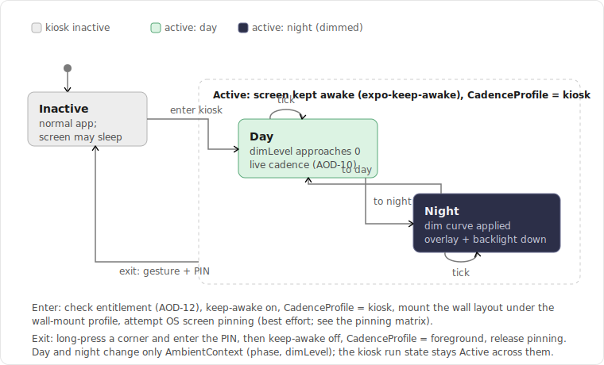
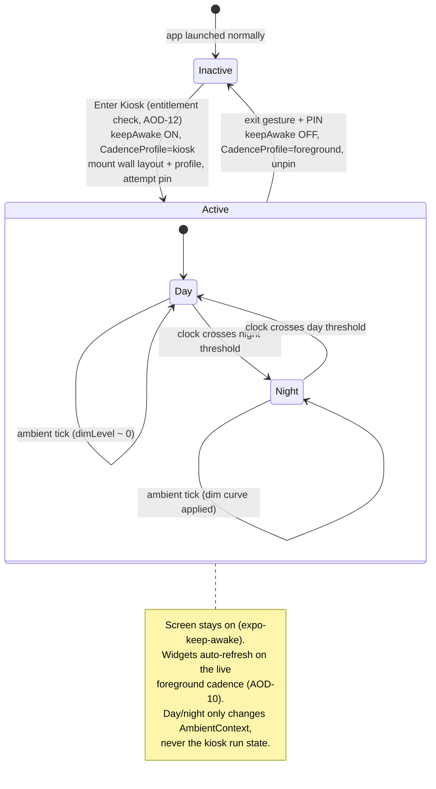
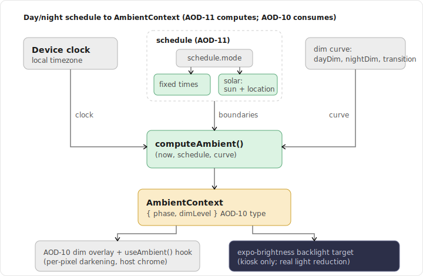
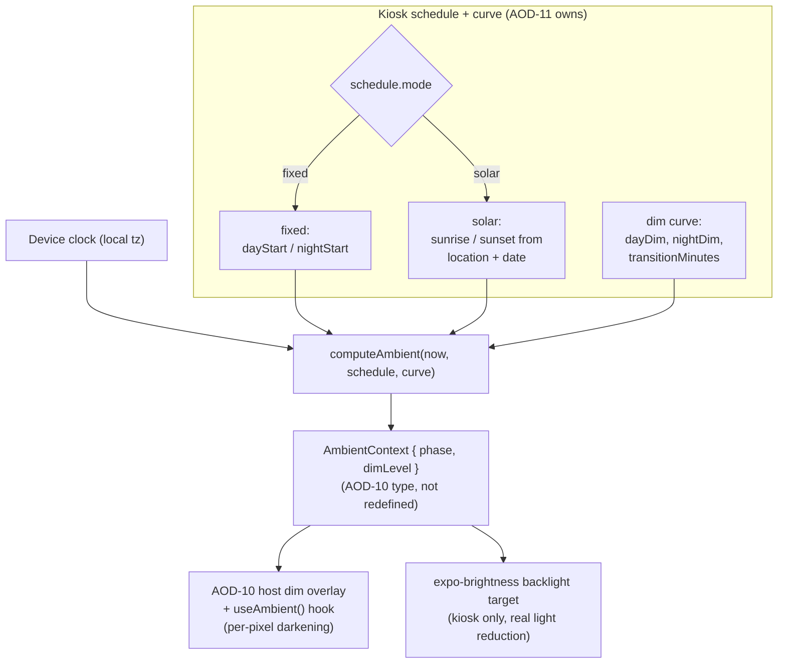

# Spec: Kiosk Mode (Screen-On, Auto-Refresh, Day/Night Dim)

> Status: draft for review, 2026-06-18. Tracked by [AOD-11](https://linear.app/thexap/issue/AOD-11) (`type:spec`). Owns the **kiosk policy** that drives the hooks [AOD-10](https://linear.app/thexap/issue/AOD-10) (widget model, Done) defined. Renders a [DashboardLayout](https://github.com/xap5xap/alwaysOnDashboard/blob/main/docs/specs/architecture-registry.md) from [AOD-8](https://linear.app/thexap/issue/AOD-8) (registry contract, Done) without touching the layout seam, and runs over the same proxy and refresh paths as [AOD-9](https://linear.app/thexap/issue/AOD-9) (OAuth/token model, Done). Builds on the locked decisions in [AOD-6](https://linear.app/thexap/issue/AOD-6) (v1 service set) and [AOD-7](https://linear.app/thexap/issue/AOD-7) (free-form layout).

## 1. Purpose and scope

Kiosk Mode is the flagship feature: a phone or cheap tablet mounted on a wall or desk as an always-on ambient display that keeps its screen on, auto-refreshes every widget with no user interaction, dims itself at night, and is not trivially dismissed. Xavier is user zero and dogfoods it on a Fire HD 8 showing Linear issues and Claude usage.

AOD-10 deliberately built the widget mechanism with kiosk in mind and then handed three seams to this spec (AOD-10 section 10): the **cadence profile** the scheduler reads, the **day/night schedule and dim curve** that drive the dimming hook, and **keep-screen-on, pinning, and the wall-mount layout**. This spec fills exactly those seams and nothing AOD-10 already owns.

> **One sentence:** AOD-10 defined the hooks a widget exposes; AOD-11 is the runtime that keeps the device awake and foregrounded, drives those hooks on a schedule, and presents an existing layout as a wall display.

**In scope (the AOD-11 work list from the issue body and the AOD-10 handoffs):**

- **Enter/exit lifecycle**: the UI to start kiosk, the active run state, and an exit affordance (gesture + PIN) so a wall display is not dismissed by a passer-by.
- **Keep the screen awake**: the per-platform mechanism (verified), and how it realizes AOD-10's "kiosk = foreground that never ends."
- **Auto-refresh with zero interaction**: setting AOD-10's `CadenceProfile` to `"kiosk"` so the on-device timer runs the live cadence AOD-10 section 6.5 says only foreground/kiosk can achieve.
- **Wall-mount layout profile**: dark theme, larger type, higher contrast, expressed as a presentation profile over a normal `DashboardLayout` (AOD-8) so the registry/layout seam (AOD-8/AOD-7) is untouched.
- **Day/night auto-dimming**: the schedule (fixed-time or solar) and the dim curve that compute AOD-10's `AmbientContext { phase, dimLevel }`, plus the kiosk-only backlight reduction the overlay alone cannot do.
- **Optional screen-pinning**: an honest per-platform account of what a consumer install can and cannot enforce.
- **Fire HD 8 specifics**: a normal Android app, no third-party kiosk launcher, with Fire OS quirks called out.

**Out of scope (neighbors, named so the frame is clear):**

- **The widget-level mechanism is AOD-10's** ([widget-model.md](widget-model.md)): the refresh cadence model, the effective-interval computation and floors, the lifecycle states, and the day/night dimming *hook* (`AmbientContext`, `useAmbient()`, `dimsWithAmbient`). This spec **drives** those hooks; it does not redefine them. Where it needs `CadenceProfile`, `AmbientContext`, or `RefreshInterval`, it imports them by reference.
- **Entitlement gating is [AOD-12](https://linear.app/thexap/issue/AOD-12)** (blocked by the billing decision [AOD-3](https://linear.app/thexap/issue/AOD-3)). The vision makes Kiosk Mode a Pro feature. This spec leaves a single clean gate where the tier check plugs in (section 4.4) and never decides tier boundaries or enforcement.
- **Token and proxy mechanics are AOD-9's** and are fixed. Kiosk fetches widget data through the same `proxy` and is kept authenticated by the same server-side scheduled and inline refresh (section 6.3). Referenced, not redefined.
- **The specific v1 widget subset is [AOD-4](https://linear.app/thexap/issue/AOD-4)** (open). The wall-mount profile does not depend on it; candidate widgets (Linear "My issues", Claude usage, Clock) appear only as illustrative examples.

## 2. Locked context this builds on

| Source | What it locks | How this spec uses it |
|---|---|---|
| [AOD-10](https://linear.app/thexap/issue/AOD-10) §6.5 | Foreground / kiosk / background cadence bounds. Background is OS-capped to best-effort, no faster than ~15 min; only foreground/kiosk run a live sub-15-minute cadence. Kiosk is "foreground that never ends." | Section 5 (keep-awake) is the mechanism that makes the app never background, which is what realizes the kiosk row of that table. Section 6 sets the profile that turns it on. |
| [AOD-10](https://linear.app/thexap/issue/AOD-10) §6.6 | The scheduler reads `CadenceProfile = "foreground" \| "kiosk"`, default `"foreground"`; AOD-11 decides when it is `"kiosk"` and may pair it with a kiosk interval multiplier. | Section 6 sets `"kiosk"` for the active session and defines the optional night multiplier as the only kiosk cadence behavior. |
| [AOD-10](https://linear.app/thexap/issue/AOD-10) §8 | The dimming hook: `AmbientContext { phase, dimLevel }`, the `useAmbient()` hook, and `dimsWithAmbient` (default true, host applies a global dim overlay). AOD-11 owns the schedule and curve that set `phase`/`dimLevel`. | Section 8 computes `AmbientContext` from a schedule and curve and feeds it into AOD-10's overlay/hook. It adds a backlight target the overlay cannot reach. |
| [AOD-8](https://linear.app/thexap/issue/AOD-8) §8 | `DashboardLayout { id, userId, name, instances }`; "Kiosk" is already named as a valid layout name. Adding kiosk must not edit layout/dashboard internals. | Section 7 makes the wall display a *presentation profile* over an existing `DashboardLayout`, selected by id. No new layout engine, no registry edit. |
| [AOD-7](https://linear.app/thexap/issue/AOD-7) | Layout is free-form drag-and-resize; the instance carries an arbitrary rect. | The wall layout is an ordinary free-form layout the user builds with the normal editor. The profile changes type scale and theme at render, not geometry. |
| [AOD-9](https://linear.app/thexap/issue/AOD-9) §8, §9 | Server-side scheduled refresh (pg_cron) keeps tokens warm; inline refresh covers the gap; `proxy` is the only data path and returns `409 needs_reconnect` for a dead credential. | Section 6.3 relies on these unchanged: a 24/7 wall display stays authenticated server-side, and a credential death surfaces through AOD-10's existing `disconnected` lifecycle state. |
| [AOD-6](https://linear.app/thexap/issue/AOD-6) | v1 service set: Linear, Google Calendar, Claude usage, Weather, Clock. | The Fire HD 8 worked example (section 10) uses the Linear + Claude usage wall, Xavier's real dogfood. |

Platform capabilities that bound what "kiosk" can enforce (keep-awake, screen pinning, brightness) are load-bearing and were verified against current Expo and platform documentation on 2026-06-18 (section 12).

## 3. How this spec relates to AOD-10 (drives, does not redefine)

AOD-11 introduces its own types for kiosk policy and **consumes** AOD-10/AOD-8 types at the seam. It adds no members to the AOD-8 or AOD-10 interfaces; it reads them.

```typescript
import type { DashboardLayout } from "./architecture-registry";          // AOD-8
import type { AmbientContext, DaylightPhase, CadenceProfile, RefreshInterval } from "./widget-model"; // AOD-10

// The kiosk session is a thin runtime over an existing layout. It owns policy, not mechanism.
type KioskRunState = "inactive" | "active";

interface KioskConfig {
  layoutId: DashboardLayout["id"]; // which layout to mount as the wall display (AOD-8); "Kiosk" by convention
  keepAwake: boolean;              // default true; section 5
  schedule: DayNightSchedule;      // drives AmbientContext; section 8
  curve: DimCurve;                 // the dim ramp; section 8
  controlBacklight: boolean;       // default true on Android/Fire: also drive expo-brightness from dimLevel; section 8.3
  profile: WallMountProfile;       // presentation over the layout; section 7
  pinning: PinningRequest;         // requested OS pinning; what is enforceable is platform-bound; section 9
  exit: ExitPolicy;                // app-level guard against casual dismissal; section 4.3
  nightIntervalMultiplier?: number; // optional kiosk cadence behavior, >= 1, default 1; section 6.2
}
```

The relationship in one line per seam:

- `CadenceProfile` (AOD-10 §6.6): AOD-11 sets it to `"kiosk"` for the active session. **Read by AOD-10, set by AOD-11.**
- `AmbientContext` (AOD-10 §8): AOD-11 computes it from `schedule` + `curve` over time. **Type owned by AOD-10, values owned by AOD-11.**
- `DashboardLayout` (AOD-8 §8): AOD-11 selects one by id and renders it under `WallMountProfile`. **Owned by AOD-8, presented by AOD-11.**

Nothing here touches the layout engine, the widget host's resolution logic, the registry, or the broker. The seams from AOD-8/AOD-9/AOD-10 all hold.

## 4. Entering and exiting Kiosk Mode

### 4.1 The lifecycle

A device is either running the app normally (`inactive`) or running as a wall display (`active`). Day and night are **sub-conditions of `active`**, not separate run states: crossing a day/night boundary changes `AmbientContext` and nothing else about the session.



<details>
<summary>Mermaid source</summary>



</details>

### 4.2 Enter

Kiosk is started from a layout: Settings, or a "Start Kiosk" action on a dashboard, hands a `KioskConfig` to the controller. Entering is an ordered, reversible sequence:

```typescript
interface KioskController {
  state: KioskRunState;
  enter(cfg: KioskConfig, ent: Entitlements): Promise<void>; // no-op if not entitled (section 4.4)
  exit(pin?: string): Promise<boolean>;                       // false if a required PIN is wrong
}
```

On `enter(cfg, ent)`:

1. **Entitlement check** (section 4.4). If `!ent.canUseKiosk`, surface the Pro upsell and stop. Everything below runs only when entitled.
2. **Keep-awake on** (section 5): `activateKeepAwakeAsync("kiosk")`.
3. **Cadence profile** (section 6): set `CadenceProfile = "kiosk"` so AOD-10's scheduler runs the live cadence continuously.
4. **Mount the wall layout** (section 7): render `cfg.layoutId` under `cfg.profile` (dark, larger type), with edit chrome hidden.
5. **Start the ambient driver** (section 8): begin computing `AmbientContext` from `cfg.schedule` + `cfg.curve`; if `controlBacklight`, also drive `expo-brightness`.
6. **Attempt pinning** (section 9): best effort per platform. Pinning failing or being declined never blocks kiosk; the app-level exit lock (4.3) is the portable guard.
7. `state = "active"`.

### 4.3 Exit (the dismissal guard)

A wall display must not be dismissed by a stray tap, yet the owner must be able to leave. Because no consumer platform lets the app *force* itself pinned (section 9), AOD-11 provides a portable **app-level** exit lock that holds regardless of OS pinning:

```typescript
interface ExitPolicy {
  gesture: "long_press_corner"; // the affordance that begins an exit; not a single tap
  holdMs: number;               // e.g. 2000; a deliberate hold, not a brush
  requirePin: boolean;          // default true on a wall display
  // PIN is verified against a hash held in expo-secure-store; the plaintext PIN is never stored or logged.
}
```

`exit(pin)` reverses enter in order: verify the gesture and (if `requirePin`) the PIN; on success release pinning, set `CadenceProfile = "foreground"`, `deactivateKeepAwake("kiosk")`, restore system brightness, unmount the wall profile, and set `state = "inactive"`. A wrong PIN returns `false` and the session stays active. This guard is independent of, and composes with, whatever OS pinning the platform did or did not grant.

### 4.4 Entitlement seam (AOD-12)

Kiosk Mode is a Pro feature (product vision, Monetization). AOD-11 exposes exactly one gate and decides no tier policy:

```typescript
// AOD-12 owns the shape and the decision. AOD-11 consumes only the boolean.
interface Entitlements { canUseKiosk: boolean; /* AOD-12 fills the rest */ }
```

The check lives at the single entry point (`enter`, step 1). AOD-12 supplies `canUseKiosk`; AOD-11 never reads a plan, a receipt, or a tier. If AOD-12 later gates sub-features (for example multiple kiosk layouts or the premium widget packs shown on the wall), those plug in as additional booleans on `Entitlements` without changing the kiosk runtime.

## 5. Keep the screen awake

The always-on promise rests on one mechanism: the display never sleeps while kiosk is active. AOD-11 uses Expo's first-party `expo-keep-awake`, which is a thin wrapper over the native "do not sleep" primitive on each platform. Both primitives were confirmed from the module source on 2026-06-18 (section 12).

| Platform | Native mechanism (verified) | Scope |
|---|---|---|
| iOS | `UIApplication.shared.isIdleTimerDisabled = true` | Disables the idle/auto-lock timer while the app is foreground. Released when deactivated or the app backgrounds. |
| Android / Fire OS | `activity.window.addFlags(WindowManager.LayoutParams.FLAG_KEEP_SCREEN_ON)` | Keeps the screen on while the activity is visible. Cleared on deactivate. |

Usage is tag-scoped so kiosk owns its own lock without fighting any incidental keep-awake elsewhere:

```typescript
// On enter: activateKeepAwakeAsync("kiosk");  On exit: deactivateKeepAwake("kiosk").
// Equivalently, while the kiosk surface is mounted: useKeepAwake("kiosk").
```

**The load-bearing caveat.** Both native primitives are **app-scoped**: they hold only while the app is the visible foreground app. The moment the app backgrounds, the idle timer re-arms (iOS) or the window flag stops applying (Android), and the screen can sleep. This is precisely why keep-awake and "stay foregrounded" are the same requirement, and why AOD-10 section 6.5 frames kiosk as "foreground that never ends." Keep-awake stops the screen sleeping; staying foregrounded (helped, not guaranteed, by pinning in section 9, and enforced against casual exit by section 4.3) keeps the app the thing that is awake. Together they deliver a screen that stays lit and a JS runtime that keeps ticking, which is the substrate section 6 schedules on.

## 6. Auto-refresh with zero interaction

### 6.1 Setting the profile is the whole trick

AOD-10 already built the refresh engine: an on-device timer fires each widget at its effective interval, with cross-device coalescing through the AOD-9 proxy cache. The only thing standing between that engine and an always-fresh wall is the app's run state. AOD-10 section 6.5 is explicit: a backgrounded app is OS-capped to best-effort refresh no faster than ~15 minutes, while a foreground/kiosk app runs the real interval continuously.

Kiosk does not implement any refresh logic. It sets one value:

```typescript
// AOD-10's scheduler reads this. Default "foreground". Kiosk sets it for the active session.
const profile: CadenceProfile = "kiosk";
```

Because section 5 guarantees the app stays foreground and awake, the kiosk profile is the assertion "the foreground timer will keep running, so schedule on it without backgrounding fallbacks." Every widget on the mounted layout then refreshes on its AOD-10 effective interval with zero user interaction, all day. No pulls, no taps. Manual-refresh widgets (AOD-10 §6.6) keep their tick-less behavior; they refresh on mount and stay put, which on a wall is the correct "show last value" behavior for a manually-updated card.

This is the entire reason kiosk is the flagship feature and not a setting: it is the only run state in which the product delivers reliable sub-15-minute auto-refresh.

### 6.2 The one kiosk cadence behavior: an optional night slowdown

AOD-10 section 6.6 allows AOD-11 to "pair the profile with a kiosk-specific interval multiplier." AOD-11 defines exactly one, and it is optional and conservative: at night, when the display is dimmed and unobserved, the cadence may be slowed to save power and provider quota. It never speeds anything up and never breaches an AOD-10 floor, because multiplying an already-clamped interval *upward* cannot drop below a lower bound.

```typescript
// Thin wrapper around the AOD-10 effective interval. It does not recompute or re-clamp it;
// AOD-10 already applied minRefreshSeconds and the entitlement floor. This only stretches it at night.
function kioskInterval(effective: RefreshInterval, ambient: AmbientContext, cfg: KioskConfig): RefreshInterval {
  if (effective === "manual") return "manual";
  const mult = ambient.phase === "night" ? Math.max(1, cfg.nightIntervalMultiplier ?? 1) : 1;
  return { seconds: effective.seconds * mult };
}
```

With `nightIntervalMultiplier` left at its default of `1`, kiosk runs the same cadence day and night, and the base always-on promise holds unchanged. Setting it to, say, `2` halves overnight refreshes on a bedroom wall. This is a power policy, not a freshness policy: it is the only cadence lever kiosk pulls.

### 6.3 Staying authenticated 24/7 (AOD-9, unchanged)

A wall display runs for days. Tokens expire; that is AOD-9's job, not AOD-11's. The kiosk relies on AOD-9 exactly as written:

- **Server-side scheduled refresh** (AOD-9 §8.2, pg_cron) rotates near-expiry OAuth tokens independent of the device, so a 24/7 kiosk never has to be touched to stay connected.
- **Inline refresh** (AOD-9 §8.3) covers the gap if a proxied call lands on a just-expired token.
- **Credential death** surfaces through AOD-10's existing lifecycle: the proxy returns `409 needs_reconnect`, the widget enters AOD-10's `disconnected` state, and the host shows a "Reconnect" prompt on the wall. Kiosk adds no new failure path; it inherits the one AOD-9/AOD-10 already defined.

## 7. Wall-mount layout profile

### 7.1 A profile over a layout, not a new layout

The wall display needs larger type, higher contrast, and a dark theme so it reads across a room and does not glare. The constraint from AOD-8 is hard: adding kiosk must not edit layout or dashboard internals. So the wall-mount look is a **presentation profile applied at render over an ordinary `DashboardLayout`**, selected by id. AOD-8 section 8 already lists "Kiosk" as a valid layout name; this spec just renders that layout differently.

```typescript
interface WallMountProfile {
  theme: "dark";             // wall mount is a dark theme by default (ambient, low glare)
  typeScale: number;         // multiplier on the base type ramp, e.g. 1.4, for across-the-room legibility
  minContrast: "AA" | "AAA"; // minimum text/background contrast the host enforces in this profile
  hideChrome: boolean;       // suppress edit handles, nav bars, and status chrome while active
}
```

### 7.2 Why this keeps the seam intact

- **Layout geometry is untouched.** The user builds the wall layout with the normal free-form editor (AOD-7): drag, resize, arbitrary rects. The profile changes type scale, theme, and chrome at render. It never moves a widget or rewrites a rect. `reconcileSize` and every AOD-10 size rule apply unchanged.
- **Widget render props are untouched.** AOD-8 §6.1 fixes the render contract at `{ data, config, size }`. The profile is host chrome, exactly like AOD-10's dim overlay: the host scales type and themes the frame around each widget; a widget author writes nothing kiosk-specific. A widget that *wants* to adapt to the dark theme can read it through the same context channel as `useAmbient()`, but it is never required to.
- **No registry edit.** Turning on kiosk adds no `ServiceDefinition`, no `WidgetDefinition`, and no broker entry. It is a runtime mode over data the registry already produced. This is the AOD-8 acceptance ("new behavior without editing layout/dashboard/registry internals") holding for a whole feature, not just a new service.

The result: the same dashboard a user glances at on their phone becomes a wall display by mounting its layout under this profile. Nothing about the three-layer model changes.

## 8. Day/night auto-dimming

### 8.1 What AOD-11 owns here

AOD-10 section 8 defined the dimming *hook*: `AmbientContext { phase, dimLevel }`, the `useAmbient()` hook, the `dimsWithAmbient` default that makes the host apply `dimLevel` as a global overlay. It explicitly left the **schedule and the curve** to AOD-11. This section is that schedule and curve: the function that produces `AmbientContext` over time, and a kiosk-only backlight reduction the overlay alone cannot achieve.



<details>
<summary>Mermaid source</summary>



</details>

### 8.2 The schedule and the curve

Two scheduling modes, covering the lazy default and the precise option:

```typescript
type MinutesOfDay = number;        // 0..1439, local wall-clock minutes
interface GeoCoord { lat: number; lng: number; }

type DayNightSchedule =
  | { mode: "fixed"; dayStartMin: MinutesOfDay; nightStartMin: MinutesOfDay; transitionMinutes: number }
  | { mode: "solar"; location: GeoCoord | "weatherWidget" | "device"; transitionMinutes: number };

interface DimCurve {
  dayDim: number;   // dimLevel during full day, 0..1, default 0 (no dimming)
  nightDim: number; // dimLevel at full night, 0..1, default ~0.7 (deep dim, not black)
  // dimLevel eases between the two across transitionMinutes around each boundary (8.4).
}
```

- **`fixed`**: the user sets a day-start and night-start time (for example 07:00 and 21:00). Zero permissions, fully predictable. This is the recommended default.
- **`solar`**: day and night follow local sunrise and sunset, computed from a latitude/longitude and the date using a standard solar-position calculation, recomputed once per day. Location precedence avoids asking for a new permission: an explicit `GeoCoord`, else the location the Weather widget already uses (`"weatherWidget"`, available because Weather is in the v1 set), else device geolocation (`"device"`, only if the user has already granted it). If no location can be resolved, the kiosk falls back to `fixed` defaults rather than failing.

`transitionMinutes` is the ramp width: the display does not snap from bright to dim at the boundary, it eases across this window so a glance at dusk sees a gradual fade, not a step.

### 8.3 Two ways to dim, because the overlay is not enough

This is the substantive addition over AOD-10's hook. There are two physically different ways to make a screen darker, and a wall display at night wants both:

1. **Per-pixel darkening (AOD-10's overlay).** `dimLevel` drives AOD-10's global dim overlay (`dimsWithAmbient: true` widgets) or is read by `useAmbient()` (widgets that self-manage). This darkens what is *drawn* but the backlight still emits at full power, so a dark-grey screen at full backlight still throws real light into a dark room.
2. **Backlight reduction (kiosk only).** To actually emit less light, AOD-11 also drives the screen backlight via `expo-brightness`, app-scoped, while kiosk is the foreground app. This is legitimate precisely because kiosk owns the device. AOD-10 could not do this (a normal foreground app should not seize the user's brightness); a kiosk wall display should.

```typescript
// Map dimLevel onto an app-scoped backlight target. Applied only when cfg.controlBacklight (default true on
// Android/Fire). AOD-10's overlay still runs; the two compose (darker pixels AND less backlight at night).
function backlightFor(ambient: AmbientContext, cfg: KioskConfig): number | null {
  if (!cfg.controlBacklight) return null;
  const floor = 0.06; // never fully black; a wall display should stay faintly readable at deepest night
  return Math.max(floor, 1 - ambient.dimLevel); // dimLevel 0 -> ~full; dimLevel 0.7 -> 0.3 backlight
}
// On enter: Brightness.setBrightnessAsync(backlightFor(...)); on each ambient change re-apply;
// on exit: Brightness.restoreSystemBrightnessAsync().
```

Platform reality for the backlight lever (verified, section 12): on Android and Fire OS `setBrightnessAsync` overrides the system brightness while the app is foreground, which is exactly the kiosk case. On iOS the brightness change is app-effective but persists until the device is locked or powered off, so the kiosk restores system brightness on exit; `controlBacklight` therefore defaults true on Android/Fire and may be left false on iOS, where the AOD-10 overlay carries the dimming on its own. Either way the dimming hook AOD-11 drives is AOD-10's; the backlight is an additive kiosk capability, not a redefinition.

### 8.4 The curve, concretely

`computeAmbient` is the function AOD-10 section 8 asked AOD-11 to provide. It returns AOD-10's `AmbientContext`; it does not redefine it.

```typescript
const mod = (a: number, n: number) => ((a % n) + n) % n;
const lerp = (a: number, b: number, t: number) => a + (b - a) * t;
const smoothstep = (t: number) => { const x = Math.min(1, Math.max(0, t)); return x * x * (3 - 2 * x); };

// Resolve the day-start and night-start minutes for `now` (fixed: as configured; solar: from sun times).
function boundaries(now: Date, s: DayNightSchedule): { dayStart: MinutesOfDay; nightStart: MinutesOfDay };

function computeAmbient(now: Date, schedule: DayNightSchedule, curve: DimCurve): AmbientContext {
  const { dayStart, nightStart } = boundaries(now, schedule);
  const m = now.getHours() * 60 + now.getMinutes();
  const T = Math.max(1, schedule.transitionMinutes);

  // phase: day inside [dayStart, nightStart), handling the midnight wrap.
  const inDay = nightStart > dayStart
    ? (m >= dayStart && m < nightStart)
    : (m >= dayStart || m < nightStart);
  const phase: DaylightPhase = inDay ? "day" : "night";

  // dimLevel: flat by default, eased across each boundary window.
  const sinceNight = mod(m - nightStart, 1440); // minutes since the day->night boundary
  const sinceDay = mod(m - dayStart, 1440);      // minutes since the night->day boundary
  let dimLevel: number;
  if (sinceNight < T)      dimLevel = lerp(curve.dayDim, curve.nightDim, smoothstep(sinceNight / T)); // dusk ramp
  else if (sinceDay < T)   dimLevel = lerp(curve.nightDim, curve.dayDim, smoothstep(sinceDay / T));   // dawn ramp
  else                     dimLevel = inDay ? curve.dayDim : curve.nightDim;                          // steady

  return { phase, dimLevel };
}
```

The ambient driver calls `computeAmbient` on a coarse timer (for example once a minute, far cheaper than widget refresh) and on each result publishes the `AmbientContext` into AOD-10's context (driving the overlay and `useAmbient()`) and, if `controlBacklight`, sets the backlight. `phase` is also what `kioskInterval` (section 6.2) reads for the optional night slowdown, so the schedule cleanly ties the dimming and the cadence together without either side knowing the other's internals.

## 9. Optional screen-pinning: per-platform reality

"Optional screen-pinning so the device stays in the app" is in the issue's Must-cover list, and honesty about it is the most important thing in this spec. **No consumer app installed from the App Store or Play Store, on an unsupervised device, can force itself to stay pinned.** Every true lockdown path requires either the user to act or the device to be provisioned/supervised by its owner. AOD-11 surfaces the best available option per platform and relies on the app-level exit lock (section 4.3) as the portable guard.

| Platform | Mechanism | Can the app pin itself? | Can the user leave? | What AOD-11 does |
|---|---|---|---|---|
| **Android / Fire OS** (user screen pinning) | User enables "Screen pinning / Pin app" in Settings, then pins from Recents (or the app calls `startLockTask()` while not an allow-listed device-owner). A confirmation appears. | No, not silently. An un-allow-listed `startLockTask()` shows the system pin confirmation. | Yes: hold Back + Overview/Recents. | Default path. Detect pinned state, offer one-time setup guidance, and keep the exit lock as the real guard. |
| **Android / Fire OS** (device-owner lock task) | `DevicePolicyManager.setLockTaskPackages([us])` + `startLockTask()`. True kiosk: no confirmation, user cannot leave until `stopLockTask()`. | Yes, fully. | No. | Requires device-owner provisioning (`adb shell dpm set-device-owner`, or MDM enrollment) on a factory-clean device with no other accounts. Documented as the power-user/managed lockdown, not the consumer flow. |
| **iOS** (Guided Access) | User enables Guided Access in Accessibility, triple-clicks the side button to start it. | No. There is no App Store API to start/stop it on an unsupervised device. | Yes, the user who started it can end it. | Surface a "for a locked wall, turn on Guided Access" instruction. The app cannot invoke it. |
| **iOS** (Autonomous Single App Mode) | `UIAccessibility.requestGuidedAccessSession(enabled:)`. | Only on a **supervised** (MDM) device where the app is allow-listed via `AutonomousSingleAppModePermittedAppIDs`. | Controlled by the session. | Out of scope for a consumer install; available only to managed deployments. Noted for completeness. |

The honest conclusion, stated plainly in-product: on a normal install, pinning is a best-effort convenience, not a lock. The app-level **gesture + PIN exit** (section 4.3) is what actually stops a passer-by from swapping away with a casual tap; it works identically on every platform because it is enforced inside the app, not by the OS. A determined person on an unpinned device can still leave via the OS gesture, and the spec does not pretend otherwise. Owners who want a true lock use device-owner lock task (Android/Fire) or Guided Access (iOS), both of which the product explains but neither of which it can force.

## 10. Fire HD 8 worked example

This threads the model through Xavier's real dogfood device: a Fire HD 8 on the wall showing Linear "My issues" and Claude usage. It is the basis of the proposed acceptance (section 11).

**The device.** A Fire HD 8 runs Fire OS, which is Android underneath: Fire OS 7 (the 2020 10th-gen) is Android 9 / API 28; Fire OS 8 (the 2022 12th-gen) is Android 11 / API 30 (verified, section 12). Either way, the alwaysOnDashboard Expo app is a normal Android build, sideloaded for dogfooding (or shipped via the Amazon Appstore). **No third-party kiosk launcher (Fully Kiosk Browser or similar) is required**; kiosk provides keep-awake, auto-refresh, the wall profile, and dimming itself.

**Enter.** Xavier opens the app, picks his "Kiosk" layout (Linear "My issues" filtered to AOD, plus a Claude usage card and a clock), and taps Start Kiosk. Entitlement passes (Pro). The controller turns on keep-awake (`FLAG_KEEP_SCREEN_ON` on this Android device), sets `CadenceProfile = "kiosk"`, mounts the layout under the dark wall-mount profile at `typeScale 1.4`, starts the ambient driver, and attempts pinning.

**Screen stays on.** `FLAG_KEEP_SCREEN_ON` holds the screen awake while the app is foreground, overriding the Fire's aggressive default sleep. As a belt-and-suspenders step the device Display sleep is also set long, but the app flag is what carries it.

**Auto-refresh.** With the kiosk profile, the Linear "My issues" card refreshes on its AOD-10 effective interval (say 300s) and the Claude usage card on its own, continuously, with no interaction. Cross-device coalescing (AOD-10 §6.3) and the AOD-9 proxy cache mean the wall and Xavier's phone share provider calls. Tokens stay valid via AOD-9 server-side refresh without anyone touching the tablet.

**Day/night.** Xavier picks `solar` mode reusing the Weather widget's location. At dusk the dim curve eases `dimLevel` from 0 toward 0.7 across the transition window; AOD-10's overlay darkens the pixels and, because `controlBacklight` is true on Fire/Android, `expo-brightness` drops the backlight to about 0.3, so the bedroom wall stops glowing. At dawn it eases back. Optionally `nightIntervalMultiplier: 2` halves overnight refreshes.

**Pinning and exit.** Fire OS exposes standard AOSP screen pinning (Settings > Security & Privacy > Screen pinning); Xavier enables it once and pins the app, which keeps a casual tap from leaving. The real guard is the app-level exit: long-press a corner for 2 seconds, enter the PIN. For a truly locked wall he could provision the tablet as device owner over ADB, but for a personal dogfood the pin + PIN is enough.

**Fire OS quirks, called out.** Fire tablets ship without Google Play Services, so the app must not depend on them; the v1 stack does not (Supabase auth/proxy over HTTPS, on-device timers for refresh rather than push). The lock-screen "Special Offers" ads never appear because in kiosk the screen does not lock. Distribution can be sideload or Amazon Appstore; neither changes the kiosk behavior.

## 11. Proposed acceptance

The AOD-11 issue body has a Must-cover list but, like AOD-8 and AOD-10, no explicit acceptance line. Proposed acceptance for this spec (called out for confirmation):

> 1. **Screen-on + zero-interaction refresh.** Entering Kiosk Mode keeps the screen awake through a verified per-platform mechanism (iOS `isIdleTimerDisabled`, Android/Fire OS `FLAG_KEEP_SCREEN_ON`, via `expo-keep-awake`) and sets AOD-10's `CadenceProfile` to `"kiosk"`, so every widget on the mounted wall layout auto-refreshes on its live foreground cadence with no user interaction, continuously, for as long as kiosk is active. Kiosk drives the existing engine; it defines no new refresh logic.
> 2. **Day/night dimming drives AOD-10's hook.** A day/night schedule (fixed-time or solar sunrise/sunset) and a dim curve compute AOD-10's `AmbientContext { phase, dimLevel }` over time via a concrete `computeAmbient`, feeding both AOD-10's host overlay / `useAmbient()` hook and, on Android/Fire OS, an additive `expo-brightness` backlight reduction. AOD-11 owns the schedule and curve and does not redefine the hook.
> 3. **Wall profile and pinning honesty.** The wall-mount profile (dark theme, larger type scale, higher contrast) renders over an existing free-form `DashboardLayout` (AOD-8/AOD-7) without editing any layout, dashboard, or registry internals, and the screen-pinning section states honestly, per platform, what a consumer install can and cannot enforce, with the app-level gesture + PIN exit as the portable guard.
> 4. **Fire HD 8 + lifecycle diagram.** The Fire HD 8 is walked end to end as a normal Android app needing no third-party kiosk launcher, and the kiosk lifecycle (enter, active with day/night transitions, exit) is given as a validated diagram.

Where each is met:

| Acceptance clause | Where |
|---|---|
| Keep-awake mechanism (verified) + `CadenceProfile = "kiosk"` realizing the live cadence; no new refresh logic | Sections 5, 6.1; lifecycle section 4.2 |
| Day/night schedule + curve computing `AmbientContext`; overlay/hook + backlight; hook not redefined | Sections 8.2, 8.3, 8.4; diagram in 8.1 |
| Wall profile over an existing layout with the AOD-8/AOD-7 seam intact; per-platform pinning honesty + app-level exit | Sections 7, 9, 4.3 |
| Fire HD 8 end to end, no third-party launcher; validated lifecycle diagram | Section 10; diagram in 4.1 |
| Concrete TypeScript that consumes (not restates) the AOD-8/AOD-10 types | Section 3 and throughout |
| Clean entitlement seam for AOD-12; AOD-9 token paths referenced not redefined; no dependence on AOD-4 | Sections 4.4, 6.3, 1 (scope) |

## 12. Verified platform claims

The screen-on, pinning, and brightness facts bound what kiosk can enforce, so they were verified against current documentation and source on 2026-06-18:

- **Keep-awake native primitives (from `expo-keep-awake` source).** iOS sets `UIApplication.shared.isIdleTimerDisabled` (`KeepAwakeModule`); Android calls `activity.window.addFlags(WindowManager.LayoutParams.FLAG_KEEP_SCREEN_ON)` and clears it on deactivate (`ExpoKeepAwakeManager`). Both are app-scoped to the foreground/visible app. The public API is `useKeepAwake(tag?)` / `activateKeepAwakeAsync(tag?)` / `deactivateKeepAwake(tag?)`.
- **Brightness (`expo-brightness`).** `setBrightnessAsync(0..1)` sets an app-scoped brightness that overrides the system value while the app is foreground; `restoreSystemBrightnessAsync()` reverts it. On Android the app has its own brightness that can override the global setting; on iOS the system setting cannot be changed programmatically and an app brightness change persists until the device is locked or powered off (hence restore-on-exit, and `controlBacklight` defaulting true only on Android/Fire).
- **Android lock task vs user screen pinning.** Only a **device owner** can allow-list packages via `DevicePolicyManager.setLockTaskPackages(...)` so `startLockTask()` pins with no confirmation and no user exit until `stopLockTask()`. Without device owner, screen pinning is user-initiated, shows a confirmation, and the user can exit by holding Back + Overview. Device owner requires provisioning on a clean device (ADB `dpm set-device-owner` or MDM).
- **iOS Guided Access / ASAM.** Guided Access is user-initiated (Accessibility + triple-click); there is no App Store API to toggle it on an unsupervised device. `UIAccessibility.requestGuidedAccessSession(enabled:)` (Autonomous Single App Mode) works only on supervised (MDM) devices where the app is allow-listed via the `AutonomousSingleAppModePermittedAppIDs` restriction.
- **Fire HD 8 / Fire OS.** Fire OS 8 (Fire HD 8 2022, 12th-gen) is based on Android 11 / API 30; Fire OS 7 (Fire HD 8 2020, 10th-gen) is Android 9 / API 28. Fire tablets run normal Android apps and support sideloading; they ship without Google Play Services. Standard AOSP screen pinning is present (user-initiated).

If a build-time detail differs from the above, fix the build against the current docs, then update this section.

## 13. References

- [AOD-11](https://linear.app/thexap/issue/AOD-11): this spec's tracking issue.
- [AOD-10](https://linear.app/thexap/issue/AOD-10): widget model. Owns the cadence profile, the dimming hook, the cadence bounds, and the lifecycle this spec drives. ([widget-model.md](widget-model.md))
- [AOD-8](https://linear.app/thexap/issue/AOD-8): registry contract. Owns the `DashboardLayout` and the seam this spec renders over without editing. ([architecture-registry.md](architecture-registry.md))
- [AOD-9](https://linear.app/thexap/issue/AOD-9): OAuth broker and token model. Owns the proxy and the scheduled/inline refresh that keep a 24/7 kiosk authenticated. ([oauth-token-model.md](oauth-token-model.md))
- [AOD-7](https://linear.app/thexap/issue/AOD-7): free-form layout. The wall layout is an ordinary free-form layout; the profile changes presentation, not geometry.
- [AOD-6](https://linear.app/thexap/issue/AOD-6): v1 service set. Source of the Linear + Claude usage wall example.
- [AOD-12](https://linear.app/thexap/issue/AOD-12): freemium entitlement model. Owns the `canUseKiosk` gate this spec leaves a seam for.
- [AOD-4](https://linear.app/thexap/issue/AOD-4): v1 widget subset (open). Not depended on; wall widgets are illustrative.
- [`docs/product-vision.md`](../product-vision.md): Kiosk Mode (flagship feature), Monetization (Kiosk is Pro), Fire HD 8 origin.
- [`docs/engineering-process.md`](../engineering-process.md): the `type:spec` lifecycle and the `docs/specs/` convention.
- Expo KeepAwake (verified 2026-06-18): [docs.expo.dev/versions/latest/sdk/keep-awake](https://docs.expo.dev/versions/latest/sdk/keep-awake/); native mechanisms confirmed in `expo/expo` package source (`packages/expo-keep-awake`).
- Expo Brightness (verified 2026-06-18): [docs.expo.dev/versions/latest/sdk/brightness](https://docs.expo.dev/versions/latest/sdk/brightness/).
- Android lock task mode (verified 2026-06-18): [developer.android.com/work/dpc/dedicated-devices/lock-task-mode](https://developer.android.com/work/dpc/dedicated-devices/lock-task-mode).
- iOS Autonomous Single App Mode (verified 2026-06-18): [requestGuidedAccessSession](https://developer.apple.com/documentation/uikit/uiaccessibility/1615186-requestguidedaccesssession).
- Fire OS 8 platform (verified 2026-06-18): [developer.amazon.com/docs/fire-tablets/fire-os-8.html](https://developer.amazon.com/docs/fire-tablets/fire-os-8.html).
