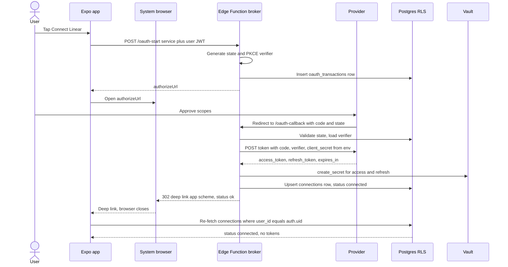
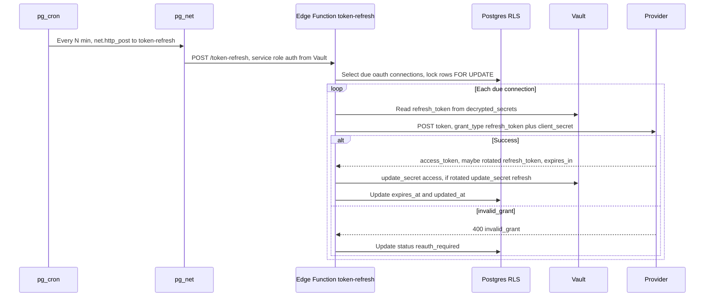
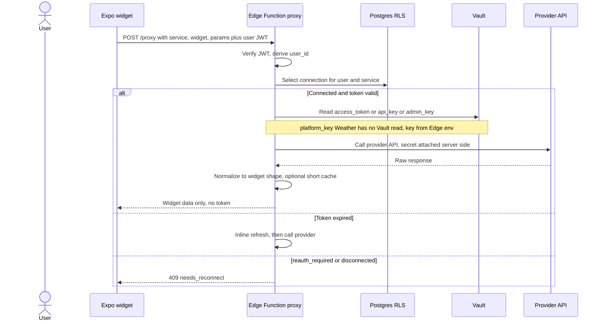
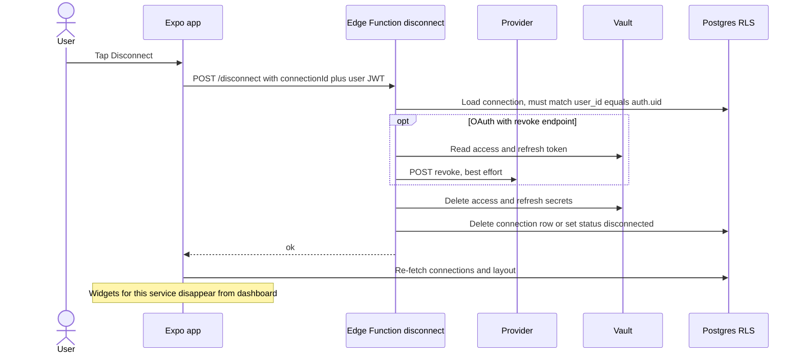

# Spec: OAuth Broker and Per-User Token Model

> Status: draft for review, 2026-06-18. Tracked by [AOD-9](https://linear.app/thexap/issue/AOD-9) (`type:spec`). Builds on the locked backend stack in [AOD-2](https://linear.app/thexap/issue/AOD-2) (Supabase). The disconnect data-handling policy depends on [AOD-5](https://linear.app/thexap/issue/AOD-5) (privacy posture, still open); this spec defines the mechanical flow and a recommended default, and flags the policy choice as owned by AOD-5.
>
> Amended 2026-06-22 ([AOD-13](https://linear.app/thexap/issue/AOD-13)): Weather moves from the per-user `api_key` class to a new `platform_key` class (a platform-owned provider key in Edge env, with a user-supplied location and no per-user credential), per the [AOD-4](https://linear.app/thexap/issue/AOD-4) v1 widget set decision. Affects §4, §5.1, §5.4, §6, §7.2, §8.1, §9, §10, §11.

## 1. Purpose and scope

This spec defines how alwaysOnDashboard connects a user to a third-party service, stores that user's credentials, keeps them valid over time, and uses them to fetch widget data, all without a client secret or a long-lived token ever reaching the device.

It is the backend contract that the Phase 1 Foundation build implements. It covers:

- Server-side OAuth authorization-code exchange, with the client secret held only in the backend.
- Per-user encrypted token storage and refresh-token rotation.
- API proxying through the backend so providers are only ever called server-side.
- The credential classes the broker supports: OAuth, API key, Admin key, platform-owned key, and no-auth.
- Token revocation and the disconnect flow.

Out of scope (owned elsewhere): the freemium entitlement gate ([AOD-12](https://linear.app/thexap/issue/AOD-12)), the widget config and refresh-interval model ([AOD-10](https://linear.app/thexap/issue/AOD-10)), and the privacy data-retention policy ([AOD-5](https://linear.app/thexap/issue/AOD-5)). Where this spec touches those, it references them rather than deciding them.

## 2. Locked context this builds on (from AOD-2)

The backend platform is Supabase. The pieces this spec relies on, each verified against current Supabase docs on 2026-06-18:

| Capability | Role in this spec | Verified mechanic |
|---|---|---|
| Edge Functions (Deno) | Host the broker. Hold OAuth client secrets, run the auth-code exchange, refresh, proxy, and disconnect. | Secrets read at runtime via `Deno.env.get()`, set with `supabase secrets set`, available without redeploy. |
| Postgres + Row-Level Security | Per-user isolation of connection metadata. | RLS policies keyed to `auth.uid()`. |
| Vault | Encryption at rest for tokens and keys. | `vault.create_secret()` / `vault.update_secret()`; read through the `vault.decrypted_secrets` view; AEAD via libsodium; root key held outside the database. |
| pg_cron + pg_net | Scheduled, server-side token refresh. | `cron.schedule()` runs `net.http_post()` to invoke an Edge Function; granularity from sub-minute upward; the call's auth token is itself stored in Vault. |

These are not re-litigated here. If a build-time detail of any of them differs from the above, fix the build against the doc, then update this table.

## 3. Security goals

The model is designed to hold these properties. Every later section is in service of them.

1. **Client secrets never ship.** OAuth client secrets live only in Edge Function env, never in the app bundle or any client response.
2. **Tokens never reach the device.** Access tokens, refresh tokens, API keys, and Admin keys are written and read only server-side. The device holds a Supabase session JWT (via expo-secure-store) and nothing else credential-bearing.
3. **Encrypted at rest.** All third-party secrets are stored through Vault. A database backup or a SQL-level dump contains ciphertext only; the decryption key is held by Supabase outside the database.
4. **Per-user isolation.** One user can never read another user's connection rows or secrets. RLS enforces this at the table; the `vault` schema is not exposed to the `anon` or `authenticated` roles at all.
5. **No open relay.** The proxy calls only provider endpoints declared in the server-side service registry, never a URL supplied by the client. This blocks the broker from being turned into an SSRF relay.
6. **Least surprise on failure.** When a credential expires or is revoked, the affected widget degrades to a clear "needs reconnect" state instead of leaking an error or silently showing stale data forever.

## 4. The seam: credential classes, not per-service flows

The product's core architecture rule is that adding an integration must not require touching dashboard or layout code; a new service is a registry entry plus its widgets. The token model mirrors that rule one layer down: **the broker has one code path per credential class, not one per service.** A new service declares its class and its endpoints in the service registry and inherits the matching flow. No new broker code.

| Class | v1 services | Credential captured | Server-side code exchange | Stored secret(s) | Refreshed |
|---|---|---|---|---|---|
| `oauth2` | Linear, Google Calendar | authorization code (via browser redirect) | Yes | access token + refresh token | Yes, when the provider returns an expiry and a refresh token |
| `api_key` | none in v1 | user-supplied API key | No | the API key (per-user, in Vault) | No |
| `admin_key` | Anthropic usage | user-supplied `sk-ant-admin...` Admin key | No | the Admin key | No |
| `platform_key` | Weather | none; the user supplies a location, not a credential | No | none per-user; the provider key is a platform secret in Edge env | No |
| `none` | Clock / Date | nothing | n/a | nothing | n/a |

Notes per class:

- **`oauth2`.** Linear is GraphQL and uses an authorization-code flow; its access tokens are long-lived and it may not issue a refresh token, so the model treats refresh as conditional on the token response, not assumed. Google Calendar issues a short-lived access token (about one hour) plus a refresh token, and needs `access_type=offline` with `prompt=consent` to reliably return that refresh token. The flow is the same code path; the registry entry carries the per-provider parameters.
- **`api_key`.** A user pastes a provider API key once; it is stored encrypted in Vault and attached server-side on every proxied call. After AOD-4 no v1 service uses this class (Weather moved to `platform_key`, below); it stays specified as the general per-user-key case the broker must support, and is the natural home for future paste-your-key integrations.
- **`admin_key`.** Anthropic org usage and cost reports require an Admin key (`sk-ant-admin...`), which is distinct from a normal API key and is org-wide in scope. Mechanically it is a static bearer secret like `api_key`, but it is flagged high-sensitivity: a leak exposes the whole organization's usage data, so it is never logged, never returned, and only ever attached to the two Admin endpoints (`GET /v1/organizations/usage_report/messages` and `/v1/organizations/cost_report`).
- **`platform_key`.** Weather. The provider key is owned by the platform, not the user: it lives in Edge Function env (the same place as an OAuth client secret, §5.4) and the `proxy` attaches it server-side on the allow-listed call. The user supplies only a **location** (city or coordinates), which is non-credential config stored on the connection row (§5.1), never in Vault. There is no per-user secret to capture, store, refresh, or revoke. A `platform_key` connection is still a **backend-cost** service: every widget refresh is a metered provider call on the platform's key, so it **counts** toward the Free service limit (AOD-3, enforced by [AOD-12](https://linear.app/thexap/issue/AOD-12) §7.1, whose predicate counts every class except `none`). That cost is exactly what separates it from `none`: Clock has no backend involvement and is exempt; Weather has backend cost and is not. The final weather vendor is confirmed at wiring (leading candidate Open-Meteo commercial, per [AOD-4](https://linear.app/thexap/issue/AOD-4)).
- **`none`.** Clock has no service connection and no backend involvement at all. It exists in the table to make explicit that the registry handles the zero-credential case; such widgets render purely on-device.

## 5. Data model

### 5.1 `connections`

One row per user per connected service. Holds metadata and references to Vault secrets, never the secret material itself.

| Column | Type | Notes |
|---|---|---|
| `id` | `uuid` PK | `default gen_random_uuid()` |
| `user_id` | `uuid` | references `auth.users(id)`; the RLS anchor |
| `service` | `text` | `linear`, `google_calendar`, `anthropic_usage`, `weather`, ... |
| `auth_class` | `text` | `oauth2` / `api_key` / `admin_key` / `platform_key` |
| `status` | `text` | `connected` / `reauth_required` / `error` / `disconnected` |
| `scopes` | `text[]` | granted scopes (oauth2) |
| `access_secret_id` | `uuid` | reference into `vault.secrets` for the access token or API/Admin key; null for `platform_key` (no per-user secret) |
| `refresh_secret_id` | `uuid` | reference into `vault.secrets` for the refresh token (oauth2 only, nullable) |
| `config` | `jsonb` | non-secret per-connection config; for `platform_key` Weather, the user-supplied location (`{ city }` or `{ lat, lon }`). Null when the class needs none. Never holds credential material |
| `expires_at` | `timestamptz` | access-token expiry; null when the token does not expire |
| `account_label` | `text` | display only, e.g. the Google email or Linear workspace name |
| `created_at` / `updated_at` | `timestamptz` | |

The secret reference columns hold only the Vault secret UUIDs. Those UUIDs are useless to a client: the `vault.decrypted_secrets` view lives in the `vault` schema, which is not exposed through the API and not granted to `anon` or `authenticated`, and the decryption key is external to the database. So even a user reading their own row (which RLS allows) learns nothing decryptable. A `platform_key` connection (Weather) is the limiting case: it has null `access_secret_id` and `refresh_secret_id` and carries only its `config` (the location), so there is nothing secret in the row at all; the location is non-credential and safe for its owner to read under RLS.

### 5.2 `oauth_transactions`

Short-lived state for an in-flight authorization, so the callback can validate CSRF state and complete PKCE.

| Column | Type | Notes |
|---|---|---|
| `id` | `uuid` PK | |
| `user_id` | `uuid` | who started the connect |
| `service` | `text` | which service is being connected |
| `state` | `text` | random CSRF value echoed by the provider |
| `code_verifier` | `text` | PKCE verifier (where the provider supports PKCE) |
| `expires_at` | `timestamptz` | about 10 minutes; a cron job prunes expired rows |

### 5.3 RLS policies

- RLS enabled on `connections` and `oauth_transactions`.
- Policy on both: `user_id = auth.uid()` for select, insert, update, delete.
- Writes that involve token material do not go through the client at all; they run inside Edge Functions using the service role (which bypasses RLS) and always scope their queries by the authenticated `user_id`. RLS is the backstop for any direct client read, not the only line of defense.

### 5.4 Where secrets and keys live

| Secret | Stored in | Read by |
|---|---|---|
| Per-user access / refresh tokens, API keys, Admin keys | Vault (`vault.secrets`) | Edge Functions only, via `vault.decrypted_secrets` |
| OAuth client secrets (one per oauth2 provider) | Edge Function env (`LINEAR_CLIENT_SECRET`, `GOOGLE_CLIENT_SECRET`, ...) | The broker Edge Functions |
| Platform provider keys (one per `platform_key` provider) | Edge Function env (e.g. `WEATHER_PROVIDER_KEY`) | The `proxy` Edge Function, attached on the allow-listed call |
| Supabase service-role key | Edge Function env (`SUPABASE_SERVICE_ROLE_KEY`, provided by the platform) | Edge Functions only; never sent to the client |
| pg_cron to Edge Function auth token | Vault | The scheduled refresh job |

## 6. The broker surface (Edge Functions)

| Function | Class(es) | Purpose |
|---|---|---|
| `oauth-start` | oauth2 | Build the provider authorize URL, generate `state` and PKCE verifier, persist an `oauth_transactions` row, return the URL. |
| `oauth-callback` | oauth2 | Receive the provider redirect, validate `state`, exchange the code (with the client secret) for tokens, store them, deep-link back to the app. |
| `credentials-store` | api_key, admin_key, platform_key | Accept the user's input over TLS and write the connection row. For `api_key` / `admin_key`, optionally test the supplied key with one provider call, then store it in Vault. For `platform_key`, store only the supplied location as the connection `config` (§5.1); no Vault secret is written. |
| `token-refresh` | oauth2 | Invoked by pg_cron. Refresh near-expiry tokens, rotate refresh tokens, mark dead connections `reauth_required`. Also callable on-demand for inline refresh. |
| `proxy` | all (except none) | The widget data path. Authenticate the user, load the connection, attach the secret server-side, call the registered provider endpoint, return shaped data. |
| `disconnect` | all (except none) | Best-effort provider revoke, purge Vault secrets, retire the connection row. |

Every function authenticates the caller from the Supabase session JWT first and derives `user_id` from it. `oauth-callback` is the one exception that is reached by a provider redirect rather than the app; it authenticates by validating the `state` and looking up the matching `oauth_transactions` row.

### 6.1 The service registry

A single server-side registry declares each service so the functions above stay generic:

```
service = {
  id, auth_class,
  // oauth2 only:
  authorize_url, token_url, revoke_url, default_scopes, supports_pkce,
  // proxy:
  api_base, auth_header_style,   // e.g. "Authorization: Bearer", "x-api-key"
  widgets: { [widgetId]: { method, path }   // allow-listed endpoints
}
```

Adding a service is a registry entry plus, for oauth2, its client secret in Edge env, and for `platform_key`, its platform provider key in Edge env. The proxy only ever calls `api_base` + an allow-listed `widgets[...]` path, which is what makes goal 5 (no open relay) hold.

## 7. Connect

### 7.1 OAuth services (Linear, Google Calendar)

1. The app calls `oauth-start` with the service id and the user's JWT.
2. `oauth-start` generates a random `state` and a PKCE `code_verifier` / `code_challenge` (where the provider supports PKCE), writes an `oauth_transactions` row, and returns the provider's authorize URL. The registered redirect URI points at `oauth-callback`, an HTTPS endpoint the backend controls.
3. The app opens that URL in a system browser session (ASWebAuthenticationSession via expo-web-browser). The user approves scopes at the provider.
4. The provider redirects to `oauth-callback` with `code` and `state`. The callback validates `state` against the stored transaction, loads the `code_verifier`, then calls the provider token endpoint with the code, the verifier, and the client secret read from Edge env. The exchange is fully server-side.
5. The callback stores the returned access and refresh tokens as Vault secrets, writes or updates the `connections` row (`status=connected`, `scopes`, `expires_at`, secret references), and deletes the transaction.
6. The callback returns an HTTP redirect to the app's deep-link scheme (for example `alwaysondashboard://oauth/done?service=linear&status=ok`). The redirect carries a success signal only, never a token. The browser session closes and control returns to the app.
7. The app re-fetches its connection list (RLS-scoped) and sees the new connection. No token ever touched the device.

Because the redirect URI is a backend endpoint, the authorization code is delivered to the server over TLS rather than to the device; `state` defends against CSRF and PKCE adds protection on providers that support it.

### 7.2 Non-OAuth connect: keys and location (Anthropic usage, Weather)

No browser and no code exchange. The app POSTs once to `credentials-store` over TLS, and the function writes the `connections` row (`status=connected`, no `expires_at`, no refresh reference). What it collects depends on the class:

- **`admin_key` (and `api_key` in general).** The form collects a provider key. The function may make a single validation call to the provider, then stores the key in Vault. The key is never returned to the device afterward; the Settings UI shows only a masked hint and the `account_label`.
- **`platform_key` (Weather).** The form collects a **location** (city or coordinates), not a credential. The function stores that location as the connection's `config` (§5.1) and writes **no Vault secret**; the platform provider key never leaves Edge env. The connection still counts toward the service limit (§4, [AOD-12](https://linear.app/thexap/issue/AOD-12) §7.1). Settings shows the chosen location and a connected status, with no masked-key hint because there is no per-user key.

### Sequence: Connect (OAuth)



## 8. Token lifecycle and refresh

### 8.1 Expiry tracking

For `oauth2` connections that return an expiry, `expires_at` is the access-token deadline. Connections with no expiry (long-lived Linear tokens, API keys, Admin keys, and `platform_key` location connections) leave `expires_at` null and are never selected for refresh.

### 8.2 Scheduled refresh (pg_cron + pg_net + `token-refresh`)

A pg_cron job runs on a short interval (for example every 5 to 15 minutes) and `net.http_post()`s to the `token-refresh` Edge Function. The call's auth token is read from Vault, per the verified Supabase pattern.

`token-refresh` selects connections that are `oauth2`, `connected`, and within a grace window of expiry (`expires_at < now() + grace`), locking each row `FOR UPDATE` so a concurrent run or an inline refresh cannot double-spend a rotating refresh token. For each:

1. Read the refresh token from Vault.
2. Call the provider token endpoint with `grant_type=refresh_token` and the client secret.
3. On success, the provider returns a new access token, a new expiry, and possibly a rotated refresh token. Update the access secret in Vault; if a new refresh token came back, update that secret too, in the same transaction as the row's `expires_at`. This is the refresh-token rotation requirement: the old refresh token is replaced atomically and never reused.
4. On `invalid_grant` (refresh token expired or revoked at the provider), set `status=reauth_required` and stop retrying. The widget will show a reconnect prompt and the user re-runs the connect flow.

### 8.3 Inline (lazy) refresh

If a proxied call finds the access token expired between scheduled runs, the proxy triggers the same refresh logic inline for that one connection (under the same row lock) before calling the provider, so a widget request never fails merely because it landed in the gap. Scheduled refresh keeps the steady state warm; inline refresh covers the edge.

### 8.4 Single-flight guarantee

All refresh paths take the per-connection row lock (`FOR UPDATE`, or an advisory lock on the connection id). Only one refresh for a given connection runs at a time, which is what makes rotation safe under concurrency.

### Sequence: Scheduled refresh



## 9. API proxying

Every provider call goes through `proxy`. The client never holds a token and never names a URL; it names a service and a widget.

1. The app calls `proxy` with `{ service, widget, params }` and the user's JWT.
2. The function verifies the JWT and derives `user_id`. It then does privileged work with the service role, always scoped to that `user_id`.
3. It loads the user's `connections` row for the service. If `status` is `reauth_required` or `disconnected`, it returns `409 needs_reconnect` so the widget can render a reconnect prompt. If the token is expired, it runs inline refresh first (section 8.3).
4. It reads the access token, API key, or Admin key from Vault. For a `platform_key` service there is no per-user secret to read: the proxy takes the platform provider key from Edge env instead (§5.4).
5. It maps `service` + `widget` to an allow-listed endpoint in the registry and calls the provider, attaching the secret in the header style the registry declares (Bearer for Linear and Google, the provider's API-key header for Weather, the Admin key for the two Anthropic Admin endpoints). For Weather the attached key is the platform key from Edge env, and the user's stored location (§5.1) is passed as the provider's query parameters; no per-user secret is involved.
6. It normalizes the response to the widget's shape and may cache it briefly (a short TTL keyed by user, service, widget, and params) to cut provider calls and cost when several devices or the kiosk poll the same widget. The cache policy interacts with the widget refresh-interval model in [AOD-10](https://linear.app/thexap/issue/AOD-10).
7. It returns only the widget-relevant data. The token does not appear in the response.

Provider errors (429 rate limits, 5xx, timeouts) are mapped to a typed result so the widget can show a last-known or "temporarily unavailable" state rather than an opaque failure.

### Sequence: Proxied call



## 10. Disconnect and revocation

Disconnect is the inverse of connect: stop using the credential, revoke it at the provider where possible, and purge it.

1. The app calls `disconnect` with the connection id and the user's JWT.
2. The function loads the connection and confirms it belongs to the caller (`user_id = auth.uid()`).
3. If the service is `oauth2` and the registry declares a revoke endpoint, the function reads the token from Vault and calls the provider revoke endpoint. This is best-effort: a provider that is down or lacks a revoke endpoint does not block the local purge.
4. The function deletes the access and refresh Vault secrets and retires the connection row (see the policy note below). For `api_key` / `admin_key` there is a single key secret to delete and nothing to revoke; for `platform_key` (Weather) there is no per-user secret at all, so disconnect only retires the row and its stored location.
5. The app re-fetches connections and layout. Per the product rule, the widgets published by a now-disconnected service disappear from the dashboard; their layout slots resolve to "service not connected."

### 10.1 Policy choice owned by AOD-5

The mechanism above is fixed. One policy knob is not, and it belongs to the privacy posture decision in [AOD-5](https://linear.app/thexap/issue/AOD-5):

- **Hard delete (recommended default):** on disconnect, delete the Vault secrets and the `connections` row immediately. Nothing credential-bearing survives. This is the strongest privacy story and the cleanest thing to market.
- **Soft retire:** keep the row with `status=disconnected` and the secrets purged, so the user's prior `account_label` and scopes are remembered for a faster reconnect. Slightly more convenient, slightly more to explain in a privacy policy.

This spec recommends hard delete and implements soft retire only if AOD-5 calls for it. Either way the secrets are purged from Vault on disconnect; the only question is whether the metadata row lingers.

### Sequence: Disconnect



## 11. Open items to settle at build time

These do not block the spec but should be decided when Phase 1 implements it:

- **Privacy retention policy.** Hard delete vs soft retire on disconnect, plus any audit-logging stance. Owned by [AOD-5](https://linear.app/thexap/issue/AOD-5).
- **Refresh cadence and grace window.** The exact pg_cron interval and the expiry grace, tuned to Google's roughly one-hour access tokens versus the kiosk refresh rhythm.
- **Cache TTLs per widget.** Coupled to the widget refresh-interval model in [AOD-10](https://linear.app/thexap/issue/AOD-10).
- **Weather provider vendor.** The credential model is resolved (the `platform_key` class, §4, via [AOD-4](https://linear.app/thexap/issue/AOD-4) and [AOD-13](https://linear.app/thexap/issue/AOD-13)); the specific vendor is confirmed when Weather is wired (leading candidate Open-Meteo commercial).
- **Per-provider OAuth specifics to verify when wiring each service:** Linear's token lifetime and whether it issues refresh tokens; Google's `access_type=offline` / `prompt=consent` requirements and refresh-token rotation behavior; each provider's revoke endpoint.

## 12. Acceptance

The issue's acceptance criterion is sequence diagrams for connect, refresh, proxied-call, and disconnect. All four are present and validate as Mermaid sequence diagrams:

| Required diagram | Section |
|---|---|
| Connect | Section 7, "Sequence: Connect (OAuth)" |
| Refresh | Section 8, "Sequence: Scheduled refresh" |
| Proxied call | Section 9, "Sequence: Proxied call" |
| Disconnect | Section 10, "Sequence: Disconnect" |

## 13. References

- [AOD-9](https://linear.app/thexap/issue/AOD-9): this spec's tracking issue.
- [AOD-4](https://linear.app/thexap/issue/AOD-4): v1 widget set decision; chose the platform-owned Weather key with user-supplied location.
- [AOD-13](https://linear.app/thexap/issue/AOD-13): the amendment that introduced the `platform_key` class here and in AOD-8.
- [AOD-2](https://linear.app/thexap/issue/AOD-2): locked backend stack (Supabase). Constrains every choice here.
- [AOD-5](https://linear.app/thexap/issue/AOD-5): privacy posture, open. Owns the disconnect retention policy.
- [`docs/product-vision.md`](../product-vision.md): services to widgets to layout architecture, Tech direction, v1 service set.
- [`docs/engineering-process.md`](../engineering-process.md): the `type:spec` lifecycle and the doc-under-`docs/specs/` convention.
- Supabase docs verified 2026-06-18: Vault, Edge Function secrets, Cron (pg_cron), scheduling functions with pg_cron and pg_net.
- Anthropic Admin API: `GET /v1/organizations/usage_report/messages` and `/v1/organizations/cost_report`, authenticated with an Admin key (`sk-ant-admin...`).
