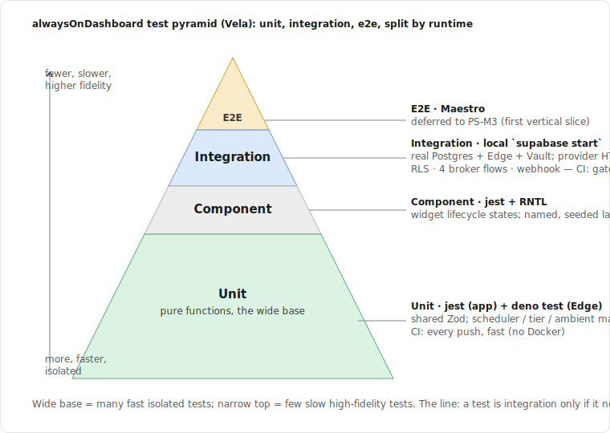
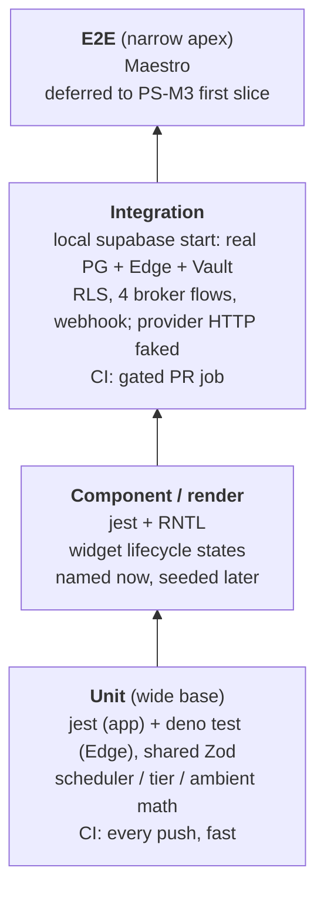

# Spec: Testing Strategy and Fixtures

> Status: draft for review, 2026-06-23. Tracked by [AOD-23](https://linear.app/thexap/issue/AOD-23) (`type:spec`). Builds on the locked dependency stack [AOD-25](https://linear.app/thexap/issue/AOD-25), which picked the test libraries (`jest` / `jest-expo` + `@testing-library/react-native` for the app, `deno test` for Edge Functions, Maestro for E2E) and explicitly deferred testing depth to this spec. It is the last foundational spec in PS-M1: the test pyramid and fixtures defined here are what the broker Edge Functions ([AOD-9](https://linear.app/thexap/issue/AOD-9)) and the schema ([AOD-22](https://linear.app/thexap/issue/AOD-22)) get built against.
>
> This spec decides the depth, not the libraries. The library choice is locked in AOD-25 and is not re-litigated. Where this spec names a test or a fixture, it names it; it does not author test files. The deliverable is this document.

## 1. Purpose and scope

This is the single source of truth for how alwaysOnDashboard is tested through PS-M1 (the backend platform) and what test assets exist before backend implementation begins. It defines the test pyramid, the line between its layers, the mocking strategy, the fixture world, the CI-versus-local split, and a concrete seed set of first tests that the schema and broker are written against.

In scope:

- The **test pyramid**: the unit, integration, and end-to-end layers, what each covers, and the rule that decides which layer a test belongs to.
- The **two runtimes**: `jest` (`jest-expo`) for the app and shared code, `deno test` for the Edge Functions and shared code, and how the one shared Zod module ([AOD-25](https://linear.app/thexap/issue/AOD-25)) is exercised from both.
- The **mocking strategy**: OAuth token responses, provider APIs, Vault, the RevenueCat webhook, and Supabase local for RLS.
- The **fixture data**: test users, connections, dashboards and widget instances, entitlement rows, and the transient rows (`oauth_transactions`, `proxy_cache`).
- **CI versus local**: what runs on every push, what runs as a gated pull-request job, and what is deferred.
- A **seed test set**: the AOD-25 pure functions, the RLS policy and constraint tests, the four broker flows, and the RevenueCat webhook idempotency. These are the first tests; they are named here, authored alongside the code they cover.

Out of scope, owned elsewhere and only referenced here:

- The test **library** choice. Owned by [AOD-25](https://linear.app/thexap/issue/AOD-25). This spec consumes it.
- The **schema, migrations, and RLS policies** under test. Owned by [AOD-22](https://linear.app/thexap/issue/AOD-22). This spec tests them; it does not redefine them.
- The **broker flows** under test (OAuth exchange, refresh, proxy, disconnect) and the **webhook** logic. Owned by [AOD-9](https://linear.app/thexap/issue/AOD-9) and [AOD-12](https://linear.app/thexap/issue/AOD-12). This spec asserts their behavior; it does not redefine it.
- **Observability and error tracking** (for example Sentry). A Launch-era concern (AOD-25 "out of scope"), not a foundational test concern.
- **Performance and the Fire HD 8 device spike** (AOD-25 / [AOD-16](https://linear.app/thexap/issue/AOD-16)). That is a one-time on-device validation, not part of the automated pyramid; it is named as a build-time item (§11), not a test layer.

This is a specification, not an implementation. The test names, fixture factories, and CI snippets here are illustrative of intent, in the same way the sibling specs embed TypeScript and SQL. No test files are authored and no CI is provisioned by this spec; that is PS-M1 build work that follows, done alongside the schema and the broker.

## 2. Locked context this builds on

| Source | What it fixes for this strategy |
|---|---|
| [AOD-25](https://linear.app/thexap/issue/AOD-25) | The libraries: `jest` (`jest-expo`) + `@testing-library/react-native` (app), `deno test` (Edge), Maestro (E2E). The seed pure functions: `effectiveInterval`, `reconcileSize`, `nextDelaySeconds`, `serverTier`, `mayUserTriggerFetch`. E2E deferred to the first vertical slice (PS-M3). One shared Zod module importing from both Metro and Deno. |
| [AOD-22](https://linear.app/thexap/issue/AOD-22) | The 8-table schema, the §8 RLS policy catalogue keyed to `auth.uid()`, the `proxy_cache` `<=900s` CHECK, the `widget_instances` / `kiosk_configs` dashboard-ownership WITH CHECK, the enum CHECKs, `unique(user_id, service)`, and the cascade behavior. The migration source of truth (`supabase` CLI) and that local dev runs the full stack via `supabase start`, so RLS is testable locally. |
| [AOD-2](https://linear.app/thexap/issue/AOD-2) | Backend is Supabase: Postgres + RLS, Vault, Edge Functions (Deno), pg_cron + pg_net. The local stack mirrors this, which is why integration tests can be real rather than mocked. |
| [AOD-9](https://linear.app/thexap/issue/AOD-9) | The broker: `oauth-start`, `oauth-callback`, `credentials-store`, `token-refresh`, `proxy`, `disconnect`; the service registry; the Vault read/write path; the four sequence flows (connect, refresh, proxied call, disconnect). Disconnect is hard delete ([AOD-5](https://linear.app/thexap/issue/AOD-5)). |
| [AOD-12](https://linear.app/thexap/issue/AOD-12) | The `revenuecat-webhook` (constant-time auth, idempotency on `event.id`, order-guard on `event_timestamp_ms`), and the pure functions `serverTier`, `serverEntitlements`, `mayUserTriggerFetch`, `tierFromActiveEntitlements`, `entitlementsFor`. |
| [AOD-10](https://linear.app/thexap/issue/AOD-10) | The device-side pure functions: `effectiveInterval`, `reconcileSize`, `nextDelaySeconds`, `cacheTtlSeconds`, `requestKey`, `validateConfig`, and the widget lifecycle states (§7). |
| [AOD-11](https://linear.app/thexap/issue/AOD-11) | The kiosk pure functions: `computeAmbient`, `kioskInterval`, `backlightFor`. |

These are not re-litigated. If a build-time detail of Supabase local (Vault availability, `functions serve`, the Auth admin API) differs from what this spec assumes, fix the build against the current Supabase docs and update §11.

## 3. The test pyramid



Four bands. The wide base is pure-function unit tests, split across the two runtimes over the one shared Zod module. A thin component and render band sits above it, named now and seeded later. The middle band is integration against the real local stack. The narrow apex is end-to-end, deferred to PS-M3.

<details>
<summary>Mermaid source</summary>



</details>

### 3.1 Where the line sits

One rule classifies every test. It is about what the test *needs to run*, not what it conceptually covers.

- **Unit.** Callable with plain inputs; asserts outputs; **nothing is mocked because there is nothing to mock.** All of the scheduler, tier, and ambient math, plus the Zod schemas. If a test needs a running Postgres or an HTTP server, it is not a unit test. This is the wide base: the most tests, the fastest, the cheapest, run on every push.
- **Integration.** Needs the **real local stack** brought up by `supabase start`: real Postgres (so RLS, CHECK constraints, cascades, and the `FOR UPDATE` lock are exercised), the real Edge runtime, and real Vault. The **only** fakes are the third-party **provider HTTP** boundary and the inbound **RevenueCat POST**. Vault is real, so the Vault write, rotate, and delete path is asserted by reading secrets back, not stubbed.
- **End-to-end.** The whole app on a device or emulator driving a real backend. Deferred to PS-M3 (§9). Named here, not authored.

The consequence of the rule: the boundary between unit and integration is the presence of the local stack, and the boundary between integration and E2E is the presence of the app on a device. "What must be faked grows upward": unit fakes nothing, integration fakes only the two external boundaries it cannot host locally, E2E fakes as little as the store and provider sandboxes allow.

### 3.2 The two runtimes and the shared module

AOD-25 fixed two runners because the codebase has two execution targets, and one module that spans both:

| Target | Runner | What it holds |
|---|---|---|
| App (Expo, Metro) | `jest` (`jest-expo`) + `@testing-library/react-native` | Device-side pure functions (the AOD-10 scheduler, the AOD-11 kiosk math), the client UX-only entitlement path, and (later) component and render tests. |
| Edge Functions (Deno) | `deno test` | The broker functions, the webhook, and the server-side pure functions (`serverTier`, `mayUserTriggerFetch`). Hosts the integration layer for backend code. |
| Shared Zod module | both | Validation schemas and the `Entitlements` math used on both sides of the trust boundary. Imported by Metro and by Deno. |

The shared module is the one place a single function is reachable from both runtimes. The convention: **test a shared function in the runtime that owns its primary use**, and add **one cross-runtime import smoke test under `deno test`** that proves the module loads as an npm specifier in Deno. That smoke test is the cheap guard for the AOD-25 wiring risk ("the shared Zod module must import cleanly from both Metro and Deno, confirmed at wiring"). The webhook body schema is additionally parsed under `deno test` because the webhook validates it in Deno, so both runtimes exercise Zod in anger.

## 4. The unit layer (pure functions)

The wide base. Every function here is deterministic and I/O-free, which is exactly why AOD-25 seeded the strategy with them: highest ROI, lowest cost. Each is tied to the spec that defines it; this spec only enumerates the cases worth pinning.

### 4.1 jest (app and shared)

| Function | Source | Test cases (each one assertion) |
|---|---|---|
| `effectiveInterval` | [AOD-10](https://linear.app/thexap/issue/AOD-10) §6.2 | desired below the floor clamps up to `max(minRefreshSeconds, entitlementFloorSeconds)`; desired above the floor passes through; `entitlementFloorSeconds=0` (Pro) applies only the widget floor; `"manual"` passes through unclamped. |
| `reconcileSize` | [AOD-10](https://linear.app/thexap/issue/AOD-10) §5.2 | a tall narrow rect picks `tall` over `medium`; aspect dominates area; equal-aspect rects fall to the area tiebreak; a rect far from every class still returns the nearest supported one; `supported[0]` is the fallback seed. |
| `nextDelaySeconds` | [AOD-10](https://linear.app/thexap/issue/AOD-10) §6.4 | exponential growth caps at 1800s; the exponent caps at 6 consecutive failures; `rate_limited` with `retryAfterSeconds` returns it exactly; `needs_reconnect` returns `"stop"`. |
| `requestKey` | [AOD-10](https://linear.app/thexap/issue/AOD-10) §6.3 | `{a,b}` and `{b,a}` produce the identical key (sorted canonical params); different params produce different keys. |
| `kioskInterval` | [AOD-11](https://linear.app/thexap/issue/AOD-11) §6.2 | `phase=night` multiplies by `nightIntervalMultiplier`; `phase=day` is unchanged; multiplier defaults to 1 (no-op); the result never drops below the AOD-10 floor (multiply is upward only); `"manual"` passes through. |
| `backlightFor` | [AOD-11](https://linear.app/thexap/issue/AOD-11) §8.3 | `controlBacklight=false` returns `null`; `dimLevel=0` maps near full; `dimLevel=0.7` maps to ~0.3; the 0.06 floor is never breached at `dimLevel=1`. |
| `computeAmbient` | [AOD-11](https://linear.app/thexap/issue/AOD-11) §8.4 | `phase` is `day` inside `[dayStart, nightStart)`; the midnight-wrap case (nightStart < dayStart) resolves `phase` correctly; `dimLevel` is flat `dayDim` mid-day and flat `nightDim` deep night; the dusk and dawn windows ease via `smoothstep` (monotone between the two endpoints). |
| `validateConfig` | [AOD-10](https://linear.app/thexap/issue/AOD-10) §4.2 | required-and-absent errors; absent-and-optional applies `default`; `number` honors `min`/`max`/`step`; `enum` membership; `remote-options` with `resolvedOptions` enforces membership; `remote-options` without `resolvedOptions` validates as `unverified` rather than failing. |
| `tierFromActiveEntitlements` / `entitlementsFor` | [AOD-12](https://linear.app/thexap/issue/AOD-12) §4, §5.2 | active set containing `pro` resolves Pro, else Free; `entitlementsFor("free")` and `("pro")` return the AOD-3 matrices; `Infinity` limits make `current >= max` never true on Pro. |

### 4.2 deno test (Edge and shared)

| Function | Source | Test cases (each one assertion) |
|---|---|---|
| `serverTier` / `serverEntitlements` | [AOD-12](https://linear.app/thexap/issue/AOD-12) §6.3 | `null` row resolves Free; `tier=pro` within `current_period_end` resolves Pro; `status=in_grace` keeps Pro; an elapsed `current_period_end` downgrades to Free even with `tier=pro` (the missed-EXPIRATION backstop); `serverEntitlements` returns the full `Entitlements` for the resolved tier. |
| `mayUserTriggerFetch` | [AOD-12](https://linear.app/thexap/issue/AOD-12) §6.4 | floor is `max(widgetTtlSeconds, entitlementFloorSeconds)`; a Free user (`900`) polling at 60s age is refused until 900s; a Pro user (`0`) is gated only by the widget TTL. |
| `cacheTtlSeconds` | [AOD-10](https://linear.app/thexap/issue/AOD-10) §6.1 | the author override wins when set; a `"manual"` default still yields a caching TTL (300s); the 15s minimum is never breached. |
| constant-time compare | [AOD-12](https://linear.app/thexap/issue/AOD-12) §6.2 | equal secrets return true, unequal return false; the helper is the Web Crypto one used by the webhook auth check. |
| shared Zod schemas | [AOD-22](https://linear.app/thexap/issue/AOD-22) §7.3, [AOD-10](https://linear.app/thexap/issue/AOD-10) §4 | `DayNightSchedule` (fixed and solar variants), `DimCurve`, `WallMountProfile`, `WidgetConfig`, `RefreshInterval`, and the RevenueCat webhook body each accept a valid fixture and reject a malformed one; out-of-range values (for example `night_interval_multiplier < 1`, `dimLevel > 1`) are rejected. |
| cross-runtime import smoke | [AOD-25](https://linear.app/thexap/issue/AOD-25) | the shared module imports under Deno via its npm specifier without error. The single guard for the Metro-and-Deno import contract. |

The split is by where the function runs in production: the AOD-10 scheduler and AOD-11 kiosk math run on the device (jest); `serverTier` and `mayUserTriggerFetch` run inside the proxy and webhook (deno). The shared Zod schemas are validated under deno because the webhook parses them there, and under jest implicitly through `validateConfig`.

## 5. The integration layer

The middle band. These tests need the real local stack (`supabase start`) and exist to prove the things a unit test structurally cannot: that RLS isolates users, that a CHECK rejects bad data, that a cascade fires, that the broker writes Vault and the row together, and that the webhook is idempotent. They are authored alongside the migrations and Edge Functions they cover, which is the point of writing this spec before that code: the schema and broker are built against these named tests.

### 5.1 RLS and schema constraints (Postgres)

Two harnesses against the same local database:

- **Policy tests use real per-user JWTs.** A test creates users through the Supabase Auth admin API (service role), mints each a session, and builds a `supabase-js` client carrying that user's token (the `authenticated` role). Queries run exactly as the app issues them, through PostgREST under RLS. This is the production path, not a SQL simulation. Cross-user isolation is asserted by having user B's client read and get zero of user A's rows.
- **Constraint and cascade tests use direct SQL** on a service-role or migration connection, where the assertion is about the table itself (a CHECK rejects, a unique upserts, a parent delete cascades) rather than about a policy.

The §8 catalogue of [AOD-22](https://linear.app/thexap/issue/AOD-22), one test per row:

| Group | Test | Asserts |
|---|---|---|
| `connections` | select own / no client write / cross-user empty | owner reads own rows; any client insert, update, or delete is denied (server-written table); user B sees none of user A's connections. |
| `oauth_transactions` | no client access at all | select, insert, update, delete are all denied to `authenticated` (the table holds the live PKCE `code_verifier`). |
| `entitlements` | select own / no client write | owner reads own row; client writes are denied (webhook-written); cross-user read is empty. |
| `proxy_cache` | no client access | the device never reads or writes this table directly (proxy-only, service role). |
| `dashboards` | owner CRUD / cross-user denied | owner can insert, select, update, delete own rows; user B cannot touch user A's dashboard. |
| `widget_instances` | owner CRUD + dashboard-ownership WITH CHECK | owner CRUD works; inserting an instance whose `dashboard_id` belongs to user B is rejected by the WITH CHECK, even when `user_id` is spoofed to the caller. |
| `kiosk_configs` | owner CRUD + dashboard-ownership WITH CHECK | same dashboard-ownership cross-check as `widget_instances`. |
| `user_settings` | owner CRUD | owner CRUD works; cross-user denied. |
| CHECK: `proxy_cache` 900s ceiling | reject `expires_at > fetched_at + 900s`; reject `expires_at <= fetched_at` | the AOD-5 cache ceiling is structural, not policy. |
| CHECK: `night_interval_multiplier >= 1` | reject `< 1` | kiosk can only stretch a cadence, never speed it up. |
| CHECK: enums | reject out-of-set `auth_class`, `status`, `tier`, `size` | the text+CHECK enums hold. |
| Unique: `connections(user_id, service)` | a duplicate connect upserts, does not duplicate | one connection per user per service. |
| Cascade: account deletion | deleting `auth.users` row wipes all application tables | `connections`, `oauth_transactions`, `entitlements`, `dashboards`, `widget_instances`, `kiosk_configs`, `user_settings`, `proxy_cache`. |
| Cascade: dashboard deletion | deleting a `dashboards` row wipes its children | `widget_instances` and `kiosk_configs` for that dashboard. |

Vault references are not a foreign key, so account-deletion Vault purge is the broker's job, asserted in §5.2 (disconnect), not by a cascade test.

### 5.2 The four broker flows (Edge + Postgres + Vault)

The integration tests for the broker import the Edge Function handler under `deno test`, run it against the real local Postgres and Vault (via the service-role connection), and stub `globalThis.fetch` for the provider boundary. This pattern keeps Vault real (secrets are written and read back through `vault.decrypted_secrets`) while faking only the outbound provider HTTP the registry's `api_base` / `token_url` point at. The four flows are the [AOD-9](https://linear.app/thexap/issue/AOD-9) acceptance diagrams, now as tests:

| Flow | AOD-9 | Tests |
|---|---|---|
| **Connect** | §7 | `oauth-start` writes an `oauth_transactions` row (with `state` and PKCE `code_verifier`) and returns the provider authorize URL; `oauth-callback` with a valid `state` exchanges the code against the faked token endpoint, writes the access and refresh secrets to Vault, upserts the `connections` row to `status=connected` with `scopes` and `expires_at`, and deletes the transaction; `oauth-callback` with a bad or expired `state` is rejected and writes nothing. |
| **Refresh** | §8 | `token-refresh` selects a near-expiry `oauth2` connection, refreshes against the faked token endpoint, and on a **rotated** refresh token updates both Vault secrets and `expires_at` atomically (the old refresh token is gone); a faked `invalid_grant` sets `status=reauth_required` and stops; the `FOR UPDATE` lock serializes a concurrent refresh so a rotating token is never double-spent. |
| **Proxied call** | §9 | `proxy` loads the connection, reads the access secret from Vault (or, for `platform_key` Weather, takes the key from Edge env and reads no Vault), calls the faked provider, normalizes, and writes `proxy_cache`; a `reauth_required` or `disconnected` connection returns `409 needs_reconnect`; an expired token triggers inline refresh before the provider call; a second call within the TTL is served from `proxy_cache` (one provider hit). |
| **Disconnect** | §10, [AOD-5](https://linear.app/thexap/issue/AOD-5) | `disconnect` calls the faked provider revoke (best effort), deletes the access and refresh Vault secrets, hard-deletes the `connections` row, deletes that service's `proxy_cache` rows, and eagerly deletes the `widget_instances` for that `service_id`; a provider revoke failure does not block the local purge. |

### 5.3 The RevenueCat webhook (Edge + Postgres)

The webhook is an HTTP POST with an Authorization header and a JSON body; no SDK is involved server-side. Tests POST canned event fixtures (§7) at the handler and assert the `entitlements` row. This is the idempotency coverage AOD-23 calls out, plus the auth and event-mapping cases from [AOD-12](https://linear.app/thexap/issue/AOD-12) §6.2 and §6.3:

| Test | Asserts |
|---|---|
| auth: bad header | a wrong Authorization header returns `401` and nothing is written; the compare is constant-time. |
| idempotency: duplicate `id` | re-POSTing an event whose `id == last_event_id` acks `200` and leaves the row unchanged. |
| order-guard: stale event | an event with `event_timestamp_ms <= last_event_ms` is acked and ignored (a delayed retry after a newer event). |
| event mapping: grant | `INITIAL_PURCHASE` sets `tier=pro`, `status=active`, `active_product_id`, `current_period_end`. |
| event mapping: grace | `BILLING_ISSUE` keeps `tier=pro` and sets `status=in_grace` (access retained). |
| event mapping: expiry | `EXPIRATION` sets `tier=free`, `status=expired`, `active_product_id=null`. |
| event mapping: refund | refund `CANCELLATION` sets `tier=free`, `status=expired`. |

## 6. Mocking strategy

The line in §3.1 determines what is faked: unit fakes nothing, integration fakes only the two external boundaries it cannot host locally. Concretely:

| Boundary | Approach | Why |
|---|---|---|
| **OAuth token responses** | Stub `globalThis.fetch` for the registry `token_url`. Fixtures: a success (access + refresh + `expires_in`), a rotated-refresh success, and an `invalid_grant` 400. | Drives the connect exchange, the refresh-with-rotation path, and the `reauth_required` transition without a live provider. |
| **Provider data APIs** | Stub `fetch` for each registry `api_base` (Linear GraphQL, Google Calendar, Anthropic usage / cost, Weather) and the revoke endpoint. A small `mockProvider(byUrlPrefix)` helper returns canned bodies and status codes (200, 429 with `Retry-After`, 5xx). | The proxy and disconnect flows, and the typed-error mapping AOD-10 §6.4 consumes. |
| **Vault** | **Not mocked.** Local Supabase provides Vault; tests create secrets in the fixture seed and assert the broker's writes, rotations, and deletes by reading `vault.decrypted_secrets` through the service role. | The Vault read/write path is the part most worth testing for real; a stub would assert nothing about the actual encryption path. Fallback if local Vault is unavailable at build: a thin Vault-wrapper interface stubbed in tests (flagged, §11). |
| **RevenueCat webhook (inbound)** | No SDK. Tests POST canned event JSON with an Authorization header at the handler. Fixtures per event type plus a duplicate `id` and an out-of-order `event_timestamp_ms`. | The webhook is just an authenticated POST; faithfully reproducing the payload is the whole test. |
| **RevenueCat client SDK (`Purchases`)** | Mocked on the app side (jest) for the UX-only path: `CustomerInfo` with and without the `pro` entitlement. | The client check is UX only (AOD-12 §6.5); the mock drives lock and upsell rendering in the later component band, not the authoritative path. |
| **Supabase local (for RLS)** | `supabase start` brings up Postgres + Auth + Edge + Vault. Users are created via the Auth admin API; per-user JWTs build `authenticated` clients; the service role seeds and asserts server-written tables. | RLS is exercised through the real PostgREST + policy path the app uses, not simulated in SQL. |

What is deliberately **not** mocked at the integration layer: Postgres, RLS, the CHECK constraints, the cascades, the `FOR UPDATE` lock, the Edge runtime, and Vault. Faking any of these would make the test assert the fake instead of the system.

## 7. Fixtures

Fixtures are factory-built and composed into one canonical scenario. They live in a **test-only seed**, not in the migration `seed.sql`, which [AOD-22](https://linear.app/thexap/issue/AOD-22) §9 keeps empty of reference data. Factories return typed rows so a test can build exactly the world it needs; `seedScenario()` assembles the default world most tests share.

```typescript
// Illustrative factory surface (not authored here). One factory per table, plus the scenario assembler.
function makeUser(over?: Partial<TestUser>): TestUser;                 // creates an auth.users row + a JWT
function makeConnection(userId: string, over?: Partial<Connection>): Connection;   // writes Vault secrets when the class needs them
function makeEntitlement(userId: string, over?: Partial<EntitlementRow>): EntitlementRow;
function makeDashboard(userId: string, over?: Partial<Dashboard>): Dashboard;
function makeWidgetInstance(dashboardId: string, over?: Partial<WidgetInstance>): WidgetInstance;
function makeKioskConfig(dashboardId: string, over?: Partial<KioskConfig>): KioskConfig;
function makeProxyCacheRow(userId: string, over?: Partial<ProxyCacheRow>): ProxyCacheRow;
async function seedScenario(): Promise<Scenario>;  // the canonical world below, returns ids + clients
```

The canonical world:

| Fixture | Shape | What it exists to prove |
|---|---|---|
| **Users** | `userA`, `userB`, `userFresh` (no rows), plus the service-role context | cross-user isolation (A vs B); missing-row defaults (`userFresh` resolves Free and default settings); privileged seeding and assertion. |
| **Connections** | per user: `linear` + `google_calendar` (oauth2, Vault access + refresh refs, `expires_at`); `anthropic_usage` (admin_key, access ref only); `weather` (platform_key, null refs, `config` location). Plus a **near-expiry** oauth2 row and a **`reauth_required`** row. | every `auth_class`; the refresh path (near-expiry); the proxy `409` path (`reauth_required`); the platform_key no-Vault path. |
| **oauth_transactions** | one valid in-flight (`state` + `code_verifier`, ~10 min) and one expired | callback `state` validation; the prune job target. |
| **entitlements** | none for `userFresh`; a Pro `active`; an `in_grace`; an `expired`; a Pro row with `current_period_end` **in the past** | `serverTier` across all branches, including the period-end backstop. |
| **dashboards + widget_instances** | `userA`: one dashboard with instances across `small` / `medium` / `tall` and one carrying a `refresh` override; `userB`: their own dashboard | layout RLS; the dashboard-ownership WITH CHECK (an instance pointed at `userB`'s dashboard); `reconcileSize` inputs. |
| **kiosk_configs** | one row on `userA`'s dashboard (fixed schedule, default curve) | the kiosk WITH CHECK and the `night_interval_multiplier` constraint. |
| **proxy_cache** | a **fresh** row (within TTL) and an **expired** row | the proxy cache-hit path and the prune target; the 900s CHECK is tested with an intentionally over-long row that must be rejected. |
| **schedules / curves** | a `fixed` schedule (07:00 / 21:00), a `solar` schedule, and a `DimCurve` | `computeAmbient`, `kioskInterval`, `backlightFor` inputs (these are plain values, usable in the unit layer with no DB). |

The schedule and curve fixtures are plain objects, so the unit layer consumes them directly; the row fixtures require the local DB, so they belong to integration. This split mirrors the pyramid: the same fixture file serves both, but only the DB-backed rows pull in the stack.

## 8. CI versus local

Two CI jobs, drawn straight from the line in §3.1: one fast job that needs nothing, one heavier job that needs the local stack.

| Job | Trigger | Contents | Cost |
|---|---|---|---|
| **unit** | every push | jest (app + shared) and `deno test` pure-function suites, plus the Zod schema tests and the cross-runtime import smoke. | sub-minute; no Docker, no services. |
| **integration** | pull requests (gated) | brings up `supabase start` in the runner (Dockerized), then runs the RLS and constraint tests, the four broker flows, and the webhook tests. | heavier; pays the stack startup, so it is gated to PRs, not every push. |

Locally, the same suites run against the developer's `supabase start`, with identical commands to the CI job so a green local run reproduces in CI. The gating choice is deliberate: the fast loop stays fast (push freely, get unit feedback in seconds), and the expensive stack-backed suite still gates every merge.

```yaml
# Illustrative only; the real workflow is a PS-M1 build artifact.
jobs:
  unit:                         # every push
    steps:
      - run: npm test           # jest (app + shared)
      - run: deno test supabase/functions  # edge + shared pure fns
  integration:                  # pull_request
    steps:
      - uses: supabase/setup-cli@v1
      - run: supabase start
      - run: deno test supabase/tests supabase/functions --allow-all   # RLS, broker, webhook
```

A reasonable file grouping (the exact split is a PS-M1 detail; the rules above are what matter):

```
packages/shared/src/__tests__/*.test.ts    # jest: shared + app pure functions, Zod schemas
apps/app/src/**/__tests__/*.test.ts         # jest: app units; later, component/render
supabase/functions/<fn>/*.test.ts           # deno: edge pure fns + broker/webhook integration
supabase/tests/rls/*.test.ts                # deno (or pgTAP): RLS policies + constraints + cascades
test/fixtures/*.ts                          # factories + seedScenario
.maestro/*.yaml                             # E2E, lands in PS-M3
```

## 9. End-to-end (deferred, named)

E2E is deferred to the first vertical slice in PS-M3, per [AOD-25](https://linear.app/thexap/issue/AOD-25). It is named here so the boundary is explicit, not authored. When it lands, the one canonical flow is the Phase 1 done criterion from [the engineering process](../engineering-process.md): **sign in, connect one real service, add its widget to a dashboard, and watch it auto-refresh**, with **enter kiosk** as the second flow once kiosk is built ([AOD-11](https://linear.app/thexap/issue/AOD-11)). Maestro drives the app on a device or emulator against a real backend; the only fakes are whatever the provider and store sandboxes require. Nothing in this spec's unit or integration layers depends on E2E existing, so deferring it does not weaken the foundation the broker and schema are built against.

The thin **component and render band** (jest + `@testing-library/react-native`) is likewise named, not seeded. Its first targets when it opens are the widget lifecycle states ([AOD-10](https://linear.app/thexap/issue/AOD-10) §7: loading, data, error, disconnected, needs-config) and the client UX-only entitlement gate (locks and upsell rendering against a mocked `CustomerInfo`). Keeping it out of the PS-M1 seed matches the AOD-25 seeding, which started with pure functions; the band is described so it has a home, not built before the backend it would render data from.

## 10. Acceptance

AOD-23's "Must cover", mapped to where it is satisfied:

| Required | Where |
|---|---|
| Test pyramid: unit / integration / e2e scope and where the line sits | §3 (the four bands, the diagram), §3.1 (the classifying rule) |
| Mocking: OAuth token responses, provider APIs, Vault, the RevenueCat webhook, Supabase local for RLS | §6 (the boundary table), with the integration mechanics in §5 |
| Fixture data: test users, connections, layouts, entitlement rows | §7 (the factories and the canonical world) |

Additional acceptance the keystone role implies:

- The **seed test set** is concrete and named: the AOD-25 pure functions (§4), the RLS policy and constraint tests (§5.1), the four broker flows (§5.2), and the webhook idempotency (§5.3).
- **CI versus local** is specified: unit on every push, integration as a gated PR job, E2E deferred (§8).
- The strategy **consumes** the AOD-25 library choice and does not re-decide it (§1, §2).
- A **test-pyramid diagram** is present as a rendered SVG with a collapsible, validated Mermaid source (§3), per the project diagram convention.
- The fixtures live in a **test-only seed**, leaving the migration `seed.sql` empty per [AOD-22](https://linear.app/thexap/issue/AOD-22) §9 (§7).

## 11. Open items to settle at build time

These do not block the strategy; they are decided when PS-M1 implements it.

- **Local Vault availability.** This spec assumes `supabase start` provides Vault so the broker's Vault path is tested for real (§6). Confirm against current Supabase docs at build, as the sibling specs confirm Vault, cron, and `gen types`. If local Vault is unavailable, fall back to a thin Vault-wrapper interface stubbed in tests.
- **RLS harness shape.** Per-user `supabase-js` clients with real JWTs (the recommended primary, §5.1) versus pgTAP with `set local role` and `request.jwt.claims` for the pure SQL-level constraint tests. The choice can be mixed (JWT clients for policies, SQL for CHECKs and cascades); confirmed when the first migration lands.
- **Edge test invocation.** Importing the function handler directly under `deno test` (the recommended pattern, §5.2) versus `supabase functions serve` plus HTTP calls. The handler-import pattern keeps Vault and Postgres real while stubbing only `fetch`; confirm it composes with the chosen function structure.
- **CI runner stack startup.** The exact `supabase/setup-cli` and `supabase start` steps and caching to keep the gated integration job's wall-clock reasonable (§8).
- **Coverage thresholds.** Whether to set a coverage floor on the pure-function layer (where it is cheap and meaningful) and explicitly not on the integration layer (where line coverage misleads). Deferred to when the seed suite exists.

## 12. References

- [AOD-23](https://linear.app/thexap/issue/AOD-23): this spec's tracking issue.
- [AOD-25](https://linear.app/thexap/issue/AOD-25): locked dependency stack. Picked the test libraries and the seed pure functions; deferred testing depth here.
- [AOD-22](https://linear.app/thexap/issue/AOD-22): data model and Postgres schema. Owns the tables, the RLS catalogue, the CHECKs, and the cascades this spec tests.
- [AOD-9](https://linear.app/thexap/issue/AOD-9): OAuth broker and token model. Owns the four flows and the Vault path the integration layer covers.
- [AOD-12](https://linear.app/thexap/issue/AOD-12): freemium entitlement model. Owns the webhook and `serverTier` / `mayUserTriggerFetch`.
- [AOD-10](https://linear.app/thexap/issue/AOD-10): widget model. Owns `effectiveInterval`, `reconcileSize`, `nextDelaySeconds`, `validateConfig`, `cacheTtlSeconds`, `requestKey`, and the lifecycle states.
- [AOD-11](https://linear.app/thexap/issue/AOD-11): kiosk mode. Owns `computeAmbient`, `kioskInterval`, `backlightFor`.
- [AOD-2](https://linear.app/thexap/issue/AOD-2): locked backend stack (Supabase). The substrate the local stack mirrors.
- [AOD-5](https://linear.app/thexap/issue/AOD-5): privacy and token-security posture. Owns hard delete, tested in the disconnect flow.
- [`docs/specs/data-model.md`](data-model.md), [`docs/specs/oauth-token-model.md`](oauth-token-model.md), [`docs/specs/entitlement-model.md`](entitlement-model.md), [`docs/specs/widget-model.md`](widget-model.md), [`docs/specs/kiosk-mode.md`](kiosk-mode.md): the sibling specs whose behavior these tests assert.
- [`docs/engineering-process.md`](../engineering-process.md): the `type:spec` lifecycle, the `docs/specs/` convention, and the Phase 1 done criterion the E2E flow targets.
- Supabase docs to verify at build: `supabase start` local stack (Postgres + Auth + Edge + Vault), the Auth admin API for test users, `functions serve` versus handler-import testing, and Vault in local dev.
