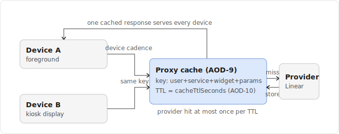
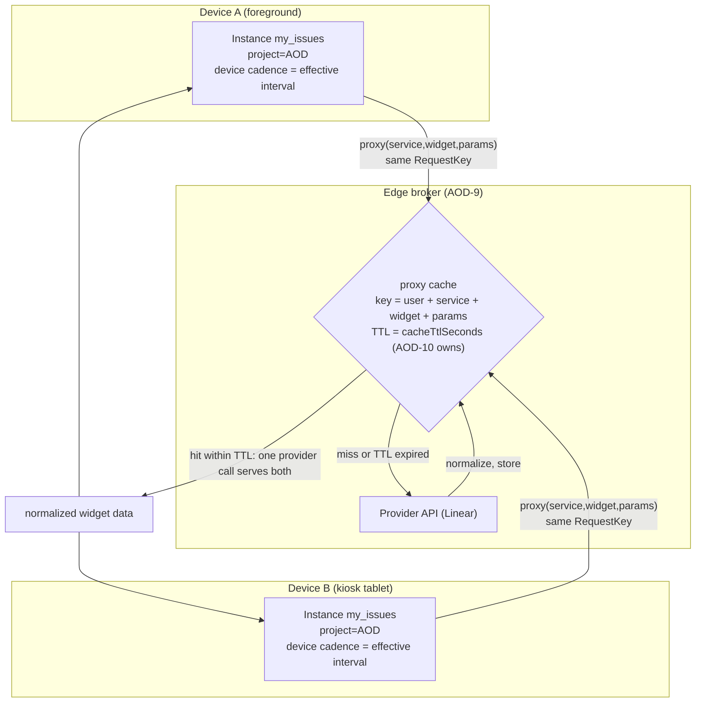
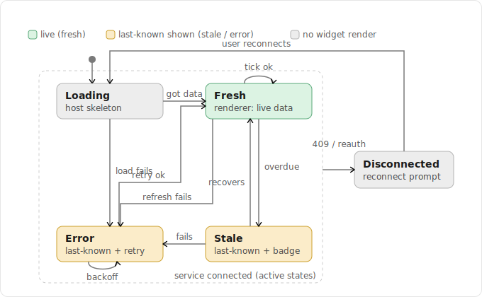
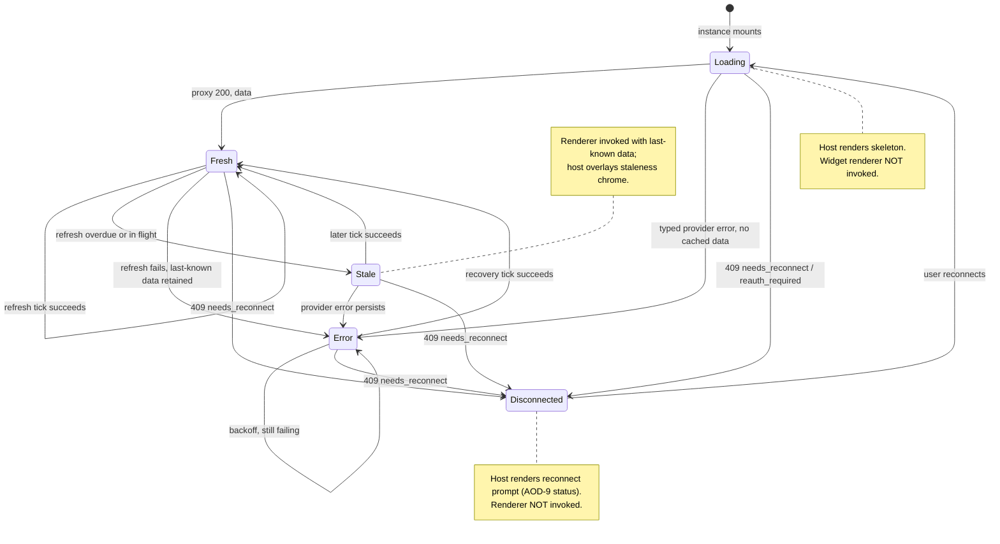

# Spec: Widget Model (Config, Refresh Interval, Sizes, Lifecycle)

> Status: draft for review, 2026-06-18. Tracked by [AOD-10](https://linear.app/thexap/issue/AOD-10) (`type:spec`). Fills the interior of the four interfaces framed by [AOD-8](https://linear.app/thexap/issue/AOD-8) (registry contract, Done). Couples to [AOD-9](https://linear.app/thexap/issue/AOD-9) (OAuth/token model, Done) for the proxy cache and the connection status enum. Builds on the locked decisions in [AOD-6](https://linear.app/thexap/issue/AOD-6) (v1 service set) and [AOD-7](https://linear.app/thexap/issue/AOD-7) (free-form layout).

## 1. Purpose and scope

AOD-8 fixed the four interfaces of the product (`ServiceDefinition`, `WidgetDefinition`, `WidgetInstance`, `DashboardLayout`) and the registry seam that binds them. It deliberately left the **interior** of the widget model open and pointed it here (AOD-8 section 13). This spec defines that interior: how a widget instance is configured, scheduled, sized, and rendered through its lifecycle.

This spec does not restate the AOD-8 interfaces. It imports them by reference and adds the members and rules AOD-8 deferred. Every type below either refines an AOD-8 type whose shape AOD-8 already fixed (the config field kinds, `RefreshInterval`, `WidgetSize`, the render contract) or is a new supporting type that the generic engine consumes.

**In scope (the AOD-10 work list from AOD-8 section 13 and the issue body):**

- **Config model**: the full `WidgetConfigFieldKind` interior, validation rules, and how `remote-options` resolves choices through the proxy.
- **Refresh model**: the cadence model, the effective-interval computation, coalescing, backoff on provider errors, foreground vs kiosk vs background cadence, and the coupling to the AOD-9 proxy cache TTLs.
- **Size system**: the canonical `WidgetSize` catalogue and the rule reconciling a declared size class with a free-form `LayoutRect` (AOD-7).
- **Render lifecycle**: the states loading, fresh, stale, error, disconnected; their mapping onto the AOD-9 connection status enum and the 409 `needs_reconnect` path; and which states the generic host renders versus what reaches the widget's own renderer.
- **Day/night dimming**: the widget-level hook and mechanism only.

**Out of scope (neighbors, named so the frame is clear):**

- **Kiosk policy** is [AOD-11](https://linear.app/thexap/issue/AOD-11). AOD-10 owns the widget-level *mechanism*: the refresh cadence model and the day/night dimming hooks a widget exposes. AOD-11 owns *policy*: keeping the screen on, screen-pinning, the wall-mount layout profile, and the actual day/night schedule that drives the hooks. This spec defines the hooks and the inputs they read; it does not set the schedule or the kiosk runtime behavior.
- **Entitlement gating** is [AOD-12](https://linear.app/thexap/issue/AOD-12) (blocked by the billing decision [AOD-3](https://linear.app/thexap/issue/AOD-3)). "Faster refresh intervals" and "premium widget packs" are gated levers AOD-12 owns. This spec leaves a clean seam where a tier-driven refresh floor and a pack-gating tag plug in, and it never decides tier boundaries or enforcement.
- **The specific v1 widget subset** is [AOD-4](https://linear.app/thexap/issue/AOD-4) (open). This spec does not depend on it. Candidate widgets (Linear "My issues", Claude usage, Weather, Clock) appear only as illustrative examples.
- **Backend mechanics** (token exchange, refresh, encryption, the proxy itself, the typed error result) are AOD-9's and are referenced, not redefined.
- **Per-widget data shapes** (the normalized payload each `render` receives) are noted as the contract point but left per-widget; this spec fixes the lifecycle around the data, not each widget's schema.

## 2. Locked context this builds on

| Source | What it locks | How this spec uses it |
|---|---|---|
| [AOD-8](https://linear.app/thexap/issue/AOD-8) §6 | `WidgetDefinition` fields (`title`, `supportedSizes`, `defaultRefresh`, `configSchema`, `render`); the `WidgetConfigSchema` / `WidgetConfigField` / `WidgetConfigFieldKind` types including `remote-options`; `RefreshInterval = { seconds } | "manual"`; `WidgetSize`. | These are the boundary. Section 4 fills the config-field interiors; section 5 fixes the size catalogue; section 6 gives `RefreshInterval` its semantics. None are redefined. |
| [AOD-8](https://linear.app/thexap/issue/AOD-8) §6.1 | The render contract: the generic host renders all connection, loading, and error chrome; `render` is invoked only with live, normalized data; props are `{ data, config, size }`. | Section 7 honors this exactly: the renderer is reached only when there is data; every other state is host chrome. The dimming hook (section 8) is additive and does not change the `render` props. |
| [AOD-8](https://linear.app/thexap/issue/AOD-8) §7 | `WidgetInstance` carries `config`, a free-form `LayoutRect`, and a chosen `size` class. | Section 5 defines how `size` and `rect` reconcile; section 4 defines what `config` must conform to. |
| [AOD-9](https://linear.app/thexap/issue/AOD-9) §9, §11 | The `proxy` data path with a short cache "keyed by user, service, widget, and params"; AOD-9 §11 explicitly defers "Cache TTLs per widget" to AOD-10. | Section 6 owns the per-widget cache TTL value and policy; AOD-9's proxy enforces it. The TTL is the cross-device coalescing and provider-protection mechanism. |
| [AOD-9](https://linear.app/thexap/issue/AOD-9) §5.1, §9 | The connection status enum `connected / reauth_required / error / disconnected`; the proxy returns `409 needs_reconnect`; provider errors (429, 5xx, timeout) are mapped to a typed result. | Section 7 maps the render lifecycle onto this enum; section 6.4 ties backoff to the typed error result and routes 409 to the disconnected state. |
| [AOD-7](https://linear.app/thexap/issue/AOD-7) | Layout is free-form drag-and-resize; the instance carries an arbitrary rect. | Section 5's reconciliation rule treats the rect as authoritative and the size class as a quantized render hint derived from it. |
| [AOD-6](https://linear.app/thexap/issue/AOD-6) | v1 service set: Linear, Google Calendar, Claude usage, Weather, Clock. | Linear "My issues" with a "which project" config is the running worked example (section 9), consistent with AOD-8. |

Provider specifics (Linear's exact rate limits, refresh behavior, the option-listing query) are confirmed when each integration is wired, per AOD-9 section 11. This spec fixes the model, not the current values.

## 3. How this spec extends AOD-8 (additive surface)

AOD-10 adds optional members to two AOD-8 interfaces and refines the deferred supporting types. The AOD-8 fields are unchanged and are not repeated here; only the additions are shown.

```typescript
import type {
  WidgetDefinition, WidgetInstance, WidgetConfigSchema, WidgetConfigField,
  WidgetConfigFieldKind, RefreshInterval, WidgetSize, LayoutRect,
  ServiceId, WidgetTypeId,
} from "./architecture-registry"; // AOD-8

// WidgetDefinition (AOD-8 §6) gains author-declared model detail. Intersection,
// not redefinition: every AOD-8 field still applies.
type WidgetModel = WidgetDefinition & {
  cacheTtlSeconds?: number;   // provider-facing floor (AOD-9 proxy cache); defaults from defaultRefresh (§6.1)
  minRefreshSeconds?: number; // device-cadence floor the author asserts for cost/sanity; default 0 (§6.2)
  dimsWithAmbient?: boolean;  // default true: host applies the global dim overlay; false: widget self-manages (§8)
};

// WidgetInstance (AOD-8 §7) gains an optional per-placement cadence override.
type ConfiguredInstance = WidgetInstance & {
  refresh?: RefreshInterval;  // overrides defaultRefresh for this placement, clamped by the floors (§6.2)
};
```

Two new server-side concepts are referenced by the config and refresh models and are described where they are used:

- An **option-source allow-list** that extends the AOD-9 / AOD-8 endpoint allow-list with config-time queries (section 4.3).
- A **per-widget cache TTL** that AOD-9 §11 deferred here and the AOD-9 proxy enforces (section 6.1).

Nothing here touches the layout engine, the widget host, Settings, or the broker internals. These are data and rules the generic engine already reads; the seam from AOD-8 holds.

## 4. Per-instance config model

A `WidgetDefinition` declares a `configSchema` (AOD-8 §6). A `WidgetInstance` stores `config: Record<string, unknown>` whose values must conform to that schema. This section fixes the field-kind interiors, the validation rules, and how `remote-options` resolves.

### 4.1 Field kinds

AOD-8 fixed the kind set: `"string" | "number" | "boolean" | "enum" | "remote-options"`. AOD-10 gives each kind the extras AOD-8 deferred. Each field below intersects the AOD-8 `WidgetConfigField` base (`key`, `label`, `kind`, `required`); only the added members are shown.

```typescript
type Choice = { value: string; label: string };

type ConfigField = WidgetConfigField & (
  | { kind: "string";  default?: string;  minLength?: number; maxLength?: number; pattern?: string; placeholder?: string }
  | { kind: "number";  default?: number;  min?: number; max?: number; step?: number }
  | { kind: "boolean"; default?: boolean }
  | { kind: "enum";    default?: string;  options: Choice[] }              // static, in-bundle choices
  | { kind: "remote-options"; default?: string | string[]; source: RemoteOptionsSource; multiple?: boolean }
);

// How a remote-options field fetches its choices at config time (§4.3).
interface RemoteOptionsSource {
  optionSource: string;   // an allow-listed config-time query id, resolved server-side. Never a client URL.
  params?: Record<string, unknown>; // optional static params for the query (e.g. a team filter)
}
```

`enum` is for choices known at build time (for example a Linear status filter: open / in progress / done). `remote-options` is for choices that exist only in the user's account and must be fetched (for example *which* of the user's Linear projects). The two are distinct so the config form can render `enum` offline and only `remote-options` needs a network round trip.

### 4.2 Validation rules

Config is validated against the schema. Validation runs in three places, with the server as the only line of trust:

1. **Config form (client), on save.** Immediate field-level feedback. This is UX, not security.
2. **Render time (client), on each load.** Re-validates `remote-options` membership, because a remotely sourced value can rot (a chosen project is deleted). A value that no longer resolves drives the lifecycle (section 7), not a silent failure.
3. **Proxy (server), on every call.** The proxy treats `config` as untrusted params, builds only the allow-listed call, and bounds the values itself (AOD-9 §9). The client validation never substitutes for this.

The validator is a single generic function over the schema:

```typescript
type ConfigError = { key: string; message: string };
type ConfigValidation =
  | { ok: true;  values: Record<string, unknown> }      // normalized (defaults applied, types coerced)
  | { ok: false; errors: ConfigError[] };

function validateConfig(
  schema: WidgetConfigSchema,
  raw: Record<string, unknown>,
  resolvedOptions?: Record<string, Choice[]>, // resolved remote-options sets, keyed by field key, when available
): ConfigValidation;
```

Rules, applied per field:

| Kind | Rules |
|---|---|
| any | If `required` and the value is absent or empty, error. If absent and not required, apply `default` (if any) and skip the rest. |
| `string` | Must be a string. Enforce `minLength`, `maxLength`, `pattern` when present. |
| `number` | Must be a finite number. Enforce `min`, `max`, and `step` (value aligns to `min + k*step`) when present. |
| `boolean` | Must be a boolean. |
| `enum` | Value must be one of `options[].value`. |
| `remote-options` | If `multiple`, value is an array; else a scalar. Each value must be a string. **Membership**: if `resolvedOptions[key]` is provided, every value must appear in it; if it is not provided (the resolver could not be reached), the field validates as `unverified` rather than failing, and membership is re-checked at render. |

The `unverified` allowance is deliberate: a provider outage at save time must not block the user from saving a config, and a provider outage at render time must not erase a previously valid selection. Membership is enforced whenever the option set is actually available, and an unresolvable value surfaces as a lifecycle state, never as a crash.

### 4.3 Resolving `remote-options` through the proxy

A `remote-options` field needs the user's real choices, which live behind the same credential wall as widget data. It resolves through the AOD-9 proxy seam, not through a client-supplied URL, so AOD-9 goal 5 (no open relay) and AOD-8's "the client never supplies the query" both hold.

The mechanism extends the AOD-9 / AOD-8 endpoint allow-list with a parallel **option-source allow-list**, server-side, keyed by an `optionSource` id:

```typescript
// Server-side only, alongside ServiceBackendConfig.endpoints (AOD-8 §5.2). Never shipped to the client.
// Each option source is an allow-listed, read-only query that returns picker choices.
interface OptionSourceConfig {
  method: "GET" | "POST";
  path: string;                          // allow-listed, like a widget endpoint
  // a server-side mapper turns the provider response into Choice[]; the client never sees the raw query.
}
type OptionSourceRegistry = Record<ServiceId, Record<string /* optionSource */, OptionSourceConfig>>;
```

Resolution flow at config time:

1. The config form encounters a `remote-options` field. The widget's parent service is already connected (AOD-8 invariant 2 forbids adding a widget for a disconnected service), so a credential exists.
2. The form calls the proxy with `{ service, optionSource, params }` and the user's JWT. This is the same authenticated, RLS-scoped path as a widget read; only the registry table consulted differs.
3. The proxy attaches the user's stored secret server-side, calls the allow-listed option-source endpoint, maps the response to `Choice[]`, and returns it. It may cache the result on the same short TTL as widget data (section 6.1), keyed by user, service, and option source.
4. The form renders the choices. The user's selection is stored on the instance as the field value (for `remote-options` that is the stable id, for example the Linear `projectId`, not the display label, so a rename does not invalidate it).

If the proxy returns a typed provider error, the config form shows a retry affordance rather than an empty picker; if it returns `409 needs_reconnect`, the form routes to the reconnect prompt, the same disconnected treatment as the dashboard (section 7).

### 4.4 Config integrity over time

A stored `remote-options` value is a snapshot of a remote set that can change after the widget is placed. The rule: **a value that no longer resolves does not silently fail; it surfaces as a lifecycle state.** On render, the host re-resolves membership (using the cached option set when fresh). If the stored value is gone (project deleted, calendar removed), the instance enters a **needs-config** condition, rendered by the host as a "Reconfigure this widget" prompt (a flavor of the error state in section 7, distinct from a transient provider error and distinct from a disconnect). The renderer is not invoked, because there is no valid data request to make. This keeps a rotted selection from masquerading as an empty or broken widget.

## 5. Sizes and free-form reconciliation

AOD-8 left two facts to reconcile: a widget declares `supportedSizes: WidgetSize[]` (the discrete layouts it can draw), while an instance carries a free-form `rect` (AOD-7) and a chosen `size` class. AOD-8's `WidgetSize` set (`"small" | "medium" | "large" | "wide" | "tall"`) is the canonical catalogue; AOD-10 fixes what each class means and how it reconciles with the rect.

### 5.1 The canonical size catalogue

A size class is a **role and aspect hint, not a pixel size**. Because the layout is free-form, the class does not pin dimensions; it tells the renderer which of its discrete layouts to draw and gives the picker a sensible default rect. Geometry is expressed in nominal layout units (the abstract grid the layout engine measures rects in; the concrete coordinate space is an AOD-7 detail).

| Class | Nominal units (w x h) | Nominal aspect (w/h) | Role |
|---|---|---|---|
| `small` | 1 x 1 | 1.00 | A single glance: one number, one icon, the time. |
| `medium` | 2 x 1 | 2.00 | The default card: a short list or a labeled value. |
| `large` | 2 x 2 | 1.00 | A rich card: a chart, a multi-row list. |
| `wide` | 3 x 1 | 3.00 | A banner: a long single-row strip (agenda, sparkline). |
| `tall` | 1 x 2 | 0.50 | A column: a vertical list in a narrow slot. |

```typescript
interface SizeClassSpec {
  id: WidgetSize;
  nominalW: number; nominalH: number; // default placement geometry, in layout units
  nominalAspect: number;              // nominalW / nominalH, used by the reconciliation rule
}
const SIZE_CATALOGUE: Record<WidgetSize, SizeClassSpec> = {
  small:  { id: "small",  nominalW: 1, nominalH: 1, nominalAspect: 1.0 },
  medium: { id: "medium", nominalW: 2, nominalH: 1, nominalAspect: 2.0 },
  large:  { id: "large",  nominalW: 2, nominalH: 2, nominalAspect: 1.0 },
  wide:   { id: "wide",   nominalW: 3, nominalH: 1, nominalAspect: 3.0 },
  tall:   { id: "tall",   nominalW: 1, nominalH: 2, nominalAspect: 0.5 },
};
```

### 5.2 The reconciliation rule

> **The rect is authoritative for geometry; the size class is a quantized render hint chosen as the nearest supported class to the rect.**

This is the single rule that makes a free-form rect and a discrete `supportedSizes` set coexist. A widget can only ever draw one of the layouts it declared, but the user can drag the box to any size.

- **On placement.** Adding a widget places it at the nominal rect of a default class (the first entry of `supportedSizes`, or `medium` if that is supported). `instance.size` is set to that class.
- **On resize (AOD-7 drag).** The user changes `rect` freely. The host recomputes `instance.size` as the supported class whose nominal geometry is closest to the new rect, and the renderer redraws at that class. The rect stays exactly what the user dragged; only the class snaps.
- **On load.** If a persisted `instance.size` is no longer in the widget's `supportedSizes` (the widget changed its declared set in an update), the host recomputes it from the rect. Persisting `size` keeps the render stable across reloads; recomputing on drift keeps it valid.

```typescript
// Pick the supported class whose nominal geometry best matches the rect.
// Distance combines aspect-ratio proximity (primary) and area proximity (tiebreak).
function reconcileSize(rect: LayoutRect, supported: WidgetSize[]): WidgetSize {
  const aspect = rect.w / rect.h;
  const area = rect.w * rect.h;
  let best: WidgetSize = supported[0];
  let bestScore = Infinity;
  for (const id of supported) {
    const c = SIZE_CATALOGUE[id];
    const aspectTerm = Math.abs(Math.log(aspect / c.nominalAspect));      // scale-invariant aspect distance
    const areaTerm = Math.abs(Math.log(area / (c.nominalW * c.nominalH))); // scale-invariant area distance
    const score = aspectTerm + 0.25 * areaTerm; // aspect dominates; area breaks ties
    if (score < bestScore) { bestScore = score; best = id; }
  }
  return best;
}
```

The renderer is always handed a `size` drawn from `supportedSizes` (AOD-8 §6.1 render props are unchanged: `{ data, config, size }`). It is responsible for filling its given rect gracefully within that class; the host does not stretch a fixed layout. If the user drags the rect to an aspect far from every supported class, the nearest class is still chosen, and the host MAY offer AOD-7 resize affordances that snap toward supported aspects. Whether to snap is an AOD-7 interaction choice; the authoritative contract for the renderer is "draw the nearest supported class into the given rect."

## 6. Refresh model

Refresh has two layers that must not be conflated:

- **Device cadence**: how often a device asks the proxy for a widget. Governed by the effective interval (section 6.2). This is a UX freshness target.
- **Provider cadence**: how often the proxy actually calls the third-party provider. Governed by the per-widget cache TTL (section 6.1), enforced by AOD-9's proxy. This is cost and rate-limit protection.

Separating them is what lets many instances on many devices poll a widget while the provider is hit at most once per TTL.

### 6.1 Provider cadence: the per-widget cache TTL (couples to AOD-9)

AOD-9 §9 gives the proxy a short cache "keyed by user, service, widget, and params" and §11 defers the per-widget TTL value to AOD-10. AOD-10 owns it:

```typescript
// Effective provider-facing TTL for a widget. AOD-9's proxy reads and enforces this.
function cacheTtlSeconds(def: WidgetModel): number {
  if (def.cacheTtlSeconds != null) return def.cacheTtlSeconds; // author override
  const d = def.defaultRefresh;
  const base = d === "manual" ? 300 : d.seconds; // manual widgets still cache, so cross-device reads coalesce
  return Math.max(15, base);                      // never hammer a provider faster than every 15s
}
```

Within one TTL, every request for the same `(user, service, widget, params)` is served from cache, so the provider is hit at most once per TTL regardless of how many instances or devices asked. A device interval *faster* than the TTL just returns cached data until the TTL elapses; it does not increase provider load. This is the lever AOD-12 can scope by tier: a premium tier can carry a lower `cacheTtlSeconds` to fetch genuinely fresher data, which is a server-side entitlement input (section 10), not an AOD-10 value.

### 6.2 Device cadence: the effective interval and the entitlement floor (AOD-12 seam)

The interval a device actually schedules is the widget default or the per-instance override, clamped from below by every applicable floor:

```typescript
function effectiveInterval(
  def: WidgetModel,
  instance: ConfiguredInstance,
  entitlementFloorSeconds: number, // supplied by AOD-12; 0 when no tier limit applies
): RefreshInterval {
  const desired = instance.refresh ?? def.defaultRefresh;
  if (desired === "manual") return "manual";
  const floor = Math.max(def.minRefreshSeconds ?? 0, entitlementFloorSeconds);
  return { seconds: Math.max(desired.seconds, floor) };
}
```

The clamp order is fixed: the user (or widget default) asks for a cadence; the widget's own `minRefreshSeconds` and the entitlement floor raise it if needed; the faster of the two floors wins. AOD-10 defines this clamp point and the argument; AOD-12 supplies `entitlementFloorSeconds` and decides its value. AOD-10 never reads a tier.

### 6.3 Coalescing

Two layers of coalescing keep redundant work down:

- **Same device, single-flight.** Concurrent requests with the same key share one in-flight call. The key is canonical so the device and the server agree:

  ```typescript
  type RequestKey = string; // `${serviceId}:${widgetType}:${canonicalParams}`
  function requestKey(serviceId: ServiceId, widgetType: WidgetTypeId, params: Record<string, unknown>): RequestKey {
    // canonicalParams = JSON of params with keys sorted, so {a,b} and {b,a} hash equal.
    const canonical = JSON.stringify(params, Object.keys(params).sort());
    return `${serviceId}:${widgetType}:${canonical}`;
  }
  ```

  Two instances of "My issues" for the same project on one screen issue one request, not two.

- **Across devices, via the proxy cache.** The phone and the kiosk tablet produce the same `RequestKey`, so the proxy cache (section 6.1) serves the second from the first within the TTL. One provider call serves every device.

### 6.4 Backoff on provider errors (ties to AOD-9 typed results)

AOD-9 §9 maps provider failures to a typed result and returns `409 needs_reconnect` for a dead credential. AOD-10 consumes both:

```typescript
// Mirrors the typed result AOD-9 §9 returns. AOD-9 defines it; AOD-10 reacts to it.
type ProxyError =
  | { kind: "rate_limited"; retryAfterSeconds?: number } // 429
  | { kind: "provider_unavailable" }                     // 5xx / timeout
  | { kind: "needs_reconnect" };                          // 409: credential dead

function nextDelaySeconds(baseSeconds: number, consecutiveFailures: number, err: ProxyError): number | "stop" {
  if (err.kind === "needs_reconnect") return "stop"; // not a backoff case: go to Disconnected (§7), stop polling
  if (err.kind === "rate_limited" && err.retryAfterSeconds != null) return err.retryAfterSeconds; // honor Retry-After
  const exp = baseSeconds * 2 ** Math.min(consecutiveFailures, 6); // cap the exponent
  return Math.min(exp, 1800); // cap backoff at 30 minutes; scheduler adds jitter
}
```

Rules:

- A typed provider error (`rate_limited`, `provider_unavailable`) moves the instance to the **error** lifecycle state. If last-known data exists, it stays on screen (rendered as stale plus an error indicator); the renderer still gets the data.
- The device scheduler replaces the normal cadence with exponential backoff and **full jitter** (a random fraction of the computed delay) so many instances and devices do not retry in lockstep after a shared outage. `consecutiveFailures` resets to zero on the next success.
- `rate_limited` with a `Retry-After` honors that value exactly, overriding the exponential curve.
- `needs_reconnect` (409) is not backoff. It is a credential failure: the instance moves to **disconnected**, polling stops, and the host shows a reconnect prompt until the user reconnects (section 7). This matches AOD-9's `reauth_required` connection status.

### 6.5 Foreground, kiosk, and background cadence

What the device scheduler can actually achieve depends on the app's run state, which is bounded by the mobile platforms. These bounds are load-bearing and were verified against current Expo and platform documentation on 2026-06-18 (section 12).

| Run state | What drives cadence | Achievable cadence | Notes |
|---|---|---|---|
| **Foreground** (app open, interactive) | On-device JS timers at the effective interval. | The effective interval, down to the floors. Seconds-to-minutes is fine. | Refresh pauses when the app backgrounds (`AppState` leaves `active`); on return to foreground, the host issues one immediate refresh of visible instances, then resumes timers. |
| **Kiosk** (screen kept awake, app pinned foreground) | The same on-device JS timers; the app simply never backgrounds. | The effective interval, continuously, all day. | This is "foreground that never ends." AOD-11 owns keeping the screen on and the app pinned; AOD-10 only relies on the foreground timer mechanism and reads a cadence profile (section 6.6). |
| **Background** (app not foreground, not kiosk) | `expo-background-task` over iOS `BGTaskScheduler` and Android `WorkManager`. | Best-effort, **no faster than ~15 minutes**, OS-scheduled, not guaranteed. | iOS decides timing by battery, network, and usage patterns and "may choose to run the task at a later time"; Android `WorkManager` enforces a 15-minute minimum periodic interval; both require battery and network. Treat background as cache-warming for the next glance, not a live cadence. |

The product consequence: the always-on auto-refresh promise is delivered by **kiosk mode**, where the screen stays on and the app stays foregrounded, so the on-device timer runs the real cadence. Outside kiosk and foreground, the OS caps refresh at coarse, best-effort intervals; the dashboard fetches fresh on the next foreground and otherwise relies on background top-ups. This is precisely why kiosk is the flagship feature and not a nice-to-have. AOD-10 does not implement kiosk (that is AOD-11); it states the bound that makes kiosk necessary and exposes the cadence-profile hook kiosk drives.

### 6.6 The cadence profile hook (AOD-11 seam) and manual refresh

The scheduler reads a cadence profile so the kiosk runtime can adjust cadence without the scheduler knowing anything about kiosk policy:

```typescript
type CadenceProfile = "foreground" | "kiosk"; // default "foreground". AOD-11 sets "kiosk" when the wall display is active.
```

AOD-10 defines the input and the default; AOD-11 decides when the profile is `kiosk` and may pair it with a kiosk-specific interval multiplier. The mechanism (an on-device timer reading an effective interval) is identical across profiles.

**Manual refresh.** A widget whose `RefreshInterval` is `"manual"` schedules no timer. It refreshes on mount, on return to foreground, and on an explicit user pull-to-refresh, and otherwise shows its last-known data with a "last updated" stamp. It never enters the stale state from a missed tick (there are no ticks), though it can still enter error or disconnected from a failed manual attempt.



<details>
<summary>Mermaid source</summary>



</details>

## 7. Render lifecycle states

A placed instance, on a given device, is always in exactly one view state. The five required states are loading, fresh, stale, error, and disconnected. This section fixes them, maps them onto the AOD-9 connection status enum and the 409 path, and states which states reach the widget's own renderer.

### 7.1 The states and their data

```typescript
type ConnectionStatus = "connected" | "reauth_required" | "error" | "disconnected"; // AOD-9 §5.1

type WidgetViewState =
  | { phase: "loading" }                                               // first load, no data yet
  | { phase: "fresh";        data: unknown; fetchedAt: number }        // data within the freshness window
  | { phase: "stale";        data: unknown; fetchedAt: number }        // data present but a due refresh has not succeeded
  | { phase: "error";        error: ProxyError; data?: unknown; fetchedAt?: number } // last refresh failed
  | { phase: "needs_config" }                                          // a remote-options value no longer resolves (§4.4)
  | { phase: "disconnected"; status: ConnectionStatus };               // service not usable; show reconnect
```

Freshness is defined against the effective interval: data is **fresh** while `now - fetchedAt < staleAfterSeconds`, where `staleAfterSeconds` is the effective interval in seconds (manual widgets are never auto-staled). When a due refresh has not produced new data past that window, the instance is **stale** but keeps showing the last-known data.

### 7.2 Mapping onto the AOD-9 connection status enum

| AOD-9 condition | Widget view state | What the user sees |
|---|---|---|
| `connected`, data fresh | `fresh` | Live data. |
| `connected`, due refresh overdue or in flight, data retained | `stale` | Last-known data with a subtle "updated Nm ago" chrome. |
| `connected`, proxy returns a typed error (429 / 5xx / timeout) | `error` | Last-known data plus an error indicator if data exists; a host error placeholder if not. Backoff runs (section 6.4). |
| `connected`, proxy returns `409 needs_reconnect` (credential died mid-session) | `disconnected` | "Reconnect <Service>" prompt. Polling stops. |
| `reauth_required` | `disconnected` | Same reconnect prompt. This is the steady-state form of the 409 path. |
| `error` (connection-level) | `disconnected` | Reconnect / fix-connection prompt. |
| `disconnected` | (instance removed) | Per AOD-8 invariant 3, disconnecting a service removes its instances from every layout; this is not a lingering view state on a live dashboard. The transient `disconnected` view exists only for a credential that died under a still-connected service (the 409 path) before the user has reconnected or removed it. |
| config: a `remote-options` value no longer resolves | `needs_config` | "Reconfigure this widget" prompt (section 4.4). Distinct from a provider error and from a disconnect. |

The distinction AOD-8 invariant 3 draws is preserved: a **disconnect** (the user removed the service) deletes the widgets; a **transient credential problem** (`reauth_required`, a 409) keeps the widget and shows a reconnect prompt.

### 7.3 What the host renders versus what reaches the renderer

This is the AOD-8 §6.1 contract made concrete: the generic host renders all connection, loading, and error chrome, and the widget's `render` is invoked only with live, normalized data.

```typescript
// The widget's own renderer is reached only when there is data to draw.
function invokesRenderer(s: WidgetViewState): boolean {
  return s.phase === "fresh" || s.phase === "stale"
      || (s.phase === "error" && s.data !== undefined);
}
```

| View state | Rendered by | Renderer invoked? |
|---|---|---|
| `loading` | Host skeleton | No |
| `fresh` | Widget `render(data, config, size)` | Yes |
| `stale` | Widget `render(...)` with last-known data; host overlays a staleness badge | Yes (data); the badge is host chrome |
| `error` with last-known data | Widget `render(...)` with last-known data; host overlays an error indicator | Yes (data); the indicator is host chrome |
| `error` without data | Host error placeholder | No |
| `needs_config` | Host "Reconfigure" prompt | No |
| `disconnected` | Host "Reconnect <Service>" prompt | No |

The renderer therefore never branches on auth state, loading, staleness, or errors. It receives `{ data, config, size }` and draws data. Staleness and error are surfaced by the host as overlay chrome on top of the last good render, so a glanceable display keeps showing the last known issues with a small "stale" dot rather than blanking out. This keeps widget authoring to "given data and a size, draw a card," exactly as AOD-8 intends.



<details>
<summary>Mermaid source</summary>



</details>

(The `needs_config` condition from section 4.4 is a host-rendered prompt reached from any state when render-time membership re-validation fails; it is omitted from the diagram to keep the core data lifecycle legible.)

## 8. Day/night dimming hooks (widget-level mechanism only)

The product calls for day/night auto-dimming so a wall display is not blasting light at night (product vision, Kiosk Mode). AOD-10 owns the **widget-level mechanism**: the signal a widget reads and how it can adapt. AOD-11 owns the **schedule**: when day flips to night and the dim curve, driven by the kiosk runtime.

The host provides an ambient signal to the dashboard subtree:

```typescript
type DaylightPhase = "day" | "night"; // AOD-11 decides the schedule that sets this
interface AmbientContext {
  phase: DaylightPhase;
  dimLevel: number; // 0..1; 0 = full brightness, 1 = maximum dim. AOD-11 sets the curve.
}
```

The mechanism has two parts, a default that needs zero widget code and an opt-in hook:

1. **Default: host global dim overlay.** The host applies `dimLevel` as a global brightness reduction across the dashboard. Every widget dims uniformly with no per-widget code, consistent with AOD-8 §6.1 (dimming is host chrome, not widget logic). A widget participates by default (`dimsWithAmbient` defaults to `true`).
2. **Opt-in: the `useAmbient()` hook.** A widget that wants to adapt its own rendering at night (a clock that shifts to a deep red, a chart that swaps to a low-light palette, a list that drops secondary detail) sets `dimsWithAmbient: false` and reads the signal:

   ```typescript
   // Provided by the host via React context. Additive: it does NOT change the AOD-8 §6.1
   // render props, which remain { data, config, size }. A widget MAY call this; it is not required to.
   function useAmbient(): AmbientContext;
   ```

   Setting `dimsWithAmbient: false` tells the host to skip the global overlay for that widget, because the widget takes responsibility for its own night appearance.

This defines the hook and the signal shape only. The day/night schedule, the dim curve, geolocation or fixed-time sunset, and the kiosk-only-versus-always question are AOD-11's. A non-kiosk foreground app may leave `dimLevel` at 0 (no dimming) and the same mechanism still applies; nothing here assumes kiosk.

## 9. Worked example: Linear "My issues" through config and every lifecycle state

This threads the model end to end with the running example: the Linear "My issues" widget configured by which project, consistent with AOD-8. It is the basis of the proposed acceptance criterion (section 11).

**Definition** (client half, the AOD-10 interior filled in):

```typescript
const myIssues: WidgetModel = {
  type: "my_issues",
  serviceId: "linear",
  title: "My Issues",
  supportedSizes: ["medium", "large", "tall"],
  defaultRefresh: { seconds: 300 },     // device asks every 5 min in foreground/kiosk
  cacheTtlSeconds: 120,                  // provider hit at most once per 2 min across all devices
  minRefreshSeconds: 60,                 // never poll Linear faster than once a minute, any tier
  dimsWithAmbient: true,                 // dims with the global overlay; no custom night rendering
  configSchema: {
    fields: [
      // remote-options: the user's real Linear projects, resolved through the proxy at config time
      { key: "projectId", label: "Project", kind: "remote-options", required: true,
        source: { optionSource: "linear_projects" } },
      // enum: a static status filter known at build time
      { key: "filter", label: "Show", kind: "enum", required: false, default: "open",
        options: [
          { value: "open", label: "Open" },
          { value: "in_progress", label: "In progress" },
          { value: "all", label: "All assigned" },
        ] },
    ],
  },
  render: MyIssuesCard, // AOD-8 leaf component; receives { data, config, size }
};
```

**Config.** Linear is connected (AOD-8 invariant 2), so the user can add the widget. The config form renders two fields. `projectId` is `remote-options`: the form calls `proxy({ service: "linear", optionSource: "linear_projects" })`, which attaches the user's token server-side, calls the allow-listed projects query, and returns `Choice[]`. The user picks "alwaysOnDashboard"; the stable project id is stored, not the label. `filter` is an `enum` rendered offline; the user leaves the default "open". `validateConfig` passes: `projectId` is required and present and a member of the resolved set, `filter` is one of its options. The instance persists `config = { projectId: "...", filter: "open" }`.

**Sizes.** The widget is placed at the nominal `medium` rect (first supported class); `instance.size = "medium"`. The user drags it into a tall, narrow slot on the wall layout. `reconcileSize(rect, ["medium","large","tall"])` finds the new rect's aspect closest to `tall` and sets `instance.size = "tall"`; `MyIssuesCard` redraws as a vertical list. The rect remains exactly what the user dragged.

**Refresh.** With no tier limit, `effectiveInterval` is `max(300, max(60, 0)) = 300s`. The phone and the kiosk tablet both schedule a 300s device cadence and produce the same `RequestKey` (`linear:my_issues:{filter,projectId}`). The proxy cache TTL is 120s, so across both devices Linear is called at most once every 120s; the second device's tick inside the window is served from cache.

**Every lifecycle state**, in order:

1. **loading.** On first mount the instance has no data. The host shows a skeleton; `MyIssuesCard` is not invoked.
2. **fresh.** The proxy returns the normalized issue list. The host invokes `MyIssuesCard({ data, config, size: "tall" })`. `fetchedAt` is now; the card is fresh.
3. **stale.** A 300s tick lands during a brief network drop and does not complete. Once `now - fetchedAt` passes 300s with no new data, the host marks the view stale: `MyIssuesCard` keeps drawing the last issue list, and the host overlays "updated 6m ago". The renderer still gets the data; the badge is host chrome.
4. **error.** The next tick reaches Linear, which returns 429. AOD-9 maps it to `{ kind: "rate_limited", retryAfterSeconds: 30 }`. The view becomes `error` with the last-known data retained: the card still shows the issues, the host adds an error dot, and the scheduler waits 30s (honoring `Retry-After`) before retrying instead of the normal 300s. `consecutiveFailures` would drive exponential backoff with jitter if the failures continued.
5. **disconnected.** The user revokes the app's Linear token at Linear. The next proxy call returns `409 needs_reconnect`. The view becomes `disconnected`; the host replaces the card with "Reconnect Linear" and stops polling. This is the steady-state `reauth_required` connection status from AOD-9.
6. **recovery.** The user taps Reconnect and completes the AOD-9 OAuth flow. The connection returns to `connected`; the instance transitions `disconnected -> loading -> fresh` and `MyIssuesCard` draws live issues again.

**Config integrity (the needs_config edge).** If, instead, the chosen project is deleted in Linear, the stored `projectId` no longer resolves. On the next render the host's membership re-check (section 4.4) fails and the instance enters `needs_config`: the host shows "Reconfigure this widget" rather than an empty list, and `MyIssuesCard` is not invoked until a valid project is chosen.

## 10. Seams left open (named, not decided)

| Seam | Owner | What AOD-10 leaves clean |
|---|---|---|
| Refresh floor by tier | [AOD-12](https://linear.app/thexap/issue/AOD-12) | `effectiveInterval` takes `entitlementFloorSeconds` (section 6.2). AOD-12 supplies the number; AOD-10 never reads a tier. |
| Fresher provider data by tier | [AOD-12](https://linear.app/thexap/issue/AOD-12) | `cacheTtlSeconds` can be entitlement-scoped server-side (section 6.1). AOD-10 sets the default and the clamp; AOD-12 sets any premium override. |
| Premium widget packs | [AOD-12](https://linear.app/thexap/issue/AOD-12) | Gating which `WidgetDefinition`s are registrable/addable is an entitlement check at the registry. AOD-10 does not tag packs or enforce gating. |
| Cadence profile | [AOD-11](https://linear.app/thexap/issue/AOD-11) | The scheduler reads `CadenceProfile` (section 6.6). AOD-11 decides when it is `kiosk` and any kiosk interval multiplier. |
| Day/night schedule and dim curve | [AOD-11](https://linear.app/thexap/issue/AOD-11) | AOD-10 defines `AmbientContext` and the `useAmbient()` hook (section 8). AOD-11 sets `phase` and `dimLevel` over time. |
| Keep-screen-on, pinning, wall layout | [AOD-11](https://linear.app/thexap/issue/AOD-11) | AOD-10 relies on the foreground timer mechanism and states the background bound (section 6.5). AOD-11 keeps the device foregrounded. |
| The v1 widget subset | [AOD-4](https://linear.app/thexap/issue/AOD-4) | Examples are illustrative. AOD-10 depends on none of them. |
| Per-widget normalized data shapes | per-widget, AOD-8 §6.1 | AOD-10 fixes the lifecycle around `data: unknown`; each widget's payload schema is defined with the widget. |

## 11. Proposed acceptance

The AOD-10 issue body has a Must-cover list but no explicit acceptance line. Proposed acceptance for this spec (call out for confirmation):

> 1. A widget's per-instance config is validated against its declared `WidgetConfigSchema` across the full field-kind set, including a `remote-options` field that resolves its choices through the proxy at config time; invalid config is rejected with field-level errors, and an unresolvable remote value surfaces as a lifecycle state rather than a silent failure.
> 2. The Linear "My issues" widget (configured by which project) is walked through every render lifecycle state (loading, fresh, stale, error, disconnected, plus the needs-config edge), with each state's host-versus-renderer responsibility and its AOD-9 connection-status mapping shown.
> 3. The size-class-to-rect reconciliation rule and the foreground / kiosk / background cadence bounds are stated as concrete rules and functions, and the refresh/lifecycle state machine is given as a validated diagram.

Where each is met:

| Acceptance clause | Where |
|---|---|
| Config validated against the schema; full field-kind set; `remote-options` via proxy; unresolvable value as lifecycle state | Sections 4.1, 4.2, 4.3, 4.4; worked example section 9 |
| Worked-example widget through all lifecycle states with host-vs-renderer and AOD-9 mapping | Sections 7.1, 7.2, 7.3; worked example section 9 |
| Size reconciliation rule; cadence bounds; validated state machine | Sections 5.2, 6.5; diagrams in sections 6.6 and 7.3 |
| Concrete TypeScript definitions that extend (not restate) the AOD-8 interfaces | Section 3 and throughout |
| Day/night dimming hook (mechanism only) | Section 8 |
| Clean seams for AOD-11 and AOD-12; no dependence on AOD-4 | Section 10 |

## 12. Verified platform claims

The cadence bounds in section 6.5 are load-bearing, so the platform facts behind them were verified against current documentation on 2026-06-18:

- Expo's background execution module is **`expo-background-task`** (built on iOS `BGTaskScheduler` and Android `WorkManager`); it supersedes the deprecated `expo-background-fetch`.
- **Android `WorkManager`** enforces a **15-minute minimum** for periodic background work; the task "will execute sometime after the interval has passed, provided the specified conditions are met."
- **iOS `BGTaskScheduler`** chooses run time by "battery level, network availability, and the user's usage patterns" and "may choose to run the task at a later time"; the requested interval is advisory, not guaranteed.
- Background tasks on both platforms run only with sufficient battery (or while charging) and network.

The conclusion drawn (reliable sub-15-minute auto-refresh requires foreground or kiosk; background is best-effort cache-warming) follows directly from these limits. If a build-time detail differs from the above, fix the build against the current docs, then update this section.

## 13. References

- [AOD-10](https://linear.app/thexap/issue/AOD-10): this spec's tracking issue.
- [AOD-8](https://linear.app/thexap/issue/AOD-8): registry contract. Frames the four interfaces this spec fills; section 13 is the work list.
- [AOD-9](https://linear.app/thexap/issue/AOD-9): OAuth broker and token model. Owns the proxy, the cache mechanism, the connection status enum, and the typed error result this spec couples to.
- [AOD-7](https://linear.app/thexap/issue/AOD-7): free-form layout. The rect this spec reconciles size classes against.
- [AOD-6](https://linear.app/thexap/issue/AOD-6): v1 service set. Source of the Linear running example.
- [AOD-11](https://linear.app/thexap/issue/AOD-11): Kiosk Mode. Owns the policy this spec exposes hooks for.
- [AOD-12](https://linear.app/thexap/issue/AOD-12): freemium entitlement model. Owns the gated levers this spec leaves seams for.
- [AOD-4](https://linear.app/thexap/issue/AOD-4): v1 widget subset (open). Not depended on.
- [`docs/specs/architecture-registry.md`](architecture-registry.md): the AOD-8 spec whose interior this fills.
- [`docs/specs/oauth-token-model.md`](oauth-token-model.md): the AOD-9 spec this couples to.
- [`docs/product-vision.md`](../product-vision.md): core architecture concept, widget catalog, Kiosk Mode.
- [`docs/engineering-process.md`](../engineering-process.md): the `type:spec` lifecycle and the `docs/specs/` convention.
- Expo BackgroundTask documentation, verified 2026-06-18: [docs.expo.dev/versions/latest/sdk/background-task](https://docs.expo.dev/versions/latest/sdk/background-task/). iOS/Android background-task constraints corroborated by the React Native background-tasks comparison (72Technologies, 2026): [72technologies.com/blog/react-native-background-tasks-ios-android-2026](https://www.72technologies.com/blog/react-native-background-tasks-ios-android-2026).
